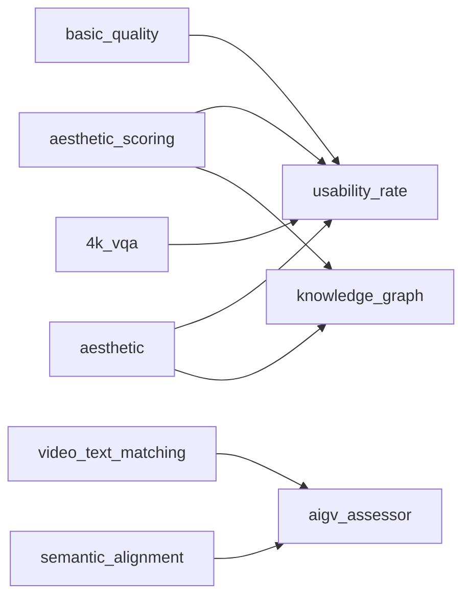

# Ayase Metrics Reference

> **Version 0.1.17** · Generated 2026-03-20 17:01 · **312 modules** · **349 metrics**
>
> `ayase modules docs -o METRICS.md` to regenerate
>
> Tests: `pytest tests/` (light) · `pytest tests/ --full` (with ML models)

## Summary


### Modules by Category


### By Input Type


### Speed Tiers


### Backend Usage


### Top Required Packages


### Recommended Module Presets

**Quick Scan** — Fast quality triage (~1s/sample, CPU-only)
```toml
modules = ['basic', 'metadata', 'exposure', 'letterbox']
```

**Dataset Curation** — Clean & deduplicate datasets for training
```toml
modules = ['basic', 'aesthetic', 'dedup', 'nsfw', 'watermark_classifier', 'brisque', 'metadata', 'embedding', 'diversity_selection']
```

**Video Generation Eval** — Evaluate text-to-video model outputs (VBench-style)
```toml
modules = ['aesthetic', 'subject_consistency', 'background_consistency', 'temporal_flickering', 'motion_smoothness', 'clip_iqa', 'video_text_matching', 'dover', 'ti_si']
```

**Codec Comparison** — Compare video codec quality (needs reference)
```toml
modules = ['vmaf', 'ssimulacra2', 'psnr_hvs', 'ms_ssim', 'butteraugli', 'cambi', 'codec_specific_quality']
```

**Audio Quality** — Speech/audio quality assessment
```toml
modules = ['audio_pesq', 'audio_utmos', 'dnsmos', 'audio_si_sdr', 'audio_estoi', 'visqol']
```

### Benchmark Coverage

| Benchmark | Status |
|-----------|--------|
| VBench (16/16) | Covered |
| VBench-2.0 (5/5) | Covered |
| EvalCrafter (17/17) | Covered |
| ChronoMagic-Bench (2/2) | Covered |
| T2V-CompBench (7/7) | Covered |
| DEVIL (4/4) | Covered |

### Field Collisions

Multiple modules write to the same QualityMetrics field:

| Field | Writers |
|-------|---------|
| `aesthetic_score` | `aesthetic`, `aesthetic_scoring` |
| `artifacts_score` | `basic_quality`, `imaging_quality` |
| `blur_score` | `basic_quality`, `cpbd` |
| `camera_motion_score` | `camera_motion`, `stabilized_motion` |
| `clip_score` | `semantic_alignment`, `video_text_matching` |
| `clip_temp` | `clip_temporal`, `video_text_matching` |
| `confidence_score` | `unqa`, `llm_descriptive_qa` |
| `dover_score` | `dover`, `internvqa`, `unified_vqa` |
| `gamival_score` | `nr_gvqm`, `gamival` |
| `is_score` | `inception_score`, `object_detection` |
| `motion_score` | `motion`, `stabilized_motion` |
| `noise_score` | `basic_quality`, `imaging_quality` |
| `technical_score` | `basic_quality`, `4k_vqa` |
| `text_overlay_score` | `text_detection`, `text_overlay` |

### Orphaned QualityMetrics Fields

43 fields in `QualityMetrics` model that no module populates:

- `artfid_score` (fr_quality)
- `audio_quality_score` (audio)
- `avqt_score` (fr_quality)
- `compbench_action` (alignment)
- `compbench_attribute` (alignment)
- `compbench_numeracy` (alignment)
- `compbench_object_rel` (alignment)
- `compbench_overall` (alignment)
- `compbench_scene` (alignment)
- `compbench_spatial` (alignment)
- `compressed_vqa_hdr` (fr_quality)
- `compression_score` (basic)
- `deepvqa_score` (fr_quality)
- `depth_score` (spatial)
- `erqa_score` (fr_quality)
- `fad_score` (distribution)
- `fgd_score` (distribution)
- `fmd_score` (distribution)
- `fvd` (distribution)
- `fvmd` (distribution)
- `graphsim_score` (fr_quality)
- `jedi` (distribution)
- `kvd` (distribution)
- `lpips` (fr_quality)
- `msswd_score` (distribution)
- `pcqm_score` (fr_quality)
- `pointssim_score` (fr_quality)
- `psnr` (fr_quality)
- `psnr99` (fr_quality)
- `psnr_div` (fr_quality)
- `pvmaf_score` (fr_quality)
- `rankdvqa_score` (fr_quality)
- `sfid_score` (distribution)
- `ssim` (fr_quality)
- `st_mad` (fr_quality)
- `stream_spatial` (distribution)
- `stream_temporal` (distribution)
- `temporal_consistency` (temporal)
- `usability_score` (meta)
- `vendi_score` (distribution)
- `vfips_score` (fr_quality)
- `worldscore` (distribution)
- `ws_ssim` (fr_quality)

### Module Dependency Graph

Modules that read QualityMetrics fields written by other modules:



### Score Direction Reference

| Field | Direction | Range | Category |
|-------|-----------|-------|----------|
| `action_confidence` | — | 0-100 | scene |
| `action_score` | ↑ higher=better | 0-100 | scene |
| `adadqa_score` | ↑ higher=better | higher=better | nr_quality |
| `aesthetic_score` | ↑ higher=better | — | aesthetic |
| `afine_score` | ↑ higher=better | — | nr_quality |
| `ahiq` | ↑ higher=better | higher=better | fr_quality |
| `ai_generated_probability` | — | — | safety |
| `aigcvqa_aesthetic` | — | — | nr_quality |
| `aigcvqa_alignment` | — | — | alignment |
| `aigcvqa_technical` | — | — | nr_quality |
| `aigv_alignment` | — | — | alignment |
| `aigv_dynamic` | — | — | motion |
| `aigv_static` | — | — | nr_quality |
| `aigv_temporal` | — | — | temporal |
| `aigvqa_score` | ↑ higher=better | higher=better | nr_quality |
| `arniqa_score` | ↑ higher=better | higher=better | nr_quality |
| `artifacts_score` | ↑ higher=better | — | basic |
| `audiobox_enjoyment` | — | — | audio |
| `audiobox_production` | — | — | audio |
| `auto_caption` | — | — | text |
| `av_sync_offset` | — | — | audio |
| `avg_scene_duration` | — | — | scene |
| `background_consistency` | ↑ higher=better | — | temporal |
| `banding_severity` | ↓ lower=better | lower=better | production |
| `bas_score` | ↑ higher=better | higher=better | motion |
| `bias_score` | ↑ higher=better | — | safety |
| `blip_bleu` | — | — | alignment |
| `blur_score` | ↑ higher=better | — | basic |
| `brightness` | — | — | basic |
| `brisque` | ↓ lower=better | 0-100, lower=better | nr_quality |
| `butteraugli` | ↓ lower=better | lower=better | fr_quality |
| `bvqi_score` | ↑ higher=better | higher=better | nr_quality |
| `c3dvqa_score` | ↑ higher=better | — | fr_quality |
| `cambi` | ↓ lower=better | 0-24, lower=better | codec |
| `camera_jitter_score` | ↓ lower=better | 0-1, 1=stable | motion |
| `camera_motion_score` | ↑ higher=better | — | motion |
| `cdc_score` | ↓ lower=better | lower=better | temporal |
| `celebrity_id_score` | ↑ higher=better | — | face |
| `cgvqm` | ↑ higher=better | higher=better | fr_quality |
| `chronomagic_ch_score` | ↓ lower=better | 0-1, lower=fewer | temporal |
| `chronomagic_mt_score` | ↑ higher=better | 0-1, higher=better | temporal |
| `ciede2000` | ↓ lower=better | lower=better | fr_quality |
| `ckdn_score` | ↑ higher=better | — | fr_quality |
| `clifvqa_score` | ↑ higher=better | higher=better | nr_quality |
| `clip_iqa_score` | ↑ higher=better | 0-1, higher=better | nr_quality |
| `clip_score` | ↑ higher=better | — | alignment |
| `clip_temp` | — | — | temporal |
| `clipvqa_score` | ↑ higher=better | higher=better | nr_quality |
| `cnniqa_score` | ↑ higher=better | — | nr_quality |
| `codec_artifacts` | ↓ lower=better | lower=better | codec |
| `codec_efficiency` | ↑ higher=better | higher=better | codec |
| `color_grading_score` | ↑ higher=better | — | production |
| `color_score` | ↑ higher=better | — | scene |
| `commonsense_score` | ↑ higher=better | 0-1, higher=better | scene |
| `compare2score` | ↑ higher=better | — | nr_quality |
| `compression_artifacts` | — | 0-100 | basic |
| `confidence_score` | ↑ higher=better | — | meta |
| `contrast` | — | — | basic |
| `contrique_score` | ↑ higher=better | higher=better | nr_quality |
| `conviqt_score` | ↑ higher=better | higher=better | nr_quality |
| `count_score` | ↑ higher=better | — | scene |
| `cover_aesthetic` | — | — | aesthetic |
| `cover_score` | ↑ higher=better | higher=better | nr_quality |
| `cover_semantic` | — | — | aesthetic |
| `cover_technical` | — | — | nr_quality |
| `cpp_psnr` | ↑ higher=better | dB, higher=better | fr_quality |
| `crave_score` | ↑ higher=better | higher=better | nr_quality |
| `creativity_score` | ↑ higher=better | 0-1, higher=better | aesthetic |
| `crfiqa_score` | ↑ higher=better | higher=better | face |
| `cw_ssim` | ↑ higher=better | 0-1, higher=better | fr_quality |
| `davis_f` | ↑ higher=better | higher=better | temporal |
| `davis_j` | ↑ higher=better | higher=better | temporal |
| `dbcnn_score` | ↑ higher=better | higher=better | nr_quality |
| `deepdc_score` | ↓ lower=better | lower=better | nr_quality |
| `deepfake_probability` | — | — | safety |
| `deepwsd_score` | ↓ lower=better | — | fr_quality |
| `delta_ictcp` | ↓ lower=better | lower=better | hdr |
| `depth_anything_consistency` | ↑ higher=better | — | spatial |
| `depth_anything_score` | ↑ higher=better | — | spatial |
| `depth_quality` | ↑ higher=better | higher=better | spatial |
| `depth_temporal_consistency` | ↑ higher=better | higher=better | temporal |
| `detection_score` | ↑ higher=better | — | scene |
| `discovqa_score` | ↑ higher=better | higher=better | nr_quality |
| `dists` | ↓ lower=better | 0-1, lower=more similar | fr_quality |
| `dmm` | ↑ higher=better | higher=better | fr_quality |
| `dnsmos_bak` | ↑ higher=better | 1-5, higher=better | audio |
| `dnsmos_overall` | ↑ higher=better | 1-5, higher=better | audio |
| `dnsmos_sig` | ↑ higher=better | 1-5, higher=better | audio |
| `dover_aesthetic` | — | — | aesthetic |
| `dover_score` | ↑ higher=better | higher=better | nr_quality |
| `dover_technical` | — | — | nr_quality |
| `dreamsim` | ↓ lower=better | lower=more similar | fr_quality |
| `dsg_score` | ↑ higher=better | higher=better | alignment |
| `dynamics_controllability` | — | — | motion |
| `dynamics_range` | — | — | motion |
| `estoi_score` | ↑ higher=better | 0-1, higher=better | audio |
| `exposure_consistency` | ↑ higher=better | — | production |
| `face_consistency` | ↑ higher=better | — | face |
| `face_count` | — | — | face |
| `face_expression_smoothness` | — | — | face |
| `face_identity_consistency` | ↑ higher=better | 0-1 | face |
| `face_iqa_score` | ↑ higher=better | higher=better | face |
| `face_landmark_jitter` | ↓ lower=better | lower=better | face |
| `face_quality_score` | ↑ higher=better | higher=better | face |
| `face_recognition_score` | ↑ higher=better | 0-1, higher=better | face |
| `fast_vqa_score` | ↑ higher=better | — | nr_quality |
| `faver_score` | ↑ higher=better | higher=better | nr_quality |
| `finevq_score` | ↑ higher=better | — | nr_quality |
| `flicker_score` | ↓ lower=better | lower=better | temporal |
| `flip_score` | ↓ lower=better | 0-1, lower=better | fr_quality |
| `flolpips` | — | — | fr_quality |
| `flow_coherence` | — | 0-1 | temporal |
| `flow_score` | ↑ higher=better | — | motion |
| `focus_quality` | ↑ higher=better | — | production |
| `fsim` | ↑ higher=better | 0-1, higher=better | fr_quality |
| `funque_score` | ↑ higher=better | — | fr_quality |
| `gamival_score` | ↑ higher=better | higher=better | nr_quality |
| `gmsd` | ↓ lower=better | lower=better | fr_quality |
| `gop_quality` | ↑ higher=better | higher=better | codec |
| `gradient_detail` | — | 0-100 | scene |
| `grafiqs_score` | ↑ higher=better | higher=better | face |
| `harmful_content_score` | ↑ higher=better | — | safety |
| `hdr_quality` | ↑ higher=better | — | hdr |
| `hdr_vdp` | ↑ higher=better | higher=better | hdr |
| `hdr_vqm` | — | — | hdr |
| `human_fidelity_score` | ↑ higher=better | 0-1, higher=better | scene |
| `hyperiqa_score` | ↑ higher=better | — | nr_quality |
| `i2v_clip` | — | 0-1 | i2v |
| `i2v_dino` | — | 0-1 | i2v |
| `i2v_lpips` | ↓ lower=better | 0-1, lower=better | i2v |
| `i2v_quality` | ↑ higher=better | 0-100 | i2v |
| `identity_loss` | ↓ lower=better | 0-1, lower=better | face |
| `ilniqe` | ↓ lower=better | lower=better | nr_quality |
| `is_score` | ↑ higher=better | — | distribution |
| `judder_score` | ↓ lower=better | lower=better | temporal |
| `jump_cut_score` | ↑ higher=better | 0-1, 1=no cuts | temporal |
| `kvq_score` | ↑ higher=better | — | nr_quality |
| `laion_aesthetic` | — | 0-10 | aesthetic |
| `letterbox_ratio` | — | 0-1, 0=no borders | basic |
| `liqe_score` | ↑ higher=better | higher=better | nr_quality |
| `lmmvqa_score` | ↑ higher=better | higher=better | nr_quality |
| `lpdist_score` | ↓ lower=better | lower=better | audio |
| `lse_c` | ↑ higher=better | higher=better | temporal |
| `lse_d` | ↓ lower=better | lower=better | temporal |
| `maclip_score` | ↑ higher=better | higher=better | nr_quality |
| `mad` | ↓ lower=better | lower=better | fr_quality |
| `magface_score` | ↑ higher=better | higher=better | face |
| `maniqa_score` | ↑ higher=better | higher=better | nr_quality |
| `max_cll` | — | — | hdr |
| `max_fall` | — | — | hdr |
| `maxvqa_score` | ↑ higher=better | higher=better | nr_quality |
| `mc360iqa_score` | ↑ higher=better | higher=better | nr_quality |
| `mcd_score` | ↓ lower=better | dB, lower=better | audio |
| `mdtvsfa_score` | ↑ higher=better | higher=better | nr_quality |
| `mdvqa_distortion` | ↑ higher=better | higher=better | nr_quality |
| `mdvqa_motion` | ↑ higher=better | higher=better | nr_quality |
| `mdvqa_semantic` | ↑ higher=better | higher=better | nr_quality |
| `memoryvqa_score` | ↑ higher=better | higher=better | nr_quality |
| `mm_pcqa_score` | ↑ higher=better | higher=better | nr_quality |
| `modularbvqa_score` | ↑ higher=better | higher=better | nr_quality |
| `motion_ac_score` | ↑ higher=better | — | motion |
| `motion_score` | ↑ higher=better | — | motion |
| `motion_smoothness` | ↑ higher=better | 0-1, higher=better | motion |
| `movie_score` | ↑ higher=better | — | fr_quality |
| `ms_ssim` | — | 0-1 | fr_quality |
| `multiview_consistency` | ↑ higher=better | higher=better | spatial |
| `musiq_score` | ↑ higher=better | higher=better | nr_quality |
| `naturalness_score` | ↑ higher=better | — | nr_quality |
| `nemo_quality_label` | ↑ higher=better | — | meta |
| `nemo_quality_score` | ↑ higher=better | 0-1 | meta |
| `nima_score` | ↑ higher=better | 1-10, higher=better | aesthetic |
| `niqe` | ↓ lower=better | lower=better | nr_quality |
| `nlpd` | ↓ lower=better | lower=better | fr_quality |
| `noise_score` | ↑ higher=better | — | basic |
| `nrqm` | ↑ higher=better | higher=better | nr_quality |
| `nsfw_score` | ↑ higher=better | — | safety |
| `oavqa_score` | ↑ higher=better | higher=better | audio |
| `object_permanence_score` | ↑ higher=better | — | temporal |
| `ocr_area_ratio` | — | — | text |
| `ocr_cer` | ↓ lower=better | 0-1, lower=better | text |
| `ocr_fidelity` | ↑ higher=better | 0-100, higher=better | text |
| `ocr_score` | ↑ higher=better | — | text |
| `ocr_wer` | ↓ lower=better | 0-1, lower=better | text |
| `p1203_mos` | — | 1-5 | audio |
| `p1204_mos` | — | 1-5 | codec |
| `paq2piq_score` | ↑ higher=better | — | nr_quality |
| `pc_d1_psnr` | — | dB | fr_quality |
| `pc_d2_psnr` | — | dB | fr_quality |
| `pesq_score` | ↑ higher=better | -0.5 to 4.5, higher=better | audio |
| `physics_score` | ↑ higher=better | 0-1, higher=better | motion |
| `pi_score` | ↓ lower=better | PIRM challenge, lower=better | nr_quality |
| `pieapp` | ↓ lower=better | lower=better | fr_quality |
| `piqe` | ↓ lower=better | lower=better | nr_quality |
| `playback_speed_score` | ↑ higher=better | — | motion |
| `presresq_score` | ↑ higher=better | higher=better | nr_quality |
| `promptiqa_score` | ↑ higher=better | — | nr_quality |
| `provqa_score` | ↑ higher=better | higher=better | nr_quality |
| `psnr_hvs` | ↑ higher=better | dB, higher=better | fr_quality |
| `psnr_hvs_m` | ↑ higher=better | dB, higher=better | fr_quality |
| `ptlflow_motion_score` | ↑ higher=better | — | motion |
| `ptmvqa_score` | ↑ higher=better | higher=better | nr_quality |
| `pu_psnr` | ↑ higher=better | dB, higher=better | hdr |
| `pu_ssim` | ↑ higher=better | 0-1, higher=better | hdr |
| `qalign_aesthetic` | ↑ higher=better | 1-5, higher=better | aesthetic |
| `qalign_quality` | ↑ higher=better | 1-5, higher=better | nr_quality |
| `qclip_score` | ↑ higher=better | higher=better | nr_quality |
| `qcn_score` | ↑ higher=better | — | nr_quality |
| `qualiclip_score` | ↑ higher=better | higher=better | nr_quality |
| `raft_motion_score` | ↑ higher=better | — | motion |
| `ram_tags` | — | — | scene |
| `rapique_score` | ↑ higher=better | higher=better | nr_quality |
| `rqvqa_score` | ↑ higher=better | — | nr_quality |
| `s_psnr` | ↑ higher=better | dB, higher=better | fr_quality |
| `sama_score` | ↑ higher=better | higher=better | nr_quality |
| `saturation` | — | — | basic |
| `scene_complexity` | — | — | scene |
| `scene_stability` | — | — | temporal |
| `sd_score` | ↑ higher=better | 0-1 | alignment |
| `sdr_quality` | ↑ higher=better | — | hdr |
| `semantic_consistency` | ↑ higher=better | higher=better | temporal |
| `serfiq_score` | ↑ higher=better | higher=better | face |
| `si_sdr_score` | ↑ higher=better | dB, higher=better | audio |
| `siamvqa_score` | ↑ higher=better | higher=better | nr_quality |
| `simplevqa_score` | ↑ higher=better | higher=better | nr_quality |
| `spatial_information` | — | higher=more detail | basic |
| `spectral_entropy` | — | — | nr_quality |
| `spectral_rank` | — | — | nr_quality |
| `speedqa_score` | ↑ higher=better | higher=better | nr_quality |
| `sqi_score` | ↑ higher=better | — | nr_quality |
| `sr4kvqa_score` | ↑ higher=better | higher=better | nr_quality |
| `ssimc` | ↑ higher=better | higher=better | fr_quality |
| `ssimulacra2` | ↓ lower=better | 0-100, lower=better, JPEG XL standard | fr_quality |
| `st_greed_score` | ↑ higher=better | — | fr_quality |
| `st_lpips` | — | — | fr_quality |
| `stablevqa_score` | ↑ higher=better | higher=better | nr_quality |
| `stereo_comfort_score` | ↑ higher=better | higher=better | spatial |
| `strred` | ↓ lower=better | lower=better | fr_quality |
| `stutter_score` | ↓ lower=better | lower=better | temporal |
| `subject_consistency` | ↑ higher=better | 0-1, higher=better | temporal |
| `t2v_alignment` | — | — | alignment |
| `t2v_quality` | ↑ higher=better | — | nr_quality |
| `t2v_score` | ↑ higher=better | — | alignment |
| `t2veval_score` | ↑ higher=better | higher=better | alignment |
| `technical_score` | ↑ higher=better | — | basic |
| `temporal_information` | — | higher=more motion | basic |
| `text_overlay_score` | ↑ higher=better | 0-1 | text |
| `thqa_score` | ↑ higher=better | higher=better | nr_quality |
| `tifa_score` | ↑ higher=better | 0-1, higher=better | alignment |
| `tlvqm_score` | ↑ higher=better | — | nr_quality |
| `tonal_dynamic_range` | — | 0-100 | basic |
| `topiq_fr` | ↑ higher=better | higher=better | fr_quality |
| `topiq_score` | ↑ higher=better | higher=better | nr_quality |
| `trajan_score` | ↑ higher=better | — | motion |
| `tres_score` | ↑ higher=better | — | nr_quality |
| `uciqe_score` | ↑ higher=better | higher=better | nr_quality |
| `ugvq_score` | ↑ higher=better | higher=better | nr_quality |
| `uiqm_score` | ↑ higher=better | higher=better | nr_quality |
| `umtscore` | ↑ higher=better | — | alignment |
| `unique_score` | ↑ higher=better | — | nr_quality |
| `usability_rate` | — | — | meta |
| `utmos_score` | ↑ higher=better | 1-5, higher=better | audio |
| `vader_score` | ↑ higher=better | — | nr_quality |
| `vbliinds_score` | ↑ higher=better | higher=better | nr_quality |
| `video_atlas_score` | ↑ higher=better | — | nr_quality |
| `video_memorability` | — | — | nr_quality |
| `video_reward_score` | ↑ higher=better | — | alignment |
| `video_type` | — | — | scene |
| `video_type_confidence` | — | — | scene |
| `videoreward_mq` | — | — | motion |
| `videoreward_ta` | — | — | alignment |
| `videoreward_vq` | — | — | nr_quality |
| `videoscore_alignment` | ↑ higher=better | — | alignment |
| `videoscore_dynamic` | ↑ higher=better | — | motion |
| `videoscore_factual` | ↑ higher=better | — | alignment |
| `videoscore_temporal` | ↑ higher=better | — | temporal |
| `videoscore_visual` | ↑ higher=better | — | nr_quality |
| `videval_score` | ↑ higher=better | — | nr_quality |
| `vif` | — | — | fr_quality |
| `viideo_score` | ↓ lower=better | lower=better | nr_quality |
| `visqol` | ↑ higher=better | 1-5, higher=better | audio |
| `vmaf` | ↑ higher=better | 0-100, higher=better | fr_quality |
| `vmaf_4k` | ↑ higher=better | 0-100, higher=better | fr_quality |
| `vmaf_neg` | ↑ higher=better | no enhancement gain, 0-100, higher=better | fr_quality |
| `vmaf_phone` | ↑ higher=better | 0-100, higher=better | fr_quality |
| `vqa2_score` | ↑ higher=better | higher=better | nr_quality |
| `vqa_a_score` | ↑ higher=better | — | alignment |
| `vqa_score_alignment` | ↑ higher=better | — | alignment |
| `vqa_t_score` | ↑ higher=better | — | alignment |
| `vqathinker_score` | ↑ higher=better | higher=better | nr_quality |
| `vqinsight_score` | ↑ higher=better | higher=better | nr_quality |
| `vsfa_score` | ↑ higher=better | higher=better | nr_quality |
| `vsi_score` | ↑ higher=better | 0-1, higher=better | fr_quality |
| `vtss` | — | 0-1 | meta |
| `wadiqam_fr` | ↑ higher=better | higher=better | fr_quality |
| `wadiqam_score` | ↑ higher=better | higher=better | nr_quality |
| `warping_error` | ↓ lower=better | — | temporal |
| `watermark_probability` | — | — | safety |
| `watermark_strength` | — | — | safety |
| `white_balance_score` | ↑ higher=better | — | production |
| `world_consistency_score` | ↑ higher=better | higher=better | temporal |
| `ws_psnr` | ↑ higher=better | dB, higher=better | fr_quality |
| `xpsnr` | ↑ higher=better | dB, higher=better | fr_quality |
| `zoomvqa_score` | ↑ higher=better | higher=better | nr_quality |

### Deprecated Field Aliases

| Old Name | Maps To | Status |
|----------|---------|--------|
| `fid_score` | `—` | deprecated, writes discarded |
| `kid_score` | `—` | deprecated, writes discarded |
| `inception_score` | `is_score` | alias |
| `ssim_score` | `ssim` | alias |
| `psnr_score` | `psnr` | alias |
| `lpips_score` | `lpips` | alias |
| `alignment_score` | `clip_score` | alias |

### Static Health Checks

48 module(s) with warnings:

- `artfid`: no output fields and no validation issues
- `audio_visual_sync`: declares output fields but never assigns quality_metrics
- `avqt`: no output fields and no validation issues
- `basic`: declares output fields but never assigns quality_metrics
- `bd_rate`: no output fields and no validation issues
- `compressed_vqa_hdr`: no output fields and no validation issues
- `dataset_analytics`: no output fields and no validation issues
- `dedup`: no output fields and no validation issues
- `deepvqa`: no output fields and no validation issues
- `diversity_selection`: no output fields and no validation issues
- `dreamsim_metric`: declares output fields but never assigns quality_metrics
- `embedding`: no output fields and no validation issues
- `erqa`: no output fields and no validation issues
- `fad`: no output fields and no validation issues
- `fgd`: no output fields and no validation issues
- `flip_metric`: declares output fields but never assigns quality_metrics
- `fmd`: no output fields and no validation issues
- `fvd`: no output fields and no validation issues
- `fvmd`: no output fields and no validation issues
- `generative_distribution`: no output fields and no validation issues
- `generative_distribution_metrics`: no output fields and no validation issues
- `graphsim`: no output fields and no validation issues
- `jedi`: no output fields and no validation issues
- `jedi_metric`: no output fields and no validation issues
- `knowledge_graph`: no output fields and no validation issues
- `kvd`: no output fields and no validation issues
- `mad_metric`: declares output fields but never assigns quality_metrics
- `msswd`: no output fields and no validation issues
- `nlpd_metric`: declares output fields but never assigns quality_metrics
- `pcqm`: no output fields and no validation issues
- `pi_metric`: declares output fields but never assigns quality_metrics
- `pointssim`: no output fields and no validation issues
- `psnr99`: no output fields and no validation issues
- `psnr_div`: no output fields and no validation issues
- `pvmaf`: no output fields and no validation issues
- `rankdvqa`: no output fields and no validation issues
- `sfid`: no output fields and no validation issues
- `spectral`: declares output fields but never assigns quality_metrics
- `st_mad`: no output fields and no validation issues
- `stream_metric`: no output fields and no validation issues
- `t2v_compbench`: no output fields and no validation issues
- `text`: declares output fields but never assigns quality_metrics
- `umap_projection`: no output fields and no validation issues
- `unique_iqa`: declares output fields but never assigns quality_metrics
- `vendi`: no output fields and no validation issues
- `vfips`: no output fields and no validation issues
- `worldscore`: no output fields and no validation issues
- `ws_ssim`: no output fields and no validation issues

---

## Audio Quality (14 modules)

| Module | Type | Outputs | Speed | Test | Description |
|--------|------|---------|-------|------|-------------|
| `audio_estoi` | audio +ref | `estoi_score` | ⚡ fast | ✅⏳ | ESTOI speech intelligibility (full-reference) |
| `audio_lpdist` | audio +ref | `lpdist_score` | ⚡ fast | ✅⏳ | Log-Power Spectral Distance (full-reference audio) |
| `audio_mcd` | audio +ref | `mcd_score` | ⚡ fast | ✅⏳ | Mel Cepstral Distortion for TTS/VC quality (full-reference) |
| `audio_pesq` | audio +ref | `pesq_score` | ⚡ fast | ✅⏳ | PESQ speech quality (full-reference, ITU-T P.862) |
| `audio_si_sdr` | audio +ref | `si_sdr_score` | ⚡ fast | ✅⏳ | Scale-Invariant SDR for audio quality (full-reference) |
| `audio_text_alignment` | audio +cap | — | ⏱️ medium | ✅⏳ | Multimodal alignment check (Audio-Text) using CLAP |
| `audio_utmos` | audio | `utmos_score` | ⏱️ medium | ✅⏳ | UTMOS no-reference MOS prediction for speech quality |
| `audio_visual_sync` | audio | `av_sync_offset` | ⚡ fast | ✅⏳ | Audio-video synchronisation offset detection |
| `audiobox_aesthetics` | audio | `audiobox_production`, `audiobox_enjoyment` | ⚡ fast | ✅⏳ | Meta Audiobox Aesthetics audio quality (2025) |
| `av_sync` | audio | `av_sync_offset` | ⚡ fast | ✅⏳ | Audio-video synchronisation offset detection |
| `beat_alignment` | audio | `bas_score` | ⚡ fast | ✅⏳ | BAS beat alignment score — audio-motion sync (EDGE/CVPR 2023) |
| `dnsmos` | audio | `dnsmos_overall`, `dnsmos_sig`, `dnsmos_bak` | ⏱️ medium | ✅⏳ | DNSMOS non-intrusive audio quality (Microsoft, 1-5 MOS) |
| `fad` | audio | — | ⚡ fast | ✅⏳ | Frechet Audio Distance for audio generation (batch metric, 2019) |
| `lip_sync` | audio | `lse_d`, `lse_c` | ⚡ fast | ✅⏳ | LSE-D/LSE-C lip sync error (SyncNet/Wav2Lip, 2020) |

## Codec & Technical (3 modules)

| Module | Type | Outputs | Speed | Test | Description |
|--------|------|---------|-------|------|-------------|
| `codec_compatibility` | vid | — | ⚡ fast | ✅⏳ | Validates codec, pixel format, and container for ML dataloader compatibility |
| `codec_specific_quality` | vid | `codec_efficiency`, `gop_quality`, `codec_artifacts` | ⚡ fast | ✅⏳ | Codec-level efficiency, GOP quality, and artifact detection |
| `letterbox` | img/vid | `letterbox_ratio` | ⚡ fast | ✅⏳ | Border/letterbox detection (0-1, 0=no borders) |

## Depth (3 modules)

| Module | Type | Outputs | Speed | Test | Description |
|--------|------|---------|-------|------|-------------|
| `depth_anything` | img/vid | `depth_anything_score`, `depth_anything_consistency` | ⏱️ medium | ✅⏳ | Depth Anything V2 monocular depth estimation and consistency |
| `depth_consistency` | vid | `depth_temporal_consistency` | ⏱️ medium | ✅⏳ | Monocular depth temporal consistency |
| `depth_map_quality` | img/vid | `depth_quality` | ⏱️ medium | ✅⏳ | Monocular depth map quality (sharpness, completeness, edge alignment) |

## Face & Identity (5 modules)

| Module | Type | Outputs | Speed | Test | Description |
|--------|------|---------|-------|------|-------------|
| `face_fidelity` | img/vid | `face_count`, `face_quality_score` | ⚡ fast | ✅⏳ | Face detection and per-face quality assessment |
| `face_iqa` | img/vid | `face_iqa_score` | ⏱️ medium | ✅⏳ | Face-specific IQA via TOPIQ-face (GFIQA-trained, higher=better) |
| `face_landmark_quality` | vid | `face_landmark_jitter`, `face_expression_smoothness`, `face_identity_consistency` | ⚡ fast | ✅⏳ | Facial landmark jitter, expression smoothness, identity consistency |
| `identity_loss` | img/vid +ref | `identity_loss`, `face_recognition_score` | ⚡ fast | ✅⏳ | Face identity preservation metric (cosine distance/similarity vs reference) |
| `magface` | img/vid | `magface_score` | ⚡ fast | ✅⏳ | MagFace face magnitude quality (CVPR 2021) |

## Full-Reference & Distribution (44 modules)

| Module | Type | Outputs | Speed | Test | Description |
|--------|------|---------|-------|------|-------------|
| `ahiq` | img/vid +ref | `ahiq` | ⏱️ medium | ✅⏳ | Attention-based Hybrid IQA full-reference (higher=better) |
| `butteraugli` | img/vid +ref | `butteraugli` | ⚡ fast | ✅⏳ | Butteraugli perceptual distance (Google/JPEG XL, lower=better) |
| `ciede2000` | img/vid +ref | `ciede2000` | ⚡ fast | ✅⏳ | CIEDE2000 perceptual color difference (lower=better) |
| `ckdn` | img/vid +ref | `ckdn_score` | ⏱️ medium | ✅⏳ | CKDN knowledge distillation FR image quality |
| `cw_ssim` | img/vid +ref | `cw_ssim` | ⏱️ medium | ✅⏳ | Complex Wavelet SSIM full-reference metric (0-1, higher=better) |
| `deepwsd` | img/vid +ref | `deepwsd_score` | ⏱️ medium | ✅⏳ | DeepWSD Wasserstein distance FR image quality |
| `delta_ictcp` | img/vid +ref | `delta_ictcp` | ⚡ fast | ✅⏳ | Delta ICtCp HDR perceptual color difference (lower=better) |
| `dmm` | img/vid +ref | `dmm` | ⏱️ medium | ✅⏳ | DMM detail model metric full-reference (higher=better) |
| `dreamsim` | img/vid +ref | `dreamsim` | ⏱️ medium | ✅⏳ | DreamSim foundation model perceptual similarity (CLIP+DINO ensemble) |
| `dreamsim_metric` | img/vid +ref | `dreamsim` | ⚡ fast | ✅⏳ | DreamSim foundation model perceptual similarity (CLIP+DINO ensemble) |
| `flip` | img/vid +ref | `flip_score` | ⏱️ medium | ✅⏳ | NVIDIA FLIP perceptual difference (0-1, lower=better) |
| `flip_metric` | img/vid +ref | `flip_score` | ⚡ fast | ✅⏳ | NVIDIA FLIP perceptual difference (0-1, lower=better) |
| `flolpips` | vid | `flolpips` | ⏱️ medium | ✅⏳ | Flow-compensated perceptual distance (RAFT+LPIPS, Farneback+LPIPS, or MSE fallback) |
| `fvd` | vid +ref | — | ⏱️ medium | ✅⏳ | Fréchet Video Distance for video generation evaluation (batch metric) |
| `fvmd` | vid | — | ⚡ fast | ✅⏳ | Fréchet Video Motion Distance for motion quality evaluation (batch metric) |
| `hdr_vdp` | img/vid +ref | `hdr_vdp` | ⚡ fast | ✅⏳ | HDR-VDP visual difference predictor (higher=better) |
| `kvd` | vid | — | ⏱️ medium | ✅⏳ | Kernel Video Distance using Maximum Mean Discrepancy (batch metric) |
| `mad` | img/vid +ref | `mad` | ⏱️ medium | ✅⏳ | Most Apparent Distortion full-reference metric (lower=better) |
| `mad_metric` | img/vid +ref | `mad` | ⚡ fast | ✅⏳ | Most Apparent Distortion full-reference metric (lower=better) |
| `ms_ssim` | vid +ref | `ms_ssim` | ⏱️ medium | ✅⏳ | Multi-Scale SSIM perceptual similarity metric (full-reference) |
| `nlpd` | img/vid +ref | `nlpd` | ⏱️ medium | ✅⏳ | Normalized Laplacian Pyramid Distance full-reference (lower=better) |
| `nlpd_metric` | img/vid +ref | `nlpd` | ⚡ fast | ✅⏳ | Normalized Laplacian Pyramid Distance full-reference (lower=better) |
| `pc_psnr` | img/vid +ref | `pc_d1_psnr`, `pc_d2_psnr` | ⚡ fast | ✅⏳ | D1/D2 MPEG point cloud PSNR |
| `pieapp` | img/vid +ref | `pieapp` | ⏱️ medium | ✅⏳ | PieAPP full-reference perceptual error via pairwise preference (lower=better) |
| `pointssim` | img/vid +ref | — | ⚡ fast | ✅⏳ | PointSSIM structural similarity for point clouds (2020) |
| `psnr99` | img/vid +ref | — | ⚡ fast | ✅⏳ | PSNR99 worst-case region quality for super-resolution (FR, 2025) |
| `psnr_div` | img/vid +ref | — | ⚡ fast | ✅⏳ | PSNR_DIV motion-weighted PSNR for frame interpolation (ICIP 2025, FR) |
| `psnr_hvs` | img/vid +ref | `psnr_hvs`, `psnr_hvs_m` | ⚡ fast | ✅⏳ | PSNR-HVS + PSNR-HVS-M perceptually weighted PSNR (dB, higher=better) |
| `pvmaf` | img/vid +ref | — | ⚡ fast | ✅⏳ | Predictive VMAF ~35x faster via bitstream+pixel features (2024, 0-100) |
| `spherical_psnr` | img/vid +ref | `s_psnr`, `ws_psnr`, `cpp_psnr` | ⚡ fast | ✅⏳ | S-PSNR/WS-PSNR/CPP-PSNR spherical PSNR (MPEG/JVET) |
| `ssimc` | img/vid +ref | `ssimc` | ⏱️ medium | ✅⏳ | SSIM-C complex wavelet structural similarity FR (higher=better) |
| `ssimulacra2` | img/vid +ref | `ssimulacra2` | ⚡ fast | ✅⏳ | SSIMULACRA 2 perceptual distance (JPEG XL standard, lower=better) |
| `st_lpips` | vid | `st_lpips` | ⏱️ medium | ✅⏳ | Spatiotemporal perceptual video quality (ST-LPIPS model, LPIPS, or heuristic fallback) |
| `st_mad` | img/vid +ref | — | ⚡ fast | ✅⏳ | ST-MAD spatiotemporal MAD (TIP 2012) |
| `strred` | img/vid +ref | `strred` | ⚡ fast | ✅⏳ | STRRED reduced-reference temporal quality (ITU, lower=better) |
| `topiq_fr` | img/vid +ref | `topiq_fr` | ⏱️ medium | ✅⏳ | TOPIQ full-reference top-down semantics-to-distortion IQA (higher=better) |
| `vif` | img/vid +ref | `vif` | ⏱️ medium | ✅⏳ | Visual Information Fidelity metric (full-reference) |
| `vmaf` | vid +ref | `vmaf` | ⚡ fast | ✅⏳ | VMAF perceptual video quality metric (full-reference) |
| `vmaf_4k` | vid +ref | `vmaf_4k` | ⚡ fast | ✅⏳ | VMAF 4K model for UHD content (0-100, higher=better) |
| `vmaf_neg` | vid +ref | `vmaf_neg` | ⚡ fast | ✅⏳ | VMAF NEG no-enhancement-gain variant (0-100, higher=better) |
| `vmaf_phone` | vid +ref | `vmaf_phone` | ⚡ fast | ✅⏳ | VMAF phone model for mobile viewing (0-100, higher=better) |
| `wadiqam_fr` | img/vid +ref | `wadiqam_fr` | ⏱️ medium | ✅⏳ | WaDIQaM full-reference deep quality metric (higher=better) |
| `ws_ssim` | img/vid +ref | — | ⚡ fast | ✅⏳ | WS-SSIM weighted spherical SSIM |
| `xpsnr` | img/vid +ref | `xpsnr` | ⚡ fast | ✅⏳ | XPSNR perceptually weighted PSNR (Fraunhofer, dB, higher=better) |

## HDR & Color (4 modules)

| Module | Type | Outputs | Speed | Test | Description |
|--------|------|---------|-------|------|-------------|
| `hdr_metadata` | vid | `max_fall`, `max_cll` | ⚡ fast | ✅⏳ | MaxFALL + MaxCLL HDR static metadata analysis |
| `hdr_sdr_vqa` | vid | `hdr_quality`, `sdr_quality`, `technical_score` | ⚡ fast | ✅⏳ | HDR/SDR-aware video quality assessment |
| `pu_metrics` | img/vid +ref | `pu_psnr`, `pu_ssim` | ⚡ fast | ✅⏳ | PU-PSNR + PU-SSIM for HDR content (perceptually uniform) |
| `tonal_dynamic_range` | img/vid | `tonal_dynamic_range` | ⚡ fast | ✅⏳ | Luminance histogram tonal range (0-100) |

## Image-to-Video Reference (1 modules)

| Module | Type | Outputs | Speed | Test | Description |
|--------|------|---------|-------|------|-------------|
| `i2v_similarity` | vid +ref | `i2v_clip`, `i2v_dino`, `i2v_lpips`, `i2v_quality` | ⏱️ medium | ✅⏳ | Image-to-Video reference similarity using CLIP, DINOv2, and LPIPS (sliding window) |

## Motion & Temporal (23 modules)

| Module | Type | Outputs | Speed | Test | Description |
|--------|------|---------|-------|------|-------------|
| `advanced_flow` | vid | `flow_score` | ⏱️ medium | ✅⏳ | RAFT optical flow: flow_score (all consecutive pairs) |
| `background_consistency` | vid | `background_consistency` | ⏱️ medium | ✅⏳ | Background consistency using CLIP (all pairwise frame similarity) |
| `camera_jitter` | vid | `camera_jitter_score` | ⚡ fast | ✅⏳ | Camera jitter/shake detection (0-1, 1=stable) |
| `camera_motion` | vid | `camera_motion_score` | ⚡ fast | ✅⏳ | Analyzes camera motion stability (VMBench) using Homography |
| `clip_temporal` | vid | `clip_temp`, `face_consistency` | ⏱️ medium | ✅⏳ | CLIP temporal consistency + face/identity consistency (EvalCrafter clip_temp & face_consistency) |
| `flicker_detection` | vid | `flicker_score` | ⚡ fast | ✅⏳ | Detects temporal luminance flicker |
| `flow_coherence` | vid | `flow_coherence` | ⚡ fast | ✅⏳ | Bidirectional optical flow consistency (0-1, higher=coherent) |
| `judder_stutter` | vid | `judder_score`, `stutter_score` | ⚡ fast | ✅⏳ | Detects judder (uneven cadence) and stutter (duplicate frames) |
| `jump_cut` | vid | `jump_cut_score` | ⚡ fast | ✅⏳ | Jump cut / abrupt transition detection (0-1, 1=no cuts) |
| `kandinsky_motion` | vid | — | ⏱️ medium | ✅⏳ | Video/Camera Motion Analysis using Kandinsky Video Tools (VideoMAE-V2) |
| `motion` | vid | `motion_score` | ⚡ fast | ✅⏳ | Analyzes motion dynamics (optical flow, flickering) |
| `motion_amplitude` | vid | `motion_ac_score` | ⏱️ medium | ✅⏳ | Motion amplitude classification vs caption (motion_ac_score via RAFT) |
| `motion_smoothness` | vid | `motion_smoothness` | ⏱️ medium | ✅⏳ | Motion smoothness via RIFE VFI reconstruction error (VBench) |
| `object_permanence` | vid | `object_permanence_score` | ⚡ fast | ✅⏳ | Object tracking consistency (ID switches, disappearances) |
| `playback_speed` | vid | `playback_speed_score` | ⚡ fast | ✅⏳ | Playback speed normality detection (1.0=normal) |
| `ptlflow_motion` | vid | `ptlflow_motion_score` | ⏱️ medium | ✅⏳ | ptlflow optical flow motion scoring (dpflow model) |
| `raft_motion` | vid | `raft_motion_score` | ⏱️ medium | ✅⏳ | RAFT optical flow motion scoring (torchvision) |
| `scene_detection` | vid | `scene_stability`, `avg_scene_duration` | ⚡ fast | ✅⏳ | Scene stability metric — penalises rapid cuts (0-1, higher=more stable) |
| `stabilized_motion` | vid | `motion_score`, `camera_motion_score` | ⚡ fast | ✅⏳ | Calculates motion scores with camera stabilization (ORB+Homography) |
| `subject_consistency` | vid | `subject_consistency` | ⏱️ medium | ✅⏳ | Subject consistency using DINOv2-base (all pairwise frame similarity) |
| `temporal_flickering` | vid | `warping_error` | ⏱️ medium | ✅⏳ | Warping Error using RAFT optical flow with occlusion masking |
| `temporal_style` | vid | — | ⚡ fast | ✅⏳ | Analyzes temporal style (Slow Motion, Timelapse, Speed) |
| `vfr_detection` | vid | — | ⚡ fast | ✅⏳ | Variable Frame Rate (VFR) and jitter detection |

## No-Reference Quality (168 modules)

| Module | Type | Outputs | Speed | Test | Description |
|--------|------|---------|-------|------|-------------|
| `4k_vqa` | vid | `hdr_quality`, `sdr_quality`, `technical_score` | ⚡ fast | ✅⏳ | Memory-efficient quality assessment for 4K+ videos |
| `action_recognition` | vid +cap | `action_confidence`, `action_score` | ⏱️ medium | ✅⏳ | Recognizes human actions (VideoMAE / UMT) - Supports Heavy Models |
| `adadqa` | img/vid | `adadqa_score` | ⚡ fast | ✅⏳ | Ada-DQA adaptive diverse quality feature VQA (ACM MM 2023) |
| `aesthetic` | img/vid | `aesthetic_score`, `vqa_a_score` | ⏱️ medium | ✅⏳ | Estimates aesthetic quality using Aesthetic Predictor V2.5 |
| `aesthetic_scoring` | img/vid | `aesthetic_score` | ⏱️ medium | ✅⏳ | Calculates aesthetic score (1-10) using LAION-Aesthetics MLP |
| `afine` | img/vid | `afine_score` | ⏱️ medium | ✅⏳ | A-FINE adaptive fidelity-naturalness IQA (CVPR 2025) |
| `aigcvqa` | img/vid +cap | `aigcvqa_technical`, `aigcvqa_aesthetic`, `aigcvqa_alignment` | ⚡ fast | ✅⏳ | AIGC-VQA holistic 3-branch AIGC perception (CVPRW 2024) |
| `arniqa` | img/vid | `arniqa_score` | ⏱️ medium | ✅⏳ | ARNIQA no-reference image quality assessment |
| `artfid` | img/vid +ref | — | ⚡ fast | ✅⏳ | ArtFID style transfer quality (FR, 2022, lower=better) |
| `audio` | vid | — | ⚡ fast | ✅⏳ | Validates audio stream quality and presence |
| `avqt` | img/vid +ref | — | ⚡ fast | ✅⏳ | Apple AVQT perceptual video quality (full-reference) |
| `background_diversity` | img/vid | — | ⚡ fast | ✅⏳ | Checks background complexity (entropy) to detect concept bleeding |
| `basic` | img/vid | `blur_score`, `brightness`, `contrast`, `saturation`, `noise_score`, `artifacts_score`, `technical_score`, `vqa_t_score`, `gradient_detail` | ⚡ fast | ✅⏳ | Comprehensive technical quality assessment (blur, noise, artifacts, contrast) |
| `basic_quality` | img/vid | `blur_score`, `brightness`, `contrast`, `saturation`, `noise_score`, `artifacts_score`, `technical_score`, `vqa_t_score`, `gradient_detail` | ⚡ fast | ✅⏳ | Comprehensive technical quality assessment (blur, noise, artifacts, contrast) |
| `bd_rate` | img/vid | — | ⚡ fast | ✅⏳ | BD-Rate codec comparison (dataset-level, negative%=better) |
| `brisque` | img/vid | `brisque` | ⏱️ medium | ✅⏳ | BRISQUE no-reference image quality (lower=better) |
| `bvqi` | img/vid | `bvqi_score` | ⏱️ medium | ✅⏳ | BVQI zero-shot blind video quality index (ICME 2023) |
| `cambi` | vid | `cambi` | ⚡ fast | ✅⏳ | CAMBI banding/contouring detector (Netflix, 0-24, lower=better) |
| `cdc` | vid | `cdc_score` | ⚡ fast | ✅⏳ | CDC color distribution consistency for video colorization (2024) |
| `celebrity_id` | img/vid | `celebrity_id_score` | ⚡ fast | ✅⏳ | Face identity verification using DeepFace (EvalCrafter celebrity_id_score) |
| `clifvqa` | img/vid | `clifvqa_score` | ⚡ fast | ✅⏳ | CLiF-VQA human feelings VQA via CLIP (2024) |
| `clipvqa` | img/vid | `clipvqa_score` | ⏱️ medium | ✅⏳ | CLIPVQA CLIP-based spatiotemporal VQA (TIP 2024) |
| `cnniqa` | img/vid | `cnniqa_score` | ⏱️ medium | ✅⏳ | CNNIQA blind CNN-based image quality assessment |
| `color_consistency` | img/vid +cap | `color_score` | ⚡ fast | ✅⏳ | Verifies color attributes in prompt vs video content |
| `commonsense` | img/vid | `commonsense_score` | 🐌 slow | ✅⏳ | Common sense adherence (VLM / ViLT VQA / heuristic) |
| `compare2score` | img/vid | `compare2score` | ⏱️ medium | ✅⏳ | Compare2Score comparison-based NR image quality |
| `compressed_vqa_hdr` | img/vid +ref | — | ⚡ fast | ✅⏳ | CompressedVQA-HDR FR quality (ICME 2025) |
| `contrique` | img/vid | `contrique_score` | ⏱️ medium | ✅⏳ | Contrastive no-reference IQA |
| `conviqt` | img/vid | `conviqt_score` | ⏱️ medium | ✅⏳ | CONVIQT contrastive self-supervised NR-VQA (TIP 2023) |
| `cpbd` | img/vid | `blur_score` | ⚡ fast | ✅⏳ | Cumulative Probability of Blur Detection (Perceptual Blur) |
| `crave` | vid | `crave_score` | ⚡ fast | ✅⏳ | CRAVE content-rich AIGC video evaluator (2025) |
| `creativity` | img/vid | `creativity_score` | 🐌 slow | ✅⏳ | Artistic novelty assessment (VLM / CLIP / heuristic) |
| `crfiqa` | img/vid | `crfiqa_score` | ⚡ fast | ✅⏳ | CR-FIQA face quality via classifiability (CVPR 2023) |
| `dataset_analytics` | img/vid | — | ⏱️ medium | ✅⏳ | Dataset-level diversity, coverage, outliers, duplicates |
| `davis_jf` | img/vid +ref | `davis_j`, `davis_f` | ⚡ fast | ✅⏳ | DAVIS J&F video segmentation quality (FR, 2016) |
| `dbcnn` | img/vid | `dbcnn_score` | ⏱️ medium | ✅⏳ | DBCNN deep bilinear CNN for no-reference IQA |
| `decoder_stress` | vid | — | ⚡ fast | ✅⏳ | Random access decoder stress test |
| `dedup` | img/vid | — | ⚡ fast | ✅⏳ | Detects duplicates using Perceptual Hashing (pHash) |
| `deduplication` | img/vid | — | ⚡ fast | ✅⏳ | Detects duplicates using Perceptual Hashing (pHash) |
| `deepdc` | img/vid | `deepdc_score` | ⏱️ medium | ✅⏳ | DeepDC distribution conformance NR-IQA via pyiqa (2024, lower=better) |
| `deepvqa` | img/vid +ref | — | ⚡ fast | ✅⏳ | DeepVQA spatiotemporal masking FR-VQA (ECCV 2018) |
| `discovqa` | img/vid | `discovqa_score` | ⚡ fast | ✅⏳ | DisCoVQA temporal distortion-content VQA (2023) |
| `dists` | img/vid +ref | `dists` | ⏱️ medium | ✅⏳ | Deep Image Structure and Texture Similarity (full-reference) |
| `diversity` | img/vid | — | ⚡ fast | ✅⏳ | Flags redundant samples using embedding similarity (Deduplication) |
| `diversity_selection` | img/vid | — | ⚡ fast | ✅⏳ | Flags redundant samples using embedding similarity (Deduplication) |
| `dsg` | img/vid +cap | `dsg_score` | ⚡ fast | ✅⏳ | DSG Davidsonian Scene Graph faithfulness (ICLR 2024, Google) |
| `dynamics_controllability` | vid | `dynamics_controllability` | ⏱️ medium | ✅⏳ | Assesses motion controllability based on text-motion alignment |
| `dynamics_range` | vid | `dynamics_range` | ⚡ fast | ✅⏳ | Measures extent of motion and content variation (DEVIL protocol) |
| `embedding` | img/vid | — | ⏱️ medium | ✅⏳ | Calculates X-CLIP embeddings for similarity search |
| `erqa` | img/vid +ref | — | ⚡ fast | ✅⏳ | ERQA edge restoration quality assessment (FR, 2022) |
| `exposure` | img/vid | — | ⚡ fast | ✅⏳ | Checks for overexposure, underexposure, and low contrast using histograms |
| `faver` | vid | `faver_score` | ⚡ fast | ✅⏳ | FAVER blind VQA for variable frame rate videos (2024) |
| `fgd` | vid | — | ⚡ fast | ✅⏳ | Frechet Gesture Distance for motion generation (batch metric, 2020) |
| `fmd` | vid | — | ⚡ fast | ✅⏳ | Frechet Motion Distance for motion generation (batch metric, 2022) |
| `gamival` | img/vid | `gamival_score` | ⚡ fast | ✅⏳ | GAMIVAL cloud gaming NR-VQA with NSS + CNN features (2023) |
| `generative_distribution` | img/vid | — | ⏱️ medium | ✅⏳ | Precision / Recall / Coverage / Density (batch metric) |
| `generative_distribution_metrics` | img/vid | — | ⚡ fast | ✅⏳ | Precision / Recall / Coverage / Density (batch metric) |
| `grafiqs` | img/vid | `grafiqs_score` | ⚡ fast | ✅⏳ | GraFIQs gradient face quality (CVPRW 2024) |
| `graphsim` | img/vid +ref | — | ⚡ fast | ✅⏳ | GraphSIM graph gradient point cloud quality (2020) |
| `human_fidelity` | img/vid | `human_fidelity_score` | ⚡ fast | ✅⏳ | Human body/hand/face fidelity (DWPose / MediaPipe / heuristic) |
| `hyperiqa` | img/vid | `hyperiqa_score` | ⏱️ medium | ✅⏳ | HyperIQA adaptive hypernetwork NR image quality |
| `ilniqe` | img/vid | `ilniqe` | ⏱️ medium | ✅⏳ | IL-NIQE integrated local no-reference quality (lower=better) |
| `imaging_quality` | img/vid | `noise_score`, `artifacts_score` | ⚡ fast | ✅⏳ | Assesses technical quality (Noise, Blockiness) - Proxy for MUSIQ/DOVER |
| `inception_score` | img/vid | `is_score` | ⏱️ medium | ✅⏳ | Inception Score (IS) using InceptionV3 — EvalCrafter quality metric |
| `internvqa` | vid | `dover_score` | ⚡ fast | ✅⏳ | InternVQA lightweight compressed video quality (2025) |
| `jedi` | vid | — | ⏱️ medium | ✅⏳ | JEDi distribution metric (V-JEPA + MMD, ICLR 2025) |
| `jedi_metric` | vid | — | ⚡ fast | ✅⏳ | JEDi distribution metric (V-JEPA + MMD, ICLR 2025) |
| `knowledge_graph` | img/vid | — | ⚡ fast | ✅⏳ | Generates a conceptual knowledge graph of the video dataset |
| `laion_aesthetic` | img/vid | `laion_aesthetic` | ⏱️ medium | ✅⏳ | LAION Aesthetics V2 predictor (0-10, industry standard) |
| `liqe` | img/vid | `liqe_score` | ⏱️ medium | ✅⏳ | LIQE lightweight no-reference IQA |
| `llm_advisor` | img/vid | — | 🐌 slow | ✅⏳ | Rule-based improvement recommendations derived from quality metrics (no LLM used) |
| `llm_descriptive_qa` | img/vid | `confidence_score` | 🐌 slow | ✅⏳ | LMM-based interpretable quality assessment with explanations |
| `lmmvqa` | img/vid | `lmmvqa_score` | ⚡ fast | ✅⏳ | LMM-VQA spatiotemporal LMM VQA (IEEE 2024) |
| `maclip` | img/vid | `maclip_score` | ⏱️ medium | ✅⏳ | MACLIP multi-attribute CLIP no-reference quality (higher=better) |
| `maniqa` | img/vid | `maniqa_score` | ⏱️ medium | ✅⏳ | MANIQA multi-dimension attention no-reference IQA |
| `maxvqa` | img/vid | `maxvqa_score` | ⏱️ medium | ✅⏳ | MaxVQA explainable language-prompted VQA (ACM MM 2023) |
| `mc360iqa` | img/vid | `mc360iqa_score` | ⚡ fast | ✅⏳ | MC360IQA blind 360 IQA (2019) |
| `mdvqa` | img/vid | `mdvqa_semantic`, `mdvqa_distortion`, `mdvqa_motion` | ⚡ fast | ✅⏳ | MD-VQA multi-dimensional UGC live VQA (CVPR 2023) |
| `memoryvqa` | img/vid | `memoryvqa_score` | ⚡ fast | ✅⏳ | Memory-VQA human memory system VQA (Neurocomputing 2025) |
| `metadata` | img/vid | — | ⚡ fast | ✅⏳ | Checks video/image metadata (resolution, FPS, duration, integrity) |
| `mm_pcqa` | img/vid | `mm_pcqa_score` | ⚡ fast | ✅⏳ | MM-PCQA multi-modal point cloud QA (IJCAI 2023) |
| `modularbvqa` | img/vid | `modularbvqa_score` | ⚡ fast | ✅⏳ | ModularBVQA resolution/framerate-aware blind VQA (CVPR 2024) |
| `msswd` | img/vid | — | ⏱️ medium | ✅⏳ | MSSWD multi-scale sliced Wasserstein distance via pyiqa (batch, lower=better) |
| `multi_view_consistency` | vid | `multiview_consistency` | ⚡ fast | ✅⏳ | Geometric multi-view consistency via epipolar analysis |
| `multiple_objects` | img/vid +cap | — | ⚡ fast | ✅⏳ | Verifies object count matches caption (VBench multiple_objects dimension) |
| `musiq` | img/vid | `musiq_score` | ⏱️ medium | ✅⏳ | Multi-Scale Image Quality Transformer (no-reference) |
| `naturalness` | img/vid | `naturalness_score` | ⏱️ medium | ✅⏳ | Measures naturalness of content (natural vs synthetic) |
| `nima` | img/vid | `nima_score` | ⏱️ medium | ✅⏳ | NIMA aesthetic and technical image quality (1-10 scale) |
| `niqe` | img/vid | `niqe` | ⏱️ medium | ✅⏳ | Natural Image Quality Evaluator (no-reference) |
| `nr_gvqm` | img/vid | `gamival_score` | ⚡ fast | ✅⏳ | NR-GVQM no-reference gaming video quality (ISM 2018, 9 features) |
| `nrqm` | img/vid | `nrqm` | ⏱️ medium | ✅⏳ | NRQM no-reference quality metric for super-resolution (higher=better) |
| `oavqa` | img/vid | `oavqa_score` | ⚡ fast | ✅⏳ | OAVQA omnidirectional audio-visual QA (2024) |
| `object_detection` | img/vid | `detection_score`, `count_score`, `is_score` | ⏱️ medium | ✅⏳ | Detects objects (GRiT / YOLOv8) - Supports Heavy Models |
| `p1203` | vid | `p1203_mos` | ⚡ fast | ✅⏳ | ITU-T P.1203 streaming QoE estimation (1-5 MOS) |
| `p1204` | vid | `p1204_mos` | ⚡ fast | ✅⏳ | ITU-T P.1204.3 bitstream NR quality (2020) |
| `paq2piq` | img/vid | `paq2piq_score` | ⏱️ medium | ✅⏳ | PaQ-2-PiQ patch-to-picture NR quality (CVPR 2020) |
| `paranoid_decoder` | vid | — | ⚡ fast | ✅⏳ | Deep bitstream validation using FFmpeg (Paranoid Mode) |
| `pcqm` | img/vid +ref | — | ⚡ fast | ✅⏳ | PCQM geometry+color point cloud quality (2020) |
| `perceptual_fr` | img/vid +ref | `fsim`, `gmsd`, `vsi_score` | ⏱️ medium | ✅⏳ | FSIM + GMSD + VSI full-reference perceptual metrics |
| `physics` | vid | `physics_score` | ⏱️ medium | ✅⏳ | Physics plausibility via trajectory analysis (CoTracker / LK / heuristic) |
| `pi` | img/vid | `pi_score` | ⏱️ medium | ✅⏳ | Perceptual Index (PIRM challenge metric, lower=better) |
| `pi_metric` | img/vid | `pi_score` | ⚡ fast | ✅⏳ | Perceptual Index (PIRM challenge metric, lower=better) |
| `piqe` | img/vid | `piqe` | ⏱️ medium | ✅⏳ | PIQE perception-based no-reference quality (lower=better) |
| `presresq` | img/vid | `presresq_score` | ⚡ fast | ✅⏳ | PreResQ-R1 rank+score VQA (2025) |
| `production_quality` | img/vid | `white_balance_score`, `focus_quality`, `banding_severity`, `color_grading_score`, `exposure_consistency` | ⚡ fast | ✅⏳ | Professional production quality (colour, exposure, focus, banding) |
| `provqa` | img/vid | `provqa_score` | ⚡ fast | ✅⏳ | ProVQA progressive blind 360 VQA (2022) |
| `ptmvqa` | img/vid | `ptmvqa_score` | ⚡ fast | ✅⏳ | PTM-VQA multi-PTM fusion VQA (CVPR 2024) |
| `q_align` | img/vid | `qalign_quality`, `qalign_aesthetic` | 🐌 slow | ✅⏳ | Q-Align unified quality + aesthetic assessment (ICML 2024) |
| `qclip` | img/vid | `qclip_score` | ⚡ fast | ✅⏳ | Q-CLIP VLM-based VQA (2025) |
| `qcn` | img/vid | `qcn_score` | ⏱️ medium | ✅⏳ | Blind IQA (QCN via pyiqa, or HyperIQA fallback) |
| `qualiclip` | img/vid | `qualiclip_score` | ⏱️ medium | ✅⏳ | QualiCLIP opinion-unaware CLIP-based no-reference IQA |
| `rankdvqa` | img/vid +ref | — | ⚡ fast | ✅⏳ | RankDVQA ranking-based FR VQA (WACV 2024) |
| `rapique` | img/vid | `rapique_score` | ⚡ fast | ✅⏳ | RAPIQUE rapid NR-VQA via bandpass NSS + CNN features (IEEE OJSP 2021) |
| `resolution_bucketing` | img/vid | — | ⚡ fast | ✅⏳ | Validates resolution/aspect-ratio fit for training buckets |
| `sama` | img/vid | `sama_score` | ⚡ fast | ✅⏳ | SAMA scaling+masking VQA (2024) |
| `scene` | vid | — | ⚡ fast | ✅⏳ | Detects scene cuts and shots using PySceneDetect |
| `scene_complexity` | vid | `scene_complexity` | ⚡ fast | ✅⏳ | Spatial and temporal scene complexity analysis |
| `scene_tagging` | img/vid | — | ⏱️ medium | ✅⏳ | Tags scene context (Proxy for Tag2Text/RAM using CLIP) |
| `serfiq` | img/vid | `serfiq_score` | ⚡ fast | ✅⏳ | SER-FIQ face quality via embedding robustness (2020) |
| `sfid` | img/vid | — | ⏱️ medium | ✅⏳ | SFID spatial Fréchet Inception Distance via pyiqa (batch, lower=better) |
| `siamvqa` | img/vid | `siamvqa_score` | ⚡ fast | ✅⏳ | SiamVQA Siamese high-resolution VQA (2025) |
| `simplevqa` | img/vid | `simplevqa_score` | ⚡ fast | ✅⏳ | SimpleVQA Swin+SlowFast blind VQA (2022) |
| `spatial_relationship` | img/vid +cap | — | ⚡ fast | ✅⏳ | Verifies spatial relations (left/right/top/bottom) in prompt vs detections |
| `spectral` | vid | `spectral_entropy`, `spectral_rank` | ⚡ fast | ✅⏳ | Analyzes spectral complexity (Effective Rank) of video features (DINOv2) |
| `spectral_complexity` | vid | `spectral_entropy`, `spectral_rank` | ⏱️ medium | ✅⏳ | Analyzes spectral complexity (Effective Rank) of video features (DINOv2) |
| `spectral_upscaling` | img/vid | — | ⚡ fast | ✅⏳ | Detection of upscaled/fake high-resolution content |
| `speedqa` | vid | `speedqa_score` | ⚡ fast | ✅⏳ | SpEED-QA spatial efficient entropic differencing NR-VQA (Bampis 2017) |
| `sqi` | vid | `sqi_score` | ⚡ fast | ✅⏳ | SQI streaming quality index (2016) |
| `stablevqa` | vid | `stablevqa_score` | ⚡ fast | ✅⏳ | StableVQA video stability quality assessment (ACM MM 2023) |
| `stereoscopic_quality` | vid | `stereo_comfort_score` | ⚡ fast | ✅⏳ | Stereo 3D comfort and quality assessment |
| `stream_metric` | img/vid | — | ⚡ fast | ✅⏳ | STREAM spatial/temporal generation eval (ICLR 2024) |
| `structural` | vid | — | ⚡ fast | ✅⏳ | Checks structural integrity (scene cuts, black bars) |
| `style_consistency` | vid | — | ⚡ fast | ✅⏳ | Appearance Style verification (Gram Matrix Consistency) |
| `t2veval` | img/vid | `t2veval_score` | ⚡ fast | ✅⏳ | T2VEval text-video consistency+realness (2025) |
| `text` | img/vid | `ocr_area_ratio`, `text_overlay_score` | ⚡ fast | ✅⏳ | Detects text/watermarks using OCR (PaddleOCR / Tesseract) |
| `thqa` | vid | `thqa_score` | ⚡ fast | ✅⏳ | THQA talking head quality assessment (ICIP 2024) |
| `ti_si` | vid | `spatial_information`, `temporal_information` | ⚡ fast | ✅⏳ | ITU-T P.910 Temporal & Spatial Information |
| `topiq` | img/vid | `topiq_score` | ⏱️ medium | ✅⏳ | TOPIQ transformer-based no-reference IQA |
| `trajan` | vid | `trajan_score` | ⏱️ medium | ✅⏳ | Motion consistency via point tracking (CoTracker or Lucas-Kanade fallback) |
| `tres` | img/vid | `tres_score` | ⏱️ medium | ✅⏳ | TReS transformer-based NR image quality (WACV 2022) |
| `uciqe` | img/vid | `uciqe_score` | ⚡ fast | ✅⏳ | UCIQE underwater color image quality evaluation (2015) |
| `ugvq` | img/vid | `ugvq_score` | ⚡ fast | ✅⏳ | UGVQ unified generated video quality (TOMM 2024) |
| `uiqm` | img/vid | `uiqm_score` | ⚡ fast | ✅⏳ | UIQM underwater image quality measure (Panetta et al. 2016) |
| `umap_projection` | img/vid | — | ⏱️ medium | ✅⏳ | UMAP/t-SNE/PCA 2-D projection with spread & coverage |
| `umtscore` | img/vid | `umtscore` | ⏱️ medium | ✅⏳ | UMTScore video-text alignment via UMT features |
| `unified_vqa` | img/vid +ref | `dover_score` | ⚡ fast | ✅⏳ | Unified-VQA FR+NR multi-task quality assessment (2025) |
| `unique` | img/vid | `unique_score` | ⏱️ medium | ✅⏳ | UNIQUE unified NR image quality (TIP 2021) |
| `unique_iqa` | img/vid | `unique_score` | ⚡ fast | ✅⏳ | UNIQUE unified NR image quality (TIP 2021) |
| `unqa` | img/vid | `confidence_score` | ⚡ fast | ✅⏳ | UNQA unified no-reference quality for audio/image/video (2024) |
| `usability_rate` | img/vid | `usability_rate` | ⚡ fast | ✅⏳ | Computes percentage of usable frames based on quality thresholds |
| `vader` | img/vid | `vader_score` | ⚡ fast | ✅⏳ | VADER reward gradient alignment (ICLR 2025) |
| `vbliinds` | img/vid | `vbliinds_score` | ⚡ fast | ✅⏳ | V-BLIINDS blind NR-VQA via DCT-domain NSS (Saad 2013) |
| `vendi` | img/vid | — | ⚡ fast | ✅⏳ | Vendi Score dataset diversity (NeurIPS 2022, batch metric) |
| `vfips` | img/vid +ref | — | ⚡ fast | ✅⏳ | VFIPS frame interpolation perceptual similarity (ECCV 2022, FR) |
| `video_atlas` | vid | `video_atlas_score` | ⚡ fast | ✅⏳ | Video ATLAS temporal artifacts+stalls assessment (2018) |
| `videoreward` | vid +cap | `videoreward_vq`, `videoreward_mq`, `videoreward_ta` | ⚡ fast | ✅⏳ | VideoReward Kling multi-dim reward model (NeurIPS 2025) |
| `viideo` | vid | `viideo_score` | ⚡ fast | ✅⏳ | VIIDEO blind NR-VQA via natural video statistics (Mittal 2016, lower=better) |
| `visqol` | img/vid +ref | `visqol` | ⚡ fast | ✅⏳ | ViSQOL audio quality MOS (Google, 1-5, higher=better) |
| `vlm_judge` | img/vid | — | 🐌 slow | ✅⏳ | Advanced semantic verification using VLM (e.g. LLaVA) |
| `vqa2` | img/vid | `vqa2_score` | ⚡ fast | ✅⏳ | VQA² LMM video quality assessment (MM 2025) |
| `vqathinker` | img/vid | `vqathinker_score` | ⚡ fast | ✅⏳ | VQAThinker RL-based explainable VQA (2025) |
| `vqinsight` | img/vid | `vqinsight_score` | ⚡ fast | ✅⏳ | VQ-Insight ByteDance multi-dim AIGC scoring (AAAI 2026) |
| `vsfa` | img/vid | `vsfa_score` | ⚡ fast | ✅⏳ | VSFA quality-aware feature aggregation with GRU (ACMMM 2019) |
| `vtss` | img/vid | `vtss` | ⚡ fast | ✅⏳ | Video Training Suitability Score (0-1, meta-metric) |
| `wadiqam` | img/vid | `wadiqam_score` | ⏱️ medium | ✅⏳ | WaDIQaM-NR weighted averaging deep image quality mapper |
| `world_consistency` | vid | `world_consistency_score` | ⚡ fast | ✅⏳ | World Consistency Score: object permanence + causal compliance (2025) |
| `worldscore` | vid | — | ⚡ fast | ✅⏳ | WorldScore world generation evaluation (ICCV 2025) |
| `zoomvqa` | img/vid | `zoomvqa_score` | ⚡ fast | ✅⏳ | Zoom-VQA multi-level patch/frame/clip VQA (CVPRW 2023) |

## Safety & Content (6 modules)

| Module | Type | Outputs | Speed | Test | Description |
|--------|------|---------|-------|------|-------------|
| `bias_detection` | img/vid | `bias_score` | ⚡ fast | ✅⏳ | Demographic representation analysis (face count, age distribution) |
| `deepfake_detection` | img/vid | `deepfake_probability` | ⏱️ medium | ✅⏳ | Synthetic media / deepfake likelihood estimation |
| `harmful_content` | img/vid | `harmful_content_score` | ⏱️ medium | ✅⏳ | Violence, gore, and disturbing content detection |
| `nsfw` | img/vid | `nsfw_score` | ⏱️ medium | ✅⏳ | Detects NSFW (adult/violent) content using ViT |
| `watermark_classifier` | img/vid | `ai_generated_probability`, `watermark_probability` | ⏱️ medium | ✅⏳ | Classifies video for watermarks using a pretrained model or custom ResNet-50 weights |
| `watermark_robustness` | img/vid | `watermark_strength` | ⚡ fast | ✅⏳ | Invisible watermark detection and strength estimation |

## Text & Semantic (16 modules)

| Module | Type | Outputs | Speed | Test | Description |
|--------|------|---------|-------|------|-------------|
| `captioning` | img/vid | `blip_bleu`, `auto_caption` | ⏱️ medium | ✅⏳ | Generates captions using BLIP + computes BLEU score (EvalCrafter blip_bleu) |
| `clip_iqa` | img/vid | `clip_iqa_score` | ⏱️ medium | ✅⏳ | CLIP-based no-reference image quality assessment |
| `compression_artifacts` | vid | `compression_artifacts` | ⚡ fast | ✅⏳ | Detects compression artifacts (blocking, ringing, mosquito noise) |
| `nemo_curator` | img/vid +cap | `nemo_quality_score`, `nemo_quality_label` | ⏱️ medium | ✅⏳ | Caption text quality scoring (DeBERTa/FastText/heuristic) |
| `ocr_fidelity` | img/vid | `ocr_fidelity`, `ocr_score`, `ocr_cer`, `ocr_wer` | ⚡ fast | ✅⏳ | Checks whether text requested in the caption actually appears in video frames (EvalCrafter OCR) |
| `promptiqa` | img/vid | `promptiqa_score` | ⏱️ medium | ✅⏳ | Prompt-guided NR-IQA (PromptIQA via pyiqa, TOPIQ-NR, or CLIP-IQA+ fallback) |
| `ram_tagging` | img/vid | `ram_tags` | ⏱️ medium | ✅⏳ | RAM (Recognize Anything Model) auto-tagging for video frames |
| `sd_reference` | img/vid | `sd_score` | ⏱️ medium | ✅⏳ | SD Score — CLIP similarity between video frames and SDXL-generated reference images |
| `semantic_alignment` | vid +cap | `clip_score` | ⏱️ medium | ✅⏳ | Checks alignment between video and caption (CLIP Score) |
| `semantic_segmentation_consistency` | vid | `semantic_consistency` | ⏱️ medium | ✅⏳ | Temporal stability of semantic segmentation |
| `semantic_selection` | img/vid | — | ⚡ fast | ✅⏳ | Selects diverse samples based on VLM-extracted semantic traits |
| `text_detection` | img/vid | `ocr_area_ratio`, `text_overlay_score` | ⚡ fast | ✅⏳ | Detects text/watermarks using OCR (PaddleOCR / Tesseract) |
| `text_overlay` | img/vid | `text_overlay_score` | ⚡ fast | ✅⏳ | Text overlay / subtitle detection in video frames |
| `tifa` | img/vid +cap | `tifa_score` | ⏱️ medium | ✅⏳ | TIFA text-to-image faithfulness via VQA question answering (ICCV 2023) |
| `video_text_matching` | img/vid | `clip_score`, `clip_temp` | ⏱️ medium | ✅⏳ | ViCLIP / X-CLIP (Temporal alignment) or Frame-averaged CLIP |
| `vqa_score` | img/vid +cap | `vqa_score_alignment` | ⏱️ medium | ✅⏳ | VQAScore text-visual alignment via VQA probability (0-1, higher=better) |

## Video Generation (9 modules)

| Module | Type | Outputs | Speed | Test | Description |
|--------|------|---------|-------|------|-------------|
| `aigv_assessor` | vid | `aigv_static`, `aigv_temporal`, `aigv_dynamic`, `aigv_alignment` | ⏱️ medium | ✅⏳ | AI-generated video quality (AIGV-Assessor model, CLIP+heuristic, or OpenCV fallback) |
| `aigvqa` | img/vid | `aigvqa_score` | ⚡ fast | ✅⏳ | AIGVQA multi-dimensional AIGC VQA (ICCVW 2025) |
| `chronomagic` | vid | `chronomagic_mt_score`, `chronomagic_ch_score` | ⏱️ medium | ✅⏳ | ChronoMagic-Bench MTScore + CHScore (CLIP / heuristic) |
| `t2v_compbench` | vid | — | ⏱️ medium | ✅⏳ | T2V-CompBench compositional metrics (YOLO+Depth+CLIP / CLIP / heuristic) |
| `t2v_score` | vid | `t2v_score`, `t2v_alignment`, `t2v_quality` | ⏱️ medium | ✅⏳ | Text-to-Video alignment and quality scoring |
| `video_memorability` | img/vid | `video_memorability` | ⏱️ medium | ✅⏳ | Content memorability approximation (CLIP/DINOv2 feature statistics, not a trained predictor) |
| `video_reward` | img/vid | `video_reward_score` | ⏱️ medium | ✅⏳ | VideoAlign human preference reward model (NeurIPS 2025) |
| `video_type_classifier` | img/vid | `video_type`, `video_type_confidence` | ⏱️ medium | ✅⏳ | CLIP zero-shot video content type classification |
| `videoscore` | img/vid | `videoscore_visual`, `videoscore_temporal`, `videoscore_dynamic`, `videoscore_alignment`, `videoscore_factual` | 🐌 slow | ✅⏳ | VideoScore 5-dimensional video quality assessment (1-4 scale) |

## Video Quality Assessment (16 modules)

| Module | Type | Outputs | Speed | Test | Description |
|--------|------|---------|-------|------|-------------|
| `c3dvqa` | vid | `c3dvqa_score` | ⏱️ medium | ✅⏳ | 3D CNN spatiotemporal video quality assessment |
| `cgvqm` | img/vid +ref | `cgvqm` | ⚡ fast | ✅⏳ | CGVQM gaming/rendering quality metric (Intel, higher=better) |
| `cover` | img/vid | `cover_technical`, `cover_aesthetic`, `cover_semantic`, `cover_score` | ⏱️ medium | ✅⏳ | COVER 3-branch comprehensive video quality (semantic + aesthetic + technical) |
| `dover` | vid | `dover_score`, `dover_aesthetic`, `dover_technical` | ⏱️ medium | ✅⏳ | DOVER disentangled technical + aesthetic VQA (ICCV 2023) |
| `fast_vqa` | vid | `fast_vqa_score` | ⏱️ medium | ✅⏳ | Deep Learning Video Quality Assessment (FAST-VQA) |
| `finevq` | img/vid | `finevq_score` | ⏱️ medium | ✅⏳ | Fine-grained video quality (FineVQ model, TOPIQ+handcrafted, or heuristic fallback) |
| `funque` | img/vid +ref | `funque_score` | ⚡ fast | ✅⏳ | Fused quality evaluator (FUNQUE package, handcrafted FR, or NR fallback) |
| `hdr_vqm` | img/vid +ref | `hdr_vqm` | ⚡ fast | ✅⏳ | HDR-aware video quality (PU21+wavelet FR or gamma heuristic fallback) |
| `kvq` | img/vid | `kvq_score` | ⏱️ medium | ✅⏳ | Saliency-guided video quality (KVQ model, TOPIQ+saliency, or heuristic fallback) |
| `mdtvsfa` | img/vid | `mdtvsfa_score` | ⏱️ medium | ✅⏳ | Multi-Dimensional fragment-based VQA |
| `movie` | img/vid +ref | `movie_score` | ⚡ fast | ✅⏳ | Video quality via spatiotemporal Gabor decomposition (FR or NR fallback) |
| `rqvqa` | img/vid | `rqvqa_score` | ⏱️ medium | ✅⏳ | Multi-attribute video quality (RQ-VQA model, CLIP-IQA+, or heuristic fallback) |
| `sr4kvqa` | img/vid | `sr4kvqa_score` | ⚡ fast | ✅⏳ | SR4KVQA super-resolution 4K quality (2024) |
| `st_greed` | vid +ref | `st_greed_score` | ⚡ fast | ✅⏳ | Spatial-temporal entropic quality (FR entropic difference or NR heuristic fallback) |
| `tlvqm` | img/vid | `tlvqm_score` | ⏱️ medium | ✅⏳ | Two-level video quality model (CNN-TLVQM or handcrafted fallback) |
| `videval` | img/vid | `videval_score` | ⚡ fast | ✅⏳ | Feature-fusion NR-VQA (VIDEVAL-style SVR or heuristic linear mapping) |

---

## Module Details

Per-module requirements, speed tier, GPU usage, and fallback chains.

<details><summary><code>audio_estoi</code> [fast]</summary>

- **Packages**: librosa, pystoi, soundfile

</details>

<details><summary><code>audio_lpdist</code> [fast]</summary>

- **Packages**: librosa

</details>

<details><summary><code>audio_mcd</code> [fast]</summary>

- **Packages**: librosa

</details>

<details><summary><code>audio_pesq</code> [fast]</summary>

- **Packages**: librosa, pesq, soundfile

</details>

<details><summary><code>audio_si_sdr</code> [fast]</summary>

- **Packages**: librosa, soundfile

</details>

<details><summary><code>audio_text_alignment</code> [GPU · medium]</summary>

- **Packages**: librosa, torch, transformers
- **Models**: `laion/clap-htsat-fused`

</details>

<details><summary><code>audio_utmos</code> [GPU · medium]</summary>

- **Packages**: librosa, soundfile, torch

</details>

<details><summary><code>audio_visual_sync</code> [fast]</summary>

- **Packages**: —

</details>

<details><summary><code>audiobox_aesthetics</code> [fast · tiered]</summary>

- **Packages**: audiobox_aesthetics, soundfile
- **Fallback**: audiobox

</details>

<details><summary><code>av_sync</code> [fast]</summary>

- **Packages**: soundfile

</details>

<details><summary><code>beat_alignment</code> [fast · tiered]</summary>

- **Packages**: librosa
- **Fallback**: heuristic → librosa

</details>

<details><summary><code>dnsmos</code> [medium · tiered]</summary>

- **Packages**: librosa, soundfile, torch, torchmetrics
- **Fallback**: torchmetrics

</details>

<details><summary><code>fad</code> [fast · tiered]</summary>

- **Packages**: frechet_audio_distance, scipy, soundfile
- **Fallback**: fad_package

</details>

<details><summary><code>lip_sync</code> [fast · tiered]</summary>

- **Packages**: soundfile, syncnet
- **Fallback**: syncnet

</details>

<details><summary><code>codec_compatibility</code> [fast]</summary>

- **Packages**: —
- **Models**: `0/1`

</details>

<details><summary><code>codec_specific_quality</code> [fast]</summary>

- **Packages**: —
- **Models**: `30/1`

</details>

<details><summary><code>letterbox</code> [fast]</summary>

- **Packages**: opencv-python

</details>

<details><summary><code>depth_anything</code> [GPU · medium]</summary>

- **Packages**: Pillow, opencv-python, torch, transformers
- **Models**: `depth-anything/Depth-Anything-V2-Small-hf`

</details>

<details><summary><code>depth_consistency</code> [GPU · medium]</summary>

- **Packages**: torch
- **Models**: `intel-isl/MiDaS`

</details>

<details><summary><code>depth_map_quality</code> [GPU · medium]</summary>

- **Packages**: torch
- **Models**: `intel-isl/MiDaS`

</details>

<details><summary><code>face_fidelity</code> [fast]</summary>

- **Packages**: mediapipe

</details>

<details><summary><code>face_iqa</code> [GPU · medium]</summary>

- **Packages**: opencv-python, pyiqa, torch

</details>

<details><summary><code>face_landmark_quality</code> [fast]</summary>

- **Packages**: mediapipe

</details>

<details><summary><code>identity_loss</code> [fast · tiered]</summary>

- **Packages**: Pillow, deepface, insightface, mediapipe
- **Fallback**: insightface → deepface → mediapipe

</details>

<details><summary><code>magface</code> [fast · tiered]</summary>

- **Packages**: magface
- **Fallback**: heuristic → native

</details>

<details><summary><code>ahiq</code> [GPU · medium]</summary>

- **Packages**: opencv-python, pyiqa, torch

</details>

<details><summary><code>butteraugli</code> [fast · tiered]</summary>

- **Packages**: butteraugli, jxlpy
- **Fallback**: jxlpy → butteraugli → approx

</details>

<details><summary><code>ciede2000</code> [fast]</summary>

- **Packages**: —

</details>

<details><summary><code>ckdn</code> [GPU · medium]</summary>

- **Packages**: opencv-python, pyiqa, torch

</details>

<details><summary><code>cw_ssim</code> [GPU · medium]</summary>

- **Packages**: opencv-python, pyiqa, torch

</details>

<details><summary><code>deepwsd</code> [GPU · medium]</summary>

- **Packages**: opencv-python, pyiqa, torch

</details>

<details><summary><code>delta_ictcp</code> [fast]</summary>

- **Packages**: —

</details>

<details><summary><code>dmm</code> [GPU · medium]</summary>

- **Packages**: opencv-python, pyiqa, torch

</details>

<details><summary><code>dreamsim</code> [medium]</summary>

- **Packages**: Pillow, dreamsim, opencv-python, torch

</details>

<details><summary><code>dreamsim_metric</code> [fast]</summary>

- **Packages**: —

</details>

<details><summary><code>flip</code> [medium · tiered]</summary>

- **Packages**: flip-evaluator, flip_torch, torch
- **Fallback**: flip_evaluator → flip_torch → approx

</details>

<details><summary><code>flip_metric</code> [fast]</summary>

- **Packages**: —

</details>

<details><summary><code>flolpips</code> [GPU · medium · tiered]</summary>

- **Packages**: lpips, opencv-python, torch, torchvision
- **Fallback**: farneback_mse → raft_lpips → farneback_lpips

</details>

<details><summary><code>fvd</code> [GPU · medium]</summary>

- **Packages**: scipy, torch, torchvision
- **Est. VRAM**: ~200 MB

</details>

<details><summary><code>fvmd</code> [fast]</summary>

- **Packages**: scipy

</details>

<details><summary><code>hdr_vdp</code> [fast · tiered]</summary>

- **Packages**: hdrvdp
- **Fallback**: python → approx

</details>

<details><summary><code>kvd</code> [GPU · medium]</summary>

- **Packages**: torch

</details>

<details><summary><code>mad</code> [GPU · medium]</summary>

- **Packages**: opencv-python, pyiqa, torch

</details>

<details><summary><code>mad_metric</code> [fast]</summary>

- **Packages**: —

</details>

<details><summary><code>ms_ssim</code> [GPU · medium]</summary>

- **Packages**: pytorch_msssim, torch

</details>

<details><summary><code>nlpd</code> [GPU · medium]</summary>

- **Packages**: opencv-python, pyiqa, torch

</details>

<details><summary><code>nlpd_metric</code> [fast]</summary>

- **Packages**: —

</details>

<details><summary><code>pc_psnr</code> [fast]</summary>

- **Packages**: open3d, scipy

</details>

<details><summary><code>pieapp</code> [GPU · medium]</summary>

- **Packages**: opencv-python, pyiqa, torch

</details>

<details><summary><code>pointssim</code> [fast]</summary>

- **Packages**: open3d, scipy

</details>

<details><summary><code>psnr99</code> [fast]</summary>

- **Packages**: —

</details>

<details><summary><code>psnr_div</code> [fast]</summary>

- **Packages**: —

</details>

<details><summary><code>psnr_hvs</code> [fast · tiered]</summary>

- **Packages**: —
- **Fallback**: dct

</details>

<details><summary><code>pvmaf</code> [fast · tiered]</summary>

- **Packages**: pvmaf
- **Fallback**: heuristic → native

</details>

<details><summary><code>spherical_psnr</code> [fast]</summary>

- **Packages**: —

</details>

<details><summary><code>ssimc</code> [GPU · medium]</summary>

- **Packages**: opencv-python, pyiqa, torch

</details>

<details><summary><code>ssimulacra2</code> [fast]</summary>

- **Packages**: ssimulacra2

</details>

<details><summary><code>st_lpips</code> [GPU · medium · tiered]</summary>

- **Packages**: lpips, opencv-python, stlpips-pytorch, torch
- **Fallback**: heuristic → stlpips → lpips

</details>

<details><summary><code>st_mad</code> [fast]</summary>

- **Packages**: —

</details>

<details><summary><code>strred</code> [fast · tiered]</summary>

- **Packages**: scikit-video
- **Fallback**: skvideo → approx

</details>

<details><summary><code>topiq_fr</code> [GPU · medium]</summary>

- **Packages**: opencv-python, pyiqa, torch

</details>

<details><summary><code>vif</code> [GPU · medium]</summary>

- **Packages**: piq, torch

</details>

<details><summary><code>vmaf</code> [fast]</summary>

- **Packages**: vmaf

</details>

<details><summary><code>vmaf_4k</code> [fast]</summary>

- **Packages**: —

</details>

<details><summary><code>vmaf_neg</code> [fast]</summary>

- **Packages**: —

</details>

<details><summary><code>vmaf_phone</code> [fast]</summary>

- **Packages**: —

</details>

<details><summary><code>wadiqam_fr</code> [GPU · medium]</summary>

- **Packages**: opencv-python, pyiqa, torch

</details>

<details><summary><code>ws_ssim</code> [fast]</summary>

- **Packages**: —

</details>

<details><summary><code>xpsnr</code> [fast]</summary>

- **Packages**: —

</details>

<details><summary><code>hdr_metadata</code> [fast]</summary>

- **Packages**: —

</details>

<details><summary><code>hdr_sdr_vqa</code> [fast]</summary>

- **Packages**: —

</details>

<details><summary><code>pu_metrics</code> [fast]</summary>

- **Packages**: —

</details>

<details><summary><code>tonal_dynamic_range</code> [fast]</summary>

- **Packages**: —

</details>

<details><summary><code>i2v_similarity</code> [GPU · medium]</summary>

- **Packages**: Pillow, lpips, open-clip-torch, timm, torch, torchvision
- **Models**: `lpips/alex.pth`
- **Est. VRAM**: ~600 MB

</details>

<details><summary><code>advanced_flow</code> [GPU · medium]</summary>

- **Packages**: torch, torchvision

</details>

<details><summary><code>background_consistency</code> [GPU · medium]</summary>

- **Packages**: torch, transformers
- **Models**: `openai/clip-vit-base-patch32`
- **Est. VRAM**: ~600 MB

</details>

<details><summary><code>camera_jitter</code> [fast]</summary>

- **Packages**: opencv-python

</details>

<details><summary><code>camera_motion</code> [fast]</summary>

- **Packages**: —

</details>

<details><summary><code>clip_temporal</code> [GPU · medium]</summary>

- **Packages**: Pillow, torch, transformers
- **Models**: `openai/clip-vit-base-patch32`
- **Est. VRAM**: ~600 MB

</details>

<details><summary><code>flicker_detection</code> [fast]</summary>

- **Packages**: —

</details>

<details><summary><code>flow_coherence</code> [fast]</summary>

- **Packages**: opencv-python

</details>

<details><summary><code>judder_stutter</code> [fast]</summary>

- **Packages**: —

</details>

<details><summary><code>jump_cut</code> [fast]</summary>

- **Packages**: opencv-python

</details>

<details><summary><code>kandinsky_motion</code> [GPU · medium]</summary>

- **Packages**: torch
- **Models**: `ai-forever/kandinsky-video-tools`, `models/video_motion_predictor`

</details>

<details><summary><code>motion</code> [fast]</summary>

- **Packages**: —

</details>

<details><summary><code>motion_amplitude</code> [GPU · medium]</summary>

- **Packages**: torch, torchvision

</details>

<details><summary><code>motion_smoothness</code> [GPU · medium]</summary>

- **Packages**: rife_model, torch
- **Models**: `rife/flownet.pkl`

</details>

<details><summary><code>object_permanence</code> [fast]</summary>

- **Packages**: ultralytics

</details>

<details><summary><code>playback_speed</code> [fast]</summary>

- **Packages**: opencv-python

</details>

<details><summary><code>ptlflow_motion</code> [GPU · medium]</summary>

- **Packages**: opencv-python, ptlflow, torch

</details>

<details><summary><code>raft_motion</code> [GPU · medium]</summary>

- **Packages**: opencv-python, torch, torchvision

</details>

<details><summary><code>scene_detection</code> [fast]</summary>

- **Packages**: opencv-python, transnetv2

</details>

<details><summary><code>stabilized_motion</code> [fast]</summary>

- **Packages**: —

</details>

<details><summary><code>subject_consistency</code> [GPU · medium]</summary>

- **Packages**: torch, transformers
- **Models**: `facebook/dinov2-base`
- **Est. VRAM**: ~400 MB

</details>

<details><summary><code>temporal_flickering</code> [GPU · medium]</summary>

- **Packages**: torch, torchvision

</details>

<details><summary><code>temporal_style</code> [fast]</summary>

- **Packages**: —

</details>

<details><summary><code>vfr_detection</code> [fast]</summary>

- **Packages**: —

</details>

<details><summary><code>4k_vqa</code> [fast]</summary>

- **Packages**: —

</details>

<details><summary><code>action_recognition</code> [GPU · medium]</summary>

- **Packages**: open-clip-torch, torch, transformers
- **Models**: `MCG-NJU/videomae-large-finetuned-kinetics`, `openai/clip-vit-base-patch32`
- **Est. VRAM**: ~600 MB

</details>

<details><summary><code>adadqa</code> [fast · tiered]</summary>

- **Packages**: adadqa
- **Fallback**: heuristic → native

</details>

<details><summary><code>aesthetic</code> [GPU · medium]</summary>

- **Packages**: aesthetic_predictor_v2_5, torch

</details>

<details><summary><code>aesthetic_scoring</code> [GPU · medium]</summary>

- **Packages**: Pillow, torch, transformers
- **Models**: `openai/clip-vit-large-patch14`
- **Est. VRAM**: ~1.5 GB

</details>

<details><summary><code>afine</code> [GPU · medium]</summary>

- **Packages**: opencv-python, pyiqa, torch

</details>

<details><summary><code>aigcvqa</code> [fast · tiered]</summary>

- **Packages**: aigcvqa
- **Fallback**: heuristic → native

</details>

<details><summary><code>arniqa</code> [GPU · medium]</summary>

- **Packages**: opencv-python, pyiqa, torch

</details>

<details><summary><code>artfid</code> [fast]</summary>

- **Packages**: art_fid

</details>

<details><summary><code>audio</code> [fast]</summary>

- **Packages**: —

</details>

<details><summary><code>avqt</code> [fast · tiered]</summary>

- **Packages**: —
- **Fallback**: heuristic → cli

</details>

<details><summary><code>background_diversity</code> [fast]</summary>

- **Packages**: rembg

</details>

<details><summary><code>basic</code> [fast]</summary>

- **Packages**: —

</details>

<details><summary><code>basic_quality</code> [fast]</summary>

- **Packages**: —

</details>

<details><summary><code>bd_rate</code> [fast]</summary>

- **Packages**: —

</details>

<details><summary><code>brisque</code> [medium]</summary>

- **Packages**: pyiqa

</details>

<details><summary><code>bvqi</code> [medium · tiered]</summary>

- **Packages**: bvqi, pyiqa, torch
- **Fallback**: heuristic → native → pyiqa

</details>

<details><summary><code>cambi</code> [fast]</summary>

- **Packages**: —

</details>

<details><summary><code>cdc</code> [fast]</summary>

- **Packages**: —

</details>

<details><summary><code>celebrity_id</code> [fast]</summary>

- **Packages**: Pillow, deepface, glob

</details>

<details><summary><code>clifvqa</code> [fast · tiered]</summary>

- **Packages**: clifvqa
- **Fallback**: heuristic → native

</details>

<details><summary><code>clipvqa</code> [GPU · medium · tiered]</summary>

- **Packages**: Pillow, clipvqa, torch, transformers
- **Models**: `openai/clip-vit-base-patch32`
- **Est. VRAM**: ~600 MB
- **Fallback**: heuristic → native → clip

</details>

<details><summary><code>cnniqa</code> [GPU · medium]</summary>

- **Packages**: opencv-python, pyiqa, torch

</details>

<details><summary><code>color_consistency</code> [fast]</summary>

- **Packages**: —

</details>

<details><summary><code>commonsense</code> [GPU · slow · tiered]</summary>

- **Packages**: Pillow, torch, transformers
- **Models**: `dandelin/vilt-b32-finetuned-vqa`, `llava-hf/llava-1.5-7b-hf`
- **Est. VRAM**: ~14 GB
- **Fallback**: heuristic → vlm → vilt

</details>

<details><summary><code>compare2score</code> [GPU · medium]</summary>

- **Packages**: opencv-python, pyiqa, torch

</details>

<details><summary><code>compressed_vqa_hdr</code> [fast]</summary>

- **Packages**: —

</details>

<details><summary><code>contrique</code> [medium]</summary>

- **Packages**: pyiqa

</details>

<details><summary><code>conviqt</code> [medium · tiered]</summary>

- **Packages**: conviqt, pyiqa, torch
- **Fallback**: heuristic → native → pyiqa

</details>

<details><summary><code>cpbd</code> [fast]</summary>

- **Packages**: cpbd

</details>

<details><summary><code>crave</code> [fast · tiered]</summary>

- **Packages**: crave
- **Fallback**: heuristic → native

</details>

<details><summary><code>creativity</code> [GPU · slow · tiered]</summary>

- **Packages**: Pillow, pyiqa, torch, torchvision, transformers
- **Models**: `llava-hf/llava-1.5-7b-hf`, `openai/clip-vit-base-patch32`
- **Est. VRAM**: ~14 GB
- **Fallback**: heuristic → vlm → clip

</details>

<details><summary><code>crfiqa</code> [fast · tiered]</summary>

- **Packages**: crfiqa
- **Fallback**: heuristic → native

</details>

<details><summary><code>dataset_analytics</code> [GPU · medium]</summary>

- **Packages**: Pillow, scikit-learn, scipy, torch, transformers
- **Models**: `openai/clip-vit-base-patch32`
- **Est. VRAM**: ~600 MB

</details>

<details><summary><code>davis_jf</code> [fast]</summary>

- **Packages**: opencv-python

</details>

<details><summary><code>dbcnn</code> [GPU · medium]</summary>

- **Packages**: opencv-python, pyiqa, torch

</details>

<details><summary><code>decoder_stress</code> [fast]</summary>

- **Packages**: —

</details>

<details><summary><code>dedup</code> [fast]</summary>

- **Packages**: —

</details>

<details><summary><code>deduplication</code> [fast]</summary>

- **Packages**: imagehash

</details>

<details><summary><code>deepdc</code> [medium · tiered]</summary>

- **Packages**: pyiqa, torch
- **Fallback**: heuristic → pyiqa

</details>

<details><summary><code>deepvqa</code> [fast · tiered]</summary>

- **Packages**: deepvqa
- **Fallback**: heuristic → native

</details>

<details><summary><code>discovqa</code> [fast · tiered]</summary>

- **Packages**: discovqa
- **Fallback**: heuristic → native

</details>

<details><summary><code>dists</code> [GPU · medium]</summary>

- **Packages**: piq, torch

</details>

<details><summary><code>diversity</code> [fast]</summary>

- **Packages**: —

</details>

<details><summary><code>diversity_selection</code> [fast]</summary>

- **Packages**: —

</details>

<details><summary><code>dsg</code> [fast · tiered]</summary>

- **Packages**: dsg
- **Fallback**: heuristic → native

</details>

<details><summary><code>dynamics_controllability</code> [GPU · medium · tiered]</summary>

- **Packages**: torch
- **Models**: `facebookresearch/co-tracker`
- **Fallback**: farneback → cotracker

</details>

<details><summary><code>dynamics_range</code> [fast]</summary>

- **Packages**: —

</details>

<details><summary><code>embedding</code> [GPU · medium]</summary>

- **Packages**: torch, transformers
- **Models**: `microsoft/xclip-base-patch32`

</details>

<details><summary><code>erqa</code> [fast]</summary>

- **Packages**: erqa

</details>

<details><summary><code>exposure</code> [fast]</summary>

- **Packages**: —

</details>

<details><summary><code>faver</code> [fast · tiered]</summary>

- **Packages**: faver
- **Fallback**: heuristic → native

</details>

<details><summary><code>fgd</code> [fast]</summary>

- **Packages**: scipy

</details>

<details><summary><code>fmd</code> [fast]</summary>

- **Packages**: scipy

</details>

<details><summary><code>gamival</code> [fast · tiered]</summary>

- **Packages**: gamival
- **Fallback**: heuristic → native

</details>

<details><summary><code>generative_distribution</code> [GPU · medium]</summary>

- **Packages**: Pillow, scikit-learn, torch, transformers
- **Models**: `openai/clip-vit-base-patch32`
- **Est. VRAM**: ~600 MB

</details>

<details><summary><code>generative_distribution_metrics</code> [fast]</summary>

- **Packages**: —

</details>

<details><summary><code>grafiqs</code> [fast · tiered]</summary>

- **Packages**: grafiqs
- **Fallback**: heuristic → native

</details>

<details><summary><code>graphsim</code> [fast]</summary>

- **Packages**: open3d, scipy

</details>

<details><summary><code>human_fidelity</code> [fast · tiered]</summary>

- **Packages**: dwpose, mediapipe
- **Fallback**: heuristic → dwpose → mediapipe

</details>

<details><summary><code>hyperiqa</code> [GPU · medium]</summary>

- **Packages**: opencv-python, pyiqa, torch

</details>

<details><summary><code>ilniqe</code> [medium]</summary>

- **Packages**: pyiqa

</details>

<details><summary><code>imaging_quality</code> [fast]</summary>

- **Packages**: Pillow, brisque, imquality
- **Est. VRAM**: ~800 MB

</details>

<details><summary><code>inception_score</code> [GPU · medium]</summary>

- **Packages**: torch, torchvision
- **Est. VRAM**: ~200 MB

</details>

<details><summary><code>internvqa</code> [fast · tiered]</summary>

- **Packages**: internvqa
- **Est. VRAM**: ~800 MB
- **Fallback**: heuristic → native

</details>

<details><summary><code>jedi</code> [GPU · medium]</summary>

- **Packages**: opencv-python, scipy, torch, transformers
- **Models**: `facebook/vjepa-giant`

</details>

<details><summary><code>jedi_metric</code> [fast]</summary>

- **Packages**: —

</details>

<details><summary><code>knowledge_graph</code> [fast]</summary>

- **Packages**: scikit-learn

</details>

<details><summary><code>laion_aesthetic</code> [GPU · medium]</summary>

- **Packages**: opencv-python, pyiqa, torch

</details>

<details><summary><code>liqe</code> [medium]</summary>

- **Packages**: pyiqa

</details>

<details><summary><code>llm_advisor</code> [slow]</summary>

- **Packages**: —

</details>

<details><summary><code>llm_descriptive_qa</code> [GPU · slow]</summary>

- **Packages**: Pillow, openai, torch, transformers
- **Models**: `llava-hf/llava-v1.6-mistral-7b-hf`
- **Est. VRAM**: ~14 GB

</details>

<details><summary><code>lmmvqa</code> [fast · tiered]</summary>

- **Packages**: —
- **Fallback**: heuristic → native

</details>

<details><summary><code>maclip</code> [medium]</summary>

- **Packages**: pyiqa

</details>

<details><summary><code>maniqa</code> [GPU · medium]</summary>

- **Packages**: opencv-python, pyiqa, torch

</details>

<details><summary><code>maxvqa</code> [GPU · medium · tiered]</summary>

- **Packages**: Pillow, maxvqa, torch, transformers
- **Models**: `openai/clip-vit-base-patch32`
- **Est. VRAM**: ~600 MB
- **Fallback**: heuristic → native → clip

</details>

<details><summary><code>mc360iqa</code> [fast · tiered]</summary>

- **Packages**: —
- **Fallback**: heuristic → native

</details>

<details><summary><code>mdvqa</code> [fast · tiered]</summary>

- **Packages**: mdvqa
- **Fallback**: heuristic → native

</details>

<details><summary><code>memoryvqa</code> [fast · tiered]</summary>

- **Packages**: memoryvqa
- **Fallback**: heuristic → native

</details>

<details><summary><code>metadata</code> [fast]</summary>

- **Packages**: —

</details>

<details><summary><code>mm_pcqa</code> [fast · tiered]</summary>

- **Packages**: open3d, scipy
- **Fallback**: heuristic → native

</details>

<details><summary><code>modularbvqa</code> [fast · tiered]</summary>

- **Packages**: modularbvqa
- **Fallback**: heuristic → native

</details>

<details><summary><code>msswd</code> [medium · tiered]</summary>

- **Packages**: pyiqa
- **Fallback**: heuristic → pyiqa

</details>

<details><summary><code>multi_view_consistency</code> [fast]</summary>

- **Packages**: —

</details>

<details><summary><code>multiple_objects</code> [fast]</summary>

- **Packages**: —

</details>

<details><summary><code>musiq</code> [medium]</summary>

- **Packages**: pyiqa

</details>

<details><summary><code>naturalness</code> [medium]</summary>

- **Packages**: pyiqa

</details>

<details><summary><code>nima</code> [GPU · medium]</summary>

- **Packages**: opencv-python, pyiqa, torch

</details>

<details><summary><code>niqe</code> [medium]</summary>

- **Packages**: pyiqa

</details>

<details><summary><code>nr_gvqm</code> [fast · tiered]</summary>

- **Packages**: —
- **Fallback**: heuristic

</details>

<details><summary><code>nrqm</code> [medium]</summary>

- **Packages**: pyiqa

</details>

<details><summary><code>oavqa</code> [fast · tiered]</summary>

- **Packages**: —
- **Fallback**: heuristic → native

</details>

<details><summary><code>object_detection</code> [GPU · medium]</summary>

- **Packages**: grit, torch, ultralytics

</details>

<details><summary><code>p1203</code> [fast · tiered]</summary>

- **Packages**: itu_p1203
- **Fallback**: official → parametric

</details>

<details><summary><code>p1204</code> [fast · tiered]</summary>

- **Packages**: itu_p1204_3
- **Fallback**: heuristic → native

</details>

<details><summary><code>paq2piq</code> [GPU · medium]</summary>

- **Packages**: opencv-python, pyiqa, torch

</details>

<details><summary><code>paranoid_decoder</code> [fast]</summary>

- **Packages**: —

</details>

<details><summary><code>pcqm</code> [fast]</summary>

- **Packages**: open3d, scipy

</details>

<details><summary><code>perceptual_fr</code> [GPU · medium]</summary>

- **Packages**: piq, torch

</details>

<details><summary><code>physics</code> [GPU · medium · tiered]</summary>

- **Packages**: torch
- **Models**: `facebookresearch/co-tracker`
- **Fallback**: heuristic → cotracker → lk

</details>

<details><summary><code>pi</code> [medium]</summary>

- **Packages**: pyiqa

</details>

<details><summary><code>pi_metric</code> [fast]</summary>

- **Packages**: —

</details>

<details><summary><code>piqe</code> [medium]</summary>

- **Packages**: pyiqa

</details>

<details><summary><code>presresq</code> [fast · tiered]</summary>

- **Packages**: —
- **Fallback**: heuristic → native

</details>

<details><summary><code>production_quality</code> [fast]</summary>

- **Packages**: —

</details>

<details><summary><code>provqa</code> [fast · tiered]</summary>

- **Packages**: —
- **Fallback**: heuristic → native

</details>

<details><summary><code>ptmvqa</code> [fast · tiered]</summary>

- **Packages**: ptmvqa
- **Est. VRAM**: ~400 MB
- **Fallback**: heuristic → native

</details>

<details><summary><code>q_align</code> [GPU · slow]</summary>

- **Packages**: Pillow, torch, transformers
- **Models**: `q-future/one-align`
- **Est. VRAM**: ~14 GB

</details>

<details><summary><code>qclip</code> [fast · tiered]</summary>

- **Packages**: —
- **Fallback**: heuristic → native

</details>

<details><summary><code>qcn</code> [medium · tiered]</summary>

- **Packages**: Pillow, opencv-python, pyiqa, torch
- **Fallback**: none → qcn → hyperiqa

</details>

<details><summary><code>qualiclip</code> [GPU · medium]</summary>

- **Packages**: opencv-python, pyiqa, torch

</details>

<details><summary><code>rankdvqa</code> [fast]</summary>

- **Packages**: —

</details>

<details><summary><code>rapique</code> [fast · tiered]</summary>

- **Packages**: rapique
- **Fallback**: heuristic → native

</details>

<details><summary><code>resolution_bucketing</code> [fast]</summary>

- **Packages**: —

</details>

<details><summary><code>sama</code> [fast · tiered]</summary>

- **Packages**: sama
- **Fallback**: heuristic → native

</details>

<details><summary><code>scene</code> [fast]</summary>

- **Packages**: scenedetect

</details>

<details><summary><code>scene_complexity</code> [fast]</summary>

- **Packages**: —

</details>

<details><summary><code>scene_tagging</code> [GPU · medium]</summary>

- **Packages**: Pillow, torch, transformers
- **Models**: `openai/clip-vit-base-patch32`
- **Est. VRAM**: ~600 MB

</details>

<details><summary><code>serfiq</code> [fast · tiered]</summary>

- **Packages**: serfiq
- **Fallback**: heuristic → native

</details>

<details><summary><code>sfid</code> [medium · tiered]</summary>

- **Packages**: pyiqa
- **Est. VRAM**: ~200 MB
- **Fallback**: heuristic → pyiqa

</details>

<details><summary><code>siamvqa</code> [fast · tiered]</summary>

- **Packages**: siamvqa
- **Fallback**: heuristic → native

</details>

<details><summary><code>simplevqa</code> [fast · tiered]</summary>

- **Packages**: simplevqa
- **Fallback**: heuristic → native

</details>

<details><summary><code>spatial_relationship</code> [fast]</summary>

- **Packages**: —

</details>

<details><summary><code>spectral</code> [fast]</summary>

- **Packages**: —

</details>

<details><summary><code>spectral_complexity</code> [GPU · medium]</summary>

- **Packages**: torch, torchvision
- **Models**: `facebookresearch/dinov2`
- **Est. VRAM**: ~400 MB

</details>

<details><summary><code>spectral_upscaling</code> [fast]</summary>

- **Packages**: —

</details>

<details><summary><code>speedqa</code> [fast · tiered]</summary>

- **Packages**: speedqa
- **Fallback**: heuristic → native

</details>

<details><summary><code>sqi</code> [fast]</summary>

- **Packages**: —

</details>

<details><summary><code>stablevqa</code> [fast · tiered]</summary>

- **Packages**: stablevqa
- **Fallback**: heuristic → native

</details>

<details><summary><code>stereoscopic_quality</code> [fast]</summary>

- **Packages**: —

</details>

<details><summary><code>stream_metric</code> [fast]</summary>

- **Packages**: —

</details>

<details><summary><code>structural</code> [fast]</summary>

- **Packages**: scenedetect

</details>

<details><summary><code>style_consistency</code> [fast]</summary>

- **Packages**: —

</details>

<details><summary><code>t2veval</code> [fast · tiered]</summary>

- **Packages**: —
- **Fallback**: heuristic → native

</details>

<details><summary><code>text</code> [fast]</summary>

- **Packages**: —

</details>

<details><summary><code>thqa</code> [fast · tiered]</summary>

- **Packages**: thqa
- **Fallback**: thqa

</details>

<details><summary><code>ti_si</code> [fast]</summary>

- **Packages**: —

</details>

<details><summary><code>topiq</code> [GPU · medium]</summary>

- **Packages**: pyiqa, torch

</details>

<details><summary><code>trajan</code> [GPU · medium · tiered]</summary>

- **Packages**: cotracker, opencv-python, torch
- **Models**: `facebookresearch/co-tracker`
- **Fallback**: lk → cotracker

</details>

<details><summary><code>tres</code> [GPU · medium]</summary>

- **Packages**: opencv-python, pyiqa, torch

</details>

<details><summary><code>uciqe</code> [fast]</summary>

- **Packages**: —

</details>

<details><summary><code>ugvq</code> [fast · tiered]</summary>

- **Packages**: ugvq
- **Fallback**: heuristic → native

</details>

<details><summary><code>uiqm</code> [fast]</summary>

- **Packages**: —

</details>

<details><summary><code>umap_projection</code> [GPU · medium]</summary>

- **Packages**: Pillow, scikit-learn, scipy, torch, transformers, umap
- **Models**: `openai/clip-vit-base-patch32`
- **Est. VRAM**: ~600 MB

</details>

<details><summary><code>umtscore</code> [medium · tiered]</summary>

- **Packages**: Pillow, torch, transformers, umt
- **Models**: `openai/clip-vit-base-patch32`
- **Est. VRAM**: ~600 MB
- **Fallback**: heuristic → native → clip

</details>

<details><summary><code>unified_vqa</code> [fast · tiered]</summary>

- **Packages**: unified_vqa
- **Est. VRAM**: ~800 MB
- **Fallback**: heuristic → native

</details>

<details><summary><code>unique</code> [GPU · medium]</summary>

- **Packages**: opencv-python, pyiqa, torch

</details>

<details><summary><code>unique_iqa</code> [fast]</summary>

- **Packages**: —

</details>

<details><summary><code>unqa</code> [fast · tiered]</summary>

- **Packages**: unqa
- **Fallback**: heuristic → native

</details>

<details><summary><code>usability_rate</code> [fast]</summary>

- **Packages**: —

</details>

<details><summary><code>vader</code> [fast · tiered]</summary>

- **Packages**: vader
- **Fallback**: heuristic → native

</details>

<details><summary><code>vbliinds</code> [fast · tiered]</summary>

- **Packages**: vbliinds
- **Fallback**: heuristic → native

</details>

<details><summary><code>vendi</code> [fast]</summary>

- **Packages**: vendi_score

</details>

<details><summary><code>vfips</code> [fast]</summary>

- **Packages**: —

</details>

<details><summary><code>video_atlas</code> [fast · tiered]</summary>

- **Packages**: —
- **Fallback**: heuristic → native

</details>

<details><summary><code>videoreward</code> [fast · tiered]</summary>

- **Packages**: videoreward
- **Fallback**: heuristic → native

</details>

<details><summary><code>viideo</code> [fast · tiered]</summary>

- **Packages**: viideo
- **Fallback**: heuristic → native

</details>

<details><summary><code>visqol</code> [fast · tiered]</summary>

- **Packages**: visqol
- **Fallback**: python → cli

</details>

<details><summary><code>vlm_judge</code> [GPU · slow]</summary>

- **Packages**: torch, transformers
- **Models**: `llava-hf/llava-1.5-7b-hf`
- **Est. VRAM**: ~14 GB

</details>

<details><summary><code>vqa2</code> [fast · tiered]</summary>

- **Packages**: vqa2_assistant
- **Fallback**: heuristic → native

</details>

<details><summary><code>vqathinker</code> [fast · tiered]</summary>

- **Packages**: —
- **Fallback**: heuristic → native

</details>

<details><summary><code>vqinsight</code> [fast · tiered]</summary>

- **Packages**: —
- **Fallback**: heuristic → native

</details>

<details><summary><code>vsfa</code> [fast · tiered]</summary>

- **Packages**: vsfa
- **Fallback**: heuristic → native

</details>

<details><summary><code>vtss</code> [fast]</summary>

- **Packages**: —
- **Est. VRAM**: ~800 MB

</details>

<details><summary><code>wadiqam</code> [GPU · medium]</summary>

- **Packages**: opencv-python, pyiqa, torch

</details>

<details><summary><code>world_consistency</code> [fast · tiered]</summary>

- **Packages**: wcs
- **Fallback**: heuristic → native

</details>

<details><summary><code>worldscore</code> [fast]</summary>

- **Packages**: —

</details>

<details><summary><code>zoomvqa</code> [fast · tiered]</summary>

- **Packages**: zoomvqa
- **Fallback**: heuristic → native

</details>

<details><summary><code>bias_detection</code> [fast]</summary>

- **Packages**: —

</details>

<details><summary><code>deepfake_detection</code> [GPU · medium]</summary>

- **Packages**: Pillow, scipy, torch, transformers
- **Models**: `openai/clip-vit-base-patch32`
- **Est. VRAM**: ~600 MB

</details>

<details><summary><code>harmful_content</code> [GPU · medium]</summary>

- **Packages**: Pillow, torch, transformers
- **Models**: `openai/clip-vit-base-patch32`
- **Est. VRAM**: ~600 MB

</details>

<details><summary><code>nsfw</code> [GPU · medium]</summary>

- **Packages**: opencv-python, torch, transformers
- **Models**: `Falconsai/nsfw_image_detection`

</details>

<details><summary><code>watermark_classifier</code> [GPU · medium]</summary>

- **Packages**: Pillow, torch, torchvision, transformers
- **Models**: `umm-maybe/AI-image-detector`, `Watermark/Artifact`
- **Est. VRAM**: ~200 MB

</details>

<details><summary><code>watermark_robustness</code> [fast]</summary>

- **Packages**: imwatermark

</details>

<details><summary><code>captioning</code> [GPU · medium]</summary>

- **Packages**: Pillow, opencv-python, torch, transformers
- **Models**: `Salesforce/blip-image-captioning-base`

</details>

<details><summary><code>clip_iqa</code> [medium]</summary>

- **Packages**: pyiqa

</details>

<details><summary><code>compression_artifacts</code> [fast]</summary>

- **Packages**: —

</details>

<details><summary><code>nemo_curator</code> [GPU · medium · tiered]</summary>

- **Packages**: fasttext, torch, transformers
- **Fallback**: deberta → fasttext → heuristic

</details>

<details><summary><code>ocr_fidelity</code> [fast]</summary>

- **Packages**: paddleocr

</details>

<details><summary><code>promptiqa</code> [medium · tiered]</summary>

- **Packages**: Pillow, opencv-python, pyiqa, torch
- **Fallback**: none → promptiqa → topiq_nr

</details>

<details><summary><code>ram_tagging</code> [GPU · medium]</summary>

- **Packages**: Pillow, opencv-python, torch, transformers
- **Models**: `xinyu1205/recognize-anything-plus-model`

</details>

<details><summary><code>sd_reference</code> [GPU · medium]</summary>

- **Packages**: Pillow, diffusers, torch, transformers
- **Models**: `openai/clip-vit-base-patch32`, `stabilityai/stable-diffusion-xl-base-1.0`
- **Est. VRAM**: ~600 MB

</details>

<details><summary><code>semantic_alignment</code> [GPU · medium]</summary>

- **Packages**: torch, transformers
- **Models**: `openai/clip-vit-base-patch32`
- **Est. VRAM**: ~600 MB

</details>

<details><summary><code>semantic_segmentation_consistency</code> [GPU · medium]</summary>

- **Packages**: Pillow, torch, transformers
- **Models**: `nvidia/segformer-b0-finetuned-ade-512-512`

</details>

<details><summary><code>semantic_selection</code> [fast]</summary>

- **Packages**: —

</details>

<details><summary><code>text_detection</code> [fast]</summary>

- **Packages**: paddleocr, pytesseract

</details>

<details><summary><code>text_overlay</code> [fast]</summary>

- **Packages**: opencv-python

</details>

<details><summary><code>tifa</code> [GPU · medium · tiered]</summary>

- **Packages**: Pillow, torch, transformers
- **Models**: `dandelin/vilt-b32-finetuned-vqa`, `openai/clip-vit-base-patch32`
- **Est. VRAM**: ~600 MB
- **Fallback**: vilt → clip → heuristic

</details>

<details><summary><code>video_text_matching</code> [GPU · medium]</summary>

- **Packages**: Pillow, torch, transformers
- **Models**: `openai/clip-vit-base-patch32`, `microsoft/xclip-base-patch32`
- **Est. VRAM**: ~600 MB

</details>

<details><summary><code>vqa_score</code> [GPU · medium]</summary>

- **Packages**: Pillow, clip (openai), opencv-python, t2v_metrics, torch
- **Models**: `ViT-B/32`
- **Est. VRAM**: ~600 MB

</details>

<details><summary><code>aigv_assessor</code> [GPU · medium · tiered]</summary>

- **Packages**: Pillow, opencv-python, torch, transformers
- **Models**: `wangjiarui153/AIGV-Assessor`, `openai/clip-vit-base-patch32`
- **Est. VRAM**: ~600 MB
- **Fallback**: heuristic → aigv_assessor → clip_heuristic

</details>

<details><summary><code>aigvqa</code> [fast · tiered]</summary>

- **Packages**: aigvqa
- **Fallback**: heuristic → native

</details>

<details><summary><code>chronomagic</code> [GPU · medium · tiered]</summary>

- **Packages**: Pillow, torch, transformers
- **Models**: `openai/clip-vit-base-patch32`
- **Est. VRAM**: ~600 MB
- **Fallback**: heuristic → clip

</details>

<details><summary><code>t2v_compbench</code> [GPU · medium · tiered]</summary>

- **Packages**: Pillow, torch, transformers, ultralytics
- **Models**: `openai/clip-vit-base-patch32`, `depth-anything/Depth-Anything-V2-Small-hf`
- **Est. VRAM**: ~600 MB
- **Fallback**: heuristic → yolo_depth → clip

</details>

<details><summary><code>t2v_score</code> [GPU · medium]</summary>

- **Packages**: torch, transformers
- **Models**: `TIGER-Lab/T2VScore`, `openai/clip-vit-base-patch32`
- **Est. VRAM**: ~600 MB

</details>

<details><summary><code>video_memorability</code> [GPU · medium · tiered]</summary>

- **Packages**: Pillow, opencv-python, torch, transformers
- **Models**: `openai/clip-vit-base-patch32`, `facebookresearch/dinov2`
- **Est. VRAM**: ~600 MB
- **Fallback**: heuristic → clip → dinov2

</details>

<details><summary><code>video_reward</code> [GPU · medium]</summary>

- **Packages**: Pillow, opencv-python, torch, transformers
- **Models**: `KlingTeam/VideoAlign-Reward`

</details>

<details><summary><code>video_type_classifier</code> [GPU · medium]</summary>

- **Packages**: Pillow, opencv-python, torch, transformers
- **Models**: `openai/clip-vit-base-patch32`
- **Est. VRAM**: ~600 MB

</details>

<details><summary><code>videoscore</code> [GPU · slow]</summary>

- **Packages**: Pillow, opencv-python, torch, transformers
- **Models**: `TIGER-Lab/VideoScore`

</details>

<details><summary><code>c3dvqa</code> [GPU · medium]</summary>

- **Packages**: opencv-python, torch, torchvision
- **Est. VRAM**: ~200 MB

</details>

<details><summary><code>cgvqm</code> [fast · tiered]</summary>

- **Packages**: cgvqm
- **Fallback**: cgvqm → approx

</details>

<details><summary><code>cover</code> [GPU · medium · tiered]</summary>

- **Packages**: cover, opencv-python, pyiqa, torch
- **Est. VRAM**: ~800 MB
- **Fallback**: cover → dover

</details>

<details><summary><code>dover</code> [GPU · medium · tiered]</summary>

- **Packages**: onnxruntime, pyiqa, torch
- **Models**: `dover/DOVER.pth`, `dover/onnx_dover.onnx`
- **Est. VRAM**: ~800 MB
- **Fallback**: heuristic → native → onnx → pyiqa

</details>

<details><summary><code>fast_vqa</code> [GPU · medium]</summary>

- **Packages**: decord, torch, traceback

</details>

<details><summary><code>finevq</code> [GPU · medium · tiered]</summary>

- **Packages**: Pillow, opencv-python, pyiqa, torch, transformers
- **Models**: `IntMeGroup/FineVQ_score`
- **Fallback**: heuristic → finevq → topiq_handcrafted

</details>

<details><summary><code>funque</code> [fast · tiered]</summary>

- **Packages**: funque, opencv-python
- **Fallback**: heuristic_nr → funque → heuristic_fr

</details>

<details><summary><code>hdr_vqm</code> [fast · tiered]</summary>

- **Packages**: PyWavelets, opencv-python
- **Fallback**: gamma_heuristic → pu21_wavelet

</details>

<details><summary><code>kvq</code> [GPU · medium · tiered]</summary>

- **Packages**: opencv-python, pyiqa, torch, transformers
- **Models**: `qyp2000/KVQ`
- **Fallback**: heuristic → kvq → topiq_saliency

</details>

<details><summary><code>mdtvsfa</code> [medium]</summary>

- **Packages**: pyiqa

</details>

<details><summary><code>movie</code> [fast]</summary>

- **Packages**: opencv-python

</details>

<details><summary><code>rqvqa</code> [GPU · medium · tiered]</summary>

- **Packages**: opencv-python, pyiqa, torch, transformers
- **Models**: `sunwei925/RQ-VQA`
- **Fallback**: heuristic → rqvqa → clipiqa

</details>

<details><summary><code>sr4kvqa</code> [fast · tiered]</summary>

- **Packages**: —
- **Fallback**: heuristic → native

</details>

<details><summary><code>st_greed</code> [fast]</summary>

- **Packages**: opencv-python

</details>

<details><summary><code>tlvqm</code> [GPU · medium · tiered]</summary>

- **Packages**: joblib, opencv-python, torch, torchvision
- **Est. VRAM**: ~200 MB
- **Fallback**: handcrafted → cnn → cnn_svr → cnn_pretrained

</details>

<details><summary><code>videval</code> [fast · tiered]</summary>

- **Packages**: joblib, opencv-python
- **Fallback**: heuristic → svr

</details>
