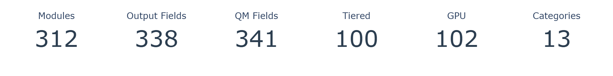
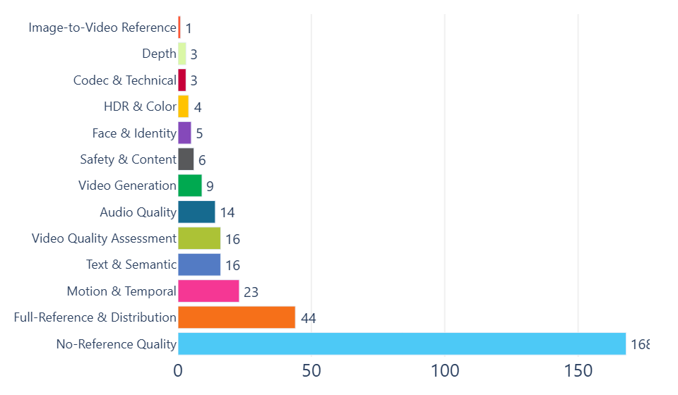
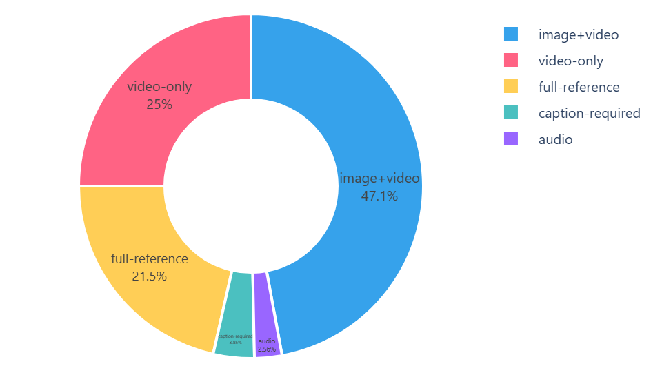
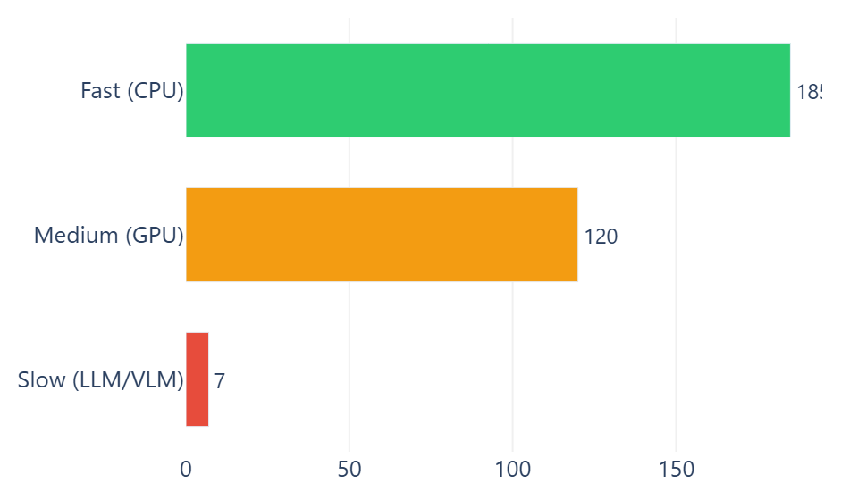
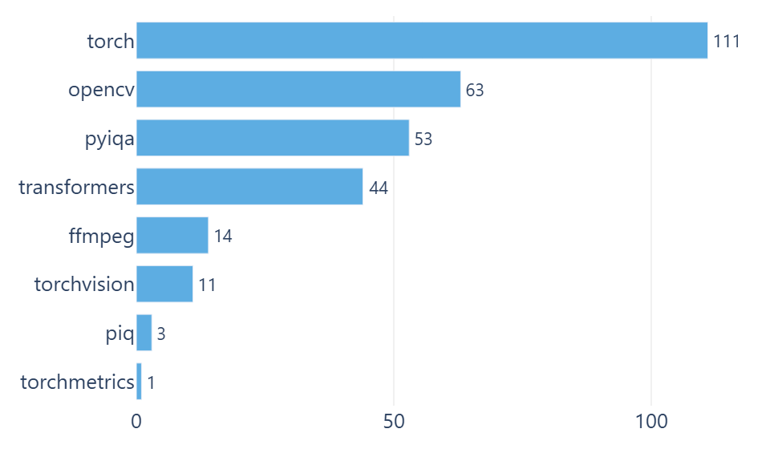
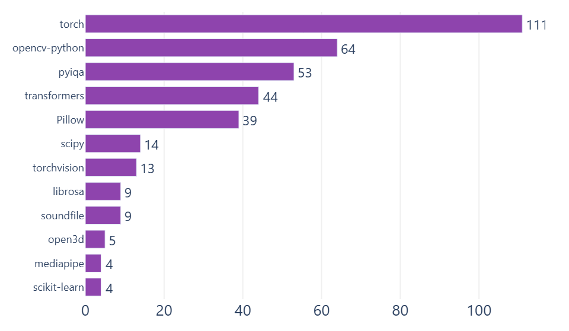
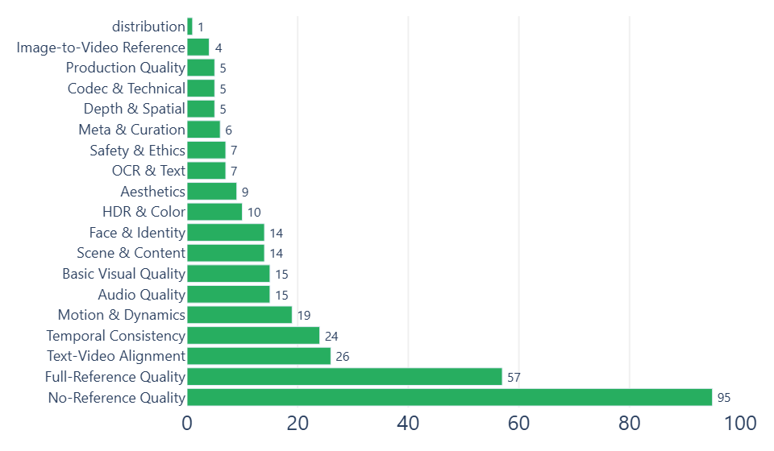

# Ayase Metrics Reference

> **Version 0.1.17** · Generated 2026-03-21 11:32 · **312 modules** · **341 metrics**
>
> `ayase modules docs -o METRICS.md` to regenerate
>
> Tests: `pytest tests/` (light) · `pytest tests/ --full` (with ML models)

## Summary

<table><tr>
<td valign="top"><h4>Modules by Category</h4></td>
<td valign="top"><h4>Input Types</h4></td>
</tr></table>

<table><tr>
<td valign="top"><h4>Speed Tiers</h4></td>
<td valign="top"><h4>Backend Usage</h4></td>
</tr></table>

<table><tr>
<td valign="top"><h4>Top Packages</h4></td>
<td valign="top"><h4>Metrics per Category</h4></td>
</tr></table>

---

## No-Reference Quality (95 metrics)

### `adadqa_score`
> Ada-DQA adaptive diverse (higher=better) · ↑ higher=better

**[`adadqa`](src/ayase/modules/adadqa.py)** — Ada-DQA adaptive diverse quality feature VQA (ACM MM 2023)

| | |
|---|---|
| Input | img/vid |
| Speed | ⚡ fast |
| Backend | heuristic → native |
| Packages | adadqa |
| Config | `subsample=8` |

### `afine_score`
> A-FINE fidelity-naturalness (CVPR 2025) · ↑ higher=better

**[`afine`](src/ayase/modules/afine.py)** — A-FINE adaptive fidelity-naturalness IQA (CVPR 2025)

| | |
|---|---|
| Input | img/vid |
| Speed | ⏱️ medium · GPU |
| Packages | opencv-python, pyiqa, torch |
| Config | `subsample=4` |

### `aigcvqa_aesthetic`
> AIGC-VQA aesthetic branch

**[`aigcvqa`](src/ayase/modules/aigcvqa.py)** — AIGC-VQA holistic 3-branch AIGC perception (CVPRW 2024)

| | |
|---|---|
| Input | img/vid +cap |
| Speed | ⚡ fast |
| Backend | heuristic → native |
| Packages | aigcvqa |
| Config | `subsample=8` |

### `aigcvqa_technical`
> AIGC-VQA technical branch

**[`aigcvqa`](src/ayase/modules/aigcvqa.py)** — AIGC-VQA holistic 3-branch AIGC perception (CVPRW 2024)

| | |
|---|---|
| Input | img/vid +cap |
| Speed | ⚡ fast |
| Backend | heuristic → native |
| Packages | aigcvqa |
| Config | `subsample=8` |

### `aigv_static`
> AI video static quality

**[`aigv_assessor`](src/ayase/modules/aigv_assessor.py)** — AI-generated video quality (AIGV-Assessor model, CLIP+heuristic, or OpenCV fallback)

| | |
|---|---|
| Input | vid |
| Speed | ⏱️ medium · GPU |
| Backend | heuristic → aigv_assessor → clip_heuristic |
| Packages | Pillow, opencv-python, torch, transformers |
| VRAM | ~600 MB |
| Source | [HF](https://huggingface.co/wangjiarui153/AIGV-Assessor) |
| Config | `subsample=8`, `trust_remote_code=True` |

### `aigvqa_score`
> AIGVQA multi-dimensional (higher=better) · ↑ higher=better

**[`aigvqa`](src/ayase/modules/aigvqa.py)** — AIGVQA multi-dimensional AIGC VQA (ICCVW 2025)

| | |
|---|---|
| Input | img/vid |
| Speed | ⚡ fast |
| Backend | heuristic → native |
| Packages | aigvqa |
| Config | `subsample=8` |

### `arniqa_score`
> ARNIQA (higher=better) · ↑ higher=better

**[`arniqa`](src/ayase/modules/arniqa.py)** — ARNIQA no-reference image quality assessment

| | |
|---|---|
| Input | img/vid |
| Speed | ⏱️ medium · GPU |
| Packages | opencv-python, pyiqa, torch |
| Config | `subsample=8` |

### `brisque`
> BRISQUE (0-100, lower=better) · ↓ lower=better · 0-100

**[`brisque`](src/ayase/modules/brisque.py)** — BRISQUE no-reference image quality (lower=better)

| | |
|---|---|
| Input | img/vid |
| Speed | ⏱️ medium |
| Packages | pyiqa |
| Config | `subsample=3`, `warning_threshold=50.0` |

### `bvqi_score`
> BVQI zero-shot blind VQA (higher=better) · ↑ higher=better

**[`bvqi`](src/ayase/modules/bvqi.py)** — BVQI zero-shot blind video quality index (ICME 2023)

| | |
|---|---|
| Input | img/vid |
| Speed | ⏱️ medium |
| Backend | heuristic → native → pyiqa |
| Packages | bvqi, pyiqa, torch |
| Config | `subsample=8` |

### `clifvqa_score`
> CLiF-VQA human feelings (higher=better) · ↑ higher=better

**[`clifvqa`](src/ayase/modules/clifvqa.py)** — CLiF-VQA human feelings VQA via CLIP (2024)

| | |
|---|---|
| Input | img/vid |
| Speed | ⚡ fast |
| Backend | heuristic → native |
| Packages | clifvqa |
| Config | `subsample=8` |

### `clip_iqa_score`
> CLIP-IQA semantic quality (0-1, higher=better) · ↑ higher=better · 0-1

**[`clip_iqa`](src/ayase/modules/clip_iqa.py)** — CLIP-based no-reference image quality assessment

| | |
|---|---|
| Input | img/vid |
| Speed | ⏱️ medium |
| Packages | pyiqa |
| Config | `subsample=5`, `warning_threshold=0.4` |

### `clipvqa_score`
> CLIPVQA CLIP-based VQA (higher=better) · ↑ higher=better

**[`clipvqa`](src/ayase/modules/clipvqa.py)** — CLIPVQA CLIP-based spatiotemporal VQA (TIP 2024)

| | |
|---|---|
| Input | img/vid |
| Speed | ⏱️ medium · GPU |
| Backend | heuristic → native → clip |
| Packages | Pillow, clipvqa, torch, transformers |
| VRAM | ~600 MB |
| Source | [HF](https://huggingface.co/openai/clip-vit-base-patch32) |
| Config | `subsample=8` |

### `cnniqa_score`
> CNNIQA blind CNN IQA · ↑ higher=better

**[`cnniqa`](src/ayase/modules/cnniqa.py)** — CNNIQA blind CNN-based image quality assessment

| | |
|---|---|
| Input | img/vid |
| Speed | ⏱️ medium · GPU |
| Packages | opencv-python, pyiqa, torch |
| Config | `subsample=4` |

### `compare2score`
> Compare2Score comparison-based · ↑ higher=better

**[`compare2score`](src/ayase/modules/compare2score.py)** — Compare2Score comparison-based NR image quality

| | |
|---|---|
| Input | img/vid |
| Speed | ⏱️ medium · GPU |
| Packages | opencv-python, pyiqa, torch |
| Config | `subsample=4` |

### `contrique_score`
> CONTRIQUE contrastive IQA (higher=better) · ↑ higher=better

**[`contrique`](src/ayase/modules/contrique.py)** — Contrastive no-reference IQA

| | |
|---|---|
| Input | img/vid |
| Speed | ⏱️ medium |
| Packages | pyiqa |
| Config | `subsample=5` |

### `conviqt_score`
> CONVIQT contrastive NR-VQA (higher=better) · ↑ higher=better

**[`conviqt`](src/ayase/modules/conviqt.py)** — CONVIQT contrastive self-supervised NR-VQA (TIP 2023)

| | |
|---|---|
| Input | img/vid |
| Speed | ⏱️ medium |
| Backend | heuristic → native → pyiqa |
| Packages | conviqt, pyiqa, torch |
| Config | `subsample=8` |

### `cover_score`
> COVER overall (higher=better) · ↑ higher=better

**[`cover`](src/ayase/modules/cover.py)** — COVER 3-branch comprehensive video quality (semantic + aesthetic + technical)

| | |
|---|---|
| Input | img/vid |
| Speed | ⏱️ medium · GPU |
| Backend | cover → dover |
| Packages | cover, opencv-python, pyiqa, torch |
| VRAM | ~800 MB |
| Config | `subsample=8`, `quality_threshold=30.0` |

### `cover_technical`
> COVER technical branch

**[`cover`](src/ayase/modules/cover.py)** — COVER 3-branch comprehensive video quality (semantic + aesthetic + technical)

| | |
|---|---|
| Input | img/vid |
| Speed | ⏱️ medium · GPU |
| Backend | cover → dover |
| Packages | cover, opencv-python, pyiqa, torch |
| VRAM | ~800 MB |
| Config | `subsample=8`, `quality_threshold=30.0` |

### `crave_score`
> CRAVE next-gen AIGC (higher=better) · ↑ higher=better

**[`crave`](src/ayase/modules/crave.py)** — CRAVE content-rich AIGC video evaluator (2025)

| | |
|---|---|
| Input | vid |
| Speed | ⚡ fast |
| Backend | heuristic → native |
| Packages | crave |
| Config | `subsample=12` |

### `dbcnn_score`
> DBCNN bilinear CNN (higher=better) · ↑ higher=better

**[`dbcnn`](src/ayase/modules/dbcnn.py)** — DBCNN deep bilinear CNN for no-reference IQA

| | |
|---|---|
| Input | img/vid |
| Speed | ⏱️ medium · GPU |
| Packages | opencv-python, pyiqa, torch |
| Config | `subsample=8` |

### `deepdc_score`
> DeepDC distribution conformance (lower=better) · ↓ lower=better

**[`deepdc`](src/ayase/modules/deepdc.py)** — DeepDC distribution conformance NR-IQA via pyiqa (2024, lower=better)

| | |
|---|---|
| Input | img/vid |
| Speed | ⏱️ medium |
| Backend | heuristic → pyiqa |
| Packages | pyiqa, torch |
| Config | `subsample=8` |

### `discovqa_score`
> DisCoVQA distortion-content (higher=better) · ↑ higher=better

**[`discovqa`](src/ayase/modules/discovqa.py)** — DisCoVQA temporal distortion-content VQA (2023)

| | |
|---|---|
| Input | img/vid |
| Speed | ⚡ fast |
| Backend | heuristic → native |
| Packages | discovqa |
| Config | `subsample=8` |

### `dover_score`
> DOVER overall (higher=better) · ↑ higher=better

Used by: [`internvqa`](src/ayase/modules/internvqa.py)

**[`dover`](src/ayase/modules/dover.py)** — DOVER disentangled technical + aesthetic VQA (ICCV 2023)

| | |
|---|---|
| Input | vid |
| Speed | ⏱️ medium · GPU |
| Backend | heuristic → native → onnx → pyiqa |
| Packages | onnxruntime, pyiqa, torch |
| VRAM | ~800 MB |
| Source | [GitHub](https://github.com/VQAssessment/DOVER.git) · [HF](https://huggingface.co/dover/DOVER.pth) |
| Config | `warning_threshold=0.4` |

**[`unified_vqa`](src/ayase/modules/unified_vqa.py)** — Unified-VQA FR+NR multi-task quality assessment (2025)

| | |
|---|---|
| Input | img/vid +ref |
| Speed | ⚡ fast |
| Backend | heuristic → native |
| Packages | unified_vqa |
| VRAM | ~800 MB |
| Config | `subsample=8` |

### `dover_technical`
> DOVER technical quality

**[`dover`](src/ayase/modules/dover.py)** — DOVER disentangled technical + aesthetic VQA (ICCV 2023)

| | |
|---|---|
| Input | vid |
| Speed | ⏱️ medium · GPU |
| Backend | heuristic → native → onnx → pyiqa |
| Packages | onnxruntime, pyiqa, torch |
| VRAM | ~800 MB |
| Source | [GitHub](https://github.com/VQAssessment/DOVER.git) · [HF](https://huggingface.co/dover/DOVER.pth) |
| Config | `warning_threshold=0.4` |

### `fast_vqa_score`
> 0-100 · ↑ higher=better · 0-100

**[`fast_vqa`](src/ayase/modules/fast_vqa.py)** — Deep Learning Video Quality Assessment (FAST-VQA)

| | |
|---|---|
| Input | vid |
| Speed | ⏱️ medium · GPU |
| Packages | decord, torch, traceback |
| Config | `model_type=FasterVQA` |

### `faver_score`
> FAVER variable frame rate (higher=better) · ↑ higher=better

**[`faver`](src/ayase/modules/faver.py)** — FAVER blind VQA for variable frame rate videos (2024)

| | |
|---|---|
| Input | vid |
| Speed | ⚡ fast |
| Backend | heuristic → native |
| Packages | faver |
| Config | `subsample=16` |

### `finevq_score`
> FineVQ fine-grained UGC VQA (CVPR 2025) · ↑ higher=better

**[`finevq`](src/ayase/modules/finevq.py)** — Fine-grained video quality (FineVQ model, TOPIQ+handcrafted, or heuristic fallback)

| | |
|---|---|
| Input | img/vid |
| Speed | ⏱️ medium · GPU |
| Backend | heuristic → finevq → topiq_handcrafted |
| Packages | Pillow, opencv-python, pyiqa, torch, transformers |
| Source | [HF](https://huggingface.co/IntMeGroup/FineVQ_score) |
| Config | `subsample=8`, `trust_remote_code=True`, `weights={'sharpness': 0.2, 'colorfulness': 0.15, 'noise': 0.2, 'temporal_stability': 0.25, 'content_richness': 0.2}` |

### `gamival_score`
> GAMIVAL cloud gaming NR-VQA (higher=better) · ↑ higher=better

**[`gamival`](src/ayase/modules/gamival.py)** — GAMIVAL cloud gaming NR-VQA with NSS + CNN features (2023)

| | |
|---|---|
| Input | img/vid |
| Speed | ⚡ fast |
| Backend | heuristic → native |
| Packages | gamival |
| Config | `subsample=8` |

### `hyperiqa_score`
> HyperIQA adaptive NR-IQA · ↑ higher=better

**[`hyperiqa`](src/ayase/modules/hyperiqa.py)** — HyperIQA adaptive hypernetwork NR image quality

| | |
|---|---|
| Input | img/vid |
| Speed | ⏱️ medium · GPU |
| Packages | opencv-python, pyiqa, torch |
| Config | `subsample=4` |

### `ilniqe`
> IL-NIQE Integrated Local NIQE (lower=better) · ↓ lower=better

**[`ilniqe`](src/ayase/modules/ilniqe.py)** — IL-NIQE integrated local no-reference quality (lower=better)

| | |
|---|---|
| Input | img/vid |
| Speed | ⏱️ medium |
| Packages | pyiqa |
| Config | `subsample=3`, `warning_threshold=50.0` |

### `internvqa_score`
> InternVQA video quality (higher=better) · ↑ higher=better

**[`internvqa`](src/ayase/modules/internvqa.py)** — InternVQA lightweight compressed video quality (2025)

| | |
|---|---|
| Input | vid |
| Speed | ⚡ fast |
| Backend | heuristic → native |
| Packages | internvqa |
| VRAM | ~800 MB |
| Config | `subsample=8` |

### `kvq_score`
> KVQ saliency-guided VQA (CVPR 2025) · ↑ higher=better

**[`kvq`](src/ayase/modules/kvq.py)** — Saliency-guided video quality (KVQ model, TOPIQ+saliency, or heuristic fallback)

| | |
|---|---|
| Input | img/vid |
| Speed | ⏱️ medium · GPU |
| Backend | heuristic → kvq → topiq_saliency |
| Packages | opencv-python, pyiqa, torch, transformers |
| Source | [HF](https://huggingface.co/qyp2000/KVQ) |
| Config | `subsample=8`, `trust_remote_code=True` |

### `liqe_score`
> LIQE lightweight IQA (higher=better) · ↑ higher=better

**[`liqe`](src/ayase/modules/liqe.py)** — LIQE lightweight no-reference IQA

| | |
|---|---|
| Input | img/vid |
| Speed | ⏱️ medium |
| Packages | pyiqa |
| Config | `subsample=5`, `warning_threshold=2.5` |

### `lmmvqa_score`
> LMM-VQA spatiotemporal (higher=better) · ↑ higher=better

**[`lmmvqa`](src/ayase/modules/lmmvqa.py)** — LMM-VQA spatiotemporal LMM VQA (IEEE 2024)

| | |
|---|---|
| Input | img/vid |
| Speed | ⚡ fast |
| Backend | heuristic → native |
| Config | `subsample=8` |

### `maclip_score`
> MACLIP multi-attribute CLIP NR-IQA (higher=better) · ↑ higher=better

**[`maclip`](src/ayase/modules/maclip.py)** — MACLIP multi-attribute CLIP no-reference quality (higher=better)

| | |
|---|---|
| Input | img/vid |
| Speed | ⏱️ medium |
| Packages | pyiqa |
| Config | `subsample=3` |

### `maniqa_score`
> MANIQA multi-attention (higher=better) · ↑ higher=better

**[`maniqa`](src/ayase/modules/maniqa.py)** — MANIQA multi-dimension attention no-reference IQA

| | |
|---|---|
| Input | img/vid |
| Speed | ⏱️ medium · GPU |
| Packages | opencv-python, pyiqa, torch |
| Config | `subsample=8` |

### `maxvqa_score`
> MaxVQA explainable quality (higher=better) · ↑ higher=better

**[`maxvqa`](src/ayase/modules/maxvqa.py)** — MaxVQA explainable language-prompted VQA (ACM MM 2023)

| | |
|---|---|
| Input | img/vid |
| Speed | ⏱️ medium · GPU |
| Backend | heuristic → native → clip |
| Packages | Pillow, maxvqa, torch, transformers |
| VRAM | ~600 MB |
| Source | [HF](https://huggingface.co/openai/clip-vit-base-patch32) |
| Config | `subsample=8` |

### `mc360iqa_score`
> MC360IQA blind 360 (higher=better) · ↑ higher=better

**[`mc360iqa`](src/ayase/modules/mc360iqa.py)** — MC360IQA blind 360 IQA (2019)

| | |
|---|---|
| Input | img/vid |
| Speed | ⚡ fast |
| Backend | heuristic → native |
| Config | `subsample=8`, `n_viewports=6` |

### `mdtvsfa_score`
> MDTVSFA fragment-based VQA (higher=better) · ↑ higher=better

**[`mdtvsfa`](src/ayase/modules/mdtvsfa.py)** — Multi-Dimensional fragment-based VQA

| | |
|---|---|
| Input | img/vid |
| Speed | ⏱️ medium |
| Packages | pyiqa |
| Config | `subsample=5` |

### `mdvqa_distortion`
> MD-VQA distortion quality (higher=better) · ↑ higher=better

**[`mdvqa`](src/ayase/modules/mdvqa.py)** — MD-VQA multi-dimensional UGC live VQA (CVPR 2023)

| | |
|---|---|
| Input | img/vid |
| Speed | ⚡ fast |
| Backend | heuristic → native |
| Packages | mdvqa |
| Config | `subsample=8` |

### `mdvqa_motion`
> MD-VQA motion quality (higher=better) · ↑ higher=better

**[`mdvqa`](src/ayase/modules/mdvqa.py)** — MD-VQA multi-dimensional UGC live VQA (CVPR 2023)

| | |
|---|---|
| Input | img/vid |
| Speed | ⚡ fast |
| Backend | heuristic → native |
| Packages | mdvqa |
| Config | `subsample=8` |

### `mdvqa_semantic`
> MD-VQA semantic quality (higher=better) · ↑ higher=better

**[`mdvqa`](src/ayase/modules/mdvqa.py)** — MD-VQA multi-dimensional UGC live VQA (CVPR 2023)

| | |
|---|---|
| Input | img/vid |
| Speed | ⚡ fast |
| Backend | heuristic → native |
| Packages | mdvqa |
| Config | `subsample=8` |

### `memoryvqa_score`
> Memory-VQA human memory (higher=better) · ↑ higher=better

**[`memoryvqa`](src/ayase/modules/memoryvqa.py)** — Memory-VQA human memory system VQA (Neurocomputing 2025)

| | |
|---|---|
| Input | img/vid |
| Speed | ⚡ fast |
| Backend | heuristic → native |
| Packages | memoryvqa |
| Config | `subsample=12` |

### `mm_pcqa_score`
> MM-PCQA multi-modal (higher=better) · ↑ higher=better

**[`mm_pcqa`](src/ayase/modules/mm_pcqa.py)** — MM-PCQA multi-modal point cloud QA (IJCAI 2023)

| | |
|---|---|
| Input | img/vid |
| Speed | ⚡ fast |
| Backend | heuristic → native |
| Packages | open3d, scipy |

### `modularbvqa_score`
> ModularBVQA resolution-aware (higher=better) · ↑ higher=better

**[`modularbvqa`](src/ayase/modules/modularbvqa.py)** — ModularBVQA resolution/framerate-aware blind VQA (CVPR 2024)

| | |
|---|---|
| Input | img/vid |
| Speed | ⚡ fast |
| Backend | heuristic → native |
| Packages | modularbvqa |
| Config | `subsample=8` |

### `musiq_score`
> MUSIQ multi-scale IQA (higher=better) · ↑ higher=better

**[`musiq`](src/ayase/modules/musiq.py)** — Multi-Scale Image Quality Transformer (no-reference)

| | |
|---|---|
| Input | img/vid |
| Speed | ⏱️ medium |
| Packages | pyiqa |
| Config | `variant=musiq`, `subsample=5`, `warning_threshold=40.0` |

### `naturalness_score`
> Natural scene statistics · ↑ higher=better

**[`naturalness`](src/ayase/modules/naturalness.py)** — Measures naturalness of content (natural vs synthetic)

| | |
|---|---|
| Input | img/vid |
| Speed | ⏱️ medium |
| Packages | pyiqa |
| Config | `use_pyiqa=True`, `subsample=2`, `warning_threshold=0.4` |

### `niqe`
> Natural Image Quality Evaluator (lower=better) · ↓ lower=better

**[`niqe`](src/ayase/modules/niqe.py)** — Natural Image Quality Evaluator (no-reference)

| | |
|---|---|
| Input | img/vid |
| Speed | ⏱️ medium |
| Packages | pyiqa |
| Config | `subsample=2`, `warning_threshold=7.0` |

### `nr_gvqm_score`
> NR-GVQM cloud gaming VQA (higher=better) · ↑ higher=better

**[`nr_gvqm`](src/ayase/modules/nr_gvqm.py)** — NR-GVQM no-reference gaming video quality (ISM 2018, 9 features)

| | |
|---|---|
| Input | img/vid |
| Speed | ⚡ fast |
| Backend | heuristic |
| Config | `subsample=8` |

### `nrqm`
> NRQM No-Reference Quality Metric (higher=better) · ↑ higher=better

**[`nrqm`](src/ayase/modules/nrqm.py)** — NRQM no-reference quality metric for super-resolution (higher=better)

| | |
|---|---|
| Input | img/vid |
| Speed | ⏱️ medium |
| Packages | pyiqa |
| Config | `subsample=3` |

### `paq2piq_score`
> PaQ-2-PiQ patch-to-picture (CVPR 2020) · ↑ higher=better

**[`paq2piq`](src/ayase/modules/paq2piq.py)** — PaQ-2-PiQ patch-to-picture NR quality (CVPR 2020)

| | |
|---|---|
| Input | img/vid |
| Speed | ⏱️ medium · GPU |
| Packages | opencv-python, pyiqa, torch |
| Config | `subsample=4` |

### `pi_score`
> Perceptual Index (PIRM challenge, lower=better) · ↓ lower=better · PIRM challenge

**[`pi`](src/ayase/modules/pi_metric.py)** — Perceptual Index (PIRM challenge metric, lower=better)

| | |
|---|---|
| Input | img/vid |
| Speed | ⏱️ medium |
| Packages | pyiqa |
| Config | `subsample=3` |

### `piqe`
> PIQE perception-based NR-IQA (lower=better) · ↓ lower=better

**[`piqe`](src/ayase/modules/piqe.py)** — PIQE perception-based no-reference quality (lower=better)

| | |
|---|---|
| Input | img/vid |
| Speed | ⏱️ medium |
| Packages | pyiqa |
| Config | `subsample=3`, `warning_threshold=50.0` |

### `presresq_score`
> PreResQ-R1 rank+score (higher=better) · ↑ higher=better

**[`presresq`](src/ayase/modules/presresq.py)** — PreResQ-R1 rank+score VQA (2025)

| | |
|---|---|
| Input | img/vid |
| Speed | ⚡ fast |
| Backend | heuristic → native |
| Config | `subsample=8` |

### `promptiqa_score`
> Few-shot NR-IQA score · ↑ higher=better

**[`promptiqa`](src/ayase/modules/promptiqa.py)** — Prompt-guided NR-IQA (PromptIQA via pyiqa, TOPIQ-NR, or CLIP-IQA+ fallback)

| | |
|---|---|
| Input | img/vid |
| Speed | ⏱️ medium |
| Backend | none → promptiqa → topiq_nr |
| Packages | Pillow, opencv-python, pyiqa, torch |
| Config | `subsample=4` |

### `provqa_score`
> ProVQA progressive 360 (higher=better) · ↑ higher=better

**[`provqa`](src/ayase/modules/provqa.py)** — ProVQA progressive blind 360 VQA (2022)

| | |
|---|---|
| Input | img/vid |
| Speed | ⚡ fast |
| Backend | heuristic → native |
| Config | `subsample=8` |

### `ptmvqa_score`
> PTM-VQA multi-PTM fusion (higher=better) · ↑ higher=better

**[`ptmvqa`](src/ayase/modules/ptmvqa.py)** — PTM-VQA multi-PTM fusion VQA (CVPR 2024)

| | |
|---|---|
| Input | img/vid |
| Speed | ⚡ fast |
| Backend | heuristic → native |
| Packages | ptmvqa |
| VRAM | ~400 MB |
| Config | `subsample=8` |

### `qalign_quality`
> Q-Align technical quality (1-5, higher=better) · ↑ higher=better · 1-5

**[`q_align`](src/ayase/modules/q_align.py)** — Q-Align unified quality + aesthetic assessment (ICML 2024)

| | |
|---|---|
| Input | img/vid |
| Speed | 🐌 slow · GPU |
| Packages | Pillow, torch, transformers |
| VRAM | ~14 GB |
| Source | [HF](https://huggingface.co/q-future/one-align) |
| Config | `model_name=q-future/one-align`, `dtype=float16`, `device=auto`, `subsample=8`, `max_frames=16`, `warning_threshold=2.5`, `trust_remote_code=True` |

### `qclip_score`
> Q-CLIP VLM-based (higher=better) · ↑ higher=better

**[`qclip`](src/ayase/modules/qclip.py)** — Q-CLIP VLM-based VQA (2025)

| | |
|---|---|
| Input | img/vid |
| Speed | ⚡ fast |
| Backend | heuristic → native |
| Config | `subsample=8` |

### `qcn_score`
> Geometric order blind IQA · ↑ higher=better

**[`qcn`](src/ayase/modules/qcn.py)** — Blind IQA (QCN via pyiqa, or HyperIQA fallback)

| | |
|---|---|
| Input | img/vid |
| Speed | ⏱️ medium |
| Backend | none → qcn → hyperiqa |
| Packages | Pillow, opencv-python, pyiqa, torch |
| Config | `subsample=4` |

### `qualiclip_score`
> QualiCLIP opinion-unaware (higher=better) · ↑ higher=better

**[`qualiclip`](src/ayase/modules/qualiclip.py)** — QualiCLIP opinion-unaware CLIP-based no-reference IQA

| | |
|---|---|
| Input | img/vid |
| Speed | ⏱️ medium · GPU |
| Packages | opencv-python, pyiqa, torch |
| Config | `subsample=8` |

### `rapique_score`
> RAPIQUE bandpass+CNN NR-VQA (higher=better) · ↑ higher=better

**[`rapique`](src/ayase/modules/rapique.py)** — RAPIQUE rapid NR-VQA via bandpass NSS + CNN features (IEEE OJSP 2021)

| | |
|---|---|
| Input | img/vid |
| Speed | ⚡ fast |
| Backend | heuristic → native |
| Packages | rapique |
| Config | `subsample=8` |

### `rqvqa_score`
> RQ-VQA rich quality-aware (CVPR 2024 winner) · ↑ higher=better

**[`rqvqa`](src/ayase/modules/rqvqa.py)** — Multi-attribute video quality (RQ-VQA model, CLIP-IQA+, or heuristic fallback)

| | |
|---|---|
| Input | img/vid |
| Speed | ⏱️ medium · GPU |
| Backend | heuristic → rqvqa → clipiqa |
| Packages | opencv-python, pyiqa, torch, transformers |
| Source | [HF](https://huggingface.co/sunwei925/RQ-VQA) |
| Config | `subsample=8`, `trust_remote_code=True`, `dimensions={'clarity': 0.25, 'aesthetics': 0.2, 'motion_naturalness': 0.25, 'semantic_coherence': 0.15, 'overall_impression': 0.15}` |

### `sama_score`
> SAMA scaling+masking (higher=better) · ↑ higher=better

**[`sama`](src/ayase/modules/sama.py)** — SAMA scaling+masking VQA (2024)

| | |
|---|---|
| Input | img/vid |
| Speed | ⚡ fast |
| Backend | heuristic → native |
| Packages | sama |
| Config | `subsample=8`, `mask_ratio=0.5` |

### `siamvqa_score`
> SiamVQA Siamese high-res (higher=better) · ↑ higher=better

**[`siamvqa`](src/ayase/modules/siamvqa.py)** — SiamVQA Siamese high-resolution VQA (2025)

| | |
|---|---|
| Input | img/vid |
| Speed | ⚡ fast |
| Backend | heuristic → native |
| Packages | siamvqa |
| Config | `subsample=8` |

### `simplevqa_score`
> SimpleVQA Swin+SlowFast (higher=better) · ↑ higher=better

**[`simplevqa`](src/ayase/modules/simplevqa.py)** — SimpleVQA Swin+SlowFast blind VQA (2022)

| | |
|---|---|
| Input | img/vid |
| Speed | ⚡ fast |
| Backend | heuristic → native |
| Packages | simplevqa |
| Config | `subsample=8` |

### `spectral_entropy`
> DINOv2 spectral entropy

**[`spectral_complexity`](src/ayase/modules/spectral.py)** — Analyzes spectral complexity (Effective Rank) of video features (DINOv2)

| | |
|---|---|
| Input | vid |
| Speed | ⏱️ medium · GPU |
| Packages | torch, torchvision |
| VRAM | ~400 MB |
| Source | [HF](https://huggingface.co/facebookresearch/dinov2) |
| Config | `model_type=dinov2_vits14`, `sample_rate=8`, `min_rank_ratio=0.05`, `max_entropy_threshold=6.0` |

### `spectral_rank`
> DINOv2 effective rank ratio

**[`spectral_complexity`](src/ayase/modules/spectral.py)** — Analyzes spectral complexity (Effective Rank) of video features (DINOv2)

| | |
|---|---|
| Input | vid |
| Speed | ⏱️ medium · GPU |
| Packages | torch, torchvision |
| VRAM | ~400 MB |
| Source | [HF](https://huggingface.co/facebookresearch/dinov2) |
| Config | `model_type=dinov2_vits14`, `sample_rate=8`, `min_rank_ratio=0.05`, `max_entropy_threshold=6.0` |

### `speedqa_score`
> SpEED-QA entropic differencing (higher=better) · ↑ higher=better

**[`speedqa`](src/ayase/modules/speedqa.py)** — SpEED-QA spatial efficient entropic differencing NR-VQA (Bampis 2017)

| | |
|---|---|
| Input | vid |
| Speed | ⚡ fast |
| Backend | heuristic → native |
| Packages | speedqa |
| Config | `subsample=8` |

### `sqi_score`
> SQI streaming quality index · ↑ higher=better

**[`sqi`](src/ayase/modules/sqi.py)** — SQI streaming quality index (2016)

| | |
|---|---|
| Input | vid |
| Speed | ⚡ fast |

### `sr4kvqa_score`
> SR4KVQA super-resolution 4K (higher=better) · ↑ higher=better

**[`sr4kvqa`](src/ayase/modules/sr4kvqa.py)** — SR4KVQA super-resolution 4K quality (2024)

| | |
|---|---|
| Input | img/vid |
| Speed | ⚡ fast |
| Backend | heuristic → native |
| Config | `subsample=8` |

### `stablevqa_score`
> StableVQA video stability (higher=better) · ↑ higher=better

**[`stablevqa`](src/ayase/modules/stablevqa.py)** — StableVQA video stability quality assessment (ACM MM 2023)

| | |
|---|---|
| Input | vid |
| Speed | ⚡ fast |
| Backend | heuristic → native |
| Packages | stablevqa |
| Config | `step=2`, `max_frames=120` |

### `t2v_quality`
> Video production quality · ↑ higher=better

**[`t2v_score`](src/ayase/modules/t2v_score.py)** — Text-to-Video alignment and quality scoring

| | |
|---|---|
| Input | vid |
| Speed | ⏱️ medium · GPU |
| Packages | torch, transformers |
| VRAM | ~600 MB |
| Source | [HF](https://huggingface.co/TIGER-Lab/T2VScore) |
| Config | `model_name=TIGER-Lab/T2VScore`, `use_clip_fallback=True`, `num_frames=8`, `alignment_weight=0.5`, `quality_weight=0.5`, `device=auto`, `warning_threshold=0.6` |

### `thqa_score`
> THQA talking head quality (higher=better) · ↑ higher=better

**[`thqa`](src/ayase/modules/thqa.py)** — THQA talking head quality assessment (ICIP 2024)

| | |
|---|---|
| Input | vid |
| Speed | ⚡ fast |
| Backend | thqa |
| Packages | thqa |
| Config | `subsample=16` |

### `tlvqm_score`
> TLVQM two-level video quality · ↑ higher=better

**[`tlvqm`](src/ayase/modules/tlvqm.py)** — Two-level video quality model (CNN-TLVQM or handcrafted fallback)

| | |
|---|---|
| Input | img/vid |
| Speed | ⏱️ medium · GPU |
| Backend | handcrafted → cnn → cnn_svr → cnn_pretrained |
| Packages | joblib, opencv-python, torch, torchvision |
| VRAM | ~200 MB |
| Source | [GitHub](https://github.com/jarikorhonen/cnn-tlvqm) |
| Config | `subsample=8` |

### `topiq_score`
> TOPIQ transformer-based IQA (higher=better) · ↑ higher=better

**[`topiq`](src/ayase/modules/topiq.py)** — TOPIQ transformer-based no-reference IQA

| | |
|---|---|
| Input | img/vid |
| Speed | ⏱️ medium · GPU |
| Packages | pyiqa, torch |
| Config | `variant=topiq_nr`, `subsample=5`, `warning_threshold=0.4` |

### `tres_score`
> TReS transformer IQA (WACV 2022) · ↑ higher=better

**[`tres`](src/ayase/modules/tres.py)** — TReS transformer-based NR image quality (WACV 2022)

| | |
|---|---|
| Input | img/vid |
| Speed | ⏱️ medium · GPU |
| Packages | opencv-python, pyiqa, torch |
| Config | `subsample=4` |

### `uciqe_score`
> UCIQE underwater color (higher=better) · ↑ higher=better

**[`uciqe`](src/ayase/modules/uciqe.py)** — UCIQE underwater color image quality evaluation (2015)

| | |
|---|---|
| Input | img/vid |
| Speed | ⚡ fast |
| Config | `c1=0.468`, `c2=0.2745`, `c3=0.2576`, `subsample=8` |

### `ugvq_score`
> UGVQ unified generated VQ (higher=better) · ↑ higher=better

**[`ugvq`](src/ayase/modules/ugvq.py)** — UGVQ unified generated video quality (TOMM 2024)

| | |
|---|---|
| Input | img/vid |
| Speed | ⚡ fast |
| Backend | heuristic → native |
| Packages | ugvq |
| Config | `subsample=8` |

### `uiqm_score`
> UIQM underwater quality (higher=better) · ↑ higher=better

**[`uiqm`](src/ayase/modules/uiqm.py)** — UIQM underwater image quality measure (Panetta et al. 2016)

| | |
|---|---|
| Input | img/vid |
| Speed | ⚡ fast |
| Config | `c1=0.0282`, `c2=0.2953`, `c3=3.5753`, `subsample=8` |

### `unique_score`
> UNIQUE unified NR-IQA (TIP 2021) · ↑ higher=better

**[`unique`](src/ayase/modules/unique_iqa.py)** — UNIQUE unified NR image quality (TIP 2021)

| | |
|---|---|
| Input | img/vid |
| Speed | ⏱️ medium · GPU |
| Packages | opencv-python, pyiqa, torch |
| Config | `subsample=4` |

### `vader_score`
> VADER reward alignment · ↑ higher=better

**[`vader`](src/ayase/modules/vader.py)** — VADER reward gradient alignment (ICLR 2025)

| | |
|---|---|
| Input | img/vid |
| Speed | ⚡ fast |
| Backend | heuristic → native |
| Packages | vader |
| Config | `subsample=8` |

### `vbliinds_score`
> V-BLIINDS DCT-domain NSS (higher=better) · ↑ higher=better

**[`vbliinds`](src/ayase/modules/vbliinds.py)** — V-BLIINDS blind NR-VQA via DCT-domain NSS (Saad 2013)

| | |
|---|---|
| Input | img/vid |
| Speed | ⚡ fast |
| Backend | heuristic → native |
| Packages | vbliinds |
| Config | `subsample=8` |

### `video_atlas_score`
> Video ATLAS temporal artifacts · ↑ higher=better

**[`video_atlas`](src/ayase/modules/video_atlas.py)** — Video ATLAS temporal artifacts+stalls assessment (2018)

| | |
|---|---|
| Input | vid |
| Speed | ⚡ fast |
| Backend | heuristic → native |
| Config | `subsample=16` |

### `video_memorability`
> Memorability prediction

**[`video_memorability`](src/ayase/modules/video_memorability.py)** — Content memorability approximation (CLIP/DINOv2 feature statistics, not a trained predictor)

| | |
|---|---|
| Input | img/vid |
| Speed | ⏱️ medium · GPU |
| Backend | heuristic → clip → dinov2 |
| Packages | Pillow, opencv-python, torch, transformers |
| VRAM | ~600 MB |
| Source | [HF](https://huggingface.co/openai/clip-vit-base-patch32) |
| Config | `subsample=5` |

### `videoreward_vq`
> VideoReward visual quality

**[`videoreward`](src/ayase/modules/videoreward.py)** — VideoReward Kling multi-dim reward model (NeurIPS 2025)

| | |
|---|---|
| Input | vid +cap |
| Speed | ⚡ fast |
| Backend | heuristic → native |
| Packages | videoreward |
| Config | `subsample=8` |

### `videoscore_visual`
> VideoScore visual quality · ↑ higher=better

**[`videoscore`](src/ayase/modules/videoscore.py)** — VideoScore 5-dimensional video quality assessment (1-4 scale)

| | |
|---|---|
| Input | img/vid |
| Speed | 🐌 slow · GPU |
| Packages | Pillow, opencv-python, torch, transformers |
| Source | [HF](https://huggingface.co/TIGER-Lab/VideoScore) |
| Config | `model_name=TIGER-Lab/VideoScore`, `num_frames=8`, `trust_remote_code=True` |

### `videval_score`
> VIDEVAL 60-feature fusion NR-VQA · ↑ higher=better

**[`videval`](src/ayase/modules/videval.py)** — Feature-fusion NR-VQA (VIDEVAL-style SVR or heuristic linear mapping)

| | |
|---|---|
| Input | img/vid |
| Speed | ⚡ fast |
| Backend | heuristic → svr |
| Packages | joblib, opencv-python |
| Source | [GitHub](https://github.com/vztu/VIDEVAL) |
| Config | `subsample=8` |

### `viideo_score`
> VIIDEO blind natural video statistics (lower=better) · ↓ lower=better

**[`viideo`](src/ayase/modules/viideo.py)** — VIIDEO blind NR-VQA via natural video statistics (Mittal 2016, lower=better)

| | |
|---|---|
| Input | vid |
| Speed | ⚡ fast |
| Backend | heuristic → native |
| Packages | viideo |
| Config | `subsample=8` |

### `vqa2_score`
> VQA² LMM quality (higher=better) · ↑ higher=better

**[`vqa2`](src/ayase/modules/vqa2.py)** — VQA² LMM video quality assessment (MM 2025)

| | |
|---|---|
| Input | img/vid |
| Speed | ⚡ fast |
| Backend | heuristic → native |
| Packages | vqa2_assistant |
| Config | `subsample=8` |

### `vqathinker_score`
> VQAThinker GRPO (higher=better) · ↑ higher=better

**[`vqathinker`](src/ayase/modules/vqathinker.py)** — VQAThinker RL-based explainable VQA (2025)

| | |
|---|---|
| Input | img/vid |
| Speed | ⚡ fast |
| Backend | heuristic → native |
| Config | `subsample=8` |

### `vqinsight_score`
> VQ-Insight ByteDance (higher=better) · ↑ higher=better

**[`vqinsight`](src/ayase/modules/vqinsight.py)** — VQ-Insight ByteDance multi-dim AIGC scoring (AAAI 2026)

| | |
|---|---|
| Input | img/vid |
| Speed | ⚡ fast |
| Backend | heuristic → native |
| Config | `subsample=8` |

### `vsfa_score`
> VSFA quality-aware feature aggregation (higher=better) · ↑ higher=better

**[`vsfa`](src/ayase/modules/vsfa.py)** — VSFA quality-aware feature aggregation with GRU (ACMMM 2019)

| | |
|---|---|
| Input | img/vid |
| Speed | ⚡ fast |
| Backend | heuristic → native |
| Packages | vsfa |
| Config | `subsample=8` |

### `wadiqam_score`
> WaDIQaM-NR (higher=better) · ↑ higher=better

**[`wadiqam`](src/ayase/modules/wadiqam.py)** — WaDIQaM-NR weighted averaging deep image quality mapper

| | |
|---|---|
| Input | img/vid |
| Speed | ⏱️ medium · GPU |
| Packages | opencv-python, pyiqa, torch |
| Config | `subsample=8` |

### `zoomvqa_score`
> Zoom-VQA multi-level (higher=better) · ↑ higher=better

**[`zoomvqa`](src/ayase/modules/zoomvqa.py)** — Zoom-VQA multi-level patch/frame/clip VQA (CVPRW 2023)

| | |
|---|---|
| Input | img/vid |
| Speed | ⚡ fast |
| Backend | heuristic → native |
| Packages | zoomvqa |
| Config | `subsample=8`, `patch_size=64`, `n_patches=16` |

## Full-Reference Quality (57 metrics)

### `ahiq`
> Attention Hybrid IQA (higher=better) · ↑ higher=better

**[`ahiq`](src/ayase/modules/ahiq.py)** — Attention-based Hybrid IQA full-reference (higher=better)

| | |
|---|---|
| Input | img/vid +ref |
| Speed | ⏱️ medium · GPU |
| Packages | opencv-python, pyiqa, torch |
| Config | `subsample=8` |

### `artfid_score`
> ArtFID style transfer quality (lower=better) · ↓ lower=better

**[`artfid`](src/ayase/modules/artfid.py)** — ArtFID style transfer quality (FR, 2022, lower=better)

| | |
|---|---|
| Input | img/vid +ref |
| Speed | ⚡ fast |
| Packages | art_fid |
| Config | `subsample=8` |

### `avqt_score`
> Apple AVQT perceptual (higher=better) · ↑ higher=better

**[`avqt`](src/ayase/modules/avqt.py)** — Apple AVQT perceptual video quality (full-reference)

| | |
|---|---|
| Input | img/vid +ref |
| Speed | ⚡ fast |
| Backend | heuristic → cli |
| Config | `subsample=8` |

### `butteraugli`
> Butteraugli perceptual distance (lower=better) · ↓ lower=better

**[`butteraugli`](src/ayase/modules/butteraugli.py)** — Butteraugli perceptual distance (Google/JPEG XL, lower=better)

| | |
|---|---|
| Input | img/vid +ref |
| Speed | ⚡ fast |
| Backend | jxlpy → butteraugli → approx |
| Packages | butteraugli, jxlpy |
| Config | `subsample=5`, `warning_threshold=2.0` |

### `c3dvqa_score`
> C3DVQA 3D CNN spatiotemporal FR · ↑ higher=better

**[`c3dvqa`](src/ayase/modules/c3dvqa.py)** — 3D CNN spatiotemporal video quality assessment

| | |
|---|---|
| Input | vid |
| Speed | ⏱️ medium · GPU |
| Packages | opencv-python, torch, torchvision |
| VRAM | ~200 MB |
| Config | `clip_length=16`, `subsample=4` |

### `cgvqm`
> CGVQM gaming quality (higher=better) · ↑ higher=better

**[`cgvqm`](src/ayase/modules/cgvqm.py)** — CGVQM gaming/rendering quality metric (Intel, higher=better)

| | |
|---|---|
| Input | img/vid +ref |
| Speed | ⚡ fast |
| Backend | cgvqm → approx |
| Packages | cgvqm |
| Config | `subsample=5` |

### `ciede2000`
> CIEDE2000 perceptual color difference (lower=better) · ↓ lower=better

**[`ciede2000`](src/ayase/modules/ciede2000.py)** — CIEDE2000 perceptual color difference (lower=better)

| | |
|---|---|
| Input | img/vid +ref |
| Speed | ⚡ fast |
| Config | `subsample=5` |

### `ckdn_score`
> CKDN knowledge distillation FR · ↑ higher=better

**[`ckdn`](src/ayase/modules/ckdn.py)** — CKDN knowledge distillation FR image quality

| | |
|---|---|
| Input | img/vid +ref |
| Speed | ⏱️ medium · GPU |
| Packages | opencv-python, pyiqa, torch |
| Config | `subsample=4` |

### `compressed_vqa_hdr`
> CompressedVQA-HDR (higher=better) · ↑ higher=better

**[`compressed_vqa_hdr`](src/ayase/modules/compressed_vqa_hdr.py)** — CompressedVQA-HDR FR quality (ICME 2025)

| | |
|---|---|
| Input | img/vid +ref |
| Speed | ⚡ fast |
| Config | `subsample=8` |

### `cpp_psnr`
> Craster Parabolic PSNR (dB, higher=better) · ↑ higher=better · dB

**[`spherical_psnr`](src/ayase/modules/spherical_psnr.py)** — S-PSNR/WS-PSNR/CPP-PSNR spherical PSNR (MPEG/JVET)

| | |
|---|---|
| Input | img/vid +ref |
| Speed | ⚡ fast |
| Config | `subsample=8` |

### `cw_ssim`
> Complex Wavelet SSIM (0-1, higher=better) · ↑ higher=better · 0-1

**[`cw_ssim`](src/ayase/modules/cw_ssim.py)** — Complex Wavelet SSIM full-reference metric (0-1, higher=better)

| | |
|---|---|
| Input | img/vid +ref |
| Speed | ⏱️ medium · GPU |
| Packages | opencv-python, pyiqa, torch |
| Config | `subsample=8` |

### `deepvqa_score`
> DeepVQA spatiotemporal FR (higher=better) · ↑ higher=better

**[`deepvqa`](src/ayase/modules/deepvqa.py)** — DeepVQA spatiotemporal masking FR-VQA (ECCV 2018)

| | |
|---|---|
| Input | img/vid +ref |
| Speed | ⚡ fast |
| Backend | heuristic → native |
| Packages | deepvqa |
| Config | `subsample=8` |

### `deepwsd_score`
> DeepWSD Wasserstein distance FR · ↓ lower=better

**[`deepwsd`](src/ayase/modules/deepwsd.py)** — DeepWSD Wasserstein distance FR image quality

| | |
|---|---|
| Input | img/vid +ref |
| Speed | ⏱️ medium · GPU |
| Packages | opencv-python, pyiqa, torch |
| Config | `subsample=4` |

### `dists`
> DISTS (0-1, lower=more similar) · ↓ lower=better · 0-1, lower=more similar

**[`dists`](src/ayase/modules/dists.py)** — Deep Image Structure and Texture Similarity (full-reference)

| | |
|---|---|
| Input | img/vid +ref |
| Speed | ⏱️ medium · GPU |
| Packages | piq, torch |
| Config | `subsample=5`, `warning_threshold=0.3`, `device=auto` |

### `dmm`
> DMM Detail Model Metric FR (higher=better) · ↑ higher=better

**[`dmm`](src/ayase/modules/dmm.py)** — DMM detail model metric full-reference (higher=better)

| | |
|---|---|
| Input | img/vid +ref |
| Speed | ⏱️ medium · GPU |
| Packages | opencv-python, pyiqa, torch |
| Config | `subsample=8` |

### `dreamsim`
> DreamSim CLIP+DINO similarity (lower=more similar) · ↓ lower=better · lower=more similar

**[`dreamsim`](src/ayase/modules/dreamsim_metric.py)** — DreamSim foundation model perceptual similarity (CLIP+DINO ensemble)

| | |
|---|---|
| Input | img/vid +ref |
| Speed | ⏱️ medium |
| Packages | Pillow, dreamsim, opencv-python, torch |
| Config | `subsample=8`, `model_type=ensemble` |

### `erqa_score`
> ERQA edge restoration quality (0-1, higher=better) · ↑ higher=better · 0-1

**[`erqa`](src/ayase/modules/erqa.py)** — ERQA edge restoration quality assessment (FR, 2022)

| | |
|---|---|
| Input | img/vid +ref |
| Speed | ⚡ fast |
| Packages | erqa |
| Config | `subsample=8` |

### `flip_score`
> NVIDIA FLIP perceptual metric (0-1, lower=better) · ↓ lower=better · 0-1

**[`flip`](src/ayase/modules/flip_metric.py)** — NVIDIA FLIP perceptual difference (0-1, lower=better)

| | |
|---|---|
| Input | img/vid +ref |
| Speed | ⏱️ medium |
| Backend | flip_evaluator → flip_torch → approx |
| Packages | flip-evaluator, flip_torch, torch |
| Config | `subsample=5`, `warning_threshold=0.3` |

### `flolpips`
> FloLPIPS flow-based perceptual FR

**[`flolpips`](src/ayase/modules/flolpips.py)** — Flow-compensated perceptual distance (RAFT+LPIPS, Farneback+LPIPS, or MSE fallback)

| | |
|---|---|
| Input | vid |
| Speed | ⏱️ medium · GPU |
| Backend | farneback_mse → raft_lpips → farneback_lpips |
| Packages | lpips, opencv-python, torch, torchvision |
| Config | `subsample=8` |

### `fsim`
> Feature Similarity Index (0-1, higher=better) · ↑ higher=better · 0-1

**[`perceptual_fr`](src/ayase/modules/perceptual_fr.py)** — FSIM + GMSD + VSI full-reference perceptual metrics

| | |
|---|---|
| Input | img/vid +ref |
| Speed | ⏱️ medium · GPU |
| Packages | piq, torch |
| Config | `subsample=5`, `device=auto` |

### `funque_score`
> FUNQUE unified quality (beats VMAF) · ↑ higher=better

**[`funque`](src/ayase/modules/funque.py)** — Fused quality evaluator (FUNQUE package, handcrafted FR, or NR fallback)

| | |
|---|---|
| Input | img/vid +ref |
| Speed | ⚡ fast |
| Backend | heuristic_nr → funque → heuristic_fr |
| Packages | funque, opencv-python |
| Config | `subsample=8` |

### `gmsd`
> Gradient Magnitude Similarity Deviation (lower=better) · ↓ lower=better

**[`perceptual_fr`](src/ayase/modules/perceptual_fr.py)** — FSIM + GMSD + VSI full-reference perceptual metrics

| | |
|---|---|
| Input | img/vid +ref |
| Speed | ⏱️ medium · GPU |
| Packages | piq, torch |
| Config | `subsample=5`, `device=auto` |

### `graphsim_score`
> GraphSIM gradient (higher=better) · ↑ higher=better

**[`graphsim`](src/ayase/modules/graphsim.py)** — GraphSIM graph gradient point cloud quality (2020)

| | |
|---|---|
| Input | img/vid +ref |
| Speed | ⚡ fast |
| Packages | open3d, scipy |

### `mad`
> Most Apparent Distortion (lower=better) · ↓ lower=better

**[`mad`](src/ayase/modules/mad_metric.py)** — Most Apparent Distortion full-reference metric (lower=better)

| | |
|---|---|
| Input | img/vid +ref |
| Speed | ⏱️ medium · GPU |
| Packages | opencv-python, pyiqa, torch |
| Config | `subsample=8` |

### `movie_score`
> MOVIE motion trajectory FR · ↑ higher=better

**[`movie`](src/ayase/modules/movie.py)** — Video quality via spatiotemporal Gabor decomposition (FR or NR fallback)

| | |
|---|---|
| Input | img/vid +ref |
| Speed | ⚡ fast |
| Packages | opencv-python |
| Config | `subsample=8` |

### `ms_ssim`
> Multi-Scale SSIM (0-1) · 0-1

**[`ms_ssim`](src/ayase/modules/ms_ssim.py)** — Multi-Scale SSIM perceptual similarity metric (full-reference)

| | |
|---|---|
| Input | vid +ref |
| Speed | ⏱️ medium · GPU |
| Packages | pytorch_msssim, torch |
| Config | `scales=5`, `weights=[0.0448, 0.2856, 0.3001, 0.2363, 0.1333]`, `subsample=1`, `warning_threshold=0.85`, `device=auto` |

### `nlpd`
> Normalized Laplacian Pyramid Distance (lower=better) · ↓ lower=better

**[`nlpd`](src/ayase/modules/nlpd_metric.py)** — Normalized Laplacian Pyramid Distance full-reference (lower=better)

| | |
|---|---|
| Input | img/vid +ref |
| Speed | ⏱️ medium · GPU |
| Packages | opencv-python, pyiqa, torch |
| Config | `subsample=8` |

### `pc_d1_psnr`
> Point-to-point PSNR (dB) · dB

**[`pc_psnr`](src/ayase/modules/pc_psnr.py)** — D1/D2 MPEG point cloud PSNR

| | |
|---|---|
| Input | img/vid +ref |
| Speed | ⚡ fast |
| Packages | open3d, scipy |

### `pc_d2_psnr`
> Point-to-plane PSNR (dB) · dB

**[`pc_psnr`](src/ayase/modules/pc_psnr.py)** — D1/D2 MPEG point cloud PSNR

| | |
|---|---|
| Input | img/vid +ref |
| Speed | ⚡ fast |
| Packages | open3d, scipy |

### `pcqm_score`
> PCQM geometry+color (higher=better) · ↑ higher=better

**[`pcqm`](src/ayase/modules/pcqm.py)** — PCQM geometry+color point cloud quality (2020)

| | |
|---|---|
| Input | img/vid +ref |
| Speed | ⚡ fast |
| Packages | open3d, scipy |

### `pieapp`
> PieAPP pairwise preference (lower=better) · ↓ lower=better

**[`pieapp`](src/ayase/modules/pieapp.py)** — PieAPP full-reference perceptual error via pairwise preference (lower=better)

| | |
|---|---|
| Input | img/vid +ref |
| Speed | ⏱️ medium · GPU |
| Packages | opencv-python, pyiqa, torch |
| Config | `subsample=8` |

### `pointssim_score`
> PointSSIM structural (higher=better) · ↑ higher=better

**[`pointssim`](src/ayase/modules/pointssim.py)** — PointSSIM structural similarity for point clouds (2020)

| | |
|---|---|
| Input | img/vid +ref |
| Speed | ⚡ fast |
| Packages | open3d, scipy |

### `psnr99`
> PSNR99 worst-case region quality (dB, higher=better) · ↑ higher=better · dB

**[`psnr99`](src/ayase/modules/psnr99.py)** — PSNR99 worst-case region quality for super-resolution (FR, 2025)

| | |
|---|---|
| Input | img/vid +ref |
| Speed | ⚡ fast |
| Config | `subsample=8`, `block_size=32` |

### `psnr_div`
> PSNR_DIV motion-weighted PSNR (dB, higher=better) · ↑ higher=better · dB

**[`psnr_div`](src/ayase/modules/psnr_div.py)** — PSNR_DIV motion-weighted PSNR for frame interpolation (ICIP 2025, FR)

| | |
|---|---|
| Input | img/vid +ref |
| Speed | ⚡ fast |
| Config | `subsample=8`, `block_size=16` |

### `psnr_hvs`
> PSNR-HVS perceptually weighted (dB, higher=better) · ↑ higher=better · dB

**[`psnr_hvs`](src/ayase/modules/psnr_hvs.py)** — PSNR-HVS + PSNR-HVS-M perceptually weighted PSNR (dB, higher=better)

| | |
|---|---|
| Input | img/vid +ref |
| Speed | ⚡ fast |
| Backend | dct |
| Config | `subsample=5` |

### `psnr_hvs_m`
> PSNR-HVS-M with masking (dB, higher=better) · ↑ higher=better · dB

**[`psnr_hvs`](src/ayase/modules/psnr_hvs.py)** — PSNR-HVS + PSNR-HVS-M perceptually weighted PSNR (dB, higher=better)

| | |
|---|---|
| Input | img/vid +ref |
| Speed | ⚡ fast |
| Backend | dct |
| Config | `subsample=5` |

### `pvmaf_score`
> pVMAF predictive VMAF (0-100) · ↑ higher=better · 0-100

**[`pvmaf`](src/ayase/modules/pvmaf.py)** — Predictive VMAF ~35x faster via bitstream+pixel features (2024, 0-100)

| | |
|---|---|
| Input | img/vid +ref |
| Speed | ⚡ fast |
| Backend | heuristic → native |
| Packages | pvmaf |
| Config | `subsample=8` |

### `rankdvqa_score`
> RankDVQA ranking-based FR (higher=better) · ↑ higher=better

**[`rankdvqa`](src/ayase/modules/rankdvqa.py)** — RankDVQA ranking-based FR VQA (WACV 2024)

| | |
|---|---|
| Input | img/vid +ref |
| Speed | ⚡ fast |
| Config | `subsample=8` |

### `s_psnr`
> Spherical PSNR (dB, higher=better) · ↑ higher=better · dB

**[`spherical_psnr`](src/ayase/modules/spherical_psnr.py)** — S-PSNR/WS-PSNR/CPP-PSNR spherical PSNR (MPEG/JVET)

| | |
|---|---|
| Input | img/vid +ref |
| Speed | ⚡ fast |
| Config | `subsample=8` |

### `ssimc`
> Complex Wavelet SSIM-C FR (higher=better) · ↑ higher=better

**[`ssimc`](src/ayase/modules/ssimc.py)** — SSIM-C complex wavelet structural similarity FR (higher=better)

| | |
|---|---|
| Input | img/vid +ref |
| Speed | ⏱️ medium · GPU |
| Packages | opencv-python, pyiqa, torch |
| Config | `subsample=8` |

### `ssimulacra2`
> SSIMULACRA 2 (0-100, lower=better, JPEG XL standard) · ↓ lower=better · 0-100, JPEG XL standard

**[`ssimulacra2`](src/ayase/modules/ssimulacra2.py)** — SSIMULACRA 2 perceptual distance (JPEG XL standard, lower=better)

| | |
|---|---|
| Input | img/vid +ref |
| Speed | ⚡ fast |
| Packages | ssimulacra2 |
| Config | `subsample=5`, `warning_threshold=50.0` |

### `st_greed_score`
> ST-GREED variable frame rate FR · ↑ higher=better

**[`st_greed`](src/ayase/modules/st_greed.py)** — Spatial-temporal entropic quality (FR entropic difference or NR heuristic fallback)

| | |
|---|---|
| Input | vid +ref |
| Speed | ⚡ fast |
| Packages | opencv-python |
| Config | `subsample=16` |

### `st_lpips`
> ST-LPIPS spatiotemporal perceptual FR

**[`st_lpips`](src/ayase/modules/st_lpips.py)** — Spatiotemporal perceptual video quality (ST-LPIPS model, LPIPS, or heuristic fallback)

| | |
|---|---|
| Input | vid |
| Speed | ⏱️ medium · GPU |
| Backend | heuristic → stlpips → lpips |
| Packages | lpips, opencv-python, stlpips-pytorch, torch |
| Config | `subsample=8` |

### `st_mad`
> ST-MAD spatiotemporal MAD (lower=better) · ↓ lower=better

**[`st_mad`](src/ayase/modules/st_mad.py)** — ST-MAD spatiotemporal MAD (TIP 2012)

| | |
|---|---|
| Input | img/vid +ref |
| Speed | ⚡ fast |
| Config | `subsample=8` |

### `strred`
> STRRED reduced-reference temporal (lower=better) · ↓ lower=better

**[`strred`](src/ayase/modules/strred.py)** — STRRED reduced-reference temporal quality (ITU, lower=better)

| | |
|---|---|
| Input | img/vid +ref |
| Speed | ⚡ fast |
| Backend | skvideo → approx |
| Packages | scikit-video |
| Config | `subsample=3` |

### `topiq_fr`
> TOPIQ full-reference (higher=better) · ↑ higher=better

**[`topiq_fr`](src/ayase/modules/topiq_fr.py)** — TOPIQ full-reference top-down semantics-to-distortion IQA (higher=better)

| | |
|---|---|
| Input | img/vid +ref |
| Speed | ⏱️ medium · GPU |
| Packages | opencv-python, pyiqa, torch |
| Config | `subsample=8` |

### `vfips_score`
> VFIPS frame interpolation perceptual (lower=better) · ↓ lower=better

**[`vfips`](src/ayase/modules/vfips.py)** — VFIPS frame interpolation perceptual similarity (ECCV 2022, FR)

| | |
|---|---|
| Input | img/vid +ref |
| Speed | ⚡ fast |
| Config | `subsample=8` |

### `vif`
> Visual Information Fidelity

**[`vif`](src/ayase/modules/vif.py)** — Visual Information Fidelity metric (full-reference)

| | |
|---|---|
| Input | img/vid +ref |
| Speed | ⏱️ medium · GPU |
| Packages | piq, torch |
| Config | `subsample=1`, `warning_threshold=0.3`, `device=auto` |

### `vmaf`
> VMAF (0-100, higher=better) · ↑ higher=better · 0-100

**[`vmaf`](src/ayase/modules/vmaf.py)** — VMAF perceptual video quality metric (full-reference)

| | |
|---|---|
| Input | vid +ref |
| Speed | ⚡ fast |
| Packages | vmaf |
| Config | `vmaf_model=vmaf_v0.6.1`, `subsample=1`, `use_ffmpeg=True`, `warning_threshold=70.0` |

### `vmaf_4k`
> VMAF 4K model (0-100, higher=better) · ↑ higher=better · 0-100

**[`vmaf_4k`](src/ayase/modules/vmaf_4k.py)** — VMAF 4K model for UHD content (0-100, higher=better)

| | |
|---|---|
| Input | vid +ref |
| Speed | ⚡ fast |

### `vmaf_neg`
> VMAF NEG (no enhancement gain, 0-100, higher=better) · ↑ higher=better · no enhancement gain, 0-100

**[`vmaf_neg`](src/ayase/modules/vmaf_neg.py)** — VMAF NEG no-enhancement-gain variant (0-100, higher=better)

| | |
|---|---|
| Input | vid +ref |
| Speed | ⚡ fast |
| Config | `subsample=1`, `warning_threshold=70.0` |

### `vmaf_phone`
> VMAF phone model (0-100, higher=better) · ↑ higher=better · 0-100

**[`vmaf_phone`](src/ayase/modules/vmaf_phone.py)** — VMAF phone model for mobile viewing (0-100, higher=better)

| | |
|---|---|
| Input | vid +ref |
| Speed | ⚡ fast |

### `vsi_score`
> Visual Saliency Index (0-1, higher=better) · ↑ higher=better · 0-1

**[`perceptual_fr`](src/ayase/modules/perceptual_fr.py)** — FSIM + GMSD + VSI full-reference perceptual metrics

| | |
|---|---|
| Input | img/vid +ref |
| Speed | ⏱️ medium · GPU |
| Packages | piq, torch |
| Config | `subsample=5`, `device=auto` |

### `wadiqam_fr`
> WaDIQaM full-reference (higher=better) · ↑ higher=better

**[`wadiqam_fr`](src/ayase/modules/wadiqam_fr.py)** — WaDIQaM full-reference deep quality metric (higher=better)

| | |
|---|---|
| Input | img/vid +ref |
| Speed | ⏱️ medium · GPU |
| Packages | opencv-python, pyiqa, torch |
| Config | `subsample=8` |

### `ws_psnr`
> Weighted Spherical PSNR (dB, higher=better) · ↑ higher=better · dB

**[`spherical_psnr`](src/ayase/modules/spherical_psnr.py)** — S-PSNR/WS-PSNR/CPP-PSNR spherical PSNR (MPEG/JVET)

| | |
|---|---|
| Input | img/vid +ref |
| Speed | ⚡ fast |
| Config | `subsample=8` |

### `ws_ssim`
> Weighted Spherical SSIM (0-1, higher=better) · ↑ higher=better · 0-1

**[`ws_ssim`](src/ayase/modules/ws_ssim.py)** — WS-SSIM weighted spherical SSIM

| | |
|---|---|
| Input | img/vid +ref |
| Speed | ⚡ fast |

### `xpsnr`
> XPSNR perceptual PSNR (dB, higher=better) · ↑ higher=better · dB

**[`xpsnr`](src/ayase/modules/xpsnr.py)** — XPSNR perceptually weighted PSNR (Fraunhofer, dB, higher=better)

| | |
|---|---|
| Input | img/vid +ref |
| Speed | ⚡ fast |

## Text-Video Alignment (26 metrics)

### `aigcvqa_alignment`
> AIGC-VQA text-video alignment

**[`aigcvqa`](src/ayase/modules/aigcvqa.py)** — AIGC-VQA holistic 3-branch AIGC perception (CVPRW 2024)

| | |
|---|---|
| Input | img/vid +cap |
| Speed | ⚡ fast |
| Backend | heuristic → native |
| Packages | aigcvqa |
| Config | `subsample=8` |

### `aigv_alignment`
> AI video text-video alignment

**[`aigv_assessor`](src/ayase/modules/aigv_assessor.py)** — AI-generated video quality (AIGV-Assessor model, CLIP+heuristic, or OpenCV fallback)

| | |
|---|---|
| Input | vid |
| Speed | ⏱️ medium · GPU |
| Backend | heuristic → aigv_assessor → clip_heuristic |
| Packages | Pillow, opencv-python, torch, transformers |
| VRAM | ~600 MB |
| Source | [HF](https://huggingface.co/wangjiarui153/AIGV-Assessor) |
| Config | `subsample=8`, `trust_remote_code=True` |

### `blip_bleu`

**[`captioning`](src/ayase/modules/captioning.py)** — Generates captions using BLIP + computes BLEU score (EvalCrafter blip_bleu)

| | |
|---|---|
| Input | img/vid |
| Speed | ⏱️ medium · GPU |
| Packages | Pillow, opencv-python, torch, transformers |
| Source | [HF](https://huggingface.co/Salesforce/blip-image-captioning-base) |
| Config | `model_name=Salesforce/blip-image-captioning-base`, `num_frames=5` |

### `clip_score`
> Caption-image alignment · ↑ higher=better

Used by: [`aigv_assessor`](src/ayase/modules/aigv_assessor.py)

**[`semantic_alignment`](src/ayase/modules/semantic_alignment.py)** — Checks alignment between video and caption (CLIP Score)

| | |
|---|---|
| Input | vid +cap |
| Speed | ⏱️ medium · GPU |
| Packages | torch, transformers |
| VRAM | ~600 MB |
| Source | [HF](https://huggingface.co/openai/clip-vit-base-patch32) |
| Config | `model_name=openai/clip-vit-base-patch32`, `max_frames=32`, `warning_threshold=0.2` |

### `compbench_action`
> Action binding (0-1) · 0-1

**[`t2v_compbench`](src/ayase/modules/t2v_compbench.py)** — T2V-CompBench compositional metrics (YOLO+Depth+CLIP / CLIP / heuristic)

| | |
|---|---|
| Input | vid |
| Speed | ⏱️ medium · GPU |
| Backend | heuristic → yolo_depth → clip |
| Packages | Pillow, torch, transformers, ultralytics |
| VRAM | ~600 MB |
| Source | [HF](https://huggingface.co/openai/clip-vit-base-patch32) |
| Config | `subsample=8`, `enable_attribute=True`, `enable_object_rel=True`, `enable_action=True`, `enable_spatial=True`, `enable_numeracy=True`, `enable_scene=True`, `weights=[1, 1, 1, 1, 1, 1]` |

### `compbench_attribute`
> Attribute binding (0-1) · 0-1

**[`t2v_compbench`](src/ayase/modules/t2v_compbench.py)** — T2V-CompBench compositional metrics (YOLO+Depth+CLIP / CLIP / heuristic)

| | |
|---|---|
| Input | vid |
| Speed | ⏱️ medium · GPU |
| Backend | heuristic → yolo_depth → clip |
| Packages | Pillow, torch, transformers, ultralytics |
| VRAM | ~600 MB |
| Source | [HF](https://huggingface.co/openai/clip-vit-base-patch32) |
| Config | `subsample=8`, `enable_attribute=True`, `enable_object_rel=True`, `enable_action=True`, `enable_spatial=True`, `enable_numeracy=True`, `enable_scene=True`, `weights=[1, 1, 1, 1, 1, 1]` |

### `compbench_numeracy`
> Generative numeracy (0-1) · 0-1

**[`t2v_compbench`](src/ayase/modules/t2v_compbench.py)** — T2V-CompBench compositional metrics (YOLO+Depth+CLIP / CLIP / heuristic)

| | |
|---|---|
| Input | vid |
| Speed | ⏱️ medium · GPU |
| Backend | heuristic → yolo_depth → clip |
| Packages | Pillow, torch, transformers, ultralytics |
| VRAM | ~600 MB |
| Source | [HF](https://huggingface.co/openai/clip-vit-base-patch32) |
| Config | `subsample=8`, `enable_attribute=True`, `enable_object_rel=True`, `enable_action=True`, `enable_spatial=True`, `enable_numeracy=True`, `enable_scene=True`, `weights=[1, 1, 1, 1, 1, 1]` |

### `compbench_object_rel`
> Object relationship (0-1) · 0-1

**[`t2v_compbench`](src/ayase/modules/t2v_compbench.py)** — T2V-CompBench compositional metrics (YOLO+Depth+CLIP / CLIP / heuristic)

| | |
|---|---|
| Input | vid |
| Speed | ⏱️ medium · GPU |
| Backend | heuristic → yolo_depth → clip |
| Packages | Pillow, torch, transformers, ultralytics |
| VRAM | ~600 MB |
| Source | [HF](https://huggingface.co/openai/clip-vit-base-patch32) |
| Config | `subsample=8`, `enable_attribute=True`, `enable_object_rel=True`, `enable_action=True`, `enable_spatial=True`, `enable_numeracy=True`, `enable_scene=True`, `weights=[1, 1, 1, 1, 1, 1]` |

### `compbench_overall`
> Overall composition (0-1) · 0-1

**[`t2v_compbench`](src/ayase/modules/t2v_compbench.py)** — T2V-CompBench compositional metrics (YOLO+Depth+CLIP / CLIP / heuristic)

| | |
|---|---|
| Input | vid |
| Speed | ⏱️ medium · GPU |
| Backend | heuristic → yolo_depth → clip |
| Packages | Pillow, torch, transformers, ultralytics |
| VRAM | ~600 MB |
| Source | [HF](https://huggingface.co/openai/clip-vit-base-patch32) |
| Config | `subsample=8`, `enable_attribute=True`, `enable_object_rel=True`, `enable_action=True`, `enable_spatial=True`, `enable_numeracy=True`, `enable_scene=True`, `weights=[1, 1, 1, 1, 1, 1]` |

### `compbench_scene`
> Scene composition (0-1) · 0-1

**[`t2v_compbench`](src/ayase/modules/t2v_compbench.py)** — T2V-CompBench compositional metrics (YOLO+Depth+CLIP / CLIP / heuristic)

| | |
|---|---|
| Input | vid |
| Speed | ⏱️ medium · GPU |
| Backend | heuristic → yolo_depth → clip |
| Packages | Pillow, torch, transformers, ultralytics |
| VRAM | ~600 MB |
| Source | [HF](https://huggingface.co/openai/clip-vit-base-patch32) |
| Config | `subsample=8`, `enable_attribute=True`, `enable_object_rel=True`, `enable_action=True`, `enable_spatial=True`, `enable_numeracy=True`, `enable_scene=True`, `weights=[1, 1, 1, 1, 1, 1]` |

### `compbench_spatial`
> Spatial relationship (0-1) · 0-1

**[`t2v_compbench`](src/ayase/modules/t2v_compbench.py)** — T2V-CompBench compositional metrics (YOLO+Depth+CLIP / CLIP / heuristic)

| | |
|---|---|
| Input | vid |
| Speed | ⏱️ medium · GPU |
| Backend | heuristic → yolo_depth → clip |
| Packages | Pillow, torch, transformers, ultralytics |
| VRAM | ~600 MB |
| Source | [HF](https://huggingface.co/openai/clip-vit-base-patch32) |
| Config | `subsample=8`, `enable_attribute=True`, `enable_object_rel=True`, `enable_action=True`, `enable_spatial=True`, `enable_numeracy=True`, `enable_scene=True`, `weights=[1, 1, 1, 1, 1, 1]` |

### `dsg_score`
> DSG Davidsonian Scene Graph (higher=better) · ↑ higher=better

**[`dsg`](src/ayase/modules/dsg.py)** — DSG Davidsonian Scene Graph faithfulness (ICLR 2024, Google)

| | |
|---|---|
| Input | img/vid +cap |
| Speed | ⚡ fast |
| Backend | heuristic → native |
| Packages | dsg |
| Config | `threshold=0.25`, `subsample=4` |

### `sd_score`
> SD-reference similarity (0-1) · ↑ higher=better · 0-1

**[`sd_reference`](src/ayase/modules/sd_reference.py)** — SD Score — CLIP similarity between video frames and SDXL-generated reference images

| | |
|---|---|
| Input | img/vid |
| Speed | ⏱️ medium · GPU |
| Packages | Pillow, diffusers, torch, transformers |
| VRAM | ~600 MB |
| Source | [HF](https://huggingface.co/openai/clip-vit-base-patch32) |
| Config | `clip_model=openai/clip-vit-base-patch32`, `sdxl_model=stabilityai/stable-diffusion-xl-base-1.0`, `num_sd_images=5`, `num_video_frames=8`, `sd_steps=20`, `cache_dir=.ayase_sd_cache` |

### `t2v_alignment`
> Text-video semantic alignment

**[`t2v_score`](src/ayase/modules/t2v_score.py)** — Text-to-Video alignment and quality scoring

| | |
|---|---|
| Input | vid |
| Speed | ⏱️ medium · GPU |
| Packages | torch, transformers |
| VRAM | ~600 MB |
| Source | [HF](https://huggingface.co/TIGER-Lab/T2VScore) |
| Config | `model_name=TIGER-Lab/T2VScore`, `use_clip_fallback=True`, `num_frames=8`, `alignment_weight=0.5`, `quality_weight=0.5`, `device=auto`, `warning_threshold=0.6` |

### `t2v_score`
> T2VScore alignment + quality · ↑ higher=better

**[`t2v_score`](src/ayase/modules/t2v_score.py)** — Text-to-Video alignment and quality scoring

| | |
|---|---|
| Input | vid |
| Speed | ⏱️ medium · GPU |
| Packages | torch, transformers |
| VRAM | ~600 MB |
| Source | [HF](https://huggingface.co/TIGER-Lab/T2VScore) |
| Config | `model_name=TIGER-Lab/T2VScore`, `use_clip_fallback=True`, `num_frames=8`, `alignment_weight=0.5`, `quality_weight=0.5`, `device=auto`, `warning_threshold=0.6` |

### `t2veval_score`
> T2VEval consistency+realness (higher=better) · ↑ higher=better

**[`t2veval`](src/ayase/modules/t2veval.py)** — T2VEval text-video consistency+realness (2025)

| | |
|---|---|
| Input | img/vid |
| Speed | ⚡ fast |
| Backend | heuristic → native |
| Config | `subsample=8` |

### `tifa_score`
> VQA faithfulness (0-1, higher=better) · ↑ higher=better · 0-1

**[`tifa`](src/ayase/modules/tifa.py)** — TIFA text-to-image faithfulness via VQA question answering (ICCV 2023)

| | |
|---|---|
| Input | img/vid +cap |
| Speed | ⏱️ medium · GPU |
| Backend | vilt → clip → heuristic |
| Packages | Pillow, torch, transformers |
| VRAM | ~600 MB |
| Source | [HF](https://huggingface.co/dandelin/vilt-b32-finetuned-vqa) |
| Config | `vqa_model=dandelin/vilt-b32-finetuned-vqa`, `num_questions=8`, `subsample=4` |

### `umtscore`
> UMTScore video-text alignment · ↑ higher=better

**[`umtscore`](src/ayase/modules/umtscore.py)** — UMTScore video-text alignment via UMT features

| | |
|---|---|
| Input | img/vid |
| Speed | ⏱️ medium |
| Backend | heuristic → native → clip |
| Packages | Pillow, torch, transformers, umt |
| VRAM | ~600 MB |
| Source | [HF](https://huggingface.co/openai/clip-vit-base-patch32) |
| Config | `subsample=8` |

### `video_reward_score`
> Human preference reward · ↑ higher=better

**[`video_reward`](src/ayase/modules/video_reward.py)** — VideoAlign human preference reward model (NeurIPS 2025)

| | |
|---|---|
| Input | img/vid |
| Speed | ⏱️ medium · GPU |
| Packages | Pillow, opencv-python, torch, transformers |
| Source | [HF](https://huggingface.co/KlingTeam/VideoAlign-Reward) |
| Config | `model_name=KlingTeam/VideoAlign-Reward`, `subsample=8`, `trust_remote_code=True` |

### `video_text_score`
> Video-text alignment via X-CLIP/CLIP (0-1) · ↑ higher=better · 0-1

**[`video_text_matching`](src/ayase/modules/video_text_matching.py)** — ViCLIP / X-CLIP (Temporal alignment) or Frame-averaged CLIP

| | |
|---|---|
| Input | img/vid |
| Speed | ⏱️ medium · GPU |
| Packages | Pillow, torch, transformers |
| VRAM | ~600 MB |
| Source | [HF](https://huggingface.co/openai/clip-vit-base-patch32) |
| Config | `use_xclip=False`, `model_name=openai/clip-vit-base-patch32`, `xclip_model_name=microsoft/xclip-base-patch32`, `min_score_threshold=0.2`, `consistency_std_threshold=0.1` |

### `videoreward_ta`
> VideoReward text alignment

**[`videoreward`](src/ayase/modules/videoreward.py)** — VideoReward Kling multi-dim reward model (NeurIPS 2025)

| | |
|---|---|
| Input | vid +cap |
| Speed | ⚡ fast |
| Backend | heuristic → native |
| Packages | videoreward |
| Config | `subsample=8` |

### `videoscore_alignment`
> VideoScore text-video alignment · ↑ higher=better

**[`videoscore`](src/ayase/modules/videoscore.py)** — VideoScore 5-dimensional video quality assessment (1-4 scale)

| | |
|---|---|
| Input | img/vid |
| Speed | 🐌 slow · GPU |
| Packages | Pillow, opencv-python, torch, transformers |
| Source | [HF](https://huggingface.co/TIGER-Lab/VideoScore) |
| Config | `model_name=TIGER-Lab/VideoScore`, `num_frames=8`, `trust_remote_code=True` |

### `videoscore_factual`
> VideoScore factual consistency · ↑ higher=better

**[`videoscore`](src/ayase/modules/videoscore.py)** — VideoScore 5-dimensional video quality assessment (1-4 scale)

| | |
|---|---|
| Input | img/vid |
| Speed | 🐌 slow · GPU |
| Packages | Pillow, opencv-python, torch, transformers |
| Source | [HF](https://huggingface.co/TIGER-Lab/VideoScore) |
| Config | `model_name=TIGER-Lab/VideoScore`, `num_frames=8`, `trust_remote_code=True` |

### `vqa_a_score`
> ↑ higher=better

**[`aesthetic`](src/ayase/modules/aesthetic.py)** — Estimates aesthetic quality using Aesthetic Predictor V2.5

| | |
|---|---|
| Input | img/vid |
| Speed | ⏱️ medium · GPU |
| Packages | aesthetic_predictor_v2_5, torch |
| Config | `num_frames=5`, `trust_remote_code=True` |

### `vqa_score_alignment`
> ↑ higher=better

**[`vqa_score`](src/ayase/modules/vqa_score.py)** — VQAScore text-visual alignment via VQA probability (0-1, higher=better)

| | |
|---|---|
| Input | img/vid +cap |
| Speed | ⏱️ medium · GPU |
| Packages | Pillow, clip (openai), opencv-python, t2v_metrics, torch |
| VRAM | ~600 MB |
| Source | [HF](https://huggingface.co/ViT-B/32) |
| Config | `model=clip-flant5-xxl`, `subsample=4` |

### `vqa_t_score`
> ↑ higher=better

**[`basic_quality`](src/ayase/modules/basic.py)** — Comprehensive technical quality assessment (blur, noise, artifacts, contrast)

| | |
|---|---|
| Input | img/vid |
| Speed | ⚡ fast |
| Config | `threshold=40.0`, `blur_threshold=100.0`, `noise_threshold=50.0` |

## Temporal Consistency (24 metrics)

### `aigv_temporal`
> AI video temporal smoothness

**[`aigv_assessor`](src/ayase/modules/aigv_assessor.py)** — AI-generated video quality (AIGV-Assessor model, CLIP+heuristic, or OpenCV fallback)

| | |
|---|---|
| Input | vid |
| Speed | ⏱️ medium · GPU |
| Backend | heuristic → aigv_assessor → clip_heuristic |
| Packages | Pillow, opencv-python, torch, transformers |
| VRAM | ~600 MB |
| Source | [HF](https://huggingface.co/wangjiarui153/AIGV-Assessor) |
| Config | `subsample=8`, `trust_remote_code=True` |

### `background_consistency`
> ↑ higher=better

**[`background_consistency`](src/ayase/modules/background_consistency.py)** — Background consistency using CLIP (all pairwise frame similarity)

| | |
|---|---|
| Input | vid |
| Speed | ⏱️ medium · GPU |
| Packages | torch, transformers |
| VRAM | ~600 MB |
| Source | [HF](https://huggingface.co/openai/clip-vit-base-patch32) |
| Config | `model_name=openai/clip-vit-base-patch32`, `max_frames=16`, `warning_threshold=0.5` |

### `cdc_score`
> CDC color distribution consistency (lower=better) · ↓ lower=better

**[`cdc`](src/ayase/modules/cdc.py)** — CDC color distribution consistency for video colorization (2024)

| | |
|---|---|
| Input | vid |
| Speed | ⚡ fast |
| Config | `subsample=16`, `hist_bins=32` |

### `chronomagic_ch_score`
> Chrono-hallucination (0-1, lower=fewer) · ↓ lower=better · 0-1, lower=fewer

**[`chronomagic`](src/ayase/modules/chronomagic.py)** — ChronoMagic-Bench MTScore + CHScore (CLIP / heuristic)

| | |
|---|---|
| Input | vid |
| Speed | ⏱️ medium · GPU |
| Backend | heuristic → clip |
| Packages | Pillow, torch, transformers |
| VRAM | ~600 MB |
| Source | [HF](https://huggingface.co/openai/clip-vit-base-patch32) |
| Config | `subsample=16`, `hallucination_threshold=2.0` |

### `chronomagic_mt_score`
> Metamorphic temporal (0-1, higher=better) · ↑ higher=better · 0-1

**[`chronomagic`](src/ayase/modules/chronomagic.py)** — ChronoMagic-Bench MTScore + CHScore (CLIP / heuristic)

| | |
|---|---|
| Input | vid |
| Speed | ⏱️ medium · GPU |
| Backend | heuristic → clip |
| Packages | Pillow, torch, transformers |
| VRAM | ~600 MB |
| Source | [HF](https://huggingface.co/openai/clip-vit-base-patch32) |
| Config | `subsample=16`, `hallucination_threshold=2.0` |

### `clip_temp`

**[`clip_temporal`](src/ayase/modules/clip_temporal.py)** — CLIP temporal consistency + face/identity consistency (EvalCrafter clip_temp & face_consistency)

| | |
|---|---|
| Input | vid |
| Speed | ⏱️ medium · GPU |
| Packages | Pillow, torch, transformers |
| VRAM | ~600 MB |
| Source | [HF](https://huggingface.co/openai/clip-vit-base-patch32) |
| Config | `model_name=openai/clip-vit-base-patch32`, `max_frames=32`, `temp_threshold=0.9`, `face_threshold=0.85` |

### `davis_f`
> DAVIS F boundary accuracy (higher=better) · ↑ higher=better

**[`davis_jf`](src/ayase/modules/davis_jf.py)** — DAVIS J&F video segmentation quality (FR, 2016)

| | |
|---|---|
| Input | img/vid +ref |
| Speed | ⚡ fast |
| Packages | opencv-python |
| Config | `subsample=8`, `boundary_threshold=2` |

### `davis_j`
> DAVIS J region similarity IoU (higher=better) · ↑ higher=better

**[`davis_jf`](src/ayase/modules/davis_jf.py)** — DAVIS J&F video segmentation quality (FR, 2016)

| | |
|---|---|
| Input | img/vid +ref |
| Speed | ⚡ fast |
| Packages | opencv-python |
| Config | `subsample=8`, `boundary_threshold=2` |

### `depth_temporal_consistency`
> Depth map correlation 0-1 (higher=better) · ↑ higher=better

**[`depth_consistency`](src/ayase/modules/depth_consistency.py)** — Monocular depth temporal consistency

| | |
|---|---|
| Input | vid |
| Speed | ⏱️ medium · GPU |
| Packages | torch |
| Source | [HF](https://huggingface.co/intel-isl/MiDaS) |
| Config | `model_type=MiDaS_small`, `device=auto`, `subsample=3`, `max_frames=200`, `warning_threshold=0.7` |

### `flicker_score`
> Flicker severity 0-100 (lower=better) · ↓ lower=better

**[`flicker_detection`](src/ayase/modules/flicker_detection.py)** — Detects temporal luminance flicker

| | |
|---|---|
| Input | vid |
| Speed | ⚡ fast |
| Config | `max_frames=600`, `warning_threshold=30.0` |

### `flow_coherence`
> Bidirectional optical flow consistency (0-1) · 0-1

**[`flow_coherence`](src/ayase/modules/flow_coherence.py)** — Bidirectional optical flow consistency (0-1, higher=coherent)

| | |
|---|---|
| Input | vid |
| Speed | ⚡ fast |
| Packages | opencv-python |
| Config | `subsample=8` |

### `judder_score`
> Judder severity 0-100 (lower=better) · ↓ lower=better

**[`judder_stutter`](src/ayase/modules/judder_stutter.py)** — Detects judder (uneven cadence) and stutter (duplicate frames)

| | |
|---|---|
| Input | vid |
| Speed | ⚡ fast |
| Config | `max_frames=600`, `duplicate_threshold=1.0`, `warning_threshold=20.0` |

### `jump_cut_score`
> Jump cut absence (0-1, 1=no cuts) · ↑ higher=better · 0-1, 1=no cuts

**[`jump_cut`](src/ayase/modules/jump_cut.py)** — Jump cut / abrupt transition detection (0-1, 1=no cuts)

| | |
|---|---|
| Input | vid |
| Speed | ⚡ fast |
| Packages | opencv-python |
| Config | `threshold=40.0` |

### `lse_c`
> LSE-C lip sync error confidence (higher=better) · ↑ higher=better

**[`lip_sync`](src/ayase/modules/lip_sync.py)** — LSE-D/LSE-C lip sync error (SyncNet/Wav2Lip, 2020)

| | |
|---|---|
| Input | audio |
| Speed | ⚡ fast |
| Backend | syncnet |
| Packages | soundfile, syncnet |
| Config | `subsample=16`, `sample_rate=16000` |

### `lse_d`
> LSE-D lip sync error distance (lower=better) · ↓ lower=better

**[`lip_sync`](src/ayase/modules/lip_sync.py)** — LSE-D/LSE-C lip sync error (SyncNet/Wav2Lip, 2020)

| | |
|---|---|
| Input | audio |
| Speed | ⚡ fast |
| Backend | syncnet |
| Packages | soundfile, syncnet |
| Config | `subsample=16`, `sample_rate=16000` |

### `object_permanence_score`
> ↑ higher=better

**[`object_permanence`](src/ayase/modules/object_permanence.py)** — Object tracking consistency (ID switches, disappearances)

| | |
|---|---|
| Input | vid |
| Speed | ⚡ fast |
| Packages | ultralytics |
| Config | `backend=auto`, `subsample=2`, `max_frames=300`, `match_distance=80.0`, `warning_threshold=50.0` |

### `scene_stability`

**[`scene_detection`](src/ayase/modules/scene_detection.py)** — Scene stability metric — penalises rapid cuts (0-1, higher=more stable)

| | |
|---|---|
| Input | vid |
| Speed | ⚡ fast |
| Packages | opencv-python, transnetv2 |
| Config | `threshold=0.5` |

### `semantic_consistency`
> Segmentation temporal IoU 0-1 (higher=better) · ↑ higher=better

**[`semantic_segmentation_consistency`](src/ayase/modules/semantic_segmentation_consistency.py)** — Temporal stability of semantic segmentation

| | |
|---|---|
| Input | vid |
| Speed | ⏱️ medium · GPU |
| Packages | Pillow, torch, transformers |
| Source | [HF](https://huggingface.co/nvidia/segformer-b0-finetuned-ade-512-512) |
| Config | `backend=auto`, `device=auto`, `subsample=3`, `max_frames=150`, `num_clusters=8`, `warning_threshold=0.6` |

### `stutter_score`
> Duplicate/dropped frames 0-100 (lower=better) · ↓ lower=better

**[`judder_stutter`](src/ayase/modules/judder_stutter.py)** — Detects judder (uneven cadence) and stutter (duplicate frames)

| | |
|---|---|
| Input | vid |
| Speed | ⚡ fast |
| Config | `max_frames=600`, `duplicate_threshold=1.0`, `warning_threshold=20.0` |

### `subject_consistency`
> Subject identity consistency (0-1, higher=better) · ↑ higher=better · 0-1

**[`subject_consistency`](src/ayase/modules/subject_consistency.py)** — Subject consistency using DINOv2-base (all pairwise frame similarity)

| | |
|---|---|
| Input | vid |
| Speed | ⏱️ medium · GPU |
| Packages | torch, transformers |
| VRAM | ~400 MB |
| Source | [HF](https://huggingface.co/facebook/dinov2-base) |
| Config | `model_name=facebook/dinov2-base`, `max_frames=16`, `warning_threshold=0.6` |

### `video_text_temporal`
> Video-text temporal consistency (0-1) · 0-1

**[`video_text_matching`](src/ayase/modules/video_text_matching.py)** — ViCLIP / X-CLIP (Temporal alignment) or Frame-averaged CLIP

| | |
|---|---|
| Input | img/vid |
| Speed | ⏱️ medium · GPU |
| Packages | Pillow, torch, transformers |
| VRAM | ~600 MB |
| Source | [HF](https://huggingface.co/openai/clip-vit-base-patch32) |
| Config | `use_xclip=False`, `model_name=openai/clip-vit-base-patch32`, `xclip_model_name=microsoft/xclip-base-patch32`, `min_score_threshold=0.2`, `consistency_std_threshold=0.1` |

### `videoscore_temporal`
> VideoScore temporal consistency · ↑ higher=better

**[`videoscore`](src/ayase/modules/videoscore.py)** — VideoScore 5-dimensional video quality assessment (1-4 scale)

| | |
|---|---|
| Input | img/vid |
| Speed | 🐌 slow · GPU |
| Packages | Pillow, opencv-python, torch, transformers |
| Source | [HF](https://huggingface.co/TIGER-Lab/VideoScore) |
| Config | `model_name=TIGER-Lab/VideoScore`, `num_frames=8`, `trust_remote_code=True` |

### `warping_error`
> ↓ lower=better

**[`temporal_flickering`](src/ayase/modules/temporal_flickering.py)** — Warping Error using RAFT optical flow with occlusion masking

| | |
|---|---|
| Input | vid |
| Speed | ⏱️ medium · GPU |
| Packages | torch, torchvision |
| Config | `warning_threshold=0.02`, `max_frames=300` |

### `world_consistency_score`
> WCS object permanence (higher=better) · ↑ higher=better

**[`world_consistency`](src/ayase/modules/world_consistency.py)** — World Consistency Score: object permanence + causal compliance (2025)

| | |
|---|---|
| Input | vid |
| Speed | ⚡ fast |
| Backend | heuristic → native |
| Packages | wcs |
| Config | `subsample=12` |

## Motion & Dynamics (19 metrics)

### `aigv_dynamic`
> AI video dynamic degree

**[`aigv_assessor`](src/ayase/modules/aigv_assessor.py)** — AI-generated video quality (AIGV-Assessor model, CLIP+heuristic, or OpenCV fallback)

| | |
|---|---|
| Input | vid |
| Speed | ⏱️ medium · GPU |
| Backend | heuristic → aigv_assessor → clip_heuristic |
| Packages | Pillow, opencv-python, torch, transformers |
| VRAM | ~600 MB |
| Source | [HF](https://huggingface.co/wangjiarui153/AIGV-Assessor) |
| Config | `subsample=8`, `trust_remote_code=True` |

### `bas_score`
> BAS beat alignment score (higher=better) · ↑ higher=better

**[`beat_alignment`](src/ayase/modules/beat_alignment.py)** — BAS beat alignment score — audio-motion sync (EDGE/CVPR 2023)

| | |
|---|---|
| Input | audio |
| Speed | ⚡ fast |
| Backend | heuristic → librosa |
| Packages | librosa |
| Config | `tolerance=0.1`, `subsample=2` |

### `camera_jitter_score`
> Camera stability (0-1, 1=stable) · ↓ lower=better · 0-1, 1=stable

**[`camera_jitter`](src/ayase/modules/camera_jitter.py)** — Camera jitter/shake detection (0-1, 1=stable)

| | |
|---|---|
| Input | vid |
| Speed | ⚡ fast |
| Packages | opencv-python |
| Config | `subsample=16` |

### `camera_motion_score`
> Camera motion intensity · ↑ higher=better

**[`camera_motion`](src/ayase/modules/camera_motion.py)** — Analyzes camera motion stability (VMBench) using Homography

| | |
|---|---|
| Input | vid |
| Speed | ⚡ fast |

### `dynamics_controllability`
> Motion control fidelity

**[`dynamics_controllability`](src/ayase/modules/dynamics_controllability.py)** — Assesses motion controllability based on text-motion alignment

| | |
|---|---|
| Input | vid |
| Speed | ⏱️ medium · GPU |
| Backend | farneback → cotracker |
| Packages | torch |
| Source | [HF](https://huggingface.co/facebookresearch/co-tracker) |
| Config | `subsample=16` |

### `dynamics_range`
> Extent of content variation

**[`dynamics_range`](src/ayase/modules/dynamics_range.py)** — Measures extent of motion and content variation (DEVIL protocol)

| | |
|---|---|
| Input | vid |
| Speed | ⚡ fast |
| Config | `scene_change_threshold=30.0` |

### `flow_score`
> ↑ higher=better

**[`advanced_flow`](src/ayase/modules/advanced_flow.py)** — RAFT optical flow: flow_score (all consecutive pairs)

| | |
|---|---|
| Input | vid |
| Speed | ⏱️ medium · GPU |
| Packages | torch, torchvision |
| Config | `use_large_model=True`, `max_frames=150` |

### `motion_ac_score`
> ↑ higher=better

**[`motion_amplitude`](src/ayase/modules/motion_amplitude.py)** — Motion amplitude classification vs caption (motion_ac_score via RAFT)

| | |
|---|---|
| Input | vid |
| Speed | ⏱️ medium · GPU |
| Packages | torch, torchvision |
| Config | `amplitude_threshold=5.0`, `max_frames=150`, `scoring_mode=binary` |

### `motion_score`
> Scene motion intensity · ↑ higher=better

**[`motion`](src/ayase/modules/motion.py)** — Analyzes motion dynamics (optical flow, flickering)

| | |
|---|---|
| Input | vid |
| Speed | ⚡ fast |
| Config | `sample_rate=5`, `low_motion_threshold=0.5`, `high_motion_threshold=20.0` |

### `motion_smoothness`
> Motion smoothness (0-1, higher=better) · ↑ higher=better · 0-1

**[`motion_smoothness`](src/ayase/modules/motion_smoothness.py)** — Motion smoothness via RIFE VFI reconstruction error (VBench)

| | |
|---|---|
| Input | vid |
| Speed | ⏱️ medium · GPU |
| Packages | rife_model, torch |
| Source | [HF](https://huggingface.co/rife/flownet.pkl) |
| Config | `vfi_error_threshold=0.08`, `max_frames=64` |

### `physics_score`
> Physics plausibility (0-1, higher=better) · ↑ higher=better · 0-1

**[`physics`](src/ayase/modules/physics.py)** — Physics plausibility via trajectory analysis (CoTracker / LK / heuristic)

| | |
|---|---|
| Input | vid |
| Speed | ⏱️ medium · GPU |
| Backend | heuristic → cotracker → lk |
| Packages | torch |
| Source | [HF](https://huggingface.co/facebookresearch/co-tracker) |
| Config | `subsample=16`, `accel_threshold=50.0` |

### `playback_speed_score`
> Normal speed (1.0=normal) · ↑ higher=better

**[`playback_speed`](src/ayase/modules/playback_speed.py)** — Playback speed normality detection (1.0=normal)

| | |
|---|---|
| Input | vid |
| Speed | ⚡ fast |
| Packages | opencv-python |
| Config | `subsample=16` |

### `ptlflow_motion_score`
> ptlflow optical flow magnitude · ↑ higher=better

**[`ptlflow_motion`](src/ayase/modules/ptlflow_motion.py)** — ptlflow optical flow motion scoring (dpflow model)

| | |
|---|---|
| Input | vid |
| Speed | ⏱️ medium · GPU |
| Packages | opencv-python, ptlflow, torch |
| Config | `model_name=dpflow`, `ckpt_path=things`, `subsample=8` |

### `raft_motion_score`
> RAFT optical flow magnitude · ↑ higher=better

**[`raft_motion`](src/ayase/modules/raft_motion.py)** — RAFT optical flow motion scoring (torchvision)

| | |
|---|---|
| Input | vid |
| Speed | ⏱️ medium · GPU |
| Packages | opencv-python, torch, torchvision |
| Config | `subsample=8` |

### `stabilized_camera_score`
> Stabilized camera motion estimate · ↑ higher=better

**[`stabilized_motion`](src/ayase/modules/stabilized_motion.py)** — Calculates motion scores with camera stabilization (ORB+Homography)

| | |
|---|---|
| Input | vid |
| Speed | ⚡ fast |
| Config | `step=2`, `threshold_px=0.5`, `stabilize=True`, `high_camera_motion_threshold=5.0`, `static_threshold=0.1` |

### `stabilized_motion_score`
> Stabilized scene motion (camera-invariant) · ↑ higher=better

**[`stabilized_motion`](src/ayase/modules/stabilized_motion.py)** — Calculates motion scores with camera stabilization (ORB+Homography)

| | |
|---|---|
| Input | vid |
| Speed | ⚡ fast |
| Config | `step=2`, `threshold_px=0.5`, `stabilize=True`, `high_camera_motion_threshold=5.0`, `static_threshold=0.1` |

### `trajan_score`
> Point track motion consistency · ↑ higher=better

**[`trajan`](src/ayase/modules/trajan.py)** — Motion consistency via point tracking (CoTracker or Lucas-Kanade fallback)

| | |
|---|---|
| Input | vid |
| Speed | ⏱️ medium · GPU |
| Backend | lk → cotracker |
| Packages | cotracker, opencv-python, torch |
| Source | [HF](https://huggingface.co/facebookresearch/co-tracker) |
| Config | `num_frames=16`, `num_points=256` |

### `videoreward_mq`
> VideoReward motion quality

**[`videoreward`](src/ayase/modules/videoreward.py)** — VideoReward Kling multi-dim reward model (NeurIPS 2025)

| | |
|---|---|
| Input | vid +cap |
| Speed | ⚡ fast |
| Backend | heuristic → native |
| Packages | videoreward |
| Config | `subsample=8` |

### `videoscore_dynamic`
> VideoScore dynamic degree · ↑ higher=better

**[`videoscore`](src/ayase/modules/videoscore.py)** — VideoScore 5-dimensional video quality assessment (1-4 scale)

| | |
|---|---|
| Input | img/vid |
| Speed | 🐌 slow · GPU |
| Packages | Pillow, opencv-python, torch, transformers |
| Source | [HF](https://huggingface.co/TIGER-Lab/VideoScore) |
| Config | `model_name=TIGER-Lab/VideoScore`, `num_frames=8`, `trust_remote_code=True` |

## Basic Visual Quality (15 metrics)

### `artifacts_score`
> ↑ higher=better

**[`basic_quality`](src/ayase/modules/basic.py)** — Comprehensive technical quality assessment (blur, noise, artifacts, contrast)

| | |
|---|---|
| Input | img/vid |
| Speed | ⚡ fast |
| Config | `threshold=40.0`, `blur_threshold=100.0`, `noise_threshold=50.0` |

### `blur_score`
> Laplacian variance · ↑ higher=better

**[`basic_quality`](src/ayase/modules/basic.py)** — Comprehensive technical quality assessment (blur, noise, artifacts, contrast)

| | |
|---|---|
| Input | img/vid |
| Speed | ⚡ fast |
| Config | `threshold=40.0`, `blur_threshold=100.0`, `noise_threshold=50.0` |

### `brightness`

**[`basic_quality`](src/ayase/modules/basic.py)** — Comprehensive technical quality assessment (blur, noise, artifacts, contrast)

| | |
|---|---|
| Input | img/vid |
| Speed | ⚡ fast |
| Config | `threshold=40.0`, `blur_threshold=100.0`, `noise_threshold=50.0` |

### `compression_artifacts`
> Artifact severity (0-100) · 0-100

**[`compression_artifacts`](src/ayase/modules/compression_artifacts.py)** — Detects compression artifacts (blocking, ringing, mosquito noise)

| | |
|---|---|
| Input | vid |
| Speed | ⚡ fast |
| Config | `subsample=3`, `warning_threshold=40.0` |

### `contrast`

**[`basic_quality`](src/ayase/modules/basic.py)** — Comprehensive technical quality assessment (blur, noise, artifacts, contrast)

| | |
|---|---|
| Input | img/vid |
| Speed | ⚡ fast |
| Config | `threshold=40.0`, `blur_threshold=100.0`, `noise_threshold=50.0` |

### `cpbd_score`
> CPBD perceptual blur detection (0-1, higher=sharper) · ↑ higher=better · 0-1, higher=sharper

**[`cpbd`](src/ayase/modules/cpbd.py)** — Cumulative Probability of Blur Detection (Perceptual Blur)

| | |
|---|---|
| Input | img/vid |
| Speed | ⚡ fast |
| Packages | cpbd |
| Config | `threshold_cpbd=0.65`, `threshold_heuristic=10.0` |

### `imaging_artifacts_score`
> Imaging edge-density artifacts (0-1, higher=cleaner) · ↑ higher=better · 0-1, higher=cleaner

**[`imaging_quality`](src/ayase/modules/imaging_quality.py)** — Assesses technical quality (Noise, Blockiness) - Proxy for MUSIQ/DOVER

| | |
|---|---|
| Input | img/vid |
| Speed | ⚡ fast |
| Packages | Pillow, brisque, imquality |
| VRAM | ~800 MB |
| Config | `noise_threshold=20.0` |

### `imaging_noise_score`
> Imaging noise level (0-1, higher=cleaner) · ↑ higher=better · 0-1, higher=cleaner

**[`imaging_quality`](src/ayase/modules/imaging_quality.py)** — Assesses technical quality (Noise, Blockiness) - Proxy for MUSIQ/DOVER

| | |
|---|---|
| Input | img/vid |
| Speed | ⚡ fast |
| Packages | Pillow, brisque, imquality |
| VRAM | ~800 MB |
| Config | `noise_threshold=20.0` |

### `letterbox_ratio`
> Border/letterbox fraction (0-1, 0=no borders) · 0-1, 0=no borders

**[`letterbox`](src/ayase/modules/letterbox.py)** — Border/letterbox detection (0-1, 0=no borders)

| | |
|---|---|
| Input | img/vid |
| Speed | ⚡ fast |
| Packages | opencv-python |
| Config | `threshold=16`, `subsample=4` |

### `noise_score`
> ↑ higher=better

**[`basic_quality`](src/ayase/modules/basic.py)** — Comprehensive technical quality assessment (blur, noise, artifacts, contrast)

| | |
|---|---|
| Input | img/vid |
| Speed | ⚡ fast |
| Config | `threshold=40.0`, `blur_threshold=100.0`, `noise_threshold=50.0` |

### `saturation`
> Advanced metrics

**[`basic_quality`](src/ayase/modules/basic.py)** — Comprehensive technical quality assessment (blur, noise, artifacts, contrast)

| | |
|---|---|
| Input | img/vid |
| Speed | ⚡ fast |
| Config | `threshold=40.0`, `blur_threshold=100.0`, `noise_threshold=50.0` |

### `spatial_information`
> ITU-T P.910 SI (higher=more detail) · higher=more detail

**[`ti_si`](src/ayase/modules/ti_si.py)** — ITU-T P.910 Temporal & Spatial Information

| | |
|---|---|
| Input | vid |
| Speed | ⚡ fast |
| Config | `max_frames=300` |

### `technical_score`
> Composite technical score · ↑ higher=better

Used by: [`usability_rate`](src/ayase/modules/usability_rate.py)

**[`basic_quality`](src/ayase/modules/basic.py)** — Comprehensive technical quality assessment (blur, noise, artifacts, contrast)

| | |
|---|---|
| Input | img/vid |
| Speed | ⚡ fast |
| Config | `threshold=40.0`, `blur_threshold=100.0`, `noise_threshold=50.0` |

### `temporal_information`
> ITU-T P.910 TI (higher=more motion) · higher=more motion

**[`ti_si`](src/ayase/modules/ti_si.py)** — ITU-T P.910 Temporal & Spatial Information

| | |
|---|---|
| Input | vid |
| Speed | ⚡ fast |
| Config | `max_frames=300` |

### `tonal_dynamic_range`
> Luminance histogram span (0-100) · 0-100

**[`tonal_dynamic_range`](src/ayase/modules/tonal_dynamic_range.py)** — Luminance histogram tonal range (0-100)

| | |
|---|---|
| Input | img/vid |
| Speed | ⚡ fast |
| Config | `low_percentile=1`, `high_percentile=99`, `subsample=8` |

## Aesthetics (9 metrics)

### `aesthetic_mlp_score`
> LAION Aesthetics MLP (1-10) · ↑ higher=better · 1-10

**[`aesthetic_scoring`](src/ayase/modules/aesthetic_scoring.py)** — Calculates aesthetic score (1-10) using LAION-Aesthetics MLP

| | |
|---|---|
| Input | img/vid |
| Speed | ⏱️ medium · GPU |
| Packages | Pillow, torch, transformers |
| VRAM | ~1.5 GB |
| Source | [GitHub](https://github.com/christophschuhmann/improved-aesthetic-predictor) · [HF](https://huggingface.co/openai/clip-vit-large-patch14) |

### `aesthetic_score`
> 0-10, from aesthetic predictor · ↑ higher=better · 0-10

Used by: [`knowledge_graph`](src/ayase/modules/knowledge_graph.py), [`usability_rate`](src/ayase/modules/usability_rate.py)

**[`aesthetic`](src/ayase/modules/aesthetic.py)** — Estimates aesthetic quality using Aesthetic Predictor V2.5

| | |
|---|---|
| Input | img/vid |
| Speed | ⏱️ medium · GPU |
| Packages | aesthetic_predictor_v2_5, torch |
| Config | `num_frames=5`, `trust_remote_code=True` |

### `cover_aesthetic`
> COVER aesthetic branch

**[`cover`](src/ayase/modules/cover.py)** — COVER 3-branch comprehensive video quality (semantic + aesthetic + technical)

| | |
|---|---|
| Input | img/vid |
| Speed | ⏱️ medium · GPU |
| Backend | cover → dover |
| Packages | cover, opencv-python, pyiqa, torch |
| VRAM | ~800 MB |
| Config | `subsample=8`, `quality_threshold=30.0` |

### `cover_semantic`
> COVER semantic branch

**[`cover`](src/ayase/modules/cover.py)** — COVER 3-branch comprehensive video quality (semantic + aesthetic + technical)

| | |
|---|---|
| Input | img/vid |
| Speed | ⏱️ medium · GPU |
| Backend | cover → dover |
| Packages | cover, opencv-python, pyiqa, torch |
| VRAM | ~800 MB |
| Config | `subsample=8`, `quality_threshold=30.0` |

### `creativity_score`
> Artistic novelty (0-1, higher=better) · ↑ higher=better · 0-1

**[`creativity`](src/ayase/modules/creativity.py)** — Artistic novelty assessment (VLM / CLIP / heuristic)

| | |
|---|---|
| Input | img/vid |
| Speed | 🐌 slow · GPU |
| Backend | heuristic → vlm → clip |
| Packages | Pillow, pyiqa, torch, torchvision, transformers |
| VRAM | ~14 GB |
| Source | [HF](https://huggingface.co/llava-hf/llava-1.5-7b-hf) |
| Config | `vlm_model=llava-hf/llava-1.5-7b-hf` |

### `dover_aesthetic`
> DOVER aesthetic quality

**[`dover`](src/ayase/modules/dover.py)** — DOVER disentangled technical + aesthetic VQA (ICCV 2023)

| | |
|---|---|
| Input | vid |
| Speed | ⏱️ medium · GPU |
| Backend | heuristic → native → onnx → pyiqa |
| Packages | onnxruntime, pyiqa, torch |
| VRAM | ~800 MB |
| Source | [GitHub](https://github.com/VQAssessment/DOVER.git) · [HF](https://huggingface.co/dover/DOVER.pth) |
| Config | `warning_threshold=0.4` |

### `laion_aesthetic`
> LAION Aesthetics V2 (0-10) · 0-10

**[`laion_aesthetic`](src/ayase/modules/laion_aesthetic.py)** — LAION Aesthetics V2 predictor (0-10, industry standard)

| | |
|---|---|
| Input | img/vid |
| Speed | ⏱️ medium · GPU |
| Packages | opencv-python, pyiqa, torch |
| Config | `subsample=4` |

### `nima_score`
> NIMA aesthetic+technical (1-10, higher=better) · ↑ higher=better · 1-10

**[`nima`](src/ayase/modules/nima.py)** — NIMA aesthetic and technical image quality (1-10 scale)

| | |
|---|---|
| Input | img/vid |
| Speed | ⏱️ medium · GPU |
| Packages | opencv-python, pyiqa, torch |
| Config | `subsample=8` |

### `qalign_aesthetic`
> Q-Align aesthetic quality (1-5, higher=better) · ↑ higher=better · 1-5

**[`q_align`](src/ayase/modules/q_align.py)** — Q-Align unified quality + aesthetic assessment (ICML 2024)

| | |
|---|---|
| Input | img/vid |
| Speed | 🐌 slow · GPU |
| Packages | Pillow, torch, transformers |
| VRAM | ~14 GB |
| Source | [HF](https://huggingface.co/q-future/one-align) |
| Config | `model_name=q-future/one-align`, `dtype=float16`, `device=auto`, `subsample=8`, `max_frames=16`, `warning_threshold=2.5`, `trust_remote_code=True` |

## Audio Quality (15 metrics)

### `audiobox_enjoyment`
> Audiobox content enjoyment

**[`audiobox_aesthetics`](src/ayase/modules/audiobox_aesthetics.py)** — Meta Audiobox Aesthetics audio quality (2025)

| | |
|---|---|
| Input | audio |
| Speed | ⚡ fast |
| Backend | audiobox |
| Packages | audiobox_aesthetics, soundfile |
| Config | `sample_rate=16000` |

### `audiobox_production`
> Audiobox production quality

**[`audiobox_aesthetics`](src/ayase/modules/audiobox_aesthetics.py)** — Meta Audiobox Aesthetics audio quality (2025)

| | |
|---|---|
| Input | audio |
| Speed | ⚡ fast |
| Backend | audiobox |
| Packages | audiobox_aesthetics, soundfile |
| Config | `sample_rate=16000` |

### `av_sync_offset`
> Audio-video sync offset in ms

**[`av_sync`](src/ayase/modules/audio_visual_sync.py)** — Audio-video synchronisation offset detection

| | |
|---|---|
| Input | audio |
| Speed | ⚡ fast |
| Packages | soundfile |
| Config | `max_frames=600`, `warning_threshold_ms=80.0` |

### `dnsmos_bak`
> DNSMOS background quality (1-5, higher=better) · ↑ higher=better · 1-5

**[`dnsmos`](src/ayase/modules/dnsmos.py)** — DNSMOS non-intrusive audio quality (Microsoft, 1-5 MOS)

| | |
|---|---|
| Input | audio |
| Speed | ⏱️ medium |
| Backend | torchmetrics |
| Packages | librosa, soundfile, torch, torchmetrics |

### `dnsmos_overall`
> DNSMOS overall MOS (1-5, higher=better) · ↑ higher=better · 1-5

**[`dnsmos`](src/ayase/modules/dnsmos.py)** — DNSMOS non-intrusive audio quality (Microsoft, 1-5 MOS)

| | |
|---|---|
| Input | audio |
| Speed | ⏱️ medium |
| Backend | torchmetrics |
| Packages | librosa, soundfile, torch, torchmetrics |

### `dnsmos_sig`
> DNSMOS signal quality (1-5, higher=better) · ↑ higher=better · 1-5

**[`dnsmos`](src/ayase/modules/dnsmos.py)** — DNSMOS non-intrusive audio quality (Microsoft, 1-5 MOS)

| | |
|---|---|
| Input | audio |
| Speed | ⏱️ medium |
| Backend | torchmetrics |
| Packages | librosa, soundfile, torch, torchmetrics |

### `estoi_score`
> ESTOI intelligibility (0-1, higher=better) · ↑ higher=better · 0-1

**[`audio_estoi`](src/ayase/modules/audio_estoi.py)** — ESTOI speech intelligibility (full-reference)

| | |
|---|---|
| Input | audio +ref |
| Speed | ⚡ fast |
| Packages | librosa, pystoi, soundfile |
| Config | `target_sr=10000`, `warning_threshold=0.5` |

### `lpdist_score`
> Log-Power Spectral Distance (lower=better) · ↓ lower=better

**[`audio_lpdist`](src/ayase/modules/audio_lpdist.py)** — Log-Power Spectral Distance (full-reference audio)

| | |
|---|---|
| Input | audio +ref |
| Speed | ⚡ fast |
| Packages | librosa |
| Config | `target_sr=16000`, `n_mels=80`, `warning_threshold=4.0` |

### `mcd_score`
> Mel Cepstral Distortion (dB, lower=better) · ↓ lower=better · dB

**[`audio_mcd`](src/ayase/modules/audio_mcd.py)** — Mel Cepstral Distortion for TTS/VC quality (full-reference)

| | |
|---|---|
| Input | audio +ref |
| Speed | ⚡ fast |
| Packages | librosa |
| Config | `target_sr=16000`, `n_mfcc=13`, `warning_threshold=8.0` |

### `oavqa_score`
> OAVQA omnidirectional AV (higher=better) · ↑ higher=better

**[`oavqa`](src/ayase/modules/oavqa.py)** — OAVQA omnidirectional audio-visual QA (2024)

| | |
|---|---|
| Input | img/vid |
| Speed | ⚡ fast |
| Backend | heuristic → native |
| Config | `subsample=8` |

### `p1203_mos`
> ITU-T P.1203 streaming QoE MOS (1-5) · 1-5

**[`p1203`](src/ayase/modules/p1203.py)** — ITU-T P.1203 streaming QoE estimation (1-5 MOS)

| | |
|---|---|
| Input | vid |
| Speed | ⚡ fast |
| Backend | official → parametric |
| Packages | itu_p1203 |
| Config | `display_size=phone` |

### `pesq_score`
> PESQ (-0.5 to 4.5, higher=better) · ↑ higher=better · -0.5 to 4.5

**[`audio_pesq`](src/ayase/modules/audio_pesq.py)** — PESQ speech quality (full-reference, ITU-T P.862)

| | |
|---|---|
| Input | audio +ref |
| Speed | ⚡ fast |
| Packages | librosa, pesq, soundfile |
| Config | `target_sr=16000`, `warning_threshold=3.0` |

### `si_sdr_score`
> Scale-Invariant SDR (dB, higher=better) · ↑ higher=better · dB

**[`audio_si_sdr`](src/ayase/modules/audio_si_sdr.py)** — Scale-Invariant SDR for audio quality (full-reference)

| | |
|---|---|
| Input | audio +ref |
| Speed | ⚡ fast |
| Packages | librosa, soundfile |
| Config | `target_sr=16000`, `warning_threshold=0.0` |

### `utmos_score`
> UTMOS predicted MOS (1-5, higher=better) · ↑ higher=better · 1-5

**[`audio_utmos`](src/ayase/modules/audio_utmos.py)** — UTMOS no-reference MOS prediction for speech quality

| | |
|---|---|
| Input | audio |
| Speed | ⏱️ medium · GPU |
| Packages | librosa, soundfile, torch |
| Config | `target_sr=16000`, `warning_threshold=3.0` |

### `visqol`
> ViSQOL audio quality MOS (1-5, higher=better) · ↑ higher=better · 1-5

**[`visqol`](src/ayase/modules/visqol.py)** — ViSQOL audio quality MOS (Google, 1-5, higher=better)

| | |
|---|---|
| Input | img/vid +ref |
| Speed | ⚡ fast |
| Backend | python → cli |
| Packages | visqol |
| Source | [GitHub](https://github.com/google/visqol) |
| Config | `mode=audio` |

## Face & Identity (14 metrics)

### `celebrity_id_score`
> ↑ higher=better

**[`celebrity_id`](src/ayase/modules/celebrity_id.py)** — Face identity verification using DeepFace (EvalCrafter celebrity_id_score)

| | |
|---|---|
| Input | img/vid |
| Speed | ⚡ fast |
| Packages | Pillow, deepface, glob |
| Config | `reference_dir=`, `num_frames=8`, `consistency_threshold=0.4`, `model_name=VGG-Face` |

### `crfiqa_score`
> CR-FIQA classifiability (higher=better) · ↑ higher=better

**[`crfiqa`](src/ayase/modules/crfiqa.py)** — CR-FIQA face quality via classifiability (CVPR 2023)

| | |
|---|---|
| Input | img/vid |
| Speed | ⚡ fast |
| Backend | heuristic → native |
| Packages | crfiqa |
| Config | `subsample=4` |

### `face_consistency`
> ↑ higher=better

**[`clip_temporal`](src/ayase/modules/clip_temporal.py)** — CLIP temporal consistency + face/identity consistency (EvalCrafter clip_temp & face_consistency)

| | |
|---|---|
| Input | vid |
| Speed | ⏱️ medium · GPU |
| Packages | Pillow, torch, transformers |
| VRAM | ~600 MB |
| Source | [HF](https://huggingface.co/openai/clip-vit-base-patch32) |
| Config | `model_name=openai/clip-vit-base-patch32`, `max_frames=32`, `temp_threshold=0.9`, `face_threshold=0.85` |

### `face_count`
> type: int

**[`face_fidelity`](src/ayase/modules/face_fidelity.py)** — Face detection and per-face quality assessment

| | |
|---|---|
| Input | img/vid |
| Speed | ⚡ fast |
| Packages | mediapipe |
| Config | `backend=haar`, `subsample=5`, `max_frames=60`, `min_face_size=64`, `blur_threshold=50.0`, `warning_threshold=40.0` |

### `face_expression_smoothness`

**[`face_landmark_quality`](src/ayase/modules/face_landmark_quality.py)** — Facial landmark jitter, expression smoothness, identity consistency

| | |
|---|---|
| Input | vid |
| Speed | ⚡ fast |
| Packages | mediapipe |
| Config | `subsample=2`, `max_frames=300`, `jitter_warning=30.0` |

### `face_identity_consistency`
> Temporal face identity stability (0-1) · ↑ higher=better · 0-1

**[`face_landmark_quality`](src/ayase/modules/face_landmark_quality.py)** — Facial landmark jitter, expression smoothness, identity consistency

| | |
|---|---|
| Input | vid |
| Speed | ⚡ fast |
| Packages | mediapipe |
| Config | `subsample=2`, `max_frames=300`, `jitter_warning=30.0` |

### `face_iqa_score`
> TOPIQ-face face quality (higher=better) · ↑ higher=better

**[`face_iqa`](src/ayase/modules/face_iqa.py)** — Face-specific IQA via TOPIQ-face (GFIQA-trained, higher=better)

| | |
|---|---|
| Input | img/vid |
| Speed | ⏱️ medium · GPU |
| Packages | opencv-python, pyiqa, torch |
| Config | `subsample=8` |

### `face_landmark_jitter`
> Landmark jitter 0-100 (lower=better) · ↓ lower=better

**[`face_landmark_quality`](src/ayase/modules/face_landmark_quality.py)** — Facial landmark jitter, expression smoothness, identity consistency

| | |
|---|---|
| Input | vid |
| Speed | ⚡ fast |
| Packages | mediapipe |
| Config | `subsample=2`, `max_frames=300`, `jitter_warning=30.0` |

### `face_quality_score`
> Composite face quality 0-100 (higher=better) · ↑ higher=better

**[`face_fidelity`](src/ayase/modules/face_fidelity.py)** — Face detection and per-face quality assessment

| | |
|---|---|
| Input | img/vid |
| Speed | ⚡ fast |
| Packages | mediapipe |
| Config | `backend=haar`, `subsample=5`, `max_frames=60`, `min_face_size=64`, `blur_threshold=50.0`, `warning_threshold=40.0` |

### `face_recognition_score`
> Face identity cosine similarity (0-1, higher=better) · ↑ higher=better · 0-1

**[`identity_loss`](src/ayase/modules/identity_loss.py)** — Face identity preservation metric (cosine distance/similarity vs reference)

| | |
|---|---|
| Input | img/vid +ref |
| Speed | ⚡ fast |
| Backend | insightface → deepface → mediapipe |
| Packages | Pillow, deepface, insightface, mediapipe |
| Config | `model_name=buffalo_l`, `subsample=8`, `warning_threshold=0.5` |

### `grafiqs_score`
> GraFIQs gradient-based (higher=better) · ↑ higher=better

**[`grafiqs`](src/ayase/modules/grafiqs.py)** — GraFIQs gradient face quality (CVPRW 2024)

| | |
|---|---|
| Input | img/vid |
| Speed | ⚡ fast |
| Backend | heuristic → native |
| Packages | grafiqs |
| Config | `subsample=4` |

### `identity_loss`
> Face identity cosine distance (0-1, lower=better) · ↓ lower=better · 0-1

**[`identity_loss`](src/ayase/modules/identity_loss.py)** — Face identity preservation metric (cosine distance/similarity vs reference)

| | |
|---|---|
| Input | img/vid +ref |
| Speed | ⚡ fast |
| Backend | insightface → deepface → mediapipe |
| Packages | Pillow, deepface, insightface, mediapipe |
| Config | `model_name=buffalo_l`, `subsample=8`, `warning_threshold=0.5` |

### `magface_score`
> MagFace magnitude quality (higher=better) · ↑ higher=better

**[`magface`](src/ayase/modules/magface.py)** — MagFace face magnitude quality (CVPR 2021)

| | |
|---|---|
| Input | img/vid |
| Speed | ⚡ fast |
| Backend | heuristic → native |
| Packages | magface |
| Config | `subsample=4` |

### `serfiq_score`
> SER-FIQ embedding robustness (higher=better) · ↑ higher=better

**[`serfiq`](src/ayase/modules/serfiq.py)** — SER-FIQ face quality via embedding robustness (2020)

| | |
|---|---|
| Input | img/vid |
| Speed | ⚡ fast |
| Backend | heuristic → native |
| Packages | serfiq |
| Config | `subsample=4` |

## Scene & Content (14 metrics)

### `action_confidence`
> Top-1 action confidence (0-100) · 0-100

**[`action_recognition`](src/ayase/modules/action_recognition.py)** — Recognizes human actions (VideoMAE / UMT) - Supports Heavy Models

| | |
|---|---|
| Input | vid +cap |
| Speed | ⏱️ medium · GPU |
| Packages | open-clip-torch, torch, transformers |
| VRAM | ~600 MB |
| Source | [HF](https://huggingface.co/MCG-NJU/videomae-large-finetuned-kinetics) |
| Config | `model_name=MCG-NJU/videomae-large-finetuned-kinetics`, `caption_matching=False`, `matching_mode=weighted`, `clip_model=openai/clip-vit-base-patch32`, `top_k=5` |

### `action_score`
> Caption-action fidelity (0-100) · ↑ higher=better · 0-100

**[`action_recognition`](src/ayase/modules/action_recognition.py)** — Recognizes human actions (VideoMAE / UMT) - Supports Heavy Models

| | |
|---|---|
| Input | vid +cap |
| Speed | ⏱️ medium · GPU |
| Packages | open-clip-torch, torch, transformers |
| VRAM | ~600 MB |
| Source | [HF](https://huggingface.co/MCG-NJU/videomae-large-finetuned-kinetics) |
| Config | `model_name=MCG-NJU/videomae-large-finetuned-kinetics`, `caption_matching=False`, `matching_mode=weighted`, `clip_model=openai/clip-vit-base-patch32`, `top_k=5` |

### `avg_scene_duration`
> Average scene duration in seconds

**[`scene_detection`](src/ayase/modules/scene_detection.py)** — Scene stability metric — penalises rapid cuts (0-1, higher=more stable)

| | |
|---|---|
| Input | vid |
| Speed | ⚡ fast |
| Packages | opencv-python, transnetv2 |
| Config | `threshold=0.5` |

### `color_score`
> ↑ higher=better

**[`color_consistency`](src/ayase/modules/color_consistency.py)** — Verifies color attributes in prompt vs video content

| | |
|---|---|
| Input | img/vid +cap |
| Speed | ⚡ fast |

### `commonsense_score`
> Common sense adherence (0-1, higher=better) · ↑ higher=better · 0-1

**[`commonsense`](src/ayase/modules/commonsense.py)** — Common sense adherence (VLM / ViLT VQA / heuristic)

| | |
|---|---|
| Input | img/vid |
| Speed | 🐌 slow · GPU |
| Backend | heuristic → vlm → vilt |
| Packages | Pillow, torch, transformers |
| VRAM | ~14 GB |
| Source | [HF](https://huggingface.co/dandelin/vilt-b32-finetuned-vqa) |
| Config | `model_name=dandelin/vilt-b32-finetuned-vqa`, `vlm_model=llava-hf/llava-1.5-7b-hf` |

### `count_score`
> ↑ higher=better

**[`object_detection`](src/ayase/modules/object_detection.py)** — Detects objects (GRiT / YOLOv8) - Supports Heavy Models

| | |
|---|---|
| Input | img/vid |
| Speed | ⏱️ medium · GPU |
| Packages | grit, torch, ultralytics |
| Config | `model_name=yolov8n.pt`, `use_yolo_world=False`, `use_grit=False` |

### `detection_diversity`
> Object detection category entropy

**[`object_detection`](src/ayase/modules/object_detection.py)** — Detects objects (GRiT / YOLOv8) - Supports Heavy Models

| | |
|---|---|
| Input | img/vid |
| Speed | ⏱️ medium · GPU |
| Packages | grit, torch, ultralytics |
| Config | `model_name=yolov8n.pt`, `use_yolo_world=False`, `use_grit=False` |

### `detection_score`
> ↑ higher=better

**[`object_detection`](src/ayase/modules/object_detection.py)** — Detects objects (GRiT / YOLOv8) - Supports Heavy Models

| | |
|---|---|
| Input | img/vid |
| Speed | ⏱️ medium · GPU |
| Packages | grit, torch, ultralytics |
| Config | `model_name=yolov8n.pt`, `use_yolo_world=False`, `use_grit=False` |

### `gradient_detail`
> Sobel gradient detail (0-100) · 0-100

**[`basic_quality`](src/ayase/modules/basic.py)** — Comprehensive technical quality assessment (blur, noise, artifacts, contrast)

| | |
|---|---|
| Input | img/vid |
| Speed | ⚡ fast |
| Config | `threshold=40.0`, `blur_threshold=100.0`, `noise_threshold=50.0` |

### `human_fidelity_score`
> Body/hand/face quality (0-1, higher=better) · ↑ higher=better · 0-1

**[`human_fidelity`](src/ayase/modules/human_fidelity.py)** — Human body/hand/face fidelity (DWPose / MediaPipe / heuristic)

| | |
|---|---|
| Input | img/vid |
| Speed | ⚡ fast |
| Backend | heuristic → dwpose → mediapipe |
| Packages | dwpose, mediapipe |

### `ram_tags`
> Comma-separated RAM auto-tags · type: str

**[`ram_tagging`](src/ayase/modules/ram_tagging.py)** — RAM (Recognize Anything Model) auto-tagging for video frames

| | |
|---|---|
| Input | img/vid |
| Speed | ⏱️ medium · GPU |
| Packages | Pillow, opencv-python, torch, transformers |
| Source | [HF](https://huggingface.co/xinyu1205/recognize-anything-plus-model) |
| Config | `model_name=xinyu1205/recognize-anything-plus-model`, `subsample=4`, `trust_remote_code=True` |

### `scene_complexity`
> Visual complexity score

**[`scene_complexity`](src/ayase/modules/scene_complexity.py)** — Spatial and temporal scene complexity analysis

| | |
|---|---|
| Input | vid |
| Speed | ⚡ fast |
| Config | `subsample=2`, `spatial_weight=0.5`, `temporal_weight=0.5` |

### `video_type`
> Content type (real, animated, game, etc.) · type: str

**[`video_type_classifier`](src/ayase/modules/video_type_classifier.py)** — CLIP zero-shot video content type classification

| | |
|---|---|
| Input | img/vid |
| Speed | ⏱️ medium · GPU |
| Packages | Pillow, opencv-python, torch, transformers |
| VRAM | ~600 MB |
| Source | [HF](https://huggingface.co/openai/clip-vit-base-patch32) |
| Config | `subsample=4` |

### `video_type_confidence`
> Classification confidence

**[`video_type_classifier`](src/ayase/modules/video_type_classifier.py)** — CLIP zero-shot video content type classification

| | |
|---|---|
| Input | img/vid |
| Speed | ⏱️ medium · GPU |
| Packages | Pillow, opencv-python, torch, transformers |
| VRAM | ~600 MB |
| Source | [HF](https://huggingface.co/openai/clip-vit-base-patch32) |
| Config | `subsample=4` |

## HDR & Color (10 metrics)

### `delta_ictcp`
> Delta ICtCp HDR color difference (lower=better) · ↓ lower=better

**[`delta_ictcp`](src/ayase/modules/delta_ictcp.py)** — Delta ICtCp HDR perceptual color difference (lower=better)

| | |
|---|---|
| Input | img/vid +ref |
| Speed | ⚡ fast |
| Config | `subsample=5` |

### `hdr_quality`
> HDR-specific quality · ↑ higher=better

**[`hdr_sdr_vqa`](src/ayase/modules/hdr_sdr_vqa.py)** — HDR/SDR-aware video quality assessment

| | |
|---|---|
| Input | vid |
| Speed | ⚡ fast |
| Config | `subsample=5` |

### `hdr_technical_score`
> HDR/SDR-aware technical quality (0-1) · ↑ higher=better · 0-1

**[`4k_vqa`](src/ayase/modules/hdr_sdr_vqa.py)** — Memory-efficient quality assessment for 4K+ videos

| | |
|---|---|
| Input | vid |
| Speed | ⚡ fast |
| Config | `tile_size=512`, `subsample=10` |

### `hdr_vdp`
> HDR-VDP visual difference predictor (higher=better) · ↑ higher=better

**[`hdr_vdp`](src/ayase/modules/hdr_vdp.py)** — HDR-VDP visual difference predictor (higher=better)

| | |
|---|---|
| Input | img/vid +ref |
| Speed | ⚡ fast |
| Backend | python → approx |
| Packages | hdrvdp |
| Config | `subsample=5` |

### `hdr_vqm`
> HDR-VQM HDR video quality FR

**[`hdr_vqm`](src/ayase/modules/hdr_vqm.py)** — HDR-aware video quality (PU21+wavelet FR or gamma heuristic fallback)

| | |
|---|---|
| Input | img/vid +ref |
| Speed | ⚡ fast |
| Backend | gamma_heuristic → pu21_wavelet |
| Packages | PyWavelets, opencv-python |
| Config | `subsample=8` |

### `max_cll`
> MaxCLL content light level (nits)

**[`hdr_metadata`](src/ayase/modules/hdr_metadata.py)** — MaxFALL + MaxCLL HDR static metadata analysis

| | |
|---|---|
| Input | vid |
| Speed | ⚡ fast |
| Config | `subsample=3`, `peak_nits=10000.0` |

### `max_fall`
> MaxFALL frame average light level (nits)

**[`hdr_metadata`](src/ayase/modules/hdr_metadata.py)** — MaxFALL + MaxCLL HDR static metadata analysis

| | |
|---|---|
| Input | vid |
| Speed | ⚡ fast |
| Config | `subsample=3`, `peak_nits=10000.0` |

### `pu_psnr`
> PU-PSNR perceptually uniform HDR (dB, higher=better) · ↑ higher=better · dB

**[`pu_metrics`](src/ayase/modules/pu_metrics.py)** — PU-PSNR + PU-SSIM for HDR content (perceptually uniform)

| | |
|---|---|
| Input | img/vid +ref |
| Speed | ⚡ fast |
| Config | `subsample=5`, `assume_nits_range=10000.0` |

### `pu_ssim`
> PU-SSIM perceptually uniform HDR (0-1, higher=better) · ↑ higher=better · 0-1

**[`pu_metrics`](src/ayase/modules/pu_metrics.py)** — PU-PSNR + PU-SSIM for HDR content (perceptually uniform)

| | |
|---|---|
| Input | img/vid +ref |
| Speed | ⚡ fast |
| Config | `subsample=5`, `assume_nits_range=10000.0` |

### `sdr_quality`
> SDR-specific quality · ↑ higher=better

**[`hdr_sdr_vqa`](src/ayase/modules/hdr_sdr_vqa.py)** — HDR/SDR-aware video quality assessment

| | |
|---|---|
| Input | vid |
| Speed | ⚡ fast |
| Config | `subsample=5` |

## Codec & Technical (5 metrics)

### `cambi`
> CAMBI banding index (0-24, lower=better) · ↓ lower=better · 0-24

**[`cambi`](src/ayase/modules/cambi.py)** — CAMBI banding/contouring detector (Netflix, 0-24, lower=better)

| | |
|---|---|
| Input | vid |
| Speed | ⚡ fast |
| Config | `warning_threshold=5.0` |

### `codec_artifacts`
> Block artifact severity 0-100 (lower=better) · ↓ lower=better

**[`codec_specific_quality`](src/ayase/modules/codec_specific_quality.py)** — Codec-level efficiency, GOP quality, and artifact detection

| | |
|---|---|
| Input | vid |
| Speed | ⚡ fast |
| Source | [HF](https://huggingface.co/30/1) |
| Config | `max_frames=100`, `subsample=10`, `warning_efficiency=30.0`, `warning_artifacts=40.0` |

### `codec_efficiency`
> Quality-per-bit efficiency 0-100 (higher=better) · ↑ higher=better

**[`codec_specific_quality`](src/ayase/modules/codec_specific_quality.py)** — Codec-level efficiency, GOP quality, and artifact detection

| | |
|---|---|
| Input | vid |
| Speed | ⚡ fast |
| Source | [HF](https://huggingface.co/30/1) |
| Config | `max_frames=100`, `subsample=10`, `warning_efficiency=30.0`, `warning_artifacts=40.0` |

### `gop_quality`
> GOP structure appropriateness 0-100 (higher=better) · ↑ higher=better

**[`codec_specific_quality`](src/ayase/modules/codec_specific_quality.py)** — Codec-level efficiency, GOP quality, and artifact detection

| | |
|---|---|
| Input | vid |
| Speed | ⚡ fast |
| Source | [HF](https://huggingface.co/30/1) |
| Config | `max_frames=100`, `subsample=10`, `warning_efficiency=30.0`, `warning_artifacts=40.0` |

### `p1204_mos`
> ITU-T P.1204.3 bitstream MOS (1-5) · 1-5

**[`p1204`](src/ayase/modules/p1204.py)** — ITU-T P.1204.3 bitstream NR quality (2020)

| | |
|---|---|
| Input | vid |
| Speed | ⚡ fast |
| Backend | heuristic → native |
| Packages | itu_p1204_3 |

## Depth & Spatial (5 metrics)

### `depth_anything_consistency`
> Temporal depth consistency · ↑ higher=better

**[`depth_anything`](src/ayase/modules/depth_anything.py)** — Depth Anything V2 monocular depth estimation and consistency

| | |
|---|---|
| Input | img/vid |
| Speed | ⏱️ medium · GPU |
| Packages | Pillow, opencv-python, torch, transformers |
| Source | [HF](https://huggingface.co/depth-anything/Depth-Anything-V2-Small-hf) |
| Config | `model_name=depth-anything/Depth-Anything-V2-Small-hf`, `subsample=8` |

### `depth_anything_score`
> Monocular depth quality · ↑ higher=better

**[`depth_anything`](src/ayase/modules/depth_anything.py)** — Depth Anything V2 monocular depth estimation and consistency

| | |
|---|---|
| Input | img/vid |
| Speed | ⏱️ medium · GPU |
| Packages | Pillow, opencv-python, torch, transformers |
| Source | [HF](https://huggingface.co/depth-anything/Depth-Anything-V2-Small-hf) |
| Config | `model_name=depth-anything/Depth-Anything-V2-Small-hf`, `subsample=8` |

### `depth_quality`
> Depth map quality 0-100 (higher=better) · ↑ higher=better

**[`depth_map_quality`](src/ayase/modules/depth_map_quality.py)** — Monocular depth map quality (sharpness, completeness, edge alignment)

| | |
|---|---|
| Input | img/vid |
| Speed | ⏱️ medium · GPU |
| Packages | torch |
| Source | [HF](https://huggingface.co/intel-isl/MiDaS) |
| Config | `model_type=MiDaS_small`, `device=auto`, `subsample=10`, `max_frames=30` |

### `multiview_consistency`
> Geometric consistency 0-1 (higher=better) · ↑ higher=better

**[`multi_view_consistency`](src/ayase/modules/multi_view_consistency.py)** — Geometric multi-view consistency via epipolar analysis

| | |
|---|---|
| Input | vid |
| Speed | ⚡ fast |
| Config | `subsample=5`, `max_pairs=30`, `min_matches=20` |

### `stereo_comfort_score`
> Stereo viewing comfort 0-100 (higher=better) · ↑ higher=better

**[`stereoscopic_quality`](src/ayase/modules/stereoscopic_quality.py)** — Stereo 3D comfort and quality assessment

| | |
|---|---|
| Input | vid |
| Speed | ⚡ fast |
| Config | `stereo_format=auto`, `subsample=10`, `max_frames=30`, `max_disparity_percent=3.0`, `warning_threshold=50.0` |

## Production Quality (5 metrics)

### `banding_severity`
> Colour banding 0-100 (lower=better) · ↓ lower=better

**[`production_quality`](src/ayase/modules/production_quality.py)** — Professional production quality (colour, exposure, focus, banding)

| | |
|---|---|
| Input | img/vid |
| Speed | ⚡ fast |
| Config | `max_frames=150` |

### `color_grading_score`
> Colour consistency 0-100 · ↑ higher=better · 0-100

**[`production_quality`](src/ayase/modules/production_quality.py)** — Professional production quality (colour, exposure, focus, banding)

| | |
|---|---|
| Input | img/vid |
| Speed | ⚡ fast |
| Config | `max_frames=150` |

### `exposure_consistency`
> Exposure stability 0-100 · ↑ higher=better · 0-100

**[`production_quality`](src/ayase/modules/production_quality.py)** — Professional production quality (colour, exposure, focus, banding)

| | |
|---|---|
| Input | img/vid |
| Speed | ⚡ fast |
| Config | `max_frames=150` |

### `focus_quality`
> Sharpness/focus quality 0-100 · ↑ higher=better · 0-100

**[`production_quality`](src/ayase/modules/production_quality.py)** — Professional production quality (colour, exposure, focus, banding)

| | |
|---|---|
| Input | img/vid |
| Speed | ⚡ fast |
| Config | `max_frames=150` |

### `white_balance_score`
> White balance accuracy 0-100 · ↑ higher=better · 0-100

**[`production_quality`](src/ayase/modules/production_quality.py)** — Professional production quality (colour, exposure, focus, banding)

| | |
|---|---|
| Input | img/vid |
| Speed | ⚡ fast |
| Config | `max_frames=150` |

## OCR & Text (7 metrics)

### `auto_caption`
> Generated caption · type: str

**[`captioning`](src/ayase/modules/captioning.py)** — Generates captions using BLIP + computes BLEU score (EvalCrafter blip_bleu)

| | |
|---|---|
| Input | img/vid |
| Speed | ⏱️ medium · GPU |
| Packages | Pillow, opencv-python, torch, transformers |
| Source | [HF](https://huggingface.co/Salesforce/blip-image-captioning-base) |
| Config | `model_name=Salesforce/blip-image-captioning-base`, `num_frames=5` |

### `ocr_area_ratio`
> 0-1 · 0-1

**[`text_detection`](src/ayase/modules/text.py)** — Detects text/watermarks using OCR (PaddleOCR / Tesseract)

| | |
|---|---|
| Input | img/vid |
| Speed | ⚡ fast |
| Packages | paddleocr, pytesseract |
| Config | `use_paddle=True`, `max_text_area=0.05` |

### `ocr_cer`
> Character Error Rate (0-1, lower=better) · ↓ lower=better · 0-1

**[`ocr_fidelity`](src/ayase/modules/ocr_fidelity.py)** — Checks whether text requested in the caption actually appears in video frames (EvalCrafter OCR)

| | |
|---|---|
| Input | img/vid |
| Speed | ⚡ fast |
| Packages | paddleocr |
| Config | `num_frames=8`, `lang=en` |

### `ocr_fidelity`
> OCR text accuracy vs caption (0-100, higher=better) · ↑ higher=better · 0-100

**[`ocr_fidelity`](src/ayase/modules/ocr_fidelity.py)** — Checks whether text requested in the caption actually appears in video frames (EvalCrafter OCR)

| | |
|---|---|
| Input | img/vid |
| Speed | ⚡ fast |
| Packages | paddleocr |
| Config | `num_frames=8`, `lang=en` |

### `ocr_score`
> ↑ higher=better

**[`ocr_fidelity`](src/ayase/modules/ocr_fidelity.py)** — Checks whether text requested in the caption actually appears in video frames (EvalCrafter OCR)

| | |
|---|---|
| Input | img/vid |
| Speed | ⚡ fast |
| Packages | paddleocr |
| Config | `num_frames=8`, `lang=en` |

### `ocr_wer`
> Word Error Rate (0-1, lower=better) · ↓ lower=better · 0-1

**[`ocr_fidelity`](src/ayase/modules/ocr_fidelity.py)** — Checks whether text requested in the caption actually appears in video frames (EvalCrafter OCR)

| | |
|---|---|
| Input | img/vid |
| Speed | ⚡ fast |
| Packages | paddleocr |
| Config | `num_frames=8`, `lang=en` |

### `text_overlay_score`
> Text overlay severity (0-1) · ↑ higher=better · 0-1

**[`text_overlay`](src/ayase/modules/text_overlay.py)** — Text overlay / subtitle detection in video frames

| | |
|---|---|
| Input | img/vid |
| Speed | ⚡ fast |
| Packages | opencv-python |
| Config | `subsample=4`, `edge_threshold=0.15` |

## Safety & Ethics (7 metrics)

### `ai_generated_probability`
> AI-generated content likelihood 0-1 · 0-1

**[`watermark_classifier`](src/ayase/modules/watermark_classifier.py)** — Classifies video for watermarks using a pretrained model or custom ResNet-50 weights

| | |
|---|---|
| Input | img/vid |
| Speed | ⏱️ medium · GPU |
| Packages | Pillow, torch, torchvision, transformers |
| VRAM | ~200 MB |
| Source | [HF](https://huggingface.co/umm-maybe/AI-image-detector) |
| Config | `model_weights_path=`, `hf_model=umm-maybe/AI-image-detector`, `threshold=0.5` |

### `bias_score`
> Representation imbalance indicator 0-1 · ↑ higher=better · 0-1

**[`bias_detection`](src/ayase/modules/bias_detection.py)** — Demographic representation analysis (face count, age distribution)

| | |
|---|---|
| Input | img/vid |
| Speed | ⚡ fast |
| Config | `subsample=10`, `max_frames=30`, `warning_threshold=0.7` |

### `deepfake_probability`
> Synthetic/deepfake likelihood 0-1 · 0-1

**[`deepfake_detection`](src/ayase/modules/deepfake_detection.py)** — Synthetic media / deepfake likelihood estimation

| | |
|---|---|
| Input | img/vid |
| Speed | ⏱️ medium · GPU |
| Packages | Pillow, scipy, torch, transformers |
| VRAM | ~600 MB |
| Source | [HF](https://huggingface.co/openai/clip-vit-base-patch32) |
| Config | `subsample=10`, `max_frames=60`, `warning_threshold=0.6` |

### `harmful_content_score`
> Violence/gore severity 0-1 · ↑ higher=better · 0-1

**[`harmful_content`](src/ayase/modules/harmful_content.py)** — Violence, gore, and disturbing content detection

| | |
|---|---|
| Input | img/vid |
| Speed | ⏱️ medium · GPU |
| Packages | Pillow, torch, transformers |
| VRAM | ~600 MB |
| Source | [HF](https://huggingface.co/openai/clip-vit-base-patch32) |
| Config | `subsample=10`, `max_frames=60`, `warning_threshold=0.4` |

### `nsfw_score`
> 0-1, likelihood of being NSFW · ↑ higher=better · 0-1

**[`nsfw`](src/ayase/modules/nsfw.py)** — Detects NSFW (adult/violent) content using ViT

| | |
|---|---|
| Input | img/vid |
| Speed | ⏱️ medium · GPU |
| Packages | opencv-python, torch, transformers |
| Source | [HF](https://huggingface.co/Falconsai/nsfw_image_detection) |
| Config | `model_name=Falconsai/nsfw_image_detection`, `threshold=0.5`, `num_frames=8` |

### `watermark_probability`
> 0-1 · 0-1

**[`watermark_classifier`](src/ayase/modules/watermark_classifier.py)** — Classifies video for watermarks using a pretrained model or custom ResNet-50 weights

| | |
|---|---|
| Input | img/vid |
| Speed | ⏱️ medium · GPU |
| Packages | Pillow, torch, torchvision, transformers |
| VRAM | ~200 MB |
| Source | [HF](https://huggingface.co/umm-maybe/AI-image-detector) |
| Config | `model_weights_path=`, `hf_model=umm-maybe/AI-image-detector`, `threshold=0.5` |

### `watermark_strength`
> Invisible watermark strength 0-1 · 0-1

**[`watermark_robustness`](src/ayase/modules/watermark_robustness.py)** — Invisible watermark detection and strength estimation

| | |
|---|---|
| Input | img/vid |
| Speed | ⚡ fast |
| Packages | imwatermark |
| Config | `subsample=15`, `max_frames=30` |

## Image-to-Video Reference (4 metrics)

### `i2v_clip`
> CLIP image-video similarity (0-1) · 0-1

**[`i2v_similarity`](src/ayase/modules/i2v_similarity.py)** — Image-to-Video reference similarity using CLIP, DINOv2, and LPIPS (sliding window)

| | |
|---|---|
| Input | vid +ref |
| Speed | ⏱️ medium · GPU |
| Packages | Pillow, lpips, open-clip-torch, timm, torch, torchvision |
| VRAM | ~600 MB |
| Source | [GitHub](https://github.com/richzhang/PerceptualSimilarity) · [HF](https://huggingface.co/lpips/alex.pth) |
| Config | `window_size=16`, `stride=8`, `max_frames=256`, `clip_model=ViT-B-32`, `clip_pretrained=openai`, `dino_model=dinov2_vitb14`, `enable_clip=True`, `enable_dino=True`, `enable_lpips=True` |

### `i2v_dino`
> DINOv2 image-video similarity (0-1) · 0-1

**[`i2v_similarity`](src/ayase/modules/i2v_similarity.py)** — Image-to-Video reference similarity using CLIP, DINOv2, and LPIPS (sliding window)

| | |
|---|---|
| Input | vid +ref |
| Speed | ⏱️ medium · GPU |
| Packages | Pillow, lpips, open-clip-torch, timm, torch, torchvision |
| VRAM | ~600 MB |
| Source | [GitHub](https://github.com/richzhang/PerceptualSimilarity) · [HF](https://huggingface.co/lpips/alex.pth) |
| Config | `window_size=16`, `stride=8`, `max_frames=256`, `clip_model=ViT-B-32`, `clip_pretrained=openai`, `dino_model=dinov2_vitb14`, `enable_clip=True`, `enable_dino=True`, `enable_lpips=True` |

### `i2v_lpips`
> LPIPS image-video distance (0-1, lower=better) · ↓ lower=better · 0-1

**[`i2v_similarity`](src/ayase/modules/i2v_similarity.py)** — Image-to-Video reference similarity using CLIP, DINOv2, and LPIPS (sliding window)

| | |
|---|---|
| Input | vid +ref |
| Speed | ⏱️ medium · GPU |
| Packages | Pillow, lpips, open-clip-torch, timm, torch, torchvision |
| VRAM | ~600 MB |
| Source | [GitHub](https://github.com/richzhang/PerceptualSimilarity) · [HF](https://huggingface.co/lpips/alex.pth) |
| Config | `window_size=16`, `stride=8`, `max_frames=256`, `clip_model=ViT-B-32`, `clip_pretrained=openai`, `dino_model=dinov2_vitb14`, `enable_clip=True`, `enable_dino=True`, `enable_lpips=True` |

### `i2v_quality`
> Aggregated I2V quality (0-100) · ↑ higher=better · 0-100

**[`i2v_similarity`](src/ayase/modules/i2v_similarity.py)** — Image-to-Video reference similarity using CLIP, DINOv2, and LPIPS (sliding window)

| | |
|---|---|
| Input | vid +ref |
| Speed | ⏱️ medium · GPU |
| Packages | Pillow, lpips, open-clip-torch, timm, torch, torchvision |
| VRAM | ~600 MB |
| Source | [GitHub](https://github.com/richzhang/PerceptualSimilarity) · [HF](https://huggingface.co/lpips/alex.pth) |
| Config | `window_size=16`, `stride=8`, `max_frames=256`, `clip_model=ViT-B-32`, `clip_pretrained=openai`, `dino_model=dinov2_vitb14`, `enable_clip=True`, `enable_dino=True`, `enable_lpips=True` |

## Meta & Curation (6 metrics)

### `confidence_score`
> Prediction confidence · ↑ higher=better

**[`unqa`](src/ayase/modules/unqa.py)** — UNQA unified no-reference quality for audio/image/video (2024)

| | |
|---|---|
| Input | img/vid |
| Speed | ⚡ fast |
| Backend | heuristic → native |
| Packages | unqa |
| Config | `subsample=8` |

### `llm_qa_score`
> LMM descriptive quality rating (0-1) · ↑ higher=better · 0-1

**[`llm_descriptive_qa`](src/ayase/modules/llm_descriptive_qa.py)** — LMM-based interpretable quality assessment with explanations

| | |
|---|---|
| Input | img/vid |
| Speed | 🐌 slow · GPU |
| Packages | Pillow, openai, torch, transformers |
| VRAM | ~14 GB |
| Source | [HF](https://huggingface.co/llava-hf/llava-v1.6-mistral-7b-hf) |
| Config | `model_name=llava-hf/llava-v1.6-mistral-7b-hf`, `use_openai=False`, `num_frames=4`, `device=auto` |

### `nemo_quality_label`
> Quality label (Low/Medium/High) · ↑ higher=better · type: str

**[`nemo_curator`](src/ayase/modules/nemo_curator.py)** — Caption text quality scoring (DeBERTa/FastText/heuristic)

| | |
|---|---|
| Input | img/vid +cap |
| Speed | ⏱️ medium · GPU |
| Backend | deberta → fasttext → heuristic |
| Packages | fasttext, torch, transformers |
| Config | `backend=auto`, `model_name=nvidia/quality-classifier-deberta`, `min_length=10`, `max_length=2000` |

### `nemo_quality_score`
> Caption text quality (0-1) · ↑ higher=better · 0-1

**[`nemo_curator`](src/ayase/modules/nemo_curator.py)** — Caption text quality scoring (DeBERTa/FastText/heuristic)

| | |
|---|---|
| Input | img/vid +cap |
| Speed | ⏱️ medium · GPU |
| Backend | deberta → fasttext → heuristic |
| Packages | fasttext, torch, transformers |
| Config | `backend=auto`, `model_name=nvidia/quality-classifier-deberta`, `min_length=10`, `max_length=2000` |

### `usability_rate`
> Percentage of usable frames

**[`usability_rate`](src/ayase/modules/usability_rate.py)** — Computes percentage of usable frames based on quality thresholds

| | |
|---|---|
| Input | img/vid |
| Speed | ⚡ fast |
| Config | `quality_threshold=50.0` |

### `vtss`
> Video Training Suitability Score (0-1) · 0-1

**[`vtss`](src/ayase/modules/vtss.py)** — Video Training Suitability Score (0-1, meta-metric)

| | |
|---|---|
| Input | img/vid |
| Speed | ⚡ fast |
| VRAM | ~800 MB |
| Config | `weights={'aesthetic': 0.15, 'technical': 0.15, 'motion': 0.1, 'temporal_consistency': 0.15, 'blur': 0.1, 'noise': 0.1, 'scene_stability': 0.1, 'resolution': 0.15}` |

## Utility & Validation (46 modules)

Modules that perform validation, embedding, deduplication, or dataset-level analysis without writing individual QualityMetrics fields.

- **[`audio`](src/ayase/modules/audio.py)** — Validates audio stream quality and presence · Input: vid · Speed: ⚡ fast
- **[`audio_text_alignment`](src/ayase/modules/audio_text_alignment.py)** — Multimodal alignment check (Audio-Text) using CLAP · Input: audio +cap · Speed: ⏱️ medium · GPU
- **[`background_diversity`](src/ayase/modules/background_diversity.py)** — Checks background complexity (entropy) to detect concept bleeding · Input: img/vid · Speed: ⚡ fast
- **[`bd_rate`](src/ayase/modules/bd_rate.py)** — BD-Rate codec comparison (dataset-level, negative%=better) · Input: img/vid · Speed: ⚡ fast
- **[`codec_compatibility`](src/ayase/modules/codec_compatibility.py)** — Validates codec, pixel format, and container for ML dataloader compatibility · Input: vid · Speed: ⚡ fast
- **[`dataset_analytics`](src/ayase/modules/dataset_analytics.py)** — Dataset-level diversity, coverage, outliers, duplicates · Input: img/vid · Speed: ⏱️ medium · GPU
- **[`decoder_stress`](src/ayase/modules/decoder_stress.py)** — Random access decoder stress test · Input: vid · Speed: ⚡ fast
- **[`dedup`](src/ayase/modules/dedup.py)** — Detects duplicates using Perceptual Hashing (pHash) · Input: img/vid · Speed: ⚡ fast
- **[`deduplication`](src/ayase/modules/dedup.py)** — Detects duplicates using Perceptual Hashing (pHash) · Input: img/vid · Speed: ⚡ fast
- **[`diversity`](src/ayase/modules/diversity_selection.py)** — Flags redundant samples using embedding similarity (Deduplication) · Input: img/vid · Speed: ⚡ fast
- **[`diversity_selection`](src/ayase/modules/diversity_selection.py)** — Flags redundant samples using embedding similarity (Deduplication) · Input: img/vid · Speed: ⚡ fast
- **[`embedding`](src/ayase/modules/embedding.py)** — Calculates X-CLIP embeddings for similarity search · Input: img/vid · Speed: ⏱️ medium · GPU
- **[`exposure`](src/ayase/modules/exposure.py)** — Checks for overexposure, underexposure, and low contrast using histograms · Input: img/vid · Speed: ⚡ fast
- **[`fad`](src/ayase/modules/fad.py)** — Frechet Audio Distance for audio generation (batch metric, 2019) · Input: audio · Speed: ⚡ fast
- **[`fgd`](src/ayase/modules/fgd.py)** — Frechet Gesture Distance for motion generation (batch metric, 2020) · Input: vid · Speed: ⚡ fast
- **[`fmd`](src/ayase/modules/fmd.py)** — Frechet Motion Distance for motion generation (batch metric, 2022) · Input: vid · Speed: ⚡ fast
- **[`fvd`](src/ayase/modules/fvd.py)** — Fréchet Video Distance for video generation evaluation (batch metric) · Input: vid +ref · Speed: ⏱️ medium · GPU
- **[`fvmd`](src/ayase/modules/fvmd.py)** — Fréchet Video Motion Distance for motion quality evaluation (batch metric) · Input: vid · Speed: ⚡ fast
- **[`generative_distribution`](src/ayase/modules/generative_distribution_metrics.py)** — Precision / Recall / Coverage / Density (batch metric) · Input: img/vid · Speed: ⏱️ medium · GPU
- **[`generative_distribution_metrics`](src/ayase/modules/generative_distribution_metrics.py)** — Precision / Recall / Coverage / Density (batch metric) · Input: img/vid · Speed: ⚡ fast
- **[`jedi`](src/ayase/modules/jedi_metric.py)** — JEDi distribution metric (V-JEPA + MMD, ICLR 2025) · Input: vid · Speed: ⏱️ medium · GPU
- **[`jedi_metric`](src/ayase/modules/jedi_metric.py)** — JEDi distribution metric (V-JEPA + MMD, ICLR 2025) · Input: vid · Speed: ⚡ fast
- **[`kandinsky_motion`](src/ayase/modules/kandinsky_motion.py)** — Video/Camera Motion Analysis using Kandinsky Video Tools (VideoMAE-V2) · Input: vid · Speed: ⏱️ medium · GPU
- **[`knowledge_graph`](src/ayase/modules/knowledge_graph.py)** — Generates a conceptual knowledge graph of the video dataset · Input: img/vid · Speed: ⚡ fast
- **[`kvd`](src/ayase/modules/kvd.py)** — Kernel Video Distance using Maximum Mean Discrepancy (batch metric) · Input: vid · Speed: ⏱️ medium · GPU
- **[`llm_advisor`](src/ayase/modules/llm_advisor.py)** — Rule-based improvement recommendations derived from quality metrics (no LLM used) · Input: img/vid · Speed: 🐌 slow
- **[`metadata`](src/ayase/modules/metadata.py)** — Checks video/image metadata (resolution, FPS, duration, integrity) · Input: img/vid · Speed: ⚡ fast
- **[`msswd`](src/ayase/modules/msswd.py)** — MSSWD multi-scale sliced Wasserstein distance via pyiqa (batch, lower=better) · Input: img/vid · Speed: ⏱️ medium
- **[`multiple_objects`](src/ayase/modules/multiple_objects.py)** — Verifies object count matches caption (VBench multiple_objects dimension) · Input: img/vid +cap · Speed: ⚡ fast
- **[`paranoid_decoder`](src/ayase/modules/paranoid_decoder.py)** — Deep bitstream validation using FFmpeg (Paranoid Mode) · Input: vid · Speed: ⚡ fast
- **[`resolution_bucketing`](src/ayase/modules/resolution_bucketing.py)** — Validates resolution/aspect-ratio fit for training buckets · Input: img/vid · Speed: ⚡ fast
- **[`scene`](src/ayase/modules/scene.py)** — Detects scene cuts and shots using PySceneDetect · Input: vid · Speed: ⚡ fast
- **[`scene_tagging`](src/ayase/modules/scene_tagging.py)** — Tags scene context (Proxy for Tag2Text/RAM using CLIP) · Input: img/vid · Speed: ⏱️ medium · GPU
- **[`semantic_selection`](src/ayase/modules/semantic_selection.py)** — Selects diverse samples based on VLM-extracted semantic traits · Input: img/vid · Speed: ⚡ fast
- **[`sfid`](src/ayase/modules/sfid.py)** — SFID spatial Fréchet Inception Distance via pyiqa (batch, lower=better) · Input: img/vid · Speed: ⏱️ medium
- **[`spatial_relationship`](src/ayase/modules/spatial_relationship.py)** — Verifies spatial relations (left/right/top/bottom) in prompt vs detections · Input: img/vid +cap · Speed: ⚡ fast
- **[`spectral_upscaling`](src/ayase/modules/spectral_upscaling.py)** — Detection of upscaled/fake high-resolution content · Input: img/vid · Speed: ⚡ fast
- **[`stream_metric`](src/ayase/modules/stream_metric.py)** — STREAM spatial/temporal generation eval (ICLR 2024) · Input: img/vid · Speed: ⚡ fast
- **[`structural`](src/ayase/modules/structural.py)** — Checks structural integrity (scene cuts, black bars) · Input: vid · Speed: ⚡ fast
- **[`style_consistency`](src/ayase/modules/style_consistency.py)** — Appearance Style verification (Gram Matrix Consistency) · Input: vid · Speed: ⚡ fast
- **[`temporal_style`](src/ayase/modules/temporal_style.py)** — Analyzes temporal style (Slow Motion, Timelapse, Speed) · Input: vid · Speed: ⚡ fast
- **[`umap_projection`](src/ayase/modules/umap_projection.py)** — UMAP/t-SNE/PCA 2-D projection with spread & coverage · Input: img/vid · Speed: ⏱️ medium · GPU
- **[`vendi`](src/ayase/modules/vendi.py)** — Vendi Score dataset diversity (NeurIPS 2022, batch metric) · Input: img/vid · Speed: ⚡ fast
- **[`vfr_detection`](src/ayase/modules/vfr_detection.py)** — Variable Frame Rate (VFR) and jitter detection · Input: vid · Speed: ⚡ fast
- **[`vlm_judge`](src/ayase/modules/vlm_judge.py)** — Advanced semantic verification using VLM (e.g. LLaVA) · Input: img/vid · Speed: 🐌 slow · GPU
- **[`worldscore`](src/ayase/modules/worldscore.py)** — WorldScore world generation evaluation (ICCV 2025) · Input: vid · Speed: ⚡ fast
