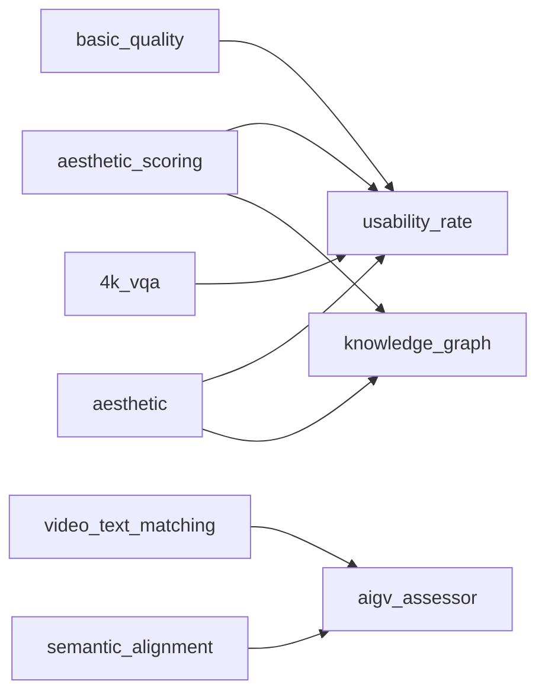

# Ayase Metrics Reference

Auto-generated reference for all pipeline modules. Run `ayase modules docs` to regenerate.

## Summary

| Stat | Value |
|------|-------|
| Total modules | **224** |
| Unique output fields | **229** |
| QualityMetrics fields | 251 |
| Total output mappings | 263 |
| Tiered-backend modules | 35 |
| GPU-accelerated modules | 100 |
| Categories | 13 |

### Modules by Category

```
  No-Reference Quality           ██████████████████████████████ 95
  Full-Reference & Distribution  ███████████ 36
  Motion & Temporal              ███████ 23
  Text & Semantic                █████ 16
  Video Quality Assessment       ████ 15
  Audio Quality                  ███ 10
  Video Generation               ██ 8
  Safety & Content               █ 6
  Face & Identity                █ 4
  HDR & Color                    █ 4
  Codec & Technical               3
  Depth                           3
  Image-to-Video Reference        1
```

### By Input Type

```
  image+video       ██████████████████████████████ 100
  video-only        ██████████████████ 63
  full-reference    ██████████████ 48
  caption-required  ██ 9
  audio             █ 4
```

### Backend Usage

```
  torch         ██████████████████████████████ 105
  opencv        ██████████████████ 63
  pyiqa         █████████████ 48
  transformers  ███████████ 41
  torchvision   ███ 11
  ffmpeg        ███ 11
  piq            3
  torchmetrics   1
```

### Speed Tiers

```
  medium (GPU, ~1s)    ██████████████████████████████ 112
  fast (CPU, <0.1s)    ████████████████████████████ 105
  slow (LLM/VLM, >5s)  █ 7
```

### Top Required Packages

```
  torch          ██████████████████████████████ 105
  opencv-python  ██████████████████ 63
  pyiqa          █████████████ 48
  transformers   ███████████ 41
  Pillow         ██████████ 36
  torchvision    ███ 13
  librosa        ██ 8
  scipy          █ 6
  soundfile      █ 6
  mediapipe      █ 4
  scikit-learn   █ 4
  ultralytics     3
  piq             3
  lpips           3
  scenedetect     2
```

### Recommended Module Presets

**Quick Scan** — Fast quality triage (~1s/sample, CPU-only)
```toml
modules = ['basic', 'metadata', 'exposure', 'letterbox']
```

**Dataset Curation** — Clean & deduplicate datasets for training
```toml
modules = ['basic', 'aesthetic', 'dedup', 'nsfw', 'watermark_classifier', 'brisque', 'metadata', 'embedding', 'diversity_selection']
```

**Video Generation Eval** — Evaluate text-to-video model outputs (VBench-style)
```toml
modules = ['aesthetic', 'subject_consistency', 'background_consistency', 'temporal_flickering', 'motion_smoothness', 'clip_iqa', 'video_text_matching', 'dover', 'ti_si']
```

**Codec Comparison** — Compare video codec quality (needs reference)
```toml
modules = ['vmaf', 'ssimulacra2', 'psnr_hvs', 'ms_ssim', 'butteraugli', 'cambi', 'codec_specific_quality']
```

**Audio Quality** — Speech/audio quality assessment
```toml
modules = ['audio_pesq', 'audio_utmos', 'dnsmos', 'audio_si_sdr', 'audio_estoi', 'visqol']
```

### Benchmark Coverage

| Benchmark | Status |
|-----------|--------|
| VBench (16/16) | Covered |
| VBench-2.0 (5/5) | Covered |
| EvalCrafter (17/17) | Covered |
| ChronoMagic-Bench (2/2) | Covered |
| T2V-CompBench (7/7) | Covered |
| DEVIL (4/4) | Covered |

### Field Collisions

Multiple modules write to the same QualityMetrics field:

| Field | Writers |
|-------|---------|
| `aesthetic_score` | `aesthetic`, `aesthetic_scoring` |
| `artifacts_score` | `basic_quality`, `imaging_quality` |
| `blur_score` | `basic_quality`, `cpbd` |
| `camera_motion_score` | `camera_motion`, `stabilized_motion` |
| `clip_score` | `semantic_alignment`, `video_text_matching` |
| `clip_temp` | `clip_temporal`, `video_text_matching` |
| `is_score` | `inception_score`, `object_detection` |
| `motion_score` | `motion`, `stabilized_motion` |
| `noise_score` | `basic_quality`, `imaging_quality` |
| `technical_score` | `basic_quality`, `4k_vqa` |
| `text_overlay_score` | `text_detection`, `text_overlay` |

### Orphaned QualityMetrics Fields

19 fields in `QualityMetrics` model that no module populates:

- `audio_quality_score` (audio)
- `compbench_action` (alignment)
- `compbench_attribute` (alignment)
- `compbench_numeracy` (alignment)
- `compbench_object_rel` (alignment)
- `compbench_overall` (alignment)
- `compbench_scene` (alignment)
- `compbench_spatial` (alignment)
- `compression_score` (basic)
- `depth_score` (spatial)
- `fvd` (distribution)
- `fvmd` (distribution)
- `jedi` (distribution)
- `kvd` (distribution)
- `lpips` (fr_quality)
- `psnr` (fr_quality)
- `ssim` (fr_quality)
- `temporal_consistency` (temporal)
- `usability_score` (meta)

### Module Dependency Graph

Modules that read QualityMetrics fields written by other modules:



### Score Direction Reference

| Field | Direction | Range | Category |
|-------|-----------|-------|----------|
| `action_confidence` | — | 0-100 | scene |
| `action_score` | ↑ higher=better | 0-100 | scene |
| `aesthetic_score` | ↑ higher=better | — | aesthetic |
| `afine_score` | ↑ higher=better | — | nr_quality |
| `ahiq` | ↑ higher=better | higher=better | fr_quality |
| `ai_generated_probability` | — | — | safety |
| `aigv_alignment` | — | — | alignment |
| `aigv_dynamic` | — | — | motion |
| `aigv_static` | — | — | nr_quality |
| `aigv_temporal` | — | — | temporal |
| `arniqa_score` | ↑ higher=better | higher=better | nr_quality |
| `artifacts_score` | ↑ higher=better | — | basic |
| `auto_caption` | — | — | text |
| `av_sync_offset` | — | — | audio |
| `avg_scene_duration` | — | — | scene |
| `background_consistency` | ↑ higher=better | — | temporal |
| `banding_severity` | ↓ lower=better | lower=better | production |
| `bias_score` | ↑ higher=better | — | safety |
| `blip_bleu` | — | — | alignment |
| `blur_score` | ↑ higher=better | — | basic |
| `brightness` | — | — | basic |
| `brisque` | ↓ lower=better | 0-100, lower=better | nr_quality |
| `butteraugli` | ↓ lower=better | lower=better | fr_quality |
| `c3dvqa_score` | ↑ higher=better | — | fr_quality |
| `cambi` | ↓ lower=better | 0-24, lower=better | codec |
| `camera_jitter_score` | ↓ lower=better | 0-1, 1=stable | motion |
| `camera_motion_score` | ↑ higher=better | — | motion |
| `celebrity_id_score` | ↑ higher=better | — | face |
| `cgvqm` | ↑ higher=better | higher=better | nr_quality |
| `chronomagic_ch_score` | ↓ lower=better | 0-1, lower=fewer | temporal |
| `chronomagic_mt_score` | ↑ higher=better | 0-1, higher=better | temporal |
| `ciede2000` | ↓ lower=better | lower=better | fr_quality |
| `ckdn_score` | ↑ higher=better | — | fr_quality |
| `clip_iqa_score` | ↑ higher=better | 0-1, higher=better | nr_quality |
| `clip_score` | ↑ higher=better | — | alignment |
| `clip_temp` | — | — | temporal |
| `cnniqa_score` | ↑ higher=better | — | nr_quality |
| `codec_artifacts` | ↓ lower=better | lower=better | codec |
| `codec_efficiency` | ↑ higher=better | higher=better | codec |
| `color_grading_score` | ↑ higher=better | — | production |
| `color_score` | ↑ higher=better | — | scene |
| `commonsense_score` | ↑ higher=better | 0-1, higher=better | scene |
| `compare2score` | ↑ higher=better | — | nr_quality |
| `compression_artifacts` | — | 0-100 | basic |
| `confidence_score` | ↑ higher=better | — | meta |
| `contrast` | — | — | basic |
| `contrique_score` | ↑ higher=better | higher=better | nr_quality |
| `count_score` | ↑ higher=better | — | scene |
| `cover_aesthetic` | — | — | aesthetic |
| `cover_score` | ↑ higher=better | higher=better | nr_quality |
| `cover_semantic` | — | — | aesthetic |
| `cover_technical` | — | — | nr_quality |
| `creativity_score` | ↑ higher=better | 0-1, higher=better | aesthetic |
| `cw_ssim` | ↑ higher=better | 0-1, higher=better | fr_quality |
| `dbcnn_score` | ↑ higher=better | higher=better | nr_quality |
| `deepfake_probability` | — | — | safety |
| `deepwsd_score` | ↓ lower=better | — | fr_quality |
| `delta_ictcp` | ↓ lower=better | lower=better | hdr |
| `depth_anything_consistency` | ↑ higher=better | — | spatial |
| `depth_anything_score` | ↑ higher=better | — | spatial |
| `depth_quality` | ↑ higher=better | higher=better | spatial |
| `depth_temporal_consistency` | ↑ higher=better | higher=better | temporal |
| `detection_score` | ↑ higher=better | — | scene |
| `dists` | ↓ lower=better | 0-1, lower=more similar | fr_quality |
| `dmm` | ↑ higher=better | higher=better | fr_quality |
| `dnsmos_bak` | ↑ higher=better | 1-5, higher=better | audio |
| `dnsmos_overall` | ↑ higher=better | 1-5, higher=better | audio |
| `dnsmos_sig` | ↑ higher=better | 1-5, higher=better | audio |
| `dover_aesthetic` | — | — | aesthetic |
| `dover_score` | ↑ higher=better | higher=better | nr_quality |
| `dover_technical` | — | — | nr_quality |
| `dreamsim` | ↓ lower=better | lower=more similar | fr_quality |
| `dynamics_controllability` | — | — | motion |
| `dynamics_range` | — | — | motion |
| `estoi_score` | ↑ higher=better | 0-1, higher=better | audio |
| `exposure_consistency` | ↑ higher=better | — | production |
| `face_consistency` | ↑ higher=better | — | face |
| `face_count` | — | — | face |
| `face_expression_smoothness` | — | — | face |
| `face_identity_consistency` | ↑ higher=better | 0-1 | face |
| `face_iqa_score` | ↑ higher=better | higher=better | face |
| `face_landmark_jitter` | ↓ lower=better | lower=better | face |
| `face_quality_score` | ↑ higher=better | higher=better | face |
| `face_recognition_score` | ↑ higher=better | 0-1, higher=better | face |
| `fast_vqa_score` | ↑ higher=better | — | nr_quality |
| `finevq_score` | ↑ higher=better | — | nr_quality |
| `flicker_score` | ↓ lower=better | lower=better | temporal |
| `flip_score` | ↓ lower=better | 0-1, lower=better | fr_quality |
| `flolpips` | — | — | fr_quality |
| `flow_coherence` | — | 0-1 | temporal |
| `flow_score` | ↑ higher=better | — | motion |
| `focus_quality` | ↑ higher=better | — | production |
| `fsim` | ↑ higher=better | 0-1, higher=better | fr_quality |
| `funque_score` | ↑ higher=better | — | fr_quality |
| `gmsd` | ↓ lower=better | lower=better | fr_quality |
| `gop_quality` | ↑ higher=better | higher=better | codec |
| `gradient_detail` | — | 0-100 | scene |
| `harmful_content_score` | ↑ higher=better | — | safety |
| `hdr_quality` | ↑ higher=better | — | hdr |
| `hdr_vdp` | ↑ higher=better | higher=better | hdr |
| `hdr_vqm` | — | — | hdr |
| `human_fidelity_score` | ↑ higher=better | 0-1, higher=better | scene |
| `hyperiqa_score` | ↑ higher=better | — | nr_quality |
| `i2v_clip` | — | 0-1 | i2v |
| `i2v_dino` | — | 0-1 | i2v |
| `i2v_lpips` | ↓ lower=better | 0-1, lower=better | i2v |
| `i2v_quality` | ↑ higher=better | 0-100 | i2v |
| `identity_loss` | ↓ lower=better | 0-1, lower=better | face |
| `ilniqe` | ↓ lower=better | lower=better | nr_quality |
| `is_score` | ↑ higher=better | — | distribution |
| `judder_score` | ↓ lower=better | lower=better | temporal |
| `jump_cut_score` | ↑ higher=better | 0-1, 1=no cuts | temporal |
| `kvq_score` | ↑ higher=better | — | nr_quality |
| `laion_aesthetic` | — | 0-10 | aesthetic |
| `letterbox_ratio` | — | 0-1, 0=no borders | basic |
| `liqe_score` | ↑ higher=better | higher=better | nr_quality |
| `lpdist_score` | ↓ lower=better | lower=better | audio |
| `maclip_score` | ↑ higher=better | higher=better | nr_quality |
| `mad` | ↓ lower=better | lower=better | fr_quality |
| `maniqa_score` | ↑ higher=better | higher=better | nr_quality |
| `max_cll` | — | — | hdr |
| `max_fall` | — | — | hdr |
| `mcd_score` | ↓ lower=better | dB, lower=better | audio |
| `mdtvsfa_score` | ↑ higher=better | higher=better | nr_quality |
| `motion_ac_score` | ↑ higher=better | — | motion |
| `motion_score` | ↑ higher=better | — | motion |
| `motion_smoothness` | ↑ higher=better | 0-1, higher=better | motion |
| `movie_score` | ↑ higher=better | — | fr_quality |
| `ms_ssim` | — | 0-1 | fr_quality |
| `multiview_consistency` | ↑ higher=better | higher=better | spatial |
| `musiq_score` | ↑ higher=better | higher=better | nr_quality |
| `naturalness_score` | ↑ higher=better | — | nr_quality |
| `nemo_quality_label` | ↑ higher=better | — | meta |
| `nemo_quality_score` | ↑ higher=better | 0-1 | meta |
| `nima_score` | ↑ higher=better | 1-10, higher=better | aesthetic |
| `niqe` | ↓ lower=better | lower=better | nr_quality |
| `nlpd` | ↓ lower=better | lower=better | fr_quality |
| `noise_score` | ↑ higher=better | — | basic |
| `nrqm` | ↑ higher=better | higher=better | nr_quality |
| `nsfw_score` | ↑ higher=better | — | safety |
| `object_permanence_score` | ↑ higher=better | — | temporal |
| `ocr_area_ratio` | — | — | text |
| `ocr_cer` | ↓ lower=better | 0-1, lower=better | text |
| `ocr_fidelity` | ↑ higher=better | 0-100, higher=better | text |
| `ocr_score` | ↑ higher=better | — | text |
| `ocr_wer` | ↓ lower=better | 0-1, lower=better | text |
| `p1203_mos` | — | 1-5 | audio |
| `paq2piq_score` | ↑ higher=better | — | nr_quality |
| `pesq_score` | ↑ higher=better | -0.5 to 4.5, higher=better | audio |
| `physics_score` | ↑ higher=better | 0-1, higher=better | motion |
| `pi_score` | ↓ lower=better | PIRM challenge, lower=better | nr_quality |
| `pieapp` | ↓ lower=better | lower=better | fr_quality |
| `piqe` | ↓ lower=better | lower=better | nr_quality |
| `playback_speed_score` | ↑ higher=better | — | motion |
| `promptiqa_score` | ↑ higher=better | — | nr_quality |
| `psnr_hvs` | ↑ higher=better | dB, higher=better | fr_quality |
| `psnr_hvs_m` | ↑ higher=better | dB, higher=better | fr_quality |
| `ptlflow_motion_score` | ↑ higher=better | — | motion |
| `pu_psnr` | ↑ higher=better | dB, higher=better | hdr |
| `pu_ssim` | ↑ higher=better | 0-1, higher=better | hdr |
| `qalign_aesthetic` | ↑ higher=better | 1-5, higher=better | aesthetic |
| `qalign_quality` | ↑ higher=better | 1-5, higher=better | nr_quality |
| `qcn_score` | ↑ higher=better | — | nr_quality |
| `qualiclip_score` | ↑ higher=better | higher=better | nr_quality |
| `raft_motion_score` | ↑ higher=better | — | motion |
| `ram_tags` | — | — | scene |
| `rqvqa_score` | ↑ higher=better | — | nr_quality |
| `saturation` | — | — | basic |
| `scene_complexity` | — | — | scene |
| `scene_stability` | — | — | temporal |
| `sd_score` | ↑ higher=better | 0-1 | alignment |
| `sdr_quality` | ↑ higher=better | — | hdr |
| `semantic_consistency` | ↑ higher=better | higher=better | temporal |
| `si_sdr_score` | ↑ higher=better | dB, higher=better | audio |
| `spatial_information` | — | higher=more detail | basic |
| `spectral_entropy` | — | — | nr_quality |
| `spectral_rank` | — | — | nr_quality |
| `ssimc` | ↑ higher=better | higher=better | fr_quality |
| `ssimulacra2` | ↓ lower=better | 0-100, lower=better, JPEG XL standard | fr_quality |
| `st_greed_score` | ↑ higher=better | — | fr_quality |
| `st_lpips` | — | — | fr_quality |
| `stereo_comfort_score` | ↑ higher=better | higher=better | spatial |
| `strred` | ↓ lower=better | lower=better | fr_quality |
| `stutter_score` | ↓ lower=better | lower=better | temporal |
| `subject_consistency` | ↑ higher=better | 0-1, higher=better | temporal |
| `t2v_alignment` | — | — | alignment |
| `t2v_quality` | ↑ higher=better | — | nr_quality |
| `t2v_score` | ↑ higher=better | — | alignment |
| `technical_score` | ↑ higher=better | — | basic |
| `temporal_information` | — | higher=more motion | basic |
| `text_overlay_score` | ↑ higher=better | 0-1 | text |
| `tifa_score` | ↑ higher=better | 0-1, higher=better | alignment |
| `tlvqm_score` | ↑ higher=better | — | nr_quality |
| `tonal_dynamic_range` | — | 0-100 | basic |
| `topiq_fr` | ↑ higher=better | higher=better | fr_quality |
| `topiq_score` | ↑ higher=better | higher=better | nr_quality |
| `trajan_score` | ↑ higher=better | — | motion |
| `tres_score` | ↑ higher=better | — | nr_quality |
| `unique_score` | ↑ higher=better | — | nr_quality |
| `usability_rate` | — | — | meta |
| `utmos_score` | ↑ higher=better | 1-5, higher=better | audio |
| `video_memorability` | — | — | nr_quality |
| `video_reward_score` | ↑ higher=better | — | alignment |
| `video_type` | — | — | scene |
| `video_type_confidence` | — | — | scene |
| `videoscore_alignment` | ↑ higher=better | — | alignment |
| `videoscore_dynamic` | ↑ higher=better | — | motion |
| `videoscore_factual` | ↑ higher=better | — | alignment |
| `videoscore_temporal` | ↑ higher=better | — | temporal |
| `videoscore_visual` | ↑ higher=better | — | nr_quality |
| `videval_score` | ↑ higher=better | — | nr_quality |
| `vif` | — | — | fr_quality |
| `visqol` | ↑ higher=better | 1-5, higher=better | audio |
| `vmaf` | ↑ higher=better | 0-100, higher=better | fr_quality |
| `vmaf_4k` | ↑ higher=better | 0-100, higher=better | fr_quality |
| `vmaf_neg` | ↑ higher=better | no enhancement gain, 0-100, higher=better | fr_quality |
| `vmaf_phone` | ↑ higher=better | 0-100, higher=better | fr_quality |
| `vqa_a_score` | ↑ higher=better | — | alignment |
| `vqa_score_alignment` | ↑ higher=better | — | alignment |
| `vqa_t_score` | ↑ higher=better | — | alignment |
| `vsi_score` | ↑ higher=better | 0-1, higher=better | fr_quality |
| `vtss` | — | 0-1 | meta |
| `wadiqam_fr` | ↑ higher=better | higher=better | fr_quality |
| `wadiqam_score` | ↑ higher=better | higher=better | nr_quality |
| `warping_error` | ↓ lower=better | — | temporal |
| `watermark_probability` | — | — | safety |
| `watermark_strength` | — | — | safety |
| `white_balance_score` | ↑ higher=better | — | production |
| `xpsnr` | ↑ higher=better | dB, higher=better | fr_quality |

### Deprecated Field Aliases

| Old Name | Maps To | Status |
|----------|---------|--------|
| `fid_score` | `—` | deprecated, writes discarded |
| `kid_score` | `—` | deprecated, writes discarded |
| `inception_score` | `is_score` | alias |
| `ssim_score` | `ssim` | alias |
| `psnr_score` | `psnr` | alias |
| `lpips_score` | `lpips` | alias |
| `alignment_score` | `clip_score` | alias |

### Static Health Checks

25 module(s) with warnings:

- `audio_visual_sync`: declares output fields but never assigns quality_metrics
- `basic`: declares output fields but never assigns quality_metrics
- `bd_rate`: no output fields and no validation issues
- `dataset_analytics`: no output fields and no validation issues
- `dedup`: no output fields and no validation issues
- `diversity_selection`: no output fields and no validation issues
- `dreamsim_metric`: declares output fields but never assigns quality_metrics
- `embedding`: no output fields and no validation issues
- `flip_metric`: declares output fields but never assigns quality_metrics
- `fvd`: no output fields and no validation issues
- `fvmd`: no output fields and no validation issues
- `generative_distribution`: no output fields and no validation issues
- `generative_distribution_metrics`: no output fields and no validation issues
- `jedi`: no output fields and no validation issues
- `jedi_metric`: no output fields and no validation issues
- `knowledge_graph`: no output fields and no validation issues
- `kvd`: no output fields and no validation issues
- `mad_metric`: declares output fields but never assigns quality_metrics
- `nlpd_metric`: declares output fields but never assigns quality_metrics
- `pi_metric`: declares output fields but never assigns quality_metrics
- `spectral`: declares output fields but never assigns quality_metrics
- `t2v_compbench`: no output fields and no validation issues
- `text`: declares output fields but never assigns quality_metrics
- `umap_projection`: no output fields and no validation issues
- `unique_iqa`: declares output fields but never assigns quality_metrics

---

## Audio Quality

| Module | Input | Outputs | Description | Config |
|--------|-------|---------|-------------|--------|
| `audio_estoi` | audio +ref | `estoi_score` - ESTOI intelligibility (0-1, higher=better) | ESTOI speech intelligibility (full-reference) | `target_sr=10000`, `warning_threshold=0.5` |
| `audio_lpdist` | audio +ref | `lpdist_score` - Log-Power Spectral Distance (lower=better) | Log-Power Spectral Distance (full-reference audio) | `target_sr=16000`, `n_mels=80`, +1 |
| `audio_mcd` | audio +ref | `mcd_score` - Mel Cepstral Distortion (dB, lower=better) | Mel Cepstral Distortion for TTS/VC quality (full-reference) | `target_sr=16000`, `n_mfcc=13`, +1 |
| `audio_pesq` | audio +ref | `pesq_score` - PESQ (-0.5 to 4.5, higher=better) | PESQ speech quality (full-reference, ITU-T P.862) | `target_sr=16000`, `warning_threshold=3.0` |
| `audio_si_sdr` | audio +ref | `si_sdr_score` - Scale-Invariant SDR (dB, higher=better) | Scale-Invariant SDR for audio quality (full-reference) | `target_sr=16000`, `warning_threshold=0.0` |
| `audio_text_alignment` | audio +cap | - | Multimodal alignment check (Audio-Text) using CLAP | `alignment_threshold=0.2`, `model_name=laion/clap-htsat-fused` |
| `audio_utmos` | audio | `utmos_score` - UTMOS predicted MOS (1-5, higher=better) | UTMOS no-reference MOS prediction for speech quality | `target_sr=16000`, `warning_threshold=3.0` |
| `audio_visual_sync` | audio | `av_sync_offset` - Audio-video sync offset in ms | Audio-video synchronisation offset detection | `max_frames=600`, `warning_threshold_ms=80.0` |
| `av_sync` | audio | `av_sync_offset` - Audio-video sync offset in ms | Audio-video synchronisation offset detection | `max_frames=600`, `warning_threshold_ms=80.0` |
| `dnsmos` | audio | `dnsmos_overall` - DNSMOS overall MOS (1-5, higher=better); `dnsmos_sig` - DNSMOS signal quality (1-5, higher=better); `dnsmos_bak` - DNSMOS background quality (1-5, higher=better) | DNSMOS non-intrusive audio quality (Microsoft, 1-5 MOS) | - |

## Codec & Technical

| Module | Input | Outputs | Description | Config |
|--------|-------|---------|-------------|--------|
| `codec_compatibility` | vid | - | Validates codec, pixel format, and container for ML dataloader compatibility | `min_bitrate_kbps=500`, `min_bpp=0.02` |
| `codec_specific_quality` | vid | `codec_efficiency` - Quality-per-bit efficiency 0-100 (higher=better); `gop_quality` - GOP structure appropriateness 0-100 (higher=better); `codec_artifacts` - Block artifact severity 0-100 (lower=better) | Codec-level efficiency, GOP quality, and artifact detection | `max_frames=100`, `subsample=10`, +2 |
| `letterbox` | img/vid | `letterbox_ratio` - Border/letterbox fraction (0-1, 0=no borders) | Border/letterbox detection (0-1, 0=no borders) | `threshold=16`, `subsample=4` |

## Depth

| Module | Input | Outputs | Description | Config |
|--------|-------|---------|-------------|--------|
| `depth_anything` | img/vid | `depth_anything_score` - Monocular depth quality; `depth_anything_consistency` - Temporal depth consistency | Depth Anything V2 monocular depth estimation and consistency | `model_name=depth-anything/Depth-Anything-V2-Small-hf`, `subsample=8` |
| `depth_consistency` | vid | `depth_temporal_consistency` - Depth map correlation 0-1 (higher=better) | Monocular depth temporal consistency | `model_type=MiDaS_small`, `device=auto`, +3 |
| `depth_map_quality` | img/vid | `depth_quality` - Depth map quality 0-100 (higher=better) | Monocular depth map quality (sharpness, completeness, edge alignment) | `model_type=MiDaS_small`, `device=auto`, +2 |

## Face & Identity

| Module | Input | Outputs | Description | Config |
|--------|-------|---------|-------------|--------|
| `face_fidelity` | img/vid | `face_count`; `face_quality_score` - Composite face quality 0-100 (higher=better) | Face detection and per-face quality assessment | `backend=haar`, `subsample=5`, +4 |
| `face_iqa` | img/vid | `face_iqa_score` - TOPIQ-face face quality (higher=better) | Face-specific IQA via TOPIQ-face (GFIQA-trained, higher=better) | `subsample=8` |
| `face_landmark_quality` | vid | `face_landmark_jitter` - Landmark jitter 0-100 (lower=better); `face_expression_smoothness`; `face_identity_consistency` - Temporal face identity stability (0-1) | Facial landmark jitter, expression smoothness, identity consistency | `subsample=2`, `max_frames=300`, +1 |
| `identity_loss` | img/vid +ref | `identity_loss` - Face identity cosine distance (0-1, lower=better); `face_recognition_score` - Face identity cosine similarity (0-1, higher=better) | Face identity preservation metric (cosine distance/similarity vs reference) | `model_name=buffalo_l`, `subsample=8`, +1 |

## Full-Reference & Distribution

| Module | Input | Outputs | Description | Config |
|--------|-------|---------|-------------|--------|
| `ahiq` | img/vid +ref | `ahiq` - Attention Hybrid IQA (higher=better) | Attention-based Hybrid IQA full-reference (higher=better) | `subsample=8` |
| `butteraugli` | img/vid +ref | `butteraugli` - Butteraugli perceptual distance (lower=better) | Butteraugli perceptual distance (Google/JPEG XL, lower=better) | `subsample=5`, `warning_threshold=2.0` |
| `ciede2000` | img/vid +ref | `ciede2000` - CIEDE2000 perceptual color difference (lower=better) | CIEDE2000 perceptual color difference (lower=better) | `subsample=5` |
| `ckdn` | img/vid +ref | `ckdn_score` - CKDN knowledge distillation FR | CKDN knowledge distillation FR image quality | `subsample=4` |
| `cw_ssim` | img/vid +ref | `cw_ssim` - Complex Wavelet SSIM (0-1, higher=better) | Complex Wavelet SSIM full-reference metric (0-1, higher=better) | `subsample=8` |
| `deepwsd` | img/vid +ref | `deepwsd_score` - DeepWSD Wasserstein distance FR | DeepWSD Wasserstein distance FR image quality | `subsample=4` |
| `delta_ictcp` | img/vid +ref | `delta_ictcp` - Delta ICtCp HDR color difference (lower=better) | Delta ICtCp HDR perceptual color difference (lower=better) | `subsample=5` |
| `dmm` | img/vid +ref | `dmm` - DMM Detail Model Metric FR (higher=better) | DMM detail model metric full-reference (higher=better) | `subsample=8` |
| `dreamsim` | img/vid +ref | `dreamsim` - DreamSim CLIP+DINO similarity (lower=more similar) | DreamSim foundation model perceptual similarity (CLIP+DINO ensemble) | `subsample=8`, `model_type=ensemble` |
| `dreamsim_metric` | img/vid +ref | `dreamsim` - DreamSim CLIP+DINO similarity (lower=more similar) | DreamSim foundation model perceptual similarity (CLIP+DINO ensemble) | `subsample=8`, `model_type=ensemble` |
| `flip` | img/vid +ref | `flip_score` - NVIDIA FLIP perceptual metric (0-1, lower=better) | NVIDIA FLIP perceptual difference (0-1, lower=better) | `subsample=5`, `warning_threshold=0.3` |
| `flip_metric` | img/vid +ref | `flip_score` - NVIDIA FLIP perceptual metric (0-1, lower=better) | NVIDIA FLIP perceptual difference (0-1, lower=better) | `subsample=5`, `warning_threshold=0.3` |
| `flolpips` | vid | `flolpips` - FloLPIPS flow-based perceptual FR | Flow-compensated perceptual distance (RAFT+LPIPS, Farneback+LPIPS, or MSE fallback) | `subsample=8` |
| `fvd` | vid +ref | - | Fréchet Video Distance for video generation evaluation (batch metric) | `i3d_weights=kinetics400`, `num_frames=16`, +3 |
| `fvmd` | vid | - | Fréchet Video Motion Distance for motion quality evaluation (batch metric) | `num_frames=16`, `flow_method=farneback`, +1 |
| `hdr_vdp` | img/vid +ref | `hdr_vdp` - HDR-VDP visual difference predictor (higher=better) | HDR-VDP visual difference predictor (higher=better) | `subsample=5` |
| `kvd` | vid | - | Kernel Video Distance using Maximum Mean Discrepancy (batch metric) | `feature_extractor=i3d`, `kernel=rbf`, +2 |
| `mad` | img/vid +ref | `mad` - Most Apparent Distortion (lower=better) | Most Apparent Distortion full-reference metric (lower=better) | `subsample=8` |
| `mad_metric` | img/vid +ref | `mad` - Most Apparent Distortion (lower=better) | Most Apparent Distortion full-reference metric (lower=better) | `subsample=8` |
| `ms_ssim` | vid +ref | `ms_ssim` - Multi-Scale SSIM (0-1) | Multi-Scale SSIM perceptual similarity metric (full-reference) | `scales=5`, `weights=[0.0448, 0.2856, 0.3001, 0.2363, 0.1333]`, +3 |
| `nlpd` | img/vid +ref | `nlpd` - Normalized Laplacian Pyramid Distance (lower=better) | Normalized Laplacian Pyramid Distance full-reference (lower=better) | `subsample=8` |
| `nlpd_metric` | img/vid +ref | `nlpd` - Normalized Laplacian Pyramid Distance (lower=better) | Normalized Laplacian Pyramid Distance full-reference (lower=better) | `subsample=8` |
| `pieapp` | img/vid +ref | `pieapp` - PieAPP pairwise preference (lower=better) | PieAPP full-reference perceptual error via pairwise preference (lower=better) | `subsample=8` |
| `psnr_hvs` | img/vid +ref | `psnr_hvs` - PSNR-HVS perceptually weighted (dB, higher=better); `psnr_hvs_m` - PSNR-HVS-M with masking (dB, higher=better) | PSNR-HVS + PSNR-HVS-M perceptually weighted PSNR (dB, higher=better) | `subsample=5` |
| `ssimc` | img/vid +ref | `ssimc` - Complex Wavelet SSIM-C FR (higher=better) | SSIM-C complex wavelet structural similarity FR (higher=better) | `subsample=8` |
| `ssimulacra2` | img/vid +ref | `ssimulacra2` - SSIMULACRA 2 (0-100, lower=better, JPEG XL standard) | SSIMULACRA 2 perceptual distance (JPEG XL standard, lower=better) | `subsample=5`, `warning_threshold=50.0` |
| `st_lpips` | vid | `st_lpips` - ST-LPIPS spatiotemporal perceptual FR | Spatiotemporal perceptual video quality (ST-LPIPS model, LPIPS, or heuristic fallback) | `subsample=8` |
| `strred` | img/vid +ref | `strred` - STRRED reduced-reference temporal (lower=better) | STRRED reduced-reference temporal quality (ITU, lower=better) | `subsample=3` |
| `topiq_fr` | img/vid +ref | `topiq_fr` - TOPIQ full-reference (higher=better) | TOPIQ full-reference top-down semantics-to-distortion IQA (higher=better) | `subsample=8` |
| `vif` | img/vid +ref | `vif` - Visual Information Fidelity | Visual Information Fidelity metric (full-reference) | `subsample=1`, `warning_threshold=0.3`, +1 |
| `vmaf` | vid +ref | `vmaf` - VMAF (0-100, higher=better) | VMAF perceptual video quality metric (full-reference) | `vmaf_model=vmaf_v0.6.1`, `subsample=1`, +2 |
| `vmaf_4k` | vid +ref | `vmaf_4k` - VMAF 4K model (0-100, higher=better) | VMAF 4K model for UHD content (0-100, higher=better) | - |
| `vmaf_neg` | vid +ref | `vmaf_neg` - VMAF NEG (no enhancement gain, 0-100, higher=better) | VMAF NEG no-enhancement-gain variant (0-100, higher=better) | `subsample=1`, `warning_threshold=70.0` |
| `vmaf_phone` | vid +ref | `vmaf_phone` - VMAF phone model (0-100, higher=better) | VMAF phone model for mobile viewing (0-100, higher=better) | - |
| `wadiqam_fr` | img/vid +ref | `wadiqam_fr` - WaDIQaM full-reference (higher=better) | WaDIQaM full-reference deep quality metric (higher=better) | `subsample=8` |
| `xpsnr` | img/vid +ref | `xpsnr` - XPSNR perceptual PSNR (dB, higher=better) | XPSNR perceptually weighted PSNR (Fraunhofer, dB, higher=better) | - |

## HDR & Color

| Module | Input | Outputs | Description | Config |
|--------|-------|---------|-------------|--------|
| `hdr_metadata` | vid | `max_fall` - MaxFALL frame average light level (nits); `max_cll` - MaxCLL content light level (nits) | MaxFALL + MaxCLL HDR static metadata analysis | `subsample=3`, `peak_nits=10000.0` |
| `hdr_sdr_vqa` | vid | `hdr_quality` - HDR-specific quality; `sdr_quality` - SDR-specific quality; `technical_score` - Composite technical score | HDR/SDR-aware video quality assessment | `subsample=5` |
| `pu_metrics` | img/vid +ref | `pu_psnr` - PU-PSNR perceptually uniform HDR (dB, higher=better); `pu_ssim` - PU-SSIM perceptually uniform HDR (0-1, higher=better) | PU-PSNR + PU-SSIM for HDR content (perceptually uniform) | `subsample=5`, `assume_nits_range=10000.0` |
| `tonal_dynamic_range` | img/vid | `tonal_dynamic_range` - Luminance histogram span (0-100) | Luminance histogram tonal range (0-100) | `low_percentile=1`, `high_percentile=99`, +1 |

## Image-to-Video Reference

| Module | Input | Outputs | Description | Config |
|--------|-------|---------|-------------|--------|
| `i2v_similarity` | vid +ref | `i2v_clip` - CLIP image-video similarity (0-1); `i2v_dino` - DINOv2 image-video similarity (0-1); `i2v_lpips` - LPIPS image-video distance (0-1, lower=better); `i2v_quality` - Aggregated I2V quality (0-100) | Image-to-Video reference similarity using CLIP, DINOv2, and LPIPS (sliding window) | `window_size=16`, `stride=8`, +7 |

## Motion & Temporal

| Module | Input | Outputs | Description | Config |
|--------|-------|---------|-------------|--------|
| `advanced_flow` | vid | `flow_score` | RAFT optical flow: flow_score (all consecutive pairs) | `use_large_model=True`, `max_frames=150` |
| `background_consistency` | vid | `background_consistency` | Background consistency using CLIP (all pairwise frame similarity) | `model_name=openai/clip-vit-base-patch32`, `max_frames=16`, +1 |
| `camera_jitter` | vid | `camera_jitter_score` - Camera stability (0-1, 1=stable) | Camera jitter/shake detection (0-1, 1=stable) | `subsample=16` |
| `camera_motion` | vid | `camera_motion_score` - Camera motion intensity | Analyzes camera motion stability (VMBench) using Homography | - |
| `clip_temporal` | vid | `clip_temp`; `face_consistency` | CLIP temporal consistency + face/identity consistency (EvalCrafter clip_temp & face_consistency) | `model_name=openai/clip-vit-base-patch32`, `max_frames=32`, +2 |
| `flicker_detection` | vid | `flicker_score` - Flicker severity 0-100 (lower=better) | Detects temporal luminance flicker | `max_frames=600`, `warning_threshold=30.0` |
| `flow_coherence` | vid | `flow_coherence` - Bidirectional optical flow consistency (0-1) | Bidirectional optical flow consistency (0-1, higher=coherent) | `subsample=8` |
| `judder_stutter` | vid | `judder_score` - Judder severity 0-100 (lower=better); `stutter_score` - Duplicate/dropped frames 0-100 (lower=better) | Detects judder (uneven cadence) and stutter (duplicate frames) | `max_frames=600`, `duplicate_threshold=1.0`, +1 |
| `jump_cut` | vid | `jump_cut_score` - Jump cut absence (0-1, 1=no cuts) | Jump cut / abrupt transition detection (0-1, 1=no cuts) | `threshold=40.0` |
| `kandinsky_motion` | vid | - | Video/Camera Motion Analysis using Kandinsky Video Tools (VideoMAE-V2) | `models_dir=models` |
| `motion` | vid | `motion_score` - Scene motion intensity | Analyzes motion dynamics (optical flow, flickering) | `sample_rate=5`, `low_motion_threshold=0.5`, +1 |
| `motion_amplitude` | vid | `motion_ac_score` | Motion amplitude classification vs caption (motion_ac_score via RAFT) | `amplitude_threshold=5.0`, `max_frames=150`, +1 |
| `motion_smoothness` | vid | `motion_smoothness` - Motion smoothness (0-1, higher=better) | Motion smoothness via RIFE VFI reconstruction error (VBench) | `vfi_error_threshold=0.08`, `max_frames=64` |
| `object_permanence` | vid | `object_permanence_score` | Object tracking consistency (ID switches, disappearances) | `backend=auto`, `subsample=2`, +3 |
| `playback_speed` | vid | `playback_speed_score` - Normal speed (1.0=normal) | Playback speed normality detection (1.0=normal) | `subsample=16` |
| `ptlflow_motion` | vid | `ptlflow_motion_score` - ptlflow optical flow magnitude | ptlflow optical flow motion scoring (dpflow model) | `model_name=dpflow`, `ckpt_path=things`, +1 |
| `raft_motion` | vid | `raft_motion_score` - RAFT optical flow magnitude | RAFT optical flow motion scoring (torchvision) | `subsample=8` |
| `scene_detection` | vid | `scene_stability`; `avg_scene_duration` - Average scene duration in seconds | Scene stability metric — penalises rapid cuts (0-1, higher=more stable) | `threshold=0.5` |
| `stabilized_motion` | vid | `motion_score` - Scene motion intensity; `camera_motion_score` - Camera motion intensity | Calculates motion scores with camera stabilization (ORB+Homography) | `step=2`, `threshold_px=0.5`, +3 |
| `subject_consistency` | vid | `subject_consistency` - Subject identity consistency (0-1, higher=better) | Subject consistency using DINOv2-base (all pairwise frame similarity) | `model_name=facebook/dinov2-base`, `max_frames=16`, +1 |
| `temporal_flickering` | vid | `warping_error` | Warping Error using RAFT optical flow with occlusion masking | `warning_threshold=0.02`, `max_frames=300` |
| `temporal_style` | vid | - | Analyzes temporal style (Slow Motion, Timelapse, Speed) | - |
| `vfr_detection` | vid | - | Variable Frame Rate (VFR) and jitter detection | `jitter_threshold_ms=2.0` |

## No-Reference Quality

| Module | Input | Outputs | Description | Config |
|--------|-------|---------|-------------|--------|
| `4k_vqa` | vid | `hdr_quality` - HDR-specific quality; `sdr_quality` - SDR-specific quality; `technical_score` - Composite technical score | Memory-efficient quality assessment for 4K+ videos | `tile_size=512`, `subsample=10` |
| `action_recognition` | vid +cap | `action_confidence` - Top-1 action confidence (0-100); `action_score` - Caption-action fidelity (0-100) | Recognizes human actions (VideoMAE / UMT) - Supports Heavy Models | `model_name=MCG-NJU/videomae-large-finetuned-kinetics`, `caption_matching=False`, +3 |
| `aesthetic` | img/vid | `aesthetic_score` - 0-10, from aesthetic predictor; `vqa_a_score` | Estimates aesthetic quality using Aesthetic Predictor V2.5 | `num_frames=5`, `trust_remote_code=True`, +1 |
| `aesthetic_scoring` | img/vid | `aesthetic_score` - 0-10, from aesthetic predictor | Calculates aesthetic score (1-10) using LAION-Aesthetics MLP | `models_dir=models` |
| `afine` | img/vid | `afine_score` - A-FINE fidelity-naturalness (CVPR 2025) | A-FINE adaptive fidelity-naturalness IQA (CVPR 2025) | `subsample=4` |
| `arniqa` | img/vid | `arniqa_score` - ARNIQA (higher=better) | ARNIQA no-reference image quality assessment | `subsample=8` |
| `audio` | vid | - | Validates audio stream quality and presence | `require_audio=False`, `min_sample_rate=44100`, +4 |
| `background_diversity` | img/vid | - | Checks background complexity (entropy) to detect concept bleeding | `min_entropy_threshold=3.0`, `use_rembg=True` |
| `basic` | img/vid | `blur_score` - Laplacian variance; `brightness`; `contrast`; `saturation`; `noise_score`; `artifacts_score`; `technical_score` - Composite technical score; `vqa_t_score`; `gradient_detail` - Sobel gradient detail (0-100) | Comprehensive technical quality assessment (blur, noise, artifacts, contrast) | `threshold=40.0`, `blur_threshold=100.0`, +1 |
| `basic_quality` | img/vid | `blur_score` - Laplacian variance; `brightness`; `contrast`; `saturation`; `noise_score`; `artifacts_score`; `technical_score` - Composite technical score; `vqa_t_score`; `gradient_detail` - Sobel gradient detail (0-100) | Comprehensive technical quality assessment (blur, noise, artifacts, contrast) | `threshold=40.0`, `blur_threshold=100.0`, +1 |
| `bd_rate` | img/vid | - | BD-Rate codec comparison (dataset-level, negative%=better) | `quality_metric=psnr` |
| `brisque` | img/vid | `brisque` - BRISQUE (0-100, lower=better) | BRISQUE no-reference image quality (lower=better) | `subsample=3`, `warning_threshold=50.0` |
| `cambi` | vid | `cambi` - CAMBI banding index (0-24, lower=better) | CAMBI banding/contouring detector (Netflix, 0-24, lower=better) | `warning_threshold=5.0` |
| `celebrity_id` | img/vid | `celebrity_id_score` | Face identity verification using DeepFace (EvalCrafter celebrity_id_score) | `reference_dir=`, `num_frames=8`, +2 |
| `cnniqa` | img/vid | `cnniqa_score` - CNNIQA blind CNN IQA | CNNIQA blind CNN-based image quality assessment | `subsample=4` |
| `color_consistency` | img/vid +cap | `color_score` | Verifies color attributes in prompt vs video content | - |
| `commonsense` | img/vid | `commonsense_score` - Common sense adherence (0-1, higher=better) | Common sense adherence (VLM / ViLT VQA / heuristic) | `model_name=dandelin/vilt-b32-finetuned-vqa`, `vlm_model=llava-hf/llava-1.5-7b-hf` |
| `compare2score` | img/vid | `compare2score` - Compare2Score comparison-based | Compare2Score comparison-based NR image quality | `subsample=4` |
| `contrique` | img/vid | `contrique_score` - CONTRIQUE contrastive IQA (higher=better) | Contrastive no-reference IQA | `subsample=5` |
| `cpbd` | img/vid | `blur_score` - Laplacian variance | Cumulative Probability of Blur Detection (Perceptual Blur) | `threshold_cpbd=0.65`, `threshold_heuristic=10.0` |
| `creativity` | img/vid | `creativity_score` - Artistic novelty (0-1, higher=better) | Artistic novelty assessment (VLM / CLIP / heuristic) | `vlm_model=llava-hf/llava-1.5-7b-hf` |
| `dataset_analytics` | img/vid | - | Dataset-level diversity, coverage, outliers, duplicates | `duplicate_threshold=5`, `outlier_iqr_factor=1.5`, +1 |
| `dbcnn` | img/vid | `dbcnn_score` - DBCNN bilinear CNN (higher=better) | DBCNN deep bilinear CNN for no-reference IQA | `subsample=8` |
| `decoder_stress` | vid | - | Random access decoder stress test | `num_probes=5`, `check_integrity=True` |
| `dedup` | img/vid | - | Detects duplicates using Perceptual Hashing (pHash) | - |
| `deduplication` | img/vid | - | Detects duplicates using Perceptual Hashing (pHash) | - |
| `dists` | img/vid +ref | `dists` - DISTS (0-1, lower=more similar) | Deep Image Structure and Texture Similarity (full-reference) | `subsample=5`, `warning_threshold=0.3`, +1 |
| `diversity` | img/vid | - | Flags redundant samples using embedding similarity (Deduplication) | `similarity_threshold=0.95`, `priority_metric=aesthetic_score` |
| `diversity_selection` | img/vid | - | Flags redundant samples using embedding similarity (Deduplication) | `similarity_threshold=0.95`, `priority_metric=aesthetic_score` |
| `dynamics_controllability` | vid | `dynamics_controllability` - Motion control fidelity | Assesses motion controllability based on text-motion alignment | `subsample=16` |
| `dynamics_range` | vid | `dynamics_range` - Extent of content variation | Measures extent of motion and content variation (DEVIL protocol) | `scene_change_threshold=30.0` |
| `embedding` | img/vid | - | Calculates X-CLIP embeddings for similarity search | `model_name=microsoft/xclip-base-patch32`, `num_frames=8` |
| `example` | img/vid | - | Example plugin that logs sample paths (template for custom plugins) | `log_valid=True` |
| `exposure` | img/vid | - | Checks for overexposure, underexposure, and low contrast using histograms | `overexposure_threshold=0.3`, `underexposure_threshold=0.3`, +1 |
| `generative_distribution` | img/vid | - | Precision / Recall / Coverage / Density (batch metric) | `k=5`, `device=auto` |
| `generative_distribution_metrics` | img/vid | - | Precision / Recall / Coverage / Density (batch metric) | `k=5`, `device=auto` |
| `human_fidelity` | img/vid | `human_fidelity_score` - Body/hand/face quality (0-1, higher=better) | Human body/hand/face fidelity (DWPose / MediaPipe / heuristic) | - |
| `hyperiqa` | img/vid | `hyperiqa_score` - HyperIQA adaptive NR-IQA | HyperIQA adaptive hypernetwork NR image quality | `subsample=4` |
| `ilniqe` | img/vid | `ilniqe` - IL-NIQE Integrated Local NIQE (lower=better) | IL-NIQE integrated local no-reference quality (lower=better) | `subsample=3`, `warning_threshold=50.0` |
| `imaging_quality` | img/vid | `noise_score`; `artifacts_score` | Assesses technical quality (Noise, Blockiness) - Proxy for MUSIQ/DOVER | `noise_threshold=20.0` |
| `inception_score` | img/vid | `is_score` | Inception Score (IS) using InceptionV3 — EvalCrafter quality metric | `num_frames=16`, `splits=1` |
| `jedi` | vid | - | JEDi distribution metric (V-JEPA + MMD, ICLR 2025) | `num_frames=16`, `batch_size=8`, +2 |
| `jedi_metric` | vid | - | JEDi distribution metric (V-JEPA + MMD, ICLR 2025) | `num_frames=16`, `batch_size=8`, +2 |
| `knowledge_graph` | img/vid | - | Generates a conceptual knowledge graph of the video dataset | `output_file=knowledge_graph.json`, `min_confidence=0.5`, +4 |
| `laion_aesthetic` | img/vid | `laion_aesthetic` - LAION Aesthetics V2 (0-10) | LAION Aesthetics V2 predictor (0-10, industry standard) | `subsample=4` |
| `liqe` | img/vid | `liqe_score` - LIQE lightweight IQA (higher=better) | LIQE lightweight no-reference IQA | `subsample=5`, `warning_threshold=2.5` |
| `llm_advisor` | img/vid | - | Rule-based improvement recommendations derived from quality metrics (no LLM used) | `severity_level=INFO` |
| `llm_descriptive_qa` | img/vid | `confidence_score` - Prediction confidence | LMM-based interpretable quality assessment with explanations | `model_name=llava-hf/llava-v1.6-mistral-7b-hf`, `use_openai=False`, +3 |
| `maclip` | img/vid | `maclip_score` - MACLIP multi-attribute CLIP NR-IQA (higher=better) | MACLIP multi-attribute CLIP no-reference quality (higher=better) | `subsample=3` |
| `maniqa` | img/vid | `maniqa_score` - MANIQA multi-attention (higher=better) | MANIQA multi-dimension attention no-reference IQA | `subsample=8` |
| `metadata` | img/vid | - | Checks video/image metadata (resolution, FPS, duration, integrity) | `min_resolution=720`, `min_fps=15`, +4 |
| `multi_view_consistency` | vid | `multiview_consistency` - Geometric consistency 0-1 (higher=better) | Geometric multi-view consistency via epipolar analysis | `subsample=5`, `max_pairs=30`, +1 |
| `multiple_objects` | img/vid +cap | - | Verifies object count matches caption (VBench multiple_objects dimension) | `tolerance=1` |
| `musiq` | img/vid | `musiq_score` - MUSIQ multi-scale IQA (higher=better) | Multi-Scale Image Quality Transformer (no-reference) | `variant=musiq`, `subsample=5`, +1 |
| `naturalness` | img/vid | `naturalness_score` - Natural scene statistics | Measures naturalness of content (natural vs synthetic) | `use_pyiqa=True`, `subsample=2`, +1 |
| `nima` | img/vid | `nima_score` - NIMA aesthetic+technical (1-10, higher=better) | NIMA aesthetic and technical image quality (1-10 scale) | `subsample=8` |
| `niqe` | img/vid | `niqe` - Natural Image Quality Evaluator (lower=better) | Natural Image Quality Evaluator (no-reference) | `subsample=2`, `warning_threshold=7.0` |
| `nrqm` | img/vid | `nrqm` - NRQM No-Reference Quality Metric (higher=better) | NRQM no-reference quality metric for super-resolution (higher=better) | `subsample=3` |
| `object_detection` | img/vid | `detection_score`; `count_score`; `is_score` | Detects objects (GRiT / YOLOv8) - Supports Heavy Models | `model_name=yolov8n.pt`, `use_yolo_world=False`, +1 |
| `p1203` | vid | `p1203_mos` - ITU-T P.1203 streaming QoE MOS (1-5) | ITU-T P.1203 streaming QoE estimation (1-5 MOS) | `display_size=phone` |
| `paq2piq` | img/vid | `paq2piq_score` - PaQ-2-PiQ patch-to-picture (CVPR 2020) | PaQ-2-PiQ patch-to-picture NR quality (CVPR 2020) | `subsample=4` |
| `paranoid_decoder` | vid | - | Deep bitstream validation using FFmpeg (Paranoid Mode) | `timeout=60`, `strict_mode=True` |
| `perceptual_fr` | img/vid +ref | `fsim` - Feature Similarity Index (0-1, higher=better); `gmsd` - Gradient Magnitude Similarity Deviation (lower=better); `vsi_score` - Visual Saliency Index (0-1, higher=better) | FSIM + GMSD + VSI full-reference perceptual metrics | `subsample=5`, `device=auto` |
| `physics` | vid | `physics_score` - Physics plausibility (0-1, higher=better) | Physics plausibility via trajectory analysis (CoTracker / LK / heuristic) | `subsample=16`, `accel_threshold=50.0` |
| `pi` | img/vid | `pi_score` - Perceptual Index (PIRM challenge, lower=better) | Perceptual Index (PIRM challenge metric, lower=better) | `subsample=3` |
| `pi_metric` | img/vid | `pi_score` - Perceptual Index (PIRM challenge, lower=better) | Perceptual Index (PIRM challenge metric, lower=better) | `subsample=3` |
| `piqe` | img/vid | `piqe` - PIQE perception-based NR-IQA (lower=better) | PIQE perception-based no-reference quality (lower=better) | `subsample=3`, `warning_threshold=50.0` |
| `production_quality` | img/vid | `white_balance_score` - White balance accuracy 0-100; `focus_quality` - Sharpness/focus quality 0-100; `banding_severity` - Colour banding 0-100 (lower=better); `color_grading_score` - Colour consistency 0-100; `exposure_consistency` - Exposure stability 0-100 | Professional production quality (colour, exposure, focus, banding) | `max_frames=150` |
| `q_align` | img/vid | `qalign_quality` - Q-Align technical quality (1-5, higher=better); `qalign_aesthetic` - Q-Align aesthetic quality (1-5, higher=better) | Q-Align unified quality + aesthetic assessment (ICML 2024) | `model_name=q-future/one-align`, `dtype=float16`, +6 |
| `qcn` | img/vid | `qcn_score` - Geometric order blind IQA | Blind IQA (QCN via pyiqa, or HyperIQA fallback) | `subsample=4` |
| `qualiclip` | img/vid | `qualiclip_score` - QualiCLIP opinion-unaware (higher=better) | QualiCLIP opinion-unaware CLIP-based no-reference IQA | `subsample=8` |
| `resolution_bucketing` | img/vid | - | Validates resolution/aspect-ratio fit for training buckets | `max_crop_ratio=0.15`, `max_scale_factor=2.0`, +3 |
| `scene` | vid | - | Detects scene cuts and shots using PySceneDetect | `threshold=27.0`, `min_scene_len=15`, +2 |
| `scene_complexity` | vid | `scene_complexity` - Visual complexity score | Spatial and temporal scene complexity analysis | `subsample=2`, `spatial_weight=0.5`, +1 |
| `scene_tagging` | img/vid | - | Tags scene context (Proxy for Tag2Text/RAM using CLIP) | `models_dir=models` |
| `spatial_relationship` | img/vid +cap | - | Verifies spatial relations (left/right/top/bottom) in prompt vs detections | - |
| `spectral` | vid | `spectral_entropy` - DINOv2 spectral entropy; `spectral_rank` - DINOv2 effective rank ratio | Analyzes spectral complexity (Effective Rank) of video features (DINOv2) | `model_type=dinov2_vits14`, `sample_rate=8`, +2 |
| `spectral_complexity` | vid | `spectral_entropy` - DINOv2 spectral entropy; `spectral_rank` - DINOv2 effective rank ratio | Analyzes spectral complexity (Effective Rank) of video features (DINOv2) | `model_type=dinov2_vits14`, `sample_rate=8`, +2 |
| `spectral_upscaling` | img/vid | - | Detection of upscaled/fake high-resolution content | `energy_threshold=0.05`, `sample_rate=20` |
| `stereoscopic_quality` | vid | `stereo_comfort_score` - Stereo viewing comfort 0-100 (higher=better) | Stereo 3D comfort and quality assessment | `stereo_format=auto`, `subsample=10`, +3 |
| `structural` | vid | - | Checks structural integrity (scene cuts, black bars) | `detect_cuts=True`, `detect_black_bars=True` |
| `style_consistency` | vid | - | Appearance Style verification (Gram Matrix Consistency) | - |
| `text` | img/vid | `ocr_area_ratio` - 0-1; `text_overlay_score` - Text overlay severity (0-1) | Detects text/watermarks using OCR (PaddleOCR / Tesseract) | `use_paddle=True`, `max_text_area=0.05` |
| `ti_si` | vid | `spatial_information` - ITU-T P.910 SI (higher=more detail); `temporal_information` - ITU-T P.910 TI (higher=more motion) | ITU-T P.910 Temporal & Spatial Information | `max_frames=300` |
| `topiq` | img/vid | `topiq_score` - TOPIQ transformer-based IQA (higher=better) | TOPIQ transformer-based no-reference IQA | `variant=topiq_nr`, `subsample=5`, +1 |
| `trajan` | vid | `trajan_score` - Point track motion consistency | Motion consistency via point tracking (CoTracker or Lucas-Kanade fallback) | `num_frames=16`, `num_points=256` |
| `tres` | img/vid | `tres_score` - TReS transformer IQA (WACV 2022) | TReS transformer-based NR image quality (WACV 2022) | `subsample=4` |
| `umap_projection` | img/vid | - | UMAP/t-SNE/PCA 2-D projection with spread & coverage | `device=auto`, `min_samples=3` |
| `unique` | img/vid | `unique_score` - UNIQUE unified NR-IQA (TIP 2021) | UNIQUE unified NR image quality (TIP 2021) | `subsample=4` |
| `unique_iqa` | img/vid | `unique_score` - UNIQUE unified NR-IQA (TIP 2021) | UNIQUE unified NR image quality (TIP 2021) | `subsample=4` |
| `usability_rate` | img/vid | `usability_rate` - Percentage of usable frames | Computes percentage of usable frames based on quality thresholds | `quality_threshold=50.0` |
| `visqol` | img/vid +ref | `visqol` - ViSQOL audio quality MOS (1-5, higher=better) | ViSQOL audio quality MOS (Google, 1-5, higher=better) | `mode=audio` |
| `vlm_judge` | img/vid | - | Advanced semantic verification using VLM (e.g. LLaVA) | `model_name=llava-hf/llava-1.5-7b-hf`, `max_new_tokens=256`, +4 |
| `vtss` | img/vid | `vtss` - Video Training Suitability Score (0-1) | Video Training Suitability Score (0-1, meta-metric) | `weights={'aesthetic': 0.15, 'technical': 0.15, 'motion': 0.1, 'temporal_consistency': 0.15, 'blur': 0.1, 'noise': 0.1, 'scene_stability': 0.1, 'resolution': 0.15}` |
| `wadiqam` | img/vid | `wadiqam_score` - WaDIQaM-NR (higher=better) | WaDIQaM-NR weighted averaging deep image quality mapper | `subsample=8` |

## Safety & Content

| Module | Input | Outputs | Description | Config |
|--------|-------|---------|-------------|--------|
| `bias_detection` | img/vid | `bias_score` - Representation imbalance indicator 0-1 | Demographic representation analysis (face count, age distribution) | `subsample=10`, `max_frames=30`, +1 |
| `deepfake_detection` | img/vid | `deepfake_probability` - Synthetic/deepfake likelihood 0-1 | Synthetic media / deepfake likelihood estimation | `subsample=10`, `max_frames=60`, +1 |
| `harmful_content` | img/vid | `harmful_content_score` - Violence/gore severity 0-1 | Violence, gore, and disturbing content detection | `subsample=10`, `max_frames=60`, +1 |
| `nsfw` | img/vid | `nsfw_score` - 0-1, likelihood of being NSFW | Detects NSFW (adult/violent) content using ViT | `model_name=Falconsai/nsfw_image_detection`, `threshold=0.5`, +1 |
| `watermark_classifier` | img/vid | `ai_generated_probability` - AI-generated content likelihood 0-1; `watermark_probability` - 0-1 | Classifies video for watermarks using a pretrained model or custom ResNet-50 weights | `model_weights_path=`, `hf_model=umm-maybe/AI-image-detector`, +1 |
| `watermark_robustness` | img/vid | `watermark_strength` - Invisible watermark strength 0-1 | Invisible watermark detection and strength estimation | `subsample=15`, `max_frames=30` |

## Text & Semantic

| Module | Input | Outputs | Description | Config |
|--------|-------|---------|-------------|--------|
| `captioning` | img/vid | `blip_bleu`; `auto_caption` - Generated caption | Generates captions using BLIP + computes BLEU score (EvalCrafter blip_bleu) | `model_name=Salesforce/blip-image-captioning-base`, `num_frames=5` |
| `clip_iqa` | img/vid | `clip_iqa_score` - CLIP-IQA semantic quality (0-1, higher=better) | CLIP-based no-reference image quality assessment | `subsample=5`, `warning_threshold=0.4` |
| `compression_artifacts` | vid | `compression_artifacts` - Artifact severity (0-100) | Detects compression artifacts (blocking, ringing, mosquito noise) | `subsample=3`, `warning_threshold=40.0` |
| `nemo_curator` | img/vid +cap | `nemo_quality_score` - Caption text quality (0-1); `nemo_quality_label` - Quality label (Low/Medium/High) | Caption text quality scoring (DeBERTa/FastText/heuristic) | `backend=auto`, `model_name=nvidia/quality-classifier-deberta`, +2 |
| `ocr_fidelity` | img/vid | `ocr_fidelity` - OCR text accuracy vs caption (0-100, higher=better); `ocr_score`; `ocr_cer` - Character Error Rate (0-1, lower=better); `ocr_wer` - Word Error Rate (0-1, lower=better) | Checks whether text requested in the caption actually appears in video frames (EvalCrafter OCR) | `num_frames=8`, `lang=en` |
| `promptiqa` | img/vid | `promptiqa_score` - Few-shot NR-IQA score | Prompt-guided NR-IQA (PromptIQA via pyiqa, TOPIQ-NR, or CLIP-IQA+ fallback) | `subsample=4` |
| `ram_tagging` | img/vid | `ram_tags` - Comma-separated RAM auto-tags | RAM (Recognize Anything Model) auto-tagging for video frames | `model_name=xinyu1205/recognize-anything-plus-model`, `subsample=4`, +2 |
| `sd_reference` | img/vid | `sd_score` - SD-reference similarity (0-1) | SD Score — CLIP similarity between video frames and SDXL-generated reference images | `clip_model=openai/clip-vit-base-patch32`, `sdxl_model=stabilityai/stable-diffusion-xl-base-1.0`, +4 |
| `semantic_alignment` | vid +cap | `clip_score` - Caption-image alignment | Checks alignment between video and caption (CLIP Score) | `model_name=openai/clip-vit-base-patch32`, `max_frames=32`, +1 |
| `semantic_segmentation_consistency` | vid | `semantic_consistency` - Segmentation temporal IoU 0-1 (higher=better) | Temporal stability of semantic segmentation | `backend=auto`, `device=auto`, +4 |
| `semantic_selection` | img/vid | - | Selects diverse samples based on VLM-extracted semantic traits | `num_to_select=10`, `uniqueness_weight=0.7`, +1 |
| `text_detection` | img/vid | `ocr_area_ratio` - 0-1; `text_overlay_score` - Text overlay severity (0-1) | Detects text/watermarks using OCR (PaddleOCR / Tesseract) | `use_paddle=True`, `max_text_area=0.05` |
| `text_overlay` | img/vid | `text_overlay_score` - Text overlay severity (0-1) | Text overlay / subtitle detection in video frames | `subsample=4`, `edge_threshold=0.15` |
| `tifa` | img/vid +cap | `tifa_score` - VQA faithfulness (0-1, higher=better) | TIFA text-to-image faithfulness via VQA question answering (ICCV 2023) | `vqa_model=dandelin/vilt-b32-finetuned-vqa`, `num_questions=8`, +1 |
| `video_text_matching` | img/vid | `clip_score` - Caption-image alignment; `clip_temp` | ViCLIP / X-CLIP (Temporal alignment) or Frame-averaged CLIP | `use_xclip=False`, `model_name=openai/clip-vit-base-patch32`, +3 |
| `vqa_score` | img/vid +cap | `vqa_score_alignment` | VQAScore text-visual alignment via VQA probability (0-1, higher=better) | `model=clip-flant5-xxl`, `subsample=4` |

## Video Generation

| Module | Input | Outputs | Description | Config |
|--------|-------|---------|-------------|--------|
| `aigv_assessor` | vid | `aigv_static` - AI video static quality; `aigv_temporal` - AI video temporal smoothness; `aigv_dynamic` - AI video dynamic degree; `aigv_alignment` - AI video text-video alignment | AI-generated video quality (AIGV-Assessor model, CLIP+heuristic, or OpenCV fallback) | `subsample=8`, `trust_remote_code=True`, +1 |
| `chronomagic` | vid | `chronomagic_mt_score` - Metamorphic temporal (0-1, higher=better); `chronomagic_ch_score` - Chrono-hallucination (0-1, lower=fewer) | ChronoMagic-Bench MTScore + CHScore (CLIP / heuristic) | `subsample=16`, `hallucination_threshold=2.0` |
| `t2v_compbench` | vid | - | T2V-CompBench compositional metrics (YOLO+Depth+CLIP / CLIP / heuristic) | `subsample=8`, `enable_attribute=True`, +6 |
| `t2v_score` | vid | `t2v_score` - T2VScore alignment + quality; `t2v_alignment` - Text-video semantic alignment; `t2v_quality` - Video production quality | Text-to-Video alignment and quality scoring | `model_name=TIGER-Lab/T2VScore`, `use_clip_fallback=True`, +5 |
| `video_memorability` | img/vid | `video_memorability` - Memorability prediction | Content memorability approximation (CLIP/DINOv2 feature statistics, not a trained predictor) | `subsample=5` |
| `video_reward` | img/vid | `video_reward_score` - Human preference reward | VideoAlign human preference reward model (NeurIPS 2025) | `model_name=KlingTeam/VideoAlign-Reward`, `subsample=8`, +2 |
| `video_type_classifier` | img/vid | `video_type` - Content type (real, animated, game, etc.); `video_type_confidence` - Classification confidence | CLIP zero-shot video content type classification | `subsample=4` |
| `videoscore` | img/vid | `videoscore_visual` - VideoScore visual quality; `videoscore_temporal` - VideoScore temporal consistency; `videoscore_dynamic` - VideoScore dynamic degree; `videoscore_alignment` - VideoScore text-video alignment; `videoscore_factual` - VideoScore factual consistency | VideoScore 5-dimensional video quality assessment (1-4 scale) | `model_name=TIGER-Lab/VideoScore`, `num_frames=8`, +2 |

## Video Quality Assessment

| Module | Input | Outputs | Description | Config |
|--------|-------|---------|-------------|--------|
| `c3dvqa` | vid | `c3dvqa_score` - C3DVQA 3D CNN spatiotemporal FR | 3D CNN spatiotemporal video quality assessment | `clip_length=16`, `subsample=4` |
| `cgvqm` | img/vid +ref | `cgvqm` - CGVQM gaming quality (higher=better) | CGVQM gaming/rendering quality metric (Intel, higher=better) | `subsample=5` |
| `cover` | img/vid | `cover_technical` - COVER technical branch; `cover_aesthetic` - COVER aesthetic branch; `cover_semantic` - COVER semantic branch; `cover_score` - COVER overall (higher=better) | COVER 3-branch comprehensive video quality (semantic + aesthetic + technical) | `subsample=8`, `quality_threshold=30.0` |
| `dover` | vid | `dover_score` - DOVER overall (higher=better); `dover_aesthetic` - DOVER aesthetic quality; `dover_technical` - DOVER technical quality | DOVER disentangled technical + aesthetic VQA (ICCV 2023) | `warning_threshold=0.4`, `weights_path=None`, +1 |
| `fast_vqa` | vid | `fast_vqa_score` - 0-100 | Deep Learning Video Quality Assessment (FAST-VQA) | `model_type=FasterVQA` |
| `finevq` | img/vid | `finevq_score` - FineVQ fine-grained UGC VQA (CVPR 2025) | Fine-grained video quality (FineVQ model, TOPIQ+handcrafted, or heuristic fallback) | `subsample=8`, `trust_remote_code=True`, +2 |
| `funque` | img/vid +ref | `funque_score` - FUNQUE unified quality (beats VMAF) | Fused quality evaluator (FUNQUE package, handcrafted FR, or NR fallback) | `subsample=8` |
| `hdr_vqm` | img/vid +ref | `hdr_vqm` - HDR-VQM HDR video quality FR | HDR-aware video quality (PU21+wavelet FR or gamma heuristic fallback) | `subsample=8` |
| `kvq` | img/vid | `kvq_score` - KVQ saliency-guided VQA (CVPR 2025) | Saliency-guided video quality (KVQ model, TOPIQ+saliency, or heuristic fallback) | `subsample=8`, `trust_remote_code=True`, +1 |
| `mdtvsfa` | img/vid | `mdtvsfa_score` - MDTVSFA fragment-based VQA (higher=better) | Multi-Dimensional fragment-based VQA | `subsample=5` |
| `movie` | img/vid +ref | `movie_score` - MOVIE motion trajectory FR | Video quality via spatiotemporal Gabor decomposition (FR or NR fallback) | `subsample=8` |
| `rqvqa` | img/vid | `rqvqa_score` - RQ-VQA rich quality-aware (CVPR 2024 winner) | Multi-attribute video quality (RQ-VQA model, CLIP-IQA+, or heuristic fallback) | `subsample=8`, `trust_remote_code=True`, +2 |
| `st_greed` | vid +ref | `st_greed_score` - ST-GREED variable frame rate FR | Spatial-temporal entropic quality (FR entropic difference or NR heuristic fallback) | `subsample=16` |
| `tlvqm` | img/vid | `tlvqm_score` - TLVQM two-level video quality | Two-level video quality model (CNN-TLVQM or handcrafted fallback) | `subsample=8` |
| `videval` | img/vid | `videval_score` - VIDEVAL 60-feature fusion NR-VQA | Feature-fusion NR-VQA (VIDEVAL-style SVR or heuristic linear mapping) | `subsample=8` |

---

## Module Details

Per-module requirements, speed tier, GPU usage, and fallback chains.

<details><summary><code>audio_estoi</code> [fast]</summary>

- **Packages**: librosa, pystoi, soundfile

</details>

<details><summary><code>audio_lpdist</code> [fast]</summary>

- **Packages**: librosa

</details>

<details><summary><code>audio_mcd</code> [fast]</summary>

- **Packages**: librosa

</details>

<details><summary><code>audio_pesq</code> [fast]</summary>

- **Packages**: librosa, pesq, soundfile

</details>

<details><summary><code>audio_si_sdr</code> [fast]</summary>

- **Packages**: librosa, soundfile

</details>

<details><summary><code>audio_text_alignment</code> [GPU · medium]</summary>

- **Packages**: librosa, torch, transformers
- **Models**: `laion/clap-htsat-fused`

</details>

<details><summary><code>audio_utmos</code> [GPU · medium]</summary>

- **Packages**: librosa, soundfile, torch

</details>

<details><summary><code>audio_visual_sync</code> [fast]</summary>

- **Packages**: —

</details>

<details><summary><code>av_sync</code> [fast]</summary>

- **Packages**: soundfile

</details>

<details><summary><code>dnsmos</code> [medium · tiered]</summary>

- **Packages**: librosa, soundfile, torch, torchmetrics
- **Fallback**: torchmetrics

</details>

<details><summary><code>codec_compatibility</code> [fast]</summary>

- **Packages**: —
- **Models**: `0/1`

</details>

<details><summary><code>codec_specific_quality</code> [fast]</summary>

- **Packages**: —
- **Models**: `30/1`

</details>

<details><summary><code>letterbox</code> [fast]</summary>

- **Packages**: opencv-python

</details>

<details><summary><code>depth_anything</code> [GPU · medium]</summary>

- **Packages**: Pillow, opencv-python, torch, transformers
- **Models**: `depth-anything/Depth-Anything-V2-Small-hf`

</details>

<details><summary><code>depth_consistency</code> [GPU · medium]</summary>

- **Packages**: torch
- **Models**: `intel-isl/MiDaS`

</details>

<details><summary><code>depth_map_quality</code> [GPU · medium]</summary>

- **Packages**: torch
- **Models**: `intel-isl/MiDaS`

</details>

<details><summary><code>face_fidelity</code> [fast]</summary>

- **Packages**: mediapipe

</details>

<details><summary><code>face_iqa</code> [GPU · medium]</summary>

- **Packages**: opencv-python, pyiqa, torch

</details>

<details><summary><code>face_landmark_quality</code> [fast]</summary>

- **Packages**: mediapipe

</details>

<details><summary><code>identity_loss</code> [fast · tiered]</summary>

- **Packages**: Pillow, deepface, insightface, mediapipe
- **Fallback**: insightface → deepface → mediapipe

</details>

<details><summary><code>ahiq</code> [GPU · medium]</summary>

- **Packages**: opencv-python, pyiqa, torch

</details>

<details><summary><code>butteraugli</code> [fast · tiered]</summary>

- **Packages**: butteraugli, jxlpy
- **Fallback**: jxlpy → butteraugli → approx

</details>

<details><summary><code>ciede2000</code> [fast]</summary>

- **Packages**: —

</details>

<details><summary><code>ckdn</code> [GPU · medium]</summary>

- **Packages**: opencv-python, pyiqa, torch

</details>

<details><summary><code>cw_ssim</code> [GPU · medium]</summary>

- **Packages**: opencv-python, pyiqa, torch

</details>

<details><summary><code>deepwsd</code> [GPU · medium]</summary>

- **Packages**: opencv-python, pyiqa, torch

</details>

<details><summary><code>delta_ictcp</code> [fast]</summary>

- **Packages**: —

</details>

<details><summary><code>dmm</code> [GPU · medium]</summary>

- **Packages**: opencv-python, pyiqa, torch

</details>

<details><summary><code>dreamsim</code> [medium]</summary>

- **Packages**: Pillow, dreamsim, opencv-python, torch

</details>

<details><summary><code>dreamsim_metric</code> [fast]</summary>

- **Packages**: —

</details>

<details><summary><code>flip</code> [medium · tiered]</summary>

- **Packages**: flip-evaluator, flip_torch, torch
- **Fallback**: flip_evaluator → flip_torch → approx

</details>

<details><summary><code>flip_metric</code> [fast]</summary>

- **Packages**: —

</details>

<details><summary><code>flolpips</code> [GPU · medium · tiered]</summary>

- **Packages**: lpips, opencv-python, torch, torchvision
- **Fallback**: farneback_mse → raft_lpips → farneback_lpips

</details>

<details><summary><code>fvd</code> [GPU · medium]</summary>

- **Packages**: scipy, torch, torchvision
- **Est. VRAM**: ~200 MB

</details>

<details><summary><code>fvmd</code> [fast]</summary>

- **Packages**: scipy

</details>

<details><summary><code>hdr_vdp</code> [fast · tiered]</summary>

- **Packages**: hdrvdp
- **Fallback**: python → approx

</details>

<details><summary><code>kvd</code> [GPU · medium]</summary>

- **Packages**: torch

</details>

<details><summary><code>mad</code> [GPU · medium]</summary>

- **Packages**: opencv-python, pyiqa, torch

</details>

<details><summary><code>mad_metric</code> [fast]</summary>

- **Packages**: —

</details>

<details><summary><code>ms_ssim</code> [GPU · medium]</summary>

- **Packages**: pytorch_msssim, torch

</details>

<details><summary><code>nlpd</code> [GPU · medium]</summary>

- **Packages**: opencv-python, pyiqa, torch

</details>

<details><summary><code>nlpd_metric</code> [fast]</summary>

- **Packages**: —

</details>

<details><summary><code>pieapp</code> [GPU · medium]</summary>

- **Packages**: opencv-python, pyiqa, torch

</details>

<details><summary><code>psnr_hvs</code> [fast · tiered]</summary>

- **Packages**: —
- **Fallback**: dct

</details>

<details><summary><code>ssimc</code> [GPU · medium]</summary>

- **Packages**: opencv-python, pyiqa, torch

</details>

<details><summary><code>ssimulacra2</code> [fast]</summary>

- **Packages**: ssimulacra2

</details>

<details><summary><code>st_lpips</code> [GPU · medium · tiered]</summary>

- **Packages**: lpips, opencv-python, stlpips-pytorch, torch
- **Fallback**: heuristic → stlpips → lpips

</details>

<details><summary><code>strred</code> [fast · tiered]</summary>

- **Packages**: scikit-video
- **Fallback**: skvideo → approx

</details>

<details><summary><code>topiq_fr</code> [GPU · medium]</summary>

- **Packages**: opencv-python, pyiqa, torch

</details>

<details><summary><code>vif</code> [GPU · medium]</summary>

- **Packages**: piq, torch

</details>

<details><summary><code>vmaf</code> [fast]</summary>

- **Packages**: vmaf

</details>

<details><summary><code>vmaf_4k</code> [fast]</summary>

- **Packages**: —

</details>

<details><summary><code>vmaf_neg</code> [fast]</summary>

- **Packages**: —

</details>

<details><summary><code>vmaf_phone</code> [fast]</summary>

- **Packages**: —

</details>

<details><summary><code>wadiqam_fr</code> [GPU · medium]</summary>

- **Packages**: opencv-python, pyiqa, torch

</details>

<details><summary><code>xpsnr</code> [fast]</summary>

- **Packages**: —

</details>

<details><summary><code>hdr_metadata</code> [fast]</summary>

- **Packages**: —

</details>

<details><summary><code>hdr_sdr_vqa</code> [fast]</summary>

- **Packages**: —

</details>

<details><summary><code>pu_metrics</code> [fast]</summary>

- **Packages**: —

</details>

<details><summary><code>tonal_dynamic_range</code> [fast]</summary>

- **Packages**: —

</details>

<details><summary><code>i2v_similarity</code> [GPU · medium]</summary>

- **Packages**: Pillow, lpips, open-clip-torch, timm, torch, torchvision
- **Models**: `lpips/alex.pth`
- **Est. VRAM**: ~600 MB

</details>

<details><summary><code>advanced_flow</code> [GPU · medium]</summary>

- **Packages**: torch, torchvision

</details>

<details><summary><code>background_consistency</code> [GPU · medium]</summary>

- **Packages**: torch, transformers
- **Models**: `openai/clip-vit-base-patch32`
- **Est. VRAM**: ~600 MB

</details>

<details><summary><code>camera_jitter</code> [fast]</summary>

- **Packages**: opencv-python

</details>

<details><summary><code>camera_motion</code> [fast]</summary>

- **Packages**: —

</details>

<details><summary><code>clip_temporal</code> [GPU · medium]</summary>

- **Packages**: Pillow, torch, transformers
- **Models**: `openai/clip-vit-base-patch32`
- **Est. VRAM**: ~600 MB

</details>

<details><summary><code>flicker_detection</code> [fast]</summary>

- **Packages**: —

</details>

<details><summary><code>flow_coherence</code> [fast]</summary>

- **Packages**: opencv-python

</details>

<details><summary><code>judder_stutter</code> [fast]</summary>

- **Packages**: —

</details>

<details><summary><code>jump_cut</code> [fast]</summary>

- **Packages**: opencv-python

</details>

<details><summary><code>kandinsky_motion</code> [GPU · medium]</summary>

- **Packages**: torch
- **Models**: `ai-forever/kandinsky-video-tools`, `models/video_motion_predictor`

</details>

<details><summary><code>motion</code> [fast]</summary>

- **Packages**: —

</details>

<details><summary><code>motion_amplitude</code> [GPU · medium]</summary>

- **Packages**: torch, torchvision

</details>

<details><summary><code>motion_smoothness</code> [GPU · medium]</summary>

- **Packages**: rife_model, torch
- **Models**: `rife/flownet.pkl`

</details>

<details><summary><code>object_permanence</code> [fast]</summary>

- **Packages**: ultralytics

</details>

<details><summary><code>playback_speed</code> [fast]</summary>

- **Packages**: opencv-python

</details>

<details><summary><code>ptlflow_motion</code> [GPU · medium]</summary>

- **Packages**: opencv-python, ptlflow, torch

</details>

<details><summary><code>raft_motion</code> [GPU · medium]</summary>

- **Packages**: opencv-python, torch, torchvision

</details>

<details><summary><code>scene_detection</code> [fast]</summary>

- **Packages**: opencv-python, transnetv2

</details>

<details><summary><code>stabilized_motion</code> [fast]</summary>

- **Packages**: —

</details>

<details><summary><code>subject_consistency</code> [GPU · medium]</summary>

- **Packages**: torch, transformers
- **Models**: `facebook/dinov2-base`
- **Est. VRAM**: ~400 MB

</details>

<details><summary><code>temporal_flickering</code> [GPU · medium]</summary>

- **Packages**: torch, torchvision

</details>

<details><summary><code>temporal_style</code> [fast]</summary>

- **Packages**: —

</details>

<details><summary><code>vfr_detection</code> [fast]</summary>

- **Packages**: —

</details>

<details><summary><code>4k_vqa</code> [fast]</summary>

- **Packages**: —

</details>

<details><summary><code>action_recognition</code> [GPU · medium]</summary>

- **Packages**: open-clip-torch, torch, transformers
- **Models**: `MCG-NJU/videomae-large-finetuned-kinetics`, `openai/clip-vit-base-patch32`
- **Est. VRAM**: ~600 MB

</details>

<details><summary><code>aesthetic</code> [GPU · medium]</summary>

- **Packages**: aesthetic_predictor_v2_5, torch

</details>

<details><summary><code>aesthetic_scoring</code> [GPU · medium]</summary>

- **Packages**: Pillow, torch, transformers
- **Models**: `openai/clip-vit-large-patch14`
- **Est. VRAM**: ~1.5 GB

</details>

<details><summary><code>afine</code> [GPU · medium]</summary>

- **Packages**: opencv-python, pyiqa, torch

</details>

<details><summary><code>arniqa</code> [GPU · medium]</summary>

- **Packages**: opencv-python, pyiqa, torch

</details>

<details><summary><code>audio</code> [fast]</summary>

- **Packages**: —

</details>

<details><summary><code>background_diversity</code> [fast]</summary>

- **Packages**: rembg

</details>

<details><summary><code>basic</code> [fast]</summary>

- **Packages**: —

</details>

<details><summary><code>basic_quality</code> [fast]</summary>

- **Packages**: —

</details>

<details><summary><code>bd_rate</code> [fast]</summary>

- **Packages**: —

</details>

<details><summary><code>brisque</code> [medium]</summary>

- **Packages**: pyiqa

</details>

<details><summary><code>cambi</code> [fast]</summary>

- **Packages**: —

</details>

<details><summary><code>celebrity_id</code> [fast]</summary>

- **Packages**: Pillow, deepface, glob

</details>

<details><summary><code>cnniqa</code> [GPU · medium]</summary>

- **Packages**: opencv-python, pyiqa, torch

</details>

<details><summary><code>color_consistency</code> [fast]</summary>

- **Packages**: —

</details>

<details><summary><code>commonsense</code> [GPU · slow · tiered]</summary>

- **Packages**: Pillow, torch, transformers
- **Models**: `dandelin/vilt-b32-finetuned-vqa`, `llava-hf/llava-1.5-7b-hf`
- **Est. VRAM**: ~14 GB
- **Fallback**: heuristic → vlm → vilt

</details>

<details><summary><code>compare2score</code> [GPU · medium]</summary>

- **Packages**: opencv-python, pyiqa, torch

</details>

<details><summary><code>contrique</code> [medium]</summary>

- **Packages**: pyiqa

</details>

<details><summary><code>cpbd</code> [fast]</summary>

- **Packages**: cpbd

</details>

<details><summary><code>creativity</code> [GPU · slow · tiered]</summary>

- **Packages**: Pillow, pyiqa, torch, torchvision, transformers
- **Models**: `llava-hf/llava-1.5-7b-hf`, `openai/clip-vit-base-patch32`
- **Est. VRAM**: ~14 GB
- **Fallback**: heuristic → vlm → clip

</details>

<details><summary><code>dataset_analytics</code> [GPU · medium]</summary>

- **Packages**: Pillow, scikit-learn, scipy, torch, transformers
- **Models**: `openai/clip-vit-base-patch32`
- **Est. VRAM**: ~600 MB

</details>

<details><summary><code>dbcnn</code> [GPU · medium]</summary>

- **Packages**: opencv-python, pyiqa, torch

</details>

<details><summary><code>decoder_stress</code> [fast]</summary>

- **Packages**: —

</details>

<details><summary><code>dedup</code> [fast]</summary>

- **Packages**: —

</details>

<details><summary><code>deduplication</code> [fast]</summary>

- **Packages**: imagehash

</details>

<details><summary><code>dists</code> [GPU · medium]</summary>

- **Packages**: piq, torch

</details>

<details><summary><code>diversity</code> [fast]</summary>

- **Packages**: —

</details>

<details><summary><code>diversity_selection</code> [fast]</summary>

- **Packages**: —

</details>

<details><summary><code>dynamics_controllability</code> [GPU · medium · tiered]</summary>

- **Packages**: torch
- **Models**: `facebookresearch/co-tracker`
- **Fallback**: farneback → cotracker

</details>

<details><summary><code>dynamics_range</code> [fast]</summary>

- **Packages**: —

</details>

<details><summary><code>embedding</code> [GPU · medium]</summary>

- **Packages**: torch, transformers
- **Models**: `microsoft/xclip-base-patch32`

</details>

<details><summary><code>example</code> [fast]</summary>

- **Packages**: —

</details>

<details><summary><code>exposure</code> [fast]</summary>

- **Packages**: —

</details>

<details><summary><code>generative_distribution</code> [GPU · medium]</summary>

- **Packages**: Pillow, scikit-learn, torch, transformers
- **Models**: `openai/clip-vit-base-patch32`
- **Est. VRAM**: ~600 MB

</details>

<details><summary><code>generative_distribution_metrics</code> [fast]</summary>

- **Packages**: —

</details>

<details><summary><code>human_fidelity</code> [fast · tiered]</summary>

- **Packages**: dwpose, mediapipe
- **Fallback**: heuristic → dwpose → mediapipe

</details>

<details><summary><code>hyperiqa</code> [GPU · medium]</summary>

- **Packages**: opencv-python, pyiqa, torch

</details>

<details><summary><code>ilniqe</code> [medium]</summary>

- **Packages**: pyiqa

</details>

<details><summary><code>imaging_quality</code> [fast]</summary>

- **Packages**: Pillow, brisque, imquality
- **Est. VRAM**: ~800 MB

</details>

<details><summary><code>inception_score</code> [GPU · medium]</summary>

- **Packages**: torch, torchvision
- **Est. VRAM**: ~200 MB

</details>

<details><summary><code>jedi</code> [GPU · medium]</summary>

- **Packages**: opencv-python, scipy, torch, transformers
- **Models**: `facebook/vjepa-giant`

</details>

<details><summary><code>jedi_metric</code> [fast]</summary>

- **Packages**: —

</details>

<details><summary><code>knowledge_graph</code> [fast]</summary>

- **Packages**: scikit-learn

</details>

<details><summary><code>laion_aesthetic</code> [GPU · medium]</summary>

- **Packages**: opencv-python, pyiqa, torch

</details>

<details><summary><code>liqe</code> [medium]</summary>

- **Packages**: pyiqa

</details>

<details><summary><code>llm_advisor</code> [slow]</summary>

- **Packages**: —

</details>

<details><summary><code>llm_descriptive_qa</code> [GPU · slow]</summary>

- **Packages**: Pillow, openai, torch, transformers
- **Models**: `llava-hf/llava-v1.6-mistral-7b-hf`
- **Est. VRAM**: ~14 GB

</details>

<details><summary><code>maclip</code> [medium]</summary>

- **Packages**: pyiqa

</details>

<details><summary><code>maniqa</code> [GPU · medium]</summary>

- **Packages**: opencv-python, pyiqa, torch

</details>

<details><summary><code>metadata</code> [fast]</summary>

- **Packages**: —

</details>

<details><summary><code>multi_view_consistency</code> [fast]</summary>

- **Packages**: —

</details>

<details><summary><code>multiple_objects</code> [fast]</summary>

- **Packages**: —

</details>

<details><summary><code>musiq</code> [medium]</summary>

- **Packages**: pyiqa

</details>

<details><summary><code>naturalness</code> [medium]</summary>

- **Packages**: pyiqa

</details>

<details><summary><code>nima</code> [GPU · medium]</summary>

- **Packages**: opencv-python, pyiqa, torch

</details>

<details><summary><code>niqe</code> [medium]</summary>

- **Packages**: pyiqa

</details>

<details><summary><code>nrqm</code> [medium]</summary>

- **Packages**: pyiqa

</details>

<details><summary><code>object_detection</code> [GPU · medium]</summary>

- **Packages**: grit, torch, ultralytics

</details>

<details><summary><code>p1203</code> [fast · tiered]</summary>

- **Packages**: itu_p1203
- **Fallback**: official → parametric

</details>

<details><summary><code>paq2piq</code> [GPU · medium]</summary>

- **Packages**: opencv-python, pyiqa, torch

</details>

<details><summary><code>paranoid_decoder</code> [fast]</summary>

- **Packages**: —

</details>

<details><summary><code>perceptual_fr</code> [GPU · medium]</summary>

- **Packages**: piq, torch

</details>

<details><summary><code>physics</code> [GPU · medium · tiered]</summary>

- **Packages**: torch
- **Models**: `facebookresearch/co-tracker`
- **Fallback**: heuristic → cotracker → lk

</details>

<details><summary><code>pi</code> [medium]</summary>

- **Packages**: pyiqa

</details>

<details><summary><code>pi_metric</code> [fast]</summary>

- **Packages**: —

</details>

<details><summary><code>piqe</code> [medium]</summary>

- **Packages**: pyiqa

</details>

<details><summary><code>production_quality</code> [fast]</summary>

- **Packages**: —

</details>

<details><summary><code>q_align</code> [GPU · slow]</summary>

- **Packages**: Pillow, torch, transformers
- **Models**: `q-future/one-align`
- **Est. VRAM**: ~14 GB

</details>

<details><summary><code>qcn</code> [medium · tiered]</summary>

- **Packages**: Pillow, opencv-python, pyiqa, torch
- **Fallback**: none → qcn → hyperiqa

</details>

<details><summary><code>qualiclip</code> [GPU · medium]</summary>

- **Packages**: opencv-python, pyiqa, torch

</details>

<details><summary><code>resolution_bucketing</code> [fast]</summary>

- **Packages**: —

</details>

<details><summary><code>scene</code> [fast]</summary>

- **Packages**: scenedetect

</details>

<details><summary><code>scene_complexity</code> [fast]</summary>

- **Packages**: —

</details>

<details><summary><code>scene_tagging</code> [GPU · medium]</summary>

- **Packages**: Pillow, torch, transformers
- **Models**: `openai/clip-vit-base-patch32`
- **Est. VRAM**: ~600 MB

</details>

<details><summary><code>spatial_relationship</code> [fast]</summary>

- **Packages**: —

</details>

<details><summary><code>spectral</code> [fast]</summary>

- **Packages**: —

</details>

<details><summary><code>spectral_complexity</code> [GPU · medium]</summary>

- **Packages**: torch, torchvision
- **Models**: `facebookresearch/dinov2`
- **Est. VRAM**: ~400 MB

</details>

<details><summary><code>spectral_upscaling</code> [fast]</summary>

- **Packages**: —

</details>

<details><summary><code>stereoscopic_quality</code> [fast]</summary>

- **Packages**: —

</details>

<details><summary><code>structural</code> [fast]</summary>

- **Packages**: scenedetect

</details>

<details><summary><code>style_consistency</code> [fast]</summary>

- **Packages**: —

</details>

<details><summary><code>text</code> [fast]</summary>

- **Packages**: —

</details>

<details><summary><code>ti_si</code> [fast]</summary>

- **Packages**: —

</details>

<details><summary><code>topiq</code> [GPU · medium]</summary>

- **Packages**: pyiqa, torch

</details>

<details><summary><code>trajan</code> [GPU · medium · tiered]</summary>

- **Packages**: cotracker, opencv-python, torch
- **Models**: `facebookresearch/co-tracker`
- **Fallback**: lk → cotracker

</details>

<details><summary><code>tres</code> [GPU · medium]</summary>

- **Packages**: opencv-python, pyiqa, torch

</details>

<details><summary><code>umap_projection</code> [GPU · medium]</summary>

- **Packages**: Pillow, scikit-learn, scipy, torch, transformers, umap
- **Models**: `openai/clip-vit-base-patch32`
- **Est. VRAM**: ~600 MB

</details>

<details><summary><code>unique</code> [GPU · medium]</summary>

- **Packages**: opencv-python, pyiqa, torch

</details>

<details><summary><code>unique_iqa</code> [fast]</summary>

- **Packages**: —

</details>

<details><summary><code>usability_rate</code> [fast]</summary>

- **Packages**: —

</details>

<details><summary><code>visqol</code> [fast · tiered]</summary>

- **Packages**: visqol
- **Fallback**: python → cli

</details>

<details><summary><code>vlm_judge</code> [GPU · slow]</summary>

- **Packages**: torch, transformers
- **Models**: `llava-hf/llava-1.5-7b-hf`
- **Est. VRAM**: ~14 GB

</details>

<details><summary><code>vtss</code> [fast]</summary>

- **Packages**: —
- **Est. VRAM**: ~800 MB

</details>

<details><summary><code>wadiqam</code> [GPU · medium]</summary>

- **Packages**: opencv-python, pyiqa, torch

</details>

<details><summary><code>bias_detection</code> [fast]</summary>

- **Packages**: —

</details>

<details><summary><code>deepfake_detection</code> [GPU · medium]</summary>

- **Packages**: Pillow, scipy, torch, transformers
- **Models**: `openai/clip-vit-base-patch32`
- **Est. VRAM**: ~600 MB

</details>

<details><summary><code>harmful_content</code> [GPU · medium]</summary>

- **Packages**: Pillow, torch, transformers
- **Models**: `openai/clip-vit-base-patch32`
- **Est. VRAM**: ~600 MB

</details>

<details><summary><code>nsfw</code> [GPU · medium]</summary>

- **Packages**: opencv-python, torch, transformers
- **Models**: `Falconsai/nsfw_image_detection`

</details>

<details><summary><code>watermark_classifier</code> [GPU · medium]</summary>

- **Packages**: Pillow, torch, torchvision, transformers
- **Models**: `umm-maybe/AI-image-detector`, `Watermark/Artifact`
- **Est. VRAM**: ~200 MB

</details>

<details><summary><code>watermark_robustness</code> [fast]</summary>

- **Packages**: imwatermark

</details>

<details><summary><code>captioning</code> [GPU · medium]</summary>

- **Packages**: Pillow, opencv-python, torch, transformers
- **Models**: `Salesforce/blip-image-captioning-base`

</details>

<details><summary><code>clip_iqa</code> [medium]</summary>

- **Packages**: pyiqa

</details>

<details><summary><code>compression_artifacts</code> [fast]</summary>

- **Packages**: —

</details>

<details><summary><code>nemo_curator</code> [GPU · medium · tiered]</summary>

- **Packages**: fasttext, torch, transformers
- **Fallback**: deberta → fasttext → heuristic

</details>

<details><summary><code>ocr_fidelity</code> [fast]</summary>

- **Packages**: paddleocr

</details>

<details><summary><code>promptiqa</code> [medium · tiered]</summary>

- **Packages**: Pillow, opencv-python, pyiqa, torch
- **Fallback**: none → promptiqa → topiq_nr

</details>

<details><summary><code>ram_tagging</code> [GPU · medium]</summary>

- **Packages**: Pillow, opencv-python, torch, transformers
- **Models**: `xinyu1205/recognize-anything-plus-model`

</details>

<details><summary><code>sd_reference</code> [GPU · medium]</summary>

- **Packages**: Pillow, diffusers, torch, transformers
- **Models**: `openai/clip-vit-base-patch32`, `stabilityai/stable-diffusion-xl-base-1.0`
- **Est. VRAM**: ~600 MB

</details>

<details><summary><code>semantic_alignment</code> [GPU · medium]</summary>

- **Packages**: torch, transformers
- **Models**: `openai/clip-vit-base-patch32`
- **Est. VRAM**: ~600 MB

</details>

<details><summary><code>semantic_segmentation_consistency</code> [GPU · medium]</summary>

- **Packages**: Pillow, torch, transformers
- **Models**: `nvidia/segformer-b0-finetuned-ade-512-512`

</details>

<details><summary><code>semantic_selection</code> [fast]</summary>

- **Packages**: —

</details>

<details><summary><code>text_detection</code> [fast]</summary>

- **Packages**: paddleocr, pytesseract

</details>

<details><summary><code>text_overlay</code> [fast]</summary>

- **Packages**: opencv-python

</details>

<details><summary><code>tifa</code> [GPU · medium · tiered]</summary>

- **Packages**: Pillow, torch, transformers
- **Models**: `dandelin/vilt-b32-finetuned-vqa`, `openai/clip-vit-base-patch32`
- **Est. VRAM**: ~600 MB
- **Fallback**: vilt → clip → heuristic

</details>

<details><summary><code>video_text_matching</code> [GPU · medium]</summary>

- **Packages**: Pillow, torch, transformers
- **Models**: `openai/clip-vit-base-patch32`, `microsoft/xclip-base-patch32`
- **Est. VRAM**: ~600 MB

</details>

<details><summary><code>vqa_score</code> [GPU · medium]</summary>

- **Packages**: Pillow, clip (openai), opencv-python, t2v_metrics, torch
- **Models**: `ViT-B/32`
- **Est. VRAM**: ~600 MB

</details>

<details><summary><code>aigv_assessor</code> [GPU · medium · tiered]</summary>

- **Packages**: Pillow, opencv-python, torch, transformers
- **Models**: `wangjiarui153/AIGV-Assessor`, `openai/clip-vit-base-patch32`
- **Est. VRAM**: ~600 MB
- **Fallback**: heuristic → aigv_assessor → clip_heuristic

</details>

<details><summary><code>chronomagic</code> [GPU · medium · tiered]</summary>

- **Packages**: Pillow, torch, transformers
- **Models**: `openai/clip-vit-base-patch32`
- **Est. VRAM**: ~600 MB
- **Fallback**: heuristic → clip

</details>

<details><summary><code>t2v_compbench</code> [GPU · medium · tiered]</summary>

- **Packages**: Pillow, torch, transformers, ultralytics
- **Models**: `openai/clip-vit-base-patch32`, `depth-anything/Depth-Anything-V2-Small-hf`
- **Est. VRAM**: ~600 MB
- **Fallback**: heuristic → yolo_depth → clip

</details>

<details><summary><code>t2v_score</code> [GPU · medium]</summary>

- **Packages**: torch, transformers
- **Models**: `TIGER-Lab/T2VScore`, `openai/clip-vit-base-patch32`
- **Est. VRAM**: ~600 MB

</details>

<details><summary><code>video_memorability</code> [GPU · medium · tiered]</summary>

- **Packages**: Pillow, opencv-python, torch, transformers
- **Models**: `openai/clip-vit-base-patch32`, `facebookresearch/dinov2`
- **Est. VRAM**: ~600 MB
- **Fallback**: heuristic → clip → dinov2

</details>

<details><summary><code>video_reward</code> [GPU · medium]</summary>

- **Packages**: Pillow, opencv-python, torch, transformers
- **Models**: `KlingTeam/VideoAlign-Reward`

</details>

<details><summary><code>video_type_classifier</code> [GPU · medium]</summary>

- **Packages**: Pillow, opencv-python, torch, transformers
- **Models**: `openai/clip-vit-base-patch32`
- **Est. VRAM**: ~600 MB

</details>

<details><summary><code>videoscore</code> [GPU · slow]</summary>

- **Packages**: Pillow, opencv-python, torch, transformers
- **Models**: `TIGER-Lab/VideoScore`

</details>

<details><summary><code>c3dvqa</code> [GPU · medium]</summary>

- **Packages**: opencv-python, torch, torchvision
- **Est. VRAM**: ~200 MB

</details>

<details><summary><code>cgvqm</code> [fast · tiered]</summary>

- **Packages**: cgvqm
- **Fallback**: cgvqm → approx

</details>

<details><summary><code>cover</code> [GPU · medium · tiered]</summary>

- **Packages**: cover, opencv-python, pyiqa, torch
- **Est. VRAM**: ~800 MB
- **Fallback**: cover → dover

</details>

<details><summary><code>dover</code> [GPU · medium · tiered]</summary>

- **Packages**: onnxruntime, pyiqa, torch
- **Models**: `dover/DOVER.pth`, `dover/onnx_dover.onnx`
- **Est. VRAM**: ~800 MB
- **Fallback**: native → onnx → pyiqa

</details>

<details><summary><code>fast_vqa</code> [GPU · medium]</summary>

- **Packages**: decord, torch, traceback

</details>

<details><summary><code>finevq</code> [GPU · medium · tiered]</summary>

- **Packages**: Pillow, opencv-python, pyiqa, torch, transformers
- **Models**: `IntMeGroup/FineVQ_score`
- **Fallback**: heuristic → finevq → topiq_handcrafted

</details>

<details><summary><code>funque</code> [fast · tiered]</summary>

- **Packages**: funque, opencv-python
- **Fallback**: heuristic_nr → funque → heuristic_fr

</details>

<details><summary><code>hdr_vqm</code> [fast · tiered]</summary>

- **Packages**: PyWavelets, opencv-python
- **Fallback**: gamma_heuristic → pu21_wavelet

</details>

<details><summary><code>kvq</code> [GPU · medium · tiered]</summary>

- **Packages**: opencv-python, pyiqa, torch, transformers
- **Models**: `qyp2000/KVQ`
- **Fallback**: heuristic → kvq → topiq_saliency

</details>

<details><summary><code>mdtvsfa</code> [medium]</summary>

- **Packages**: pyiqa

</details>

<details><summary><code>movie</code> [fast]</summary>

- **Packages**: opencv-python

</details>

<details><summary><code>rqvqa</code> [GPU · medium · tiered]</summary>

- **Packages**: opencv-python, pyiqa, torch, transformers
- **Models**: `sunwei925/RQ-VQA`
- **Fallback**: heuristic → rqvqa → clipiqa

</details>

<details><summary><code>st_greed</code> [fast]</summary>

- **Packages**: opencv-python

</details>

<details><summary><code>tlvqm</code> [GPU · medium · tiered]</summary>

- **Packages**: joblib, opencv-python, torch, torchvision
- **Est. VRAM**: ~200 MB
- **Fallback**: handcrafted → cnn → cnn_svr → cnn_pretrained

</details>

<details><summary><code>videval</code> [fast · tiered]</summary>

- **Packages**: joblib, opencv-python
- **Fallback**: heuristic → svr

</details>
