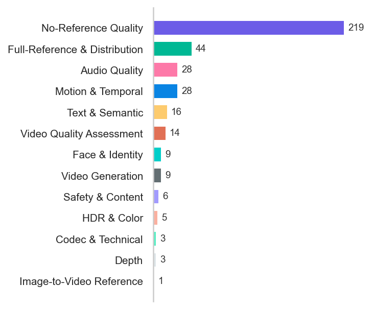
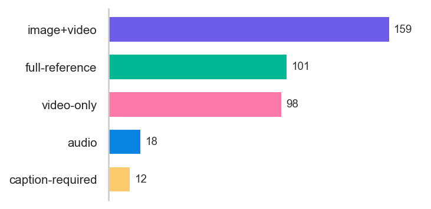
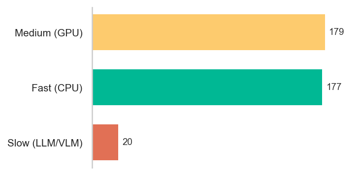
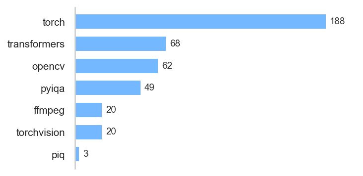
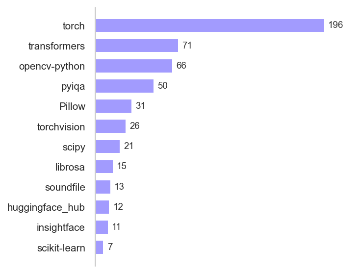
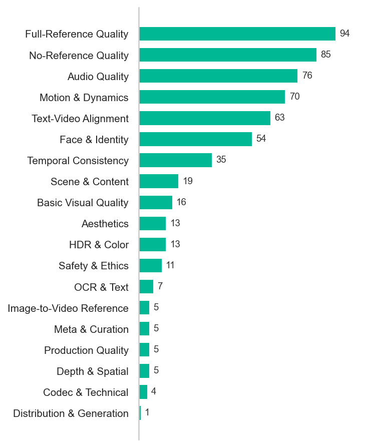

# Ayase Metrics Reference

> **Version 0.1.72** · Generated 2026-08-27 20:37 · **364 modules** · **486 metrics**
>
> `ayase modules docs -o METRICS.md` to regenerate
>
> Tests: **354/364 modules** have static test references · `pytest tests/` (light) · `pytest tests/ --full` (with ML models)

> [!NOTE]
> Static test coverage links are included below. Live pass/fail status was not collected for this regeneration (`--no-tests` was passed). Re-run with `ayase modules docs --run-tests` to add live status.

## Summary

**364** modules · **572** output fields · **486** metrics · **257** tiered · **169** GPU · **21** categories

<table width="100%"><tr>
<td width="50%" valign="top"><h4>Modules by Category</h4></td>
<td width="50%" valign="top"><h4>Input Types</h4></td>
</tr></table>

<table width="100%"><tr>
<td width="50%" valign="top"><h4>Speed Tiers</h4></td>
<td width="50%" valign="top"><h4>Backend Usage</h4></td>
</tr></table>

<table width="100%"><tr>
<td width="50%" valign="top"><h4>Top Packages</h4></td>
<td width="50%" valign="top"><h4>Metrics per Category</h4></td>
</tr></table>

> [!WARNING]
> **8 orphaned QualityMetrics field(s)** — declared in `QualityMetrics` but never written by any module. Either wire a module to populate them or drop the field from the model:
>
> `expression_similarity`, `expression_similarity_coactivation`, `expression_similarity_coverage`, `expression_similarity_distribution`, `expression_similarity_dynamics`, `expression_similarity_range_ratio`, `video_memorability`, `vqa_t_score`

[No-Reference Quality](#no-reference-quality-83-metrics) (83) · [Full-Reference Quality](#full-reference-quality-90-metrics) (90) · [Text-Video Alignment](#text-video-alignment-60-metrics) (60) · [Temporal Consistency](#temporal-consistency-33-metrics) (33) · [Motion & Dynamics](#motion--dynamics-37-metrics) (37) · [Basic Visual Quality](#basic-visual-quality-16-metrics) (16) · [Aesthetics](#aesthetics-13-metrics) (13) · [Audio Quality](#audio-quality-47-metrics) (47) · [Face & Identity](#face--identity-34-metrics) (34) · [Scene & Content](#scene--content-19-metrics) (19) · [Distribution & Generation](#distribution--generation-1-metrics) (1) · [HDR & Color](#hdr--color-13-metrics) (13) · [Codec & Technical](#codec--technical-4-metrics) (4) · [Depth & Spatial](#depth--spatial-5-metrics) (5) · [Production Quality](#production-quality-5-metrics) (5) · [OCR & Text](#ocr--text-7-metrics) (7) · [Safety & Ethics](#safety--ethics-9-metrics) (9) · [Image-to-Video Reference](#image-to-video-reference-5-metrics) (5) · [Meta & Curation](#meta--curation-5-metrics) (5) · [Dataset-Level Metrics](#dataset-level-metrics-86-fields) (86) · [Utility & Validation](#utility--validation-30-modules) (30)

---

## No-Reference Quality (83 metrics)

### `afine_score` [↑](#categories)
> A-FINE fidelity-naturalness (CVPR 2025) · ↑ higher=better

**[`afine`](src/ayase/modules/afine.py)** — A-FINE adaptive fidelity-naturalness IQA (CVPR 2025)

- **Input**: img/vid · **Speed**: ⏱️ medium · GPU
- **Backend**: unavailable → pyiqa
- **Packages**: pyiqa, torch
- **Tests**: covered by [`test_afine.py`](tests/modules/per_module/test_afine.py), [`test_image_iqa_metrics.py`](tests/modules/test_image_iqa_metrics.py)
- **Config**: `subsample=4`

### `aigv_static` [↑](#categories)
> AI video static quality

**[`aigv_assessor`](src/ayase/modules/aigv_assessor.py)** — AI-generated video quality (AIGV-Assessor InternVL model)

- **Input**: vid · **Speed**: ⏱️ medium · GPU
- **Backend**: unavailable
- **Packages**: torch, transformers
- **Source**: <a href="https://huggingface.co/IntMeGroup/AIGV-Assessor-static_quality" target="_blank">HF</a>
- **Tests**: covered by [`test_aigv_assessor.py`](tests/modules/per_module/test_aigv_assessor.py), [`test_motion_scene_semantic_metrics.py`](tests/modules/test_motion_scene_semantic_metrics.py)
- **Config**: `subsample=8`, `trust_remote_code=True`

### `arniqa_score` [↑](#categories)
> ARNIQA (higher=better) · ↑ higher=better

**[`arniqa`](src/ayase/modules/arniqa.py)** — ARNIQA no-reference image quality assessment

- **Input**: img/vid · **Speed**: ⏱️ medium · GPU
- **Backend**: unavailable → pyiqa
- **Packages**: pyiqa, torch
- **Tests**: covered by [`test_arniqa.py`](tests/modules/per_module/test_arniqa.py), [`test_iqa_research_metrics.py`](tests/modules/test_iqa_research_metrics.py)
- **Config**: `subsample=8`

### `brisque` [↑](#categories)
> BRISQUE (0-100, lower=better) · ↓ lower=better · 0-100

**[`brisque`](src/ayase/modules/brisque.py)** — BRISQUE no-reference image quality (lower=better)

- **Input**: img/vid · **Speed**: ⏱️ medium · GPU
- **Backend**: pyiqa → unavailable
- **Packages**: pyiqa, torch
- **Tests**: covered by [`test_brisque.py`](tests/modules/per_module/test_brisque.py), [`test_fields_general.py`](tests/modules/test_fields_general.py), [`test_ml_basics.py`](tests/modules/test_ml_basics.py)
- **Config**: `subsample=3`, `warning_threshold=50.0`

### `bvqi_score` [↑](#categories)
> BVQI zero-shot blind VQA (higher=better) · ↑ higher=better

**[`bvqi`](src/ayase/modules/bvqi.py)** — BVQI zero-shot blind video quality index (ICME 2023)

- **Input**: img/vid · **Speed**: ⏱️ medium
- **Backend**: native → pyiqa → unavailable
- **Packages**: bvqi, pyiqa, torch
- **Tests**: covered by [`test_bvqi.py`](tests/modules/per_module/test_bvqi.py)
- **Config**: `subsample=8`

### `chipqa_score` [↑](#categories)
> ChipQA space-time-chip NR-VQA (higher=better) · ↑ higher=better

**[`chipqa`](src/ayase/modules/chipqa.py)** — ChipQA no-reference video quality via its feature extractor and LIVE-Livestream SVR

- **Input**: vid · **Speed**: ⚡ fast
- **Backend**: unavailable → chipqa
- **Packages**: joblib, matplotlib, numba, opencv-python, scikit-learn, scipy
- **Tests**: covered by [`test_chipqa.py`](tests/modules/per_module/test_chipqa.py)
- **Config**: `timeout_sec=1800`

### `clifvqa_score` [↑](#categories)
> CLiF-VQA human feelings (higher=better) · ↑ higher=better

**[`clifvqa`](src/ayase/modules/clifvqa.py)** — CLiF-VQA human feelings VQA via CLIP (2024)

- **Input**: img/vid · **Speed**: ⏱️ medium · GPU
- **Backend**: clip → unavailable
- **Packages**: torch, transformers
- **VRAM**: ~600 MB
- **Source**: <a href="https://huggingface.co/openai/clip-vit-base-patch32" target="_blank">HF</a>
- **Tests**: covered by [`test_clifvqa.py`](tests/modules/per_module/test_clifvqa.py)
- **Config**: `subsample=8`, `clip_model=openai/clip-vit-base-patch32`

### `clip_iqa_score` [↑](#categories)
> CLIP-IQA semantic quality (0-1, higher=better) · ↑ higher=better · 0-1

**[`clip_iqa`](src/ayase/modules/clip_iqa.py)** — CLIP-based no-reference image quality assessment

- **Input**: img/vid · **Speed**: ⏱️ medium · GPU
- **Backend**: unavailable → pyiqa
- **Packages**: pyiqa, torch
- **Tests**: covered by [`test_clip_iqa.py`](tests/modules/per_module/test_clip_iqa.py), [`test_ml_basics.py`](tests/modules/test_ml_basics.py)
- **Config**: `subsample=5`, `warning_threshold=0.4`

### `clipvqa_score` [↑](#categories)
> CLIPVQA CLIP-based VQA (higher=better) · ↑ higher=better

**[`clipvqa`](src/ayase/modules/clipvqa.py)** — CLIPVQA CLIP-based spatiotemporal VQA (TIP 2024)

- **Input**: img/vid · **Speed**: ⚡ fast
- **Backend**: unavailable → clipvqa
- **Packages**: clipvqa
- **Tests**: covered by [`test_clipvqa.py`](tests/modules/per_module/test_clipvqa.py)
- **Config**: `subsample=8`

### `cnniqa_score` [↑](#categories)
> CNNIQA blind CNN IQA · ↑ higher=better

**[`cnniqa`](src/ayase/modules/cnniqa.py)** — CNNIQA blind CNN-based image quality assessment

- **Input**: img/vid · **Speed**: ⏱️ medium · GPU
- **Backend**: unavailable → pyiqa
- **Packages**: pyiqa, torch
- **Tests**: covered by [`test_cnniqa.py`](tests/modules/per_module/test_cnniqa.py), [`test_image_iqa_metrics.py`](tests/modules/test_image_iqa_metrics.py)
- **Config**: `subsample=4`

### `compare2score` [↑](#categories)
> Compare2Score comparison-based · ↑ higher=better

**[`compare2score`](src/ayase/modules/compare2score.py)** — Compare2Score comparison-based NR image quality

- **Input**: img/vid · **Speed**: ⏱️ medium · GPU
- **Backend**: unavailable → pyiqa
- **Packages**: pyiqa, torch
- **Tests**: covered by [`test_compare2score.py`](tests/modules/per_module/test_compare2score.py), [`test_image_iqa_metrics.py`](tests/modules/test_image_iqa_metrics.py)
- **Config**: `subsample=4`

### `contrique_score` [↑](#categories)
> CONTRIQUE contrastive IQA (higher=better) · ↑ higher=better

**[`contrique`](src/ayase/modules/contrique.py)** — Contrastive no-reference IQA

- **Input**: img/vid · **Speed**: ⏱️ medium · GPU
- **Backend**: unavailable → pyiqa
- **Packages**: pyiqa, torch
- **Tests**: covered by [`test_contrique.py`](tests/modules/per_module/test_contrique.py), [`test_ml_basics.py`](tests/modules/test_ml_basics.py)
- **Config**: `subsample=5`

### `conviqt_score` [↑](#categories)
> CONVIQT contrastive NR-VQA (higher=better) · ↑ higher=better

**[`conviqt`](src/ayase/modules/conviqt.py)** — CONVIQT contrastive self-supervised NR-VQA (TIP 2023)

- **Input**: img/vid · **Speed**: ⏱️ medium · GPU
- **Backend**: unavailable → native → pyiqa
- **Packages**: conviqt, pyiqa, torch
- **Tests**: covered by [`test_conviqt.py`](tests/modules/per_module/test_conviqt.py)
- **Config**: `subsample=8`

### `cover_score` [↑](#categories)
> COVER overall (higher=better) · ↑ higher=better

**[`cover`](src/ayase/modules/cover.py)** — COVER 3-branch comprehensive video quality (semantic + aesthetic + technical)

- **Input**: img/vid · **Speed**: ⏱️ medium · GPU
- **Backend**: unavailable → cover
- **Packages**: cover, torch
- **Tests**: covered by [`test_cover.py`](tests/modules/per_module/test_cover.py), [`test_iqa_research_metrics.py`](tests/modules/test_iqa_research_metrics.py)
- **Config**: `subsample=8`, `quality_threshold=30.0`

### `cover_technical` [↑](#categories)
> COVER technical branch

**[`cover`](src/ayase/modules/cover.py)** — COVER 3-branch comprehensive video quality (semantic + aesthetic + technical)

- **Input**: img/vid · **Speed**: ⏱️ medium · GPU
- **Backend**: unavailable → cover
- **Packages**: cover, torch
- **Tests**: covered by [`test_cover.py`](tests/modules/per_module/test_cover.py), [`test_iqa_research_metrics.py`](tests/modules/test_iqa_research_metrics.py)
- **Config**: `subsample=8`, `quality_threshold=30.0`

### `crave_score` [↑](#categories)
> CRAVE next-gen AIGC (higher=better) · ↑ higher=better

**[`crave`](src/ayase/modules/crave.py)** — CRAVE content-rich AIGC video evaluator (2025)

- **Input**: vid · **Speed**: ⚡ fast
- **Backend**: unavailable → crave
- **Packages**: crave
- **Tests**: covered by [`test_crave.py`](tests/modules/per_module/test_crave.py)
- **Config**: `subsample=12`

### `dbcnn_score` [↑](#categories)
> DBCNN bilinear CNN (higher=better) · ↑ higher=better

**[`dbcnn`](src/ayase/modules/dbcnn.py)** — DBCNN deep bilinear CNN for no-reference IQA

- **Input**: img/vid · **Speed**: ⏱️ medium · GPU
- **Backend**: unavailable → pyiqa
- **Packages**: pyiqa, torch
- **Tests**: covered by [`test_dbcnn.py`](tests/modules/per_module/test_dbcnn.py), [`test_iqa_research_metrics.py`](tests/modules/test_iqa_research_metrics.py)
- **Config**: `subsample=8`

### `deepdc_score` [↑](#categories)
> DeepDC distribution conformance (lower=better) · ↓ lower=better

**[`deepdc`](src/ayase/modules/deepdc.py)** — DeepDC distribution conformance NR-IQA via pyiqa (2024, lower=better)

- **Input**: img/vid · **Speed**: ⏱️ medium · GPU
- **Backend**: unavailable → pyiqa
- **Packages**: pyiqa, torch
- **Tests**: covered by [`test_deepdc.py`](tests/modules/per_module/test_deepdc.py)
- **Config**: `subsample=8`

### `dover_score` [↑](#categories)
> DOVER overall (higher=better) · ↑ higher=better · 0-1 sigmoid

**[`dover`](src/ayase/modules/dover.py)** — DOVER disentangled technical + aesthetic VQA (ICCV 2023)

- **Input**: vid · **Speed**: ⏱️ medium · GPU
- **Backend**: unavailable → native → onnx → pyiqa
- **Packages**: onnxruntime, pyiqa, torch
- **VRAM**: ~800 MB
- **Source**: <a href="https://github.com/VQAssessment/DOVER.git" target="_blank">GitHub</a>
- **Tests**: covered by [`test_dover.py`](tests/modules/per_module/test_dover.py), [`test_ml_basics.py`](tests/modules/test_ml_basics.py)
- **Config**: `warning_threshold=0.4`

### `dover_technical` [↑](#categories)
> DOVER technical quality · 0-1 sigmoid

**[`dover`](src/ayase/modules/dover.py)** — DOVER disentangled technical + aesthetic VQA (ICCV 2023)

- **Input**: vid · **Speed**: ⏱️ medium · GPU
- **Backend**: unavailable → native → onnx → pyiqa
- **Packages**: onnxruntime, pyiqa, torch
- **VRAM**: ~800 MB
- **Source**: <a href="https://github.com/VQAssessment/DOVER.git" target="_blank">GitHub</a>
- **Tests**: covered by [`test_dover.py`](tests/modules/per_module/test_dover.py), [`test_ml_basics.py`](tests/modules/test_ml_basics.py)
- **Config**: `warning_threshold=0.4`

### `evoquality_score` [↑](#categories)
> EvoQuality self-evolving VLM NR-IQA (1-5, higher=better) · ↑ higher=better · 1-5

**[`evoquality`](src/ayase/modules/evoquality.py)** — EvoQuality self-evolving VLM no-reference quality rating

- **Input**: vid · **Speed**: ⏱️ medium
- **Backend**: unavailable → openai → transformers
- **Packages**: torch, transformers
- **Source**: <a href="https://huggingface.co/ByteDance/EvoQuality" target="_blank">HF</a>
- **Tests**: covered by [`test_evoquality.py`](tests/modules/per_module/test_evoquality.py)
- **Config**: `backend=auto`, `model_name=ByteDance/EvoQuality`, `num_frames=5`, `device=auto`, `dtype=bfloat16`, `max_new_tokens=512`, `temperature=0.0`, `top_p=1.0`, `max_image_size=1024`, `resize_to_square=False`, `store_raw_outputs=False`

### `fast_vqa_score` [↑](#categories)
> 0-100 · ↑ higher=better

**[`fast_vqa`](src/ayase/modules/fast_vqa.py)** — Deep Learning Video Quality Assessment (FAST-VQA)

- **Input**: vid · **Speed**: ⏱️ medium
- **Backend**: unavailable → fastvqa
- **Packages**: PyYAML, decord, torch, traceback
- **Tests**: covered by [`test_fast_vqa.py`](tests/modules/per_module/test_fast_vqa.py)
- **Config**: `model_type=FasterVQA`

### `finevq_score` [↑](#categories)
> FineVQ fine-grained UGC VQA (CVPR 2025) · ↑ higher=better

**[`finevq`](src/ayase/modules/finevq.py)** — Fine-grained video quality (real FineVQ model)

- **Input**: img/vid · **Speed**: ⏱️ medium · GPU
- **Backend**: unavailable → finevq
- **Packages**: Pillow, opencv-python, torch, transformers
- **Source**: <a href="https://huggingface.co/IntMeGroup/FineVQ_score" target="_blank">HF</a>
- **Tests**: covered by [`test_finevq.py`](tests/modules/per_module/test_finevq.py), [`test_video_native_metrics.py`](tests/modules/test_video_native_metrics.py)
- **Config**: `subsample=8`, `trust_remote_code=True`, `weights={'sharpness': 0.2, 'colorfulness': 0.15, 'noise': 0.2, 'temporal_stability': 0.25, 'content_richness': 0.2}`

### `hyperiqa_score` [↑](#categories)
> HyperIQA adaptive NR-IQA · ↑ higher=better

**[`hyperiqa`](src/ayase/modules/hyperiqa.py)** — HyperIQA adaptive hypernetwork NR image quality

- **Input**: img/vid · **Speed**: ⏱️ medium · GPU
- **Backend**: unavailable → pyiqa_hyperiqa
- **Packages**: pyiqa, torch
- **Tests**: covered by [`test_hyperiqa.py`](tests/modules/per_module/test_hyperiqa.py), [`test_image_iqa_metrics.py`](tests/modules/test_image_iqa_metrics.py)
- **Config**: `subsample=4`

### `ilniqe` [↑](#categories)
> IL-NIQE Integrated Local NIQE (lower=better) · ↓ lower=better

**[`ilniqe`](src/ayase/modules/ilniqe.py)** — IL-NIQE integrated local no-reference quality (lower=better)

- **Input**: img/vid · **Speed**: ⏱️ medium · GPU
- **Backend**: pyiqa → unavailable
- **Packages**: pyiqa, torch
- **Tests**: covered by [`test_ilniqe.py`](tests/modules/per_module/test_ilniqe.py), [`test_perceptual_metrics.py`](tests/modules/test_perceptual_metrics.py)
- **Config**: `subsample=3`, `warning_threshold=50.0`

### `kvq_score` [↑](#categories)
> KVQ saliency-guided VQA (CVPR 2025) · ↑ higher=better

**[`kvq`](src/ayase/modules/kvq.py)** — Saliency-guided video quality (real KVQ model only)

- **Input**: img/vid · **Speed**: ⏱️ medium · GPU
- **Backend**: kvq → unavailable
- **Packages**: opencv-python, torch, transformers
- **Source**: <a href="https://huggingface.co/lero233/KVQ" target="_blank">HF</a>
- **Tests**: covered by [`test_kvq.py`](tests/modules/per_module/test_kvq.py), [`test_video_native_metrics.py`](tests/modules/test_video_native_metrics.py)
- **Config**: `subsample=8`, `trust_remote_code=True`

### `liqe_score` [↑](#categories)
> LIQE lightweight IQA (higher=better) · ↑ higher=better

**[`liqe`](src/ayase/modules/liqe.py)** — LIQE lightweight no-reference IQA

- **Input**: img/vid · **Speed**: ⏱️ medium · GPU
- **Backend**: pyiqa → unavailable
- **Packages**: pyiqa, torch
- **Tests**: covered by [`test_liqe.py`](tests/modules/per_module/test_liqe.py), [`test_ml_basics.py`](tests/modules/test_ml_basics.py)
- **Config**: `subsample=5`, `warning_threshold=2.5`

### `love_perception_score` [↑](#categories)
> LOVE raw perception regressor score · ↑ higher=better

**[`love_results`](src/ayase/modules/love_results.py)** — LOVE perception and text-video correspondence result adapter

- **Input**: img/vid · **Speed**: ⚡ fast
- **Backend**: imported_results
- **Source**: <a href="https://huggingface.co/anonymousdb/LOVE-Perception" target="_blank">HF</a>
- **Tests**: covered by [`test_result_adapters.py`](tests/modules/per_module/test_result_adapters.py)

### `maclip_score` [↑](#categories)
> MACLIP multi-attribute CLIP NR-IQA (higher=better) · ↑ higher=better

**[`maclip`](src/ayase/modules/maclip.py)** — MACLIP multi-attribute CLIP no-reference quality (higher=better)

- **Input**: img/vid · **Speed**: ⏱️ medium · GPU
- **Backend**: pyiqa → unavailable
- **Packages**: pyiqa, torch
- **Tests**: covered by [`test_maclip.py`](tests/modules/per_module/test_maclip.py), [`test_perceptual_metrics.py`](tests/modules/test_perceptual_metrics.py)
- **Config**: `subsample=3`

### `maniqa_score` [↑](#categories)
> MANIQA multi-attention (higher=better) · ↑ higher=better

**[`maniqa`](src/ayase/modules/maniqa.py)** — MANIQA multi-dimension attention no-reference IQA

- **Input**: img/vid · **Speed**: ⏱️ medium · GPU
- **Backend**: pyiqa → unavailable
- **Packages**: pyiqa, torch
- **Tests**: covered by [`test_maniqa.py`](tests/modules/per_module/test_maniqa.py), [`test_iqa_research_metrics.py`](tests/modules/test_iqa_research_metrics.py)
- **Config**: `subsample=8`

### `maxvqa_score` [↑](#categories)
> MaxVQA explainable quality (higher=better) · ↑ higher=better

**[`maxvqa`](src/ayase/modules/maxvqa.py)** — MaxVQA explainable language-prompted VQA (ACM MM 2023; real model only)

- **Input**: img/vid · **Speed**: ⚡ fast
- **Backend**: native → unavailable
- **Packages**: maxvqa
- **Tests**: covered by [`test_maxvqa.py`](tests/modules/per_module/test_maxvqa.py)
- **Config**: `subsample=8`

### `mc360iqa_score` [↑](#categories)
> MC360IQA blind 360 (higher=better) · ↑ higher=better

**[`mc360iqa`](src/ayase/modules/mc360iqa.py)** — MC360IQA blind 360 IQA (2019; real model only, disabled if unavailable)

- **Input**: img/vid · **Speed**: ⏱️ medium · GPU
- **Backend**: unavailable → real
- **Packages**: Pillow, huggingface_hub, opencv-python, scipy, torch, torchvision
- **VRAM**: ~200 MB
- **Tests**: covered by [`test_mc360iqa.py`](tests/modules/per_module/test_mc360iqa.py)
- **Config**: `weights_variant=OIQA`, `projection_size=480`, `input_size=224`, `device=auto`

### `mdtvsfa_score` [↑](#categories)
> MDTVSFA fragment-based VQA (higher=better) · ↑ higher=better

**[`mdtvsfa`](src/ayase/modules/mdtvsfa.py)** — Multi-Dimensional fragment-based VQA

- **Input**: img/vid · **Speed**: ⏱️ medium
- **Backend**: pyiqa → unavailable
- **Packages**: pyiqa, torch
- **Tests**: covered by [`test_mdtvsfa.py`](tests/modules/per_module/test_mdtvsfa.py), [`test_ml_basics.py`](tests/modules/test_ml_basics.py)
- **Config**: `subsample=5`

### `mdvqa_score` [↑](#categories)
> MD-VQA fused quality (0-1, higher=better) · ↑ higher=better · 0-1

**[`mdvqa`](src/ayase/modules/mdvqa.py)** — MD-VQA multi-dimensional UGC live VQA (CVPR 2023; real model only, disabled if unavailable)

- **Input**: vid · **Speed**: ⏱️ medium · GPU
- **Backend**: real → unavailable
- **Packages**: huggingface_hub, opencv-python, torch, torchvision
- **Tests**: covered by [`test_mdvqa.py`](tests/modules/per_module/test_mdvqa.py)
- **Config**: `clip_len=16`, `max_clips=8`, `device=auto`

### `mj_video_fineness_score` [↑](#categories)
> MJ-Video fine-detail aspect · ↑ higher=better

**[`mj_video`](src/ayase/modules/mj_video.py)** — MJ-Video overall reward and five fine-grained preference aspects

- **Input**: vid · **Speed**: ⏱️ medium · GPU
- **Backend**: mj_video → unavailable
- **Packages**: boto3, data_processor, internvl2, model, safetensors, torch, transformers
- **Source**: <a href="https://huggingface.co/MJ-Bench/MJ-VIDEO-2B" target="_blank">HF</a>
- **Tests**: covered by [`test_mj_video.py`](tests/modules/per_module/test_mj_video.py)
- **Config**: `model_name=MJ-Bench/MJ-VIDEO-2B`, `source_url=https://huggingface.co/AkaneTendo25/ayase-runtime-assets/resolve/main/mj_video/source-cc1d2c9587a620e9ebd3599ae4cdd21b5fd7c87a.zip`, `tokenizer_base_url=https://huggingface.co/internlm/internlm2-chat-1_8b/resolve`, `tokenizer_revision=main`, `num_segments=8`, `max_new_tokens=1024`, `do_sample=True`, `gating_temperature=1.0`, `gating_hidden_dim=1024`, `gating_n_hidden=3`

### `modularbvqa_score` [↑](#categories)
> ModularBVQA resolution-aware (higher=better) · ↑ higher=better

**[`modularbvqa`](src/ayase/modules/modularbvqa.py)** — ModularBVQA resolution/framerate-aware blind VQA (CVPR 2024) — CLIP ViT-B backbone + Laplacian spatial + SlowFast temporal rectifiers

- **Input**: img/vid · **Speed**: ⏱️ medium · GPU
- **Backend**: unavailable
- **Packages**: opencv-python, torch, torchvision
- **VRAM**: ~600 MB
- **Tests**: covered by [`test_modularbvqa.py`](tests/modules/per_module/test_modularbvqa.py)
- **Config**: `subsample=8`, `frame_size=224`

### `musiq_score` [↑](#categories)
> MUSIQ multi-scale IQA (higher=better) · ↑ higher=better

**[`musiq`](src/ayase/modules/musiq.py)** — Multi-Scale Image Quality Transformer (no-reference)

- **Input**: img/vid · **Speed**: ⏱️ medium · GPU
- **Backend**: pyiqa → unavailable
- **Packages**: pyiqa, torch
- **Tests**: covered by [`test_musiq.py`](tests/modules/per_module/test_musiq.py), [`test_ml_basics.py`](tests/modules/test_ml_basics.py)
- **Config**: `variant=musiq`, `subsample=5`, `warning_threshold=40.0`

### `naturalness_score` [↑](#categories)
> Natural scene statistics · ↑ higher=better

**[`naturalness`](src/ayase/modules/naturalness.py)** — Naturalness via BRISQUE natural-scene-statistics (higher=more natural)

- **Input**: img/vid · **Speed**: ⏱️ medium · GPU
- **Backend**: pyiqa_brisque → unavailable
- **Packages**: pyiqa, torch
- **Tests**: covered by [`test_naturalness.py`](tests/modules/per_module/test_naturalness.py), [`test_reference_and_meta_metrics.py`](tests/modules/test_reference_and_meta_metrics.py)
- **Config**: `subsample=2`, `warning_threshold=0.4`

### `niqe` [↑](#categories)
> Natural Image Quality Evaluator (lower=better) · ↓ lower=better

**[`niqe`](src/ayase/modules/niqe.py)** — Natural Image Quality Evaluator (no-reference)

- **Input**: img/vid · **Speed**: ⏱️ medium · GPU
- **Backend**: pyiqa → unavailable
- **Packages**: pyiqa, torch
- **Tests**: covered by [`test_niqe.py`](tests/modules/per_module/test_niqe.py), [`test_fields_general.py`](tests/modules/test_fields_general.py), [`test_reference_and_meta_metrics.py`](tests/modules/test_reference_and_meta_metrics.py), +1 more
- **Config**: `subsample=2`, `warning_threshold=7.0`

### `nrqm` [↑](#categories)
> NRQM No-Reference Quality Metric (higher=better) · ↑ higher=better

**[`nrqm`](src/ayase/modules/nrqm.py)** — NRQM no-reference quality metric for super-resolution (higher=better)

- **Input**: img/vid · **Speed**: ⏱️ medium · GPU
- **Backend**: pyiqa → unavailable
- **Packages**: pyiqa, torch
- **Tests**: covered by [`test_nrqm.py`](tests/modules/per_module/test_nrqm.py), [`test_perceptual_metrics.py`](tests/modules/test_perceptual_metrics.py)
- **Config**: `subsample=3`

### `opens2v_natural_score` [↑](#categories)
> NaturalScore VLM naturalness (higher=better) · ↑ higher=better

**[`opens2v`](src/ayase/modules/opens2v.py)** — OpenS2V-Eval subject-consistency metrics: NexusScore (GroundingDINO subject crops vs reference subject image) and NaturalScore (VLM naturalness judge)

- **Input**: img/vid +ref · **Speed**: 🐌 slow · GPU
- **Backend**: unavailable
- **Packages**: inspect, torch, torchvision, transformers
- **VRAM**: ~14 GB
- **Source**: <a href="https://huggingface.co/IDEA-Research/grounding-dino-tiny" target="_blank">HF</a>
- **Tests**: covered by [`test_opens2v.py`](tests/modules/per_module/test_opens2v.py)
- **Config**: `device=auto`, `max_frames=16`, `detector_model=IDEA-Research/grounding-dino-tiny`, `box_threshold=0.3`, `text_threshold=0.25`, `keep_box_conf=0.3`, `keep_text_sim=0.2`, `encoder=clip`, `clip_model=openai/clip-vit-base-patch32`, `dino_model=dinov2_vitb14`, `vlm_model=llava-hf/llava-1.5-7b-hf`, `vlm_max_frames=4`, `vlm_max_new_tokens=8`, `warning_threshold=0.0`

### `paq2piq_score` [↑](#categories)
> PaQ-2-PiQ patch-to-picture (CVPR 2020) · ↑ higher=better

**[`paq2piq`](src/ayase/modules/paq2piq.py)** — PaQ-2-PiQ patch-to-picture NR quality (CVPR 2020)

- **Input**: img/vid · **Speed**: ⏱️ medium · GPU
- **Backend**: unavailable → pyiqa
- **Packages**: opencv-python, pyiqa, torch
- **Tests**: covered by [`test_paq2piq.py`](tests/modules/per_module/test_paq2piq.py), [`test_image_iqa_metrics.py`](tests/modules/test_image_iqa_metrics.py)
- **Config**: `subsample=4`

### `phyground_general_score` [↑](#categories)
> Mean general judge score (1-5) · ↑ higher=better · 1-5

**[`phyground_results`](src/ayase/modules/phyground_results.py)** — PhyGround general and physical-law judge result adapter

- **Input**: img/vid · **Speed**: ⚡ fast
- **Backend**: imported_results
- **Source**: <a href="https://huggingface.co/NU-World-Model-Embodied-AI/phyjudge-9B" target="_blank">HF</a>
- **Tests**: covered by [`test_result_adapters.py`](tests/modules/per_module/test_result_adapters.py)

### `phyground_physical_coverage` [↑](#categories)
> Fraction of laws scored (0-1) · 0-1

**[`phyground_results`](src/ayase/modules/phyground_results.py)** — PhyGround general and physical-law judge result adapter

- **Input**: img/vid · **Speed**: ⚡ fast
- **Backend**: imported_results
- **Source**: <a href="https://huggingface.co/NU-World-Model-Embodied-AI/phyjudge-9B" target="_blank">HF</a>
- **Tests**: covered by [`test_result_adapters.py`](tests/modules/per_module/test_result_adapters.py)

### `phyground_physical_score` [↑](#categories)
> Mean applicable-law score (1-5) · ↑ higher=better · 1-5

**[`phyground_results`](src/ayase/modules/phyground_results.py)** — PhyGround general and physical-law judge result adapter

- **Input**: img/vid · **Speed**: ⚡ fast
- **Backend**: imported_results
- **Source**: <a href="https://huggingface.co/NU-World-Model-Embodied-AI/phyjudge-9B" target="_blank">HF</a>
- **Tests**: covered by [`test_result_adapters.py`](tests/modules/per_module/test_result_adapters.py)

### `pi_score` [↑](#categories)
> Perceptual Index (PIRM challenge, lower=better) · ↓ lower=better · PIRM challenge

**[`pi`](src/ayase/modules/pi_metric.py)** — Perceptual Index (PIRM challenge metric, lower=better)

- **Input**: img/vid · **Speed**: ⏱️ medium · GPU
- **Backend**: unavailable → pyiqa
- **Packages**: pyiqa, torch
- **Tests**: covered by [`test_pi.py`](tests/modules/per_module/test_pi.py), [`test_perceptual_metrics.py`](tests/modules/test_perceptual_metrics.py), [`test_docs_integrity.py`](tests/test_docs_integrity.py)
- **Config**: `subsample=3`

### `piqe` [↑](#categories)
> PIQE perception-based NR-IQA (lower=better) · ↓ lower=better

**[`piqe`](src/ayase/modules/piqe.py)** — PIQE perception-based no-reference quality (lower=better)

- **Input**: img/vid · **Speed**: ⏱️ medium · GPU
- **Backend**: unavailable → pyiqa
- **Packages**: pyiqa, torch
- **Tests**: covered by [`test_piqe.py`](tests/modules/per_module/test_piqe.py), [`test_perceptual_metrics.py`](tests/modules/test_perceptual_metrics.py)
- **Config**: `subsample=3`, `warning_threshold=50.0`

### `promptiqa_score` [↑](#categories)
> Few-shot NR-IQA score · ↑ higher=better

**[`promptiqa`](src/ayase/modules/promptiqa.py)** — Prompt-guided NR-IQA (PromptIQA via pyiqa)

- **Input**: img/vid · **Speed**: ⏱️ medium · GPU
- **Backend**: unavailable → pyiqa
- **Packages**: pyiqa, torch
- **Tests**: covered by [`test_promptiqa.py`](tests/modules/per_module/test_promptiqa.py), [`test_motion_scene_semantic_metrics.py`](tests/modules/test_motion_scene_semantic_metrics.py)
- **Config**: `subsample=4`

### `provqa_score` [↑](#categories)
> ProVQA progressive 360 (higher=better) · ↑ higher=better

**[`provqa`](src/ayase/modules/provqa.py)** — ProVQA progressive blind 360° VQA (real model only)

- **Input**: img/vid · **Speed**: ⏱️ medium · GPU
- **Backend**: real → unavailable
- **Packages**: opencv-python, torch
- **Tests**: covered by [`test_provqa.py`](tests/modules/per_module/test_provqa.py)
- **Config**: `device=auto`

### `qalign_quality` [↑](#categories)
> Q-Align technical quality (1-5, higher=better) · ↑ higher=better · 1-5

**[`q_align`](src/ayase/modules/q_align.py)** — Q-Align unified quality + aesthetic assessment (ICML 2024)

- **Input**: img/vid · **Speed**: 🐌 slow · GPU
- **Backend**: unavailable → qalign
- **Packages**: Pillow, torch
- **VRAM**: ~14 GB
- **Source**: <a href="https://huggingface.co/q-future/one-align" target="_blank">HF</a>
- **Tests**: covered by [`test_q_align.py`](tests/modules/per_module/test_q_align.py), [`test_ml_basics.py`](tests/modules/test_ml_basics.py)
- **Config**: `model_name=q-future/one-align`, `dtype=float16`, `device=auto`, `subsample=8`, `max_frames=16`, `warning_threshold=2.5`, `trust_remote_code=True`

### `qcn_score` [↑](#categories)
> Geometric order blind IQA · ↑ higher=better

**[`qcn`](src/ayase/modules/qcn.py)** — Blind IQA (QCN via pyiqa)

- **Input**: img/vid · **Speed**: ⏱️ medium · GPU
- **Backend**: qcn → unavailable
- **Packages**: pyiqa, torch
- **Tests**: covered by [`test_qcn.py`](tests/modules/per_module/test_qcn.py), [`test_motion_scene_semantic_metrics.py`](tests/modules/test_motion_scene_semantic_metrics.py)
- **Config**: `subsample=4`

### `qualiclip_score` [↑](#categories)
> QualiCLIP opinion-unaware (higher=better) · ↑ higher=better

**[`qualiclip`](src/ayase/modules/qualiclip.py)** — QualiCLIP opinion-unaware CLIP-based no-reference IQA

- **Input**: img/vid · **Speed**: ⏱️ medium · GPU
- **Backend**: qualiclip → unavailable
- **Packages**: pyiqa, torch
- **Tests**: covered by [`test_qualiclip.py`](tests/modules/per_module/test_qualiclip.py), [`test_iqa_research_metrics.py`](tests/modules/test_iqa_research_metrics.py)
- **Config**: `subsample=8`

### `qwen_image_bench_overall` [↑](#categories)
> Mean of Qwen-Image-Bench L1 scores · 0-100

**[`qwen_image_bench`](src/ayase/modules/qwen_image_bench.py)** — Qwen-Image-Bench T2I judge scores across five image-generation dimensions

- **Input**: img/vid · **Speed**: 🐌 slow · GPU
- **Backend**: openai → transformers
- **Packages**: qwen-vl-utils, torch, transformers
- **Source**: <a href="https://huggingface.co/Qwen/Qwen-Image-Bench" target="_blank">HF</a>
- **Tests**: covered by [`test_qwen_image_bench.py`](tests/modules/per_module/test_qwen_image_bench.py)
- **Config**: `model_name=Qwen/Qwen-Image-Bench`, `backend=auto`, `dimensions=all`, `device=auto`, `dtype=bfloat16`, `device_map=auto`, `max_new_tokens=4096`, `temperature=0.0`, `top_p=1.0`, `top_k=1`, `repetition_penalty=1.05`, `max_image_size=1024`, `resize_to_square=True`, `trust_remote_code=True`

### `qwen_image_bench_quality` [↑](#categories)
> Quality L1 score · ↑ higher=better · 0-100

**[`qwen_image_bench`](src/ayase/modules/qwen_image_bench.py)** — Qwen-Image-Bench T2I judge scores across five image-generation dimensions

- **Input**: img/vid · **Speed**: 🐌 slow · GPU
- **Backend**: openai → transformers
- **Packages**: qwen-vl-utils, torch, transformers
- **Source**: <a href="https://huggingface.co/Qwen/Qwen-Image-Bench" target="_blank">HF</a>
- **Tests**: covered by [`test_qwen_image_bench.py`](tests/modules/per_module/test_qwen_image_bench.py)
- **Config**: `model_name=Qwen/Qwen-Image-Bench`, `backend=auto`, `dimensions=all`, `device=auto`, `dtype=bfloat16`, `device_map=auto`, `max_new_tokens=4096`, `temperature=0.0`, `top_p=1.0`, `top_k=1`, `repetition_penalty=1.05`, `max_image_size=1024`, `resize_to_square=True`, `trust_remote_code=True`

### `ref4d_overall_score` [↑](#categories)
> Mean of available Ref4D dimensions · ↑ higher=better

**[`ref4d_results`](src/ayase/modules/ref4d_results.py)** — Ref4D semantic, event, motion, and world result adapter

- **Input**: img/vid · **Speed**: ⚡ fast
- **Backend**: imported_results
- **Source**: <a href="https://github.com/TAILab-W/Ref4D-VideoBench" target="_blank">GitHub</a>
- **Tests**: covered by [`test_result_adapters.py`](tests/modules/per_module/test_result_adapters.py)

### `rqvqa_score` [↑](#categories)
> RQ-VQA raw regression score (higher=better) · ↑ higher=better · unbounded;

**[`rqvqa`](src/ayase/modules/rqvqa.py)** — RQ-VQA rich quality-aware blind VQA ensemble (raw regression score)

- **Input**: vid · **Speed**: 🐌 slow · GPU
- **Backend**: unavailable → rqvqa
- **Packages**: Pillow, opencv-python, torch
- **VRAM**: ~14 GB
- **Source**: <a href="https://huggingface.co/q-future/one-align" target="_blank">HF</a>
- **Tests**: covered by [`test_rqvqa.py`](tests/modules/per_module/test_rqvqa.py), [`test_video_native_metrics.py`](tests/modules/test_video_native_metrics.py), [`test_metric_help_cli.py`](tests/test_metric_help_cli.py)
- **Config**: `ensemble_size=10`, `device=auto`, `dtype=float16`, `qalign_dtype=float16`, `fastvqa_seed=42`

### `sama_score` [↑](#categories)
> SAMA scaling+masking (higher=better) · ↑ higher=better · unbounded

**[`sama`](src/ayase/modules/sama.py)** — SAMA scaling+masking VQA (AAAI 2024, real model only)

- **Input**: vid · **Speed**: ⏱️ medium
- **Backend**: unavailable → real
- **Packages**: decord, huggingface_hub, torch
- **Tests**: covered by [`test_sama.py`](tests/modules/per_module/test_sama.py)
- **Config**: `fragments_h=7`, `fragments_w=7`, `fsize_h=32`, `fsize_w=32`, `aligned=32`, `clip_len=32`, `num_clips=4`, `frame_interval=2`, `device=auto`

### `simplevqa_score` [↑](#categories)
> SimpleVQA Swin+SlowFast (higher=better) · ↑ higher=better

**[`simplevqa`](src/ayase/modules/simplevqa.py)** — SimpleVQA Swin+SlowFast blind VQA (real model only)

- **Input**: vid · **Speed**: ⏱️ medium · GPU
- **Backend**: real → unavailable
- **Packages**: opencv-python, torch
- **Tests**: covered by [`test_simplevqa.py`](tests/modules/per_module/test_simplevqa.py)
- **Config**: `n_frames=8`, `clip_len=32`, `spatial_size=384`, `motion_size=224`, `device=auto`

### `spectral_entropy` [↑](#categories)
> DINOv2 spectral entropy

**[`spectral_complexity`](src/ayase/modules/spectral.py)** — Analyzes spectral complexity (Effective Rank) of video features (DINOv2)

- **Input**: vid · **Speed**: ⏱️ medium · GPU
- **Backend**: algorithmic
- **Packages**: torch, torchvision
- **VRAM**: ~400 MB
- **Source**: <a href="https://huggingface.co/facebookresearch/dinov2" target="_blank">HF</a>
- **Tests**: covered by [`test_spectral_complexity.py`](tests/modules/per_module/test_spectral_complexity.py), [`test_docs_integrity.py`](tests/test_docs_integrity.py)
- **Config**: `model_type=dinov2_vits14`, `sample_rate=8`, `min_rank_ratio=0.05`, `max_entropy_threshold=6.0`

### `spectral_rank` [↑](#categories)
> DINOv2 effective rank ratio

**[`spectral_complexity`](src/ayase/modules/spectral.py)** — Analyzes spectral complexity (Effective Rank) of video features (DINOv2)

- **Input**: vid · **Speed**: ⏱️ medium · GPU
- **Backend**: algorithmic
- **Packages**: torch, torchvision
- **VRAM**: ~400 MB
- **Source**: <a href="https://huggingface.co/facebookresearch/dinov2" target="_blank">HF</a>
- **Tests**: covered by [`test_spectral_complexity.py`](tests/modules/per_module/test_spectral_complexity.py), [`test_docs_integrity.py`](tests/test_docs_integrity.py)
- **Config**: `model_type=dinov2_vits14`, `sample_rate=8`, `min_rank_ratio=0.05`, `max_entropy_threshold=6.0`

### `stablevqa_score` [↑](#categories)
> StableVQA video stability (higher=better) · ↑ higher=better

**[`stablevqa`](src/ayase/modules/stablevqa.py)** — StableVQA video stability quality assessment (ACM MM 2023)

- **Input**: img/vid · **Speed**: ⏱️ medium · GPU
- **Backend**: unavailable → real
- **Packages**: huggingface_hub, opencv-python, torch
- **Tests**: covered by [`test_stablevqa.py`](tests/modules/per_module/test_stablevqa.py)
- **Config**: `device=auto`, `clip_len=32`, `frame_size=224`

### `t2v_quality` [↑](#categories)
> Video production quality · ↑ higher=better

**[`t2v_score`](src/ayase/modules/t2v_score.py)** — Text-to-Video alignment and quality scoring (T2VScore, CVPR 2024)

- **Input**: vid · **Speed**: ⏱️ medium
- **Backend**: unavailable → t2vscore
- **Packages**: torch, transformers
- **Tests**: covered by [`test_t2v_score.py`](tests/modules/per_module/test_t2v_score.py), [`test_fields_general.py`](tests/modules/test_fields_general.py), [`test_reference_and_meta_metrics.py`](tests/modules/test_reference_and_meta_metrics.py)
- **Config**: `num_frames=8`, `alignment_weight=0.5`, `quality_weight=0.5`, `device=auto`, `warning_threshold=0.6`, `trust_remote_code=False`

### `thqa_score` [↑](#categories)
> THQA talking head quality (higher=better) · ↑ higher=better

**[`thqa`](src/ayase/modules/thqa.py)** — THQA talking head quality assessment (ICIP 2024)

- **Input**: vid · **Speed**: ⚡ fast
- **Backend**: thqa → unavailable
- **Packages**: thqa
- **Tests**: covered by [`test_thqa.py`](tests/modules/per_module/test_thqa.py)
- **Config**: `subsample=16`

### `tlvqm_score` [↑](#categories)
> TLVQM two-level video quality · ↑ higher=better

**[`tlvqm`](src/ayase/modules/tlvqm.py)** — Two-level video quality model (CNN-TLVQM, trained CNN+SVR)

- **Input**: img/vid · **Speed**: ⏱️ medium · GPU
- **Backend**: unavailable → cnn_svr
- **Packages**: joblib, opencv-python, torch, torchvision
- **VRAM**: ~200 MB
- **Tests**: covered by [`test_tlvqm.py`](tests/modules/per_module/test_tlvqm.py), [`test_video_native_metrics.py`](tests/modules/test_video_native_metrics.py)
- **Config**: `subsample=8`

### `topiq_score` [↑](#categories)
> TOPIQ transformer-based IQA (higher=better) · ↑ higher=better

**[`topiq`](src/ayase/modules/topiq.py)** — TOPIQ transformer-based no-reference IQA

- **Input**: img/vid · **Speed**: ⏱️ medium · GPU
- **Backend**: pyiqa → unavailable
- **Packages**: pyiqa, torch
- **Tests**: covered by [`test_topiq.py`](tests/modules/per_module/test_topiq.py), [`test_ml_basics.py`](tests/modules/test_ml_basics.py)
- **Config**: `variant=topiq_nr`, `subsample=5`, `warning_threshold=0.4`

### `tres_score` [↑](#categories)
> TReS transformer IQA (WACV 2022) · ↑ higher=better

**[`tres`](src/ayase/modules/tres.py)** — TReS transformer-based NR image quality (WACV 2022)

- **Input**: img/vid · **Speed**: ⏱️ medium · GPU
- **Backend**: pyiqa → unavailable
- **Packages**: opencv-python, pyiqa, torch
- **Tests**: covered by [`test_tres.py`](tests/modules/per_module/test_tres.py), [`test_image_iqa_metrics.py`](tests/modules/test_image_iqa_metrics.py)
- **Config**: `subsample=4`

### `uciqe_score` [↑](#categories)
> UCIQE underwater color (higher=better) · ↑ higher=better

**[`uciqe`](src/ayase/modules/uciqe.py)** — UCIQE underwater color image quality evaluation (2015)

- **Input**: img/vid · **Speed**: ⚡ fast
- **Backend**: port
- **Tests**: covered by [`test_uciqe.py`](tests/modules/per_module/test_uciqe.py)
- **Config**: `c1=0.468`, `c2=0.2745`, `c3=0.2576`, `subsample=8`

### `uiqm_score` [↑](#categories)
> UIQM underwater quality (higher=better) · ↑ higher=better

**[`uiqm`](src/ayase/modules/uiqm.py)** — UIQM underwater image quality measure (Panetta et al. 2016)

- **Input**: img/vid · **Speed**: ⚡ fast
- **Backend**: port
- **Tests**: covered by [`test_uiqm.py`](tests/modules/per_module/test_uiqm.py)
- **Config**: `c1=0.0282`, `c2=0.2953`, `c3=3.5753`, `subsample=8`

### `unified_reward_2_coherence_score` [↑](#categories)
> Logical/visual coherence · ↑ higher=better · 1-5

**[`unified_reward_2`](src/ayase/modules/unified_reward_2.py)** — UnifiedReward 2.0 multi-dimensional prompt-image reward scoring

- **Input**: img/vid · **Speed**: ⏱️ medium
- **Backend**: openai → diffsynth
- **Packages**: diffsynth, torch
- **Tests**: covered by [`test_unified_reward_2.py`](tests/modules/per_module/test_unified_reward_2.py)
- **Config**: `backend=auto`, `model_name=UnifiedReward-2.0-qwen35-9b`, `device=auto`, `dtype=bfloat16`, `max_new_tokens=1024`, `temperature=0.0`, `top_p=1.0`, `max_image_size=1024`, `resize_to_square=False`, `store_raw_outputs=False`

### `unified_reward_2_score` [↑](#categories)
> Mean alignment/coherence/style score · ↑ higher=better · 1-5

**[`unified_reward_2`](src/ayase/modules/unified_reward_2.py)** — UnifiedReward 2.0 multi-dimensional prompt-image reward scoring

- **Input**: img/vid · **Speed**: ⏱️ medium
- **Backend**: openai → diffsynth
- **Packages**: diffsynth, torch
- **Tests**: covered by [`test_unified_reward_2.py`](tests/modules/per_module/test_unified_reward_2.py)
- **Config**: `backend=auto`, `model_name=UnifiedReward-2.0-qwen35-9b`, `device=auto`, `dtype=bfloat16`, `max_new_tokens=1024`, `temperature=0.0`, `top_p=1.0`, `max_image_size=1024`, `resize_to_square=False`, `store_raw_outputs=False`

### `unique_score` [↑](#categories)
> UNIQUE unified NR-IQA (TIP 2021) · ↑ higher=better

**[`unique`](src/ayase/modules/unique_iqa.py)** — UNIQUE unified NR image quality (TIP 2021)

- **Input**: img/vid · **Speed**: ⏱️ medium · GPU
- **Backend**: pyiqa → unavailable
- **Packages**: opencv-python, pyiqa, torch
- **Tests**: covered by [`test_unique.py`](tests/modules/per_module/test_unique.py), [`test_image_iqa_metrics.py`](tests/modules/test_image_iqa_metrics.py), [`test_docs_integrity.py`](tests/test_docs_integrity.py)
- **Config**: `subsample=4`

### `uvq1p5_score` [↑](#categories)
> Google UVQ 1.5 MOS (1-5, higher=better) · ↑ higher=better · 1-5

**[`uvq`](src/ayase/modules/uvq.py)** — Google UVQ 1.5 no-reference perceptual video MOS

- **Input**: vid · **Speed**: ⏱️ medium · GPU
- **Backend**: unavailable → uvq1p5
- **Packages**: torch
- **Tests**: covered by [`test_uvq.py`](tests/modules/per_module/test_uvq.py)
- **Config**: `device=auto`

### `vader_score` [↑](#categories)
> VADER reward alignment · ↑ higher=better

**[`vader`](src/ayase/modules/vader.py)** — VADER HPS v2 reward signal (ICLR 2025)

- **Input**: img/vid · **Speed**: ⚡ fast
- **Backend**: unavailable → hpsv2
- **Packages**: hpsv2
- **VRAM**: ~1.5 GB
- **Source**: <a href="https://huggingface.co/openai/clip-vit-large-patch14" target="_blank">HF</a>
- **Tests**: covered by [`test_vader.py`](tests/modules/per_module/test_vader.py)
- **Config**: `subsample=8`, `clip_model=openai/clip-vit-large-patch14`

### `video_memorability` [↑](#categories)
> Memorability prediction

**[`video_memorability`](src/ayase/modules/video_memorability.py)** — Content memorability approximation (CLIP/DINOv2 feature statistics)

- **Input**: img/vid · **Speed**: ⚡ fast
- **Backend**: unavailable
- **VRAM**: ~400 MB
- **Tests**: covered by [`test_video_memorability.py`](tests/modules/per_module/test_video_memorability.py), [`test_fields_general.py`](tests/modules/test_fields_general.py), [`test_reference_and_meta_metrics.py`](tests/modules/test_reference_and_meta_metrics.py), +1 more
- **Config**: `subsample=5`

### `videoscore2_visual` [↑](#categories)
> VideoScore2 visual quality · ↑ higher=better · 1-5

**[`videoscore2`](src/ayase/modules/videoscore2.py)** — VideoScore2 3-dimensional generative video evaluation

- **Input**: img/vid · **Speed**: 🐌 slow · GPU
- **Backend**: transformers → unavailable
- **Packages**: qwen-vl-utils, torch, transformers
- **VRAM**: ~16 GB
- **Source**: <a href="https://huggingface.co/TIGER-Lab/VideoScore2" target="_blank">HF</a>
- **Tests**: covered by [`test_videoscore2.py`](tests/modules/per_module/test_videoscore2.py), [`test_iqa_research_metrics.py`](tests/modules/test_iqa_research_metrics.py)
- **Config**: `model_name=TIGER-Lab/VideoScore2`, `infer_fps=2.0`, `max_new_tokens=1024`, `temperature=0.7`, `do_sample=True`, `trust_remote_code=True`

### `videoscore_visual` [↑](#categories)
> VideoScore visual quality · ↑ higher=better

**[`videoscore`](src/ayase/modules/videoscore.py)** — VideoScore 5-dimensional video quality assessment (1-4 scale)

- **Input**: img/vid · **Speed**: ⏱️ medium · GPU
- **Backend**: videoscore → unavailable
- **Packages**: mantis, torch, transformers
- **Source**: <a href="https://huggingface.co/TIGER-Lab/VideoScore" target="_blank">HF</a>
- **Tests**: covered by [`test_videoscore.py`](tests/modules/per_module/test_videoscore.py), [`test_iqa_research_metrics.py`](tests/modules/test_iqa_research_metrics.py)
- **Config**: `model_name=TIGER-Lab/VideoScore`, `num_frames=16`, `trust_remote_code=True`

### `videval_score` [↑](#categories)
> VIDEVAL 60-feature fusion NR-VQA · ↑ higher=better

**[`videval`](src/ayase/modules/videval.py)** — VIDEVAL 60-feature hand-crafted NR-VQA (Tu et al. 2021)

- **Input**: img/vid · **Speed**: ⚡ fast
- **Backend**: svr → unavailable
- **Packages**: joblib, opencv-python
- **Tests**: covered by [`test_videval.py`](tests/modules/per_module/test_videval.py), [`test_video_native_metrics.py`](tests/modules/test_video_native_metrics.py)
- **Config**: `subsample=8`, `frame_size=520`

### `viideo_score` [↑](#categories)
> VIIDEO blind natural video statistics (lower=better) · ↓ lower=better

**[`viideo`](src/ayase/modules/viideo.py)** — VIIDEO blind NR-VQA via natural video statistics (Mittal 2016, lower=better)

- **Input**: vid · **Speed**: ⚡ fast
- **Backend**: skvideo → unavailable
- **Packages**: scikit-video
- **Tests**: covered by [`test_viideo.py`](tests/modules/per_module/test_viideo.py)
- **Config**: `subsample=8`

### `vqa2_score` [↑](#categories)
> VQA² LMM quality (higher=better) · ↑ higher=better · 0.2–1.0

**[`vqa2`](src/ayase/modules/vqa2.py)** — VQA² LMM image/video quality score (ACM MM 2025)

- **Input**: img/vid · **Speed**: 🐌 slow · GPU
- **Backend**: vqa2
- **Packages**: Pillow, decord, llava, torch
- **Tests**: covered by [`test_vqa2.py`](tests/modules/per_module/test_vqa2.py)
- **Config**: `model_id=q-future/VQA-UGC-Scorer-llava_qwen`, `model_revision=297de10254d0b4d435db436e1fcaacce5d976fd6`, `source_revision=9087c7952052088a6eb01bac4408bff903ab9e41`, `slowfast_revision=8ab5deb746da9139288cbcbf3d155f1c94ff2a8e`, `device=auto`

### `vqinsight_score` [↑](#categories)
> VQ-Insight ByteDance (higher=better) · ↑ higher=better

**[`vqinsight`](src/ayase/modules/vqinsight.py)** — VQ-Insight ByteDance multi-dim AIGC scoring (AAAI 2026)

- **Input**: img/vid · **Speed**: ⏱️ medium · GPU
- **Backend**: real → unavailable
- **Packages**: qwen-vl-utils, torch, transformers
- **Source**: <a href="https://huggingface.co/ByteDance/Q-Insight" target="_blank">HF</a>
- **Tests**: covered by [`test_vqinsight.py`](tests/modules/per_module/test_vqinsight.py)
- **Config**: `video_type=aigc`, `model_name_or_path=ByteDance/Q-Insight`, `max_new_tokens=256`, `nframes=16`, `device=auto`

### `vsfa_score` [↑](#categories)
> VSFA quality-aware feature aggregation (higher=better) · ↑ higher=better

**[`vsfa`](src/ayase/modules/vsfa.py)** — VSFA quality-aware feature aggregation with GRU (ACMMM 2019)

- **Input**: img/vid · **Speed**: ⏱️ medium · GPU
- **Backend**: vsfa → unavailable
- **Packages**: huggingface_hub, opencv-python, torch, torchvision
- **VRAM**: ~200 MB
- **Tests**: covered by [`test_vsfa.py`](tests/modules/per_module/test_vsfa.py)
- **Config**: `subsample=8`, `frame_size=520`

### `wadiqam_score` [↑](#categories)
> WaDIQaM-NR (higher=better) · ↑ higher=better

**[`wadiqam`](src/ayase/modules/wadiqam.py)** — WaDIQaM-NR weighted averaging deep image quality mapper

- **Input**: img/vid · **Speed**: ⏱️ medium · GPU
- **Backend**: pyiqa → unavailable
- **Packages**: opencv-python, pyiqa, torch
- **Tests**: covered by [`test_wadiqam.py`](tests/modules/per_module/test_wadiqam.py), [`test_iqa_research_metrics.py`](tests/modules/test_iqa_research_metrics.py)
- **Config**: `subsample=8`

### `zoomvqa_score` [↑](#categories)
> Zoom-VQA multi-level (higher=better) · ↑ higher=better

**[`zoomvqa`](src/ayase/modules/zoomvqa.py)** — Zoom-VQA dual-branch IQA+VQA late-fusion blind VQA (CVPRW 2023)

- **Input**: img/vid · **Speed**: ⏱️ medium · GPU
- **Backend**: unavailable → real
- **Packages**: Pillow, decord, huggingface_hub, opencv-python, timm, torchvision
- **Tests**: covered by [`test_zoomvqa.py`](tests/modules/per_module/test_zoomvqa.py)
- **Config**: `subsample=16`, `iqa_rsize=512`, `iqa_csize=320`, `vqa_rsize=480`, `vqa_patch_size=6`, `vqa_clip_len=32`, `vqa_num_clips=4`, `vqa_frame_interval=2`, `fusion_iqa_weight=0.5`, `device=auto`

## Full-Reference Quality (90 metrics)

### `ahiq` [↑](#categories)
> Attention Hybrid IQA (higher=better) · ↑ higher=better

**[`ahiq`](src/ayase/modules/ahiq.py)** — Attention-based Hybrid IQA full-reference (higher=better)

- **Input**: img/vid +ref · **Speed**: ⏱️ medium · GPU
- **Backend**: unavailable → pyiqa
- **Packages**: opencv-python, pyiqa, torch
- **Tests**: covered by [`test_ahiq.py`](tests/modules/per_module/test_ahiq.py), [`test_iqa_research_metrics.py`](tests/modules/test_iqa_research_metrics.py)
- **Config**: `subsample=8`

### `artfid_score` [↑](#categories)
> ArtFID style transfer quality (lower=better) · ↓ lower=better

**[`artfid`](src/ayase/modules/artfid.py)** — ArtFID style transfer quality (FR, 2022, lower=better; requires art-fid)

- **Input**: img/vid +ref · **Speed**: ⚡ fast
- **Backend**: unavailable
- **Packages**: art_fid
- **Tests**: covered by [`test_artfid.py`](tests/modules/per_module/test_artfid.py)
- **Config**: `subsample=8`

### `butteraugli` [↑](#categories)
> Butteraugli perceptual distance (lower=better) · ↓ lower=better

**[`butteraugli`](src/ayase/modules/butteraugli.py)** — Butteraugli perceptual distance (Google/JPEG XL, lower=better)

- **Input**: img/vid +ref · **Speed**: ⚡ fast
- **Backend**: jxlpy → butteraugli → unavailable
- **Packages**: butteraugli, jxlpy
- **Tests**: covered by [`test_butteraugli.py`](tests/modules/per_module/test_butteraugli.py), [`test_perceptual_metrics.py`](tests/modules/test_perceptual_metrics.py)
- **Config**: `subsample=5`, `warning_threshold=2.0`

### `cgvqm` [↑](#categories)
> CGVQM gaming quality (higher=better) · ↑ higher=better · full-reference, nominal 0-100

**[`cgvqm`](src/ayase/modules/cgvqm.py)** — Intel CGVQM full-reference rendered-video quality

- **Input**: vid +ref · **Speed**: ⏱️ medium · GPU
- **Backend**: unavailable
- **Packages**: torch
- **VRAM**: ~200 MB
- **Source**: <a href="https://github.com/IntelLabs/cgvqm" target="_blank">GitHub</a> · <a href="https://huggingface.co/IntelLabs/cgvqm" target="_blank">HF</a>
- **Tests**: covered by [`test_cgvqm.py`](tests/modules/per_module/test_cgvqm.py), [`test_streaming_codec_metrics.py`](tests/modules/test_streaming_codec_metrics.py)
- **Config**: `variant=cgvqm-5`, `patch_pool=mean`, `patch_scale=4`, `device=auto`

### `ciede2000` [↑](#categories)
> CIEDE2000 perceptual color difference (lower=better) · ↓ lower=better

**[`ciede2000`](src/ayase/modules/ciede2000.py)** — CIEDE2000 perceptual color difference (lower=better)

- **Input**: img/vid +ref · **Speed**: ⚡ fast
- **Backend**: algorithmic
- **Tests**: covered by [`test_ciede2000.py`](tests/modules/per_module/test_ciede2000.py), [`test_streaming_codec_metrics.py`](tests/modules/test_streaming_codec_metrics.py)
- **Config**: `subsample=5`

### `ckdn_score` [↑](#categories)
> CKDN knowledge distillation FR · ↑ higher=better

**[`ckdn`](src/ayase/modules/ckdn.py)** — CKDN knowledge distillation FR image quality

- **Input**: img/vid +ref · **Speed**: ⏱️ medium · GPU
- **Backend**: pyiqa → unavailable
- **Packages**: opencv-python, pyiqa, torch
- **Tests**: covered by [`test_ckdn.py`](tests/modules/per_module/test_ckdn.py), [`test_image_iqa_metrics.py`](tests/modules/test_image_iqa_metrics.py)
- **Config**: `subsample=4`

### `compressed_vqa_hdr` [↑](#categories)
> CompressedVQA-HDR (higher=better) · ↑ higher=better

**[`compressed_vqa_hdr`](src/ayase/modules/compressed_vqa_hdr.py)** — CompressedVQA-HDR FR quality (ICME 2025)

- **Input**: img/vid +ref · **Speed**: ⚡ fast
- **Backend**: unavailable → compressed_vqa_hdr
- **Packages**: compressedvqa_hdr
- **Tests**: covered by [`test_compressed_vqa_hdr.py`](tests/modules/per_module/test_compressed_vqa_hdr.py)
- **Config**: `subsample=8`

### `cpp_psnr` [↑](#categories)
> Craster Parabolic PSNR (dB, higher=better) · ↑ higher=better · dB

**[`spherical_psnr`](src/ayase/modules/spherical_psnr.py)** — S-PSNR/WS-PSNR/CPP-PSNR spherical PSNR (MPEG/JVET)

- **Input**: img/vid +ref · **Speed**: ⚡ fast
- **Backend**: algorithmic
- **Tests**: covered by [`test_spherical_psnr.py`](tests/modules/per_module/test_spherical_psnr.py)
- **Config**: `subsample=8`

### `cvvdp_score` [↑](#categories)
> ColorVideoVDP quality in JOD units (max 10) · ↓ lower=better · 10=reference quality, lower=worse; can be negative

**[`cvvdp`](src/ayase/modules/cvvdp.py)** — ColorVideoVDP display-aware color image/video FR quality

- **Input**: img/vid +ref · **Speed**: ⏱️ medium · GPU
- **Backend**: cvvdp
- **Packages**: decord, imageio, pycvvdp, torch
- **Tests**: covered by [`test_cvvdp.py`](tests/modules/per_module/test_cvvdp.py)
- **Config**: `display_name=standard_fhd`, `device=auto`

### `cw_ssim` [↑](#categories)
> Complex Wavelet SSIM (0-1, higher=better) · ↑ higher=better · 0-1

**[`cw_ssim`](src/ayase/modules/cw_ssim.py)** — Complex Wavelet SSIM full-reference metric (0-1, higher=better)

- **Input**: img/vid +ref · **Speed**: ⏱️ medium · GPU
- **Backend**: unavailable → pyiqa
- **Packages**: opencv-python, pyiqa, torch
- **Tests**: covered by [`test_cw_ssim.py`](tests/modules/per_module/test_cw_ssim.py), [`test_iqa_research_metrics.py`](tests/modules/test_iqa_research_metrics.py)
- **Config**: `subsample=8`

### `deepwsd_score` [↑](#categories)
> DeepWSD Wasserstein distance FR · ↓ lower=better

**[`deepwsd`](src/ayase/modules/deepwsd.py)** — DeepWSD Wasserstein distance FR image quality

- **Input**: img/vid +ref · **Speed**: ⏱️ medium · GPU
- **Backend**: unavailable → pyiqa
- **Packages**: opencv-python, pyiqa, torch
- **Tests**: covered by [`test_deepwsd.py`](tests/modules/per_module/test_deepwsd.py), [`test_image_iqa_metrics.py`](tests/modules/test_image_iqa_metrics.py)
- **Config**: `subsample=4`

### `dists` [↑](#categories)
> DISTS (0-1, lower=more similar) · ↓ lower=better · 0-1, lower=more similar

**[`dists`](src/ayase/modules/dists.py)** — Deep Image Structure and Texture Similarity (full-reference)

- **Input**: img/vid +ref · **Speed**: ⏱️ medium
- **Backend**: unavailable → piq
- **Packages**: piq, torch
- **Tests**: covered by [`test_dists.py`](tests/modules/per_module/test_dists.py), [`test_fields_general.py`](tests/modules/test_fields_general.py), [`test_ml_basics.py`](tests/modules/test_ml_basics.py)
- **Config**: `subsample=5`, `warning_threshold=0.3`, `device=auto`

### `dmm` [↑](#categories)
> DMM Detail Model Metric FR (higher=better) · ↑ higher=better

**[`dmm`](src/ayase/modules/dmm.py)** — DMM detail model metric full-reference (higher=better)

- **Input**: img/vid +ref · **Speed**: ⏱️ medium · GPU
- **Backend**: unavailable → pyiqa
- **Packages**: opencv-python, pyiqa, torch
- **Tests**: covered by [`test_dmm.py`](tests/modules/per_module/test_dmm.py), [`test_perceptual_metrics.py`](tests/modules/test_perceptual_metrics.py)
- **Config**: `subsample=8`

### `dreamsim` [↑](#categories)
> DreamSim CLIP+DINO similarity (lower=more similar) · ↓ lower=better · lower=more similar

**[`dreamsim`](src/ayase/modules/dreamsim_metric.py)** — DreamSim foundation model perceptual similarity (CLIP+DINO ensemble)

- **Input**: img/vid +ref · **Speed**: ⏱️ medium
- **Backend**: unavailable → dreamsim
- **Packages**: dreamsim, torch
- **VRAM**: ~600 MB
- **Tests**: covered by [`test_dreamsim.py`](tests/modules/per_module/test_dreamsim.py), [`test_iqa_research_metrics.py`](tests/modules/test_iqa_research_metrics.py), [`test_docs_integrity.py`](tests/test_docs_integrity.py)
- **Config**: `subsample=8`, `model_type=ensemble`

### `erqa_score` [↑](#categories)
> ERQA edge restoration quality (0-1, higher=better) · ↑ higher=better · 0-1

**[`erqa`](src/ayase/modules/erqa.py)** — ERQA edge restoration quality assessment (FR, 2022)

- **Input**: img/vid +ref · **Speed**: ⚡ fast
- **Backend**: unavailable → erqa
- **Packages**: erqa
- **Tests**: covered by [`test_erqa.py`](tests/modules/per_module/test_erqa.py)
- **Config**: `subsample=8`

### `flip_score` [↑](#categories)
> NVIDIA FLIP perceptual metric (0-1, lower=better) · ↓ lower=better · 0-1

**[`flip`](src/ayase/modules/flip_metric.py)** — NVIDIA FLIP perceptual difference (0-1, lower=better)

- **Input**: img/vid +ref · **Speed**: ⏱️ medium
- **Backend**: flip_evaluator → flip_torch → unavailable
- **Packages**: flip-evaluator, flip_torch, torch
- **Tests**: covered by [`test_flip.py`](tests/modules/per_module/test_flip.py), [`test_perceptual_metrics.py`](tests/modules/test_perceptual_metrics.py), [`test_docs_integrity.py`](tests/test_docs_integrity.py)
- **Config**: `subsample=5`, `warning_threshold=0.3`

### `flolpips` [↑](#categories)
> FloLPIPS flow-based perceptual FR

**[`flolpips`](src/ayase/modules/flolpips.py)** — Flow-weighted LPIPS full-reference video quality (RAFT + LPIPS)

- **Input**: vid +ref · **Speed**: ⏱️ medium · GPU
- **Backend**: unavailable → raft_lpips
- **Packages**: lpips, opencv-python, torch, torchvision
- **Tests**: covered by [`test_flolpips.py`](tests/modules/per_module/test_flolpips.py), [`test_video_native_fields.py`](tests/modules/test_video_native_fields.py), [`test_video_native_metrics.py`](tests/modules/test_video_native_metrics.py)
- **Config**: `subsample=8`, `size=256`

### `fsim` [↑](#categories)
> Feature Similarity Index (0-1, higher=better) · ↑ higher=better · 0-1

**[`perceptual_fr`](src/ayase/modules/perceptual_fr.py)** — FSIM + GMSD + VSI full-reference perceptual metrics

- **Input**: img/vid +ref · **Speed**: ⏱️ medium
- **Backend**: unavailable → piq
- **Packages**: piq, torch
- **Tests**: covered by [`test_perceptual_fr.py`](tests/modules/per_module/test_perceptual_fr.py), [`test_ml_basics.py`](tests/modules/test_ml_basics.py)
- **Config**: `subsample=5`, `device=auto`

### `funque_score` [↑](#categories)
> FUNQUE unified quality (beats VMAF) · ↑ higher=better

**[`funque`](src/ayase/modules/funque.py)** — Fused quality evaluator via the real FUNQUE package (full-reference)

- **Input**: img/vid +ref · **Speed**: ⚡ fast
- **Backend**: unavailable → funque
- **Packages**: funque
- **Tests**: covered by [`test_funque.py`](tests/modules/per_module/test_funque.py), [`test_video_native_metrics.py`](tests/modules/test_video_native_metrics.py)
- **Config**: `subsample=8`

### `gmsd` [↑](#categories)
> Gradient Magnitude Similarity Deviation (lower=better) · ↓ lower=better

**[`perceptual_fr`](src/ayase/modules/perceptual_fr.py)** — FSIM + GMSD + VSI full-reference perceptual metrics

- **Input**: img/vid +ref · **Speed**: ⏱️ medium
- **Backend**: unavailable → piq
- **Packages**: piq, torch
- **Tests**: covered by [`test_perceptual_fr.py`](tests/modules/per_module/test_perceptual_fr.py), [`test_ml_basics.py`](tests/modules/test_ml_basics.py)
- **Config**: `subsample=5`, `device=auto`

### `graphsim_score` [↑](#categories)
> GraphSIM gradient (higher=better) · ↑ higher=better

**[`graphsim`](src/ayase/modules/graphsim.py)** — GraphSIM graph gradient point cloud quality (2020)

- **Input**: img/vid +ref · **Speed**: ⚡ fast
- **Backend**: algorithmic
- **Packages**: open3d, scipy
- **Tests**: covered by [`test_graphsim.py`](tests/modules/per_module/test_graphsim.py)

### `i2i_blue_bias` [↑](#categories)

**[`i2i_fidelity`](src/ayase/modules/i2i_fidelity.py)** — 19 actionable pixel, color, structure, frequency, and information I2I metrics

- **Input**: img/vid +ref · **Speed**: ⚡ fast
- **Backend**: opencv_numpy
- **Tests**: covered by [`test_i2i_metrics.py`](tests/modules/per_module/test_i2i_metrics.py)
- **Config**: `histogram_bins=64`, `edge_threshold_low=100`, `edge_threshold_high=200`

### `i2i_chroma_cb_mae` [↑](#categories)
> ↓ lower=better

**[`i2i_fidelity`](src/ayase/modules/i2i_fidelity.py)** — 19 actionable pixel, color, structure, frequency, and information I2I metrics

- **Input**: img/vid +ref · **Speed**: ⚡ fast
- **Backend**: opencv_numpy
- **Tests**: covered by [`test_i2i_metrics.py`](tests/modules/per_module/test_i2i_metrics.py)
- **Config**: `histogram_bins=64`, `edge_threshold_low=100`, `edge_threshold_high=200`

### `i2i_chroma_cr_mae` [↑](#categories)
> ↓ lower=better

**[`i2i_fidelity`](src/ayase/modules/i2i_fidelity.py)** — 19 actionable pixel, color, structure, frequency, and information I2I metrics

- **Input**: img/vid +ref · **Speed**: ⚡ fast
- **Backend**: opencv_numpy
- **Tests**: covered by [`test_i2i_metrics.py`](tests/modules/per_module/test_i2i_metrics.py)
- **Config**: `histogram_bins=64`, `edge_threshold_low=100`, `edge_threshold_high=200`

### `i2i_clip_similarity` [↑](#categories)
> ↑ higher=better

**[`i2i_learned`](src/ayase/modules/i2i_learned.py)** — DINOv2, CLIP, SigLIP, and LPIPS image-to-image fidelity

- **Input**: img/vid +ref · **Speed**: ⏱️ medium · GPU
- **Packages**: Pillow, lpips, torch, torchvision, transformers
- **VRAM**: ~600 MB
- **Source**: <a href="https://huggingface.co/facebook/dinov2-small" target="_blank">HF</a>
- **Tests**: covered by [`test_i2i_metrics.py`](tests/modules/per_module/test_i2i_metrics.py)
- **Config**: `dinov2_model=facebook/dinov2-small`, `clip_model=openai/clip-vit-base-patch32`, `siglip_model=google/siglip-base-patch16-224`, `device=auto`

### `i2i_colorfulness_delta` [↑](#categories)

**[`i2i_fidelity`](src/ayase/modules/i2i_fidelity.py)** — 19 actionable pixel, color, structure, frequency, and information I2I metrics

- **Input**: img/vid +ref · **Speed**: ⚡ fast
- **Backend**: opencv_numpy
- **Tests**: covered by [`test_i2i_metrics.py`](tests/modules/per_module/test_i2i_metrics.py)
- **Config**: `histogram_bins=64`, `edge_threshold_low=100`, `edge_threshold_high=200`

### `i2i_dinov2_cls_similarity` [↑](#categories)
> ↑ higher=better

**[`i2i_learned`](src/ayase/modules/i2i_learned.py)** — DINOv2, CLIP, SigLIP, and LPIPS image-to-image fidelity

- **Input**: img/vid +ref · **Speed**: ⏱️ medium · GPU
- **Packages**: Pillow, lpips, torch, torchvision, transformers
- **VRAM**: ~600 MB
- **Source**: <a href="https://huggingface.co/facebook/dinov2-small" target="_blank">HF</a>
- **Tests**: covered by [`test_i2i_metrics.py`](tests/modules/per_module/test_i2i_metrics.py)
- **Config**: `dinov2_model=facebook/dinov2-small`, `clip_model=openai/clip-vit-base-patch32`, `siglip_model=google/siglip-base-patch16-224`, `device=auto`

### `i2i_dinov2_patch_similarity` [↑](#categories)
> ↑ higher=better

**[`i2i_learned`](src/ayase/modules/i2i_learned.py)** — DINOv2, CLIP, SigLIP, and LPIPS image-to-image fidelity

- **Input**: img/vid +ref · **Speed**: ⏱️ medium · GPU
- **Packages**: Pillow, lpips, torch, torchvision, transformers
- **VRAM**: ~600 MB
- **Source**: <a href="https://huggingface.co/facebook/dinov2-small" target="_blank">HF</a>
- **Tests**: covered by [`test_i2i_metrics.py`](tests/modules/per_module/test_i2i_metrics.py)
- **Config**: `dinov2_model=facebook/dinov2-small`, `clip_model=openai/clip-vit-base-patch32`, `siglip_model=google/siglip-base-patch16-224`, `device=auto`

### `i2i_edge_f1` [↑](#categories)

**[`i2i_fidelity`](src/ayase/modules/i2i_fidelity.py)** — 19 actionable pixel, color, structure, frequency, and information I2I metrics

- **Input**: img/vid +ref · **Speed**: ⚡ fast
- **Backend**: opencv_numpy
- **Tests**: covered by [`test_i2i_metrics.py`](tests/modules/per_module/test_i2i_metrics.py)
- **Config**: `histogram_bins=64`, `edge_threshold_low=100`, `edge_threshold_high=200`

### `i2i_exact_match_ratio` [↑](#categories)

**[`i2i_fidelity`](src/ayase/modules/i2i_fidelity.py)** — 19 actionable pixel, color, structure, frequency, and information I2I metrics

- **Input**: img/vid +ref · **Speed**: ⚡ fast
- **Backend**: opencv_numpy
- **Tests**: covered by [`test_i2i_metrics.py`](tests/modules/per_module/test_i2i_metrics.py)
- **Config**: `histogram_bins=64`, `edge_threshold_low=100`, `edge_threshold_high=200`

### `i2i_gradient_similarity_mean` [↑](#categories)
> ↑ higher=better

**[`i2i_fidelity`](src/ayase/modules/i2i_fidelity.py)** — 19 actionable pixel, color, structure, frequency, and information I2I metrics

- **Input**: img/vid +ref · **Speed**: ⚡ fast
- **Backend**: opencv_numpy
- **Tests**: covered by [`test_i2i_metrics.py`](tests/modules/per_module/test_i2i_metrics.py)
- **Config**: `histogram_bins=64`, `edge_threshold_low=100`, `edge_threshold_high=200`

### `i2i_green_bias` [↑](#categories)

**[`i2i_fidelity`](src/ayase/modules/i2i_fidelity.py)** — 19 actionable pixel, color, structure, frequency, and information I2I metrics

- **Input**: img/vid +ref · **Speed**: ⚡ fast
- **Backend**: opencv_numpy
- **Tests**: covered by [`test_i2i_metrics.py`](tests/modules/per_module/test_i2i_metrics.py)
- **Config**: `histogram_bins=64`, `edge_threshold_low=100`, `edge_threshold_high=200`

### `i2i_hist_bhattacharyya_blue` [↑](#categories)
> ↓ lower=better

**[`i2i_fidelity`](src/ayase/modules/i2i_fidelity.py)** — 19 actionable pixel, color, structure, frequency, and information I2I metrics

- **Input**: img/vid +ref · **Speed**: ⚡ fast
- **Backend**: opencv_numpy
- **Tests**: covered by [`test_i2i_metrics.py`](tests/modules/per_module/test_i2i_metrics.py)
- **Config**: `histogram_bins=64`, `edge_threshold_low=100`, `edge_threshold_high=200`

### `i2i_hist_bhattacharyya_green` [↑](#categories)
> ↓ lower=better

**[`i2i_fidelity`](src/ayase/modules/i2i_fidelity.py)** — 19 actionable pixel, color, structure, frequency, and information I2I metrics

- **Input**: img/vid +ref · **Speed**: ⚡ fast
- **Backend**: opencv_numpy
- **Tests**: covered by [`test_i2i_metrics.py`](tests/modules/per_module/test_i2i_metrics.py)
- **Config**: `histogram_bins=64`, `edge_threshold_low=100`, `edge_threshold_high=200`

### `i2i_hist_bhattacharyya_red` [↑](#categories)
> ↓ lower=better

**[`i2i_fidelity`](src/ayase/modules/i2i_fidelity.py)** — 19 actionable pixel, color, structure, frequency, and information I2I metrics

- **Input**: img/vid +ref · **Speed**: ⚡ fast
- **Backend**: opencv_numpy
- **Tests**: covered by [`test_i2i_metrics.py`](tests/modules/per_module/test_i2i_metrics.py)
- **Config**: `histogram_bins=64`, `edge_threshold_low=100`, `edge_threshold_high=200`

### `i2i_hue_mae_degrees` [↑](#categories)
> ↓ lower=better

**[`i2i_fidelity`](src/ayase/modules/i2i_fidelity.py)** — 19 actionable pixel, color, structure, frequency, and information I2I metrics

- **Input**: img/vid +ref · **Speed**: ⚡ fast
- **Backend**: opencv_numpy
- **Tests**: covered by [`test_i2i_metrics.py`](tests/modules/per_module/test_i2i_metrics.py)
- **Config**: `histogram_bins=64`, `edge_threshold_low=100`, `edge_threshold_high=200`

### `i2i_lpips_alex` [↑](#categories)
> Camera trajectory adherence (CamI2V-style pose errors) · ↓ lower=better

**[`i2i_learned`](src/ayase/modules/i2i_learned.py)** — DINOv2, CLIP, SigLIP, and LPIPS image-to-image fidelity

- **Input**: img/vid +ref · **Speed**: ⏱️ medium · GPU
- **Packages**: Pillow, lpips, torch, torchvision, transformers
- **VRAM**: ~600 MB
- **Source**: <a href="https://huggingface.co/facebook/dinov2-small" target="_blank">HF</a>
- **Tests**: covered by [`test_i2i_metrics.py`](tests/modules/per_module/test_i2i_metrics.py)
- **Config**: `dinov2_model=facebook/dinov2-small`, `clip_model=openai/clip-vit-base-patch32`, `siglip_model=google/siglip-base-patch16-224`, `device=auto`

### `i2i_luminance_mae` [↑](#categories)
> ↓ lower=better

**[`i2i_fidelity`](src/ayase/modules/i2i_fidelity.py)** — 19 actionable pixel, color, structure, frequency, and information I2I metrics

- **Input**: img/vid +ref · **Speed**: ⚡ fast
- **Backend**: opencv_numpy
- **Tests**: covered by [`test_i2i_metrics.py`](tests/modules/per_module/test_i2i_metrics.py)
- **Config**: `histogram_bins=64`, `edge_threshold_low=100`, `edge_threshold_high=200`

### `i2i_mae` [↑](#categories)
> ↓ lower=better

**[`i2i_fidelity`](src/ayase/modules/i2i_fidelity.py)** — 19 actionable pixel, color, structure, frequency, and information I2I metrics

- **Input**: img/vid +ref · **Speed**: ⚡ fast
- **Backend**: opencv_numpy
- **Tests**: covered by [`test_i2i_metrics.py`](tests/modules/per_module/test_i2i_metrics.py)
- **Config**: `histogram_bins=64`, `edge_threshold_low=100`, `edge_threshold_high=200`

### `i2i_mean_bias` [↑](#categories)

**[`i2i_fidelity`](src/ayase/modules/i2i_fidelity.py)** — 19 actionable pixel, color, structure, frequency, and information I2I metrics

- **Input**: img/vid +ref · **Speed**: ⚡ fast
- **Backend**: opencv_numpy
- **Tests**: covered by [`test_i2i_metrics.py`](tests/modules/per_module/test_i2i_metrics.py)
- **Config**: `histogram_bins=64`, `edge_threshold_low=100`, `edge_threshold_high=200`

### `i2i_mse` [↑](#categories)
> ↓ lower=better

**[`i2i_fidelity`](src/ayase/modules/i2i_fidelity.py)** — 19 actionable pixel, color, structure, frequency, and information I2I metrics

- **Input**: img/vid +ref · **Speed**: ⚡ fast
- **Backend**: opencv_numpy
- **Tests**: covered by [`test_i2i_metrics.py`](tests/modules/per_module/test_i2i_metrics.py)
- **Config**: `histogram_bins=64`, `edge_threshold_low=100`, `edge_threshold_high=200`

### `i2i_mutual_information` [↑](#categories)

**[`i2i_fidelity`](src/ayase/modules/i2i_fidelity.py)** — 19 actionable pixel, color, structure, frequency, and information I2I metrics

- **Input**: img/vid +ref · **Speed**: ⚡ fast
- **Backend**: opencv_numpy
- **Tests**: covered by [`test_i2i_metrics.py`](tests/modules/per_module/test_i2i_metrics.py)
- **Config**: `histogram_bins=64`, `edge_threshold_low=100`, `edge_threshold_high=200`

### `i2i_red_bias` [↑](#categories)

**[`i2i_fidelity`](src/ayase/modules/i2i_fidelity.py)** — 19 actionable pixel, color, structure, frequency, and information I2I metrics

- **Input**: img/vid +ref · **Speed**: ⚡ fast
- **Backend**: opencv_numpy
- **Tests**: covered by [`test_i2i_metrics.py`](tests/modules/per_module/test_i2i_metrics.py)
- **Config**: `histogram_bins=64`, `edge_threshold_low=100`, `edge_threshold_high=200`

### `i2i_siglip_similarity` [↑](#categories)
> ↑ higher=better

**[`i2i_learned`](src/ayase/modules/i2i_learned.py)** — DINOv2, CLIP, SigLIP, and LPIPS image-to-image fidelity

- **Input**: img/vid +ref · **Speed**: ⏱️ medium · GPU
- **Packages**: Pillow, lpips, torch, torchvision, transformers
- **VRAM**: ~600 MB
- **Source**: <a href="https://huggingface.co/facebook/dinov2-small" target="_blank">HF</a>
- **Tests**: covered by [`test_i2i_metrics.py`](tests/modules/per_module/test_i2i_metrics.py)
- **Config**: `dinov2_model=facebook/dinov2-small`, `clip_model=openai/clip-vit-base-patch32`, `siglip_model=google/siglip-base-patch16-224`, `device=auto`

### `i2i_spectral_cosine` [↑](#categories)

**[`i2i_fidelity`](src/ayase/modules/i2i_fidelity.py)** — 19 actionable pixel, color, structure, frequency, and information I2I metrics

- **Input**: img/vid +ref · **Speed**: ⚡ fast
- **Backend**: opencv_numpy
- **Tests**: covered by [`test_i2i_metrics.py`](tests/modules/per_module/test_i2i_metrics.py)
- **Config**: `histogram_bins=64`, `edge_threshold_low=100`, `edge_threshold_high=200`

### `image_lpips` [↑](#categories)
> LPIPS perceptual distance vs reference (0-1, lower=more similar) · ↓ lower=better

**[`image_lpips`](src/ayase/modules/image_lpips.py)** — LPIPS perceptual distance between image pairs and diversity metric

- **Input**: img/vid +ref · **Speed**: ⏱️ medium · GPU
- **Backend**: lpips → unavailable
- **Packages**: lpips, torch
- **Tests**: covered by [`test_image_lpips.py`](tests/modules/per_module/test_image_lpips.py)
- **Config**: `net=alex`, `resize=256`, `diversity_max_pairs=500`, `diversity_batch_size=64`, `seed=42`

### `mad` [↑](#categories)
> Most Apparent Distortion (lower=better) · ↓ lower=better

**[`mad`](src/ayase/modules/mad_metric.py)** — Most Apparent Distortion full-reference metric (lower=better)

- **Input**: img/vid +ref · **Speed**: ⏱️ medium · GPU
- **Backend**: pyiqa → unavailable
- **Packages**: opencv-python, pyiqa, torch
- **Tests**: covered by [`test_mad.py`](tests/modules/per_module/test_mad.py), [`test_iqa_research_metrics.py`](tests/modules/test_iqa_research_metrics.py), [`test_docs_integrity.py`](tests/test_docs_integrity.py)
- **Config**: `subsample=8`

### `movie_score` [↑](#categories)
> MOVIE motion trajectory FR · ↑ higher=better

**[`movie`](src/ayase/modules/movie.py)** — Video quality via spatiotemporal Gabor decomposition (FR or NR fallback)

- **Input**: img/vid +ref · **Speed**: ⚡ fast
- **Backend**: unavailable → port
- **Packages**: opencv-python
- **Tests**: covered by [`test_movie.py`](tests/modules/per_module/test_movie.py), [`test_video_native_metrics.py`](tests/modules/test_video_native_metrics.py)
- **Config**: `subsample=8`

### `ms_ssim` [↑](#categories)
> Multi-Scale SSIM (0-1) · 0-1

**[`ms_ssim`](src/ayase/modules/ms_ssim.py)** — Multi-Scale SSIM perceptual similarity metric (full-reference)

- **Input**: vid +ref · **Speed**: ⏱️ medium · GPU
- **Backend**: pytorch_msssim → unavailable
- **Packages**: pytorch_msssim, torch
- **Tests**: covered by [`test_ms_ssim.py`](tests/modules/per_module/test_ms_ssim.py), [`test_fields_general.py`](tests/modules/test_fields_general.py), [`test_reference_and_meta_metrics.py`](tests/modules/test_reference_and_meta_metrics.py)
- **Config**: `scales=5`, `weights=[0.0448, 0.2856, 0.3001, 0.2363, 0.1333]`, `subsample=1`, `warning_threshold=0.85`, `device=auto`

### `nlpd` [↑](#categories)
> Normalized Laplacian Pyramid Distance (lower=better) · ↓ lower=better

**[`nlpd`](src/ayase/modules/nlpd_metric.py)** — Normalized Laplacian Pyramid Distance full-reference (lower=better)

- **Input**: img/vid +ref · **Speed**: ⏱️ medium · GPU
- **Backend**: pyiqa → unavailable
- **Packages**: opencv-python, pyiqa, torch
- **Tests**: covered by [`test_nlpd.py`](tests/modules/per_module/test_nlpd.py), [`test_iqa_research_metrics.py`](tests/modules/test_iqa_research_metrics.py), [`test_docs_integrity.py`](tests/test_docs_integrity.py)
- **Config**: `subsample=8`

### `pc_d1_psnr` [↑](#categories)
> Point-to-point PSNR (dB) · dB

**[`pc_psnr`](src/ayase/modules/pc_psnr.py)** — D1/D2 MPEG point cloud PSNR

- **Input**: img/vid +ref · **Speed**: ⚡ fast
- **Backend**: numpy
- **Packages**: open3d, scipy
- **Tests**: covered by [`test_pc_psnr.py`](tests/modules/per_module/test_pc_psnr.py)

### `pc_d2_psnr` [↑](#categories)
> Point-to-plane PSNR (dB) · dB

**[`pc_psnr`](src/ayase/modules/pc_psnr.py)** — D1/D2 MPEG point cloud PSNR

- **Input**: img/vid +ref · **Speed**: ⚡ fast
- **Backend**: numpy
- **Packages**: open3d, scipy
- **Tests**: covered by [`test_pc_psnr.py`](tests/modules/per_module/test_pc_psnr.py)

### `pcqm_score` [↑](#categories)
> PCQM geometry+color (higher=better) · ↑ higher=better

**[`pcqm`](src/ayase/modules/pcqm.py)** — PCQM geometry+color point cloud quality (2020)

- **Input**: img/vid +ref · **Speed**: ⚡ fast
- **Backend**: numpy
- **Packages**: open3d, scipy
- **Tests**: covered by [`test_pcqm.py`](tests/modules/per_module/test_pcqm.py)

### `physics_iq_mse` [↑](#categories)
> MSE vs real continuation (lower=better) · ↓ lower=better

**[`physics_iq`](src/ayase/modules/physics_iq.py)** — Physics-IQ physical-understanding protocol (motion-mask IoU + MSE vs real continuation)

- **Input**: vid +ref · **Speed**: ⚡ fast
- **Backend**: unavailable → verified_port → port
- **Tests**: covered by [`test_physics_iq.py`](tests/modules/per_module/test_physics_iq.py)
- **Config**: `motion_threshold=10`, `accumulate_alpha=0.3`, `gaussian_kernel=5`, `morph_kernel=5`, `mask_binarize_threshold=127`, `downscale_factor=4`, `max_frames=0`, `min_frames=2`, `ratio_epsilon=1e-08`

### `physics_iq_score` [↑](#categories)
> Combined Physics-IQ score (0-100, higher=better) · ↑ higher=better · 0-100

**[`physics_iq`](src/ayase/modules/physics_iq.py)** — Physics-IQ physical-understanding protocol (motion-mask IoU + MSE vs real continuation)

- **Input**: vid +ref · **Speed**: ⚡ fast
- **Backend**: unavailable → verified_port → port
- **Tests**: covered by [`test_physics_iq.py`](tests/modules/per_module/test_physics_iq.py)
- **Config**: `motion_threshold=10`, `accumulate_alpha=0.3`, `gaussian_kernel=5`, `morph_kernel=5`, `mask_binarize_threshold=127`, `downscale_factor=4`, `max_frames=0`, `min_frames=2`, `ratio_epsilon=1e-08`

### `physics_iq_spatial_iou` [↑](#categories)
> Spatial IoU vs real continuation (0-1) · 0-1

**[`physics_iq`](src/ayase/modules/physics_iq.py)** — Physics-IQ physical-understanding protocol (motion-mask IoU + MSE vs real continuation)

- **Input**: vid +ref · **Speed**: ⚡ fast
- **Backend**: unavailable → verified_port → port
- **Tests**: covered by [`test_physics_iq.py`](tests/modules/per_module/test_physics_iq.py)
- **Config**: `motion_threshold=10`, `accumulate_alpha=0.3`, `gaussian_kernel=5`, `morph_kernel=5`, `mask_binarize_threshold=127`, `downscale_factor=4`, `max_frames=0`, `min_frames=2`, `ratio_epsilon=1e-08`

### `physics_iq_spatiotemporal_iou` [↑](#categories)
> Spatiotemporal IoU vs real continuation (0-1) · 0-1

**[`physics_iq`](src/ayase/modules/physics_iq.py)** — Physics-IQ physical-understanding protocol (motion-mask IoU + MSE vs real continuation)

- **Input**: vid +ref · **Speed**: ⚡ fast
- **Backend**: unavailable → verified_port → port
- **Tests**: covered by [`test_physics_iq.py`](tests/modules/per_module/test_physics_iq.py)
- **Config**: `motion_threshold=10`, `accumulate_alpha=0.3`, `gaussian_kernel=5`, `morph_kernel=5`, `mask_binarize_threshold=127`, `downscale_factor=4`, `max_frames=0`, `min_frames=2`, `ratio_epsilon=1e-08`

### `physics_iq_verified_mse_score` [↑](#categories)
> Inverse variance-normalized MSE · ↑ higher=better · 0-1

**[`physics_iq`](src/ayase/modules/physics_iq.py)** — Physics-IQ physical-understanding protocol (motion-mask IoU + MSE vs real continuation)

- **Input**: vid +ref · **Speed**: ⚡ fast
- **Backend**: unavailable → verified_port → port
- **Tests**: covered by [`test_physics_iq.py`](tests/modules/per_module/test_physics_iq.py)
- **Config**: `motion_threshold=10`, `accumulate_alpha=0.3`, `gaussian_kernel=5`, `morph_kernel=5`, `mask_binarize_threshold=127`, `downscale_factor=4`, `max_frames=0`, `min_frames=2`, `ratio_epsilon=1e-08`

### `physics_iq_verified_score` [↑](#categories)
> Two-real-take verified score (0-100) · ↑ higher=better · 0-100

**[`physics_iq`](src/ayase/modules/physics_iq.py)** — Physics-IQ physical-understanding protocol (motion-mask IoU + MSE vs real continuation)

- **Input**: vid +ref · **Speed**: ⚡ fast
- **Backend**: unavailable → verified_port → port
- **Tests**: covered by [`test_physics_iq.py`](tests/modules/per_module/test_physics_iq.py)
- **Config**: `motion_threshold=10`, `accumulate_alpha=0.3`, `gaussian_kernel=5`, `morph_kernel=5`, `mask_binarize_threshold=127`, `downscale_factor=4`, `max_frames=0`, `min_frames=2`, `ratio_epsilon=1e-08`

### `physics_iq_verified_spatial_score` [↑](#categories)
> Variance-normalized spatial IoU · ↑ higher=better · 0-1

**[`physics_iq`](src/ayase/modules/physics_iq.py)** — Physics-IQ physical-understanding protocol (motion-mask IoU + MSE vs real continuation)

- **Input**: vid +ref · **Speed**: ⚡ fast
- **Backend**: unavailable → verified_port → port
- **Tests**: covered by [`test_physics_iq.py`](tests/modules/per_module/test_physics_iq.py)
- **Config**: `motion_threshold=10`, `accumulate_alpha=0.3`, `gaussian_kernel=5`, `morph_kernel=5`, `mask_binarize_threshold=127`, `downscale_factor=4`, `max_frames=0`, `min_frames=2`, `ratio_epsilon=1e-08`

### `physics_iq_verified_spatiotemporal_score` [↑](#categories)
> Variance-normalized ST-IoU · ↑ higher=better · 0-1

**[`physics_iq`](src/ayase/modules/physics_iq.py)** — Physics-IQ physical-understanding protocol (motion-mask IoU + MSE vs real continuation)

- **Input**: vid +ref · **Speed**: ⚡ fast
- **Backend**: unavailable → verified_port → port
- **Tests**: covered by [`test_physics_iq.py`](tests/modules/per_module/test_physics_iq.py)
- **Config**: `motion_threshold=10`, `accumulate_alpha=0.3`, `gaussian_kernel=5`, `morph_kernel=5`, `mask_binarize_threshold=127`, `downscale_factor=4`, `max_frames=0`, `min_frames=2`, `ratio_epsilon=1e-08`

### `physics_iq_verified_weighted_spatial_score` [↑](#categories)
> Normalized weighted IoU · ↑ higher=better · 0-1

**[`physics_iq`](src/ayase/modules/physics_iq.py)** — Physics-IQ physical-understanding protocol (motion-mask IoU + MSE vs real continuation)

- **Input**: vid +ref · **Speed**: ⚡ fast
- **Backend**: unavailable → verified_port → port
- **Tests**: covered by [`test_physics_iq.py`](tests/modules/per_module/test_physics_iq.py)
- **Config**: `motion_threshold=10`, `accumulate_alpha=0.3`, `gaussian_kernel=5`, `morph_kernel=5`, `mask_binarize_threshold=127`, `downscale_factor=4`, `max_frames=0`, `min_frames=2`, `ratio_epsilon=1e-08`

### `physics_iq_weighted_spatial_iou` [↑](#categories)
> Weighted spatial IoU vs real continuation (0-1) · 0-1

**[`physics_iq`](src/ayase/modules/physics_iq.py)** — Physics-IQ physical-understanding protocol (motion-mask IoU + MSE vs real continuation)

- **Input**: vid +ref · **Speed**: ⚡ fast
- **Backend**: unavailable → verified_port → port
- **Tests**: covered by [`test_physics_iq.py`](tests/modules/per_module/test_physics_iq.py)
- **Config**: `motion_threshold=10`, `accumulate_alpha=0.3`, `gaussian_kernel=5`, `morph_kernel=5`, `mask_binarize_threshold=127`, `downscale_factor=4`, `max_frames=0`, `min_frames=2`, `ratio_epsilon=1e-08`

### `pieapp` [↑](#categories)
> PieAPP pairwise preference (lower=better) · ↓ lower=better

**[`pieapp`](src/ayase/modules/pieapp.py)** — PieAPP full-reference perceptual error via pairwise preference (lower=better)

- **Input**: img/vid +ref · **Speed**: ⏱️ medium · GPU
- **Backend**: unavailable → pyiqa
- **Packages**: opencv-python, pyiqa, torch
- **Tests**: covered by [`test_pieapp.py`](tests/modules/per_module/test_pieapp.py), [`test_iqa_research_metrics.py`](tests/modules/test_iqa_research_metrics.py)
- **Config**: `subsample=8`

### `pointssim_score` [↑](#categories)
> PointSSIM structural (higher=better) · ↑ higher=better

**[`pointssim`](src/ayase/modules/pointssim.py)** — PointSSIM structural similarity for point clouds (2020)

- **Input**: img/vid +ref · **Speed**: ⚡ fast
- **Backend**: numpy
- **Packages**: open3d, scipy
- **Tests**: covered by [`test_pointssim.py`](tests/modules/per_module/test_pointssim.py)

### `psnr99` [↑](#categories)
> PSNR99 worst-case region quality (dB, higher=better) · ↑ higher=better · dB

**[`psnr99`](src/ayase/modules/psnr99.py)** — PSNR99 worst-case region quality for super-resolution (FR, 2025)

- **Input**: img/vid +ref · **Speed**: ⚡ fast
- **Backend**: numpy
- **Tests**: covered by [`test_psnr99.py`](tests/modules/per_module/test_psnr99.py)
- **Config**: `subsample=8`, `block_size=32`

### `psnr_div` [↑](#categories)
> PSNR_DIV motion-weighted PSNR (dB, higher=better) · ↑ higher=better · dB

**[`psnr_div`](src/ayase/modules/psnr_div.py)** — PSNR_DIV motion-weighted PSNR for frame interpolation (ICIP 2025, FR)

- **Input**: img/vid +ref · **Speed**: ⚡ fast
- **Backend**: algorithmic
- **Tests**: covered by [`test_psnr_div.py`](tests/modules/per_module/test_psnr_div.py)
- **Config**: `subsample=8`, `block_size=16`

### `psnr_hvs` [↑](#categories)
> PSNR-HVS perceptually weighted (dB, higher=better) · ↑ higher=better · dB

**[`psnr_hvs`](src/ayase/modules/psnr_hvs.py)** — PSNR-HVS + PSNR-HVS-M perceptually weighted PSNR (dB, higher=better)

- **Input**: img/vid +ref · **Speed**: ⚡ fast
- **Backend**: dct
- **Tests**: covered by [`test_psnr_hvs.py`](tests/modules/per_module/test_psnr_hvs.py), [`test_streaming_codec_metrics.py`](tests/modules/test_streaming_codec_metrics.py)
- **Config**: `subsample=5`

### `psnr_hvs_m` [↑](#categories)
> PSNR-HVS-M with masking (dB, higher=better) · ↑ higher=better · dB

**[`psnr_hvs`](src/ayase/modules/psnr_hvs.py)** — PSNR-HVS + PSNR-HVS-M perceptually weighted PSNR (dB, higher=better)

- **Input**: img/vid +ref · **Speed**: ⚡ fast
- **Backend**: dct
- **Tests**: covered by [`test_psnr_hvs.py`](tests/modules/per_module/test_psnr_hvs.py), [`test_streaming_codec_metrics.py`](tests/modules/test_streaming_codec_metrics.py)
- **Config**: `subsample=5`

### `s_psnr` [↑](#categories)
> Spherical PSNR (dB, higher=better) · ↑ higher=better · dB

**[`spherical_psnr`](src/ayase/modules/spherical_psnr.py)** — S-PSNR/WS-PSNR/CPP-PSNR spherical PSNR (MPEG/JVET)

- **Input**: img/vid +ref · **Speed**: ⚡ fast
- **Backend**: algorithmic
- **Tests**: covered by [`test_spherical_psnr.py`](tests/modules/per_module/test_spherical_psnr.py)
- **Config**: `subsample=8`

### `speedqa_score` [↑](#categories)
> SpEED-QA entropic differencing (higher=better) · ↑ higher=better

**[`speedqa`](src/ayase/modules/speedqa.py)** — SpEED-QA spatial+temporal entropic differencing (deterministic port; distortion index, higher=worse)

- **Input**: img/vid +ref · **Speed**: ⚡ fast
- **Backend**: port
- **Packages**: opencv-python, scipy
- **Tests**: covered by [`test_speedqa.py`](tests/modules/per_module/test_speedqa.py)
- **Config**: `subsample=8`, `blk=5`, `sigma_nsq=0.1`, `down_size=4`, `gaussian_size=7`

### `ssimc` [↑](#categories)
> Complex Wavelet SSIM-C FR (higher=better) · ↑ higher=better

**[`ssimc`](src/ayase/modules/ssimc.py)** — SSIM-C complex wavelet structural similarity FR (higher=better)

- **Input**: img/vid +ref · **Speed**: ⏱️ medium · GPU
- **Backend**: pyiqa → unavailable
- **Packages**: opencv-python, pyiqa, torch
- **Tests**: covered by [`test_ssimc.py`](tests/modules/per_module/test_ssimc.py), [`test_perceptual_metrics.py`](tests/modules/test_perceptual_metrics.py)
- **Config**: `subsample=8`

### `ssimulacra2` [↑](#categories)
> SSIMULACRA 2 (0-100, lower=better, JPEG XL standard) · ↓ lower=better · 0-100, JPEG XL standard

**[`ssimulacra2`](src/ayase/modules/ssimulacra2.py)** — SSIMULACRA 2 perceptual distance (JPEG XL standard, lower=better)

- **Input**: img/vid +ref · **Speed**: ⚡ fast
- **Backend**: ssimulacra2 → unavailable
- **Packages**: ssimulacra2
- **Tests**: covered by [`test_ssimulacra2.py`](tests/modules/per_module/test_ssimulacra2.py), [`test_perceptual_metrics.py`](tests/modules/test_perceptual_metrics.py)
- **Config**: `subsample=5`, `warning_threshold=50.0`

### `st_greed_score` [↑](#categories)
> ST-GREED variable frame rate FR · ↑ higher=better

**[`st_greed`](src/ayase/modules/st_greed.py)** — Spatial-temporal entropic difference (full-reference)

- **Input**: vid +ref · **Speed**: ⚡ fast
- **Backend**: greed_fr
- **Packages**: opencv-python
- **Tests**: covered by [`test_st_greed.py`](tests/modules/per_module/test_st_greed.py), [`test_video_native_metrics.py`](tests/modules/test_video_native_metrics.py)
- **Config**: `subsample=16`

### `st_lpips` [↑](#categories)
> ST-LPIPS spatiotemporal perceptual FR

**[`st_lpips`](src/ayase/modules/st_lpips.py)** — Spatiotemporal perceptual video quality (Shift-Tolerant LPIPS)

- **Input**: vid · **Speed**: ⏱️ medium · GPU
- **Backend**: stlpips → unavailable
- **Packages**: opencv-python, stlpips-pytorch, torch
- **Tests**: covered by [`test_st_lpips.py`](tests/modules/per_module/test_st_lpips.py), [`test_video_native_fields.py`](tests/modules/test_video_native_fields.py), [`test_video_native_metrics.py`](tests/modules/test_video_native_metrics.py)
- **Config**: `subsample=8`

### `st_mad` [↑](#categories)
> ST-MAD spatiotemporal MAD (lower=better) · ↓ lower=better

**[`st_mad`](src/ayase/modules/st_mad.py)** — ST-MAD spatiotemporal MAD (ICIP 2011, deterministic port, lower=better)

- **Input**: img/vid +ref · **Speed**: ⚡ fast
- **Backend**: port
- **Packages**: opencv-python
- **Tests**: covered by [`test_st_mad.py`](tests/modules/per_module/test_st_mad.py)
- **Config**: `max_frames=64`

### `strred` [↑](#categories)
> STRRED reduced-reference temporal (lower=better) · ↓ lower=better

**[`strred`](src/ayase/modules/strred.py)** — STRRED reduced-reference temporal quality (ITU, lower=better)

- **Input**: img/vid +ref · **Speed**: ⚡ fast
- **Backend**: skvideo → unavailable
- **Packages**: scikit-video
- **Tests**: covered by [`test_strred.py`](tests/modules/per_module/test_strred.py), [`test_streaming_codec_metrics.py`](tests/modules/test_streaming_codec_metrics.py)
- **Config**: `subsample=3`

### `topiq_fr` [↑](#categories)
> TOPIQ full-reference (higher=better) · ↑ higher=better

**[`topiq_fr`](src/ayase/modules/topiq_fr.py)** — TOPIQ full-reference top-down semantics-to-distortion IQA (higher=better)

- **Input**: img/vid +ref · **Speed**: ⏱️ medium · GPU
- **Backend**: pyiqa → unavailable
- **Packages**: opencv-python, pyiqa, torch
- **Tests**: covered by [`test_topiq_fr.py`](tests/modules/per_module/test_topiq_fr.py), [`test_iqa_research_metrics.py`](tests/modules/test_iqa_research_metrics.py)
- **Config**: `subsample=8`

### `unified_reward_edit_overediting_score` [↑](#categories)
> Edit preservation (0-25) · ↑ higher=better · 0-25

**[`unified_reward_edit`](src/ayase/modules/unified_reward_edit.py)** — UnifiedReward Edit instruction-guided image editing quality scoring

- **Input**: img/vid +ref · **Speed**: ⏱️ medium
- **Backend**: openai → diffsynth
- **Packages**: diffsynth, torch
- **Tests**: covered by [`test_unified_reward_edit.py`](tests/modules/per_module/test_unified_reward_edit.py)
- **Config**: `backend=auto`, `model_name=UnifiedReward-Edit-qwen3vl-8b`, `task=edit_pointwise_score`, `device=auto`, `dtype=bfloat16`, `max_new_tokens=256`, `temperature=0.0`, `top_p=1.0`, `max_image_size=1024`, `resize_to_square=False`, `store_raw_outputs=False`

### `vfips_score` [↑](#categories)
> VFIPS frame interpolation perceptual (lower=better) · ↓ lower=better

**[`vfips`](src/ayase/modules/vfips.py)** — VFIPS frame interpolation perceptual similarity (ECCV 2022, FR)

- **Input**: img/vid +ref · **Speed**: ⏱️ medium · GPU
- **Backend**: unavailable → real
- **Packages**: huggingface_hub, opencv-python, torch
- **Tests**: covered by [`test_vfips.py`](tests/modules/per_module/test_vfips.py)
- **Config**: `max_clips=8`, `device=auto`

### `vif` [↑](#categories)
> Visual Information Fidelity

**[`vif`](src/ayase/modules/vif.py)** — Visual Information Fidelity metric (full-reference)

- **Input**: img/vid +ref · **Speed**: ⏱️ medium
- **Backend**: piq → unavailable
- **Packages**: piq, torch
- **Tests**: covered by [`test_vif.py`](tests/modules/per_module/test_vif.py), [`test_fields_general.py`](tests/modules/test_fields_general.py), [`test_reference_and_meta_metrics.py`](tests/modules/test_reference_and_meta_metrics.py)
- **Config**: `subsample=1`, `warning_threshold=0.3`, `device=auto`

### `vmaf` [↑](#categories)
> VMAF (0-100, higher=better) · ↑ higher=better · 0-100

**[`vmaf`](src/ayase/modules/vmaf.py)** — VMAF perceptual video quality metric (full-reference)

- **Input**: vid +ref · **Speed**: ⚡ fast
- **Backend**: ffmpeg_libvmaf → vmaf_python → unavailable
- **Packages**: vmaf
- **Tests**: covered by [`test_vmaf.py`](tests/modules/per_module/test_vmaf.py), [`test_fields_general.py`](tests/modules/test_fields_general.py), [`test_reference_and_meta_metrics.py`](tests/modules/test_reference_and_meta_metrics.py), +1 more
- **Config**: `vmaf_model=vmaf_v0.6.1`, `subsample=1`, `use_ffmpeg=True`, `warning_threshold=70.0`

### `vmaf_4k` [↑](#categories)
> VMAF 4K model (0-100, higher=better) · ↑ higher=better · 0-100

**[`vmaf_4k`](src/ayase/modules/vmaf_4k.py)** — VMAF 4K model for UHD content (0-100, higher=better)

- **Input**: vid +ref · **Speed**: ⚡ fast
- **Backend**: ffmpeg_libvmaf → unavailable
- **Tests**: covered by [`test_vmaf_4k.py`](tests/modules/per_module/test_vmaf_4k.py), [`test_streaming_codec_metrics.py`](tests/modules/test_streaming_codec_metrics.py)

### `vmaf_neg` [↑](#categories)
> VMAF NEG (no enhancement gain, 0-100, higher=better) · ↑ higher=better · no enhancement gain, 0-100

**[`vmaf_neg`](src/ayase/modules/vmaf_neg.py)** — VMAF NEG no-enhancement-gain variant (0-100, higher=better)

- **Input**: vid +ref · **Speed**: ⚡ fast
- **Backend**: ffmpeg_libvmaf → unavailable
- **Tests**: covered by [`test_vmaf_neg.py`](tests/modules/per_module/test_vmaf_neg.py), [`test_perceptual_metrics.py`](tests/modules/test_perceptual_metrics.py)
- **Config**: `subsample=1`, `warning_threshold=70.0`

### `vmaf_phone` [↑](#categories)
> VMAF phone model (0-100, higher=better) · ↑ higher=better · 0-100

**[`vmaf_phone`](src/ayase/modules/vmaf_phone.py)** — VMAF phone model for mobile viewing (0-100, higher=better)

- **Input**: vid +ref · **Speed**: ⚡ fast
- **Backend**: ffmpeg_libvmaf → unavailable
- **Tests**: covered by [`test_vmaf_phone.py`](tests/modules/per_module/test_vmaf_phone.py), [`test_streaming_codec_metrics.py`](tests/modules/test_streaming_codec_metrics.py)

### `vsi_score` [↑](#categories)
> Visual Saliency Index (0-1, higher=better) · ↑ higher=better · 0-1

**[`perceptual_fr`](src/ayase/modules/perceptual_fr.py)** — FSIM + GMSD + VSI full-reference perceptual metrics

- **Input**: img/vid +ref · **Speed**: ⏱️ medium
- **Backend**: unavailable → piq
- **Packages**: piq, torch
- **Tests**: covered by [`test_perceptual_fr.py`](tests/modules/per_module/test_perceptual_fr.py), [`test_ml_basics.py`](tests/modules/test_ml_basics.py)
- **Config**: `subsample=5`, `device=auto`

### `wadiqam_fr` [↑](#categories)
> WaDIQaM full-reference (higher=better) · ↑ higher=better

**[`wadiqam_fr`](src/ayase/modules/wadiqam_fr.py)** — WaDIQaM full-reference deep quality metric (higher=better)

- **Input**: img/vid +ref · **Speed**: ⏱️ medium · GPU
- **Backend**: pyiqa → unavailable
- **Packages**: opencv-python, pyiqa, torch
- **Tests**: covered by [`test_wadiqam_fr.py`](tests/modules/per_module/test_wadiqam_fr.py), [`test_perceptual_metrics.py`](tests/modules/test_perceptual_metrics.py)
- **Config**: `subsample=8`

### `ws_psnr` [↑](#categories)
> Weighted Spherical PSNR (dB, higher=better) · ↑ higher=better · dB

**[`spherical_psnr`](src/ayase/modules/spherical_psnr.py)** — S-PSNR/WS-PSNR/CPP-PSNR spherical PSNR (MPEG/JVET)

- **Input**: img/vid +ref · **Speed**: ⚡ fast
- **Backend**: algorithmic
- **Tests**: covered by [`test_spherical_psnr.py`](tests/modules/per_module/test_spherical_psnr.py)
- **Config**: `subsample=8`

### `ws_ssim` [↑](#categories)
> Weighted Spherical SSIM (0-1, higher=better) · ↑ higher=better · 0-1

**[`ws_ssim`](src/ayase/modules/ws_ssim.py)** — WS-SSIM weighted spherical SSIM

- **Input**: img/vid +ref · **Speed**: ⚡ fast
- **Backend**: algorithmic
- **Tests**: covered by [`test_ws_ssim.py`](tests/modules/per_module/test_ws_ssim.py)
- **Config**: `subsample=8`

### `xpsnr` [↑](#categories)
> XPSNR perceptual PSNR (dB, higher=better) · ↑ higher=better · dB

**[`xpsnr`](src/ayase/modules/xpsnr.py)** — XPSNR perceptually weighted PSNR (Fraunhofer, dB, higher=better)

- **Input**: img/vid +ref · **Speed**: ⚡ fast
- **Backend**: ffmpeg_xpsnr → unavailable
- **Tests**: covered by [`test_xpsnr.py`](tests/modules/per_module/test_xpsnr.py), [`test_streaming_codec_metrics.py`](tests/modules/test_streaming_codec_metrics.py)

## Text-Video Alignment (60 metrics)

### `aigv_alignment` [↑](#categories)
> AI video text-video alignment

**[`aigv_assessor`](src/ayase/modules/aigv_assessor.py)** — AI-generated video quality (AIGV-Assessor InternVL model)

- **Input**: vid · **Speed**: ⏱️ medium · GPU
- **Backend**: unavailable
- **Packages**: torch, transformers
- **Source**: <a href="https://huggingface.co/IntMeGroup/AIGV-Assessor-static_quality" target="_blank">HF</a>
- **Tests**: covered by [`test_aigv_assessor.py`](tests/modules/per_module/test_aigv_assessor.py), [`test_motion_scene_semantic_metrics.py`](tests/modules/test_motion_scene_semantic_metrics.py)
- **Config**: `subsample=8`, `trust_remote_code=True`

### `blip_bleu` [↑](#categories)

**[`captioning`](src/ayase/modules/captioning.py)** — Generates captions using BLIP + computes BLEU score (EvalCrafter blip_bleu)

- **Input**: img/vid · **Speed**: ⏱️ medium · GPU
- **Backend**: blip2 → unavailable
- **Packages**: Pillow, opencv-python, torch, transformers
- **Source**: <a href="https://huggingface.co/Salesforce/blip-image-captioning-base" target="_blank">HF</a>
- **Tests**: covered by [`test_captioning.py`](tests/modules/per_module/test_captioning.py)
- **Config**: `model_name=Salesforce/blip-image-captioning-base`, `num_frames=5`

### `blip_score` [↑](#categories)
> BLIP image-text matching score (0-1, higher=better) · ↑ higher=better · 0-1

**[`blip_score`](src/ayase/modules/blip_score.py)** — BLIP image-text matching alignment score

- **Input**: img/vid · **Speed**: ⏱️ medium · GPU
- **Backend**: blip_itm → unavailable
- **Packages**: torch, transformers
- **Source**: <a href="https://huggingface.co/Salesforce/blip-itm-large-coco" target="_blank">HF</a>
- **Tests**: covered by [`test_blip_distribution_asr_quality.py`](tests/modules/test_blip_distribution_asr_quality.py)
- **Config**: `model_name=Salesforce/blip-itm-large-coco`, `max_frames=8`, `warning_threshold=0.4`, `device=auto`

### `clip_image_similarity` [↑](#categories)
> CLIP image-to-image cosine similarity vs reference (0-1, higher=better) · ↑ higher=better · 0-1, higher = closer match

**[`clip_image_similarity`](src/ayase/modules/clip_image_similarity.py)** — CLIP image-to-image cosine similarity vs reference image (CLIP-I)

- **Input**: img/vid +ref +cap · **Speed**: ⏱️ medium · GPU
- **Backend**: unavailable → open_clip → transformers
- **Packages**: open-clip-torch, torch, transformers
- **VRAM**: ~600 MB
- **Source**: <a href="https://huggingface.co/openai/clip-vit-base-patch32" target="_blank">HF</a>
- **Tests**: no dedicated test reference found
- **Config**: `backend=auto`, `model_name=open_clip:ViT-B-32`, `pretrained=laion2b_s34b_b79k`, `device=auto`, `subsample=8`, `warning_threshold=0.5`

### `clip_score` [↑](#categories)
> Caption-image alignment · ↑ higher=better

**[`semantic_alignment`](src/ayase/modules/semantic_alignment.py)** — Checks alignment between video and caption (CLIP Score)

- **Input**: img/vid · **Speed**: ⏱️ medium · GPU
- **Backend**: transformers → open_clip
- **Packages**: open-clip-torch, torch, transformers
- **VRAM**: ~600 MB
- **Source**: <a href="https://huggingface.co/openai/clip-vit-base-patch32" target="_blank">HF</a>
- **Tests**: covered by [`test_semantic_alignment.py`](tests/modules/per_module/test_semantic_alignment.py), [`test_regressions.py`](tests/test_regressions.py)
- **Config**: `model_name=openai/clip-vit-base-patch32`, `backend=auto`, `pretrained=laion2b_s34b_b79k`, `max_frames=32`, `warning_threshold=0.2`

### `compbench_action` [↑](#categories)
> Action binding (0-1) · 0-1

**[`t2v_compbench`](src/ayase/modules/t2v_compbench.py)** — T2V-CompBench compositional metrics (detection spatial/numeracy; MLLM for the rest)

- **Input**: vid · **Speed**: 🐌 slow · GPU
- **Backend**: unavailable
- **Packages**: Pillow, t2v_compbench_eval, transformers, ultralytics
- **Source**: <a href="https://huggingface.co/depth-anything/Depth-Anything-V2-Small-hf" target="_blank">HF</a>
- **Tests**: covered by [`test_t2v_compbench.py`](tests/modules/per_module/test_t2v_compbench.py), [`test_vbench2_compbench.py`](tests/modules/test_vbench2_compbench.py)
- **Config**: `subsample=8`, `enable_attribute=True`, `enable_object_rel=True`, `enable_action=True`, `enable_spatial=True`, `enable_numeracy=True`, `enable_scene=True`, `weights=[1, 1, 1, 1, 1, 1]`

### `compbench_attribute` [↑](#categories)
> Attribute binding (0-1) · 0-1

**[`t2v_compbench`](src/ayase/modules/t2v_compbench.py)** — T2V-CompBench compositional metrics (detection spatial/numeracy; MLLM for the rest)

- **Input**: vid · **Speed**: 🐌 slow · GPU
- **Backend**: unavailable
- **Packages**: Pillow, t2v_compbench_eval, transformers, ultralytics
- **Source**: <a href="https://huggingface.co/depth-anything/Depth-Anything-V2-Small-hf" target="_blank">HF</a>
- **Tests**: covered by [`test_t2v_compbench.py`](tests/modules/per_module/test_t2v_compbench.py), [`test_vbench2_compbench.py`](tests/modules/test_vbench2_compbench.py)
- **Config**: `subsample=8`, `enable_attribute=True`, `enable_object_rel=True`, `enable_action=True`, `enable_spatial=True`, `enable_numeracy=True`, `enable_scene=True`, `weights=[1, 1, 1, 1, 1, 1]`

### `compbench_numeracy` [↑](#categories)
> Generative numeracy (0-1) · 0-1

**[`t2v_compbench`](src/ayase/modules/t2v_compbench.py)** — T2V-CompBench compositional metrics (detection spatial/numeracy; MLLM for the rest)

- **Input**: vid · **Speed**: 🐌 slow · GPU
- **Backend**: unavailable
- **Packages**: Pillow, t2v_compbench_eval, transformers, ultralytics
- **Source**: <a href="https://huggingface.co/depth-anything/Depth-Anything-V2-Small-hf" target="_blank">HF</a>
- **Tests**: covered by [`test_t2v_compbench.py`](tests/modules/per_module/test_t2v_compbench.py), [`test_vbench2_compbench.py`](tests/modules/test_vbench2_compbench.py)
- **Config**: `subsample=8`, `enable_attribute=True`, `enable_object_rel=True`, `enable_action=True`, `enable_spatial=True`, `enable_numeracy=True`, `enable_scene=True`, `weights=[1, 1, 1, 1, 1, 1]`

### `compbench_object_rel` [↑](#categories)
> Object relationship (0-1) · 0-1

**[`t2v_compbench`](src/ayase/modules/t2v_compbench.py)** — T2V-CompBench compositional metrics (detection spatial/numeracy; MLLM for the rest)

- **Input**: vid · **Speed**: 🐌 slow · GPU
- **Backend**: unavailable
- **Packages**: Pillow, t2v_compbench_eval, transformers, ultralytics
- **Source**: <a href="https://huggingface.co/depth-anything/Depth-Anything-V2-Small-hf" target="_blank">HF</a>
- **Tests**: covered by [`test_t2v_compbench.py`](tests/modules/per_module/test_t2v_compbench.py), [`test_vbench2_compbench.py`](tests/modules/test_vbench2_compbench.py)
- **Config**: `subsample=8`, `enable_attribute=True`, `enable_object_rel=True`, `enable_action=True`, `enable_spatial=True`, `enable_numeracy=True`, `enable_scene=True`, `weights=[1, 1, 1, 1, 1, 1]`

### `compbench_overall` [↑](#categories)
> Overall composition (0-1) · 0-1

**[`t2v_compbench`](src/ayase/modules/t2v_compbench.py)** — T2V-CompBench compositional metrics (detection spatial/numeracy; MLLM for the rest)

- **Input**: vid · **Speed**: 🐌 slow · GPU
- **Backend**: unavailable
- **Packages**: Pillow, t2v_compbench_eval, transformers, ultralytics
- **Source**: <a href="https://huggingface.co/depth-anything/Depth-Anything-V2-Small-hf" target="_blank">HF</a>
- **Tests**: covered by [`test_t2v_compbench.py`](tests/modules/per_module/test_t2v_compbench.py), [`test_vbench2_compbench.py`](tests/modules/test_vbench2_compbench.py)
- **Config**: `subsample=8`, `enable_attribute=True`, `enable_object_rel=True`, `enable_action=True`, `enable_spatial=True`, `enable_numeracy=True`, `enable_scene=True`, `weights=[1, 1, 1, 1, 1, 1]`

### `compbench_scene` [↑](#categories)
> Scene composition (0-1) · 0-1

**[`t2v_compbench`](src/ayase/modules/t2v_compbench.py)** — T2V-CompBench compositional metrics (detection spatial/numeracy; MLLM for the rest)

- **Input**: vid · **Speed**: 🐌 slow · GPU
- **Backend**: unavailable
- **Packages**: Pillow, t2v_compbench_eval, transformers, ultralytics
- **Source**: <a href="https://huggingface.co/depth-anything/Depth-Anything-V2-Small-hf" target="_blank">HF</a>
- **Tests**: covered by [`test_t2v_compbench.py`](tests/modules/per_module/test_t2v_compbench.py), [`test_vbench2_compbench.py`](tests/modules/test_vbench2_compbench.py)
- **Config**: `subsample=8`, `enable_attribute=True`, `enable_object_rel=True`, `enable_action=True`, `enable_spatial=True`, `enable_numeracy=True`, `enable_scene=True`, `weights=[1, 1, 1, 1, 1, 1]`

### `compbench_spatial` [↑](#categories)
> Spatial relationship (0-1) · 0-1

**[`t2v_compbench`](src/ayase/modules/t2v_compbench.py)** — T2V-CompBench compositional metrics (detection spatial/numeracy; MLLM for the rest)

- **Input**: vid · **Speed**: 🐌 slow · GPU
- **Backend**: unavailable
- **Packages**: Pillow, t2v_compbench_eval, transformers, ultralytics
- **Source**: <a href="https://huggingface.co/depth-anything/Depth-Anything-V2-Small-hf" target="_blank">HF</a>
- **Tests**: covered by [`test_t2v_compbench.py`](tests/modules/per_module/test_t2v_compbench.py), [`test_vbench2_compbench.py`](tests/modules/test_vbench2_compbench.py)
- **Config**: `subsample=8`, `enable_attribute=True`, `enable_object_rel=True`, `enable_action=True`, `enable_spatial=True`, `enable_numeracy=True`, `enable_scene=True`, `weights=[1, 1, 1, 1, 1, 1]`

### `cycle_reward_score` [↑](#categories)
> CycleReward-Combo alignment (higher=better) · ↑ higher=better

**[`cycle_reward`](src/ayase/modules/cycle_reward.py)** — CycleReward-Combo image-text alignment reward (ICCV 2025)

- **Input**: img/vid · **Speed**: ⏱️ medium · GPU
- **Backend**: unavailable → cyclereward
- **Packages**: cyclereward, torch
- **Source**: <a href="https://github.com/hjbahng/cyclereward" target="_blank">GitHub</a>
- **Tests**: covered by [`test_cycle_reward.py`](tests/modules/per_module/test_cycle_reward.py)
- **Config**: `model_type=CycleReward-Combo`, `num_frames=5`, `device=auto`

### `dice_edit_coherence_score` [↑](#categories)
> DICE coherent localized changes (0-1) · ↑ higher=better · 0-1

**[`dice_edit`](src/ayase/modules/dice_edit.py)** — DICE object-level instruction-guided image-edit coherence (ICCV 2025)

- **Input**: img/vid +ref · **Speed**: 🐌 slow · GPU
- **Backend**: dice
- **Packages**: peft, torch, transformers
- **Tests**: covered by [`test_dice_edit.py`](tests/modules/per_module/test_dice_edit.py)
- **Config**: `device=auto`, `dtype=bfloat16`, `processor_longest_edge=1456`, `max_new_tokens=500`, `store_raw_outputs=False`

### `dsg_score` [↑](#categories)
> DSG Davidsonian Scene Graph (higher=better) · ↑ higher=better

**[`dsg`](src/ayase/modules/dsg.py)** — DSG Davidsonian Scene Graph faithfulness (ICLR 2024, Google)

- **Input**: img/vid +cap · **Speed**: ⚡ fast
- **Backend**: unavailable
- **Packages**: dsg
- **Tests**: covered by [`test_dsg.py`](tests/modules/per_module/test_dsg.py)
- **Config**: `subsample=4`

### `geneval_color_attribution` [↑](#categories)
> Color↔object binding

**[`geneval`](src/ayase/modules/geneval.py)** — GenEval T2I compositional benchmark (NeurIPS 2024, arXiv:2310.11513)

- **Input**: img/vid · **Speed**: ⏱️ medium · GPU
- **Packages**: mmdet, torch, transformers, ultralytics
- **VRAM**: ~600 MB
- **Source**: <a href="https://huggingface.co/openai/clip-vit-base-patch32" target="_blank">HF</a>
- **Tests**: covered by [`test_geneval.py`](tests/modules/per_module/test_geneval.py)
- **Config**: `backend=auto`, `clip_model=openai/clip-vit-base-patch32`

### `geneval_colors` [↑](#categories)
> Color attribute match

**[`geneval`](src/ayase/modules/geneval.py)** — GenEval T2I compositional benchmark (NeurIPS 2024, arXiv:2310.11513)

- **Input**: img/vid · **Speed**: ⏱️ medium · GPU
- **Packages**: mmdet, torch, transformers, ultralytics
- **VRAM**: ~600 MB
- **Source**: <a href="https://huggingface.co/openai/clip-vit-base-patch32" target="_blank">HF</a>
- **Tests**: covered by [`test_geneval.py`](tests/modules/per_module/test_geneval.py)
- **Config**: `backend=auto`, `clip_model=openai/clip-vit-base-patch32`

### `geneval_counting` [↑](#categories)
> Counting accuracy

**[`geneval`](src/ayase/modules/geneval.py)** — GenEval T2I compositional benchmark (NeurIPS 2024, arXiv:2310.11513)

- **Input**: img/vid · **Speed**: ⏱️ medium · GPU
- **Packages**: mmdet, torch, transformers, ultralytics
- **VRAM**: ~600 MB
- **Source**: <a href="https://huggingface.co/openai/clip-vit-base-patch32" target="_blank">HF</a>
- **Tests**: covered by [`test_geneval.py`](tests/modules/per_module/test_geneval.py)
- **Config**: `backend=auto`, `clip_model=openai/clip-vit-base-patch32`

### `geneval_overall` [↑](#categories)
> Mean of activated sub-scores

**[`geneval`](src/ayase/modules/geneval.py)** — GenEval T2I compositional benchmark (NeurIPS 2024, arXiv:2310.11513)

- **Input**: img/vid · **Speed**: ⏱️ medium · GPU
- **Packages**: mmdet, torch, transformers, ultralytics
- **VRAM**: ~600 MB
- **Source**: <a href="https://huggingface.co/openai/clip-vit-base-patch32" target="_blank">HF</a>
- **Tests**: covered by [`test_geneval.py`](tests/modules/per_module/test_geneval.py)
- **Config**: `backend=auto`, `clip_model=openai/clip-vit-base-patch32`

### `geneval_position` [↑](#categories)
> Spatial position relation

**[`geneval`](src/ayase/modules/geneval.py)** — GenEval T2I compositional benchmark (NeurIPS 2024, arXiv:2310.11513)

- **Input**: img/vid · **Speed**: ⏱️ medium · GPU
- **Packages**: mmdet, torch, transformers, ultralytics
- **VRAM**: ~600 MB
- **Source**: <a href="https://huggingface.co/openai/clip-vit-base-patch32" target="_blank">HF</a>
- **Tests**: covered by [`test_geneval.py`](tests/modules/per_module/test_geneval.py)
- **Config**: `backend=auto`, `clip_model=openai/clip-vit-base-patch32`

### `geneval_single_object` [↑](#categories)
> Single-object presence

**[`geneval`](src/ayase/modules/geneval.py)** — GenEval T2I compositional benchmark (NeurIPS 2024, arXiv:2310.11513)

- **Input**: img/vid · **Speed**: ⏱️ medium · GPU
- **Packages**: mmdet, torch, transformers, ultralytics
- **VRAM**: ~600 MB
- **Source**: <a href="https://huggingface.co/openai/clip-vit-base-patch32" target="_blank">HF</a>
- **Tests**: covered by [`test_geneval.py`](tests/modules/per_module/test_geneval.py)
- **Config**: `backend=auto`, `clip_model=openai/clip-vit-base-patch32`

### `geneval_two_object` [↑](#categories)
> Two-object co-presence

**[`geneval`](src/ayase/modules/geneval.py)** — GenEval T2I compositional benchmark (NeurIPS 2024, arXiv:2310.11513)

- **Input**: img/vid · **Speed**: ⏱️ medium · GPU
- **Packages**: mmdet, torch, transformers, ultralytics
- **VRAM**: ~600 MB
- **Source**: <a href="https://huggingface.co/openai/clip-vit-base-patch32" target="_blank">HF</a>
- **Tests**: covered by [`test_geneval.py`](tests/modules/per_module/test_geneval.py)
- **Config**: `backend=auto`, `clip_model=openai/clip-vit-base-patch32`

### `hpsv2_score` [↑](#categories)
> HPSv2 prompt-image preference score (higher=better) · ↑ higher=better

**[`hpsv2`](src/ayase/modules/hpsv2.py)** — HPSv2 prompt-image human preference scoring

- **Input**: vid · **Speed**: ⏱️ medium
- **Backend**: unavailable → hpsv2 → diffsynth
- **Packages**: diffsynth, hpsv2, torch
- **Tests**: covered by [`test_hpsv2.py`](tests/modules/per_module/test_hpsv2.py)
- **Config**: `backend=auto`, `num_frames=5`, `device=auto`, `max_image_size=1024`, `resize_to_square=False`

### `hpsv3_score` [↑](#categories)
> HPSv3 human preference reward mu (higher=better) · ↑ higher=better

**[`hpsv3`](src/ayase/modules/hpsv3.py)** — HPSv3 wide-spectrum human preference scoring (frame-averaged on video)

- **Input**: vid · **Speed**: ⏱️ medium · GPU
- **Backend**: hpsv3 → unavailable
- **Packages**: huggingface_hub, safetensors, torch, transformers
- **VRAM**: ~16 GB
- **Source**: <a href="https://huggingface.co/MizzenAI/HPSv3" target="_blank">HF</a>
- **Tests**: covered by [`test_hpsv3.py`](tests/modules/per_module/test_hpsv3.py)
- **Config**: `num_frames=5`, `device=auto`

### `image_reward_score` [↑](#categories)
> Human preference reward (-2..+2, higher=better) · ↑ higher=better · -2..+2

**[`image_reward`](src/ayase/modules/image_reward.py)** — Human preference prediction for text-to-image quality (ImageReward)

- **Input**: img/vid · **Speed**: ⏱️ medium
- **Backend**: image_reward → unavailable
- **Packages**: ImageReward, transformers
- **Tests**: covered by [`test_image_reward.py`](tests/modules/per_module/test_image_reward.py)
- **Config**: `model_name=ImageReward-v1.0`, `num_frames=5`, `warning_threshold=0.0`

### `love_correspondence_score` [↑](#categories)
> LOVE raw prompt correspondence score · ↑ higher=better

**[`love_results`](src/ayase/modules/love_results.py)** — LOVE perception and text-video correspondence result adapter

- **Input**: img/vid · **Speed**: ⚡ fast
- **Backend**: imported_results
- **Source**: <a href="https://huggingface.co/anonymousdb/LOVE-Perception" target="_blank">HF</a>
- **Tests**: covered by [`test_result_adapters.py`](tests/modules/per_module/test_result_adapters.py)

### `mj_video_alignment_score` [↑](#categories)
> MJ-Video prompt alignment aspect · ↑ higher=better

**[`mj_video`](src/ayase/modules/mj_video.py)** — MJ-Video overall reward and five fine-grained preference aspects

- **Input**: vid · **Speed**: ⏱️ medium · GPU
- **Backend**: mj_video → unavailable
- **Packages**: boto3, data_processor, internvl2, model, safetensors, torch, transformers
- **Source**: <a href="https://huggingface.co/MJ-Bench/MJ-VIDEO-2B" target="_blank">HF</a>
- **Tests**: covered by [`test_mj_video.py`](tests/modules/per_module/test_mj_video.py)
- **Config**: `model_name=MJ-Bench/MJ-VIDEO-2B`, `source_url=https://huggingface.co/AkaneTendo25/ayase-runtime-assets/resolve/main/mj_video/source-cc1d2c9587a620e9ebd3599ae4cdd21b5fd7c87a.zip`, `tokenizer_base_url=https://huggingface.co/internlm/internlm2-chat-1_8b/resolve`, `tokenizer_revision=main`, `num_segments=8`, `max_new_tokens=1024`, `do_sample=True`, `gating_temperature=1.0`, `gating_hidden_dim=1024`, `gating_n_hidden=3`

### `mj_video_overall_score` [↑](#categories)
> MJ-Video learned preference reward · ↑ higher=better

**[`mj_video`](src/ayase/modules/mj_video.py)** — MJ-Video overall reward and five fine-grained preference aspects

- **Input**: vid · **Speed**: ⏱️ medium · GPU
- **Backend**: mj_video → unavailable
- **Packages**: boto3, data_processor, internvl2, model, safetensors, torch, transformers
- **Source**: <a href="https://huggingface.co/MJ-Bench/MJ-VIDEO-2B" target="_blank">HF</a>
- **Tests**: covered by [`test_mj_video.py`](tests/modules/per_module/test_mj_video.py)
- **Config**: `model_name=MJ-Bench/MJ-VIDEO-2B`, `source_url=https://huggingface.co/AkaneTendo25/ayase-runtime-assets/resolve/main/mj_video/source-cc1d2c9587a620e9ebd3599ae4cdd21b5fd7c87a.zip`, `tokenizer_base_url=https://huggingface.co/internlm/internlm2-chat-1_8b/resolve`, `tokenizer_revision=main`, `num_segments=8`, `max_new_tokens=1024`, `do_sample=True`, `gating_temperature=1.0`, `gating_hidden_dim=1024`, `gating_n_hidden=3`

### `phyground_spatial_alignment_score` [↑](#categories)
> SA judge score (1-5) · ↑ higher=better · 1-5

**[`phyground_results`](src/ayase/modules/phyground_results.py)** — PhyGround general and physical-law judge result adapter

- **Input**: img/vid · **Speed**: ⚡ fast
- **Backend**: imported_results
- **Source**: <a href="https://huggingface.co/NU-World-Model-Embodied-AI/phyjudge-9B" target="_blank">HF</a>
- **Tests**: covered by [`test_result_adapters.py`](tests/modules/per_module/test_result_adapters.py)

### `pickscore_score` [↑](#categories)
> PickScore prompt-image preference score (higher=better) · ↑ higher=better

**[`pickscore`](src/ayase/modules/pickscore.py)** — PickScore prompt-conditioned human preference scoring (frame-averaged on video)

- **Input**: img/vid · **Speed**: ⏱️ medium · GPU
- **Backend**: pickscore
- **Packages**: torch, transformers
- **VRAM**: ~2.5 GB
- **Source**: <a href="https://huggingface.co/yuvalkirstain/PickScore_v1" target="_blank">HF</a>
- **Tests**: covered by [`test_pickscore.py`](tests/modules/per_module/test_pickscore.py)
- **Config**: `model_name=yuvalkirstain/PickScore_v1`, `processor_name=laion/CLIP-ViT-H-14-laion2B-s32B-b79K`, `num_frames=5`, `device=auto`

### `qwen_image_bench_alignment` [↑](#categories)
> Prompt-image alignment L1 score · 0-100

**[`qwen_image_bench`](src/ayase/modules/qwen_image_bench.py)** — Qwen-Image-Bench T2I judge scores across five image-generation dimensions

- **Input**: img/vid · **Speed**: 🐌 slow · GPU
- **Backend**: openai → transformers
- **Packages**: qwen-vl-utils, torch, transformers
- **Source**: <a href="https://huggingface.co/Qwen/Qwen-Image-Bench" target="_blank">HF</a>
- **Tests**: covered by [`test_qwen_image_bench.py`](tests/modules/per_module/test_qwen_image_bench.py)
- **Config**: `model_name=Qwen/Qwen-Image-Bench`, `backend=auto`, `dimensions=all`, `device=auto`, `dtype=bfloat16`, `device_map=auto`, `max_new_tokens=4096`, `temperature=0.0`, `top_p=1.0`, `top_k=1`, `repetition_penalty=1.05`, `max_image_size=1024`, `resize_to_square=True`, `trust_remote_code=True`

### `ref4d_semantic_score` [↑](#categories)
> Ref4D semantic score (0-100) · ↑ higher=better · 0-100

**[`ref4d_results`](src/ayase/modules/ref4d_results.py)** — Ref4D semantic, event, motion, and world result adapter

- **Input**: img/vid · **Speed**: ⚡ fast
- **Backend**: imported_results
- **Source**: <a href="https://github.com/TAILab-W/Ref4D-VideoBench" target="_blank">GitHub</a>
- **Tests**: covered by [`test_result_adapters.py`](tests/modules/per_module/test_result_adapters.py)

### `ref4d_world_score` [↑](#categories)
> Ref4D world-knowledge score · ↑ higher=better

**[`ref4d_results`](src/ayase/modules/ref4d_results.py)** — Ref4D semantic, event, motion, and world result adapter

- **Input**: img/vid · **Speed**: ⚡ fast
- **Backend**: imported_results
- **Source**: <a href="https://github.com/TAILab-W/Ref4D-VideoBench" target="_blank">GitHub</a>
- **Tests**: covered by [`test_result_adapters.py`](tests/modules/per_module/test_result_adapters.py)

### `sd_score` [↑](#categories)
> SD-reference similarity (0-1) · ↑ higher=better · 0-1

**[`sd_reference`](src/ayase/modules/sd_reference.py)** — SD Score — CLIP similarity between video frames and SDXL-generated reference images

- **Input**: img/vid · **Speed**: ⏱️ medium · GPU
- **Backend**: unavailable → sdxl_clip
- **Packages**: Pillow, diffusers, torch, transformers
- **VRAM**: ~600 MB
- **Source**: <a href="https://huggingface.co/openai/clip-vit-base-patch32" target="_blank">HF</a>
- **Tests**: covered by [`test_sd_reference.py`](tests/modules/per_module/test_sd_reference.py)
- **Config**: `clip_model=openai/clip-vit-base-patch32`, `sdxl_model=stabilityai/stable-diffusion-xl-base-1.0`, `num_sd_images=5`, `num_video_frames=8`, `sd_steps=20`, `cache_dir=.ayase_sd_cache`

### `t2v_alignment` [↑](#categories)
> Text-video semantic alignment

**[`t2v_score`](src/ayase/modules/t2v_score.py)** — Text-to-Video alignment and quality scoring (T2VScore, CVPR 2024)

- **Input**: vid · **Speed**: ⏱️ medium
- **Backend**: unavailable → t2vscore
- **Packages**: torch, transformers
- **Tests**: covered by [`test_t2v_score.py`](tests/modules/per_module/test_t2v_score.py), [`test_fields_general.py`](tests/modules/test_fields_general.py), [`test_reference_and_meta_metrics.py`](tests/modules/test_reference_and_meta_metrics.py)
- **Config**: `num_frames=8`, `alignment_weight=0.5`, `quality_weight=0.5`, `device=auto`, `warning_threshold=0.6`, `trust_remote_code=False`

### `t2v_score` [↑](#categories)
> T2VScore alignment + quality · ↑ higher=better

**[`t2v_score`](src/ayase/modules/t2v_score.py)** — Text-to-Video alignment and quality scoring (T2VScore, CVPR 2024)

- **Input**: vid · **Speed**: ⏱️ medium
- **Backend**: unavailable → t2vscore
- **Packages**: torch, transformers
- **Tests**: covered by [`test_t2v_score.py`](tests/modules/per_module/test_t2v_score.py), [`test_fields_general.py`](tests/modules/test_fields_general.py), [`test_reference_and_meta_metrics.py`](tests/modules/test_reference_and_meta_metrics.py)
- **Config**: `num_frames=8`, `alignment_weight=0.5`, `quality_weight=0.5`, `device=auto`, `warning_threshold=0.6`, `trust_remote_code=False`

### `t2veval_score` [↑](#categories)
> T2VEval consistency+realness (higher=better) · ↑ higher=better

**[`t2veval`](src/ayase/modules/t2veval.py)** — T2VEval text-video consistency+realness (2025)

- **Input**: img/vid +cap · **Speed**: ⚡ fast
- **Backend**: t2veval → unavailable
- **Packages**: t2veval
- **Tests**: covered by [`test_t2veval.py`](tests/modules/per_module/test_t2veval.py)
- **Config**: `subsample=8`

### `tcbench_attribute_score` [↑](#categories)
> Time-ordered attribute changes · ↑ higher=better

**[`tc_bench`](src/ayase/modules/tc_bench.py)** — TC-Bench temporal compositionality for T2V (arXiv:2406.08656)

- **Input**: vid · **Speed**: 🐌 slow · GPU
- **Backend**: unavailable → clip
- **Packages**: torch, transformers, urllib
- **VRAM**: ~600 MB
- **Source**: <a href="https://huggingface.co/openai/clip-vit-base-patch32" target="_blank">HF</a>
- **Tests**: covered by [`test_tc_bench.py`](tests/modules/per_module/test_tc_bench.py)
- **Config**: `decomposer=auto`, `num_frames=8`, `clip_model=openai/clip-vit-base-patch32`

### `tcbench_background_score` [↑](#categories)
> Time-ordered background changes · ↑ higher=better

**[`tc_bench`](src/ayase/modules/tc_bench.py)** — TC-Bench temporal compositionality for T2V (arXiv:2406.08656)

- **Input**: vid · **Speed**: 🐌 slow · GPU
- **Backend**: unavailable → clip
- **Packages**: torch, transformers, urllib
- **VRAM**: ~600 MB
- **Source**: <a href="https://huggingface.co/openai/clip-vit-base-patch32" target="_blank">HF</a>
- **Tests**: covered by [`test_tc_bench.py`](tests/modules/per_module/test_tc_bench.py)
- **Config**: `decomposer=auto`, `num_frames=8`, `clip_model=openai/clip-vit-base-patch32`

### `tcbench_object_score` [↑](#categories)
> Time-ordered object appearance · ↑ higher=better

**[`tc_bench`](src/ayase/modules/tc_bench.py)** — TC-Bench temporal compositionality for T2V (arXiv:2406.08656)

- **Input**: vid · **Speed**: 🐌 slow · GPU
- **Backend**: unavailable → clip
- **Packages**: torch, transformers, urllib
- **VRAM**: ~600 MB
- **Source**: <a href="https://huggingface.co/openai/clip-vit-base-patch32" target="_blank">HF</a>
- **Tests**: covered by [`test_tc_bench.py`](tests/modules/per_module/test_tc_bench.py)
- **Config**: `decomposer=auto`, `num_frames=8`, `clip_model=openai/clip-vit-base-patch32`

### `tcbench_overall` [↑](#categories)
> Mean TC-Bench score

**[`tc_bench`](src/ayase/modules/tc_bench.py)** — TC-Bench temporal compositionality for T2V (arXiv:2406.08656)

- **Input**: vid · **Speed**: 🐌 slow · GPU
- **Backend**: unavailable → clip
- **Packages**: torch, transformers, urllib
- **VRAM**: ~600 MB
- **Source**: <a href="https://huggingface.co/openai/clip-vit-base-patch32" target="_blank">HF</a>
- **Tests**: covered by [`test_tc_bench.py`](tests/modules/per_module/test_tc_bench.py)
- **Config**: `decomposer=auto`, `num_frames=8`, `clip_model=openai/clip-vit-base-patch32`

### `tifa_score` [↑](#categories)
> VQA faithfulness (0-1, higher=better) · ↑ higher=better · 0-1

**[`tifa`](src/ayase/modules/tifa.py)** — TIFA text-to-image faithfulness via VQA question answering (ICCV 2023)

- **Input**: img/vid +cap · **Speed**: ⏱️ medium · GPU
- **Backend**: vilt → unavailable
- **Packages**: Pillow, torch, transformers
- **Source**: <a href="https://huggingface.co/dandelin/vilt-b32-finetuned-vqa" target="_blank">HF</a>
- **Tests**: covered by [`test_tifa.py`](tests/modules/per_module/test_tifa.py), [`test_tifa.py`](tests/modules/test_tifa.py)
- **Config**: `vqa_model=dandelin/vilt-b32-finetuned-vqa`, `num_questions=8`, `subsample=4`

### `umtscore` [↑](#categories)
> UMTScore video-text alignment · ↑ higher=better

**[`umtscore`](src/ayase/modules/umtscore.py)** — UMTScore video-text alignment via UMT features

- **Input**: img/vid +cap · **Speed**: ⚡ fast
- **Backend**: native → unavailable
- **Packages**: umt
- **VRAM**: ~600 MB
- **Source**: <a href="https://huggingface.co/openai/clip-vit-base-patch32" target="_blank">HF</a>
- **Tests**: covered by [`test_umtscore.py`](tests/modules/per_module/test_umtscore.py)
- **Config**: `subsample=8`, `clip_model=openai/clip-vit-base-patch32`

### `unified_reward_2_alignment_score` [↑](#categories)
> Prompt-image alignment · ↑ higher=better · 1-5

**[`unified_reward_2`](src/ayase/modules/unified_reward_2.py)** — UnifiedReward 2.0 multi-dimensional prompt-image reward scoring

- **Input**: img/vid · **Speed**: ⏱️ medium
- **Backend**: openai → diffsynth
- **Packages**: diffsynth, torch
- **Tests**: covered by [`test_unified_reward_2.py`](tests/modules/per_module/test_unified_reward_2.py)
- **Config**: `backend=auto`, `model_name=UnifiedReward-2.0-qwen35-9b`, `device=auto`, `dtype=bfloat16`, `max_new_tokens=1024`, `temperature=0.0`, `top_p=1.0`, `max_image_size=1024`, `resize_to_square=False`, `store_raw_outputs=False`

### `unified_reward_edit_image_1_score` [↑](#categories)
> Pairwise edit image 1 score · ↑ higher=better

**[`unified_reward_edit`](src/ayase/modules/unified_reward_edit.py)** — UnifiedReward Edit instruction-guided image editing quality scoring

- **Input**: img/vid +ref · **Speed**: ⏱️ medium
- **Backend**: openai → diffsynth
- **Packages**: diffsynth, torch
- **Tests**: covered by [`test_unified_reward_edit.py`](tests/modules/per_module/test_unified_reward_edit.py)
- **Config**: `backend=auto`, `model_name=UnifiedReward-Edit-qwen3vl-8b`, `task=edit_pointwise_score`, `device=auto`, `dtype=bfloat16`, `max_new_tokens=256`, `temperature=0.0`, `top_p=1.0`, `max_image_size=1024`, `resize_to_square=False`, `store_raw_outputs=False`

### `unified_reward_edit_image_2_score` [↑](#categories)
> Pairwise edit image 2 score · ↑ higher=better

**[`unified_reward_edit`](src/ayase/modules/unified_reward_edit.py)** — UnifiedReward Edit instruction-guided image editing quality scoring

- **Input**: img/vid +ref · **Speed**: ⏱️ medium
- **Backend**: openai → diffsynth
- **Packages**: diffsynth, torch
- **Tests**: covered by [`test_unified_reward_edit.py`](tests/modules/per_module/test_unified_reward_edit.py)
- **Config**: `backend=auto`, `model_name=UnifiedReward-Edit-qwen3vl-8b`, `task=edit_pointwise_score`, `device=auto`, `dtype=bfloat16`, `max_new_tokens=256`, `temperature=0.0`, `top_p=1.0`, `max_image_size=1024`, `resize_to_square=False`, `store_raw_outputs=False`

### `unified_reward_edit_score` [↑](#categories)
> Primary edit quality score · ↑ higher=better

**[`unified_reward_edit`](src/ayase/modules/unified_reward_edit.py)** — UnifiedReward Edit instruction-guided image editing quality scoring

- **Input**: img/vid +ref · **Speed**: ⏱️ medium
- **Backend**: openai → diffsynth
- **Packages**: diffsynth, torch
- **Tests**: covered by [`test_unified_reward_edit.py`](tests/modules/per_module/test_unified_reward_edit.py)
- **Config**: `backend=auto`, `model_name=UnifiedReward-Edit-qwen3vl-8b`, `task=edit_pointwise_score`, `device=auto`, `dtype=bfloat16`, `max_new_tokens=256`, `temperature=0.0`, `top_p=1.0`, `max_image_size=1024`, `resize_to_square=False`, `store_raw_outputs=False`

### `unified_reward_edit_success_score` [↑](#categories)
> Instruction success (0-25) · ↑ higher=better · 0-25

**[`unified_reward_edit`](src/ayase/modules/unified_reward_edit.py)** — UnifiedReward Edit instruction-guided image editing quality scoring

- **Input**: img/vid +ref · **Speed**: ⏱️ medium
- **Backend**: openai → diffsynth
- **Packages**: diffsynth, torch
- **Tests**: covered by [`test_unified_reward_edit.py`](tests/modules/per_module/test_unified_reward_edit.py)
- **Config**: `backend=auto`, `model_name=UnifiedReward-Edit-qwen3vl-8b`, `task=edit_pointwise_score`, `device=auto`, `dtype=bfloat16`, `max_new_tokens=256`, `temperature=0.0`, `top_p=1.0`, `max_image_size=1024`, `resize_to_square=False`, `store_raw_outputs=False`

### `unified_reward_edit_winner` [↑](#categories)
> 0=tie, 1=image1, 2=image2

**[`unified_reward_edit`](src/ayase/modules/unified_reward_edit.py)** — UnifiedReward Edit instruction-guided image editing quality scoring

- **Input**: img/vid +ref · **Speed**: ⏱️ medium
- **Backend**: openai → diffsynth
- **Packages**: diffsynth, torch
- **Tests**: covered by [`test_unified_reward_edit.py`](tests/modules/per_module/test_unified_reward_edit.py)
- **Config**: `backend=auto`, `model_name=UnifiedReward-Edit-qwen3vl-8b`, `task=edit_pointwise_score`, `device=auto`, `dtype=bfloat16`, `max_new_tokens=256`, `temperature=0.0`, `top_p=1.0`, `max_image_size=1024`, `resize_to_square=False`, `store_raw_outputs=False`

### `vebench_score` [↑](#categories)
> Comparative instruction-guided video-edit quality · ↑ higher=better

**[`vebench`](src/ayase/modules/vebench.py)** — VE-Bench human-aligned instruction-guided video-edit quality (AAAI 2025)

- **Input**: vid +ref · **Speed**: ⏱️ medium · GPU
- **Backend**: vebench
- **Packages**: torch, transformers, vebench
- **Tests**: covered by [`test_vebench.py`](tests/modules/per_module/test_vebench.py)

### `video_reward_score` [↑](#categories)
> Human preference reward · ↑ higher=better

**[`video_reward`](src/ayase/modules/video_reward.py)** — VideoAlign human preference reward model (NeurIPS 2025)

- **Input**: vid · **Speed**: ⏱️ medium · GPU
- **Backend**: videoreward_hf → unavailable
- **Packages**: qwen-vl-utils, torch, transformers
- **Source**: <a href="https://huggingface.co/KlingTeam/VideoReward" target="_blank">HF</a>
- **Tests**: covered by [`test_video_reward.py`](tests/modules/per_module/test_video_reward.py), [`test_motion_scene_semantic_metrics.py`](tests/modules/test_motion_scene_semantic_metrics.py)
- **Config**: `model_name=KlingTeam/VideoReward`, `subsample=8`, `trust_remote_code=True`

### `video_text_score` [↑](#categories)
> Video-text alignment via X-CLIP/CLIP (0-1) · ↑ higher=better · 0-1

**[`video_text_matching`](src/ayase/modules/video_text_matching.py)** — ViCLIP / X-CLIP (Temporal alignment) or Frame-averaged CLIP

- **Input**: img/vid · **Speed**: ⏱️ medium · GPU
- **Backend**: xclip → clip → unavailable
- **Packages**: Pillow, torch, transformers
- **VRAM**: ~600 MB
- **Source**: <a href="https://huggingface.co/openai/clip-vit-base-patch32" target="_blank">HF</a>
- **Tests**: covered by [`test_video_text_matching.py`](tests/modules/per_module/test_video_text_matching.py)
- **Config**: `use_xclip=False`, `model_name=openai/clip-vit-base-patch32`, `xclip_model_name=microsoft/xclip-base-patch32`, `min_score_threshold=0.2`, `consistency_std_threshold=0.1`

### `videoscore2_alignment` [↑](#categories)
> VideoScore2 text-video alignment · ↑ higher=better · 1-5

**[`videoscore2`](src/ayase/modules/videoscore2.py)** — VideoScore2 3-dimensional generative video evaluation

- **Input**: img/vid · **Speed**: 🐌 slow · GPU
- **Backend**: transformers → unavailable
- **Packages**: qwen-vl-utils, torch, transformers
- **VRAM**: ~16 GB
- **Source**: <a href="https://huggingface.co/TIGER-Lab/VideoScore2" target="_blank">HF</a>
- **Tests**: covered by [`test_videoscore2.py`](tests/modules/per_module/test_videoscore2.py), [`test_iqa_research_metrics.py`](tests/modules/test_iqa_research_metrics.py)
- **Config**: `model_name=TIGER-Lab/VideoScore2`, `infer_fps=2.0`, `max_new_tokens=1024`, `temperature=0.7`, `do_sample=True`, `trust_remote_code=True`

### `videoscore2_physical` [↑](#categories)
> VideoScore2 physical/common-sense consistency · ↑ higher=better · 1-5

**[`videoscore2`](src/ayase/modules/videoscore2.py)** — VideoScore2 3-dimensional generative video evaluation

- **Input**: img/vid · **Speed**: 🐌 slow · GPU
- **Backend**: transformers → unavailable
- **Packages**: qwen-vl-utils, torch, transformers
- **VRAM**: ~16 GB
- **Source**: <a href="https://huggingface.co/TIGER-Lab/VideoScore2" target="_blank">HF</a>
- **Tests**: covered by [`test_videoscore2.py`](tests/modules/per_module/test_videoscore2.py), [`test_iqa_research_metrics.py`](tests/modules/test_iqa_research_metrics.py)
- **Config**: `model_name=TIGER-Lab/VideoScore2`, `infer_fps=2.0`, `max_new_tokens=1024`, `temperature=0.7`, `do_sample=True`, `trust_remote_code=True`

### `videoscore_alignment` [↑](#categories)
> VideoScore text-video alignment · ↑ higher=better

**[`videoscore`](src/ayase/modules/videoscore.py)** — VideoScore 5-dimensional video quality assessment (1-4 scale)

- **Input**: img/vid · **Speed**: ⏱️ medium · GPU
- **Backend**: videoscore → unavailable
- **Packages**: mantis, torch, transformers
- **Source**: <a href="https://huggingface.co/TIGER-Lab/VideoScore" target="_blank">HF</a>
- **Tests**: covered by [`test_videoscore.py`](tests/modules/per_module/test_videoscore.py), [`test_iqa_research_metrics.py`](tests/modules/test_iqa_research_metrics.py)
- **Config**: `model_name=TIGER-Lab/VideoScore`, `num_frames=16`, `trust_remote_code=True`

### `videoscore_factual` [↑](#categories)
> VideoScore factual consistency · ↑ higher=better

**[`videoscore`](src/ayase/modules/videoscore.py)** — VideoScore 5-dimensional video quality assessment (1-4 scale)

- **Input**: img/vid · **Speed**: ⏱️ medium · GPU
- **Backend**: videoscore → unavailable
- **Packages**: mantis, torch, transformers
- **Source**: <a href="https://huggingface.co/TIGER-Lab/VideoScore" target="_blank">HF</a>
- **Tests**: covered by [`test_videoscore.py`](tests/modules/per_module/test_videoscore.py), [`test_iqa_research_metrics.py`](tests/modules/test_iqa_research_metrics.py)
- **Config**: `model_name=TIGER-Lab/VideoScore`, `num_frames=16`, `trust_remote_code=True`

### `vision_reward_score` [↑](#categories)
> VisionReward weighted judgment score (higher=better) · ↑ higher=better

**[`vision_reward`](src/ayase/modules/vision_reward.py)** — VisionReward fine-grained QA-decomposed human preference reward (CogVLM2-Video judgment questions, linearly weighted) — AAAI 2026

- **Input**: img/vid · **Speed**: 🐌 slow · GPU
- **Backend**: unavailable
- **Packages**: torch, transformers
- **Source**: <a href="https://huggingface.co/THUDM/VisionReward-Video" target="_blank">HF</a>
- **Tests**: covered by [`test_vision_reward.py`](tests/modules/per_module/test_vision_reward.py)
- **Config**: `device=auto`, `max_frames=24`, `checkpoint=THUDM/VisionReward-Video`, `image_checkpoint=THUDM/VisionReward-Image`, `trust_remote_code=True`, `temperature=0.1`, `max_new_tokens=8`, `prompt_placeholder=[[prompt]]`

### `vqa_a_score` [↑](#categories)
> ↑ higher=better

**[`aesthetic`](src/ayase/modules/aesthetic.py)** — Estimates aesthetic quality using Aesthetic Predictor V2.5

- **Input**: img/vid · **Speed**: ⏱️ medium · GPU
- **Packages**: aesthetic_predictor_v2_5, torch
- **Tests**: covered by [`test_aesthetic.py`](tests/modules/per_module/test_aesthetic.py), [`test_field_groups.py`](tests/modules/test_field_groups.py), [`test_vbench2_compbench.py`](tests/modules/test_vbench2_compbench.py)
- **Config**: `num_frames=5`, `trust_remote_code=True`

### `vqa_score_alignment` [↑](#categories)
> ↑ higher=better · 0-1

**[`vqa_score`](src/ayase/modules/vqa_score.py)** — VQAScore text-visual alignment via VQA probability (0-1, higher=better)

- **Input**: img/vid +cap · **Speed**: ⚡ fast
- **Backend**: t2v_metrics → unavailable
- **Packages**: Pillow, opencv-python
- **Tests**: covered by [`test_vqa_score.py`](tests/modules/per_module/test_vqa_score.py), [`test_iqa_research_metrics.py`](tests/modules/test_iqa_research_metrics.py)
- **Config**: `model=clip-flant5-xxl`, `subsample=4`

### `vqa_t_score` [↑](#categories)
> ↑ higher=better

**[`basic`](src/ayase/modules/basic.py)** — Comprehensive technical quality assessment (blur, noise, artifacts, contrast)

- **Input**: img/vid · **Speed**: ⚡ fast
- **Tests**: covered by [`test_basic.py`](tests/modules/per_module/test_basic.py), [`test_basic_quality.py`](tests/modules/per_module/test_basic_quality.py), [`test_docs_integrity.py`](tests/test_docs_integrity.py), +2 more
- **Config**: `threshold=40.0`, `blur_threshold=100.0`, `noise_threshold=50.0`

**[`basic_quality`](src/ayase/modules/basic.py)** — Comprehensive technical quality assessment (blur, noise, artifacts, contrast)

- **Input**: img/vid · **Speed**: ⚡ fast
- **Backend**: algorithmic
- **Tests**: covered by [`test_basic_quality.py`](tests/modules/per_module/test_basic_quality.py), [`test_docs_integrity.py`](tests/test_docs_integrity.py), [`test_profiles.py`](tests/test_profiles.py), +3 more
- **Config**: `threshold=40.0`, `blur_threshold=100.0`, `noise_threshold=50.0`

## Temporal Consistency (33 metrics)

### `aigv_temporal` [↑](#categories)
> AI video temporal smoothness

**[`aigv_assessor`](src/ayase/modules/aigv_assessor.py)** — AI-generated video quality (AIGV-Assessor InternVL model)

- **Input**: vid · **Speed**: ⏱️ medium · GPU
- **Backend**: unavailable
- **Packages**: torch, transformers
- **Source**: <a href="https://huggingface.co/IntMeGroup/AIGV-Assessor-static_quality" target="_blank">HF</a>
- **Tests**: covered by [`test_aigv_assessor.py`](tests/modules/per_module/test_aigv_assessor.py), [`test_motion_scene_semantic_metrics.py`](tests/modules/test_motion_scene_semantic_metrics.py)
- **Config**: `subsample=8`, `trust_remote_code=True`

### `background_consistency` [↑](#categories)
> ↑ higher=better

**[`background_consistency`](src/ayase/modules/background_consistency.py)** — Background consistency using CLIP (all pairwise frame similarity)

- **Input**: vid · **Speed**: ⏱️ medium · GPU
- **Backend**: clip → unavailable
- **Packages**: torch, transformers
- **VRAM**: ~600 MB
- **Source**: <a href="https://huggingface.co/openai/clip-vit-base-patch32" target="_blank">HF</a>
- **Tests**: covered by [`test_background_consistency.py`](tests/modules/per_module/test_background_consistency.py), [`test_integration_synthetic.py`](tests/test_integration_synthetic.py)
- **Config**: `model_name=openai/clip-vit-base-patch32`, `max_frames=16`, `warning_threshold=0.5`

### `cdc_score` [↑](#categories)
> CDC color distribution consistency (lower=better) · ↓ lower=better

**[`cdc`](src/ayase/modules/cdc.py)** — CDC color distribution consistency for video colorization (2024)

- **Input**: vid · **Speed**: ⚡ fast
- **Backend**: algorithmic
- **Tests**: covered by [`test_cdc.py`](tests/modules/per_module/test_cdc.py)
- **Config**: `subsample=16`, `hist_bins=32`

### `chronomagic_ch_score` [↑](#categories)
> CHScore = 1/TSI_sum (unbounded, higher=more coherent) · ↑ higher=better · unbounded, higher=more coherent

**[`chronomagic`](src/ayase/modules/chronomagic.py)** — ChronoMagic-Bench MTScore (InternVideo2) + CHScore (CoTracker2)

- **Input**: vid · **Speed**: ⏱️ medium · GPU
- **Backend**: real → unavailable
- **Packages**: configs, imageio, opencv-python, torch
- **Source**: <a href="https://huggingface.co/configs/internvideo2_stage2_config.py" target="_blank">HF</a>
- **Tests**: covered by [`test_chronomagic.py`](tests/modules/per_module/test_chronomagic.py), [`test_vbench2_compbench.py`](tests/modules/test_vbench2_compbench.py)
- **Config**: `ch_grid_size=30`, `ch_threshold=0.1`, `internvideo2_config=configs/internvideo2_stage2_config.py`, `mt_topk=5`

### `chronomagic_mt_score` [↑](#categories)
> Metamorphic temporal (0-1, higher=better) · ↑ higher=better · 0-1

**[`chronomagic`](src/ayase/modules/chronomagic.py)** — ChronoMagic-Bench MTScore (InternVideo2) + CHScore (CoTracker2)

- **Input**: vid · **Speed**: ⏱️ medium · GPU
- **Backend**: real → unavailable
- **Packages**: configs, imageio, opencv-python, torch
- **Source**: <a href="https://huggingface.co/configs/internvideo2_stage2_config.py" target="_blank">HF</a>
- **Tests**: covered by [`test_chronomagic.py`](tests/modules/per_module/test_chronomagic.py), [`test_vbench2_compbench.py`](tests/modules/test_vbench2_compbench.py)
- **Config**: `ch_grid_size=30`, `ch_threshold=0.1`, `internvideo2_config=configs/internvideo2_stage2_config.py`, `mt_topk=5`

### `clip_temp` [↑](#categories)

**[`clip_temporal`](src/ayase/modules/clip_temporal.py)** — CLIP temporal consistency + face/identity consistency (EvalCrafter clip_temp & face_consistency)

- **Input**: vid · **Speed**: ⏱️ medium · GPU
- **Backend**: unavailable → clip
- **Packages**: torch, transformers
- **VRAM**: ~600 MB
- **Source**: <a href="https://huggingface.co/openai/clip-vit-base-patch32" target="_blank">HF</a>
- **Tests**: covered by [`test_clip_temporal.py`](tests/modules/per_module/test_clip_temporal.py), [`test_regressions.py`](tests/test_regressions.py)
- **Config**: `model_name=openai/clip-vit-base-patch32`, `max_frames=32`, `temp_threshold=0.9`, `face_threshold=0.85`

### `davis_f` [↑](#categories)
> DAVIS F boundary accuracy (higher=better) · ↑ higher=better

**[`davis_jf`](src/ayase/modules/davis_jf.py)** — DAVIS J&F video segmentation quality (FR, 2016)

- **Input**: img/vid +ref · **Speed**: ⚡ fast
- **Backend**: algorithmic
- **Packages**: opencv-python
- **Tests**: covered by [`test_davis_jf.py`](tests/modules/per_module/test_davis_jf.py)
- **Config**: `subsample=8`, `boundary_threshold=2`

### `davis_j` [↑](#categories)
> DAVIS J region similarity IoU (higher=better) · ↑ higher=better

**[`davis_jf`](src/ayase/modules/davis_jf.py)** — DAVIS J&F video segmentation quality (FR, 2016)

- **Input**: img/vid +ref · **Speed**: ⚡ fast
- **Backend**: algorithmic
- **Packages**: opencv-python
- **Tests**: covered by [`test_davis_jf.py`](tests/modules/per_module/test_davis_jf.py)
- **Config**: `subsample=8`, `boundary_threshold=2`

### `depth_temporal_consistency` [↑](#categories)
> Depth map correlation 0-1 (higher=better) · ↑ higher=better

**[`depth_consistency`](src/ayase/modules/depth_consistency.py)** — Monocular depth temporal consistency

- **Input**: vid · **Speed**: ⏱️ medium
- **Backend**: unavailable
- **Packages**: torch
- **Source**: <a href="https://huggingface.co/intel-isl/MiDaS" target="_blank">HF</a>
- **Tests**: covered by [`test_depth_consistency.py`](tests/modules/per_module/test_depth_consistency.py), [`test_depth_and_multiview.py`](tests/modules/test_depth_and_multiview.py)
- **Config**: `model_type=MiDaS_small`, `device=auto`, `subsample=3`, `max_frames=200`, `warning_threshold=0.7`

### `entitybench_appearance_consistency` [↑](#categories)
> Overall appearance persistence across shots · ↑ higher=better

**[`entitybench`](src/ayase/modules/entitybench.py)** — EntityBench cross-shot identity persistence (arXiv:2605.15199)

- **Input**: img/vid +ref · **Speed**: ⏱️ medium · GPU
- **Packages**: insightface, torch, transformers
- **VRAM**: ~600 MB
- **Source**: <a href="https://huggingface.co/openai/clip-vit-base-patch32" target="_blank">HF</a>
- **Tests**: covered by [`test_entitybench.py`](tests/modules/per_module/test_entitybench.py)
- **Config**: `backend=auto`, `clip_model=openai/clip-vit-base-patch32`

### `entitybench_identity_consistency` [↑](#categories)
> Face/identity persistence across shots · ↑ higher=better

**[`entitybench`](src/ayase/modules/entitybench.py)** — EntityBench cross-shot identity persistence (arXiv:2605.15199)

- **Input**: img/vid +ref · **Speed**: ⏱️ medium · GPU
- **Packages**: insightface, torch, transformers
- **VRAM**: ~600 MB
- **Source**: <a href="https://huggingface.co/openai/clip-vit-base-patch32" target="_blank">HF</a>
- **Tests**: covered by [`test_entitybench.py`](tests/modules/per_module/test_entitybench.py)
- **Config**: `backend=auto`, `clip_model=openai/clip-vit-base-patch32`

### `flicker_score` [↑](#categories)
> Flicker severity 0-100 (lower=better) · ↓ lower=better

**[`flicker_detection`](src/ayase/modules/flicker_detection.py)** — Detects temporal luminance flicker

- **Input**: vid · **Speed**: ⚡ fast
- **Backend**: algorithmic
- **Tests**: covered by [`test_flicker_detection.py`](tests/modules/per_module/test_flicker_detection.py), [`test_opencv_modules.py`](tests/modules/test_opencv_modules.py)
- **Config**: `max_frames=600`, `warning_threshold=30.0`

### `flow_coherence` [↑](#categories)
> Bidirectional optical flow consistency (0-1) · 0-1

**[`flow_coherence`](src/ayase/modules/flow_coherence.py)** — Bidirectional optical flow consistency (0-1, higher=coherent)

- **Input**: vid · **Speed**: ⚡ fast
- **Backend**: algorithmic
- **Packages**: opencv-python
- **Tests**: covered by [`test_flow_coherence.py`](tests/modules/per_module/test_flow_coherence.py), [`test_curation_metrics.py`](tests/modules/test_curation_metrics.py), [`test_video_native_fields.py`](tests/modules/test_video_native_fields.py)
- **Config**: `subsample=8`

### `judder_score` [↑](#categories)
> Judder severity 0-100 (lower=better) · ↓ lower=better

**[`judder_stutter`](src/ayase/modules/judder_stutter.py)** — Detects judder (uneven cadence) and stutter (duplicate frames)

- **Input**: vid · **Speed**: ⚡ fast
- **Backend**: algorithmic
- **Tests**: covered by [`test_judder_stutter.py`](tests/modules/per_module/test_judder_stutter.py), [`test_opencv_modules.py`](tests/modules/test_opencv_modules.py)
- **Config**: `max_frames=600`, `duplicate_threshold=1.0`, `warning_threshold=20.0`

### `jump_cut_score` [↑](#categories)
> Jump cut absence (0-1, 1=no cuts) · ↑ higher=better · 0-1, 1=no cuts

**[`jump_cut`](src/ayase/modules/jump_cut.py)** — Jump cut / abrupt transition detection (0-1, 1=no cuts)

- **Input**: vid · **Speed**: ⚡ fast
- **Backend**: algorithmic
- **Packages**: opencv-python
- **Tests**: covered by [`test_jump_cut.py`](tests/modules/per_module/test_jump_cut.py), [`test_curation_metrics.py`](tests/modules/test_curation_metrics.py)
- **Config**: `threshold=40.0`

### `lse_c` [↑](#categories)
> LSE-C lip sync error confidence (higher=better) · ↑ higher=better

**[`lip_sync`](src/ayase/modules/lip_sync.py)** — LSE-D/LSE-C lip sync error (SyncNet, reference-free; no dataset required)

- **Input**: vid · **Speed**: ⚡ fast
- **Backend**: syncnet
- **Packages**: syncnet
- **Tests**: covered by [`test_lip_sync.py`](tests/modules/per_module/test_lip_sync.py)
- **Config**: `device=auto`

### `lse_d` [↑](#categories)
> LSE-D lip sync error distance (lower=better) · ↓ lower=better

**[`lip_sync`](src/ayase/modules/lip_sync.py)** — LSE-D/LSE-C lip sync error (SyncNet, reference-free; no dataset required)

- **Input**: vid · **Speed**: ⚡ fast
- **Backend**: syncnet
- **Packages**: syncnet
- **Tests**: covered by [`test_lip_sync.py`](tests/modules/per_module/test_lip_sync.py)
- **Config**: `device=auto`

### `mj_video_coherence_score` [↑](#categories)
> MJ-Video coherence/consistency aspect · ↑ higher=better

**[`mj_video`](src/ayase/modules/mj_video.py)** — MJ-Video overall reward and five fine-grained preference aspects

- **Input**: vid · **Speed**: ⏱️ medium · GPU
- **Backend**: mj_video → unavailable
- **Packages**: boto3, data_processor, internvl2, model, safetensors, torch, transformers
- **Source**: <a href="https://huggingface.co/MJ-Bench/MJ-VIDEO-2B" target="_blank">HF</a>
- **Tests**: covered by [`test_mj_video.py`](tests/modules/per_module/test_mj_video.py)
- **Config**: `model_name=MJ-Bench/MJ-VIDEO-2B`, `source_url=https://huggingface.co/AkaneTendo25/ayase-runtime-assets/resolve/main/mj_video/source-cc1d2c9587a620e9ebd3599ae4cdd21b5fd7c87a.zip`, `tokenizer_base_url=https://huggingface.co/internlm/internlm2-chat-1_8b/resolve`, `tokenizer_revision=main`, `num_segments=8`, `max_new_tokens=1024`, `do_sample=True`, `gating_temperature=1.0`, `gating_hidden_dim=1024`, `gating_n_hidden=3`

### `object_permanence_border_exit` [↑](#categories)
> Tracks that ended at the frame border (a legitimate exit)

**[`object_permanence`](src/ayase/modules/object_permanence.py)** — Object tracking consistency (ID switches, disappearances)

- **Input**: vid · **Speed**: ⚡ fast
- **Backend**: yolo → unavailable → contour
- **Packages**: ultralytics
- **Tests**: covered by [`test_object_permanence.py`](tests/modules/per_module/test_object_permanence.py), [`test_opencv_modules.py`](tests/modules/test_opencv_modules.py)
- **Config**: `backend=auto`, `subsample=2`, `max_frames=300`, `match_distance=80.0`, `warning_threshold=50.0`, `border_margin=0.02`

### `object_permanence_interior_vanish` [↑](#categories)
> Tracks that ended away from the frame border (disappearance, not exit)

**[`object_permanence`](src/ayase/modules/object_permanence.py)** — Object tracking consistency (ID switches, disappearances)

- **Input**: vid · **Speed**: ⚡ fast
- **Backend**: yolo → unavailable → contour
- **Packages**: ultralytics
- **Tests**: covered by [`test_object_permanence.py`](tests/modules/per_module/test_object_permanence.py), [`test_opencv_modules.py`](tests/modules/test_opencv_modules.py)
- **Config**: `backend=auto`, `subsample=2`, `max_frames=300`, `match_distance=80.0`, `warning_threshold=50.0`, `border_margin=0.02`

### `object_permanence_occlusion_share` [↑](#categories)
> Share of frames with overlapping boxes; how far the two counts above can be trusted

**[`object_permanence`](src/ayase/modules/object_permanence.py)** — Object tracking consistency (ID switches, disappearances)

- **Input**: vid · **Speed**: ⚡ fast
- **Backend**: yolo → unavailable → contour
- **Packages**: ultralytics
- **Tests**: covered by [`test_object_permanence.py`](tests/modules/per_module/test_object_permanence.py), [`test_opencv_modules.py`](tests/modules/test_opencv_modules.py)
- **Config**: `backend=auto`, `subsample=2`, `max_frames=300`, `match_distance=80.0`, `warning_threshold=50.0`, `border_margin=0.02`

### `object_permanence_score` [↑](#categories)
> ↑ higher=better

**[`object_permanence`](src/ayase/modules/object_permanence.py)** — Object tracking consistency (ID switches, disappearances)

- **Input**: vid · **Speed**: ⚡ fast
- **Backend**: yolo → unavailable → contour
- **Packages**: ultralytics
- **Tests**: covered by [`test_object_permanence.py`](tests/modules/per_module/test_object_permanence.py), [`test_opencv_modules.py`](tests/modules/test_opencv_modules.py)
- **Config**: `backend=auto`, `subsample=2`, `max_frames=300`, `match_distance=80.0`, `warning_threshold=50.0`, `border_margin=0.02`

### `phyground_persistence_score` [↑](#categories)
> Persistence judge score (1-5) · ↑ higher=better · 1-5

**[`phyground_results`](src/ayase/modules/phyground_results.py)** — PhyGround general and physical-law judge result adapter

- **Input**: img/vid · **Speed**: ⚡ fast
- **Backend**: imported_results
- **Source**: <a href="https://huggingface.co/NU-World-Model-Embodied-AI/phyjudge-9B" target="_blank">HF</a>
- **Tests**: covered by [`test_result_adapters.py`](tests/modules/per_module/test_result_adapters.py)

### `phyground_prompt_temporal_validity_score` [↑](#categories)
> PTV judge score (1-5) · ↑ higher=better · 1-5

**[`phyground_results`](src/ayase/modules/phyground_results.py)** — PhyGround general and physical-law judge result adapter

- **Input**: img/vid · **Speed**: ⚡ fast
- **Backend**: imported_results
- **Source**: <a href="https://huggingface.co/NU-World-Model-Embodied-AI/phyjudge-9B" target="_blank">HF</a>
- **Tests**: covered by [`test_result_adapters.py`](tests/modules/per_module/test_result_adapters.py)

### `ref4d_event_score` [↑](#categories)
> Ref4D event-temporal score (0-100) · ↑ higher=better · 0-100

**[`ref4d_results`](src/ayase/modules/ref4d_results.py)** — Ref4D semantic, event, motion, and world result adapter

- **Input**: img/vid · **Speed**: ⚡ fast
- **Backend**: imported_results
- **Source**: <a href="https://github.com/TAILab-W/Ref4D-VideoBench" target="_blank">GitHub</a>
- **Tests**: covered by [`test_result_adapters.py`](tests/modules/per_module/test_result_adapters.py)

### `scene_stability` [↑](#categories)

**[`scene_detection`](src/ayase/modules/scene_detection.py)** — Scene stability metric — penalises rapid cuts (0-1, higher=more stable)

- **Input**: vid · **Speed**: ⚡ fast
- **Backend**: transnetv2 → unavailable
- **Packages**: opencv-python, transnetv2
- **Tests**: covered by [`test_scene_detection.py`](tests/modules/per_module/test_scene_detection.py), [`test_motion_scene_semantic_metrics.py`](tests/modules/test_motion_scene_semantic_metrics.py)
- **Config**: `threshold=0.5`

### `semantic_consistency` [↑](#categories)
> Segmentation temporal IoU 0-1 (higher=better) · ↑ higher=better

**[`semantic_segmentation_consistency`](src/ayase/modules/semantic_segmentation_consistency.py)** — Temporal stability of semantic segmentation

- **Input**: vid · **Speed**: ⏱️ medium
- **Backend**: segformer → kmeans
- **Packages**: Pillow, torch, transformers
- **Source**: <a href="https://huggingface.co/nvidia/segformer-b0-finetuned-ade-512-512" target="_blank">HF</a>
- **Tests**: covered by [`test_semantic_segmentation_consistency.py`](tests/modules/per_module/test_semantic_segmentation_consistency.py), [`test_depth_and_multiview.py`](tests/modules/test_depth_and_multiview.py)
- **Config**: `backend=auto`, `device=auto`, `subsample=3`, `max_frames=150`, `num_clusters=8`, `warning_threshold=0.6`

### `stutter_score` [↑](#categories)
> Duplicate/dropped frames 0-100 (lower=better) · ↓ lower=better

**[`judder_stutter`](src/ayase/modules/judder_stutter.py)** — Detects judder (uneven cadence) and stutter (duplicate frames)

- **Input**: vid · **Speed**: ⚡ fast
- **Backend**: algorithmic
- **Tests**: covered by [`test_judder_stutter.py`](tests/modules/per_module/test_judder_stutter.py), [`test_opencv_modules.py`](tests/modules/test_opencv_modules.py)
- **Config**: `max_frames=600`, `duplicate_threshold=1.0`, `warning_threshold=20.0`

### `subject_consistency` [↑](#categories)
> Subject identity consistency (0-1, higher=better) · ↑ higher=better · 0-1

**[`subject_consistency`](src/ayase/modules/subject_consistency.py)** — Subject consistency using DINOv2-base (all pairwise frame similarity)

- **Input**: vid · **Speed**: ⏱️ medium · GPU
- **Packages**: torch, transformers
- **VRAM**: ~400 MB
- **Source**: <a href="https://huggingface.co/facebook/dinov2-base" target="_blank">HF</a>
- **Tests**: covered by [`test_subject_consistency.py`](tests/modules/per_module/test_subject_consistency.py), [`test_integration_synthetic.py`](tests/test_integration_synthetic.py)
- **Config**: `model_name=facebook/dinov2-base`, `max_frames=16`, `warning_threshold=0.6`

### `video_text_temporal` [↑](#categories)
> Video-text temporal consistency (0-1) · 0-1

**[`video_text_matching`](src/ayase/modules/video_text_matching.py)** — ViCLIP / X-CLIP (Temporal alignment) or Frame-averaged CLIP

- **Input**: img/vid · **Speed**: ⏱️ medium · GPU
- **Backend**: xclip → clip → unavailable
- **Packages**: Pillow, torch, transformers
- **VRAM**: ~600 MB
- **Source**: <a href="https://huggingface.co/openai/clip-vit-base-patch32" target="_blank">HF</a>
- **Tests**: covered by [`test_video_text_matching.py`](tests/modules/per_module/test_video_text_matching.py)
- **Config**: `use_xclip=False`, `model_name=openai/clip-vit-base-patch32`, `xclip_model_name=microsoft/xclip-base-patch32`, `min_score_threshold=0.2`, `consistency_std_threshold=0.1`

### `videoscore_temporal` [↑](#categories)
> VideoScore temporal consistency · ↑ higher=better

**[`videoscore`](src/ayase/modules/videoscore.py)** — VideoScore 5-dimensional video quality assessment (1-4 scale)

- **Input**: img/vid · **Speed**: ⏱️ medium · GPU
- **Backend**: videoscore → unavailable
- **Packages**: mantis, torch, transformers
- **Source**: <a href="https://huggingface.co/TIGER-Lab/VideoScore" target="_blank">HF</a>
- **Tests**: covered by [`test_videoscore.py`](tests/modules/per_module/test_videoscore.py), [`test_iqa_research_metrics.py`](tests/modules/test_iqa_research_metrics.py)
- **Config**: `model_name=TIGER-Lab/VideoScore`, `num_frames=16`, `trust_remote_code=True`

### `warping_error` [↑](#categories)
> ↓ lower=better

**[`temporal_flickering`](src/ayase/modules/temporal_flickering.py)** — Warping Error using RAFT optical flow with occlusion masking

- **Input**: vid · **Speed**: ⏱️ medium · GPU
- **Backend**: raft_small → farneback
- **Packages**: torch, torchvision
- **Tests**: covered by [`test_temporal_flickering.py`](tests/modules/per_module/test_temporal_flickering.py), [`test_motion_scene_semantic_metrics.py`](tests/modules/test_motion_scene_semantic_metrics.py), [`test_integration_synthetic.py`](tests/test_integration_synthetic.py)
- **Config**: `warning_threshold=0.02`, `max_frames=300`, `pair_chunk=8`

### `world_consistency_score` [↑](#categories)
> WCS object permanence (higher=better) · ↑ higher=better

**[`world_consistency`](src/ayase/modules/world_consistency.py)** — World Consistency Score: object permanence + causal compliance (2025)

- **Input**: vid · **Speed**: ⏱️ medium · GPU
- **Backend**: dinov2 → clip
- **Packages**: torch, torchvision, transformers
- **VRAM**: ~600 MB
- **Source**: <a href="https://huggingface.co/facebookresearch/dinov2" target="_blank">HF</a>
- **Tests**: covered by [`test_world_consistency.py`](tests/modules/per_module/test_world_consistency.py)
- **Config**: `subsample=12`, `permanence_weight=0.4`, `stability_weight=0.3`, `causal_weight=0.3`

## Motion & Dynamics (37 metrics)

### `aigv_dynamic` [↑](#categories)
> AI video dynamic degree

**[`aigv_assessor`](src/ayase/modules/aigv_assessor.py)** — AI-generated video quality (AIGV-Assessor InternVL model)

- **Input**: vid · **Speed**: ⏱️ medium · GPU
- **Backend**: unavailable
- **Packages**: torch, transformers
- **Source**: <a href="https://huggingface.co/IntMeGroup/AIGV-Assessor-static_quality" target="_blank">HF</a>
- **Tests**: covered by [`test_aigv_assessor.py`](tests/modules/per_module/test_aigv_assessor.py), [`test_motion_scene_semantic_metrics.py`](tests/modules/test_motion_scene_semantic_metrics.py)
- **Config**: `subsample=8`, `trust_remote_code=True`

### `bas_score` [↑](#categories)
> BAS beat alignment score (higher=better) · ↑ higher=better

**[`beat_alignment`](src/ayase/modules/beat_alignment.py)** — BAS beat alignment score — audio-motion sync (EDGE/CVPR 2023)

- **Input**: audio · **Speed**: ⚡ fast
- **Backend**: native → librosa
- **Packages**: librosa
- **Tests**: covered by [`test_beat_alignment.py`](tests/modules/per_module/test_beat_alignment.py)
- **Config**: `tolerance=0.1`, `subsample=2`

### `camera_jitter_score` [↑](#categories)
> Camera stability (0-1, 1=stable) · ↓ lower=better · 0-1, 1=stable

**[`camera_jitter`](src/ayase/modules/camera_jitter.py)** — Camera jitter/shake detection (0-1, 1=stable)

- **Input**: vid · **Speed**: ⚡ fast
- **Backend**: algorithmic
- **Packages**: opencv-python
- **Tests**: covered by [`test_camera_jitter.py`](tests/modules/per_module/test_camera_jitter.py), [`test_curation_metrics.py`](tests/modules/test_curation_metrics.py)
- **Config**: `subsample=16`

### `camera_motion_class_confidence` [↑](#categories)
> Confidence of predicted camera-motion class (0-1)

**[`camerabench`](src/ayase/modules/camerabench.py)** — CameraBench camera-motion taxonomy classification via the fine-tuned Qwen2.5-VL model (chancharikm/qwen2.5-vl-7b-cam-motion)

- **Input**: vid · **Speed**: ⏱️ medium · GPU
- **Backend**: unavailable
- **Packages**: Pillow, qwen-vl-utils, torch, transformers
- **Source**: <a href="https://huggingface.co/chancharikm/qwen2.5-vl-7b-cam-motion" target="_blank">HF</a>
- **Tests**: covered by [`test_camerabench.py`](tests/modules/per_module/test_camerabench.py)
- **Config**: `model_id=chancharikm/qwen2.5-vl-7b-cam-motion`, `processor_id=Qwen/Qwen2.5-VL-7B-Instruct`, `num_frames=16`, `fps=8.0`

### `camera_motion_score` [↑](#categories)
> Camera motion intensity · ↑ higher=better

**[`camera_motion`](src/ayase/modules/camera_motion.py)** — Analyzes camera motion stability (VMBench) using Homography

- **Input**: vid · **Speed**: ⚡ fast
- **Backend**: algorithmic
- **Tests**: covered by [`test_camera_motion.py`](tests/modules/per_module/test_camera_motion.py)

### `camera_rot_error` [↑](#categories)
> RotErr: rotation error vs target trajectory (deg, lower=better) · ↓ lower=better · lower is better

**[`camera_trajectory`](src/ayase/modules/camera_trajectory.py)** — CamI2V camera-trajectory adherence (RotErr/TransErr/CamMC) via real pose re-estimation (VGGT or COLMAP/GLOMAP) against a target trajectory

- **Input**: vid · **Speed**: ⏱️ medium · GPU
- **Backend**: vggt → colmap → unavailable
- **Packages**: opencv-python, torch, vggt
- **Source**: <a href="https://huggingface.co/facebook/VGGT-1B" target="_blank">HF</a>
- **Tests**: covered by [`test_camera_trajectory.py`](tests/modules/per_module/test_camera_trajectory.py)
- **Config**: `num_frames=16`, `trajectory_key=camera_trajectory`, `trajectory_suffix=.camera.json`, `model_id=facebook/VGGT-1B`, `colmap_matcher=sequential`, `sfm_timeout=600`

### `camera_traj_consistency` [↑](#categories)
> CamMC: camera motion consistency (lower=better) · ↓ lower=better · lower is better

**[`camera_trajectory`](src/ayase/modules/camera_trajectory.py)** — CamI2V camera-trajectory adherence (RotErr/TransErr/CamMC) via real pose re-estimation (VGGT or COLMAP/GLOMAP) against a target trajectory

- **Input**: vid · **Speed**: ⏱️ medium · GPU
- **Backend**: vggt → colmap → unavailable
- **Packages**: opencv-python, torch, vggt
- **Source**: <a href="https://huggingface.co/facebook/VGGT-1B" target="_blank">HF</a>
- **Tests**: covered by [`test_camera_trajectory.py`](tests/modules/per_module/test_camera_trajectory.py)
- **Config**: `num_frames=16`, `trajectory_key=camera_trajectory`, `trajectory_suffix=.camera.json`, `model_id=facebook/VGGT-1B`, `colmap_matcher=sequential`, `sfm_timeout=600`

### `camera_trans_error` [↑](#categories)
> TransErr: translation error vs target trajectory (lower=better) · ↓ lower=better · lower is better

**[`camera_trajectory`](src/ayase/modules/camera_trajectory.py)** — CamI2V camera-trajectory adherence (RotErr/TransErr/CamMC) via real pose re-estimation (VGGT or COLMAP/GLOMAP) against a target trajectory

- **Input**: vid · **Speed**: ⏱️ medium · GPU
- **Backend**: vggt → colmap → unavailable
- **Packages**: opencv-python, torch, vggt
- **Source**: <a href="https://huggingface.co/facebook/VGGT-1B" target="_blank">HF</a>
- **Tests**: covered by [`test_camera_trajectory.py`](tests/modules/per_module/test_camera_trajectory.py)
- **Config**: `num_frames=16`, `trajectory_key=camera_trajectory`, `trajectory_suffix=.camera.json`, `model_id=facebook/VGGT-1B`, `colmap_matcher=sequential`, `sfm_timeout=600`

### `commonsense_adherence_score` [↑](#categories)
> VMBench CAS (0-1, higher=more plausible) · ↑ higher=better · VideoMAEv2 ordinal plausibility; 0-1

**[`vmbench_cas`](src/ayase/modules/vmbench_cas.py)** — VMBench Commonsense Adherence — VideoMAEv2 ordinal plausibility rating (0-1, higher=better)

- **Input**: vid · **Speed**: ⚡ fast · GPU
- **Source**: <a href="https://huggingface.co/GD-ML/VMBench" target="_blank">HF</a>
- **Tests**: no dedicated test reference found
- **Config**: `device=auto`, `max_frames=64`

### `dynamics_controllability` [↑](#categories)
> Motion control fidelity

**[`dynamics_controllability`](src/ayase/modules/dynamics_controllability.py)** — Assesses motion controllability based on text-motion alignment

- **Input**: vid · **Speed**: ⏱️ medium · GPU
- **Backend**: farneback → cotracker
- **Packages**: torch
- **Source**: <a href="https://huggingface.co/facebookresearch/co-tracker" target="_blank">HF</a>
- **Tests**: covered by [`test_dynamics_controllability.py`](tests/modules/per_module/test_dynamics_controllability.py), [`test_fields_general.py`](tests/modules/test_fields_general.py), [`test_opencv_modules.py`](tests/modules/test_opencv_modules.py), +2 more
- **Config**: `subsample=16`

### `dynamics_range` [↑](#categories)
> Extent of content variation

**[`dynamics_range`](src/ayase/modules/dynamics_range.py)** — Measures extent of motion and content variation (DEVIL protocol)

- **Input**: vid · **Speed**: ⚡ fast
- **Backend**: algorithmic
- **Tests**: covered by [`test_dynamics_range.py`](tests/modules/per_module/test_dynamics_range.py), [`test_fields_general.py`](tests/modules/test_fields_general.py), [`test_opencv_modules.py`](tests/modules/test_opencv_modules.py), +1 more
- **Config**: `scene_change_threshold=30.0`

### `flow_score` [↑](#categories)
> ↑ higher=better

**[`advanced_flow`](src/ayase/modules/advanced_flow.py)** — RAFT optical flow: flow_score (all consecutive pairs)

- **Input**: vid · **Speed**: ⏱️ medium · GPU
- **Backend**: unavailable
- **Packages**: torch, torchvision
- **Tests**: covered by [`test_advanced_flow.py`](tests/modules/per_module/test_advanced_flow.py), [`test_flow_resolution_cap.py`](tests/modules/test_flow_resolution_cap.py), [`test_integration_synthetic.py`](tests/test_integration_synthetic.py)
- **Config**: `use_large_model=True`, `max_frames=150`, `max_resolution=512`

### `kandinsky_camera_motion_score` [↑](#categories)
> Kandinsky camera motion prediction · ↑ higher=better · higher=more camera motion

**[`kandinsky_motion`](src/ayase/modules/kandinsky_motion.py)** — Video/Camera Motion Analysis using Kandinsky Video Tools (VideoMAE-V2)

- **Input**: vid · **Speed**: ⚡ fast · GPU
- **Backend**: unavailable → kandinsky_videomae
- **Source**: <a href="https://huggingface.co/ai-forever/kandinsky-video-motion-predictor" target="_blank">HF</a>
- **Tests**: covered by [`test_kandinsky_motion.py`](tests/modules/per_module/test_kandinsky_motion.py)

### `kandinsky_dynamics_score` [↑](#categories)
> Kandinsky dynamics prediction · ↑ higher=better · higher=more dynamic

**[`kandinsky_motion`](src/ayase/modules/kandinsky_motion.py)** — Video/Camera Motion Analysis using Kandinsky Video Tools (VideoMAE-V2)

- **Input**: vid · **Speed**: ⚡ fast · GPU
- **Backend**: unavailable → kandinsky_videomae
- **Source**: <a href="https://huggingface.co/ai-forever/kandinsky-video-motion-predictor" target="_blank">HF</a>
- **Tests**: covered by [`test_kandinsky_motion.py`](tests/modules/per_module/test_kandinsky_motion.py)

### `kandinsky_object_motion_score` [↑](#categories)
> Kandinsky object motion prediction · ↑ higher=better · higher=more object motion

**[`kandinsky_motion`](src/ayase/modules/kandinsky_motion.py)** — Video/Camera Motion Analysis using Kandinsky Video Tools (VideoMAE-V2)

- **Input**: vid · **Speed**: ⚡ fast · GPU
- **Backend**: unavailable → kandinsky_videomae
- **Source**: <a href="https://huggingface.co/ai-forever/kandinsky-video-motion-predictor" target="_blank">HF</a>
- **Tests**: covered by [`test_kandinsky_motion.py`](tests/modules/per_module/test_kandinsky_motion.py)

### `motion_ac_score` [↑](#categories)
> ↑ higher=better

**[`motion_amplitude`](src/ayase/modules/motion_amplitude.py)** — Motion amplitude classification vs caption (motion_ac_score via RAFT)

- **Input**: vid · **Speed**: ⏱️ medium · GPU
- **Backend**: raft_small → unavailable
- **Packages**: torch, torchvision
- **Tests**: covered by [`test_motion_amplitude.py`](tests/modules/per_module/test_motion_amplitude.py), [`test_flow_resolution_cap.py`](tests/modules/test_flow_resolution_cap.py), [`test_integration_synthetic.py`](tests/test_integration_synthetic.py)
- **Config**: `amplitude_threshold=5.0`, `max_frames=150`, `max_resolution=512`, `scoring_mode=binary`

### `motion_score` [↑](#categories)
> Scene motion intensity · ↑ higher=better

**[`motion`](src/ayase/modules/motion.py)** — Analyzes motion dynamics (optical flow, flickering)

- **Input**: vid · **Speed**: ⚡ fast
- **Backend**: algorithmic
- **Tests**: covered by [`test_motion.py`](tests/modules/per_module/test_motion.py), [`test_result_adapters.py`](tests/modules/per_module/test_result_adapters.py), [`test_vbench2_compbench.py`](tests/modules/test_vbench2_compbench.py), +4 more
- **Config**: `sample_rate=5`, `low_motion_threshold=0.5`, `high_motion_threshold=20.0`

### `motion_smoothness` [↑](#categories)
> Motion smoothness (0-1, higher=better) · ↑ higher=better · 0-1

**[`motion_smoothness`](src/ayase/modules/motion_smoothness.py)** — Motion smoothness via RIFE VFI reconstruction error (VBench)

- **Input**: vid · **Speed**: ⏱️ medium · GPU
- **Backend**: rife → unavailable
- **Packages**: rife_model, torch
- **Source**: <a href="https://huggingface.co/rife/flownet.pkl" target="_blank">HF</a>
- **Tests**: covered by [`test_motion_smoothness.py`](tests/modules/per_module/test_motion_smoothness.py), [`test_integration_synthetic.py`](tests/test_integration_synthetic.py)
- **Config**: `vfi_error_threshold=0.08`, `max_frames=64`

### `object_integrity_score` [↑](#categories)
> VMBench OIS (0-1, higher=better) · ↑ higher=better · 0-1

**[`object_integrity`](src/ayase/modules/object_integrity.py)** — VMBench Object Integrity Score — human bone-length/joint-angle temporal integrity (0-1, higher=better)

- **Input**: vid · **Speed**: ⚡ fast · GPU
- **Backend**: unavailable → rtmlib
- **Packages**: rtmlib
- **Tests**: no dedicated test reference found
- **Config**: `max_frames=120`, `det_input_size=[640, 640]`, `pose_input_size=[192, 256]`, `warn_threshold=0.6`, `device=auto`

### `perceptible_amplitude_score` [↑](#categories)
> VMBench PAS (0-1, subject motion degree) · ↑ higher=better · subject-vs-background tracked motion; 0-1

**[`vmbench_pas`](src/ayase/modules/vmbench_pas.py)** — VMBench Perceptible Amplitude — subject-vs-background tracked-point motion (0-1)

- **Input**: vid · **Speed**: ⏱️ medium · GPU
- **Packages**: opencv-python, torch
- **Source**: <a href="https://huggingface.co/GD-ML/VMBench" target="_blank">HF</a>
- **Tests**: no dedicated test reference found
- **Config**: `device=auto`, `max_frames=60`, `grid_size=30`, `box_threshold=0.3`, `text_threshold=0.25`, `long_side=512`, `query_chunk_size=64`

### `physics_score` [↑](#categories)
> Physics plausibility (0-1, higher=better) · ↑ higher=better · 0-1

Used by: [`videophy`](src/ayase/modules/videophy.py)

**[`physics`](src/ayase/modules/physics.py)** — Physics plausibility via trajectory analysis (CoTracker / Lucas-Kanade)

- **Input**: vid · **Speed**: ⏱️ medium · GPU
- **Backend**: cotracker → lk → unavailable
- **Packages**: torch
- **Source**: <a href="https://huggingface.co/facebookresearch/co-tracker" target="_blank">HF</a>
- **Tests**: covered by [`test_physics.py`](tests/modules/per_module/test_physics.py), [`test_vbench2_compbench.py`](tests/modules/test_vbench2_compbench.py)
- **Config**: `subsample=16`, `accel_threshold=50.0`

### `playback_speed_score` [↑](#categories)
> Normal speed (1.0=normal) · ↑ higher=better

**[`playback_speed`](src/ayase/modules/playback_speed.py)** — Playback speed normality detection (1.0=normal)

- **Input**: vid · **Speed**: ⚡ fast
- **Backend**: algorithmic
- **Packages**: opencv-python
- **Tests**: covered by [`test_playback_speed.py`](tests/modules/per_module/test_playback_speed.py), [`test_curation_metrics.py`](tests/modules/test_curation_metrics.py)
- **Config**: `subsample=16`

### `pose_driver_fidelity` [↑](#categories)
> Body-pose fidelity to a driving video, PCK over normalised skeletons (0-1, higher=better) · ↑ higher=better · 0-1

**[`pose_driver_fidelity`](src/ayase/modules/pose_driver_fidelity.py)** — Body-pose fidelity to a driving video (PCK over normalised skeletons)

- **Input**: vid +ref · **Speed**: ⚡ fast
- **Packages**: opencv-python
- **Tests**: no dedicated test reference found
- **Config**: `device=auto`, `moments=16`, `alpha=0.2`, `min_conf=0.3`

### `pose_driver_fidelity_coverage` [↑](#categories)
> Share of compared moments where both skeletons were found (0-1) · ↑ higher=better · 0-1

**[`pose_driver_fidelity`](src/ayase/modules/pose_driver_fidelity.py)** — Body-pose fidelity to a driving video (PCK over normalised skeletons)

- **Input**: vid +ref · **Speed**: ⚡ fast
- **Packages**: opencv-python
- **Tests**: no dedicated test reference found
- **Config**: `device=auto`, `moments=16`, `alpha=0.2`, `min_conf=0.3`

### `pose_driver_fidelity_min` [↑](#categories)
> Worst matched moment of the same measure (0-1, higher=better) · ↑ higher=better · 0-1

**[`pose_driver_fidelity`](src/ayase/modules/pose_driver_fidelity.py)** — Body-pose fidelity to a driving video (PCK over normalised skeletons)

- **Input**: vid +ref · **Speed**: ⚡ fast
- **Packages**: opencv-python
- **Tests**: no dedicated test reference found
- **Config**: `device=auto`, `moments=16`, `alpha=0.2`, `min_conf=0.3`

### `ptlflow_motion_score` [↑](#categories)
> ptlflow optical flow magnitude · ↑ higher=better

**[`ptlflow_motion`](src/ayase/modules/ptlflow_motion.py)** — ptlflow optical flow motion scoring (dpflow model)

- **Input**: vid · **Speed**: ⏱️ medium · GPU
- **Backend**: unavailable → ptlflow
- **Packages**: ptlflow, torch
- **Tests**: covered by [`test_ptlflow_motion.py`](tests/modules/per_module/test_ptlflow_motion.py), [`test_motion_scene_semantic_metrics.py`](tests/modules/test_motion_scene_semantic_metrics.py)
- **Config**: `model_name=dpflow`, `ckpt_path=things`, `subsample=8`

### `raft_motion_score` [↑](#categories)
> RAFT optical flow magnitude · ↑ higher=better

**[`raft_motion`](src/ayase/modules/raft_motion.py)** — RAFT optical flow motion scoring (torchvision)

- **Input**: vid · **Speed**: ⏱️ medium · GPU
- **Packages**: torch, torchvision
- **Tests**: covered by [`test_raft_motion.py`](tests/modules/per_module/test_raft_motion.py), [`test_motion_scene_semantic_metrics.py`](tests/modules/test_motion_scene_semantic_metrics.py)
- **Config**: `subsample=8`

### `ref4d_motion_score` [↑](#categories)
> Ref4D motion-dynamics score (0-100) · ↑ higher=better · 0-100

**[`ref4d_results`](src/ayase/modules/ref4d_results.py)** — Ref4D semantic, event, motion, and world result adapter

- **Input**: img/vid · **Speed**: ⚡ fast
- **Backend**: imported_results
- **Source**: <a href="https://github.com/TAILab-W/Ref4D-VideoBench" target="_blank">GitHub</a>
- **Tests**: covered by [`test_result_adapters.py`](tests/modules/per_module/test_result_adapters.py)

### `rtmpose_score` [↑](#categories)
> RTMPose keypoint-confidence pose plausibility (0-1, higher=better) · ↑ higher=better · 0-1

**[`rtmpose_fidelity`](src/ayase/modules/rtmpose_fidelity.py)** — RTMPose keypoint-confidence pose/gesture plausibility (rtmlib, local ONNX; 0-1, higher=better)

- **Input**: img/vid · **Speed**: ⚡ fast · GPU
- **Backend**: unavailable → rtmlib
- **Packages**: rtmlib
- **Tests**: no dedicated test reference found
- **Config**: `subsample=8`, `det_input_size=[640, 640]`, `pose_input_size=[192, 256]`, `warn_threshold=0.4`, `device=auto`

### `stabilized_camera_score` [↑](#categories)
> Stabilized camera motion estimate · ↑ higher=better

**[`stabilized_motion`](src/ayase/modules/stabilized_motion.py)** — Calculates motion scores with camera stabilization (ORB+Homography)

- **Input**: vid · **Speed**: ⚡ fast
- **Backend**: algorithmic
- **Tests**: covered by [`test_stabilized_motion.py`](tests/modules/per_module/test_stabilized_motion.py)
- **Config**: `step=2`, `threshold_px=0.5`, `stabilize=True`, `high_camera_motion_threshold=5.0`, `static_threshold=0.1`

### `stabilized_motion_score` [↑](#categories)
> Stabilized scene motion (camera-invariant) · ↑ higher=better

**[`stabilized_motion`](src/ayase/modules/stabilized_motion.py)** — Calculates motion scores with camera stabilization (ORB+Homography)

- **Input**: vid · **Speed**: ⚡ fast
- **Backend**: algorithmic
- **Tests**: covered by [`test_stabilized_motion.py`](tests/modules/per_module/test_stabilized_motion.py)
- **Config**: `step=2`, `threshold_px=0.5`, `stabilize=True`, `high_camera_motion_threshold=5.0`, `static_threshold=0.1`

### `temporal_coherence_score` [↑](#categories)
> VMBench TCS (0-1, higher=more coherent) · ↑ higher=better · implausible object vanish/emerge; 0-1

**[`vmbench_tcs`](src/ayase/modules/vmbench_tcs.py)** — VMBench Temporal Coherence — implausible object vanish/emerge over tracked masks (0-1, higher=better)

- **Input**: vid · **Speed**: ⏱️ medium · GPU
- **Packages**: opencv-python, torch
- **Source**: <a href="https://huggingface.co/GD-ML/VMBench" target="_blank">HF</a>
- **Tests**: no dedicated test reference found
- **Config**: `device=auto`, `max_frames=48`, `grid_size=30`, `box_threshold=0.35`, `text_threshold=0.35`, `iou_threshold=0.75`, `long_side=640`, `query_chunk_size=64`

### `trajan_score` [↑](#categories)
> Point track motion consistency · ↑ higher=better

**[`trajan`](src/ayase/modules/trajan.py)** — TRAJAN point-track autoencoder motion realism (ICLR 2025, pure-torch)

- **Input**: vid · **Speed**: ⚡ fast
- **Backend**: port → unavailable
- **Packages**: einops, huggingface_hub, opencv-python
- **Tests**: covered by [`test_trajan.py`](tests/modules/per_module/test_trajan.py), [`test_motion_scene_semantic_metrics.py`](tests/modules/test_motion_scene_semantic_metrics.py)
- **Config**: `max_frames=60`, `resize=256`, `num_points=4096`, `num_support_tracks=2048`, `num_target_tracks=2048`, `query_chunk_size=32`

### `videophy_pc_score` [↑](#categories)
> Physical commonsense · ↑ higher=better

**[`videophy`](src/ayase/modules/videophy.py)** — VideoPhy-2 VLM-based physics adherence (arXiv:2503.06800)

- **Input**: vid · **Speed**: 🐌 slow · GPU
- **Packages**: torch, transformers
- **VRAM**: ~14 GB
- **Source**: <a href="https://huggingface.co/llava-hf/LLaVA-NeXT-Video-7B-hf" target="_blank">HF</a>
- **Tests**: covered by [`test_videophy.py`](tests/modules/per_module/test_videophy.py)
- **Config**: `model_name=llava-hf/LLaVA-NeXT-Video-7B-hf`, `num_frames=8`, `backend=auto`, `max_new_tokens=8`

### `videophy_sa_score` [↑](#categories)
> Semantic adherence · ↑ higher=better

**[`videophy`](src/ayase/modules/videophy.py)** — VideoPhy-2 VLM-based physics adherence (arXiv:2503.06800)

- **Input**: vid · **Speed**: 🐌 slow · GPU
- **Packages**: torch, transformers
- **VRAM**: ~14 GB
- **Source**: <a href="https://huggingface.co/llava-hf/LLaVA-NeXT-Video-7B-hf" target="_blank">HF</a>
- **Tests**: covered by [`test_videophy.py`](tests/modules/per_module/test_videophy.py)
- **Config**: `model_name=llava-hf/LLaVA-NeXT-Video-7B-hf`, `num_frames=8`, `backend=auto`, `max_new_tokens=8`

### `videoscore_dynamic` [↑](#categories)
> VideoScore dynamic degree · ↑ higher=better

**[`videoscore`](src/ayase/modules/videoscore.py)** — VideoScore 5-dimensional video quality assessment (1-4 scale)

- **Input**: img/vid · **Speed**: ⏱️ medium · GPU
- **Backend**: videoscore → unavailable
- **Packages**: mantis, torch, transformers
- **Source**: <a href="https://huggingface.co/TIGER-Lab/VideoScore" target="_blank">HF</a>
- **Tests**: covered by [`test_videoscore.py`](tests/modules/per_module/test_videoscore.py), [`test_iqa_research_metrics.py`](tests/modules/test_iqa_research_metrics.py)
- **Config**: `model_name=TIGER-Lab/VideoScore`, `num_frames=16`, `trust_remote_code=True`

### `vmbench_mss` [↑](#categories)
> VMBench MSS (0-1, higher=smoother) · Q-Align quality-jump; 0-1, higher=smoother

**[`vmbench_mss`](src/ayase/modules/vmbench_mss.py)** — VMBench Motion Smoothness — Q-Align per-frame quality-jump detection (0-1, higher=smoother)

- **Input**: vid · **Speed**: 🐌 slow · GPU
- **Packages**: torch
- **VRAM**: ~14 GB
- **Source**: <a href="https://huggingface.co/q-future/one-align" target="_blank">HF</a>
- **Tests**: no dedicated test reference found
- **Config**: `model_name=q-future/one-align`, `dtype=float16`, `device=auto`, `window_size=5`, `max_frames=64`, `batch_windows=8`, `warn_threshold=0.6`

## Basic Visual Quality (16 metrics)

### `artifacts_score` [↑](#categories)
> ↑ higher=better

**[`basic_quality`](src/ayase/modules/basic.py)** — Comprehensive technical quality assessment (blur, noise, artifacts, contrast)

- **Input**: img/vid · **Speed**: ⚡ fast
- **Backend**: algorithmic
- **Tests**: covered by [`test_basic_quality.py`](tests/modules/per_module/test_basic_quality.py), [`test_docs_integrity.py`](tests/test_docs_integrity.py), [`test_profiles.py`](tests/test_profiles.py), +3 more
- **Config**: `threshold=40.0`, `blur_threshold=100.0`, `noise_threshold=50.0`

### `blur_score` [↑](#categories)
> Laplacian variance · ↑ higher=better

**[`basic_quality`](src/ayase/modules/basic.py)** — Comprehensive technical quality assessment (blur, noise, artifacts, contrast)

- **Input**: img/vid · **Speed**: ⚡ fast
- **Backend**: algorithmic
- **Tests**: covered by [`test_basic_quality.py`](tests/modules/per_module/test_basic_quality.py), [`test_docs_integrity.py`](tests/test_docs_integrity.py), [`test_profiles.py`](tests/test_profiles.py), +3 more
- **Config**: `threshold=40.0`, `blur_threshold=100.0`, `noise_threshold=50.0`

### `brightness` [↑](#categories)

**[`basic_quality`](src/ayase/modules/basic.py)** — Comprehensive technical quality assessment (blur, noise, artifacts, contrast)

- **Input**: img/vid · **Speed**: ⚡ fast
- **Backend**: algorithmic
- **Tests**: covered by [`test_basic_quality.py`](tests/modules/per_module/test_basic_quality.py), [`test_docs_integrity.py`](tests/test_docs_integrity.py), [`test_profiles.py`](tests/test_profiles.py), +3 more
- **Config**: `threshold=40.0`, `blur_threshold=100.0`, `noise_threshold=50.0`

### `compression_artifacts` [↑](#categories)
> Artifact severity (0-100) · 0-100

**[`compression_artifacts`](src/ayase/modules/compression_artifacts.py)** — Detects compression artifacts (blocking, ringing, mosquito noise)

- **Input**: vid · **Speed**: ⚡ fast
- **Backend**: algorithmic
- **Tests**: covered by [`test_compression_artifacts.py`](tests/modules/per_module/test_compression_artifacts.py), [`test_fields_general.py`](tests/modules/test_fields_general.py), [`test_opencv_modules.py`](tests/modules/test_opencv_modules.py), +1 more
- **Config**: `subsample=3`, `warning_threshold=40.0`

### `contrast` [↑](#categories)

**[`basic_quality`](src/ayase/modules/basic.py)** — Comprehensive technical quality assessment (blur, noise, artifacts, contrast)

- **Input**: img/vid · **Speed**: ⚡ fast
- **Backend**: algorithmic
- **Tests**: covered by [`test_basic_quality.py`](tests/modules/per_module/test_basic_quality.py), [`test_docs_integrity.py`](tests/test_docs_integrity.py), [`test_profiles.py`](tests/test_profiles.py), +3 more
- **Config**: `threshold=40.0`, `blur_threshold=100.0`, `noise_threshold=50.0`

### `cpbd_score` [↑](#categories)
> CPBD perceptual blur detection (0-1, higher=sharper) · ↑ higher=better · 0-1, higher=sharper

**[`cpbd`](src/ayase/modules/cpbd.py)** — Cumulative Probability of Blur Detection (Perceptual Blur)

- **Input**: img/vid · **Speed**: ⚡ fast
- **Backend**: unavailable → cpbd
- **Packages**: cpbd
- **Tests**: covered by [`test_cpbd.py`](tests/modules/per_module/test_cpbd.py)
- **Config**: `threshold_cpbd=0.65`, `max_frames=8`

### `grid_layout_score` [↑](#categories)
> Split-screen/grid-collage likelihood (0-1, higher=more likely) · ↑ higher=better · 0-1, higher=more likely

**[`grid_layout`](src/ayase/modules/grid_layout.py)** — Split-screen/grid-collage detector (0-1, higher=more likely a grid)

- **Input**: img/vid · **Speed**: ⚡ fast
- **Backend**: algorithmic
- **Tests**: covered by [`test_grid_layout.py`](tests/modules/per_module/test_grid_layout.py)
- **Config**: `subsample=4`, `border_threshold=16`, `warn_threshold=0.5`

### `imaging_artifacts_score` [↑](#categories)
> Imaging edge-density artifacts (0-1, higher=cleaner) · ↑ higher=better · 0-1, higher=cleaner

**[`imaging_quality`](src/ayase/modules/imaging_quality.py)** — Classical noise/edge/artifact estimation (Immerkaer sigma, edge density, FFT)

- **Input**: img/vid · **Speed**: ⚡ fast
- **Backend**: algorithmic
- **Packages**: Pillow, brisque, imquality
- **VRAM**: ~800 MB
- **Tests**: covered by [`test_imaging_quality.py`](tests/modules/per_module/test_imaging_quality.py)
- **Config**: `noise_threshold=20.0`

### `imaging_noise_score` [↑](#categories)
> Imaging noise level (0-1, higher=cleaner) · ↑ higher=better · 0-1, higher=cleaner

**[`imaging_quality`](src/ayase/modules/imaging_quality.py)** — Classical noise/edge/artifact estimation (Immerkaer sigma, edge density, FFT)

- **Input**: img/vid · **Speed**: ⚡ fast
- **Backend**: algorithmic
- **Packages**: Pillow, brisque, imquality
- **VRAM**: ~800 MB
- **Tests**: covered by [`test_imaging_quality.py`](tests/modules/per_module/test_imaging_quality.py)
- **Config**: `noise_threshold=20.0`

### `letterbox_ratio` [↑](#categories)
> Border/letterbox fraction (0-1, 0=no borders) · 0-1, 0=no borders

**[`letterbox`](src/ayase/modules/letterbox.py)** — Border/letterbox detection (0-1, 0=no borders)

- **Input**: img/vid · **Speed**: ⚡ fast
- **Backend**: algorithmic
- **Packages**: opencv-python
- **Tests**: covered by [`test_letterbox.py`](tests/modules/per_module/test_letterbox.py), [`test_curation_metrics.py`](tests/modules/test_curation_metrics.py)
- **Config**: `threshold=16`, `subsample=4`

### `noise_score` [↑](#categories)
> ↑ higher=better

**[`basic_quality`](src/ayase/modules/basic.py)** — Comprehensive technical quality assessment (blur, noise, artifacts, contrast)

- **Input**: img/vid · **Speed**: ⚡ fast
- **Backend**: algorithmic
- **Tests**: covered by [`test_basic_quality.py`](tests/modules/per_module/test_basic_quality.py), [`test_docs_integrity.py`](tests/test_docs_integrity.py), [`test_profiles.py`](tests/test_profiles.py), +3 more
- **Config**: `threshold=40.0`, `blur_threshold=100.0`, `noise_threshold=50.0`

### `saturation` [↑](#categories)
> Advanced metrics

**[`basic_quality`](src/ayase/modules/basic.py)** — Comprehensive technical quality assessment (blur, noise, artifacts, contrast)

- **Input**: img/vid · **Speed**: ⚡ fast
- **Backend**: algorithmic
- **Tests**: covered by [`test_basic_quality.py`](tests/modules/per_module/test_basic_quality.py), [`test_docs_integrity.py`](tests/test_docs_integrity.py), [`test_profiles.py`](tests/test_profiles.py), +3 more
- **Config**: `threshold=40.0`, `blur_threshold=100.0`, `noise_threshold=50.0`

### `spatial_information` [↑](#categories)
> ITU-T P.910 SI (higher=more detail) · higher=more detail

**[`ti_si`](src/ayase/modules/ti_si.py)** — ITU-T P.910 Temporal & Spatial Information

- **Input**: vid · **Speed**: ⚡ fast
- **Backend**: algorithmic
- **Tests**: covered by [`test_ti_si.py`](tests/modules/per_module/test_ti_si.py), [`test_opencv_modules.py`](tests/modules/test_opencv_modules.py)
- **Config**: `max_frames=300`

### `technical_score` [↑](#categories)
> Composite technical score · ↑ higher=better

Used by: [`usability_rate`](src/ayase/modules/usability_rate.py)

**[`basic_quality`](src/ayase/modules/basic.py)** — Comprehensive technical quality assessment (blur, noise, artifacts, contrast)

- **Input**: img/vid · **Speed**: ⚡ fast
- **Backend**: algorithmic
- **Tests**: covered by [`test_basic_quality.py`](tests/modules/per_module/test_basic_quality.py), [`test_docs_integrity.py`](tests/test_docs_integrity.py), [`test_profiles.py`](tests/test_profiles.py), +3 more
- **Config**: `threshold=40.0`, `blur_threshold=100.0`, `noise_threshold=50.0`

### `temporal_information` [↑](#categories)
> ITU-T P.910 TI (higher=more motion) · higher=more motion

**[`ti_si`](src/ayase/modules/ti_si.py)** — ITU-T P.910 Temporal & Spatial Information

- **Input**: vid · **Speed**: ⚡ fast
- **Backend**: algorithmic
- **Tests**: covered by [`test_ti_si.py`](tests/modules/per_module/test_ti_si.py), [`test_opencv_modules.py`](tests/modules/test_opencv_modules.py)
- **Config**: `max_frames=300`

### `tonal_dynamic_range` [↑](#categories)
> Luminance histogram span (0-100) · 0-100

**[`tonal_dynamic_range`](src/ayase/modules/tonal_dynamic_range.py)** — Luminance histogram tonal range (0-100)

- **Input**: img/vid · **Speed**: ⚡ fast
- **Backend**: algorithmic
- **Tests**: covered by [`test_tonal_dynamic_range.py`](tests/modules/per_module/test_tonal_dynamic_range.py), [`test_tonal_dynamic_range.py`](tests/modules/test_tonal_dynamic_range.py)
- **Config**: `low_percentile=1`, `high_percentile=99`, `subsample=8`

## Aesthetics (13 metrics)

### `aesthetic_mlp_score` [↑](#categories)
> LAION Aesthetics MLP (1-10) · ↑ higher=better · 1-10

**[`aesthetic_scoring`](src/ayase/modules/aesthetic_scoring.py)** — Calculates aesthetic score (1-10) using LAION-Aesthetics MLP

- **Input**: img/vid · **Speed**: ⏱️ medium · GPU
- **Packages**: Pillow, torch, transformers
- **VRAM**: ~1.5 GB
- **Source**: <a href="https://github.com/christophschuhmann/improved-aesthetic-predictor" target="_blank">GitHub</a> · <a href="https://huggingface.co/openai/clip-vit-large-patch14" target="_blank">HF</a>
- **Tests**: covered by [`test_aesthetic_scoring.py`](tests/modules/per_module/test_aesthetic_scoring.py)

### `aesthetic_score` [↑](#categories)
> 0-100, normalized from aesthetic predictor · ↑ higher=better · 0-100

Used by: [`knowledge_graph`](src/ayase/modules/knowledge_graph.py), [`usability_rate`](src/ayase/modules/usability_rate.py)

**[`aesthetic`](src/ayase/modules/aesthetic.py)** — Estimates aesthetic quality using Aesthetic Predictor V2.5

- **Input**: img/vid · **Speed**: ⏱️ medium · GPU
- **Packages**: aesthetic_predictor_v2_5, torch
- **Tests**: covered by [`test_aesthetic.py`](tests/modules/per_module/test_aesthetic.py), [`test_field_groups.py`](tests/modules/test_field_groups.py), [`test_vbench2_compbench.py`](tests/modules/test_vbench2_compbench.py)
- **Config**: `num_frames=5`, `trust_remote_code=True`

### `cover_aesthetic` [↑](#categories)
> COVER aesthetic branch

**[`cover`](src/ayase/modules/cover.py)** — COVER 3-branch comprehensive video quality (semantic + aesthetic + technical)

- **Input**: img/vid · **Speed**: ⏱️ medium · GPU
- **Backend**: unavailable → cover
- **Packages**: cover, torch
- **Tests**: covered by [`test_cover.py`](tests/modules/per_module/test_cover.py), [`test_iqa_research_metrics.py`](tests/modules/test_iqa_research_metrics.py)
- **Config**: `subsample=8`, `quality_threshold=30.0`

### `cover_semantic` [↑](#categories)
> COVER semantic branch

**[`cover`](src/ayase/modules/cover.py)** — COVER 3-branch comprehensive video quality (semantic + aesthetic + technical)

- **Input**: img/vid · **Speed**: ⏱️ medium · GPU
- **Backend**: unavailable → cover
- **Packages**: cover, torch
- **Tests**: covered by [`test_cover.py`](tests/modules/per_module/test_cover.py), [`test_iqa_research_metrics.py`](tests/modules/test_iqa_research_metrics.py)
- **Config**: `subsample=8`, `quality_threshold=30.0`

### `creativity_score` [↑](#categories)
> Artistic novelty (0-1, higher=better) · ↑ higher=better · 0-1

**[`creativity`](src/ayase/modules/creativity.py)** — Artistic novelty assessment (VLM / CLIP)

- **Input**: img/vid · **Speed**: 🐌 slow · GPU
- **Backend**: vlm → clip → unavailable
- **Packages**: Pillow, pyiqa, torch, torchvision, transformers
- **VRAM**: ~14 GB
- **Source**: <a href="https://huggingface.co/llava-hf/llava-1.5-7b-hf" target="_blank">HF</a>
- **Tests**: covered by [`test_creativity.py`](tests/modules/per_module/test_creativity.py), [`test_vbench2_compbench.py`](tests/modules/test_vbench2_compbench.py)
- **Config**: `vlm_model=llava-hf/llava-1.5-7b-hf`

### `dover_aesthetic` [↑](#categories)
> DOVER aesthetic quality · 0-1 sigmoid

**[`dover`](src/ayase/modules/dover.py)** — DOVER disentangled technical + aesthetic VQA (ICCV 2023)

- **Input**: vid · **Speed**: ⏱️ medium · GPU
- **Backend**: unavailable → native → onnx → pyiqa
- **Packages**: onnxruntime, pyiqa, torch
- **VRAM**: ~800 MB
- **Source**: <a href="https://github.com/VQAssessment/DOVER.git" target="_blank">GitHub</a>
- **Tests**: covered by [`test_dover.py`](tests/modules/per_module/test_dover.py), [`test_ml_basics.py`](tests/modules/test_ml_basics.py)
- **Config**: `warning_threshold=0.4`

### `laion_aesthetic` [↑](#categories)
> LAION Aesthetics V2 (0-10) · 0-10

**[`laion_aesthetic`](src/ayase/modules/laion_aesthetic.py)** — LAION Aesthetics V2 predictor (0-10)

- **Input**: img/vid · **Speed**: ⏱️ medium · GPU
- **Backend**: pyiqa → unavailable
- **Packages**: pyiqa, torch
- **Tests**: covered by [`test_laion_aesthetic.py`](tests/modules/per_module/test_laion_aesthetic.py), [`test_image_iqa_metrics.py`](tests/modules/test_image_iqa_metrics.py)
- **Config**: `subsample=4`

### `nima_onnx_score` [↑](#categories)
> NIMA ONNX aesthetic score (1-10, higher=better) · ↑ higher=better · 1-10

**[`nima_onnx`](src/ayase/modules/nima_onnx.py)** — NIMA aesthetic score (1-10) via a frozen ONNX MobileNet export

- **Input**: img/vid · **Speed**: ⏱️ medium · GPU
- **Backend**: unavailable → onnxruntime
- **Packages**: Pillow, onnxruntime, torch
- **Source**: <a href="https://huggingface.co/cromsc/nima-mobilenet-aesthetic" target="_blank">HF</a>
- **Tests**: covered by [`test_audio_extension_modules.py`](tests/modules/per_module/test_audio_extension_modules.py)
- **Config**: `model_path=nima/nima_mobilenet_aesthetic.onnx`, `device=auto`, `image_size=224`, `preprocess=mobilenet`

### `nima_score` [↑](#categories)
> NIMA aesthetic+technical (1-10, higher=better) · ↑ higher=better · 1-10

**[`nima`](src/ayase/modules/nima.py)** — NIMA aesthetic and technical image quality (1-10 scale)

- **Input**: img/vid · **Speed**: ⏱️ medium · GPU
- **Backend**: pyiqa → unavailable
- **Packages**: opencv-python, pyiqa, torch
- **Tests**: covered by [`test_nima.py`](tests/modules/per_module/test_nima.py), [`test_iqa_research_metrics.py`](tests/modules/test_iqa_research_metrics.py)
- **Config**: `subsample=8`

### `qalign_aesthetic` [↑](#categories)
> Q-Align aesthetic quality (1-5, higher=better) · ↑ higher=better · 1-5

**[`q_align`](src/ayase/modules/q_align.py)** — Q-Align unified quality + aesthetic assessment (ICML 2024)

- **Input**: img/vid · **Speed**: 🐌 slow · GPU
- **Backend**: unavailable → qalign
- **Packages**: Pillow, torch
- **VRAM**: ~14 GB
- **Source**: <a href="https://huggingface.co/q-future/one-align" target="_blank">HF</a>
- **Tests**: covered by [`test_q_align.py`](tests/modules/per_module/test_q_align.py), [`test_ml_basics.py`](tests/modules/test_ml_basics.py)
- **Config**: `model_name=q-future/one-align`, `dtype=float16`, `device=auto`, `subsample=8`, `max_frames=16`, `warning_threshold=2.5`, `trust_remote_code=True`

### `qwen_image_bench_aesthetics` [↑](#categories)
> Aesthetics L1 score · 0-100

**[`qwen_image_bench`](src/ayase/modules/qwen_image_bench.py)** — Qwen-Image-Bench T2I judge scores across five image-generation dimensions

- **Input**: img/vid · **Speed**: 🐌 slow · GPU
- **Backend**: openai → transformers
- **Packages**: qwen-vl-utils, torch, transformers
- **Source**: <a href="https://huggingface.co/Qwen/Qwen-Image-Bench" target="_blank">HF</a>
- **Tests**: covered by [`test_qwen_image_bench.py`](tests/modules/per_module/test_qwen_image_bench.py)
- **Config**: `model_name=Qwen/Qwen-Image-Bench`, `backend=auto`, `dimensions=all`, `device=auto`, `dtype=bfloat16`, `device_map=auto`, `max_new_tokens=4096`, `temperature=0.0`, `top_p=1.0`, `top_k=1`, `repetition_penalty=1.05`, `max_image_size=1024`, `resize_to_square=True`, `trust_remote_code=True`

### `qwen_image_bench_creative_generation` [↑](#categories)
> Creative generation L1 · 0-100

**[`qwen_image_bench`](src/ayase/modules/qwen_image_bench.py)** — Qwen-Image-Bench T2I judge scores across five image-generation dimensions

- **Input**: img/vid · **Speed**: 🐌 slow · GPU
- **Backend**: openai → transformers
- **Packages**: qwen-vl-utils, torch, transformers
- **Source**: <a href="https://huggingface.co/Qwen/Qwen-Image-Bench" target="_blank">HF</a>
- **Tests**: covered by [`test_qwen_image_bench.py`](tests/modules/per_module/test_qwen_image_bench.py)
- **Config**: `model_name=Qwen/Qwen-Image-Bench`, `backend=auto`, `dimensions=all`, `device=auto`, `dtype=bfloat16`, `device_map=auto`, `max_new_tokens=4096`, `temperature=0.0`, `top_p=1.0`, `top_k=1`, `repetition_penalty=1.05`, `max_image_size=1024`, `resize_to_square=True`, `trust_remote_code=True`

### `unified_reward_2_style_score` [↑](#categories)
> Aesthetic style quality · ↑ higher=better · 1-5

**[`unified_reward_2`](src/ayase/modules/unified_reward_2.py)** — UnifiedReward 2.0 multi-dimensional prompt-image reward scoring

- **Input**: img/vid · **Speed**: ⏱️ medium
- **Backend**: openai → diffsynth
- **Packages**: diffsynth, torch
- **Tests**: covered by [`test_unified_reward_2.py`](tests/modules/per_module/test_unified_reward_2.py)
- **Config**: `backend=auto`, `model_name=UnifiedReward-2.0-qwen35-9b`, `device=auto`, `dtype=bfloat16`, `max_new_tokens=1024`, `temperature=0.0`, `top_p=1.0`, `max_image_size=1024`, `resize_to_square=False`, `store_raw_outputs=False`

## Audio Quality (47 metrics)

### `active_speaker_best_lse_c` [↑](#categories)
> Lip-sync confidence of the best-synced face (higher=better) · ↑ higher=better

**[`active_speaker`](src/ayase/modules/active_speaker.py)** — Lip-sync separation between faces: is exactly one mouth in sync

- **Input**: vid · **Speed**: ⚡ fast
- **Packages**: insightface, opencv-python
- **Tests**: no dedicated test reference found
- **Config**: `model_name=buffalo_l`, `stride=2`, `max_faces=3`, `crop_size=256`, `crop_pad=0.8`, `fps=25`

### `active_speaker_margin` [↑](#categories)
> Lip-sync confidence gap between the best-synced face and the runner-up (higher=cleaner) · higher=cleaner

**[`active_speaker`](src/ayase/modules/active_speaker.py)** — Lip-sync separation between faces: is exactly one mouth in sync

- **Input**: vid · **Speed**: ⚡ fast
- **Packages**: insightface, opencv-python
- **Tests**: no dedicated test reference found
- **Config**: `model_name=buffalo_l`, `stride=2`, `max_faces=3`, `crop_size=256`, `crop_pad=0.8`, `fps=25`

### `active_speaker_silent_faces` [↑](#categories)
> Faces for which no talking mouth was detected

**[`active_speaker`](src/ayase/modules/active_speaker.py)** — Lip-sync separation between faces: is exactly one mouth in sync

- **Input**: vid · **Speed**: ⚡ fast
- **Packages**: insightface, opencv-python
- **Tests**: no dedicated test reference found
- **Config**: `model_name=buffalo_l`, `stride=2`, `max_faces=3`, `crop_size=256`, `crop_pad=0.8`, `fps=25`

### `aqascore_score` [↑](#categories)
> AQAScore audio question-answering alignment (0-1) · ↑ higher=better · 0-1

**[`aqascore`](src/ayase/modules/aqascore.py)** — AQAScore opt-in audio question-answering alignment

- **Input**: img/vid · **Speed**: ⏱️ medium · GPU
- **Backend**: unavailable → qwen_omni
- **Packages**: torch, transformers
- **Source**: <a href="https://huggingface.co/Qwen/Qwen2.5-Omni-7B" target="_blank">HF</a>
- **Tests**: covered by [`test_blip_distribution_asr_quality.py`](tests/modules/test_blip_distribution_asr_quality.py)
- **Config**: `enabled=False`, `model_name=Qwen/Qwen2.5-Omni-7B`, `sample_rate=16000`, `device=auto`

### `asr_cer` [↑](#categories)
> ASR character error rate vs reference text (0-1, lower=better) · ↓ lower=better · 0-1

**[`asr_cer`](src/ayase/modules/asr_cer.py)** — ASR character error rate against expected speech text

- **Input**: img/vid +cap · **Speed**: ⚡ fast
- **Tests**: covered by [`test_blip_distribution_asr_quality.py`](tests/modules/test_blip_distribution_asr_quality.py)
- **Config**: `model_name=large-v3`, `device=auto`

### `asr_wer` [↑](#categories)
> ASR word error rate vs reference text (0-1, lower=better) · ↓ lower=better · 0-1

**[`asr_wer`](src/ayase/modules/asr_wer.py)** — ASR word error rate against expected speech text

- **Input**: img/vid · **Speed**: ⚡ fast
- **Tests**: covered by [`test_blip_distribution_asr_quality.py`](tests/modules/test_blip_distribution_asr_quality.py)
- **Config**: `model_name=large-v3`, `device=auto`

### `audiobox_cu` [↑](#categories)
> Audiobox content usefulness (CU)

**[`audiobox_aesthetics`](src/ayase/modules/audiobox_aesthetics.py)** — Meta Audiobox Aesthetics audio quality (2025)

- **Input**: img/vid · **Speed**: ⚡ fast
- **Backend**: audiobox → unavailable
- **Packages**: audiobox_aesthetics
- **Tests**: covered by [`test_audiobox_aesthetics.py`](tests/modules/per_module/test_audiobox_aesthetics.py)
- **Config**: `sample_rate=16000`

### `audiobox_enjoyment` [↑](#categories)
> Audiobox content enjoyment (CE)

**[`audiobox_aesthetics`](src/ayase/modules/audiobox_aesthetics.py)** — Meta Audiobox Aesthetics audio quality (2025)

- **Input**: img/vid · **Speed**: ⚡ fast
- **Backend**: audiobox → unavailable
- **Packages**: audiobox_aesthetics
- **Tests**: covered by [`test_audiobox_aesthetics.py`](tests/modules/per_module/test_audiobox_aesthetics.py)
- **Config**: `sample_rate=16000`

### `audiobox_pc` [↑](#categories)
> Audiobox production complexity (PC)

**[`audiobox_aesthetics`](src/ayase/modules/audiobox_aesthetics.py)** — Meta Audiobox Aesthetics audio quality (2025)

- **Input**: img/vid · **Speed**: ⚡ fast
- **Backend**: audiobox → unavailable
- **Packages**: audiobox_aesthetics
- **Tests**: covered by [`test_audiobox_aesthetics.py`](tests/modules/per_module/test_audiobox_aesthetics.py)
- **Config**: `sample_rate=16000`

### `audiobox_production` [↑](#categories)
> Audiobox production quality (PQ)

**[`audiobox_aesthetics`](src/ayase/modules/audiobox_aesthetics.py)** — Meta Audiobox Aesthetics audio quality (2025)

- **Input**: img/vid · **Speed**: ⚡ fast
- **Backend**: audiobox → unavailable
- **Packages**: audiobox_aesthetics
- **Tests**: covered by [`test_audiobox_aesthetics.py`](tests/modules/per_module/test_audiobox_aesthetics.py)
- **Config**: `sample_rate=16000`

### `av_align_score` [↑](#categories)
> AV-Align onset/flow-peak IoU (0-1, higher=better) · ↑ higher=better · 0-1

**[`av_align`](src/ayase/modules/av_align.py)** — AV-Align — IoU of audio onsets and optical-flow motion peaks (TempoTokens / Yariv et al. 2024; higher=better)

- **Input**: audio · **Speed**: ⚡ fast
- **Backend**: unavailable → port
- **Packages**: librosa
- **Tests**: covered by [`test_av_align.py`](tests/modules/per_module/test_av_align.py)
- **Config**: `max_frames=1000`

### `av_sync_offset` [↑](#categories)
> Audio-video sync offset in ms

**[`av_sync`](src/ayase/modules/audio_visual_sync.py)** — Audio-video synchronisation offset detection

- **Input**: audio · **Speed**: ⚡ fast
- **Backend**: energy → syncformer
- **Packages**: soundfile, syncformer
- **Tests**: covered by [`test_av_sync.py`](tests/modules/per_module/test_av_sync.py), [`test_ml_basics.py`](tests/modules/test_ml_basics.py), [`test_docs_integrity.py`](tests/test_docs_integrity.py)
- **Config**: `backend=energy`, `max_frames=600`, `warning_threshold_ms=80.0`

### `clap_score` [↑](#categories)
> Generic CLAP audio-text relevance (0-1, higher=better) · ↑ higher=better · 0-1, configurable backbone

**[`clap_score`](src/ayase/modules/clap_score.py)** — Generic CLAP audio-text alignment cosine similarity (configurable backbone)

- **Input**: audio · **Speed**: ⚡ fast
- **Source**: <a href="https://huggingface.co/laion/clap-htsat-fused" target="_blank">HF</a>
- **Tests**: covered by [`test_audio_extension_modules.py`](tests/modules/per_module/test_audio_extension_modules.py)
- **Config**: `model_name=laion/clap-htsat-fused`, `sample_rate=48000`, `warning_threshold=0.25`, `device=auto`

### `desync_score` [↑](#categories)
> Synchformer predicted AV offset (seconds, lower=better) · ↓ lower=better

**[`av_desync`](src/ayase/modules/av_desync.py)** — DeSync — Synchformer |predicted A/V offset| in seconds (Movie Gen / MMAudio / HunyuanVideo-Foley; real model only, lower=better)

- **Input**: vid · **Speed**: ⏱️ medium
- **Backend**: unavailable → synchformer
- **Packages**: syncformer, torch
- **Tests**: covered by [`test_av_desync.py`](tests/modules/per_module/test_av_desync.py)
- **Config**: `device=auto`, `allow_download=True`

### `dnsmos_bak` [↑](#categories)
> DNSMOS background quality (1-5, higher=better) · ↑ higher=better · 1-5

**[`dnsmos`](src/ayase/modules/dnsmos.py)** — DNSMOS non-intrusive audio quality (Microsoft, 1-5 MOS)

- **Input**: audio · **Speed**: ⏱️ medium
- **Backend**: unavailable → torchmetrics
- **Packages**: librosa, soundfile, torch, torchmetrics
- **Tests**: covered by [`test_dnsmos.py`](tests/modules/per_module/test_dnsmos.py), [`test_streaming_codec_metrics.py`](tests/modules/test_streaming_codec_metrics.py)

### `dnsmos_overall` [↑](#categories)
> DNSMOS overall MOS (1-5, higher=better) · ↑ higher=better · 1-5

**[`dnsmos`](src/ayase/modules/dnsmos.py)** — DNSMOS non-intrusive audio quality (Microsoft, 1-5 MOS)

- **Input**: audio · **Speed**: ⏱️ medium
- **Backend**: unavailable → torchmetrics
- **Packages**: librosa, soundfile, torch, torchmetrics
- **Tests**: covered by [`test_dnsmos.py`](tests/modules/per_module/test_dnsmos.py), [`test_streaming_codec_metrics.py`](tests/modules/test_streaming_codec_metrics.py)

### `dnsmos_sig` [↑](#categories)
> DNSMOS signal quality (1-5, higher=better) · ↑ higher=better · 1-5

**[`dnsmos`](src/ayase/modules/dnsmos.py)** — DNSMOS non-intrusive audio quality (Microsoft, 1-5 MOS)

- **Input**: audio · **Speed**: ⏱️ medium
- **Backend**: unavailable → torchmetrics
- **Packages**: librosa, soundfile, torch, torchmetrics
- **Tests**: covered by [`test_dnsmos.py`](tests/modules/per_module/test_dnsmos.py), [`test_streaming_codec_metrics.py`](tests/modules/test_streaming_codec_metrics.py)

### `estoi_score` [↑](#categories)
> ESTOI intelligibility (0-1, higher=better) · ↑ higher=better · 0-1

**[`audio_estoi`](src/ayase/modules/audio_estoi.py)** — ESTOI speech intelligibility (full-reference)

- **Input**: audio +ref · **Speed**: ⚡ fast
- **Backend**: unavailable
- **Packages**: librosa, pystoi, soundfile
- **Tests**: covered by [`test_audio_estoi.py`](tests/modules/per_module/test_audio_estoi.py), [`test_audio_metrics.py`](tests/test_audio_metrics.py)
- **Config**: `target_sr=10000`, `warning_threshold=0.5`

### `human_clap_score` [↑](#categories)
> Human-CLAP audio-text relevance (0-1, higher=better) · ↑ higher=better · 0-1

**[`human_clap`](src/ayase/modules/human_clap.py)** — Human-CLAP audio-text relevance score

- **Input**: img/vid · **Speed**: ⏱️ medium · GPU
- **Backend**: unavailable → clap
- **Packages**: torch, transformers
- **Source**: <a href="https://huggingface.co/laion/clap-htsat-fused" target="_blank">HF</a>
- **Tests**: covered by [`test_blip_distribution_asr_quality.py`](tests/modules/test_blip_distribution_asr_quality.py)
- **Config**: `model_name=laion/clap-htsat-fused`, `sample_rate=48000`, `warning_threshold=0.25`, `device=auto`

### `imagebind_score` [↑](#categories)
> ImageBind audio-text relevance (0-1, higher=better) · ↑ higher=better · 0-1

**[`imagebind_score`](src/ayase/modules/imagebind_score.py)** — ImageBind audio-text alignment cosine similarity score

- **Input**: audio · **Speed**: ⏱️ medium · GPU
- **Backend**: unavailable → imagebind
- **Packages**: imagebind, soundfile, torch
- **Tests**: covered by [`test_audio_extension_modules.py`](tests/modules/per_module/test_audio_extension_modules.py)
- **Config**: `model_name=imagebind_huge`, `sample_rate=16000`, `device=auto`, `warning_threshold=0.2`

### `laion_clap_score` [↑](#categories)
> LAION-CLAP audio-text relevance (0-1, higher=better) · ↑ higher=better · 0-1

**[`laion_clap_score`](src/ayase/modules/clap_score.py)** — LAION-CLAP audio-text alignment cosine similarity

- **Input**: audio · **Speed**: ⚡ fast
- **Source**: <a href="https://huggingface.co/laion/clap-htsat-fused" target="_blank">HF</a>
- **Tests**: covered by [`test_audio_extension_modules.py`](tests/modules/per_module/test_audio_extension_modules.py)
- **Config**: `model_name=laion/clap-htsat-fused`, `sample_rate=48000`, `warning_threshold=0.25`, `device=auto`

### `lpdist_score` [↑](#categories)
> Log-Power Spectral Distance (lower=better) · ↓ lower=better

**[`audio_lpdist`](src/ayase/modules/audio_lpdist.py)** — Log-Power Spectral Distance (full-reference audio)

- **Input**: audio +ref · **Speed**: ⚡ fast
- **Backend**: unavailable → algorithmic
- **Packages**: librosa
- **Tests**: covered by [`test_audio_lpdist.py`](tests/modules/per_module/test_audio_lpdist.py), [`test_audio_metrics.py`](tests/test_audio_metrics.py)
- **Config**: `target_sr=16000`, `n_mels=80`, `warning_threshold=4.0`

### `mcd_score` [↑](#categories)
> Mel Cepstral Distortion (dB, lower=better) · ↓ lower=better · dB

**[`audio_mcd`](src/ayase/modules/audio_mcd.py)** — Mel Cepstral Distortion for TTS/VC quality (full-reference)

- **Input**: audio +ref · **Speed**: ⚡ fast
- **Backend**: unavailable → algorithmic
- **Packages**: librosa
- **Tests**: covered by [`test_audio_mcd.py`](tests/modules/per_module/test_audio_mcd.py), [`test_audio_metrics.py`](tests/test_audio_metrics.py)
- **Config**: `target_sr=16000`, `n_mfcc=13`, `warning_threshold=8.0`

### `ms_clap_score` [↑](#categories)
> Microsoft CLAP audio-text relevance (0-1, higher=better) · ↑ higher=better · 0-1

**[`ms_clap_score`](src/ayase/modules/clap_score.py)** — Microsoft CLAP audio-text alignment cosine similarity

- **Input**: audio · **Speed**: ⏱️ medium · GPU
- **Backend**: msclap → unavailable
- **Packages**: msclap, soundfile, torch
- **Source**: <a href="https://huggingface.co/microsoft/msclap" target="_blank">HF</a>
- **Tests**: covered by [`test_audio_extension_modules.py`](tests/modules/per_module/test_audio_extension_modules.py)
- **Config**: `model_name=laion/clap-htsat-fused`, `sample_rate=48000`, `warning_threshold=0.25`, `device=auto`, `version=2023`

### `muq_eval_mi_score` [↑](#categories)
> MuQ-Eval musical impression MOS (1-5, higher=better) · ↑ higher=better

**[`muq_eval`](src/ayase/modules/muq_eval.py)** — MuQ-Eval A1 per-sample generated-music Musical Impression MOS

- **Input**: img/vid · **Speed**: ⏱️ medium · GPU
- **Backend**: unavailable → a1
- **Packages**: muq, torch
- **Tests**: covered by [`test_muq_eval.py`](tests/modules/per_module/test_muq_eval.py)
- **Config**: `sample_rate=24000`, `clip_duration=10.0`, `warning_threshold=3.0`, `device=auto`

### `nisqa_coloration` [↑](#categories)
> Coloration sub-score

**[`audio_nisqa`](src/ayase/modules/audio_nisqa.py)** — NISQA multidimensional non-intrusive speech quality (MOS, noisiness, coloration, discontinuity, loudness)

- **Input**: audio · **Speed**: ⏱️ medium · GPU
- **Backend**: unavailable
- **Packages**: librosa, soundfile, torch
- **Tests**: covered by [`test_audio_nisqa.py`](tests/modules/per_module/test_audio_nisqa.py)
- **Config**: `target_sr=48000`

### `nisqa_discontinuity` [↑](#categories)
> Discontinuity sub-score

**[`audio_nisqa`](src/ayase/modules/audio_nisqa.py)** — NISQA multidimensional non-intrusive speech quality (MOS, noisiness, coloration, discontinuity, loudness)

- **Input**: audio · **Speed**: ⏱️ medium · GPU
- **Backend**: unavailable
- **Packages**: librosa, soundfile, torch
- **Tests**: covered by [`test_audio_nisqa.py`](tests/modules/per_module/test_audio_nisqa.py)
- **Config**: `target_sr=48000`

### `nisqa_loudness` [↑](#categories)
> Loudness sub-score

**[`audio_nisqa`](src/ayase/modules/audio_nisqa.py)** — NISQA multidimensional non-intrusive speech quality (MOS, noisiness, coloration, discontinuity, loudness)

- **Input**: audio · **Speed**: ⏱️ medium · GPU
- **Backend**: unavailable
- **Packages**: librosa, soundfile, torch
- **Tests**: covered by [`test_audio_nisqa.py`](tests/modules/per_module/test_audio_nisqa.py)
- **Config**: `target_sr=48000`

### `nisqa_mos` [↑](#categories)
> Overall predicted MOS

**[`audio_nisqa`](src/ayase/modules/audio_nisqa.py)** — NISQA multidimensional non-intrusive speech quality (MOS, noisiness, coloration, discontinuity, loudness)

- **Input**: audio · **Speed**: ⏱️ medium · GPU
- **Backend**: unavailable
- **Packages**: librosa, soundfile, torch
- **Tests**: covered by [`test_audio_nisqa.py`](tests/modules/per_module/test_audio_nisqa.py)
- **Config**: `target_sr=48000`

### `nisqa_noisiness` [↑](#categories)
> Noisiness sub-score

**[`audio_nisqa`](src/ayase/modules/audio_nisqa.py)** — NISQA multidimensional non-intrusive speech quality (MOS, noisiness, coloration, discontinuity, loudness)

- **Input**: audio · **Speed**: ⏱️ medium · GPU
- **Backend**: unavailable
- **Packages**: librosa, soundfile, torch
- **Tests**: covered by [`test_audio_nisqa.py`](tests/modules/per_module/test_audio_nisqa.py)
- **Config**: `target_sr=48000`

### `p1203_mos` [↑](#categories)
> ITU-T P.1203 streaming QoE MOS (1-5) · 1-5

**[`p1203`](src/ayase/modules/p1203.py)** — ITU-T P.1203 streaming QoE estimation (1-5 MOS)

- **Input**: vid · **Speed**: ⚡ fast
- **Backend**: itu_p1203 → unavailable
- **Packages**: itu_p1203
- **Tests**: covered by [`test_p1203.py`](tests/modules/per_module/test_p1203.py), [`test_streaming_codec_metrics.py`](tests/modules/test_streaming_codec_metrics.py)
- **Config**: `display_size=phone`

### `pam_score` [↑](#categories)
> PAM anti-prompt perceptual audio quality (0-1, higher=better) · ↑ higher=better · 0-1

**[`pam`](src/ayase/modules/pam.py)** — PAM anti-prompt no-reference perceptual audio quality

- **Input**: img/vid · **Speed**: ⏱️ medium · GPU
- **Backend**: unavailable → clap
- **Packages**: torch, transformers
- **Source**: <a href="https://huggingface.co/laion/clap-htsat-fused" target="_blank">HF</a>
- **Tests**: covered by [`test_blip_distribution_asr_quality.py`](tests/modules/test_blip_distribution_asr_quality.py)
- **Config**: `model_name=laion/clap-htsat-fused`, `sample_rate=48000`, `device=auto`, `positive_prompts=['clear high quality natural audio', 'clean intelligible speech or music']`, `negative_prompts=['noisy distorted clipped low quality audio', 'muffled corrupted unpleasant sound']`

### `peaq_di` [↑](#categories)
> Distortion Index (higher=better) · ↑ higher=better

**[`audio_peaq`](src/ayase/modules/audio_peaq.py)** — PEAQ reference-based audio codec quality (ITU-R BS.1387)

- **Input**: audio +ref · **Speed**: ⚡ fast
- **Backend**: unavailable
- **Packages**: librosa, soundfile
- **Tests**: covered by [`test_audio_peaq.py`](tests/modules/per_module/test_audio_peaq.py)
- **Config**: `target_sr=48000`, `mode=basic`

### `peaq_odg` [↑](#categories)
> Objective Difference Grade (-4..0, higher=better) · ↑ higher=better · -4..0

**[`audio_peaq`](src/ayase/modules/audio_peaq.py)** — PEAQ reference-based audio codec quality (ITU-R BS.1387)

- **Input**: audio +ref · **Speed**: ⚡ fast
- **Backend**: unavailable
- **Packages**: librosa, soundfile
- **Tests**: covered by [`test_audio_peaq.py`](tests/modules/per_module/test_audio_peaq.py)
- **Config**: `target_sr=48000`, `mode=basic`

### `pesq_score` [↑](#categories)
> PESQ (-0.5 to 4.5, higher=better) · ↑ higher=better · -0.5 to 4.5

**[`audio_pesq`](src/ayase/modules/audio_pesq.py)** — PESQ speech quality (full-reference, ITU-T P.862)

- **Input**: audio +ref · **Speed**: ⚡ fast
- **Backend**: unavailable
- **Packages**: librosa, pesq, soundfile
- **Tests**: covered by [`test_audio_pesq.py`](tests/modules/per_module/test_audio_pesq.py), [`test_ml_basics.py`](tests/modules/test_ml_basics.py)
- **Config**: `target_sr=16000`, `warning_threshold=3.0`

### `scoreq_score` [↑](#categories)
> SCOREQ speech naturalness score (0-1, higher=better) · ↑ higher=better · MOS-style

**[`scoreq`](src/ayase/modules/scoreq.py)** — SCOREQ no-reference speech naturalness score

- **Input**: img/vid · **Speed**: ⚡ fast
- **Backend**: scoreq → unavailable
- **Packages**: scoreq
- **Source**: <a href="https://github.com/alessandroragano/scoreq" target="_blank">GitHub</a> · <a href="https://huggingface.co/alessandroragano/scoreq" target="_blank">HF</a>
- **Tests**: covered by [`test_blip_distribution_asr_quality.py`](tests/modules/test_blip_distribution_asr_quality.py)
- **Config**: `sample_rate=16000`, `data_domain=natural`

### `si_sdr_score` [↑](#categories)
> Scale-Invariant SDR (dB, higher=better) · ↑ higher=better · dB

**[`audio_si_sdr`](src/ayase/modules/audio_si_sdr.py)** — Scale-Invariant SDR for audio quality (full-reference)

- **Input**: audio +ref · **Speed**: ⚡ fast
- **Backend**: algorithmic
- **Packages**: librosa, soundfile
- **Tests**: covered by [`test_audio_si_sdr.py`](tests/modules/per_module/test_audio_si_sdr.py), [`test_audio_metrics.py`](tests/test_audio_metrics.py)
- **Config**: `target_sr=16000`, `warning_threshold=0.0`

### `silent_lip_stability` [↑](#categories)
> THEval silent-mouth lip-opening MAD (lower=better) · ↓ lower=better

**[`silent_lip_stability`](src/ayase/modules/silent_lip_stability.py)** — THEval silent-mouth lip-opening MAD during Silero-VAD silence

- **Input**: vid · **Speed**: ⏱️ medium
- **Backend**: unavailable
- **Packages**: silero_vad, torch
- **Tests**: covered by [`test_silent_lip_stability.py`](tests/modules/per_module/test_silent_lip_stability.py)
- **Config**: `minimum_silence_ms=300.0`, `sample_rate=16000`, `num_faces=1`, `min_face_detection_confidence=0.5`, `min_face_presence_confidence=0.5`, `min_tracking_confidence=0.5`

### `song_eval_clarity` [↑](#categories)
> SongEval clarity of song structure (1-5, higher=better) · ↑ higher=better · 1-5

**[`song_eval`](src/ayase/modules/song_eval.py)** — SongEval song aesthetic evaluation — Coherence, Musicality, Memorability, Clarity, Naturalness (1-5)

- **Input**: audio · **Speed**: ⏱️ medium · GPU
- **Backend**: songeval
- **Packages**: librosa, muq, safetensors, torch
- **Source**: <a href="https://huggingface.co/OpenMuQ/MuQ-large-msd-iter" target="_blank">HF</a>
- **Tests**: covered by [`test_song_eval.py`](tests/modules/per_module/test_song_eval.py)
- **Config**: `sample_rate=24000`, `checkpoint_subpath=song_eval/model.safetensors`

### `song_eval_coherence` [↑](#categories)
> SongEval overall coherence (1-5, higher=better) · ↑ higher=better · 1-5

**[`song_eval`](src/ayase/modules/song_eval.py)** — SongEval song aesthetic evaluation — Coherence, Musicality, Memorability, Clarity, Naturalness (1-5)

- **Input**: audio · **Speed**: ⏱️ medium · GPU
- **Backend**: songeval
- **Packages**: librosa, muq, safetensors, torch
- **Source**: <a href="https://huggingface.co/OpenMuQ/MuQ-large-msd-iter" target="_blank">HF</a>
- **Tests**: covered by [`test_song_eval.py`](tests/modules/per_module/test_song_eval.py)
- **Config**: `sample_rate=24000`, `checkpoint_subpath=song_eval/model.safetensors`

### `song_eval_memorability` [↑](#categories)
> SongEval memorability (1-5, higher=better) · ↑ higher=better · 1-5

**[`song_eval`](src/ayase/modules/song_eval.py)** — SongEval song aesthetic evaluation — Coherence, Musicality, Memorability, Clarity, Naturalness (1-5)

- **Input**: audio · **Speed**: ⏱️ medium · GPU
- **Backend**: songeval
- **Packages**: librosa, muq, safetensors, torch
- **Source**: <a href="https://huggingface.co/OpenMuQ/MuQ-large-msd-iter" target="_blank">HF</a>
- **Tests**: covered by [`test_song_eval.py`](tests/modules/per_module/test_song_eval.py)
- **Config**: `sample_rate=24000`, `checkpoint_subpath=song_eval/model.safetensors`

### `song_eval_musicality` [↑](#categories)
> SongEval overall musicality (1-5, higher=better) · ↑ higher=better · 1-5

**[`song_eval`](src/ayase/modules/song_eval.py)** — SongEval song aesthetic evaluation — Coherence, Musicality, Memorability, Clarity, Naturalness (1-5)

- **Input**: audio · **Speed**: ⏱️ medium · GPU
- **Backend**: songeval
- **Packages**: librosa, muq, safetensors, torch
- **Source**: <a href="https://huggingface.co/OpenMuQ/MuQ-large-msd-iter" target="_blank">HF</a>
- **Tests**: covered by [`test_song_eval.py`](tests/modules/per_module/test_song_eval.py)
- **Config**: `sample_rate=24000`, `checkpoint_subpath=song_eval/model.safetensors`

### `song_eval_naturalness` [↑](#categories)
> SongEval vocal breathing/phrasing naturalness (1-5, higher=better) · ↑ higher=better · 1-5

**[`song_eval`](src/ayase/modules/song_eval.py)** — SongEval song aesthetic evaluation — Coherence, Musicality, Memorability, Clarity, Naturalness (1-5)

- **Input**: audio · **Speed**: ⏱️ medium · GPU
- **Backend**: songeval
- **Packages**: librosa, muq, safetensors, torch
- **Source**: <a href="https://huggingface.co/OpenMuQ/MuQ-large-msd-iter" target="_blank">HF</a>
- **Tests**: covered by [`test_song_eval.py`](tests/modules/per_module/test_song_eval.py)
- **Config**: `sample_rate=24000`, `checkpoint_subpath=song_eval/model.safetensors`

### `ttsds2_score` [↑](#categories)
> TTSDS2 speech quality score (0-1, higher=better) · ↑ higher=better · 0-1

**[`ttsds2`](src/ayase/modules/ttsds2.py)** — TTSDS2 opt-in speech quality benchmark score

- **Input**: img/vid · **Speed**: ⚡ fast
- **Backend**: ttsds2 → unavailable
- **Packages**: ttsds2
- **Tests**: covered by [`test_blip_distribution_asr_quality.py`](tests/modules/test_blip_distribution_asr_quality.py)
- **Config**: `enabled=False`, `sample_rate=16000`

### `utmos_score` [↑](#categories)
> UTMOS predicted MOS (1-5, higher=better) · ↑ higher=better · 1-5

**[`audio_utmos`](src/ayase/modules/audio_utmos.py)** — UTMOS no-reference MOS prediction for speech quality

- **Input**: audio · **Speed**: ⏱️ medium · GPU
- **Backend**: unavailable
- **Packages**: librosa, soundfile, torch
- **Tests**: covered by [`test_audio_utmos.py`](tests/modules/per_module/test_audio_utmos.py), [`test_audio_metrics.py`](tests/test_audio_metrics.py)
- **Config**: `target_sr=16000`, `warning_threshold=3.0`

### `utmos_v2_score` [↑](#categories)
> UTMOSv2 predicted MOS (1-5, higher=better) · ↑ higher=better · 1-5

**[`audio_utmos_v2`](src/ayase/modules/audio_utmos_v2.py)** — UTMOSv2 no-reference MOS prediction for speech quality

- **Input**: audio · **Speed**: ⏱️ medium · GPU
- **Backend**: utmosv2_package → torch_hub → unavailable
- **Packages**: torch, utmosv2
- **Source**: <a href="https://huggingface.co/sarulab-speech/UTMOSv2" target="_blank">HF</a>
- **Tests**: covered by [`test_blip_distribution_asr_quality.py`](tests/modules/test_blip_distribution_asr_quality.py)
- **Config**: `target_sr=16000`, `warning_threshold=3.0`, `use_torch_hub=False`

### `visqol` [↑](#categories)
> ViSQOL audio quality MOS (1-5, higher=better) · ↑ higher=better · 1-5

**[`visqol`](src/ayase/modules/visqol.py)** — ViSQOL audio quality MOS (Google, 1-5, higher=better)

- **Input**: img/vid +ref · **Speed**: ⚡ fast
- **Backend**: visqol_python → visqol_cli → unavailable
- **Packages**: visqol
- **Source**: <a href="https://github.com/google/visqol" target="_blank">GitHub</a>
- **Tests**: covered by [`test_visqol.py`](tests/modules/per_module/test_visqol.py), [`test_streaming_codec_metrics.py`](tests/modules/test_streaming_codec_metrics.py)
- **Config**: `mode=audio`

## Face & Identity (34 metrics)

### `adaface_identity_similarity` [↑](#categories)
> AdaFace cosine similarity vs reference face (0-1, higher=better) · ↑ higher=better · 0-1

**[`adaface`](src/ayase/modules/adaface.py)** — AdaFace identity similarity vs reference face (CVPR 2022, quality-adaptive margin)

- **Input**: img/vid +ref · **Speed**: ⏱️ medium · GPU
- **Backend**: unavailable
- **Packages**: gc, insightface, safetensors, torch
- **Tests**: covered by [`test_adaface.py`](tests/modules/test_adaface.py)
- **Config**: `checkpoint=ir101_webface12m`, `face_model=buffalo_l`, `subsample=8`, `warning_threshold=0.3`, `pad_retry=0.25`, `device=auto`

### `anatomy_score` [↑](#categories)
> Keypoint-based limb-count/anatomy plausibility (0-1, higher=better) · ↑ higher=better · 0-1

**[`anatomy_check`](src/ayase/modules/anatomy_check.py)** — Human anatomy plausibility (extra/duplicated limbs) via DWPose/MediaPipe (0-1, higher=better)

- **Input**: img/vid · **Speed**: ⚡ fast
- **Backend**: unavailable → dwpose → mediapipe
- **Packages**: dwpose, mediapipe
- **Tests**: covered by [`test_anatomy_check.py`](tests/modules/per_module/test_anatomy_check.py)
- **Config**: `subsample=8`, `warn_threshold=0.5`, `device=auto`

### `celebrity_id_score` [↑](#categories)
> ↑ higher=better

**[`celebrity_id`](src/ayase/modules/celebrity_id.py)** — Face identity verification using DeepFace (EvalCrafter celebrity_id_score)

- **Input**: img/vid · **Speed**: ⚡ fast
- **Backend**: deepface → unavailable
- **Packages**: Pillow, deepface, glob
- **Tests**: covered by [`test_celebrity_id.py`](tests/modules/per_module/test_celebrity_id.py)
- **Config**: `reference_dir=`, `num_frames=8`, `consistency_threshold=0.4`, `model_name=VGG-Face`

### `concept_face_count` [↑](#categories)
> Number of faces detected · type: int

**[`concept_presence`](src/ayase/modules/concept_presence.py)** — Detect concept presence via face detection, CLIP-based object/style detection

- **Input**: img/vid · **Speed**: ⏱️ medium · GPU
- **Backend**: unavailable
- **Packages**: insightface, mediapipe, transformers
- **VRAM**: ~600 MB
- **Source**: <a href="https://huggingface.co/openai/clip-vit-base-patch32" target="_blank">HF</a>
- **Tests**: covered by [`test_concept_presence.py`](tests/modules/per_module/test_concept_presence.py)
- **Config**: `detection_mode=auto`, `clip_model=openai/clip-vit-base-patch32`, `clip_threshold=0.25`, `face_detection_confidence=0.5`, `concepts=[]`, `num_frames=5`

### `crfiqa_score` [↑](#categories)
> CR-FIQA classifiability (higher=better) · ↑ higher=better

**[`crfiqa`](src/ayase/modules/crfiqa.py)** — CR-FIQA face quality via classifiability (CVPR 2023)

- **Input**: img/vid · **Speed**: ⚡ fast
- **Backend**: unavailable → crfiqa
- **Packages**: crfiqa, gc
- **Tests**: covered by [`test_crfiqa.py`](tests/modules/per_module/test_crfiqa.py)
- **Config**: `subsample=4`

### `dino_face_identity` [↑](#categories)
> DINOv2 face identity cosine similarity (0-1, higher=better) · ↑ higher=better · 0-1

**[`dino_face_identity`](src/ayase/modules/dino_face_identity.py)** — Face identity similarity via DINOv2 on face crops (appearance indicator; ArcFace is the stronger identity discriminator)

- **Input**: img/vid +ref · **Speed**: ⏱️ medium · GPU
- **Backend**: unavailable
- **Packages**: gc, insightface, torch, torchvision
- **VRAM**: ~400 MB
- **Source**: <a href="https://huggingface.co/facebookresearch/dinov2" target="_blank">HF</a>
- **Tests**: covered by [`test_dino_face_identity.py`](tests/modules/per_module/test_dino_face_identity.py)
- **Config**: `model_name=dinov2_vitb14`, `face_model=buffalo_l`, `subsample=8`, `face_margin=0.3`, `warning_threshold=0.3`, `pad_retry=0.25`

### `dino_face_identity_max` [↑](#categories)
> Max DINOv2 face identity across frames (0-1, higher=better) · ↑ higher=better · 0-1

**[`dino_face_identity`](src/ayase/modules/dino_face_identity.py)** — Face identity similarity via DINOv2 on face crops (appearance indicator; ArcFace is the stronger identity discriminator)

- **Input**: img/vid +ref · **Speed**: ⏱️ medium · GPU
- **Backend**: unavailable
- **Packages**: gc, insightface, torch, torchvision
- **VRAM**: ~400 MB
- **Source**: <a href="https://huggingface.co/facebookresearch/dinov2" target="_blank">HF</a>
- **Tests**: covered by [`test_dino_face_identity.py`](tests/modules/per_module/test_dino_face_identity.py)
- **Config**: `model_name=dinov2_vitb14`, `face_model=buffalo_l`, `subsample=8`, `face_margin=0.3`, `warning_threshold=0.3`, `pad_retry=0.25`

### `expression_following` [↑](#categories)
> Driver-expression fidelity (0-1, higher=better) · ↑ higher=better · 0-1

**[`expression_following`](src/ayase/modules/expression_following.py)** — Driver-expression fidelity via MediaPipe blendshapes (identity-suppressed)

- **Input**: vid +ref · **Speed**: ⚡ fast
- **Backend**: unavailable
- **Tests**: covered by [`test_expression_following.py`](tests/modules/test_expression_following.py)
- **Config**: `min_face_detection_confidence=0.5`, `min_face_presence_confidence=0.5`, `min_tracking_confidence=0.5`, `low_coverage_threshold=0.5`, `num_faces=5`

### `expression_following_coverage` [↑](#categories)
> Joint valid-face coverage (0-1) · 0-1

**[`expression_following`](src/ayase/modules/expression_following.py)** — Driver-expression fidelity via MediaPipe blendshapes (identity-suppressed)

- **Input**: vid +ref · **Speed**: ⚡ fast
- **Backend**: unavailable
- **Tests**: covered by [`test_expression_following.py`](tests/modules/test_expression_following.py)
- **Config**: `min_face_detection_confidence=0.5`, `min_face_presence_confidence=0.5`, `min_tracking_confidence=0.5`, `low_coverage_threshold=0.5`, `num_faces=5`

### `expression_following_distance` [↑](#categories)
> Mean blendshape L1 distance (0-1, lower=better) · ↓ lower=better · 0-1

**[`expression_following`](src/ayase/modules/expression_following.py)** — Driver-expression fidelity via MediaPipe blendshapes (identity-suppressed)

- **Input**: vid +ref · **Speed**: ⚡ fast
- **Backend**: unavailable
- **Tests**: covered by [`test_expression_following.py`](tests/modules/test_expression_following.py)
- **Config**: `min_face_detection_confidence=0.5`, `min_face_presence_confidence=0.5`, `min_tracking_confidence=0.5`, `low_coverage_threshold=0.5`, `num_faces=5`

### `expression_similarity` [↑](#categories)
> Time-free expression-manner similarity (0-1, higher=better) · ↑ higher=better · 0-1

**[`expression_similarity`](src/ayase/modules/expression_similarity.py)** — Time-free facial-expression manner similarity via MediaPipe blendshapes

- **Input**: vid +ref · **Speed**: ⚡ fast
- **Backend**: unavailable
- **Tests**: covered by [`test_expression_similarity.py`](tests/modules/test_expression_similarity.py)
- **Config**: `min_face_detection_confidence=0.5`, `min_face_presence_confidence=0.5`, `min_tracking_confidence=0.5`, `low_coverage_threshold=0.5`, `min_valid_frames=15`, `quantile_count=21`, `exclude_gaze=False`, `num_faces=5`

### `expression_similarity_coactivation` [↑](#categories)
> Correlation-structure agreement (0-1) · ↑ higher=better · 0-1

**[`expression_similarity`](src/ayase/modules/expression_similarity.py)** — Time-free facial-expression manner similarity via MediaPipe blendshapes

- **Input**: vid +ref · **Speed**: ⚡ fast
- **Backend**: unavailable
- **Tests**: covered by [`test_expression_similarity.py`](tests/modules/test_expression_similarity.py)
- **Config**: `min_face_detection_confidence=0.5`, `min_face_presence_confidence=0.5`, `min_tracking_confidence=0.5`, `low_coverage_threshold=0.5`, `min_valid_frames=15`, `quantile_count=21`, `exclude_gaze=False`, `num_faces=5`

### `expression_similarity_coverage` [↑](#categories)
> Lower per-video valid-face coverage (0-1) · ↓ lower=better · 0-1

**[`expression_similarity`](src/ayase/modules/expression_similarity.py)** — Time-free facial-expression manner similarity via MediaPipe blendshapes

- **Input**: vid +ref · **Speed**: ⚡ fast
- **Backend**: unavailable
- **Tests**: covered by [`test_expression_similarity.py`](tests/modules/test_expression_similarity.py)
- **Config**: `min_face_detection_confidence=0.5`, `min_face_presence_confidence=0.5`, `min_tracking_confidence=0.5`, `low_coverage_threshold=0.5`, `min_valid_frames=15`, `quantile_count=21`, `exclude_gaze=False`, `num_faces=5`

### `expression_similarity_distribution` [↑](#categories)
> Expression-repertoire agreement (0-1) · ↑ higher=better · 0-1

**[`expression_similarity`](src/ayase/modules/expression_similarity.py)** — Time-free facial-expression manner similarity via MediaPipe blendshapes

- **Input**: vid +ref · **Speed**: ⚡ fast
- **Backend**: unavailable
- **Tests**: covered by [`test_expression_similarity.py`](tests/modules/test_expression_similarity.py)
- **Config**: `min_face_detection_confidence=0.5`, `min_face_presence_confidence=0.5`, `min_tracking_confidence=0.5`, `low_coverage_threshold=0.5`, `min_valid_frames=15`, `quantile_count=21`, `exclude_gaze=False`, `num_faces=5`

### `expression_similarity_dynamics` [↑](#categories)
> Change-rate agreement (0-1) · ↑ higher=better · 0-1

**[`expression_similarity`](src/ayase/modules/expression_similarity.py)** — Time-free facial-expression manner similarity via MediaPipe blendshapes

- **Input**: vid +ref · **Speed**: ⚡ fast
- **Backend**: unavailable
- **Tests**: covered by [`test_expression_similarity.py`](tests/modules/test_expression_similarity.py)
- **Config**: `min_face_detection_confidence=0.5`, `min_face_presence_confidence=0.5`, `min_tracking_confidence=0.5`, `low_coverage_threshold=0.5`, `min_valid_frames=15`, `quantile_count=21`, `exclude_gaze=False`, `num_faces=5`

### `expression_similarity_range_ratio` [↑](#categories)
> Expressive spread, sample/reference (1.0=equal) · ↑ higher=better

**[`expression_similarity`](src/ayase/modules/expression_similarity.py)** — Time-free facial-expression manner similarity via MediaPipe blendshapes

- **Input**: vid +ref · **Speed**: ⚡ fast
- **Backend**: unavailable
- **Tests**: covered by [`test_expression_similarity.py`](tests/modules/test_expression_similarity.py)
- **Config**: `min_face_detection_confidence=0.5`, `min_face_presence_confidence=0.5`, `min_tracking_confidence=0.5`, `low_coverage_threshold=0.5`, `min_valid_frames=15`, `quantile_count=21`, `exclude_gaze=False`, `num_faces=5`

### `face_consistency` [↑](#categories)
> ↑ higher=better

**[`clip_temporal`](src/ayase/modules/clip_temporal.py)** — CLIP temporal consistency + face/identity consistency (EvalCrafter clip_temp & face_consistency)

- **Input**: vid · **Speed**: ⏱️ medium · GPU
- **Backend**: unavailable → clip
- **Packages**: torch, transformers
- **VRAM**: ~600 MB
- **Source**: <a href="https://huggingface.co/openai/clip-vit-base-patch32" target="_blank">HF</a>
- **Tests**: covered by [`test_clip_temporal.py`](tests/modules/per_module/test_clip_temporal.py), [`test_regressions.py`](tests/test_regressions.py)
- **Config**: `model_name=openai/clip-vit-base-patch32`, `max_frames=32`, `temp_threshold=0.9`, `face_threshold=0.85`

### `face_count` [↑](#categories)
> type: int

**[`face_fidelity`](src/ayase/modules/face_fidelity.py)** — Face detection and per-face quality assessment

- **Input**: img/vid · **Speed**: ⚡ fast
- **Backend**: unavailable → mediapipe → haar
- **Packages**: mediapipe
- **Tests**: covered by [`test_face_fidelity.py`](tests/modules/per_module/test_face_fidelity.py), [`test_face_modules.py`](tests/modules/test_face_modules.py)
- **Config**: `backend=haar`, `subsample=5`, `max_frames=60`, `min_face_size=64`, `blur_threshold=50.0`, `warning_threshold=40.0`

### `face_cross_similarity` [↑](#categories)
> Avg pairwise face similarity (0-1, higher=more consistent) · ↑ higher=better

**[`face_cross_similarity`](src/ayase/modules/face_cross_similarity.py)** — Pairwise ArcFace cosine similarity matrix across dataset faces

- **Input**: img/vid · **Speed**: ⚡ fast
- **Backend**: insightface → deepface → unavailable
- **Packages**: Pillow, deepface, insightface
- **Tests**: covered by [`test_face_cross_similarity.py`](tests/modules/per_module/test_face_cross_similarity.py)
- **Config**: `model_name=buffalo_l`, `max_faces_per_image=5`, `similarity_threshold=0.3`, `subsample=8`, `max_cache_size=10000`, `device=auto`

### `face_expression_smoothness` [↑](#categories)

**[`face_landmark_quality`](src/ayase/modules/face_landmark_quality.py)** — Facial landmark jitter, expression smoothness, identity consistency

- **Input**: vid · **Speed**: ⚡ fast
- **Backend**: unavailable → mediapipe
- **Packages**: mediapipe
- **Tests**: covered by [`test_face_landmark_quality.py`](tests/modules/per_module/test_face_landmark_quality.py), [`test_face_modules.py`](tests/modules/test_face_modules.py)
- **Config**: `subsample=2`, `max_frames=300`, `jitter_warning=30.0`

### `face_identity_consistency` [↑](#categories)
> Temporal face identity stability (0-1) · ↑ higher=better · 0-1

**[`face_landmark_quality`](src/ayase/modules/face_landmark_quality.py)** — Facial landmark jitter, expression smoothness, identity consistency

- **Input**: vid · **Speed**: ⚡ fast
- **Backend**: unavailable → mediapipe
- **Packages**: mediapipe
- **Tests**: covered by [`test_face_landmark_quality.py`](tests/modules/per_module/test_face_landmark_quality.py), [`test_face_modules.py`](tests/modules/test_face_modules.py)
- **Config**: `subsample=2`, `max_frames=300`, `jitter_warning=30.0`

### `face_identity_count` [↑](#categories)
> Number of unique identities detected · type: int

**[`face_cross_similarity`](src/ayase/modules/face_cross_similarity.py)** — Pairwise ArcFace cosine similarity matrix across dataset faces

- **Input**: img/vid · **Speed**: ⚡ fast
- **Backend**: insightface → deepface → unavailable
- **Packages**: Pillow, deepface, insightface
- **Tests**: covered by [`test_face_cross_similarity.py`](tests/modules/per_module/test_face_cross_similarity.py)
- **Config**: `model_name=buffalo_l`, `max_faces_per_image=5`, `similarity_threshold=0.3`, `subsample=8`, `max_cache_size=10000`, `device=auto`

### `face_iqa_score` [↑](#categories)
> TOPIQ-face face quality (higher=better) · ↑ higher=better

**[`face_iqa`](src/ayase/modules/face_iqa.py)** — Face-specific IQA via TOPIQ-face (GFIQA-trained, higher=better)

- **Input**: img/vid · **Speed**: ⏱️ medium · GPU
- **Backend**: unavailable → pyiqa
- **Packages**: opencv-python, pyiqa, torch
- **Tests**: covered by [`test_face_iqa.py`](tests/modules/per_module/test_face_iqa.py), [`test_iqa_research_metrics.py`](tests/modules/test_iqa_research_metrics.py)
- **Config**: `subsample=8`

### `face_landmark_jitter` [↑](#categories)
> Landmark jitter 0-100 (lower=better) · ↓ lower=better

**[`face_landmark_quality`](src/ayase/modules/face_landmark_quality.py)** — Facial landmark jitter, expression smoothness, identity consistency

- **Input**: vid · **Speed**: ⚡ fast
- **Backend**: unavailable → mediapipe
- **Packages**: mediapipe
- **Tests**: covered by [`test_face_landmark_quality.py`](tests/modules/per_module/test_face_landmark_quality.py), [`test_face_modules.py`](tests/modules/test_face_modules.py)
- **Config**: `subsample=2`, `max_frames=300`, `jitter_warning=30.0`

### `face_quality_score` [↑](#categories)
> Composite face quality 0-100 (higher=better) · ↑ higher=better

**[`face_fidelity`](src/ayase/modules/face_fidelity.py)** — Face detection and per-face quality assessment

- **Input**: img/vid · **Speed**: ⚡ fast
- **Backend**: unavailable → mediapipe → haar
- **Packages**: mediapipe
- **Tests**: covered by [`test_face_fidelity.py`](tests/modules/per_module/test_face_fidelity.py), [`test_face_modules.py`](tests/modules/test_face_modules.py)
- **Config**: `backend=haar`, `subsample=5`, `max_frames=60`, `min_face_size=64`, `blur_threshold=50.0`, `warning_threshold=40.0`

### `face_recognition_score` [↑](#categories)
> Face identity cosine similarity (0-1, higher=better) · ↑ higher=better · 0-1

**[`identity_loss`](src/ayase/modules/identity_loss.py)** — Face identity preservation metric (ArcFace cosine distance/similarity vs reference)

- **Input**: img/vid +ref · **Speed**: ⚡ fast
- **Backend**: insightface → deepface → unavailable
- **Packages**: Pillow, deepface, insightface
- **Tests**: covered by [`test_identity_loss.py`](tests/modules/per_module/test_identity_loss.py), [`test_identity_loss.py`](tests/modules/test_identity_loss.py)
- **Config**: `model_name=buffalo_l`, `subsample=8`, `warning_threshold=0.5`, `pad_retry=0.25`

### `grafiqs_score` [↑](#categories)
> GraFIQs gradient-based (higher=better) · ↑ higher=better

**[`grafiqs`](src/ayase/modules/grafiqs.py)** — GraFIQs gradient face quality (CVPRW 2024)

- **Input**: img/vid · **Speed**: ⏱️ medium · GPU
- **Backend**: unavailable → grafiqs_bn_gradient
- **Packages**: gc, insightface, the, torch, torchvision
- **VRAM**: ~200 MB
- **Tests**: covered by [`test_grafiqs.py`](tests/modules/per_module/test_grafiqs.py)
- **Config**: `subsample=4`, `face_model=buffalo_l`, `det_size=640`, `gradient_scale=10000.0`

### `identity_loss` [↑](#categories)
> Face identity cosine distance (0-1, lower=better) · ↓ lower=better · 0-1

**[`identity_loss`](src/ayase/modules/identity_loss.py)** — Face identity preservation metric (ArcFace cosine distance/similarity vs reference)

- **Input**: img/vid +ref · **Speed**: ⚡ fast
- **Backend**: insightface → deepface → unavailable
- **Packages**: Pillow, deepface, insightface
- **Tests**: covered by [`test_identity_loss.py`](tests/modules/per_module/test_identity_loss.py), [`test_identity_loss.py`](tests/modules/test_identity_loss.py)
- **Config**: `model_name=buffalo_l`, `subsample=8`, `warning_threshold=0.5`, `pad_retry=0.25`

### `lip_dynamics_score` [↑](#categories)
> THEval mouth-shape distance variation (higher=more dynamic) · ↓ lower=better · higher=more dynamic

**[`lip_dynamics`](src/ayase/modules/lip_dynamics.py)** — THEval temporal variation of all pairwise lip-landmark distances

- **Input**: vid · **Speed**: ⚡ fast
- **Backend**: unavailable
- **Tests**: covered by [`test_lip_dynamics.py`](tests/modules/per_module/test_lip_dynamics.py)
- **Config**: `num_faces=1`, `min_face_detection_confidence=0.5`, `min_face_presence_confidence=0.5`, `min_tracking_confidence=0.5`

### `magface_score` [↑](#categories)
> MagFace magnitude quality (higher=better) · ↑ higher=better

**[`magface`](src/ayase/modules/magface.py)** — MagFace face magnitude quality (CVPR 2021)

- **Input**: img/vid · **Speed**: ⚡ fast
- **Backend**: insightface → unavailable
- **Packages**: gc, insightface
- **Tests**: covered by [`test_magface.py`](tests/modules/per_module/test_magface.py)
- **Config**: `subsample=4`, `face_model=buffalo_l`, `det_size=640`, `norm_min=10.0`, `norm_max=30.0`

### `multi_subject_identity_coverage` [↑](#categories)
> Share of sampled frames covered by the assigned face tracks (0-1) · 0-1

**[`multi_subject_identity`](src/ayase/modules/multi_subject_identity.py)** — Per-subject face identity in multi-person clips (worst subject reported)

- **Input**: vid · **Speed**: ⚡ fast
- **Packages**: insightface, opencv-python, scipy
- **Tests**: no dedicated test reference found
- **Config**: `model_name=buffalo_l`, `stride=2`, `max_frames=200`, `min_track_length=3`

### `multi_subject_identity_mean` [↑](#categories)
> Mean per-subject identity similarity in a multi-person clip (higher=better) · ↑ higher=better

**[`multi_subject_identity`](src/ayase/modules/multi_subject_identity.py)** — Per-subject face identity in multi-person clips (worst subject reported)

- **Input**: vid · **Speed**: ⚡ fast
- **Packages**: insightface, opencv-python, scipy
- **Tests**: no dedicated test reference found
- **Config**: `model_name=buffalo_l`, `stride=2`, `max_frames=200`, `min_track_length=3`

### `multi_subject_identity_tracks` [↑](#categories)
> Number of face tracks the assignment was built from

**[`multi_subject_identity`](src/ayase/modules/multi_subject_identity.py)** — Per-subject face identity in multi-person clips (worst subject reported)

- **Input**: vid · **Speed**: ⚡ fast
- **Packages**: insightface, opencv-python, scipy
- **Tests**: no dedicated test reference found
- **Config**: `model_name=buffalo_l`, `stride=2`, `max_frames=200`, `min_track_length=3`

### `multi_subject_identity_worst` [↑](#categories)
> Lowest per-subject identity similarity in a multi-person clip (higher=better) · ↑ higher=better

**[`multi_subject_identity`](src/ayase/modules/multi_subject_identity.py)** — Per-subject face identity in multi-person clips (worst subject reported)

- **Input**: vid · **Speed**: ⚡ fast
- **Packages**: insightface, opencv-python, scipy
- **Tests**: no dedicated test reference found
- **Config**: `model_name=buffalo_l`, `stride=2`, `max_frames=200`, `min_track_length=3`

## Scene & Content (19 metrics)

### `action_confidence` [↑](#categories)
> Top-1 action confidence (0-100) · 0-100

**[`action_recognition`](src/ayase/modules/action_recognition.py)** — Recognizes human actions (VideoMAE / UMT) - Supports Heavy Models

- **Input**: vid +cap · **Speed**: ⏱️ medium · GPU
- **Packages**: open-clip-torch, torch, transformers
- **VRAM**: ~600 MB
- **Source**: <a href="https://huggingface.co/MCG-NJU/videomae-large-finetuned-kinetics" target="_blank">HF</a>
- **Tests**: covered by [`test_action_recognition.py`](tests/modules/per_module/test_action_recognition.py), [`test_integration_synthetic.py`](tests/test_integration_synthetic.py)
- **Config**: `model_name=MCG-NJU/videomae-large-finetuned-kinetics`, `caption_matching=False`, `matching_mode=weighted`, `clip_model=openai/clip-vit-base-patch32`, `top_k=5`

### `action_score` [↑](#categories)
> Caption-action fidelity (0-100) · ↑ higher=better · 0-100

**[`action_recognition`](src/ayase/modules/action_recognition.py)** — Recognizes human actions (VideoMAE / UMT) - Supports Heavy Models

- **Input**: vid +cap · **Speed**: ⏱️ medium · GPU
- **Packages**: open-clip-torch, torch, transformers
- **VRAM**: ~600 MB
- **Source**: <a href="https://huggingface.co/MCG-NJU/videomae-large-finetuned-kinetics" target="_blank">HF</a>
- **Tests**: covered by [`test_action_recognition.py`](tests/modules/per_module/test_action_recognition.py), [`test_integration_synthetic.py`](tests/test_integration_synthetic.py)
- **Config**: `model_name=MCG-NJU/videomae-large-finetuned-kinetics`, `caption_matching=False`, `matching_mode=weighted`, `clip_model=openai/clip-vit-base-patch32`, `top_k=5`

### `avg_scene_duration` [↑](#categories)
> Average scene duration in seconds

**[`scene_detection`](src/ayase/modules/scene_detection.py)** — Scene stability metric — penalises rapid cuts (0-1, higher=more stable)

- **Input**: vid · **Speed**: ⚡ fast
- **Backend**: transnetv2 → unavailable
- **Packages**: opencv-python, transnetv2
- **Tests**: covered by [`test_scene_detection.py`](tests/modules/per_module/test_scene_detection.py), [`test_motion_scene_semantic_metrics.py`](tests/modules/test_motion_scene_semantic_metrics.py)
- **Config**: `threshold=0.5`

### `color_score` [↑](#categories)
> ↑ higher=better

**[`color_consistency`](src/ayase/modules/color_consistency.py)** — Verifies color attributes in prompt vs video content

- **Input**: img/vid +cap · **Speed**: ⚡ fast
- **Backend**: algorithmic
- **Tests**: covered by [`test_color_consistency.py`](tests/modules/per_module/test_color_consistency.py)

### `commonsense_score` [↑](#categories)
> Common sense adherence (0-1, higher=better) · ↑ higher=better · 0-1

**[`commonsense`](src/ayase/modules/commonsense.py)** — Common sense adherence (VLM / ViLT VQA)

- **Input**: img/vid · **Speed**: 🐌 slow · GPU
- **Backend**: vlm → vilt → unavailable
- **Packages**: Pillow, torch, transformers
- **VRAM**: ~14 GB
- **Source**: <a href="https://huggingface.co/dandelin/vilt-b32-finetuned-vqa" target="_blank">HF</a>
- **Tests**: covered by [`test_commonsense.py`](tests/modules/per_module/test_commonsense.py), [`test_vbench2_compbench.py`](tests/modules/test_vbench2_compbench.py)
- **Config**: `model_name=dandelin/vilt-b32-finetuned-vqa`, `vlm_model=llava-hf/llava-1.5-7b-hf`

### `concept_count` [↑](#categories)
> Number of detected instances of target concept · type: int

**[`concept_presence`](src/ayase/modules/concept_presence.py)** — Detect concept presence via face detection, CLIP-based object/style detection

- **Input**: img/vid · **Speed**: ⏱️ medium · GPU
- **Backend**: unavailable
- **Packages**: insightface, mediapipe, transformers
- **VRAM**: ~600 MB
- **Source**: <a href="https://huggingface.co/openai/clip-vit-base-patch32" target="_blank">HF</a>
- **Tests**: covered by [`test_concept_presence.py`](tests/modules/per_module/test_concept_presence.py)
- **Config**: `detection_mode=auto`, `clip_model=openai/clip-vit-base-patch32`, `clip_threshold=0.25`, `face_detection_confidence=0.5`, `concepts=[]`, `num_frames=5`

### `concept_presence` [↑](#categories)
> Concept presence confidence (0-1, higher=more confident) · 0-1, higher=more confident

**[`concept_presence`](src/ayase/modules/concept_presence.py)** — Detect concept presence via face detection, CLIP-based object/style detection

- **Input**: img/vid · **Speed**: ⏱️ medium · GPU
- **Backend**: unavailable
- **Packages**: insightface, mediapipe, transformers
- **VRAM**: ~600 MB
- **Source**: <a href="https://huggingface.co/openai/clip-vit-base-patch32" target="_blank">HF</a>
- **Tests**: covered by [`test_concept_presence.py`](tests/modules/per_module/test_concept_presence.py)
- **Config**: `detection_mode=auto`, `clip_model=openai/clip-vit-base-patch32`, `clip_threshold=0.25`, `face_detection_confidence=0.5`, `concepts=[]`, `num_frames=5`

### `count_score` [↑](#categories)
> ↑ higher=better

**[`object_detection`](src/ayase/modules/object_detection.py)** — Detects objects (GRiT / YOLOv8) - Supports Heavy Models

- **Input**: img/vid · **Speed**: ⏱️ medium · GPU
- **Backend**: grit → ultralytics → unavailable
- **Packages**: grit, torch, ultralytics
- **Tests**: covered by [`test_object_detection.py`](tests/modules/per_module/test_object_detection.py)
- **Config**: `model_name=yolov8n.pt`, `use_yolo_world=False`, `use_grit=False`

### `detection_diversity` [↑](#categories)
> Object detection category entropy

**[`object_detection`](src/ayase/modules/object_detection.py)** — Detects objects (GRiT / YOLOv8) - Supports Heavy Models

- **Input**: img/vid · **Speed**: ⏱️ medium · GPU
- **Backend**: grit → ultralytics → unavailable
- **Packages**: grit, torch, ultralytics
- **Tests**: covered by [`test_object_detection.py`](tests/modules/per_module/test_object_detection.py)
- **Config**: `model_name=yolov8n.pt`, `use_yolo_world=False`, `use_grit=False`

### `detection_score` [↑](#categories)
> ↑ higher=better

**[`object_detection`](src/ayase/modules/object_detection.py)** — Detects objects (GRiT / YOLOv8) - Supports Heavy Models

- **Input**: img/vid · **Speed**: ⏱️ medium · GPU
- **Backend**: grit → ultralytics → unavailable
- **Packages**: grit, torch, ultralytics
- **Tests**: covered by [`test_object_detection.py`](tests/modules/per_module/test_object_detection.py)
- **Config**: `model_name=yolov8n.pt`, `use_yolo_world=False`, `use_grit=False`

### `gradient_detail` [↑](#categories)
> Sobel gradient detail (0-100) · 0-100

**[`basic_quality`](src/ayase/modules/basic.py)** — Comprehensive technical quality assessment (blur, noise, artifacts, contrast)

- **Input**: img/vid · **Speed**: ⚡ fast
- **Backend**: algorithmic
- **Tests**: covered by [`test_basic_quality.py`](tests/modules/per_module/test_basic_quality.py), [`test_docs_integrity.py`](tests/test_docs_integrity.py), [`test_profiles.py`](tests/test_profiles.py), +3 more
- **Config**: `threshold=40.0`, `blur_threshold=100.0`, `noise_threshold=50.0`

### `human_fidelity_score` [↑](#categories)
> Body/hand/face quality (0-1, higher=better) · ↑ higher=better · 0-1

**[`human_fidelity`](src/ayase/modules/human_fidelity.py)** — Human body/hand/face fidelity (DWPose / MediaPipe)

- **Input**: img/vid · **Speed**: ⚡ fast
- **Backend**: unavailable → dwpose → mediapipe
- **Packages**: dwpose, mediapipe
- **Tests**: covered by [`test_human_fidelity.py`](tests/modules/per_module/test_human_fidelity.py), [`test_vbench2_compbench.py`](tests/modules/test_vbench2_compbench.py)

### `person_count` [↑](#categories)
> Peak number of 'person' detections in a single frame (crowd size) · type: int

**[`object_detection`](src/ayase/modules/object_detection.py)** — Detects objects (GRiT / YOLOv8) - Supports Heavy Models

- **Input**: img/vid · **Speed**: ⏱️ medium · GPU
- **Backend**: grit → ultralytics → unavailable
- **Packages**: grit, torch, ultralytics
- **Tests**: covered by [`test_object_detection.py`](tests/modules/per_module/test_object_detection.py)
- **Config**: `model_name=yolov8n.pt`, `use_yolo_world=False`, `use_grit=False`

### `person_count_score` [↑](#categories)
> Normalized crowd/person-count score (0-100, saturates at 10/frame) · ↑ higher=better · 0-100, saturates at 10/frame

**[`object_detection`](src/ayase/modules/object_detection.py)** — Detects objects (GRiT / YOLOv8) - Supports Heavy Models

- **Input**: img/vid · **Speed**: ⏱️ medium · GPU
- **Backend**: grit → ultralytics → unavailable
- **Packages**: grit, torch, ultralytics
- **Tests**: covered by [`test_object_detection.py`](tests/modules/per_module/test_object_detection.py)
- **Config**: `model_name=yolov8n.pt`, `use_yolo_world=False`, `use_grit=False`

### `qwen_image_bench_real_world_fidelity` [↑](#categories)
> Real-world fidelity L1 · ↑ higher=better · 0-100

**[`qwen_image_bench`](src/ayase/modules/qwen_image_bench.py)** — Qwen-Image-Bench T2I judge scores across five image-generation dimensions

- **Input**: img/vid · **Speed**: 🐌 slow · GPU
- **Backend**: openai → transformers
- **Packages**: qwen-vl-utils, torch, transformers
- **Source**: <a href="https://huggingface.co/Qwen/Qwen-Image-Bench" target="_blank">HF</a>
- **Tests**: covered by [`test_qwen_image_bench.py`](tests/modules/per_module/test_qwen_image_bench.py)
- **Config**: `model_name=Qwen/Qwen-Image-Bench`, `backend=auto`, `dimensions=all`, `device=auto`, `dtype=bfloat16`, `device_map=auto`, `max_new_tokens=4096`, `temperature=0.0`, `top_p=1.0`, `top_k=1`, `repetition_penalty=1.05`, `max_image_size=1024`, `resize_to_square=True`, `trust_remote_code=True`

### `ram_tags` [↑](#categories)
> Comma-separated RAM auto-tags · type: str

**[`ram_tagging`](src/ayase/modules/ram_tagging.py)** — RAM++ multi-label tagging on sampled video frames

- **Input**: img/vid · **Speed**: ⏱️ medium · GPU
- **Backend**: ram_plus
- **Packages**: Pillow, huggingface_hub, ram, torch
- **Source**: <a href="https://github.com/xinyu1205/recognize-anything.git" target="_blank">GitHub</a> · <a href="https://huggingface.co/xinyu1205/recognize-anything-plus-model" target="_blank">HF</a>
- **Tests**: covered by [`test_ram_tagging.py`](tests/modules/per_module/test_ram_tagging.py), [`test_motion_scene_semantic_metrics.py`](tests/modules/test_motion_scene_semantic_metrics.py)
- **Config**: `repo_id=xinyu1205/recognize-anything-plus-model`, `checkpoint_filename=ram_plus_swin_large_14m.pth`, `image_size=384`, `vit=swin_l`, `subsample=4`

### `scene_complexity` [↑](#categories)
> Visual complexity score

**[`scene_complexity`](src/ayase/modules/scene_complexity.py)** — Spatial and temporal scene complexity analysis

- **Input**: vid · **Speed**: ⚡ fast
- **Backend**: algorithmic
- **Tests**: covered by [`test_scene_complexity.py`](tests/modules/per_module/test_scene_complexity.py), [`test_fields_general.py`](tests/modules/test_fields_general.py), [`test_opencv_modules.py`](tests/modules/test_opencv_modules.py), +2 more
- **Config**: `subsample=2`, `spatial_weight=0.5`, `temporal_weight=0.5`

### `video_type` [↑](#categories)
> Content type (real, animated, game, etc.) · type: str

**[`video_type_classifier`](src/ayase/modules/video_type_classifier.py)** — CLIP zero-shot video content type classification

- **Input**: img/vid · **Speed**: ⏱️ medium · GPU
- **Backend**: clip → unavailable
- **Packages**: torch, transformers
- **VRAM**: ~600 MB
- **Source**: <a href="https://huggingface.co/openai/clip-vit-base-patch32" target="_blank">HF</a>
- **Tests**: covered by [`test_video_type_classifier.py`](tests/modules/per_module/test_video_type_classifier.py), [`test_motion_scene_semantic_metrics.py`](tests/modules/test_motion_scene_semantic_metrics.py)
- **Config**: `subsample=4`, `clip_model=openai/clip-vit-base-patch32`

### `video_type_confidence` [↑](#categories)
> Classification confidence

**[`video_type_classifier`](src/ayase/modules/video_type_classifier.py)** — CLIP zero-shot video content type classification

- **Input**: img/vid · **Speed**: ⏱️ medium · GPU
- **Backend**: clip → unavailable
- **Packages**: torch, transformers
- **VRAM**: ~600 MB
- **Source**: <a href="https://huggingface.co/openai/clip-vit-base-patch32" target="_blank">HF</a>
- **Tests**: covered by [`test_video_type_classifier.py`](tests/modules/per_module/test_video_type_classifier.py), [`test_motion_scene_semantic_metrics.py`](tests/modules/test_motion_scene_semantic_metrics.py)
- **Config**: `subsample=4`, `clip_model=openai/clip-vit-base-patch32`

## Distribution & Generation (1 metrics)

### `is_score` [↑](#categories)
> ↑ higher=better

**[`inception_score`](src/ayase/modules/inception_score.py)** — Inception Score (IS) using InceptionV3 — EvalCrafter quality metric

- **Input**: img/vid · **Speed**: ⏱️ medium · GPU
- **Backend**: inception_v3 → unavailable
- **Packages**: torch, torchvision
- **VRAM**: ~200 MB
- **Tests**: covered by [`test_inception_score.py`](tests/modules/per_module/test_inception_score.py)
- **Config**: `num_frames=16`, `splits=1`

## HDR & Color (13 metrics)

### `brightrate_score` [↑](#categories)
> BrightRate HDR UGC NR-VQA (higher=better) · ↑ higher=better

**[`brightrate`](src/ayase/modules/brightrate.py)** — BrightRate HDR no-reference video quality via the BrightVQ inference script

- **Input**: vid · **Speed**: ⏱️ medium
- **Backend**: unavailable → brightrate
- **Packages**: imageio_ffmpeg, joblib, numba, pandas, pyiqa, scikit-learn, scipy, torch, torchvision
- **VRAM**: ~600 MB
- **Source**: <a href="https://huggingface.co/CONTRIQUE/contrique_feat.py" target="_blank">HF</a>
- **Tests**: covered by [`test_brightrate.py`](tests/modules/per_module/test_brightrate.py)
- **Config**: `timeout_sec=3600`, `num_frames=30`, `num_workers=1`, `parallel_level=video`, `ffmpeg_path=`, `read_yuv=False`

### `delta_ictcp` [↑](#categories)
> Delta ICtCp HDR color difference (lower=better) · ↓ lower=better

**[`delta_ictcp`](src/ayase/modules/delta_ictcp.py)** — Delta ICtCp HDR perceptual color difference (lower=better)

- **Input**: img/vid +ref · **Speed**: ⚡ fast
- **Backend**: numpy
- **Tests**: covered by [`test_delta_ictcp.py`](tests/modules/per_module/test_delta_ictcp.py), [`test_streaming_codec_metrics.py`](tests/modules/test_streaming_codec_metrics.py)
- **Config**: `subsample=5`

### `hdr_chipqa_score` [↑](#categories)
> HDR-ChipQA HDR NR-VQA (higher=better) · ↑ higher=better

**[`hdr_chipqa`](src/ayase/modules/hdr_chipqa.py)** — HDR-ChipQA no-reference HDR video quality via its feature extractor and LIVE-HDR SVR

- **Input**: vid · **Speed**: ⚡ fast
- **Backend**: unavailable → hdr_chipqa
- **Packages**: joblib, matplotlib, numba, opencv-python, scikit-learn, scipy
- **Source**: <a href="https://huggingface.co/utils/colour_utils.py" target="_blank">HF</a>
- **Tests**: covered by [`test_hdr_chipqa.py`](tests/modules/per_module/test_hdr_chipqa.py)
- **Config**: `timeout_sec=1800`, `width=3840`, `height=2160`, `bit_depth=10`, `color_space=BT2020`

### `hdr_quality` [↑](#categories)
> HDR-specific quality · ↑ higher=better

**[`hdr_sdr_vqa`](src/ayase/modules/hdr_sdr_vqa.py)** — HDR/SDR-aware video quality assessment

- **Input**: vid · **Speed**: ⚡ fast
- **Backend**: algorithmic
- **Tests**: covered by [`test_4k_vqa.py`](tests/modules/per_module/test_4k_vqa.py), [`test_hdr_sdr_vqa.py`](tests/modules/per_module/test_hdr_sdr_vqa.py), [`test_reference_and_meta_metrics.py`](tests/modules/test_reference_and_meta_metrics.py), +3 more
- **Config**: `subsample=5`

### `hdr_technical_score` [↑](#categories)
> HDR/SDR-aware technical quality (0-1) · ↑ higher=better · 0-1

**[`4k_vqa`](src/ayase/modules/hdr_sdr_vqa.py)** — Memory-efficient quality assessment for 4K+ videos

- **Input**: vid · **Speed**: ⚡ fast
- **Backend**: algorithmic
- **Tests**: covered by [`test_4k_vqa.py`](tests/modules/per_module/test_4k_vqa.py), [`test_docs_integrity.py`](tests/test_docs_integrity.py)
- **Config**: `tile_size=512`, `subsample=10`

### `hdr_vdp` [↑](#categories)
> HDR-VDP visual difference predictor (higher=better) · ↑ higher=better

**[`hdr_vdp`](src/ayase/modules/hdr_vdp.py)** — HDR-VDP visual difference predictor (higher=better)

- **Input**: img/vid +ref · **Speed**: ⚡ fast
- **Backend**: python → unavailable
- **Packages**: hdrvdp
- **Tests**: covered by [`test_hdr_vdp.py`](tests/modules/per_module/test_hdr_vdp.py), [`test_streaming_codec_metrics.py`](tests/modules/test_streaming_codec_metrics.py)
- **Config**: `subsample=5`

### `hdr_vqm` [↑](#categories)
> HDR-VQM HDR video quality FR

**[`hdr_vqm`](src/ayase/modules/hdr_vqm.py)** — HDR-aware full-reference video quality (PU21 + wavelet)

- **Input**: img/vid +ref · **Speed**: ⚡ fast
- **Backend**: unavailable → pu21_wavelet
- **Packages**: PyWavelets, opencv-python
- **Tests**: covered by [`test_hdr_vqm.py`](tests/modules/per_module/test_hdr_vqm.py), [`test_video_native_fields.py`](tests/modules/test_video_native_fields.py), [`test_video_native_metrics.py`](tests/modules/test_video_native_metrics.py)
- **Config**: `subsample=8`

### `hdrmax_score` [↑](#categories)
> HDRMAX / HDR-VMAF family score (higher=better) · ↑ higher=better

**[`hdrmax`](src/ayase/modules/hdrmax.py)** — HDRMAX full-reference HDR video quality via its feature and prediction scripts

- **Input**: vid +ref · **Speed**: ⚡ fast
- **Backend**: unavailable → hdrmax
- **Packages**: PyWavelets, colour-science, joblib, matplotlib, pandas, pyrtools, scikit-image, scipy
- **Tests**: covered by [`test_hdrmax.py`](tests/modules/per_module/test_hdrmax.py)
- **Config**: `mode=hdrvmaf`, `timeout_sec=3600`, `ffmpeg_bin=ffmpeg`, `njobs=1`

### `max_cll` [↑](#categories)
> MaxCLL content light level (nits)

**[`hdr_metadata`](src/ayase/modules/hdr_metadata.py)** — MaxFALL + MaxCLL HDR static metadata analysis

- **Input**: vid · **Speed**: ⚡ fast
- **Backend**: algorithmic
- **Tests**: covered by [`test_hdr_metadata.py`](tests/modules/per_module/test_hdr_metadata.py), [`test_streaming_codec_metrics.py`](tests/modules/test_streaming_codec_metrics.py)
- **Config**: `subsample=3`, `peak_nits=10000.0`

### `max_fall` [↑](#categories)
> MaxFALL frame average light level (nits)

**[`hdr_metadata`](src/ayase/modules/hdr_metadata.py)** — MaxFALL + MaxCLL HDR static metadata analysis

- **Input**: vid · **Speed**: ⚡ fast
- **Backend**: algorithmic
- **Tests**: covered by [`test_hdr_metadata.py`](tests/modules/per_module/test_hdr_metadata.py), [`test_streaming_codec_metrics.py`](tests/modules/test_streaming_codec_metrics.py)
- **Config**: `subsample=3`, `peak_nits=10000.0`

### `pu_psnr` [↑](#categories)
> PU-PSNR perceptually uniform HDR (dB, higher=better) · ↑ higher=better · dB

**[`pu_metrics`](src/ayase/modules/pu_metrics.py)** — PU-PSNR + PU-SSIM for HDR content (perceptually uniform)

- **Input**: img/vid +ref · **Speed**: ⚡ fast
- **Backend**: numpy
- **Tests**: covered by [`test_pu_metrics.py`](tests/modules/per_module/test_pu_metrics.py), [`test_streaming_codec_metrics.py`](tests/modules/test_streaming_codec_metrics.py)
- **Config**: `subsample=5`, `assume_nits_range=10000.0`

### `pu_ssim` [↑](#categories)
> PU-SSIM perceptually uniform HDR (0-1, higher=better) · ↑ higher=better · 0-1

**[`pu_metrics`](src/ayase/modules/pu_metrics.py)** — PU-PSNR + PU-SSIM for HDR content (perceptually uniform)

- **Input**: img/vid +ref · **Speed**: ⚡ fast
- **Backend**: numpy
- **Tests**: covered by [`test_pu_metrics.py`](tests/modules/per_module/test_pu_metrics.py), [`test_streaming_codec_metrics.py`](tests/modules/test_streaming_codec_metrics.py)
- **Config**: `subsample=5`, `assume_nits_range=10000.0`

### `sdr_quality` [↑](#categories)
> SDR-specific quality · ↑ higher=better

**[`hdr_sdr_vqa`](src/ayase/modules/hdr_sdr_vqa.py)** — HDR/SDR-aware video quality assessment

- **Input**: vid · **Speed**: ⚡ fast
- **Backend**: algorithmic
- **Tests**: covered by [`test_4k_vqa.py`](tests/modules/per_module/test_4k_vqa.py), [`test_hdr_sdr_vqa.py`](tests/modules/per_module/test_hdr_sdr_vqa.py), [`test_reference_and_meta_metrics.py`](tests/modules/test_reference_and_meta_metrics.py), +3 more
- **Config**: `subsample=5`

## Codec & Technical (4 metrics)

### `cambi` [↑](#categories)
> CAMBI banding index (0-24, lower=better) · ↓ lower=better · 0-24

**[`cambi`](src/ayase/modules/cambi.py)** — CAMBI banding/contouring detector (Netflix, 0-24, lower=better)

- **Input**: vid · **Speed**: ⚡ fast
- **Backend**: ffmpeg_libvmaf → unavailable
- **Tests**: covered by [`test_cambi.py`](tests/modules/per_module/test_cambi.py), [`test_streaming_codec_metrics.py`](tests/modules/test_streaming_codec_metrics.py)
- **Config**: `warning_threshold=5.0`

### `codec_artifacts` [↑](#categories)
> Block artifact severity 0-100 (lower=better) · ↓ lower=better

**[`codec_specific_quality`](src/ayase/modules/codec_specific_quality.py)** — Codec-level efficiency, GOP quality, and artifact detection

- **Input**: vid · **Speed**: ⚡ fast
- **Backend**: algorithmic
- **Tests**: covered by [`test_codec_specific_quality.py`](tests/modules/per_module/test_codec_specific_quality.py), [`test_opencv_modules.py`](tests/modules/test_opencv_modules.py)
- **Config**: `max_frames=100`, `subsample=10`, `warning_efficiency=30.0`, `warning_artifacts=40.0`

### `codec_efficiency` [↑](#categories)
> Quality-per-bit efficiency 0-100 (higher=better) · ↑ higher=better

**[`codec_specific_quality`](src/ayase/modules/codec_specific_quality.py)** — Codec-level efficiency, GOP quality, and artifact detection

- **Input**: vid · **Speed**: ⚡ fast
- **Backend**: algorithmic
- **Tests**: covered by [`test_codec_specific_quality.py`](tests/modules/per_module/test_codec_specific_quality.py), [`test_opencv_modules.py`](tests/modules/test_opencv_modules.py)
- **Config**: `max_frames=100`, `subsample=10`, `warning_efficiency=30.0`, `warning_artifacts=40.0`

### `gop_quality` [↑](#categories)
> GOP structure appropriateness 0-100 (higher=better) · ↑ higher=better

**[`codec_specific_quality`](src/ayase/modules/codec_specific_quality.py)** — Codec-level efficiency, GOP quality, and artifact detection

- **Input**: vid · **Speed**: ⚡ fast
- **Backend**: algorithmic
- **Tests**: covered by [`test_codec_specific_quality.py`](tests/modules/per_module/test_codec_specific_quality.py), [`test_opencv_modules.py`](tests/modules/test_opencv_modules.py)
- **Config**: `max_frames=100`, `subsample=10`, `warning_efficiency=30.0`, `warning_artifacts=40.0`

## Depth & Spatial (5 metrics)

### `depth_anything_consistency` [↑](#categories)
> Temporal depth consistency · ↑ higher=better

**[`depth_anything`](src/ayase/modules/depth_anything.py)** — Depth Anything V2 monocular depth estimation and consistency

- **Input**: img/vid · **Speed**: ⏱️ medium · GPU
- **Backend**: unavailable
- **Packages**: Pillow, torch, transformers
- **Source**: <a href="https://huggingface.co/depth-anything/Depth-Anything-V2-Small-hf" target="_blank">HF</a>
- **Tests**: covered by [`test_depth_anything.py`](tests/modules/per_module/test_depth_anything.py), [`test_motion_scene_semantic_metrics.py`](tests/modules/test_motion_scene_semantic_metrics.py)
- **Config**: `model_name=depth-anything/Depth-Anything-V2-Small-hf`, `subsample=8`

### `depth_anything_score` [↑](#categories)
> Monocular depth quality · ↑ higher=better

**[`depth_anything`](src/ayase/modules/depth_anything.py)** — Depth Anything V2 monocular depth estimation and consistency

- **Input**: img/vid · **Speed**: ⏱️ medium · GPU
- **Backend**: unavailable
- **Packages**: Pillow, torch, transformers
- **Source**: <a href="https://huggingface.co/depth-anything/Depth-Anything-V2-Small-hf" target="_blank">HF</a>
- **Tests**: covered by [`test_depth_anything.py`](tests/modules/per_module/test_depth_anything.py), [`test_motion_scene_semantic_metrics.py`](tests/modules/test_motion_scene_semantic_metrics.py)
- **Config**: `model_name=depth-anything/Depth-Anything-V2-Small-hf`, `subsample=8`

### `depth_quality` [↑](#categories)
> Depth map quality 0-100 (higher=better) · ↑ higher=better

**[`depth_map_quality`](src/ayase/modules/depth_map_quality.py)** — Monocular depth map quality (sharpness, completeness, edge alignment)

- **Input**: img/vid · **Speed**: ⏱️ medium
- **Backend**: unavailable
- **Packages**: torch
- **Source**: <a href="https://huggingface.co/intel-isl/MiDaS" target="_blank">HF</a>
- **Tests**: covered by [`test_depth_map_quality.py`](tests/modules/per_module/test_depth_map_quality.py), [`test_depth_and_multiview.py`](tests/modules/test_depth_and_multiview.py)
- **Config**: `model_type=MiDaS_small`, `device=auto`, `subsample=10`, `max_frames=30`

### `multiview_consistency` [↑](#categories)
> Geometric consistency 0-1 (higher=better) · ↑ higher=better

**[`multi_view_consistency`](src/ayase/modules/multi_view_consistency.py)** — Geometric multi-view consistency via epipolar analysis

- **Input**: vid · **Speed**: ⚡ fast
- **Backend**: algorithmic
- **Tests**: covered by [`test_multi_view_consistency.py`](tests/modules/per_module/test_multi_view_consistency.py), [`test_depth_and_multiview.py`](tests/modules/test_depth_and_multiview.py)
- **Config**: `subsample=5`, `max_pairs=30`, `min_matches=20`

### `stereo_comfort_score` [↑](#categories)
> Stereo viewing comfort 0-100 (higher=better) · ↑ higher=better

**[`stereoscopic_quality`](src/ayase/modules/stereoscopic_quality.py)** — Stereo 3D comfort and quality assessment

- **Input**: vid · **Speed**: ⚡ fast
- **Backend**: algorithmic
- **Tests**: covered by [`test_stereoscopic_quality.py`](tests/modules/per_module/test_stereoscopic_quality.py), [`test_depth_and_multiview.py`](tests/modules/test_depth_and_multiview.py)
- **Config**: `stereo_format=auto`, `subsample=10`, `max_frames=30`, `max_disparity_percent=3.0`, `warning_threshold=50.0`

## Production Quality (5 metrics)

### `banding_severity` [↑](#categories)
> Colour banding 0-100 (lower=better) · ↓ lower=better

**[`production_quality`](src/ayase/modules/production_quality.py)** — Professional production quality (colour, exposure, focus, banding)

- **Input**: img/vid · **Speed**: ⚡ fast
- **Backend**: algorithmic
- **Tests**: covered by [`test_production_quality.py`](tests/modules/per_module/test_production_quality.py), [`test_opencv_modules.py`](tests/modules/test_opencv_modules.py)
- **Config**: `max_frames=150`

### `color_grading_score` [↑](#categories)
> Colour consistency 0-100 · ↑ higher=better · 0-100

**[`production_quality`](src/ayase/modules/production_quality.py)** — Professional production quality (colour, exposure, focus, banding)

- **Input**: img/vid · **Speed**: ⚡ fast
- **Backend**: algorithmic
- **Tests**: covered by [`test_production_quality.py`](tests/modules/per_module/test_production_quality.py), [`test_opencv_modules.py`](tests/modules/test_opencv_modules.py)
- **Config**: `max_frames=150`

### `exposure_consistency` [↑](#categories)
> Exposure stability 0-100 · ↑ higher=better · 0-100

**[`production_quality`](src/ayase/modules/production_quality.py)** — Professional production quality (colour, exposure, focus, banding)

- **Input**: img/vid · **Speed**: ⚡ fast
- **Backend**: algorithmic
- **Tests**: covered by [`test_production_quality.py`](tests/modules/per_module/test_production_quality.py), [`test_opencv_modules.py`](tests/modules/test_opencv_modules.py)
- **Config**: `max_frames=150`

### `focus_quality` [↑](#categories)
> Sharpness/focus quality 0-100 · ↑ higher=better · 0-100

**[`production_quality`](src/ayase/modules/production_quality.py)** — Professional production quality (colour, exposure, focus, banding)

- **Input**: img/vid · **Speed**: ⚡ fast
- **Backend**: algorithmic
- **Tests**: covered by [`test_production_quality.py`](tests/modules/per_module/test_production_quality.py), [`test_opencv_modules.py`](tests/modules/test_opencv_modules.py)
- **Config**: `max_frames=150`

### `white_balance_score` [↑](#categories)
> White balance accuracy 0-100 · ↑ higher=better · 0-100

**[`production_quality`](src/ayase/modules/production_quality.py)** — Professional production quality (colour, exposure, focus, banding)

- **Input**: img/vid · **Speed**: ⚡ fast
- **Backend**: algorithmic
- **Tests**: covered by [`test_production_quality.py`](tests/modules/per_module/test_production_quality.py), [`test_opencv_modules.py`](tests/modules/test_opencv_modules.py)
- **Config**: `max_frames=150`

## OCR & Text (7 metrics)

### `auto_caption` [↑](#categories)
> Generated caption · type: str

**[`captioning`](src/ayase/modules/captioning.py)** — Generates captions using BLIP + computes BLEU score (EvalCrafter blip_bleu)

- **Input**: img/vid · **Speed**: ⏱️ medium · GPU
- **Backend**: blip2 → unavailable
- **Packages**: Pillow, opencv-python, torch, transformers
- **Source**: <a href="https://huggingface.co/Salesforce/blip-image-captioning-base" target="_blank">HF</a>
- **Tests**: covered by [`test_captioning.py`](tests/modules/per_module/test_captioning.py)
- **Config**: `model_name=Salesforce/blip-image-captioning-base`, `num_frames=5`

### `ocr_area_ratio` [↑](#categories)
> 0-1 · 0-1

**[`text_detection`](src/ayase/modules/text.py)** — Detects text/watermarks using OCR (PaddleOCR / Tesseract)

- **Input**: img/vid · **Speed**: ⚡ fast
- **Backend**: paddle → tesseract → unavailable
- **Packages**: paddleocr, pytesseract
- **Tests**: covered by [`test_text_detection.py`](tests/modules/per_module/test_text_detection.py), [`test_docs_integrity.py`](tests/test_docs_integrity.py)
- **Config**: `use_paddle=True`, `max_text_area=0.05`, `lang=en`

### `ocr_cer` [↑](#categories)
> Character Error Rate (0-1, lower=better) · ↓ lower=better · 0-1

**[`ocr_fidelity`](src/ayase/modules/ocr_fidelity.py)** — Checks whether text requested in the caption actually appears in video frames (EvalCrafter OCR)

- **Input**: img/vid · **Speed**: ⚡ fast
- **Backend**: paddleocr → unavailable
- **Packages**: paddleocr
- **Tests**: covered by [`test_ocr_fidelity.py`](tests/modules/per_module/test_ocr_fidelity.py), [`test_integration_synthetic.py`](tests/test_integration_synthetic.py)
- **Config**: `num_frames=8`, `lang=en`

### `ocr_fidelity` [↑](#categories)
> OCR text accuracy vs caption (0-100, higher=better) · ↑ higher=better · 0-100

**[`ocr_fidelity`](src/ayase/modules/ocr_fidelity.py)** — Checks whether text requested in the caption actually appears in video frames (EvalCrafter OCR)

- **Input**: img/vid · **Speed**: ⚡ fast
- **Backend**: paddleocr → unavailable
- **Packages**: paddleocr
- **Tests**: covered by [`test_ocr_fidelity.py`](tests/modules/per_module/test_ocr_fidelity.py), [`test_integration_synthetic.py`](tests/test_integration_synthetic.py)
- **Config**: `num_frames=8`, `lang=en`

### `ocr_score` [↑](#categories)
> ↑ higher=better

**[`ocr_fidelity`](src/ayase/modules/ocr_fidelity.py)** — Checks whether text requested in the caption actually appears in video frames (EvalCrafter OCR)

- **Input**: img/vid · **Speed**: ⚡ fast
- **Backend**: paddleocr → unavailable
- **Packages**: paddleocr
- **Tests**: covered by [`test_ocr_fidelity.py`](tests/modules/per_module/test_ocr_fidelity.py), [`test_integration_synthetic.py`](tests/test_integration_synthetic.py)
- **Config**: `num_frames=8`, `lang=en`

### `ocr_wer` [↑](#categories)
> Word Error Rate (0-1, lower=better) · ↓ lower=better · 0-1

**[`ocr_fidelity`](src/ayase/modules/ocr_fidelity.py)** — Checks whether text requested in the caption actually appears in video frames (EvalCrafter OCR)

- **Input**: img/vid · **Speed**: ⚡ fast
- **Backend**: paddleocr → unavailable
- **Packages**: paddleocr
- **Tests**: covered by [`test_ocr_fidelity.py`](tests/modules/per_module/test_ocr_fidelity.py), [`test_integration_synthetic.py`](tests/test_integration_synthetic.py)
- **Config**: `num_frames=8`, `lang=en`

### `text_overlay_score` [↑](#categories)
> Text overlay severity (0-1) · ↑ higher=better · 0-1

**[`text_overlay`](src/ayase/modules/text_overlay.py)** — Text overlay / subtitle detection in video frames

- **Input**: img/vid · **Speed**: ⚡ fast
- **Backend**: algorithmic → unavailable
- **Packages**: opencv-python
- **Tests**: covered by [`test_text_overlay.py`](tests/modules/per_module/test_text_overlay.py), [`test_motion_scene_semantic_metrics.py`](tests/modules/test_motion_scene_semantic_metrics.py)
- **Config**: `subsample=4`, `edge_threshold=0.15`

## Safety & Ethics (9 metrics)

### `ai_generated_probability` [↑](#categories)
> AI-generated content likelihood 0-1 · 0-1

**[`watermark_classifier`](src/ayase/modules/watermark_classifier.py)** — Classifies video for watermarks using a pretrained model or custom ResNet-50 weights

- **Input**: img/vid · **Speed**: ⏱️ medium · GPU
- **Backend**: unavailable → resnet50_custom
- **Packages**: Pillow, torch, torchvision, transformers
- **VRAM**: ~200 MB
- **Source**: <a href="https://huggingface.co/umm-maybe/AI-image-detector" target="_blank">HF</a>
- **Tests**: covered by [`test_watermark_classifier.py`](tests/modules/per_module/test_watermark_classifier.py)
- **Config**: `model_weights_path=`, `hf_model=umm-maybe/AI-image-detector`, `threshold=0.5`

### `bias_score` [↑](#categories)
> Representation imbalance indicator 0-1 · ↑ higher=better · 0-1

**[`bias_detection`](src/ayase/modules/bias_detection.py)** — Demographic representation analysis (face count, age distribution)

- **Input**: img/vid · **Speed**: ⚡ fast
- **Backend**: haar_cascade → unavailable
- **Tests**: covered by [`test_bias_detection.py`](tests/modules/per_module/test_bias_detection.py), [`test_opencv_modules.py`](tests/modules/test_opencv_modules.py)
- **Config**: `subsample=10`, `max_frames=30`, `warning_threshold=0.7`

### `deepfake_probability` [↑](#categories)
> Synthetic/deepfake likelihood 0-1 · 0-1

**[`deepfake_detection`](src/ayase/modules/deepfake_detection.py)** — Synthetic media / deepfake likelihood estimation

- **Input**: img/vid · **Speed**: ⏱️ medium · GPU
- **Backend**: spectral
- **Packages**: scipy, transformers
- **VRAM**: ~600 MB
- **Source**: <a href="https://huggingface.co/openai/clip-vit-base-patch32" target="_blank">HF</a>
- **Tests**: covered by [`test_deepfake_detection.py`](tests/modules/per_module/test_deepfake_detection.py), [`test_safety_modules.py`](tests/modules/test_safety_modules.py)
- **Config**: `subsample=10`, `max_frames=60`, `clip_model=openai/clip-vit-base-patch32`, `warning_threshold=0.6`

### `harmful_content_score` [↑](#categories)
> Violence/gore severity 0-1 · ↑ higher=better · 0-1

**[`harmful_content`](src/ayase/modules/harmful_content.py)** — Violence, gore, and disturbing content detection

- **Input**: img/vid · **Speed**: ⏱️ medium · GPU
- **Backend**: algorithmic → clip_zeroshot
- **Packages**: transformers
- **VRAM**: ~600 MB
- **Source**: <a href="https://huggingface.co/openai/clip-vit-base-patch32" target="_blank">HF</a>
- **Tests**: covered by [`test_harmful_content.py`](tests/modules/per_module/test_harmful_content.py), [`test_safety_modules.py`](tests/modules/test_safety_modules.py)
- **Config**: `subsample=10`, `max_frames=60`, `clip_model=openai/clip-vit-base-patch32`, `warning_threshold=0.4`

### `mj_video_fairness_score` [↑](#categories)
> MJ-Video bias/fairness aspect · ↑ higher=better

**[`mj_video`](src/ayase/modules/mj_video.py)** — MJ-Video overall reward and five fine-grained preference aspects

- **Input**: vid · **Speed**: ⏱️ medium · GPU
- **Backend**: mj_video → unavailable
- **Packages**: boto3, data_processor, internvl2, model, safetensors, torch, transformers
- **Source**: <a href="https://huggingface.co/MJ-Bench/MJ-VIDEO-2B" target="_blank">HF</a>
- **Tests**: covered by [`test_mj_video.py`](tests/modules/per_module/test_mj_video.py)
- **Config**: `model_name=MJ-Bench/MJ-VIDEO-2B`, `source_url=https://huggingface.co/AkaneTendo25/ayase-runtime-assets/resolve/main/mj_video/source-cc1d2c9587a620e9ebd3599ae4cdd21b5fd7c87a.zip`, `tokenizer_base_url=https://huggingface.co/internlm/internlm2-chat-1_8b/resolve`, `tokenizer_revision=main`, `num_segments=8`, `max_new_tokens=1024`, `do_sample=True`, `gating_temperature=1.0`, `gating_hidden_dim=1024`, `gating_n_hidden=3`

### `mj_video_safety_score` [↑](#categories)
> MJ-Video safety aspect · ↑ higher=better

**[`mj_video`](src/ayase/modules/mj_video.py)** — MJ-Video overall reward and five fine-grained preference aspects

- **Input**: vid · **Speed**: ⏱️ medium · GPU
- **Backend**: mj_video → unavailable
- **Packages**: boto3, data_processor, internvl2, model, safetensors, torch, transformers
- **Source**: <a href="https://huggingface.co/MJ-Bench/MJ-VIDEO-2B" target="_blank">HF</a>
- **Tests**: covered by [`test_mj_video.py`](tests/modules/per_module/test_mj_video.py)
- **Config**: `model_name=MJ-Bench/MJ-VIDEO-2B`, `source_url=https://huggingface.co/AkaneTendo25/ayase-runtime-assets/resolve/main/mj_video/source-cc1d2c9587a620e9ebd3599ae4cdd21b5fd7c87a.zip`, `tokenizer_base_url=https://huggingface.co/internlm/internlm2-chat-1_8b/resolve`, `tokenizer_revision=main`, `num_segments=8`, `max_new_tokens=1024`, `do_sample=True`, `gating_temperature=1.0`, `gating_hidden_dim=1024`, `gating_n_hidden=3`

### `nsfw_score` [↑](#categories)
> 0-1, likelihood of being NSFW · ↑ higher=better · 0-1

**[`nsfw`](src/ayase/modules/nsfw.py)** — Detects NSFW (adult/violent) content using ViT

- **Input**: img/vid · **Speed**: ⏱️ medium · GPU
- **Backend**: transformers → unavailable
- **Packages**: opencv-python, torch, transformers
- **Source**: <a href="https://huggingface.co/Falconsai/nsfw_image_detection" target="_blank">HF</a>
- **Tests**: covered by [`test_nsfw.py`](tests/modules/per_module/test_nsfw.py)
- **Config**: `model_name=Falconsai/nsfw_image_detection`, `threshold=0.5`, `num_frames=8`

### `watermark_probability` [↑](#categories)
> 0-1 · 0-1

**[`watermark_classifier`](src/ayase/modules/watermark_classifier.py)** — Classifies video for watermarks using a pretrained model or custom ResNet-50 weights

- **Input**: img/vid · **Speed**: ⏱️ medium · GPU
- **Backend**: unavailable → resnet50_custom
- **Packages**: Pillow, torch, torchvision, transformers
- **VRAM**: ~200 MB
- **Source**: <a href="https://huggingface.co/umm-maybe/AI-image-detector" target="_blank">HF</a>
- **Tests**: covered by [`test_watermark_classifier.py`](tests/modules/per_module/test_watermark_classifier.py)
- **Config**: `model_weights_path=`, `hf_model=umm-maybe/AI-image-detector`, `threshold=0.5`

### `watermark_strength` [↑](#categories)
> Invisible watermark strength 0-1 · 0-1

**[`watermark_robustness`](src/ayase/modules/watermark_robustness.py)** — Invisible watermark detection and strength estimation

- **Input**: img/vid · **Speed**: ⚡ fast
- **Backend**: algorithmic → imwatermark
- **Packages**: imwatermark
- **Tests**: covered by [`test_watermark_robustness.py`](tests/modules/per_module/test_watermark_robustness.py), [`test_safety_modules.py`](tests/modules/test_safety_modules.py)
- **Config**: `subsample=15`, `max_frames=30`

## Image-to-Video Reference (5 metrics)

### `i2v_clip` [↑](#categories)
> CLIP image-video similarity (0-1) · 0-1

**[`i2v_similarity`](src/ayase/modules/i2v_similarity.py)** — Image-to-Video reference similarity using CLIP, DINOv2, and LPIPS (sliding window)

- **Input**: vid +ref · **Speed**: ⏱️ medium · GPU
- **Backend**: unavailable
- **Packages**: Pillow, lpips, open-clip-torch, timm, torch, torchvision
- **VRAM**: ~600 MB
- **Source**: <a href="https://github.com/richzhang/PerceptualSimilarity" target="_blank">GitHub</a>
- **Tests**: covered by [`test_i2v_similarity.py`](tests/modules/per_module/test_i2v_similarity.py), [`test_integration_synthetic.py`](tests/test_integration_synthetic.py)
- **Config**: `window_size=16`, `stride=8`, `max_frames=256`, `clip_model=ViT-B-32`, `clip_pretrained=openai`, `dino_model=dinov2_vitb14`, `enable_clip=True`, `enable_dino=True`, `enable_lpips=True`

### `i2v_dino` [↑](#categories)
> DINOv2 image-video similarity (0-1) · 0-1

**[`i2v_similarity`](src/ayase/modules/i2v_similarity.py)** — Image-to-Video reference similarity using CLIP, DINOv2, and LPIPS (sliding window)

- **Input**: vid +ref · **Speed**: ⏱️ medium · GPU
- **Backend**: unavailable
- **Packages**: Pillow, lpips, open-clip-torch, timm, torch, torchvision
- **VRAM**: ~600 MB
- **Source**: <a href="https://github.com/richzhang/PerceptualSimilarity" target="_blank">GitHub</a>
- **Tests**: covered by [`test_i2v_similarity.py`](tests/modules/per_module/test_i2v_similarity.py), [`test_integration_synthetic.py`](tests/test_integration_synthetic.py)
- **Config**: `window_size=16`, `stride=8`, `max_frames=256`, `clip_model=ViT-B-32`, `clip_pretrained=openai`, `dino_model=dinov2_vitb14`, `enable_clip=True`, `enable_dino=True`, `enable_lpips=True`

### `i2v_lpips` [↑](#categories)
> LPIPS image-video distance (0-1, lower=better) · ↓ lower=better · 0-1

**[`i2v_similarity`](src/ayase/modules/i2v_similarity.py)** — Image-to-Video reference similarity using CLIP, DINOv2, and LPIPS (sliding window)

- **Input**: vid +ref · **Speed**: ⏱️ medium · GPU
- **Backend**: unavailable
- **Packages**: Pillow, lpips, open-clip-torch, timm, torch, torchvision
- **VRAM**: ~600 MB
- **Source**: <a href="https://github.com/richzhang/PerceptualSimilarity" target="_blank">GitHub</a>
- **Tests**: covered by [`test_i2v_similarity.py`](tests/modules/per_module/test_i2v_similarity.py), [`test_integration_synthetic.py`](tests/test_integration_synthetic.py)
- **Config**: `window_size=16`, `stride=8`, `max_frames=256`, `clip_model=ViT-B-32`, `clip_pretrained=openai`, `dino_model=dinov2_vitb14`, `enable_clip=True`, `enable_dino=True`, `enable_lpips=True`

### `i2v_quality` [↑](#categories)
> Aggregated I2V quality (0-100) · ↑ higher=better · 0-100

**[`i2v_similarity`](src/ayase/modules/i2v_similarity.py)** — Image-to-Video reference similarity using CLIP, DINOv2, and LPIPS (sliding window)

- **Input**: vid +ref · **Speed**: ⏱️ medium · GPU
- **Backend**: unavailable
- **Packages**: Pillow, lpips, open-clip-torch, timm, torch, torchvision
- **VRAM**: ~600 MB
- **Source**: <a href="https://github.com/richzhang/PerceptualSimilarity" target="_blank">GitHub</a>
- **Tests**: covered by [`test_i2v_similarity.py`](tests/modules/per_module/test_i2v_similarity.py), [`test_integration_synthetic.py`](tests/test_integration_synthetic.py)
- **Config**: `window_size=16`, `stride=8`, `max_frames=256`, `clip_model=ViT-B-32`, `clip_pretrained=openai`, `dino_model=dinov2_vitb14`, `enable_clip=True`, `enable_dino=True`, `enable_lpips=True`

### `opens2v_nexus_score` [↑](#categories)
> NexusScore detected-subject-crop consistency (higher=better) · ↑ higher=better · 0-1 range before frame normalization;

**[`opens2v`](src/ayase/modules/opens2v.py)** — OpenS2V-Eval subject-consistency metrics: NexusScore (GroundingDINO subject crops vs reference subject image) and NaturalScore (VLM naturalness judge)

- **Input**: img/vid +ref · **Speed**: 🐌 slow · GPU
- **Backend**: unavailable
- **Packages**: inspect, torch, torchvision, transformers
- **VRAM**: ~14 GB
- **Source**: <a href="https://huggingface.co/IDEA-Research/grounding-dino-tiny" target="_blank">HF</a>
- **Tests**: covered by [`test_opens2v.py`](tests/modules/per_module/test_opens2v.py)
- **Config**: `device=auto`, `max_frames=16`, `detector_model=IDEA-Research/grounding-dino-tiny`, `box_threshold=0.3`, `text_threshold=0.25`, `keep_box_conf=0.3`, `keep_text_sim=0.2`, `encoder=clip`, `clip_model=openai/clip-vit-base-patch32`, `dino_model=dinov2_vitb14`, `vlm_model=llava-hf/llava-1.5-7b-hf`, `vlm_max_frames=4`, `vlm_max_new_tokens=8`, `warning_threshold=0.0`

## Meta & Curation (5 metrics)

### `llm_qa_score` [↑](#categories)
> LMM descriptive quality rating (0-1) · ↑ higher=better · 0-1

**[`llm_descriptive_qa`](src/ayase/modules/llm_descriptive_qa.py)** — LMM-based interpretable quality assessment with explanations

- **Input**: img/vid · **Speed**: 🐌 slow · GPU
- **Backend**: openai → unavailable → llava
- **Packages**: Pillow, openai, torch, transformers
- **VRAM**: ~14 GB
- **Source**: <a href="https://huggingface.co/llava-hf/llava-v1.6-mistral-7b-hf" target="_blank">HF</a>
- **Tests**: covered by [`test_llm_descriptive_qa.py`](tests/modules/per_module/test_llm_descriptive_qa.py), [`test_reference_and_meta_metrics.py`](tests/modules/test_reference_and_meta_metrics.py)
- **Config**: `model_name=llava-hf/llava-v1.6-mistral-7b-hf`, `use_openai=False`, `num_frames=4`, `device=auto`

### `nemo_quality_label` [↑](#categories)
> Quality label (Low/Medium/High) · ↑ higher=better · type: str

**[`nemo_curator`](src/ayase/modules/nemo_curator.py)** — Caption text quality scoring (DeBERTa/FastText)

- **Input**: img/vid +cap · **Speed**: ⏱️ medium · GPU
- **Backend**: deberta → fasttext → unavailable
- **Packages**: fasttext, torch, transformers
- **Tests**: covered by [`test_nemo_curator.py`](tests/modules/per_module/test_nemo_curator.py), [`test_nemo_curator.py`](tests/modules/test_nemo_curator.py)
- **Config**: `backend=auto`, `model_name=nvidia/quality-classifier-deberta`, `min_length=10`, `max_length=2000`

### `nemo_quality_score` [↑](#categories)
> Caption text quality (0-1) · ↑ higher=better · 0-1

**[`nemo_curator`](src/ayase/modules/nemo_curator.py)** — Caption text quality scoring (DeBERTa/FastText)

- **Input**: img/vid +cap · **Speed**: ⏱️ medium · GPU
- **Backend**: deberta → fasttext → unavailable
- **Packages**: fasttext, torch, transformers
- **Tests**: covered by [`test_nemo_curator.py`](tests/modules/per_module/test_nemo_curator.py), [`test_nemo_curator.py`](tests/modules/test_nemo_curator.py)
- **Config**: `backend=auto`, `model_name=nvidia/quality-classifier-deberta`, `min_length=10`, `max_length=2000`

### `usability_rate` [↑](#categories)
> Percentage of usable frames

**[`usability_rate`](src/ayase/modules/usability_rate.py)** — Computes percentage of usable frames based on quality thresholds

- **Input**: img/vid · **Speed**: ⚡ fast
- **Tests**: covered by [`test_usability_rate.py`](tests/modules/per_module/test_usability_rate.py), [`test_fields_general.py`](tests/modules/test_fields_general.py), [`test_reference_and_meta_metrics.py`](tests/modules/test_reference_and_meta_metrics.py)
- **Config**: `quality_threshold=50.0`

### `vtss` [↑](#categories)
> Video Training Suitability Score (0-1) · 0-1

**[`vtss`](src/ayase/modules/vtss.py)** — Video Training Suitability Score (0-1, meta-metric)

- **Input**: img/vid · **Speed**: ⚡ fast
- **Backend**: algorithmic
- **VRAM**: ~800 MB
- **Tests**: covered by [`test_vtss.py`](tests/modules/per_module/test_vtss.py), [`test_curation_metrics.py`](tests/modules/test_curation_metrics.py)
- **Config**: `weights={'aesthetic': 0.15, 'technical': 0.15, 'motion': 0.1, 'clip_temp': 0.15, 'blur': 0.1, 'noise': 0.1, 'scene_stability': 0.1, 'resolution': 0.15}`

## Dataset-Level Metrics (86 fields)

Fields stored on `DatasetStats` via `pipeline.add_dataset_metric()` after batch/post-processing.

### `audio_isc_mean` [↑](#categories)
> Inception Score for Audio mean (higher=better) · ↑ higher=better · type: float

**[`audio_isc`](src/ayase/modules/audio_isc.py)** — Inception Score for Audio, mean over n_splits subsets (PANNs/PASST backbone, higher=better)

- **Input**: audio · **Speed**: ⏱️ medium · GPU
- **Tests**: covered by [`test_audio_extension_modules.py`](tests/modules/per_module/test_audio_extension_modules.py)

### `audio_isc_std` [↑](#categories)
> Inception Score for Audio standard deviation · type: float

**[`audio_isc`](src/ayase/modules/audio_isc.py)** — Inception Score for Audio, std over n_splits subsets

- **Input**: audio · **Speed**: ⏱️ medium · GPU
- **Tests**: covered by [`test_audio_extension_modules.py`](tests/modules/per_module/test_audio_extension_modules.py)

### `audio_kl` [↑](#categories)
> Audio classifier distribution KL divergence (lower=better) · ↓ lower=better · type: float

**[`audio_kl`](src/ayase/modules/audio_kl.py)** — KL divergence between audio classifier softmax distributions (PANNs/PASST backbone, lower=better)

- **Input**: audio · **Speed**: ⏱️ medium · GPU
- **Tests**: covered by [`test_audio_extension_modules.py`](tests/modules/per_module/test_audio_extension_modules.py)

### `avg_face_cross_similarity` [↑](#categories)
> Dataset-level average · ↑ higher=better · type: float

**[`face_cross_similarity`](src/ayase/modules/face_cross_similarity.py)** — Dataset-wide average pairwise face similarity

- **Input**: img/vid · **Speed**: ⚡ fast
- **Tests**: covered by [`test_face_cross_similarity.py`](tests/modules/per_module/test_face_cross_similarity.py)

### `class_balance_score` [↑](#categories)
> Category balance 0-1 (higher=balanced) · ↑ higher=better · type: float

**[`dataset_analytics`](src/ayase/modules/dataset_analytics.py)** — Class/category balance score (0-1, higher=balanced)

- **Input**: img/vid · **Speed**: ⏱️ medium · GPU
- **Tests**: covered by [`test_dataset_analytics.py`](tests/modules/per_module/test_dataset_analytics.py), [`test_dataset_modules.py`](tests/modules/test_dataset_modules.py)

### `cmmd` [↑](#categories)
> CLIP Maximum Mean Discrepancy (lower=better) · ↓ lower=better · type: float

**[`cmmd`](src/ayase/modules/cmmd.py)** — CLIP Maximum Mean Discrepancy between generated and reference sets (lower=better)

- **Input**: img/vid · **Speed**: ⏱️ medium · GPU
- **Tests**: covered by [`test_blip_distribution_asr_quality.py`](tests/modules/test_blip_distribution_asr_quality.py)

### `coverage` [↑](#categories)
> Diversity of generated samples (0-1) · type: float

**[`generative_distribution`](src/ayase/modules/generative_distribution_metrics.py)** — Fraction of real samples covered by generated neighbours (0-1, higher=better)

- **Input**: img/vid · **Speed**: ⏱️ medium
- **Tests**: covered by [`test_generative_distribution.py`](tests/modules/per_module/test_generative_distribution.py), [`test_dataset_modules.py`](tests/modules/test_dataset_modules.py)

**[`generative_distribution_metrics`](src/ayase/modules/generative_distribution_metrics.py)** — Fraction of real samples covered by generated neighbours (0-1, higher=better)

- **Input**: img/vid · **Speed**: ⚡ fast
- **Tests**: covered by [`test_generative_distribution.py`](tests/modules/per_module/test_generative_distribution.py), [`test_generative_distribution_metrics.py`](tests/modules/per_module/test_generative_distribution_metrics.py), [`test_dataset_modules.py`](tests/modules/test_dataset_modules.py)

### `density` [↑](#categories)
> Concentration around real samples · type: float

**[`generative_distribution`](src/ayase/modules/generative_distribution_metrics.py)** — Average normalized generated-sample density around real samples

- **Input**: img/vid · **Speed**: ⏱️ medium
- **Tests**: covered by [`test_generative_distribution.py`](tests/modules/per_module/test_generative_distribution.py), [`test_dataset_modules.py`](tests/modules/test_dataset_modules.py)

**[`generative_distribution_metrics`](src/ayase/modules/generative_distribution_metrics.py)** — Average normalized generated-sample density around real samples

- **Input**: img/vid · **Speed**: ⚡ fast
- **Tests**: covered by [`test_generative_distribution.py`](tests/modules/per_module/test_generative_distribution.py), [`test_generative_distribution_metrics.py`](tests/modules/per_module/test_generative_distribution_metrics.py), [`test_dataset_modules.py`](tests/modules/test_dataset_modules.py)

### `diversity_score` [↑](#categories)
> Visual diversity 0-1 (higher=more diverse) · ↑ higher=better · type: float

**[`dataset_analytics`](src/ayase/modules/dataset_analytics.py)** — Dataset visual diversity score (0-1, higher=more diverse)

- **Input**: img/vid · **Speed**: ⏱️ medium · GPU
- **Tests**: covered by [`test_dataset_analytics.py`](tests/modules/per_module/test_dataset_analytics.py), [`test_dataset_modules.py`](tests/modules/test_dataset_modules.py)

### `duplicate_pairs` [↑](#categories)
> Count of near-duplicate pairs · type: int

**[`dataset_analytics`](src/ayase/modules/dataset_analytics.py)** — Count of near-duplicate sample pairs

- **Input**: img/vid · **Speed**: ⏱️ medium · GPU
- **Tests**: covered by [`test_dataset_analytics.py`](tests/modules/per_module/test_dataset_analytics.py), [`test_dataset_modules.py`](tests/modules/test_dataset_modules.py)

### `face_similarity_matrix` [↑](#categories)
> NxN pairwise similarity · ↑ higher=better · type: float

**[`face_cross_similarity`](src/ayase/modules/face_cross_similarity.py)** — Dataset NxN pairwise face similarity matrix

- **Input**: img/vid · **Speed**: ⚡ fast
- **Tests**: covered by [`test_face_cross_similarity.py`](tests/modules/per_module/test_face_cross_similarity.py)

### `fad` [↑](#categories)
> Frechet Audio Distance (lower=better) · ↓ lower=better · type: float

**[`fad`](src/ayase/modules/fad.py)** — Frechet Audio Distance, VGGish backbone (lower=better)

- **Input**: audio · **Speed**: ⏱️ medium · GPU
- **Tests**: covered by [`test_fad.py`](tests/modules/per_module/test_fad.py), [`test_blip_distribution_asr_quality.py`](tests/modules/test_blip_distribution_asr_quality.py)

### `fad_infinity` [↑](#categories)
> FAD extrapolated to infinite sample size (lower=better) · ↓ lower=better · type: float

**[`fad`](src/ayase/modules/fad.py)** — FAD VGGish extrapolated to infinite sample size

- **Input**: audio · **Speed**: ⏱️ medium · GPU
- **Tests**: covered by [`test_fad.py`](tests/modules/per_module/test_fad.py), [`test_blip_distribution_asr_quality.py`](tests/modules/test_blip_distribution_asr_quality.py)

### `fad_panns` [↑](#categories)
> Frechet Audio Distance with PANNs CNN14 backbone (lower=better) · ↓ lower=better · type: float

**[`fad`](src/ayase/modules/fad.py)** — Frechet Audio Distance, PANNs Cnn14 backbone

- **Input**: audio · **Speed**: ⏱️ medium · GPU
- **Tests**: covered by [`test_fad.py`](tests/modules/per_module/test_fad.py), [`test_blip_distribution_asr_quality.py`](tests/modules/test_blip_distribution_asr_quality.py)

### `fad_panns_infinity` [↑](#categories)
> PANNs FAD extrapolated to infinite sample size (lower=better) · ↓ lower=better · type: float

**[`fad`](src/ayase/modules/fad.py)** — FAD PANNs Cnn14 extrapolated to infinite sample size

- **Input**: audio · **Speed**: ⏱️ medium · GPU
- **Tests**: covered by [`test_fad.py`](tests/modules/per_module/test_fad.py), [`test_blip_distribution_asr_quality.py`](tests/modules/test_blip_distribution_asr_quality.py)

### `fad_passt` [↑](#categories)
> Frechet Audio Distance with PaSST backbone (lower=better) · ↓ lower=better · type: float

**[`fad`](src/ayase/modules/fad.py)** — Frechet Audio Distance, PASST backbone

- **Input**: audio · **Speed**: ⏱️ medium · GPU
- **Tests**: covered by [`test_fad.py`](tests/modules/per_module/test_fad.py), [`test_blip_distribution_asr_quality.py`](tests/modules/test_blip_distribution_asr_quality.py)

### `fad_passt_infinity` [↑](#categories)
> PaSST FAD extrapolated to infinite sample size (lower=better) · ↓ lower=better · type: float

**[`fad`](src/ayase/modules/fad.py)** — FAD PASST extrapolated to infinite sample size

- **Input**: audio · **Speed**: ⏱️ medium · GPU
- **Tests**: covered by [`test_fad.py`](tests/modules/per_module/test_fad.py), [`test_blip_distribution_asr_quality.py`](tests/modules/test_blip_distribution_asr_quality.py)

### `fad_vggish` [↑](#categories)
> Frechet Audio Distance with VGGish backbone (lower=better) · ↓ lower=better · type: float

**[`fad`](src/ayase/modules/fad.py)** — Frechet Audio Distance, VGGish backbone (lower=better)

- **Input**: audio · **Speed**: ⏱️ medium · GPU
- **Tests**: covered by [`test_fad.py`](tests/modules/per_module/test_fad.py), [`test_blip_distribution_asr_quality.py`](tests/modules/test_blip_distribution_asr_quality.py)

### `fad_vggish_infinity` [↑](#categories)
> VGGish FAD extrapolated to infinite sample size (lower=better) · ↓ lower=better · type: float

**[`fad`](src/ayase/modules/fad.py)** — FAD VGGish extrapolated to infinite sample size

- **Input**: audio · **Speed**: ⏱️ medium · GPU
- **Tests**: covered by [`test_fad.py`](tests/modules/per_module/test_fad.py), [`test_blip_distribution_asr_quality.py`](tests/modules/test_blip_distribution_asr_quality.py)

### `fgd` [↑](#categories)
> Frechet Gesture Distance (lower=better) · ↓ lower=better · type: float

**[`fgd`](src/ayase/modules/fgd.py)** — Frechet Gesture Distance between generated and reference motion distributions (lower=better)

- **Input**: img/vid · **Speed**: ⚡ fast
- **Tests**: covered by [`test_fgd.py`](tests/modules/per_module/test_fgd.py)

### `fid` [↑](#categories)
> Fréchet Inception Distance · ↓ lower=better · type: float

**[`fid`](src/ayase/modules/fid.py)** — Fréchet Inception Distance between generated and reference image sets (lower=better)

- **Input**: img/vid · **Speed**: ⏱️ medium · GPU
- **Tests**: covered by [`test_blip_distribution_asr_quality.py`](tests/modules/test_blip_distribution_asr_quality.py), [`test_fields_general.py`](tests/modules/test_fields_general.py)

### `fmd` [↑](#categories)
> Frechet Motion Distance (lower=better) · ↓ lower=better · type: float

**[`fmd`](src/ayase/modules/fmd.py)** — Frechet Motion Distance between generated and reference motion distributions (lower=better)

- **Input**: img/vid · **Speed**: ⚡ fast
- **Tests**: covered by [`test_fmd.py`](tests/modules/per_module/test_fmd.py)

### `fvd` [↑](#categories)
> Fréchet Video Distance · ↓ lower=better · type: float

**[`fvd`](src/ayase/modules/fvd.py)** — Frechet Video Distance between generated and reference video distributions (lower=better)

- **Input**: vid +ref · **Speed**: ⏱️ medium
- **Tests**: covered by [`test_fvd.py`](tests/modules/per_module/test_fvd.py), [`test_dataset_modules.py`](tests/modules/test_dataset_modules.py), [`test_fields_general.py`](tests/modules/test_fields_general.py), +1 more

### `fvd_content_debiased` [↑](#categories)
> Content-Debiased FVD (Ge et al. CVPR 2024, lower=better) · ↓ lower=better · type: float

**[`fvd`](src/ayase/modules/fvd.py)** — Content-Debiased FVD (Ge et al. CVPR 2024, lower=better)

- **Input**: vid +ref · **Speed**: ⏱️ medium
- **Tests**: covered by [`test_fvd.py`](tests/modules/per_module/test_fvd.py), [`test_dataset_modules.py`](tests/modules/test_dataset_modules.py), [`test_fields_general.py`](tests/modules/test_fields_general.py), +1 more

### `fvd_dinov2` [↑](#categories)
> FVD with DINOv2 spatial backbone (rFVD, lower=better) · ↓ lower=better · type: float

**[`fvd`](src/ayase/modules/fvd.py)** — FVD with DINOv2 spatial backbone (rFVD, lower=better)

- **Input**: vid +ref · **Speed**: ⏱️ medium
- **Tests**: covered by [`test_fvd.py`](tests/modules/per_module/test_fvd.py), [`test_dataset_modules.py`](tests/modules/test_dataset_modules.py), [`test_fields_general.py`](tests/modules/test_fields_general.py), +1 more

### `fvmd` [↑](#categories)
> Fréchet Video Motion Distance · ↓ lower=better · type: float

**[`fvmd`](src/ayase/modules/fvmd.py)** — Frechet Video Motion Distance from optical-flow features (lower=better)

- **Input**: img/vid · **Speed**: ⚡ fast
- **Tests**: covered by [`test_fvmd.py`](tests/modules/per_module/test_fvmd.py), [`test_dataset_modules.py`](tests/modules/test_dataset_modules.py), [`test_fields_general.py`](tests/modules/test_fields_general.py), +1 more

### `identity_cluster_count` [↑](#categories)
> Number of identity clusters · type: int

**[`face_cross_similarity`](src/ayase/modules/face_cross_similarity.py)** — Estimated number of identity clusters in the dataset

- **Input**: img/vid · **Speed**: ⚡ fast
- **Tests**: covered by [`test_face_cross_similarity.py`](tests/modules/per_module/test_face_cross_similarity.py)

### `jedi` [↑](#categories)
> JEDi (V-JEPA + MMD, ICLR 2025) · type: float

**[`jedi`](src/ayase/modules/jedi_metric.py)** — JEDi V-JEPA embedding distance via MMD (lower=better)

- **Input**: vid · **Speed**: ⏱️ medium · GPU
- **Tests**: covered by [`test_jedi.py`](tests/modules/per_module/test_jedi.py), [`test_motion_scene_semantic_metrics.py`](tests/modules/test_motion_scene_semantic_metrics.py)

**[`jedi_metric`](src/ayase/modules/jedi_metric.py)** — JEDi V-JEPA embedding distance via MMD (lower=better)

- **Input**: vid · **Speed**: ⚡ fast
- **Tests**: covered by [`test_jedi.py`](tests/modules/per_module/test_jedi.py), [`test_jedi_metric.py`](tests/modules/per_module/test_jedi_metric.py), [`test_motion_scene_semantic_metrics.py`](tests/modules/test_motion_scene_semantic_metrics.py)

### `kad` [↑](#categories)
> Kernel Audio Distance (lower=better) · ↓ lower=better · type: float

**[`kad`](src/ayase/modules/kad.py)** — Kernel Audio Distance with PANNs Wavegram-Logmel embeddings (unbiased finite-sample estimate ×100, lower=better)

- **Input**: img/vid · **Speed**: ⏱️ medium · GPU
- **Tests**: covered by [`test_blip_distribution_asr_quality.py`](tests/modules/test_blip_distribution_asr_quality.py)

### `kid` [↑](#categories)
> Kernel Inception Distance (lower=better) · ↓ lower=better · type: float

**[`kid`](src/ayase/modules/kid.py)** — Kernel Inception Distance estimate (lower=better)

- **Input**: img/vid +ref · **Speed**: ⏱️ medium
- **Tests**: covered by [`test_kid.py`](tests/modules/per_module/test_kid.py)

### `kid_std` [↑](#categories)
> KID standard deviation · type: float

**[`kid`](src/ayase/modules/kid.py)** — Standard deviation over KID subsets

- **Input**: img/vid +ref · **Speed**: ⏱️ medium
- **Tests**: covered by [`test_kid.py`](tests/modules/per_module/test_kid.py)

### `kvd` [↑](#categories)
> Kernel Video Distance · ↓ lower=better · type: float

**[`kvd`](src/ayase/modules/kvd.py)** — Kernel Video Distance via MMD over video features (lower=better)

- **Input**: vid · **Speed**: ⚡ fast
- **Tests**: covered by [`test_kvd.py`](tests/modules/per_module/test_kvd.py), [`test_dataset_modules.py`](tests/modules/test_dataset_modules.py), [`test_fields_general.py`](tests/modules/test_fields_general.py), +1 more

### `lpips_diversity` [↑](#categories)
> Average pairwise LPIPS across dataset (higher=more diverse) · type: float

**[`image_lpips`](src/ayase/modules/image_lpips.py)** — Dataset average pairwise LPIPS distance (higher=more diverse)

- **Input**: img/vid +ref · **Speed**: ⏱️ medium · GPU
- **Tests**: covered by [`test_image_lpips.py`](tests/modules/per_module/test_image_lpips.py)

### `mauve_audio_divergence` [↑](#categories)
> MAD -log(MAUVE), lower=better · ↓ lower=better · type: float

**[`mauve_audio_divergence`](src/ayase/modules/mauve_audio_divergence.py)** — MAD: -log(MAUVE) on max-pooled layer-24 MERT-v1-330M embeddings (dataset-level, lower=better)

- **Input**: img/vid · **Speed**: ⏱️ medium · GPU
- **Tests**: covered by [`test_mauve_audio_divergence.py`](tests/modules/per_module/test_mauve_audio_divergence.py)

### `outlier_count` [↑](#categories)
> Number of statistical outliers · type: int

**[`dataset_analytics`](src/ayase/modules/dataset_analytics.py)** — Number of statistical outliers detected in the dataset

- **Input**: img/vid · **Speed**: ⏱️ medium · GPU
- **Tests**: covered by [`test_dataset_analytics.py`](tests/modules/per_module/test_dataset_analytics.py), [`test_dataset_modules.py`](tests/modules/test_dataset_modules.py)

### `prdc_coverage` [↑](#categories)
> PRDC coverage in DINOv2 space (0-1) · type: float

**[`prdc_dinov2`](src/ayase/modules/prdc_dinov2.py)** — Fraction of reference samples with a generated neighbour in range (0-1)

- **Input**: img/vid · **Speed**: ⏱️ medium · GPU
- **Tests**: covered by [`test_blip_distribution_asr_quality.py`](tests/modules/test_blip_distribution_asr_quality.py)

### `prdc_density` [↑](#categories)
> PRDC density in DINOv2 space · type: float

**[`prdc_dinov2`](src/ayase/modules/prdc_dinov2.py)** — Average generated-sample density around reference samples

- **Input**: img/vid · **Speed**: ⏱️ medium · GPU
- **Tests**: covered by [`test_blip_distribution_asr_quality.py`](tests/modules/test_blip_distribution_asr_quality.py)

### `prdc_precision` [↑](#categories)
> PRDC precision in DINOv2 space (0-1) · type: float

**[`prdc_dinov2`](src/ayase/modules/prdc_dinov2.py)** — Fraction of generated samples inside the reference manifold (0-1)

- **Input**: img/vid · **Speed**: ⏱️ medium · GPU
- **Tests**: covered by [`test_blip_distribution_asr_quality.py`](tests/modules/test_blip_distribution_asr_quality.py)

### `prdc_recall` [↑](#categories)
> PRDC recall in DINOv2 space (0-1) · type: float

**[`prdc_dinov2`](src/ayase/modules/prdc_dinov2.py)** — Fraction of reference samples covered by generated samples (0-1)

- **Input**: img/vid · **Speed**: ⏱️ medium · GPU
- **Tests**: covered by [`test_blip_distribution_asr_quality.py`](tests/modules/test_blip_distribution_asr_quality.py)

### `precision` [↑](#categories)
> Quality of generated samples (0-1) · type: float

**[`generative_distribution`](src/ayase/modules/generative_distribution_metrics.py)** — Generated-sample precision against the real manifold (0-1, higher=better)

- **Input**: img/vid · **Speed**: ⏱️ medium
- **Tests**: covered by [`test_generative_distribution.py`](tests/modules/per_module/test_generative_distribution.py), [`test_dataset_modules.py`](tests/modules/test_dataset_modules.py)

**[`generative_distribution_metrics`](src/ayase/modules/generative_distribution_metrics.py)** — Generated-sample precision against the real manifold (0-1, higher=better)

- **Input**: img/vid · **Speed**: ⚡ fast
- **Tests**: covered by [`test_generative_distribution.py`](tests/modules/per_module/test_generative_distribution.py), [`test_generative_distribution_metrics.py`](tests/modules/per_module/test_generative_distribution_metrics.py), [`test_dataset_modules.py`](tests/modules/test_dataset_modules.py)

### `recall` [↑](#categories)
> Coverage of real distribution (0-1) · type: float

**[`generative_distribution`](src/ayase/modules/generative_distribution_metrics.py)** — Real-distribution coverage by generated samples (0-1, higher=better)

- **Input**: img/vid · **Speed**: ⏱️ medium
- **Tests**: covered by [`test_generative_distribution.py`](tests/modules/per_module/test_generative_distribution.py), [`test_dataset_modules.py`](tests/modules/test_dataset_modules.py)

**[`generative_distribution_metrics`](src/ayase/modules/generative_distribution_metrics.py)** — Real-distribution coverage by generated samples (0-1, higher=better)

- **Input**: img/vid · **Speed**: ⚡ fast
- **Tests**: covered by [`test_generative_distribution.py`](tests/modules/per_module/test_generative_distribution.py), [`test_generative_distribution_metrics.py`](tests/modules/per_module/test_generative_distribution_metrics.py), [`test_dataset_modules.py`](tests/modules/test_dataset_modules.py)

### `semantic_coverage` [↑](#categories)
> Embedding space coverage 0-1 · type: float

**[`dataset_analytics`](src/ayase/modules/dataset_analytics.py)** — Embedding-space coverage score (0-1, higher=more coverage)

- **Input**: img/vid · **Speed**: ⏱️ medium · GPU
- **Tests**: covered by [`test_dataset_analytics.py`](tests/modules/per_module/test_dataset_analytics.py), [`test_dataset_modules.py`](tests/modules/test_dataset_modules.py)

### `sfid` [↑](#categories)
> Spatial FID (lower=better) · ↓ lower=better · type: float

**[`sfid`](src/ayase/modules/sfid.py)** — Spatial Fréchet Inception Distance on InceptionV3 Mixed_6e features (lower=better)

- **Input**: img/vid · **Speed**: ⏱️ medium · GPU
- **Tests**: covered by [`test_sfid.py`](tests/modules/per_module/test_sfid.py)

### `stream_spatial` [↑](#categories)
> STREAM spatial fidelity+diversity · type: float

**[`stream_metric`](src/ayase/modules/stream_metric.py)** — STREAM-S spatial fidelity/diversity (dataset-level, real backend only)

- **Input**: img/vid +ref · **Speed**: ⏱️ medium
- **Tests**: covered by [`test_stream_metric.py`](tests/modules/per_module/test_stream_metric.py)

### `stream_temporal` [↑](#categories)
> STREAM temporal naturalness · type: float

**[`stream_metric`](src/ayase/modules/stream_metric.py)** — STREAM-T temporal naturalness (dataset-level, real backend only)

- **Input**: img/vid +ref · **Speed**: ⏱️ medium
- **Tests**: covered by [`test_stream_metric.py`](tests/modules/per_module/test_stream_metric.py)

### `umap_coverage` [↑](#categories)
> UMAP projection coverage (0-1) · type: float

**[`umap_projection`](src/ayase/modules/umap_projection.py)** — Coverage of occupied projection space (0-1, higher=better)

- **Input**: img/vid · **Speed**: ⏱️ medium · GPU
- **Tests**: covered by [`test_umap_projection.py`](tests/modules/per_module/test_umap_projection.py), [`test_umap_projection.py`](tests/modules/test_umap_projection.py)

### `umap_spread` [↑](#categories)
> UMAP projection spread · type: float

**[`umap_projection`](src/ayase/modules/umap_projection.py)** — Spread of dataset embeddings in the 2-D projection

- **Input**: img/vid · **Speed**: ⏱️ medium · GPU
- **Tests**: covered by [`test_umap_projection.py`](tests/modules/per_module/test_umap_projection.py), [`test_umap_projection.py`](tests/modules/test_umap_projection.py)

### `vbench2_camera_motion` [↑](#categories)
> type: float

**[`vbench2`](src/ayase/modules/vbench2.py)** — VBench 2.0 Camera Motion score

- **Input**: img/vid · **Speed**: 🐌 slow
- **Tests**: covered by [`test_vbench2.py`](tests/modules/per_module/test_vbench2.py)

### `vbench2_commonsense_score` [↑](#categories)
> ↑ higher=better · type: float

**[`vbench2`](src/ayase/modules/vbench2.py)** — VBench 2.0 commonsense aggregate

- **Input**: img/vid · **Speed**: 🐌 slow
- **Tests**: covered by [`test_vbench2.py`](tests/modules/per_module/test_vbench2.py)

### `vbench2_complex_landscape` [↑](#categories)
> type: float

**[`vbench2`](src/ayase/modules/vbench2.py)** — VBench 2.0 Complex Landscape score

- **Input**: img/vid · **Speed**: 🐌 slow
- **Tests**: covered by [`test_vbench2.py`](tests/modules/per_module/test_vbench2.py)

### `vbench2_complex_plot` [↑](#categories)
> type: float

**[`vbench2`](src/ayase/modules/vbench2.py)** — VBench 2.0 Complex Plot score

- **Input**: img/vid · **Speed**: 🐌 slow
- **Tests**: covered by [`test_vbench2.py`](tests/modules/per_module/test_vbench2.py)

### `vbench2_composition` [↑](#categories)
> type: float

**[`vbench2`](src/ayase/modules/vbench2.py)** — VBench 2.0 Composition score

- **Input**: img/vid · **Speed**: 🐌 slow
- **Tests**: covered by [`test_vbench2.py`](tests/modules/per_module/test_vbench2.py)

### `vbench2_controllability_score` [↑](#categories)
> ↑ higher=better · type: float

**[`vbench2`](src/ayase/modules/vbench2.py)** — VBench 2.0 controllability aggregate

- **Input**: img/vid · **Speed**: 🐌 slow
- **Tests**: covered by [`test_vbench2.py`](tests/modules/per_module/test_vbench2.py)

### `vbench2_creativity_score` [↑](#categories)
> ↑ higher=better · type: float

**[`vbench2`](src/ayase/modules/vbench2.py)** — VBench 2.0 creativity aggregate

- **Input**: img/vid · **Speed**: 🐌 slow
- **Tests**: covered by [`test_vbench2.py`](tests/modules/per_module/test_vbench2.py)

### `vbench2_diversity` [↑](#categories)
> type: float

**[`vbench2`](src/ayase/modules/vbench2.py)** — VBench 2.0 Diversity score

- **Input**: img/vid · **Speed**: 🐌 slow
- **Tests**: covered by [`test_vbench2.py`](tests/modules/per_module/test_vbench2.py)

### `vbench2_dynamic_attribute` [↑](#categories)
> type: float

**[`vbench2`](src/ayase/modules/vbench2.py)** — VBench 2.0 Dynamic Attribute score

- **Input**: img/vid · **Speed**: 🐌 slow
- **Tests**: covered by [`test_vbench2.py`](tests/modules/per_module/test_vbench2.py)

### `vbench2_dynamic_spatial_relationship` [↑](#categories)
> type: float

**[`vbench2`](src/ayase/modules/vbench2.py)** — VBench 2.0 Dynamic Spatial Relationship score

- **Input**: img/vid · **Speed**: 🐌 slow
- **Tests**: covered by [`test_vbench2.py`](tests/modules/per_module/test_vbench2.py)

### `vbench2_human_anatomy` [↑](#categories)
> type: float

**[`vbench2`](src/ayase/modules/vbench2.py)** — VBench 2.0 Human Anatomy score

- **Input**: img/vid · **Speed**: 🐌 slow
- **Tests**: covered by [`test_vbench2.py`](tests/modules/per_module/test_vbench2.py)

### `vbench2_human_clothes` [↑](#categories)
> type: float

**[`vbench2`](src/ayase/modules/vbench2.py)** — VBench 2.0 Human Clothes score

- **Input**: img/vid · **Speed**: 🐌 slow
- **Tests**: covered by [`test_vbench2.py`](tests/modules/per_module/test_vbench2.py)

### `vbench2_human_fidelity_score` [↑](#categories)
> ↑ higher=better · type: float

**[`vbench2`](src/ayase/modules/vbench2.py)** — VBench 2.0 human-fidelity aggregate

- **Input**: img/vid · **Speed**: 🐌 slow
- **Tests**: covered by [`test_vbench2.py`](tests/modules/per_module/test_vbench2.py)

### `vbench2_human_identity` [↑](#categories)
> type: float

**[`vbench2`](src/ayase/modules/vbench2.py)** — VBench 2.0 Human Identity score

- **Input**: img/vid · **Speed**: 🐌 slow
- **Tests**: covered by [`test_vbench2.py`](tests/modules/per_module/test_vbench2.py)

### `vbench2_human_interaction` [↑](#categories)
> type: float

**[`vbench2`](src/ayase/modules/vbench2.py)** — VBench 2.0 Human Interaction score

- **Input**: img/vid · **Speed**: 🐌 slow
- **Tests**: covered by [`test_vbench2.py`](tests/modules/per_module/test_vbench2.py)

### `vbench2_instance_preservation` [↑](#categories)
> type: float

**[`vbench2`](src/ayase/modules/vbench2.py)** — VBench 2.0 Instance Preservation score

- **Input**: img/vid · **Speed**: 🐌 slow
- **Tests**: covered by [`test_vbench2.py`](tests/modules/per_module/test_vbench2.py)

### `vbench2_material` [↑](#categories)
> type: float

**[`vbench2`](src/ayase/modules/vbench2.py)** — VBench 2.0 Material score

- **Input**: img/vid · **Speed**: 🐌 slow
- **Tests**: covered by [`test_vbench2.py`](tests/modules/per_module/test_vbench2.py)

### `vbench2_mechanics` [↑](#categories)
> type: float

**[`vbench2`](src/ayase/modules/vbench2.py)** — VBench 2.0 Mechanics score

- **Input**: img/vid · **Speed**: 🐌 slow
- **Tests**: covered by [`test_vbench2.py`](tests/modules/per_module/test_vbench2.py)

### `vbench2_motion_order_understanding` [↑](#categories)
> type: float

**[`vbench2`](src/ayase/modules/vbench2.py)** — VBench 2.0 Motion Order Understanding score

- **Input**: img/vid · **Speed**: 🐌 slow
- **Tests**: covered by [`test_vbench2.py`](tests/modules/per_module/test_vbench2.py)

### `vbench2_motion_rationality` [↑](#categories)
> type: float

**[`vbench2`](src/ayase/modules/vbench2.py)** — VBench 2.0 Motion Rationality score

- **Input**: img/vid · **Speed**: 🐌 slow
- **Tests**: covered by [`test_vbench2.py`](tests/modules/per_module/test_vbench2.py)

### `vbench2_multiview_consistency` [↑](#categories)
> ↑ higher=better · type: float

**[`vbench2`](src/ayase/modules/vbench2.py)** — VBench 2.0 Multi-View Consistency score

- **Input**: img/vid · **Speed**: 🐌 slow
- **Tests**: covered by [`test_vbench2.py`](tests/modules/per_module/test_vbench2.py)

### `vbench2_physics_score` [↑](#categories)
> ↑ higher=better · type: float

**[`vbench2`](src/ayase/modules/vbench2.py)** — VBench 2.0 physics aggregate

- **Input**: img/vid · **Speed**: 🐌 slow
- **Tests**: covered by [`test_vbench2.py`](tests/modules/per_module/test_vbench2.py)

### `vbench2_thermotics` [↑](#categories)
> type: float

**[`vbench2`](src/ayase/modules/vbench2.py)** — VBench 2.0 Thermotics score

- **Input**: img/vid · **Speed**: 🐌 slow
- **Tests**: covered by [`test_vbench2.py`](tests/modules/per_module/test_vbench2.py)

### `vbench2_total_score` [↑](#categories)
> WorldModelBench (CVPR 2025 workshop, dataset-level; higher=better) · ↑ higher=better · type: float

**[`vbench2`](src/ayase/modules/vbench2.py)** — Mean of the five VBench 2.0 category aggregates

- **Input**: img/vid · **Speed**: 🐌 slow
- **Tests**: covered by [`test_vbench2.py`](tests/modules/per_module/test_vbench2.py)

### `vendi` [↑](#categories)
> Vendi Score diversity (higher=better) · ↑ higher=better · type: float

**[`vendi`](src/ayase/modules/vendi.py)** — Vendi Score dataset diversity from similarity-matrix entropy (higher=better)

- **Input**: img/vid · **Speed**: ⚡ fast
- **Tests**: covered by [`test_vendi.py`](tests/modules/per_module/test_vendi.py)

### `verse_bench_breakdown` [↑](#categories)
> Verse-Bench subscores and overall · type: float

**[`verse_bench`](src/ayase/modules/verse_bench.py)** — Subscore dict: S_joint, S_video, S_audio, S_other, Overall Score

- **Input**: img/vid · **Speed**: 🐌 slow
- **Tests**: covered by [`test_verse_bench.py`](tests/modules/per_module/test_verse_bench.py)

### `verse_bench_metrics` [↑](#categories)
> Raw Verse-Bench component metrics · type: float

**[`verse_bench`](src/ayase/modules/verse_bench.py)** — Raw metric dict: AS, ID, FD, KL, CS, CE, CU, PC, PQ, WER, LSE-C, LSE-D, AV-A

- **Input**: img/vid · **Speed**: 🐌 slow
- **Tests**: covered by [`test_verse_bench.py`](tests/modules/per_module/test_verse_bench.py)

### `verse_bench_overall` [↑](#categories)
> Verse-Bench final score · type: float

**[`verse_bench`](src/ayase/modules/verse_bench.py)** — Weighted aggregate score (0-1, higher=better) from S_joint(50%), S_video(20%), S_audio(20%), S_other(10%)

- **Input**: img/vid · **Speed**: 🐌 slow
- **Tests**: covered by [`test_verse_bench.py`](tests/modules/per_module/test_verse_bench.py)

### `worldmodelbench_aesthetics_adherence` [↑](#categories)
> type: float

**[`worldmodelbench`](src/ayase/modules/worldmodelbench.py)** — Fraction without poor-aesthetics finding (0-1)

- **Input**: img/vid · **Speed**: 🐌 slow · GPU
- **Tests**: covered by [`test_worldmodelbench.py`](tests/modules/per_module/test_worldmodelbench.py)

### `worldmodelbench_common_sense_score` [↑](#categories)
> Sum of two rates, 0-2 · ↑ higher=better · type: float

**[`worldmodelbench`](src/ayase/modules/worldmodelbench.py)** — Sum of two commonsense adherence rates (0-2)

- **Input**: img/vid · **Speed**: 🐌 slow · GPU
- **Tests**: covered by [`test_worldmodelbench.py`](tests/modules/per_module/test_worldmodelbench.py)

### `worldmodelbench_fluid_adherence` [↑](#categories)
> type: float

**[`worldmodelbench`](src/ayase/modules/worldmodelbench.py)** — Fraction without fluid-law violation (0-1)

- **Input**: img/vid · **Speed**: 🐌 slow · GPU
- **Tests**: covered by [`test_worldmodelbench.py`](tests/modules/per_module/test_worldmodelbench.py)

### `worldmodelbench_gravity_adherence` [↑](#categories)
> type: float

**[`worldmodelbench`](src/ayase/modules/worldmodelbench.py)** — Fraction without gravity violation (0-1)

- **Input**: img/vid · **Speed**: 🐌 slow · GPU
- **Tests**: covered by [`test_worldmodelbench.py`](tests/modules/per_module/test_worldmodelbench.py)

### `worldmodelbench_instruction_score` [↑](#categories)
> Range 0-3 · ↑ higher=better · type: float

**[`worldmodelbench`](src/ayase/modules/worldmodelbench.py)** — Instruction following mean (0-3, higher=better)

- **Input**: img/vid · **Speed**: 🐌 slow · GPU
- **Tests**: covered by [`test_worldmodelbench.py`](tests/modules/per_module/test_worldmodelbench.py)

### `worldmodelbench_mass_solid_adherence` [↑](#categories)
> type: float

**[`worldmodelbench`](src/ayase/modules/worldmodelbench.py)** — Fraction without mass/solid-law violation (0-1)

- **Input**: img/vid · **Speed**: 🐌 slow · GPU
- **Tests**: covered by [`test_worldmodelbench.py`](tests/modules/per_module/test_worldmodelbench.py)

### `worldmodelbench_newton_adherence` [↑](#categories)
> Fraction without violation · type: float

**[`worldmodelbench`](src/ayase/modules/worldmodelbench.py)** — Fraction without a Newton-law violation (0-1)

- **Input**: img/vid · **Speed**: 🐌 slow · GPU
- **Tests**: covered by [`test_worldmodelbench.py`](tests/modules/per_module/test_worldmodelbench.py)

### `worldmodelbench_penetration_adherence` [↑](#categories)
> type: float

**[`worldmodelbench`](src/ayase/modules/worldmodelbench.py)** — Fraction without nonphysical penetration (0-1)

- **Input**: img/vid · **Speed**: 🐌 slow · GPU
- **Tests**: covered by [`test_worldmodelbench.py`](tests/modules/per_module/test_worldmodelbench.py)

### `worldmodelbench_physical_score` [↑](#categories)
> Sum of five adherence rates, 0-5 · ↑ higher=better · type: float

**[`worldmodelbench`](src/ayase/modules/worldmodelbench.py)** — Sum of five physical adherence rates (0-5)

- **Input**: img/vid · **Speed**: 🐌 slow · GPU
- **Tests**: covered by [`test_worldmodelbench.py`](tests/modules/per_module/test_worldmodelbench.py)

### `worldmodelbench_temporal_adherence` [↑](#categories)
> type: float

**[`worldmodelbench`](src/ayase/modules/worldmodelbench.py)** — Fraction without temporal inconsistency (0-1)

- **Input**: img/vid · **Speed**: 🐌 slow · GPU
- **Tests**: covered by [`test_worldmodelbench.py`](tests/modules/per_module/test_worldmodelbench.py)

### `worldmodelbench_total_score` [↑](#categories)
> Raw total, 0-10 · ↑ higher=better · type: float

**[`worldmodelbench`](src/ayase/modules/worldmodelbench.py)** — Raw total (0-10, higher=better)

- **Input**: img/vid · **Speed**: 🐌 slow · GPU
- **Tests**: covered by [`test_worldmodelbench.py`](tests/modules/per_module/test_worldmodelbench.py)

## Utility & Validation (30 modules)

Modules that perform validation, embedding, deduplication, or dataset-level analysis without writing individual QualityMetrics fields.

- **[`asr_transcribe`](src/ayase/modules/asr_transcribe.py)** — Shared Whisper ASR transcription cache · Input: img/vid · Speed: ⏱️ medium · GPU · Tests: covered by [`test_blip_distribution_asr_quality.py`](tests/modules/test_blip_distribution_asr_quality.py)
- **[`audio`](src/ayase/modules/audio.py)** — Validates audio stream quality and presence · Input: vid · Speed: ⚡ fast · Tests: covered by [`test_audio.py`](tests/modules/per_module/test_audio.py), [`test_docs_integrity.py`](tests/test_docs_integrity.py), [`test_integration_synthetic.py`](tests/test_integration_synthetic.py)
- **[`audio_text_alignment`](src/ayase/modules/audio_text_alignment.py)** — Multimodal alignment check (Audio-Text) using CLAP · Input: audio +cap · Speed: ⏱️ medium · GPU · Tests: covered by [`test_audio_text_alignment.py`](tests/modules/per_module/test_audio_text_alignment.py)
- **[`background_diversity`](src/ayase/modules/background_diversity.py)** — Checks background complexity (entropy) to detect concept bleeding · Input: img/vid · Speed: ⚡ fast · Tests: covered by [`test_background_diversity.py`](tests/modules/per_module/test_background_diversity.py)
- **[`bd_rate`](src/ayase/modules/bd_rate.py)** — BD-Rate codec comparison (dataset-level, negative%=better) · Input: img/vid · Speed: ⚡ fast · Tests: covered by [`test_bd_rate.py`](tests/modules/per_module/test_bd_rate.py), [`test_streaming_codec_metrics.py`](tests/modules/test_streaming_codec_metrics.py)
- **[`codec_compatibility`](src/ayase/modules/codec_compatibility.py)** — Validates codec, pixel format, and container for ML dataloader compatibility · Input: vid · Speed: ⚡ fast · Tests: covered by [`test_codec_compatibility.py`](tests/modules/per_module/test_codec_compatibility.py)
- **[`decoder_stress`](src/ayase/modules/decoder_stress.py)** — Random access decoder stress test · Input: vid · Speed: ⚡ fast · Tests: covered by [`test_decoder_stress.py`](tests/modules/per_module/test_decoder_stress.py)
- **[`dedup`](src/ayase/modules/dedup.py)** — Detects duplicates using Perceptual Hashing (pHash) · Input: img/vid · Speed: ⚡ fast · Tests: covered by [`test_dedup.py`](tests/modules/per_module/test_dedup.py), [`test_deduplication.py`](tests/modules/per_module/test_deduplication.py), [`test_docs_integrity.py`](tests/test_docs_integrity.py)
- **[`deduplication`](src/ayase/modules/dedup.py)** — Detects duplicates using Perceptual Hashing (pHash) · Input: img/vid · Speed: ⚡ fast · Tests: covered by [`test_deduplication.py`](tests/modules/per_module/test_deduplication.py), [`test_docs_integrity.py`](tests/test_docs_integrity.py)
- **[`diversity`](src/ayase/modules/diversity_selection.py)** — Flags redundant samples using embedding similarity (Deduplication) · Input: img/vid · Speed: ⚡ fast · Tests: covered by [`test_diversity.py`](tests/modules/per_module/test_diversity.py)
- **[`diversity_selection`](src/ayase/modules/diversity_selection.py)** — Flags redundant samples using embedding similarity (Deduplication) · Input: img/vid · Speed: ⚡ fast · Tests: covered by [`test_diversity.py`](tests/modules/per_module/test_diversity.py), [`test_diversity_selection.py`](tests/modules/per_module/test_diversity_selection.py)
- **[`embedding`](src/ayase/modules/embedding.py)** — Calculates X-CLIP embeddings for similarity search · Input: img/vid · Speed: ⏱️ medium · GPU · Tests: covered by [`test_embedding.py`](tests/modules/per_module/test_embedding.py)
- **[`exposure`](src/ayase/modules/exposure.py)** — Checks for overexposure, underexposure, and low contrast using histograms · Input: img/vid · Speed: ⚡ fast · Tests: covered by [`test_exposure.py`](tests/modules/per_module/test_exposure.py)
- **[`knowledge_graph`](src/ayase/modules/knowledge_graph.py)** — Generates a conceptual knowledge graph of the video dataset · Input: img/vid · Speed: ⚡ fast · Tests: covered by [`test_knowledge_graph.py`](tests/modules/per_module/test_knowledge_graph.py)
- **[`llm_advisor`](src/ayase/modules/llm_advisor.py)** — Rule-based improvement recommendations derived from quality metrics (no LLM used) · Input: img/vid · Speed: 🐌 slow · Tests: covered by [`test_llm_advisor.py`](tests/modules/per_module/test_llm_advisor.py)
- **[`metadata`](src/ayase/modules/metadata.py)** — Checks video/image metadata (resolution, FPS, duration, integrity) · Input: img/vid · Speed: ⚡ fast · Tests: covered by [`test_camerabench.py`](tests/modules/per_module/test_camerabench.py), [`test_grid_layout.py`](tests/modules/per_module/test_grid_layout.py), [`test_metadata.py`](tests/modules/per_module/test_metadata.py), +6 more
- **[`msswd`](src/ayase/modules/msswd.py)** — MS-SWD multiscale sliced Wasserstein colour distance via pyiqa (batch, lower=better) · Input: img/vid · Speed: ⏱️ medium · GPU · Tests: covered by [`test_msswd.py`](tests/modules/per_module/test_msswd.py)
- **[`multiple_objects`](src/ayase/modules/multiple_objects.py)** — Verifies object count matches caption (VBench multiple_objects dimension) · Input: img/vid +cap · Speed: ⚡ fast · Tests: covered by [`test_multiple_objects.py`](tests/modules/per_module/test_multiple_objects.py)
- **[`paranoid_decoder`](src/ayase/modules/paranoid_decoder.py)** — Deep bitstream validation using FFmpeg (Paranoid Mode) · Input: vid · Speed: ⚡ fast · Tests: covered by [`test_paranoid_decoder.py`](tests/modules/per_module/test_paranoid_decoder.py)
- **[`resolution_bucketing`](src/ayase/modules/resolution_bucketing.py)** — Validates resolution/aspect-ratio fit for training buckets · Input: img/vid · Speed: ⚡ fast · Tests: covered by [`test_resolution_bucketing.py`](tests/modules/per_module/test_resolution_bucketing.py)
- **[`scene`](src/ayase/modules/scene.py)** — Detects scene cuts and shots using PySceneDetect · Input: vid · Speed: ⚡ fast · Tests: covered by [`test_concept_presence.py`](tests/modules/per_module/test_concept_presence.py), [`test_scene.py`](tests/modules/per_module/test_scene.py), [`test_vbench2_compbench.py`](tests/modules/test_vbench2_compbench.py), +1 more
- **[`scene_tagging`](src/ayase/modules/scene_tagging.py)** — Zero-shot scene context tags via CLIP (top-3 scene labels) · Input: img/vid · Speed: ⏱️ medium · GPU · Tests: covered by [`test_scene_tagging.py`](tests/modules/per_module/test_scene_tagging.py)
- **[`semantic_selection`](src/ayase/modules/semantic_selection.py)** — Selects diverse samples based on VLM-extracted semantic traits · Input: img/vid · Speed: ⚡ fast · Tests: covered by [`test_semantic_selection.py`](tests/modules/per_module/test_semantic_selection.py)
- **[`spatial_relationship`](src/ayase/modules/spatial_relationship.py)** — Verifies spatial relations (left/right/top/bottom) in prompt vs detections · Input: img/vid +cap · Speed: ⚡ fast · Tests: covered by [`test_spatial_relationship.py`](tests/modules/per_module/test_spatial_relationship.py)
- **[`spectral_upscaling`](src/ayase/modules/spectral_upscaling.py)** — Detection of upscaled/fake high-resolution content · Input: img/vid · Speed: ⚡ fast · Tests: covered by [`test_spectral_upscaling.py`](tests/modules/per_module/test_spectral_upscaling.py)
- **[`structural`](src/ayase/modules/structural.py)** — Checks structural integrity (scene cuts, black bars) · Input: vid · Speed: ⚡ fast · Tests: covered by [`test_structural.py`](tests/modules/per_module/test_structural.py)
- **[`style_consistency`](src/ayase/modules/style_consistency.py)** — Appearance/color style consistency (HSV histogram correlation over time) · Input: vid · Speed: ⚡ fast · Tests: covered by [`test_style_consistency.py`](tests/modules/per_module/test_style_consistency.py)
- **[`temporal_style`](src/ayase/modules/temporal_style.py)** — Analyzes temporal style (Slow Motion, Timelapse, Speed) · Input: vid · Speed: ⚡ fast · Tests: covered by [`test_temporal_style.py`](tests/modules/per_module/test_temporal_style.py)
- **[`vfr_detection`](src/ayase/modules/vfr_detection.py)** — Variable Frame Rate (VFR) and jitter detection · Input: vid · Speed: ⚡ fast · Tests: covered by [`test_vfr_detection.py`](tests/modules/per_module/test_vfr_detection.py)
- **[`vlm_judge`](src/ayase/modules/vlm_judge.py)** — Advanced semantic verification using VLM (e.g. LLaVA) · Input: img/vid · Speed: 🐌 slow · GPU · Tests: covered by [`test_vlm_judge.py`](tests/modules/per_module/test_vlm_judge.py), [`test_vlm_presets.py`](tests/modules/test_vlm_presets.py)

---

## External backend required — pending real backend (34 modules)

These modules ship in the package and stay registered, but currently have **no turnkey real backend** in a standard `pip install ayase` + network environment (uninstallable dependency, unreleased weights, needs training or a native build, or architecturally impossible). They are **excluded from the module/metric/category counts above** and produce no values until a real backend is wired. The **37** metric field(s) below stay in the `QualityMetrics` schema, reserved for that revival.

- **[`adadqa`](src/ayase/modules/adadqa.py)** — Ada-DQA adaptive diverse quality feature VQA (ACM MM 2023) · Metrics: `adadqa_score` · Needs: adadqa
- **[`aigcvqa`](src/ayase/modules/aigcvqa.py)** — AIGC-VQA holistic 3-branch AIGC perception (CVPRW 2024) · Metrics: `aigcvqa_aesthetic`, `aigcvqa_alignment`, `aigcvqa_technical` · Needs: aigcvqa
- **[`aigvqa`](src/ayase/modules/aigvqa.py)** — AIGVQA multi-dimensional AIGC VQA (ICCVW 2025) · Metrics: `aigvqa_score`
- **[`avqt`](src/ayase/modules/avqt.py)** — Apple AVQT perceptual video quality (full-reference) · Metrics: `avqt_score`
- **[`c3dvqa`](src/ayase/modules/c3dvqa.py)** — C3DVQA 3D-CNN full-reference video quality (Xu et al. 2020) · Metrics: `c3dvqa_score` · Needs: c3dvqa
- **[`deepvqa`](src/ayase/modules/deepvqa.py)** — DeepVQA spatiotemporal masking FR-VQA (ECCV 2018) · Metrics: `deepvqa_score`
- **[`discovqa`](src/ayase/modules/discovqa.py)** — DisCoVQA temporal distortion-content VQA (2023) · Metrics: `discovqa_score`
- **[`faver`](src/ayase/modules/faver.py)** — FAVER blind VQA for variable frame rate videos (2024) · Metrics: `faver_score`
- **[`gamival`](src/ayase/modules/gamival.py)** — GAMIVAL cloud gaming NR-VQA: 1156 NSS + 1024 NDNetGaming CNN -> SVR (2023) · Metrics: `gamival_score` · Needs: gc, opencv-python, tensorflow
- **[`internvqa`](src/ayase/modules/internvqa.py)** — InternVQA compressed-video quality (real model only; disabled if unavailable) · Metrics: `internvqa_score`
- **[`lmmvqa`](src/ayase/modules/lmmvqa.py)** — LMM-VQA spatiotemporal quality (real model only; disabled if unavailable) · Metrics: `lmmvqa_score`
- **[`memoryvqa`](src/ayase/modules/memoryvqa.py)** — Memory-VQA human memory system VQA (Neurocomputing 2025; real model only, disabled if unavailable) · Metrics: `memoryvqa_score`
- **[`mm_pcqa`](src/ayase/modules/mm_pcqa.py)** — MM-PCQA multi-modal point cloud QA (IJCAI 2023; real model only, disabled if unavailable) · Metrics: `mm_pcqa_score`
- **[`nr_gvqm`](src/ayase/modules/nr_gvqm.py)** — NR-GVQM no-reference gaming video quality (ISM 2018; real model only, disabled if unavailable) · Metrics: `nr_gvqm_score`
- **[`oavqa`](src/ayase/modules/oavqa.py)** — OAVQA omnidirectional audio-visual QA (2024; real model only, disabled if unavailable) · Metrics: `oavqa_score`
- **[`p1204`](src/ayase/modules/p1204.py)** — ITU-T P.1204.3 bitstream NR quality (2020) · Metrics: `p1204_mos` · Needs: huggingface_hub, scipy
- **[`presresq`](src/ayase/modules/presresq.py)** — PreResQ-R1 rank+score VQA (2025) · Metrics: `presresq_score` · Needs: presresq
- **[`ptmvqa`](src/ayase/modules/ptmvqa.py)** — PTM-VQA multi-PTM fusion VQA (CVPR 2024) · Metrics: `ptmvqa_score`
- **[`pvmaf`](src/ayase/modules/pvmaf.py)** — Predictive VMAF ~35x faster via bitstream+pixel features (2024, 0-100) · Metrics: `pvmaf_score`
- **[`qclip`](src/ayase/modules/qclip.py)** — Q-CLIP VLM-based VQA (2025) · Metrics: `qclip_score` · Needs: qclip
- **[`rankdvqa`](src/ayase/modules/rankdvqa.py)** — RankDVQA ranking-based FR VQA (real model only) · Metrics: `rankdvqa_score`
- **[`rapique`](src/ayase/modules/rapique.py)** — RAPIQUE rapid NR-VQA (real pyiqa RAPIQUE metric only) · Metrics: `rapique_score` · Needs: pyiqa, torch
- **[`serfiq`](src/ayase/modules/serfiq.py)** — SER-FIQ face quality via dropout embedding robustness (CVPR 2020) · Metrics: `serfiq_score` · Needs: gc, huggingface_hub, insightface, mxnet, scikit-learn
- **[`siamvqa`](src/ayase/modules/siamvqa.py)** — SiamVQA Siamese high-resolution VQA (real model only) · Metrics: `siamvqa_score`
- **[`sqi`](src/ayase/modules/sqi.py)** — SQI streaming quality index (2016) · Metrics: `sqi_score`
- **[`sr4kvqa`](src/ayase/modules/sr4kvqa.py)** — SR4KVQA super-resolution 4K quality (2024) · Metrics: `sr4kvqa_score`
- **[`ugvq`](src/ayase/modules/ugvq.py)** — UGVQ unified generated video quality (TOMM 2024) · Metrics: `ugvq_score`
- **[`unified_vqa`](src/ayase/modules/unified_vqa.py)** — Unified-VQA FR+NR multi-task quality assessment (2025) · Metrics: `unified_vqa_score`
- **[`unqa`](src/ayase/modules/unqa.py)** — UNQA unified no-reference quality for audio/image/video (2024) · Metrics: `confidence_score`
- **[`vbliinds`](src/ayase/modules/vbliinds.py)** — V-BLIINDS blind NR-VQA via DCT-domain GGD + motion coherency (Saad 2014) · Metrics: `vbliinds_score`
- **[`video_atlas`](src/ayase/modules/video_atlas.py)** — Video ATLAS temporal artifacts+stalls assessment (2018) · Metrics: `video_atlas_score` · Needs: video_atlas
- **[`videoreward`](src/ayase/modules/videoreward.py)** — VideoReward Kling multi-dim reward model (NeurIPS 2025) · Metrics: `videoreward_mq`, `videoreward_ta`, `videoreward_vq`
- **[`vqathinker`](src/ayase/modules/vqathinker.py)** — VQAThinker RL-based explainable VQA (2025) · Metrics: `vqathinker_score` · Needs: vqathinker
- **[`worldscore`](src/ayase/modules/worldscore.py)** — WorldScore world generation evaluation (ICCV 2025) · Metrics: — (dataset-level / none) · Needs: worldscore
