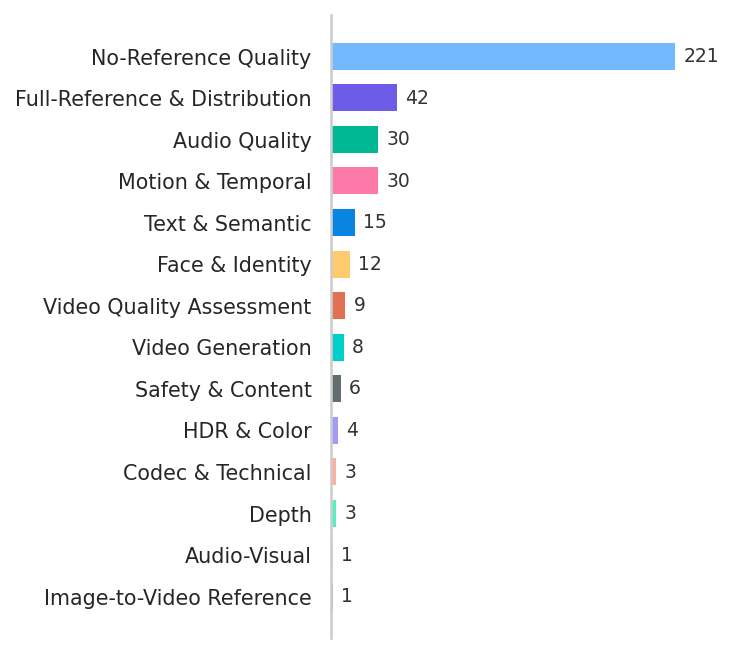
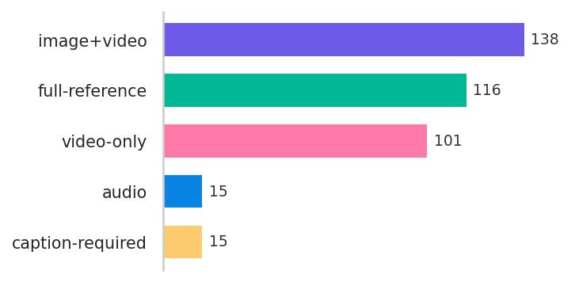
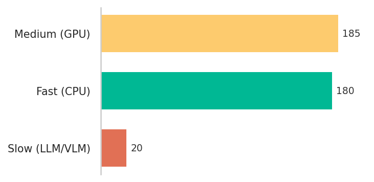
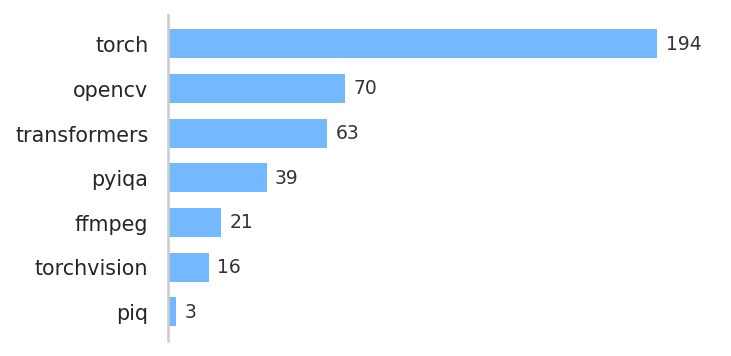
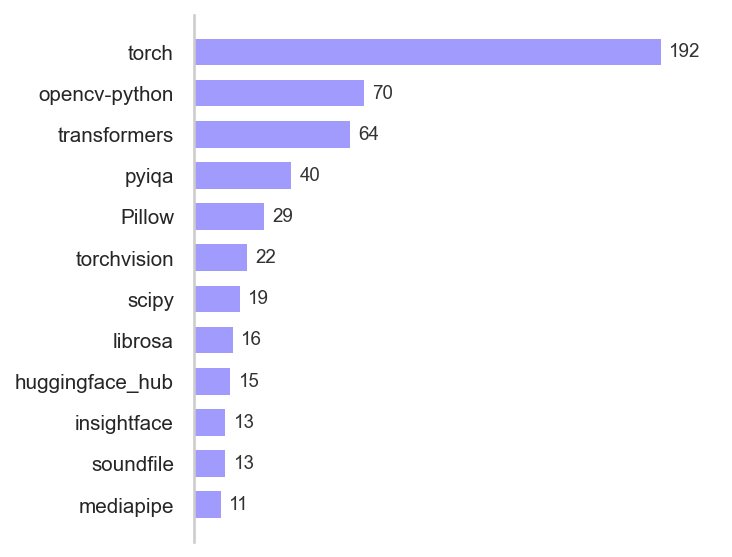
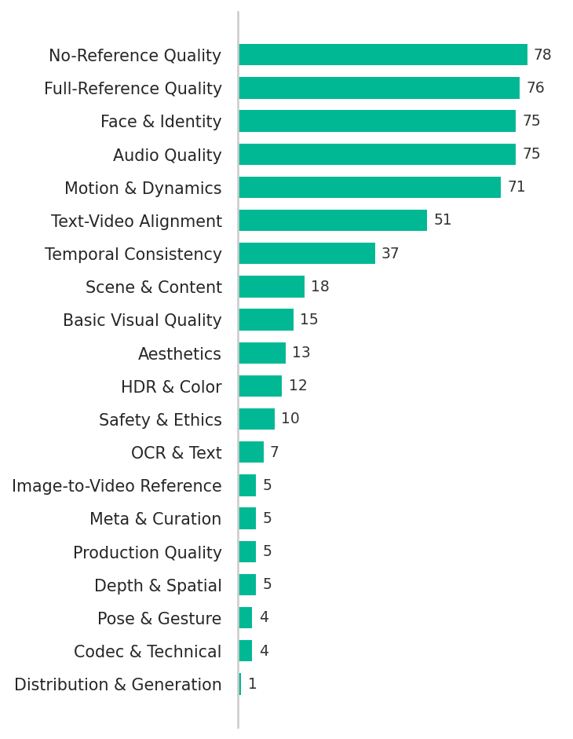

# Ayase Metrics Reference

> **Version 0.1.80** · Generated 2026-10-07 11:39 · **385 modules** · **566 metrics**
>
> `ayase modules docs -o METRICS.md` to regenerate
>
> Tests: **377/385 modules** have static test references · `pytest tests/` (light) · `pytest tests/ --full` (with ML models)

> [!NOTE]
> Static test coverage links are included below. Live pass/fail status was not collected for this regeneration (`--no-tests` was passed). Re-run with `ayase modules docs --run-tests` to add live status.

## Summary

**385** modules · **654** output fields · **566** metrics · **276** tiered · **181** GPU · **20** categories

## Provenance

Classification applies to each output field, independently of backend availability.

| Class | Meaning |
|---|---|
| `published` | Implements the cited definition and protocol. |
| `adapted` | Uses a published definition with the stated model, preprocessing, sampling or aggregation deviations. |
| `own` | Ayase-defined quantity without a matching published definition. |
| `utility` | Metadata, coverage, detection or other non-quality output. |

Default selections allow `published` and `utility`; explicit module selection opts into `adapted` and `own`. A source citation does not establish numerical interchangeability. Protocol deviations and backend requirements are listed with each metric. Migration changes are documented in [MIGRATION.md](MIGRATION.md).

<table width="100%"><tr>
<td width="50%" valign="top"><h4>Modules by Category</h4></td>
<td width="50%" valign="top"><h4>Input Types</h4></td>
</tr></table>

<table width="100%"><tr>
<td width="50%" valign="top"><h4>Speed Tiers</h4></td>
<td width="50%" valign="top"><h4>Backend Usage</h4></td>
</tr></table>

<table width="100%"><tr>
<td width="50%" valign="top"><h4>Top Packages</h4></td>
<td width="50%" valign="top"><h4>Metrics per Category</h4></td>
</tr></table>

[No-Reference Quality](#no-reference-quality-78-metrics) (78) · [Full-Reference Quality](#full-reference-quality-76-metrics) (76) · [Text-Video Alignment](#text-video-alignment-51-metrics) (51) · [Temporal Consistency](#temporal-consistency-35-metrics) (35) · [Motion & Dynamics](#motion--dynamics-71-metrics) (71) · [Pose & Gesture](#pose--gesture-4-metrics) (4) · [Basic Visual Quality](#basic-visual-quality-15-metrics) (15) · [Aesthetics](#aesthetics-13-metrics) (13) · [Audio Quality](#audio-quality-76-metrics) (76) · [Face & Identity](#face--identity-75-metrics) (75) · [Scene & Content](#scene--content-18-metrics) (18) · [Distribution & Generation](#distribution--generation-1-metrics) (1) · [HDR & Color](#hdr--color-12-metrics) (12) · [Codec & Technical](#codec--technical-4-metrics) (4) · [Depth & Spatial](#depth--spatial-5-metrics) (5) · [Production Quality](#production-quality-5-metrics) (5) · [OCR & Text](#ocr--text-7-metrics) (7) · [Safety & Ethics](#safety--ethics-10-metrics) (10) · [Image-to-Video Reference](#image-to-video-reference-5-metrics) (5) · [Meta & Curation](#meta--curation-5-metrics) (5) · [Dataset-Level Metrics](#dataset-level-metrics-89-fields) (89) · [Utility & Validation](#utility--validation-29-modules) (29)

---

## No-Reference Quality (78 metrics)

### `aigv_static_est` [↑](#categories)
> AI video static quality

**[`aigv_assessor`](src/ayase/modules/aigv_assessor.py)** — AI-generated video quality (AIGV-Assessor InternVL model)

- **Input**: vid · **Speed**: ⏱️ medium · GPU
- **Backend**: unavailable
- **Provenance**: `adapted` — only static_quality is loaded via AutoModel with no prompt and no official preprocessing; logits are clipped to [0,1]. Official inference is a custom InternVL with a regressor — source: AIGV-Assessor (Wang et al., CVPR 2025) — https://github.com/IntMeGroup/AIGV-Assessor
- **Packages**: torch, transformers
- **Source**: <a href="https://github.com/IntMeGroup/AIGV-Assessor" target="_blank">GitHub</a> · <a href="https://huggingface.co/IntMeGroup/AIGV-Assessor-static_quality" target="_blank">HF</a>
- **Tests**: covered by [`test_aigv_assessor.py`](tests/modules/per_module/test_aigv_assessor.py), [`test_motion_scene_semantic_metrics.py`](tests/modules/test_motion_scene_semantic_metrics.py)
- **Config**: `subsample=8`, `trust_remote_code=True`

### `arniqa_score` [↑](#categories)
> ARNIQA (higher=better) · ↑ higher=better

**[`arniqa`](src/ayase/modules/arniqa.py)** — ARNIQA no-reference image quality assessment

- **Input**: img/vid · **Speed**: ⏱️ medium · GPU
- **Backend**: unavailable → pyiqa
- **Provenance**: `adapted` — The cited score is defined per image. Ayase also writes this field for video by selecting decoded frames and aggregating their image scores; frame selection and pooling follow this module, not a published native video protocol. Image inputs use the image backend. — source: ARNIQA (Agnolucci et al., WACV 2024) via pyiqa — https://github.com/miccunifi/ARNIQA
- **Packages**: pyiqa, torch
- **Source**: <a href="https://github.com/miccunifi/ARNIQA" target="_blank">GitHub</a>
- **Tests**: covered by [`test_arniqa.py`](tests/modules/per_module/test_arniqa.py), [`test_iqa_research_metrics.py`](tests/modules/test_iqa_research_metrics.py)
- **Config**: `subsample=8`

### `brisque` [↑](#categories)
> BRISQUE (0-100, lower=better) · ↓ lower=better · 0-100

**[`brisque`](src/ayase/modules/brisque.py)** — BRISQUE no-reference image quality (lower=better)

- **Input**: img/vid · **Speed**: ⏱️ medium · GPU
- **Backend**: pyiqa → unavailable
- **Provenance**: `adapted` — The cited score is defined per image. Ayase also writes this field for video by selecting decoded frames and aggregating their image scores; frame selection and pooling follow this module, not a published native video protocol. Image inputs use the image backend. — source: BRISQUE (Mittal et al. 2012) via pyiqa — https://github.com/chaofengc/IQA-PyTorch
- **Packages**: pyiqa, torch
- **Source**: <a href="https://github.com/chaofengc/IQA-PyTorch" target="_blank">GitHub</a>
- **Tests**: covered by [`test_brisque.py`](tests/modules/per_module/test_brisque.py), [`test_fields_general.py`](tests/modules/test_fields_general.py), [`test_ml_basics.py`](tests/modules/test_ml_basics.py), +1 more
- **Config**: `subsample=3`, `warning_threshold=50.0`

### `brisque_inverted` [↑](#categories)
> Natural scene statistics

**[`brisque_inverted`](src/ayase/modules/brisque_inverted.py)** — Naturalness via BRISQUE natural-scene-statistics (higher=more natural)

- **Input**: img/vid · **Speed**: ⏱️ medium · GPU
- **Backend**: pyiqa_brisque → unavailable
- **Provenance**: `own`
- **Packages**: pyiqa, torch
- **Tests**: covered by [`test_brisque_inverted.py`](tests/modules/per_module/test_brisque_inverted.py), [`test_fields_general.py`](tests/modules/test_fields_general.py), [`test_reference_and_meta_metrics.py`](tests/modules/test_reference_and_meta_metrics.py)
- **Config**: `subsample=2`, `warning_threshold=0.4`

### `chipqa_score` [↑](#categories)
> ChipQA space-time-chip NR-VQA (higher=better) · ↑ higher=better

**[`chipqa`](src/ayase/modules/chipqa.py)** — ChipQA no-reference video quality via its feature extractor and LIVE-Livestream SVR

- **Input**: vid · **Speed**: ⚡ fast
- **Backend**: unavailable → chipqa
- **Provenance**: `published` — source: ChipQA (Ebenezer et al.) — https://github.com/JoshuaEbenezer/ChipQA
- **Packages**: joblib, matplotlib, numba, opencv-python, scikit-learn, scipy
- **Source**: <a href="https://github.com/JoshuaEbenezer/ChipQA" target="_blank">GitHub</a>
- **Tests**: covered by [`test_chipqa.py`](tests/modules/per_module/test_chipqa.py)
- **Config**: `timeout_sec=1800`

### `clip_feel_score` [↑](#categories)
> CLiF-VQA human feelings (higher=better) · ↑ higher=better

**[`clip_feel`](src/ayase/modules/clip_feel.py)** — CLIP aesthetic-feel video quality (own, CLiF-VQA-inspired)

- **Input**: img/vid · **Speed**: ⏱️ medium · GPU
- **Backend**: clip → unavailable
- **Provenance**: `own`
- **Packages**: torch, transformers
- **VRAM**: ~600 MB
- **Source**: <a href="https://huggingface.co/openai/clip-vit-base-patch32" target="_blank">HF</a>
- **Tests**: covered by [`test_clip_feel.py`](tests/modules/per_module/test_clip_feel.py)
- **Config**: `subsample=8`, `clip_model=openai/clip-vit-base-patch32`

### `clip_iqa_score` [↑](#categories)
> CLIP-IQA semantic quality (0-1, higher=better) · ↑ higher=better · 0-1

**[`clip_iqa`](src/ayase/modules/clip_iqa.py)** — CLIP-based no-reference image quality assessment

- **Input**: img/vid · **Speed**: ⏱️ medium · GPU
- **Backend**: unavailable → pyiqa
- **Provenance**: `adapted` — The cited score is defined per image. Ayase also writes this field for video by selecting decoded frames and aggregating their image scores; frame selection and pooling follow this module, not a published native video protocol. Image inputs use the image backend. — source: CLIP-IQA+ (Wang et al., AAAI 2023) via pyiqa — https://github.com/IceClear/CLIP-IQA
- **Packages**: pyiqa, torch
- **Source**: <a href="https://github.com/IceClear/CLIP-IQA" target="_blank">GitHub</a>
- **Tests**: covered by [`test_clip_iqa.py`](tests/modules/per_module/test_clip_iqa.py), [`test_ml_basics.py`](tests/modules/test_ml_basics.py)
- **Config**: `subsample=5`, `warning_threshold=0.4`

### `clip_slowfast_vq_score` [↑](#categories)
> ModularBVQA resolution-aware (higher=better) · ↑ higher=better

**[`clip_slowfast_vq`](src/ayase/modules/clip_slowfast_vq.py)** — CLIP+SlowFast blind VQA with Laplacian rectifiers (own, ModularBVQA-inspired)

- **Input**: img/vid · **Speed**: ⏱️ medium · GPU
- **Backend**: unavailable
- **Provenance**: `own` — source: ModularBVQA (Wen et al., CVPR 2024) claimed — https://github.com/winwinwenwen77/ModularBVQA
- **Packages**: opencv-python, torch, torchvision
- **VRAM**: ~600 MB
- **Source**: <a href="https://github.com/winwinwenwen77/ModularBVQA" target="_blank">GitHub</a>
- **Tests**: covered by [`test_clip_slowfast_vq.py`](tests/modules/per_module/test_clip_slowfast_vq.py)
- **Config**: `subsample=8`, `frame_size=224`

### `cnniqa_score` [↑](#categories)
> CNNIQA blind CNN IQA · ↑ higher=better

**[`cnniqa`](src/ayase/modules/cnniqa.py)** — CNNIQA blind CNN-based image quality assessment

- **Input**: img/vid · **Speed**: ⏱️ medium · GPU
- **Backend**: unavailable → pyiqa
- **Provenance**: `adapted` — The cited score is defined per image. Ayase also writes this field for video by selecting decoded frames and aggregating their image scores; frame selection and pooling follow this module, not a published native video protocol. Image inputs use the image backend. — source: CNNIQA (Kang et al., CVPR 2014) via pyiqa — https://github.com/chaofengc/IQA-PyTorch
- **Packages**: pyiqa, torch
- **Source**: <a href="https://github.com/chaofengc/IQA-PyTorch" target="_blank">GitHub</a>
- **Tests**: covered by [`test_cnniqa.py`](tests/modules/per_module/test_cnniqa.py), [`test_image_iqa_metrics.py`](tests/modules/test_image_iqa_metrics.py)
- **Config**: `subsample=4`

### `compare2score` [↑](#categories)
> Compare2Score comparison-based · ↑ higher=better

**[`compare2score`](src/ayase/modules/compare2score.py)** — Compare2Score comparison-based NR image quality

- **Input**: img/vid · **Speed**: ⏱️ medium · GPU
- **Backend**: unavailable → pyiqa
- **Provenance**: `adapted` — The cited score is defined per image. Ayase also writes this field for video by selecting decoded frames and aggregating their image scores; frame selection and pooling follow this module, not a published native video protocol. Image inputs use the image backend. — source: Compare2Score (Zhu et al., NeurIPS 2024) via pyiqa — https://github.com/Q-Future/Compare2Score
- **Packages**: pyiqa, torch
- **Source**: <a href="https://github.com/Q-Future/Compare2Score" target="_blank">GitHub</a>
- **Tests**: covered by [`test_compare2score.py`](tests/modules/per_module/test_compare2score.py), [`test_image_iqa_metrics.py`](tests/modules/test_image_iqa_metrics.py)
- **Config**: `subsample=4`

### `cover_score` [↑](#categories)
> COVER overall (higher=better) · ↑ higher=better

**[`cover`](src/ayase/modules/cover.py)** — COVER 3-branch comprehensive video quality (semantic + aesthetic + technical)

- **Input**: img/vid · **Speed**: ⏱️ medium · GPU
- **Provenance**: `published` — source: COVER (He et al., CVPRW 2024) — https://github.com/vztu/COVER
- **Packages**: torch
- **VRAM**: ~800 MB
- **Source**: <a href="https://github.com/taco-group/COVER" target="_blank">GitHub</a>
- **Tests**: covered by [`test_cover.py`](tests/modules/per_module/test_cover.py), [`test_iqa_research_metrics.py`](tests/modules/test_iqa_research_metrics.py)
- **Config**: `quality_threshold=30.0`

### `cover_technical` [↑](#categories)
> COVER technical branch

**[`cover`](src/ayase/modules/cover.py)** — COVER 3-branch comprehensive video quality (semantic + aesthetic + technical)

- **Input**: img/vid · **Speed**: ⏱️ medium · GPU
- **Provenance**: `published` — source: COVER (He et al., CVPRW 2024) — https://github.com/taco-group/COVER
- **Packages**: torch
- **VRAM**: ~800 MB
- **Source**: <a href="https://github.com/taco-group/COVER" target="_blank">GitHub</a>
- **Tests**: covered by [`test_cover.py`](tests/modules/per_module/test_cover.py), [`test_iqa_research_metrics.py`](tests/modules/test_iqa_research_metrics.py)
- **Config**: `quality_threshold=30.0`

### `crave_score` [↑](#categories)
> CRAVE next-gen AIGC (higher=better) · ↑ higher=better

**[`crave`](src/ayase/modules/crave.py)** — CRAVE content-rich AIGC video evaluator (2025)

- **Input**: vid · **Speed**: ⚡ fast
- **Backend**: unavailable → crave
- **Provenance**: `utility` — source: CRAVE (2025) — https://github.com/littlespray/CRAVE
- **Packages**: crave
- **Source**: <a href="https://github.com/littlespray/CRAVE" target="_blank">GitHub</a>
- **Tests**: covered by [`test_crave.py`](tests/modules/per_module/test_crave.py)
- **Config**: `subsample=12`

### `dbcnn_score` [↑](#categories)
> DBCNN bilinear CNN (higher=better) · ↑ higher=better

**[`dbcnn`](src/ayase/modules/dbcnn.py)** — DBCNN deep bilinear CNN for no-reference IQA

- **Input**: img/vid · **Speed**: ⏱️ medium · GPU
- **Backend**: unavailable → pyiqa
- **Provenance**: `adapted` — The cited score is defined per image. Ayase also writes this field for video by selecting decoded frames and aggregating their image scores; frame selection and pooling follow this module, not a published native video protocol. Image inputs use the image backend. — source: DBCNN (Zhang et al., TCSVT 2020) via pyiqa — https://github.com/zwx8981/DBCNN
- **Packages**: pyiqa, torch
- **Source**: <a href="https://github.com/zwx8981/DBCNN" target="_blank">GitHub</a>
- **Tests**: covered by [`test_dbcnn.py`](tests/modules/per_module/test_dbcnn.py), [`test_iqa_research_metrics.py`](tests/modules/test_iqa_research_metrics.py)
- **Config**: `subsample=8`

### `deepdc_score` [↑](#categories)
> DeepDC distribution conformance (lower=better) · ↓ lower=better

**[`deepdc`](src/ayase/modules/deepdc.py)** — DeepDC distribution conformance NR-IQA via pyiqa (2024, lower=better)

- **Input**: img/vid · **Speed**: ⏱️ medium · GPU
- **Backend**: unavailable → pyiqa
- **Provenance**: `adapted` — The cited score is defined per image. Ayase also writes this field for video by selecting decoded frames and aggregating their image scores; frame selection and pooling follow this module, not a published native video protocol. Image inputs use the image backend. — source: DeepDC (Zhu et al. 2024) via pyiqa — https://github.com/chaofengc/IQA-PyTorch
- **Packages**: pyiqa, torch
- **Source**: <a href="https://github.com/chaofengc/IQA-PyTorch" target="_blank">GitHub</a>
- **Tests**: covered by [`test_deepdc.py`](tests/modules/per_module/test_deepdc.py)
- **Config**: `subsample=8`

### `dover_score` [↑](#categories)
> DOVER overall (higher=better) · ↑ higher=better · 0-1 sigmoid

**[`dover`](src/ayase/modules/dover.py)** — DOVER disentangled technical + aesthetic VQA (ICCV 2023)

- **Input**: vid · **Speed**: ⏱️ medium · GPU
- **Backend**: unavailable → native → onnx
- **Provenance**: `published` — Overall fusion weights (0.6104/0.3896) are official; computed over the ported sub-scores above. — source: DOVER (Wu et al., ICCV 2023) — https://github.com/VQAssessment/DOVER/blob/master/evaluate_a_set_of_videos.py
- **Packages**: onnxruntime, torch
- **VRAM**: ~800 MB
- **Source**: <a href="https://github.com/VQAssessment/DOVER" target="_blank">GitHub</a>
- **Tests**: covered by [`test_dover.py`](tests/modules/per_module/test_dover.py), [`test_ml_basics.py`](tests/modules/test_ml_basics.py)
- **Config**: `warning_threshold=0.4`

### `dover_technical` [↑](#categories)
> DOVER technical quality · 0-1 sigmoid

**[`dover`](src/ayase/modules/dover.py)** — DOVER disentangled technical + aesthetic VQA (ICCV 2023)

- **Input**: vid · **Speed**: ⏱️ medium · GPU
- **Backend**: unavailable → native → onnx
- **Provenance**: `published` — Sigmoid rescaling now uses the official fuse_results constants; backends are a vendored port (native) or ONNX export of the same weights — minor numerical differences vs the upstream repo are possible. — source: DOVER (Wu et al., ICCV 2023) — https://github.com/VQAssessment/DOVER/blob/master/evaluate_a_set_of_videos.py
- **Packages**: onnxruntime, torch
- **VRAM**: ~800 MB
- **Source**: <a href="https://github.com/VQAssessment/DOVER" target="_blank">GitHub</a>
- **Tests**: covered by [`test_dover.py`](tests/modules/per_module/test_dover.py), [`test_ml_basics.py`](tests/modules/test_ml_basics.py)
- **Config**: `warning_threshold=0.4`

### `evoquality_score` [↑](#categories)
> EvoQuality self-evolving VLM NR-IQA (1-5, higher=better) · ↑ higher=better · 1-5

**[`evoquality`](src/ayase/modules/evoquality.py)** — EvoQuality self-evolving VLM no-reference quality rating

- **Input**: vid · **Speed**: ⏱️ medium
- **Backend**: unavailable → openai → transformers
- **Provenance**: `adapted` — The cited score is defined per image. Ayase also writes this field for video by selecting decoded frames and aggregating their image scores; frame selection and pooling follow this module, not a published native video protocol. Image inputs use the image backend. — source: EvoQuality (ByteDance), HF model — https://huggingface.co/ByteDance/EvoQuality
- **Packages**: torch, transformers
- **Source**: <a href="https://huggingface.co/ByteDance/EvoQuality" target="_blank">HF</a>
- **Tests**: covered by [`test_evoquality.py`](tests/modules/per_module/test_evoquality.py)
- **Config**: `backend=auto`, `model_name=ByteDance/EvoQuality`, `num_frames=5`, `device=auto`, `dtype=bfloat16`, `max_new_tokens=512`, `temperature=0.0`, `top_p=1.0`, `max_image_size=1024`, `resize_to_square=False`, `store_raw_outputs=False`

### `fast_vqa_score` [↑](#categories)
> 0-100 · ↑ higher=better

**[`fast_vqa`](src/ayase/modules/fast_vqa.py)** — Deep Learning Video Quality Assessment (FAST-VQA)

- **Input**: vid · **Speed**: ⏱️ medium
- **Backend**: unavailable → fastvqa
- **Provenance**: `published` — source: FAST-VQA / FasterVQA (Wu et al., ECCV 2022 / TPAMI) — https://github.com/VQAssessment/FAST-VQA-and-FasterVQA
- **Packages**: PyYAML, decord, torch, traceback
- **Source**: <a href="https://github.com/VQAssessment/FAST-VQA-and-FasterVQA" target="_blank">GitHub</a>
- **Tests**: covered by [`test_fast_vqa.py`](tests/modules/per_module/test_fast_vqa.py)
- **Config**: `model_type=FasterVQA`

### `finevq_raw_mean` [↑](#categories)
> FineVQ fine-grained UGC VQA (CVPR 2025)

**[`finevq_raw`](src/ayase/modules/finevq_raw.py)** — Raw logit mean of the FineVQ model (adapted)

- **Input**: img/vid · **Speed**: ⏱️ medium · GPU
- **Backend**: unavailable → finevq
- **Provenance**: `own` — source: FineVQ model (Duan et al., CVPR 2025); the number is not its score — https://github.com/IntMeGroup/FineVQ
- **Packages**: Pillow, opencv-python, torch, transformers
- **Source**: <a href="https://github.com/IntMeGroup/FineVQ" target="_blank">GitHub</a> · <a href="https://huggingface.co/IntMeGroup/FineVQ_score" target="_blank">HF</a>
- **Tests**: covered by [`test_finevq_raw.py`](tests/modules/per_module/test_finevq_raw.py), [`test_video_native_metrics.py`](tests/modules/test_video_native_metrics.py)
- **Config**: `subsample=8`, `trust_remote_code=True`, `weights={'sharpness': 0.2, 'colorfulness': 0.15, 'noise': 0.2, 'temporal_stability': 0.25, 'content_richness': 0.2}`

### `hpsv2_const_quality` [↑](#categories)
> VADER reward alignment · ↑ higher=better

**[`hpsv2_const`](src/ayase/modules/hpsv2_const.py)** — HPSv2 constant-prompt quality reward (own metric)

- **Input**: img/vid · **Speed**: ⚡ fast
- **Backend**: unavailable → hpsv2
- **Provenance**: `own` — source: VADER (a finetuning method, not a metric); HPSv2 — https://github.com/mihirp1998/VADER
- **Packages**: hpsv2
- **VRAM**: ~1.5 GB
- **Source**: <a href="https://github.com/mihirp1998/VADER" target="_blank">GitHub</a> · <a href="https://huggingface.co/openai/clip-vit-large-patch14" target="_blank">HF</a>
- **Tests**: covered by [`test_hpsv2_const.py`](tests/modules/per_module/test_hpsv2_const.py)
- **Config**: `subsample=8`, `clip_model=openai/clip-vit-large-patch14`

### `hyperiqa_score` [↑](#categories)
> HyperIQA adaptive NR-IQA · ↑ higher=better

**[`hyperiqa`](src/ayase/modules/hyperiqa.py)** — HyperIQA adaptive hypernetwork NR image quality

- **Input**: img/vid · **Speed**: ⏱️ medium · GPU
- **Backend**: unavailable → pyiqa_hyperiqa
- **Provenance**: `adapted` — The cited score is defined per image. Ayase also writes this field for video by selecting decoded frames and aggregating their image scores; frame selection and pooling follow this module, not a published native video protocol. Image inputs use the image backend. — source: HyperIQA (Su et al., CVPR 2020) via pyiqa — https://github.com/SSL92/hyperIQA
- **Packages**: pyiqa, torch
- **Source**: <a href="https://github.com/SSL92/hyperIQA" target="_blank">GitHub</a>
- **Tests**: covered by [`test_hyperiqa.py`](tests/modules/per_module/test_hyperiqa.py), [`test_image_iqa_metrics.py`](tests/modules/test_image_iqa_metrics.py)
- **Config**: `subsample=4`

### `ilniqe` [↑](#categories)
> IL-NIQE Integrated Local NIQE (lower=better) · ↓ lower=better

**[`ilniqe`](src/ayase/modules/ilniqe.py)** — IL-NIQE integrated local no-reference quality (lower=better)

- **Input**: img/vid · **Speed**: ⏱️ medium · GPU
- **Backend**: pyiqa → unavailable
- **Provenance**: `adapted` — The cited score is defined per image. Ayase also writes this field for video by selecting decoded frames and aggregating their image scores; frame selection and pooling follow this module, not a published native video protocol. Image inputs use the image backend. — source: IL-NIQE (Zhang et al., TIP 2015) via pyiqa — https://github.com/chaofengc/IQA-PyTorch
- **Packages**: pyiqa, torch
- **Source**: <a href="https://github.com/chaofengc/IQA-PyTorch" target="_blank">GitHub</a>
- **Tests**: covered by [`test_ilniqe.py`](tests/modules/per_module/test_ilniqe.py), [`test_perceptual_metrics.py`](tests/modules/test_perceptual_metrics.py)
- **Config**: `subsample=3`, `warning_threshold=50.0`

### `liqe_score` [↑](#categories)
> LIQE lightweight IQA (higher=better) · ↑ higher=better

**[`liqe`](src/ayase/modules/liqe.py)** — LIQE lightweight no-reference IQA

- **Input**: img/vid · **Speed**: ⏱️ medium · GPU
- **Backend**: pyiqa → unavailable
- **Provenance**: `adapted` — The cited score is defined per image. Ayase also writes this field for video by selecting decoded frames and aggregating their image scores; frame selection and pooling follow this module, not a published native video protocol. Image inputs use the image backend. — source: LIQE (Zhang et al., CVPR 2023) via pyiqa — https://github.com/chaofengc/IQA-PyTorch
- **Packages**: pyiqa, torch
- **Source**: <a href="https://github.com/chaofengc/IQA-PyTorch" target="_blank">GitHub</a>
- **Tests**: covered by [`test_liqe.py`](tests/modules/per_module/test_liqe.py), [`test_ml_basics.py`](tests/modules/test_ml_basics.py)
- **Config**: `subsample=5`, `warning_threshold=2.5`

### `love_perception_score` [↑](#categories)
> LOVE raw perception regressor score · ↑ higher=better

**[`love_results`](src/ayase/modules/love_results.py)** — LOVE perception and text-video correspondence result adapter

- **Input**: img/vid · **Speed**: ⚡ fast
- **Backend**: imported_results
- **Provenance**: `utility` — source: imports LOVE results — https://huggingface.co/anonymousdb/LOVE-Perception
- **Source**: <a href="https://huggingface.co/anonymousdb/LOVE-Perception" target="_blank">HF</a>
- **Tests**: covered by [`test_result_adapters.py`](tests/modules/per_module/test_result_adapters.py)

### `maclip_score` [↑](#categories)
> MACLIP multi-attribute CLIP NR-IQA (higher=better) · ↑ higher=better

**[`maclip`](src/ayase/modules/maclip.py)** — MACLIP multi-attribute CLIP no-reference quality (higher=better)

- **Input**: img/vid · **Speed**: ⏱️ medium · GPU
- **Backend**: pyiqa → unavailable
- **Provenance**: `adapted` — The cited score is defined per image. Ayase also writes this field for video by selecting decoded frames and aggregating their image scores; frame selection and pooling follow this module, not a published native video protocol. Image inputs use the image backend. — source: MACLIP via pyiqa 'maclip' — https://github.com/chaofengc/IQA-PyTorch
- **Packages**: pyiqa, torch
- **Source**: <a href="https://github.com/chaofengc/IQA-PyTorch" target="_blank">GitHub</a>
- **Tests**: covered by [`test_maclip.py`](tests/modules/per_module/test_maclip.py), [`test_perceptual_metrics.py`](tests/modules/test_perceptual_metrics.py)
- **Config**: `subsample=3`

### `maniqa_score` [↑](#categories)
> MANIQA multi-attention (higher=better) · ↑ higher=better

**[`maniqa`](src/ayase/modules/maniqa.py)** — MANIQA multi-dimension attention no-reference IQA

- **Input**: img/vid · **Speed**: ⏱️ medium · GPU
- **Backend**: pyiqa → unavailable
- **Provenance**: `adapted` — The cited score is defined per image. Ayase also writes this field for video by selecting decoded frames and aggregating their image scores; frame selection and pooling follow this module, not a published native video protocol. Image inputs use the image backend. — source: MANIQA (Yang et al., CVPRW 2022) via pyiqa — https://github.com/chaofengc/IQA-PyTorch
- **Packages**: pyiqa, torch
- **Source**: <a href="https://github.com/chaofengc/IQA-PyTorch" target="_blank">GitHub</a>
- **Tests**: covered by [`test_maniqa.py`](tests/modules/per_module/test_maniqa.py), [`test_iqa_research_metrics.py`](tests/modules/test_iqa_research_metrics.py)
- **Config**: `subsample=8`

### `mc360iqa_score` [↑](#categories)
> MC360IQA blind 360 (higher=better) · ↑ higher=better

**[`mc360iqa`](src/ayase/modules/mc360iqa.py)** — MC360IQA blind 360 IQA (2019; real model only, disabled if unavailable)

- **Input**: img/vid · **Speed**: ⏱️ medium · GPU
- **Backend**: unavailable → real
- **Provenance**: `adapted` — The cited score is defined per image. Ayase also writes this field for video by selecting decoded frames and aggregating their image scores; frame selection and pooling follow this module, not a published native video protocol. Image inputs use the image backend. — source: MC360IQA (Sun et al., IEEE JSTSP 2019) — https://github.com/sunwei925/MC360IQA
- **Packages**: Pillow, huggingface_hub, opencv-python, scipy, torch, torchvision
- **VRAM**: ~200 MB
- **Source**: <a href="https://github.com/sunwei925/MC360IQA" target="_blank">GitHub</a>
- **Tests**: covered by [`test_mc360iqa.py`](tests/modules/per_module/test_mc360iqa.py)
- **Config**: `weights_variant=OIQA`, `projection_size=480`, `input_size=224`, `device=auto`

### `mdvqa_score` [↑](#categories)
> MD-VQA fused quality (0-1, higher=better) · ↑ higher=better · 0-1

**[`mdvqa`](src/ayase/modules/mdvqa.py)** — MD-VQA multi-dimensional UGC live VQA (CVPR 2023; real model only, disabled if unavailable)

- **Input**: vid · **Speed**: ⏱️ medium · GPU
- **Backend**: real → unavailable
- **Provenance**: `adapted` — model and head vendored verbatim; upstream protocol: the whole video is read, int(seconds*16) frames sampled uniformly; max_seconds is an optional time limit (upstream time_limit) — source: MD-VQA (Zhang et al., CVPR 2023) — https://github.com/kunyou99/MD-VQA_cvpr2023
- **Packages**: huggingface_hub, opencv-python, torch, torchvision
- **Source**: <a href="https://github.com/kunyou99/MD-VQA_cvpr2023" target="_blank">GitHub</a>
- **Tests**: covered by [`test_mdvqa.py`](tests/modules/per_module/test_mdvqa.py)
- **Config**: `clip_len=16`, `max_seconds=0`, `device=auto`

### `mj_video_fineness_score` [↑](#categories)
> MJ-Video fine-detail aspect · ↑ higher=better

**[`mj_video`](src/ayase/modules/mj_video.py)** — MJ-Video overall reward and five fine-grained preference aspects

- **Input**: vid +ref +cap · **Speed**: ⏱️ medium · GPU
- **Backend**: mj_video → unavailable
- **Provenance**: `published` — source: MJ-Video / MJ-VIDEO-2B (Tong et al., 2025) — https://github.com/aiming-lab/MJ-Video
- **Packages**: boto3, data_processor, internvl2, model, safetensors, torch, transformers
- **Source**: <a href="https://github.com/aiming-lab/MJ-Video" target="_blank">GitHub</a> · <a href="https://huggingface.co/MJ-Bench/MJ-VIDEO-2B" target="_blank">HF</a>
- **Tests**: covered by [`test_mj_video.py`](tests/modules/per_module/test_mj_video.py), [`test_regressions.py`](tests/test_regressions.py)
- **Config**: `model_name=MJ-Bench/MJ-VIDEO-2B`, `tokenizer_base_url=https://huggingface.co/internlm/internlm2-chat-1_8b/resolve`, `tokenizer_revision=main`, `num_segments=8`, `max_new_tokens=1024`, `do_sample=True`, `gating_temperature=1.0`, `gating_hidden_dim=1024`, `gating_n_hidden=3`

### `mouth_quality_score` [↑](#categories)
> THEval MUSIQ on mouth crops (higher=better) · ↑ higher=better

**[`mouth_quality`](src/ayase/modules/mouth_quality.py)** — THEval localized mouth-crop MUSIQ-SPAQ quality

- **Input**: vid · **Speed**: ⏱️ medium · GPU
- **Backend**: unavailable
- **Provenance**: `adapted` — The cited score is defined per image. Ayase also writes this field for video by selecting decoded frames and aggregating their image scores; frame selection and pooling follow this module, not a published native video protocol. Image inputs use the image backend. — source: THEval (Quignon et al., arXiv 2511.04520) — https://arxiv.org/abs/2511.04520
- **Packages**: pyiqa, torch
- **Source**: <a href="https://arxiv.org/abs/2511.04520" target="_blank">arXiv</a>
- **Tests**: covered by [`test_mouth_quality.py`](tests/modules/per_module/test_mouth_quality.py)
- **Config**: `batch_size=64`, `padding=10`, `num_faces=1`

### `musiq_score` [↑](#categories)
> MUSIQ multi-scale IQA (higher=better) · ↑ higher=better

**[`musiq`](src/ayase/modules/musiq.py)** — Multi-Scale Image Quality Transformer (no-reference)

- **Input**: img/vid · **Speed**: ⏱️ medium · GPU
- **Backend**: pyiqa → unavailable
- **Provenance**: `adapted` — The cited score is defined per image. Ayase also writes this field for video by selecting decoded frames and aggregating their image scores; frame selection and pooling follow this module, not a published native video protocol. Image inputs use the image backend. — source: MUSIQ (Ke et al., ICCV 2021) via pyiqa — https://github.com/chaofengc/IQA-PyTorch
- **Packages**: pyiqa, torch
- **Source**: <a href="https://github.com/chaofengc/IQA-PyTorch" target="_blank">GitHub</a>
- **Tests**: covered by [`test_musiq.py`](tests/modules/per_module/test_musiq.py), [`test_ml_basics.py`](tests/modules/test_ml_basics.py)
- **Config**: `variant=musiq`, `subsample=5`, `warning_threshold=40.0`

### `niqe` [↑](#categories)
> Natural Image Quality Evaluator (lower=better) · ↓ lower=better

**[`niqe`](src/ayase/modules/niqe.py)** — Natural Image Quality Evaluator (no-reference)

- **Input**: img/vid · **Speed**: ⏱️ medium · GPU
- **Backend**: pyiqa → unavailable
- **Provenance**: `adapted` — The cited score is defined per image. Ayase also writes this field for video by selecting decoded frames and aggregating their image scores; frame selection and pooling follow this module, not a published native video protocol. Image inputs use the image backend. — source: NIQE (Mittal et al., 2013) via pyiqa — https://github.com/chaofengc/IQA-PyTorch
- **Packages**: pyiqa, torch
- **Source**: <a href="https://github.com/chaofengc/IQA-PyTorch" target="_blank">GitHub</a>
- **Tests**: covered by [`test_niqe.py`](tests/modules/per_module/test_niqe.py), [`test_fields_general.py`](tests/modules/test_fields_general.py), [`test_reference_and_meta_metrics.py`](tests/modules/test_reference_and_meta_metrics.py), +1 more
- **Config**: `subsample=2`, `warning_threshold=7.0`

### `nrqm` [↑](#categories)
> NRQM No-Reference Quality Metric (higher=better) · ↑ higher=better

**[`nrqm`](src/ayase/modules/nrqm.py)** — NRQM no-reference quality metric for super-resolution (higher=better)

- **Input**: img/vid · **Speed**: ⏱️ medium · GPU
- **Backend**: pyiqa → unavailable
- **Provenance**: `adapted` — The cited score is defined per image. Ayase also writes this field for video by selecting decoded frames and aggregating their image scores; frame selection and pooling follow this module, not a published native video protocol. Image inputs use the image backend. — source: NRQM (Ma et al., 2017) via pyiqa — https://github.com/chaofengc/IQA-PyTorch
- **Packages**: pyiqa, torch
- **Source**: <a href="https://github.com/chaofengc/IQA-PyTorch" target="_blank">GitHub</a>
- **Tests**: covered by [`test_nrqm.py`](tests/modules/per_module/test_nrqm.py), [`test_perceptual_metrics.py`](tests/modules/test_perceptual_metrics.py)
- **Config**: `subsample=3`

### `opens2v_natural_score` [↑](#categories)
> NaturalScore VLM naturalness (higher=better) · ↑ higher=better

**[`opens2v`](src/ayase/modules/opens2v.py)** — OpenS2V-Eval subject-consistency metrics: NexusScore (YOLO-World image-prompt subject crops vs reference subject image, GME embeddings) and NaturalScore (GPT-4o naturalness judge)

- **Input**: vid +ref +cap · **Speed**: 🐌 slow · GPU
- **Backend**: unavailable
- **Provenance**: `adapted` — canonical 'openai' replicates upstream (GPT-4o x3 over 16 stride-sampled frames, verbatim prompt); 'vlm' is a local VLM judge substitute (documented substitution) — source: OpenS2V-Nexus NaturalScore (arXiv 2505.20292) — https://github.com/PKU-YuanGroup/OpenS2V-Nexus
- **Packages**: inspect, mmengine, mmyolo, openai, opencv-python, torch, torchvision, transformers
- **VRAM**: ~14 GB
- **Source**: <a href="https://github.com/PKU-YuanGroup/OpenS2V-Nexus" target="_blank">GitHub</a> · <a href="https://huggingface.co/openai/clip-vit-base-patch32" target="_blank">HF</a>
- **Tests**: covered by [`test_facesim.py`](tests/modules/per_module/test_facesim.py), [`test_opens2v.py`](tests/modules/per_module/test_opens2v.py)
- **Config**: `device=auto`, `nexus_backend=auto`, `natural_judge=auto`, `nexus_frames=32`, `yolo_checkpoint=yolo_world_v2_l_image_prompt_adapter-719a7afb.pth`, `yolo_clip_model=openai/clip-vit-base-patch32`, `gme_model=Alibaba-NLP/gme-Qwen2-VL-7B-Instruct`, `det_score_thr=0.5`, `det_nms_thr=0.7`, `det_max_boxes=100`, `keep_box_conf=0.6`, `keep_text_sim=0.3`, `detector_model=IDEA-Research/grounding-dino-tiny`, `box_threshold=0.3`, `text_threshold=0.25`, `gdino_keep_box_conf=0.3`, `gdino_keep_text_sim=0.2`, `encoder=clip`, `clip_model=openai/clip-vit-base-patch32`, `dino_model=dinov2_vitb14`, `max_frames=16`, `openai_model=gpt-4o-2024-11-20`, `natural_frames=16`, `natural_runs=3`, `vlm_model=llava-hf/llava-1.5-7b-hf`, `vlm_max_frames=4`, `vlm_max_new_tokens=8`, `warning_threshold=0.0`

### `paq2piq_score` [↑](#categories)
> PaQ-2-PiQ patch-to-picture (CVPR 2020) · ↑ higher=better

**[`paq2piq`](src/ayase/modules/paq2piq.py)** — PaQ-2-PiQ patch-to-picture NR quality (CVPR 2020)

- **Input**: img/vid · **Speed**: ⏱️ medium · GPU
- **Backend**: unavailable → pyiqa
- **Provenance**: `adapted` — The cited score is defined per image. Ayase also writes this field for video by selecting decoded frames and aggregating their image scores; frame selection and pooling follow this module, not a published native video protocol. Image inputs use the image backend. — source: PaQ-2-PiQ (Ying et al., CVPR 2020) via pyiqa — https://github.com/baidut/PaQ-2-PiQ
- **Packages**: opencv-python, pyiqa, torch
- **Source**: <a href="https://github.com/baidut/PaQ-2-PiQ" target="_blank">GitHub</a>
- **Tests**: covered by [`test_paq2piq.py`](tests/modules/per_module/test_paq2piq.py), [`test_image_iqa_metrics.py`](tests/modules/test_image_iqa_metrics.py)
- **Config**: `subsample=4`

### `phyground_general_score` [↑](#categories)
> Mean general judge score (1-5) · ↑ higher=better · 1-5

**[`phyground_results`](src/ayase/modules/phyground_results.py)** — PhyGround general and physical-law judge result adapter

- **Input**: img/vid · **Speed**: ⚡ fast
- **Backend**: imported_results
- **Provenance**: `utility` — source: PhyGround/PhyJudge — https://github.com/NU-World-Model-Embodied-AI/PhyGround
- **Source**: <a href="https://github.com/NU-World-Model-Embodied-AI/PhyGround" target="_blank">GitHub</a> · <a href="https://huggingface.co/NU-World-Model-Embodied-AI/phyjudge-9B" target="_blank">HF</a>
- **Tests**: covered by [`test_result_adapters.py`](tests/modules/per_module/test_result_adapters.py)

### `phyground_physical_coverage` [↑](#categories)
> Fraction of laws scored (0-1) · 0-1

**[`phyground_results`](src/ayase/modules/phyground_results.py)** — PhyGround general and physical-law judge result adapter

- **Input**: img/vid · **Speed**: ⚡ fast
- **Backend**: imported_results
- **Provenance**: `utility` — source: PhyGround/PhyJudge — https://github.com/NU-World-Model-Embodied-AI/PhyGround
- **Source**: <a href="https://github.com/NU-World-Model-Embodied-AI/PhyGround" target="_blank">GitHub</a> · <a href="https://huggingface.co/NU-World-Model-Embodied-AI/phyjudge-9B" target="_blank">HF</a>
- **Tests**: covered by [`test_result_adapters.py`](tests/modules/per_module/test_result_adapters.py)

### `phyground_physical_score` [↑](#categories)
> Mean applicable-law score (1-5) · ↑ higher=better · 1-5

**[`phyground_results`](src/ayase/modules/phyground_results.py)** — PhyGround general and physical-law judge result adapter

- **Input**: img/vid · **Speed**: ⚡ fast
- **Backend**: imported_results
- **Provenance**: `utility` — source: PhyGround/PhyJudge — https://github.com/NU-World-Model-Embodied-AI/PhyGround
- **Source**: <a href="https://github.com/NU-World-Model-Embodied-AI/PhyGround" target="_blank">GitHub</a> · <a href="https://huggingface.co/NU-World-Model-Embodied-AI/phyjudge-9B" target="_blank">HF</a>
- **Tests**: covered by [`test_result_adapters.py`](tests/modules/per_module/test_result_adapters.py)

### `pi_score` [↑](#categories)
> Perceptual Index (PIRM challenge, lower=better) · ↓ lower=better · PIRM challenge

**[`pi`](src/ayase/modules/pi_metric.py)** — Perceptual Index (PIRM challenge metric, lower=better)

- **Input**: img/vid · **Speed**: ⏱️ medium · GPU
- **Backend**: unavailable → pyiqa
- **Provenance**: `adapted` — The cited score is defined per image. Ayase also writes this field for video by selecting decoded frames and aggregating their image scores; frame selection and pooling follow this module, not a published native video protocol. Image inputs use the image backend. — source: Perceptual Index, PIRM 2018 (Blau et al.) via pyiqa — https://github.com/chaofengc/IQA-PyTorch
- **Packages**: pyiqa, torch
- **Source**: <a href="https://github.com/chaofengc/IQA-PyTorch" target="_blank">GitHub</a>
- **Tests**: covered by [`test_pi.py`](tests/modules/per_module/test_pi.py), [`test_perceptual_metrics.py`](tests/modules/test_perceptual_metrics.py), [`test_docs_integrity.py`](tests/test_docs_integrity.py)
- **Config**: `subsample=3`

### `piqe` [↑](#categories)
> PIQE perception-based NR-IQA (lower=better) · ↓ lower=better

**[`piqe`](src/ayase/modules/piqe.py)** — PIQE perception-based no-reference quality (lower=better)

- **Input**: img/vid · **Speed**: ⏱️ medium · GPU
- **Backend**: unavailable → pyiqa
- **Provenance**: `adapted` — The cited score is defined per image. Ayase also writes this field for video by selecting decoded frames and aggregating their image scores; frame selection and pooling follow this module, not a published native video protocol. Image inputs use the image backend. — source: PIQE (Venkatanath et al., 2015) via pyiqa — https://github.com/chaofengc/IQA-PyTorch
- **Packages**: pyiqa, torch
- **Source**: <a href="https://github.com/chaofengc/IQA-PyTorch" target="_blank">GitHub</a>
- **Tests**: covered by [`test_piqe.py`](tests/modules/per_module/test_piqe.py), [`test_perceptual_metrics.py`](tests/modules/test_perceptual_metrics.py)
- **Config**: `subsample=3`, `warning_threshold=50.0`

### `prove_rc_s_score` [↑](#categories)
> PROVE removal spatial coherence (higher=better) · ↑ higher=better · 0-1

**[`prove`](src/ayase/modules/prove.py)** — PROVE masked object-removal spatial and temporal coherence

- **Input**: img/vid · **Speed**: ⏱️ medium · GPU
- **Backend**: dinov2_giant
- **Provenance**: `published` — source: PROVE RC-S/RC-T (arXiv 2605.14534, ACM MM 2026) — https://github.com/xiaomi-research/prove
- **Packages**: torch, transformers
- **VRAM**: ~4.5 GB
- **Source**: <a href="https://github.com/xiaomi-research/prove" target="_blank">GitHub</a>
- **Tests**: covered by [`test_prove.py`](tests/modules/test_prove.py)
- **Config**: `model=facebook/dinov2-giant`, `revision=611a9d42f2335e0f921f1e313ad3c1b7178d206d`, `target_size=448`, `max_frames=81`, `device=auto`

### `provqa_score` [↑](#categories)
> ProVQA progressive 360 (higher=better) · ↑ higher=better

**[`provqa`](src/ayase/modules/provqa.py)** — ProVQA progressive blind 360° VQA (real model only)

- **Input**: img/vid · **Speed**: ⏱️ medium · GPU
- **Backend**: real → unavailable
- **Provenance**: `adapted` — model vendored verbatim; upstream protocol: 6 anchors in [4, N-4] with triplets of neighbouring frames ±3 (interval=3) — our anchors are uniformly deterministic instead of random; output is 1-DMOS — source: ProVQA (Yang et al., TIP 2022) — https://github.com/yanglixiaoshen/ProVQA
- **Packages**: opencv-python, torch
- **Source**: <a href="https://github.com/yanglixiaoshen/ProVQA" target="_blank">GitHub</a>
- **Tests**: covered by [`test_provqa.py`](tests/modules/per_module/test_provqa.py)
- **Config**: `device=auto`

### `qalign_quality` [↑](#categories)
> Q-Align technical quality (1-5, higher=better) · ↑ higher=better · 1-5

**[`q_align`](src/ayase/modules/q_align.py)** — Q-Align unified quality + aesthetic assessment (ICML 2024)

- **Input**: img/vid · **Speed**: 🐌 slow · GPU
- **Backend**: unavailable → qalign
- **Provenance**: `adapted` — video mode input_='video', but on a subset of frames (every subsample-th, <= max_frames) instead of all video frames — source: Q-Align / OneAlign (Wu et al., ICML 2024) — https://github.com/Q-Future/Q-Align
- **Packages**: Pillow, torch
- **VRAM**: ~14 GB
- **Source**: <a href="https://github.com/Q-Future/Q-Align" target="_blank">GitHub</a> · <a href="https://huggingface.co/q-future/one-align" target="_blank">HF</a>
- **Tests**: covered by [`test_q_align.py`](tests/modules/per_module/test_q_align.py), [`test_ml_basics.py`](tests/modules/test_ml_basics.py)
- **Config**: `model_name=q-future/one-align`, `dtype=float16`, `device=auto`, `subsample=8`, `max_frames=16`, `warning_threshold=2.5`, `trust_remote_code=True`

### `qualiclip_score` [↑](#categories)
> QualiCLIP opinion-unaware (higher=better) · ↑ higher=better

**[`qualiclip`](src/ayase/modules/qualiclip.py)** — QualiCLIP opinion-unaware CLIP-based no-reference IQA

- **Input**: img/vid · **Speed**: ⏱️ medium · GPU
- **Backend**: qualiclip → unavailable
- **Provenance**: `adapted` — The cited score is defined per image. Ayase also writes this field for video by selecting decoded frames and aggregating their image scores; frame selection and pooling follow this module, not a published native video protocol. Image inputs use the image backend. — source: QualiCLIP (Agnolucci et al., 2024) via pyiqa — https://github.com/miccunifi/QualiCLIP
- **Packages**: pyiqa, torch
- **Source**: <a href="https://github.com/miccunifi/QualiCLIP" target="_blank">GitHub</a>
- **Tests**: covered by [`test_qualiclip.py`](tests/modules/per_module/test_qualiclip.py), [`test_iqa_research_metrics.py`](tests/modules/test_iqa_research_metrics.py)
- **Config**: `subsample=8`

### `qwen_image_bench_overall` [↑](#categories)
> Mean of Qwen-Image-Bench L1 scores · 0-100

**[`qwen_image_bench`](src/ayase/modules/qwen_image_bench.py)** — Qwen-Image-Bench T2I judge scores across five image-generation dimensions

- **Input**: img/vid · **Speed**: 🐌 slow · GPU
- **Backend**: openai → transformers
- **Provenance**: `adapted` — judge inference via transformers/OpenAI-compatible endpoint instead of the official ms-swift PtEngine — source: Qwen-Image-Bench (arXiv 2605.28091) — https://github.com/QwenLM/Qwen-Image-Bench
- **Packages**: qwen-vl-utils, torch, transformers
- **Source**: <a href="https://github.com/QwenLM/Qwen-Image-Bench" target="_blank">GitHub</a> · <a href="https://huggingface.co/Qwen/Qwen-Image-Bench" target="_blank">HF</a>
- **Tests**: covered by [`test_qwen_image_bench.py`](tests/modules/per_module/test_qwen_image_bench.py)
- **Config**: `model_name=Qwen/Qwen-Image-Bench`, `backend=auto`, `dimensions=all`, `device=auto`, `dtype=bfloat16`, `device_map=auto`, `max_new_tokens=4096`, `temperature=0.0`, `top_p=1.0`, `top_k=1`, `repetition_penalty=1.05`, `max_image_size=1024`, `resize_to_square=True`, `trust_remote_code=True`

### `qwen_image_bench_quality` [↑](#categories)
> Quality L1 score · ↑ higher=better · 0-100

**[`qwen_image_bench`](src/ayase/modules/qwen_image_bench.py)** — Qwen-Image-Bench T2I judge scores across five image-generation dimensions

- **Input**: img/vid · **Speed**: 🐌 slow · GPU
- **Backend**: openai → transformers
- **Provenance**: `adapted` — judge inference via transformers/OpenAI-compatible endpoint instead of the official ms-swift PtEngine — source: Qwen-Image-Bench (arXiv 2605.28091) — https://github.com/QwenLM/Qwen-Image-Bench
- **Packages**: qwen-vl-utils, torch, transformers
- **Source**: <a href="https://github.com/QwenLM/Qwen-Image-Bench" target="_blank">GitHub</a> · <a href="https://huggingface.co/Qwen/Qwen-Image-Bench" target="_blank">HF</a>
- **Tests**: covered by [`test_qwen_image_bench.py`](tests/modules/per_module/test_qwen_image_bench.py)
- **Config**: `model_name=Qwen/Qwen-Image-Bench`, `backend=auto`, `dimensions=all`, `device=auto`, `dtype=bfloat16`, `device_map=auto`, `max_new_tokens=4096`, `temperature=0.0`, `top_p=1.0`, `top_k=1`, `repetition_penalty=1.05`, `max_image_size=1024`, `resize_to_square=True`, `trust_remote_code=True`

### `resnet_svr_score` [↑](#categories)
> TLVQM two-level video quality · ↑ higher=better

**[`resnet_svr_vq`](src/ayase/modules/resnet_svr_vq.py)** — ResNet18-feature + SVR video quality regressor (own, TLVQM-inspired)

- **Input**: img/vid · **Speed**: ⏱️ medium · GPU
- **Backend**: unavailable → cnn_svr
- **Provenance**: `own` — source: CNN-TLVQM, Korhonen ACM MM 2019 — name only — https://github.com/jarikorhonen/cnn-tlvqm
- **Packages**: joblib, opencv-python, torch, torchvision
- **VRAM**: ~200 MB
- **Source**: <a href="https://github.com/jarikorhonen/cnn-tlvqm" target="_blank">GitHub</a>
- **Tests**: covered by [`test_resnet_svr_vq.py`](tests/modules/per_module/test_resnet_svr_vq.py), [`test_video_native_metrics.py`](tests/modules/test_video_native_metrics.py)
- **Config**: `subsample=8`

### `rqvqa_score` [↑](#categories)
> RQ-VQA raw regression score (higher=better) · ↑ higher=better · unbounded;

**[`rqvqa`](src/ayase/modules/rqvqa.py)** — RQ-VQA rich quality-aware blind VQA ensemble (raw regression score)

- **Input**: vid · **Speed**: 🐌 slow · GPU
- **Backend**: unavailable → rqvqa
- **Provenance**: `published` — source: RQ-VQA (Sun et al., CVPRW/NTIRE 2024) — https://github.com/sunwei925/RQ-VQA
- **Packages**: Pillow, opencv-python, torch
- **VRAM**: ~14 GB
- **Source**: <a href="https://github.com/sunwei925/RQ-VQA" target="_blank">GitHub</a> · <a href="https://huggingface.co/q-future/one-align" target="_blank">HF</a>
- **Tests**: covered by [`test_rqvqa.py`](tests/modules/per_module/test_rqvqa.py), [`test_video_native_metrics.py`](tests/modules/test_video_native_metrics.py), [`test_metric_help_cli.py`](tests/test_metric_help_cli.py)
- **Config**: `ensemble_size=10`, `device=auto`, `dtype=float16`, `qalign_dtype=float16`, `fastvqa_seed=42`

### `sama_score` [↑](#categories)
> SAMA scaling+masking (higher=better) · ↑ higher=better · unbounded

**[`sama`](src/ayase/modules/sama.py)** — SAMA scaling+masking VQA (AAAI 2024, real model only)

- **Input**: vid · **Speed**: ⏱️ medium
- **Backend**: unavailable → real
- **Provenance**: `published` — source: SAMA (Liu et al., AAAI 2024) — https://github.com/Sissuire/SAMA
- **Packages**: decord, huggingface_hub, torch
- **Source**: <a href="https://github.com/Sissuire/SAMA" target="_blank">GitHub</a>
- **Tests**: covered by [`test_sama.py`](tests/modules/per_module/test_sama.py)
- **Config**: `fragments_h=7`, `fragments_w=7`, `fsize_h=32`, `fsize_w=32`, `aligned=32`, `clip_len=32`, `num_clips=4`, `frame_interval=2`, `device=auto`

### `simplevqa_score` [↑](#categories)
> SimpleVQA Swin+SlowFast (higher=better) · ↑ higher=better

**[`simplevqa`](src/ayase/modules/simplevqa.py)** — SimpleVQA Swin+SlowFast blind VQA (real model only)

- **Input**: vid · **Speed**: ⏱️ medium · GPU
- **Backend**: real → unavailable
- **Provenance**: `adapted` — model vendored verbatim; upstream protocol (extract_frame/test_demo): n_frames anchors at one per second (i*fps), motion clip — 32 consecutive frames from the anchor padded by repeating the last; spatial branch — resize/crop per the Swin-384 config — source: SimpleVQA (Sun et al., ACM MM 2022) — https://github.com/sunwei925/SimpleVQA
- **Packages**: opencv-python, torch
- **Source**: <a href="https://github.com/sunwei925/SimpleVQA" target="_blank">GitHub</a>
- **Tests**: covered by [`test_simplevqa.py`](tests/modules/per_module/test_simplevqa.py)
- **Config**: `n_frames=8`, `clip_len=32`, `spatial_size=384`, `motion_size=224`, `device=auto`

### `spectral_entropy` [↑](#categories)
> DINOv2 spectral entropy

**[`spectral_complexity`](src/ayase/modules/spectral.py)** — Analyzes spectral complexity (Effective Rank) of video features (DINOv2)

- **Input**: vid · **Speed**: ⏱️ medium · GPU
- **Backend**: algorithmic
- **Provenance**: `own`
- **Packages**: torch, torchvision
- **VRAM**: ~400 MB
- **Source**: <a href="https://huggingface.co/facebookresearch/dinov2" target="_blank">HF</a>
- **Tests**: covered by [`test_spectral_complexity.py`](tests/modules/per_module/test_spectral_complexity.py), [`test_docs_integrity.py`](tests/test_docs_integrity.py)
- **Config**: `model_type=dinov2_vits14`, `sample_rate=8`, `min_rank_ratio=0.05`, `max_entropy_threshold=6.0`

### `spectral_rank` [↑](#categories)
> DINOv2 effective rank ratio

**[`spectral_complexity`](src/ayase/modules/spectral.py)** — Analyzes spectral complexity (Effective Rank) of video features (DINOv2)

- **Input**: vid · **Speed**: ⏱️ medium · GPU
- **Backend**: algorithmic
- **Provenance**: `own`
- **Packages**: torch, torchvision
- **VRAM**: ~400 MB
- **Source**: <a href="https://huggingface.co/facebookresearch/dinov2" target="_blank">HF</a>
- **Tests**: covered by [`test_spectral_complexity.py`](tests/modules/per_module/test_spectral_complexity.py), [`test_docs_integrity.py`](tests/test_docs_integrity.py)
- **Config**: `model_type=dinov2_vits14`, `sample_rate=8`, `min_rank_ratio=0.05`, `max_entropy_threshold=6.0`

### `stablevqa_score` [↑](#categories)
> StableVQA video stability (higher=better) · ↑ higher=better

**[`stablevqa`](src/ayase/modules/stablevqa.py)** — StableVQA video stability quality assessment (ACM MM 2023)

- **Input**: img/vid · **Speed**: ⏱️ medium · GPU
- **Backend**: unavailable → real
- **Provenance**: `published` — source: Kou et al., ACM MM 2023 — https://github.com/QMME/StableVQA
- **Packages**: huggingface_hub, opencv-python, torch
- **Source**: <a href="https://github.com/QMME/StableVQA" target="_blank">GitHub</a>
- **Tests**: covered by [`test_stablevqa.py`](tests/modules/per_module/test_stablevqa.py)
- **Config**: `device=auto`, `clip_len=32`, `frame_size=224`

### `svr60_score` [↑](#categories)
> VIDEVAL 60-feature fusion NR-VQA · ↑ higher=better

**[`svr60_vq`](src/ayase/modules/svr60_vq.py)** — 60-feature ResNet+SVR no-reference VQA (own, VIDEVAL-inspired)

- **Input**: img/vid · **Speed**: ⚡ fast
- **Backend**: svr → unavailable
- **Provenance**: `own` — source: VIDEVAL, Tu et al. TIP 2021 — name only — https://github.com/vztu/VIDEVAL
- **Packages**: joblib, opencv-python
- **VRAM**: ~200 MB
- **Source**: <a href="https://github.com/vztu/VIDEVAL" target="_blank">GitHub</a>
- **Tests**: covered by [`test_svr60_vq.py`](tests/modules/per_module/test_svr60_vq.py), [`test_video_native_metrics.py`](tests/modules/test_video_native_metrics.py)
- **Config**: `subsample=8`, `frame_size=520`

### `t2v_generic_quality` [↑](#categories)
> Video production quality · ↑ higher=better

**[`t2v_generic_score`](src/ayase/modules/t2v_generic_score.py)** — Generic text-video alignment/quality via a configurable HF model (own)

- **Input**: vid · **Speed**: ⏱️ medium
- **Backend**: unavailable → t2vscore
- **Provenance**: `own` — source: T2VScore, Wu et al. 2024 — name only — https://github.com/showlab/T2VScore
- **Packages**: torch, transformers
- **Source**: <a href="https://github.com/showlab/T2VScore" target="_blank">GitHub</a>
- **Tests**: covered by [`test_t2v_generic_score.py`](tests/modules/per_module/test_t2v_generic_score.py), [`test_fields_general.py`](tests/modules/test_fields_general.py), [`test_reference_and_meta_metrics.py`](tests/modules/test_reference_and_meta_metrics.py)
- **Config**: `num_frames=8`, `alignment_weight=0.5`, `quality_weight=0.5`, `device=auto`, `warning_threshold=0.6`, `trust_remote_code=False`

### `topiq_score` [↑](#categories)
> TOPIQ transformer-based IQA (higher=better) · ↑ higher=better

**[`topiq`](src/ayase/modules/topiq.py)** — TOPIQ transformer-based no-reference IQA

- **Input**: img/vid +ref · **Speed**: ⏱️ medium · GPU
- **Backend**: pyiqa → unavailable
- **Provenance**: `adapted` — The cited score is defined per image. Ayase also writes this field for video by selecting decoded frames and aggregating their image scores; frame selection and pooling follow this module, not a published native video protocol. Image inputs use the image backend. — source: TOPIQ, Chen et al. TIP 2024; pyiqa topiq_nr — https://github.com/chaofengc/IQA-PyTorch
- **Packages**: pyiqa, torch
- **Source**: <a href="https://github.com/chaofengc/IQA-PyTorch" target="_blank">GitHub</a>
- **Tests**: covered by [`test_topiq.py`](tests/modules/per_module/test_topiq.py), [`test_ml_basics.py`](tests/modules/test_ml_basics.py)
- **Config**: `variant=topiq_nr`, `subsample=5`, `warning_threshold=0.4`

### `tres_score` [↑](#categories)
> TReS transformer IQA (WACV 2022) · ↑ higher=better

**[`tres`](src/ayase/modules/tres.py)** — TReS transformer-based NR image quality (WACV 2022)

- **Input**: img/vid · **Speed**: ⏱️ medium · GPU
- **Backend**: pyiqa → unavailable
- **Provenance**: `adapted` — The cited score is defined per image. Ayase also writes this field for video by selecting decoded frames and aggregating their image scores; frame selection and pooling follow this module, not a published native video protocol. Image inputs use the image backend. — source: TReS, Golestaneh et al. WACV 2022; pyiqa — https://github.com/isalirezag/TReS
- **Packages**: opencv-python, pyiqa, torch
- **Source**: <a href="https://github.com/isalirezag/TReS" target="_blank">GitHub</a>
- **Tests**: covered by [`test_tres.py`](tests/modules/per_module/test_tres.py), [`test_image_iqa_metrics.py`](tests/modules/test_image_iqa_metrics.py)
- **Config**: `subsample=4`

### `uciqe_score` [↑](#categories)
> UCIQE underwater color (higher=better) · ↑ higher=better

**[`uciqe`](src/ayase/modules/uciqe.py)** — UCIQE underwater color image quality evaluation (2015)

- **Input**: img/vid · **Speed**: ⚡ fast
- **Backend**: port
- **Provenance**: `adapted` — The cited score is defined per image. Ayase also writes this field for video by selecting decoded frames and aggregating their image scores; frame selection and pooling follow this module, not a published native video protocol. Image inputs use the image backend. — source: UCIQE, Yang & Sowmya TIP 2015 — https://github.com/paulwong16/UCIQE
- **Source**: <a href="https://github.com/paulwong16/UCIQE" target="_blank">GitHub</a>
- **Tests**: covered by [`test_uciqe.py`](tests/modules/per_module/test_uciqe.py)
- **Config**: `c1=0.468`, `c2=0.2745`, `c3=0.2576`, `subsample=8`

### `uiqm_score` [↑](#categories)
> UIQM underwater quality (higher=better) · ↑ higher=better

**[`uiqm`](src/ayase/modules/uiqm.py)** — UIQM underwater image quality measure (Panetta et al. 2016)

- **Input**: img/vid · **Speed**: ⚡ fast
- **Backend**: port
- **Provenance**: `adapted` — The published metric is image-level; Ayase additionally averages uniformly sampled video frames, and configurable component weights can differ from the published defaults — source: UIQM, Panetta et al. IEEE JOE 2016 (FUnIE-GAN uqim_utils port) — https://ieeexplore.ieee.org/document/7305804
- **Tests**: covered by [`test_uiqm.py`](tests/modules/per_module/test_uiqm.py)
- **Config**: `c1=0.0282`, `c2=0.2953`, `c3=3.5753`, `subsample=8`

### `unified_reward_2_coherence_score` [↑](#categories)
> Logical/visual coherence · ↑ higher=better · 1-5

**[`unified_reward_2`](src/ayase/modules/unified_reward_2.py)** — UnifiedReward 2.0 multi-dimensional prompt-image reward scoring

- **Input**: img/vid · **Speed**: ⏱️ medium
- **Backend**: openai → diffsynth
- **Provenance**: `published` — source: UnifiedReward-2.0; DiffSynth-Studio ImageMetrics — https://modelscope.cn/models/DiffSynth-Studio/ImageMetrics
- **Packages**: diffsynth, torch
- **Source**: <a href="https://github.com/modelscope/DiffSynth-Studio" target="_blank">GitHub</a>
- **Tests**: covered by [`test_unified_reward_2.py`](tests/modules/per_module/test_unified_reward_2.py)
- **Config**: `backend=auto`, `model_name=UnifiedReward-2.0-qwen35-9b`, `device=auto`, `dtype=bfloat16`, `max_new_tokens=1024`, `temperature=0.0`, `top_p=1.0`, `max_image_size=1024`, `resize_to_square=False`, `store_raw_outputs=False`

### `unified_reward_2_mean` [↑](#categories)
> Mean alignment/coherence/style score · ↑ higher=better · 1-5

**[`unified_reward_2`](src/ayase/modules/unified_reward_2.py)** — UnifiedReward 2.0 multi-dimensional prompt-image reward scoring

- **Input**: img/vid · **Speed**: ⏱️ medium
- **Backend**: openai → diffsynth
- **Provenance**: `published` — source: Upstream _primary_score: mean of the parsed dimension scores — https://github.com/modelscope/DiffSynth-Studio
- **Packages**: diffsynth, torch
- **Source**: <a href="https://github.com/modelscope/DiffSynth-Studio" target="_blank">GitHub</a>
- **Tests**: covered by [`test_unified_reward_2.py`](tests/modules/per_module/test_unified_reward_2.py)
- **Config**: `backend=auto`, `model_name=UnifiedReward-2.0-qwen35-9b`, `device=auto`, `dtype=bfloat16`, `max_new_tokens=1024`, `temperature=0.0`, `top_p=1.0`, `max_image_size=1024`, `resize_to_square=False`, `store_raw_outputs=False`

### `unique_score` [↑](#categories)
> UNIQUE unified NR-IQA (TIP 2021) · ↑ higher=better

**[`unique`](src/ayase/modules/unique_iqa.py)** — UNIQUE unified NR image quality (TIP 2021)

- **Input**: img/vid · **Speed**: ⏱️ medium · GPU
- **Backend**: pyiqa → unavailable
- **Provenance**: `adapted` — The cited score is defined per image. Ayase also writes this field for video by selecting decoded frames and aggregating their image scores; frame selection and pooling follow this module, not a published native video protocol. Image inputs use the image backend. — source: UNIQUE, Zhang et al. TIP 2021; pyiqa — https://github.com/zwx8981/UNIQUE
- **Packages**: opencv-python, pyiqa, torch
- **Source**: <a href="https://github.com/zwx8981/UNIQUE" target="_blank">GitHub</a>
- **Tests**: covered by [`test_unique.py`](tests/modules/per_module/test_unique.py), [`test_image_iqa_metrics.py`](tests/modules/test_image_iqa_metrics.py), [`test_docs_integrity.py`](tests/test_docs_integrity.py)
- **Config**: `subsample=4`

### `uvq1p5_score` [↑](#categories)
> Google UVQ 1.5 MOS (1-5, higher=better) · ↑ higher=better · 1-5

**[`uvq`](src/ayase/modules/uvq.py)** — Google UVQ 1.5 no-reference perceptual video MOS

- **Input**: vid · **Speed**: ⏱️ medium · GPU
- **Backend**: unavailable → uvq1p5
- **Provenance**: `published` — source: Google UVQ 1.5 — https://github.com/google/uvq
- **Packages**: torch
- **Source**: <a href="https://github.com/google/uvq" target="_blank">GitHub</a>
- **Tests**: covered by [`test_uvq.py`](tests/modules/per_module/test_uvq.py)
- **Config**: `device=auto`

### `video_memorability` [↑](#categories)
> Memorability prediction

**[`video_memorability`](src/ayase/modules/video_memorability.py)** — Content memorability approximation (CLIP/DINOv2 feature statistics)

- **Input**: img/vid · **Speed**: ⚡ fast
- **Backend**: unavailable
- **VRAM**: ~400 MB
- **Tests**: covered by [`test_video_memorability.py`](tests/modules/per_module/test_video_memorability.py), [`test_fields_general.py`](tests/modules/test_fields_general.py), [`test_reference_and_meta_metrics.py`](tests/modules/test_reference_and_meta_metrics.py), +1 more
- **Config**: `subsample=5`

### `videoscore2_visual` [↑](#categories)
> VideoScore2 visual quality · ↑ higher=better · 1-5

**[`videoscore2`](src/ayase/modules/videoscore2.py)** — VideoScore2 3-dimensional generative video evaluation

- **Input**: img/vid · **Speed**: 🐌 slow · GPU
- **Backend**: transformers → unavailable
- **Provenance**: `published` — source: VideoScore2, TIGER-Lab — https://huggingface.co/TIGER-Lab/VideoScore2
- **Packages**: qwen-vl-utils, torch, transformers
- **VRAM**: ~16 GB
- **Source**: <a href="https://huggingface.co/TIGER-Lab/VideoScore2" target="_blank">HF</a>
- **Tests**: covered by [`test_videoscore2.py`](tests/modules/per_module/test_videoscore2.py), [`test_iqa_research_metrics.py`](tests/modules/test_iqa_research_metrics.py)
- **Config**: `model_name=TIGER-Lab/VideoScore2`, `infer_fps=2.0`, `max_new_tokens=1024`, `temperature=0.7`, `do_sample=True`, `trust_remote_code=True`

### `videoscore_visual` [↑](#categories)
> VideoScore visual quality · ↑ higher=better

**[`videoscore`](src/ayase/modules/videoscore.py)** — VideoScore 5-dimensional video quality assessment (1-4 scale)

- **Input**: img/vid · **Speed**: ⏱️ medium · GPU
- **Backend**: videoscore → unavailable
- **Provenance**: `published` — source: VideoScore, He et al. EMNLP 2024 — https://huggingface.co/TIGER-Lab/VideoScore
- **Packages**: mantis, torch, transformers
- **Source**: <a href="https://huggingface.co/TIGER-Lab/VideoScore" target="_blank">HF</a>
- **Tests**: covered by [`test_videoscore.py`](tests/modules/per_module/test_videoscore.py), [`test_iqa_research_metrics.py`](tests/modules/test_iqa_research_metrics.py)
- **Config**: `model_name=TIGER-Lab/VideoScore`, `num_frames=16`, `trust_remote_code=True`

### `viideo_score` [↑](#categories)
> VIIDEO blind natural video statistics (lower=better) · ↓ lower=better

**[`viideo`](src/ayase/modules/viideo.py)** — VIIDEO blind NR-VQA via natural video statistics (Mittal 2016, lower=better)

- **Input**: vid · **Speed**: ⚡ fast
- **Backend**: skvideo → unavailable
- **Provenance**: `published` — source: VIIDEO, Mittal et al. 2016; scikit-video — http://www.scikit-video.org
- **Packages**: scikit-video
- **Tests**: covered by [`test_viideo.py`](tests/modules/per_module/test_viideo.py)
- **Config**: `subsample=8`

### `vqa2_score` [↑](#categories)
> VQA² LMM quality (higher=better) · ↑ higher=better · 0.2–1.0

**[`vqa2`](src/ayase/modules/vqa2.py)** — VQA² LMM image/video quality score (ACM MM 2025)

- **Input**: img/vid · **Speed**: 🐌 slow · GPU
- **Backend**: vqa2
- **Provenance**: `published` — source: VQA², ACM MM 2025 — https://github.com/Q-Future/Visual-Question-Answering-for-Video-Quality-Assessment
- **Packages**: Pillow, decord, llava, torch
- **Source**: <a href="https://github.com/Q-Future/Visual-Question-Answering-for-Video-Quality-Assessment" target="_blank">GitHub</a>
- **Tests**: covered by [`test_vqa2.py`](tests/modules/per_module/test_vqa2.py)
- **Config**: `model_id=q-future/VQA-UGC-Scorer-llava_qwen`, `model_revision=297de10254d0b4d435db436e1fcaacce5d976fd6`, `source_revision=9087c7952052088a6eb01bac4408bff903ab9e41`, `slowfast_revision=8ab5deb746da9139288cbcbf3d155f1c94ff2a8e`, `device=auto`

### `vqinsight_consistency` [↑](#categories)
> VQ-Insight AIGC consistency dim · ↑ higher=better · 0-1

**[`vqinsight`](src/ayase/modules/vqinsight.py)** — VQ-Insight ByteDance multi-dim AIGC scoring (AAAI 2026)

- **Input**: img/vid · **Speed**: ⏱️ medium · GPU
- **Backend**: real → unavailable
- **Provenance**: `published` — source: VQ-Insight, arXiv:2506.18564 — https://github.com/bytedance/Q-Insight
- **Packages**: qwen-vl-utils, torch, transformers
- **Source**: <a href="https://github.com/bytedance/Q-Insight" target="_blank">GitHub</a> · <a href="https://huggingface.co/ByteDance/Q-Insight" target="_blank">HF</a>
- **Tests**: covered by [`test_vqinsight.py`](tests/modules/per_module/test_vqinsight.py)
- **Config**: `video_type=aigc`, `model_name_or_path=ByteDance/Q-Insight`, `max_new_tokens=256`, `nframes=16`, `device=auto`

### `vqinsight_score` [↑](#categories)
> VQ-Insight ByteDance (higher=better) · ↑ higher=better · 0-1

**[`vqinsight`](src/ayase/modules/vqinsight.py)** — VQ-Insight ByteDance multi-dim AIGC scoring (AAAI 2026)

- **Input**: img/vid · **Speed**: ⏱️ medium · GPU
- **Backend**: real → unavailable
- **Provenance**: `published` — source: VQ-Insight, arXiv:2506.18564 — https://github.com/bytedance/Q-Insight
- **Packages**: qwen-vl-utils, torch, transformers
- **Source**: <a href="https://github.com/bytedance/Q-Insight" target="_blank">GitHub</a> · <a href="https://huggingface.co/ByteDance/Q-Insight" target="_blank">HF</a>
- **Tests**: covered by [`test_vqinsight.py`](tests/modules/per_module/test_vqinsight.py)
- **Config**: `video_type=aigc`, `model_name_or_path=ByteDance/Q-Insight`, `max_new_tokens=256`, `nframes=16`, `device=auto`

### `vqinsight_spatial` [↑](#categories)
> VQ-Insight AIGC spatial dimension · 0-1

**[`vqinsight`](src/ayase/modules/vqinsight.py)** — VQ-Insight ByteDance multi-dim AIGC scoring (AAAI 2026)

- **Input**: img/vid · **Speed**: ⏱️ medium · GPU
- **Backend**: real → unavailable
- **Provenance**: `published` — source: VQ-Insight, arXiv:2506.18564 — https://github.com/bytedance/Q-Insight
- **Packages**: qwen-vl-utils, torch, transformers
- **Source**: <a href="https://github.com/bytedance/Q-Insight" target="_blank">GitHub</a> · <a href="https://huggingface.co/ByteDance/Q-Insight" target="_blank">HF</a>
- **Tests**: covered by [`test_vqinsight.py`](tests/modules/per_module/test_vqinsight.py)
- **Config**: `video_type=aigc`, `model_name_or_path=ByteDance/Q-Insight`, `max_new_tokens=256`, `nframes=16`, `device=auto`

### `vqinsight_temporal` [↑](#categories)
> VQ-Insight AIGC temporal dimension · 0-1

**[`vqinsight`](src/ayase/modules/vqinsight.py)** — VQ-Insight ByteDance multi-dim AIGC scoring (AAAI 2026)

- **Input**: img/vid · **Speed**: ⏱️ medium · GPU
- **Backend**: real → unavailable
- **Provenance**: `published` — source: VQ-Insight, arXiv:2506.18564 — https://github.com/bytedance/Q-Insight
- **Packages**: qwen-vl-utils, torch, transformers
- **Source**: <a href="https://github.com/bytedance/Q-Insight" target="_blank">GitHub</a> · <a href="https://huggingface.co/ByteDance/Q-Insight" target="_blank">HF</a>
- **Tests**: covered by [`test_vqinsight.py`](tests/modules/per_module/test_vqinsight.py)
- **Config**: `video_type=aigc`, `model_name_or_path=ByteDance/Q-Insight`, `max_new_tokens=256`, `nframes=16`, `device=auto`

### `vsfa_score` [↑](#categories)
> VSFA quality-aware feature aggregation (higher=better) · ↑ higher=better

**[`vsfa`](src/ayase/modules/vsfa.py)** — VSFA quality-aware feature aggregation with GRU (ACMMM 2019)

- **Input**: img/vid · **Speed**: ⏱️ medium · GPU
- **Backend**: vsfa → unavailable
- **Provenance**: `published` — upstream reads all frames via skvideo at native res; no resize/crop, same as the source (frames are normalized by ImageNet statistics without resizing) — source: VSFA, Li et al. ACM MM 2019 — https://github.com/lidq92/VSFA
- **Packages**: huggingface_hub, opencv-python, torch, torchvision
- **VRAM**: ~200 MB
- **Source**: <a href="https://github.com/lidq92/VSFA" target="_blank">GitHub</a>
- **Tests**: covered by [`test_vsfa.py`](tests/modules/per_module/test_vsfa.py)
- **Config**: `frame_batch_size=64`

### `wadiqam_score` [↑](#categories)
> WaDIQaM-NR (higher=better) · ↑ higher=better

**[`wadiqam`](src/ayase/modules/wadiqam.py)** — WaDIQaM-NR weighted averaging deep image quality mapper

- **Input**: img/vid · **Speed**: ⏱️ medium · GPU
- **Backend**: pyiqa → unavailable
- **Provenance**: `adapted` — The cited score is defined per image. Ayase also writes this field for video by selecting decoded frames and aggregating their image scores; frame selection and pooling follow this module, not a published native video protocol. Image inputs use the image backend. — source: WaDIQaM-NR, Bosse et al. TIP 2018; pyiqa — https://github.com/chaofengc/IQA-PyTorch
- **Packages**: opencv-python, pyiqa, torch
- **Source**: <a href="https://github.com/chaofengc/IQA-PyTorch" target="_blank">GitHub</a>
- **Tests**: covered by [`test_wadiqam.py`](tests/modules/per_module/test_wadiqam.py), [`test_iqa_research_metrics.py`](tests/modules/test_iqa_research_metrics.py)
- **Config**: `subsample=8`

### `zoomvqa_iqa_score` [↑](#categories)
> Zoom-VQA IQA (CPNet) branch score · ↑ higher=better

**[`zoomvqa`](src/ayase/modules/zoomvqa.py)** — Zoom-VQA dual-branch IQA+VQA late-fusion blind VQA (CVPRW 2023)

- **Input**: img/vid · **Speed**: ⏱️ medium · GPU
- **Backend**: unavailable → real
- **Provenance**: `adapted` — frames at iqa_fps=2 with 512 resize and a 320 center crop; the multi-scale IQA protocol variant is not reproduced — source: Zoom-VQA CPNet IQA branch, Zhao et al. CVPRW 2023 — https://github.com/k-zha14/Zoom-VQA
- **Packages**: Pillow, decord, huggingface_hub, opencv-python, timm, torchvision
- **Source**: <a href="https://github.com/k-zha14/Zoom-VQA" target="_blank">GitHub</a>
- **Tests**: covered by [`test_zoomvqa.py`](tests/modules/per_module/test_zoomvqa.py)
- **Config**: `iqa_fps=2.0`, `iqa_rsize=512`, `iqa_csize=320`, `vqa_rsize=480`, `vqa_patch_size=6`, `vqa_clip_len=32`, `vqa_num_clips=4`, `vqa_frame_interval=2`, `fusion_iqa_weight=0.5`, `device=auto`

### `zoomvqa_score` [↑](#categories)
> Zoom-VQA multi-level (higher=better) · ↑ higher=better · 0.5*iqa + 0.5*vqa

**[`zoomvqa`](src/ayase/modules/zoomvqa.py)** — Zoom-VQA dual-branch IQA+VQA late-fusion blind VQA (CVPRW 2023)

- **Input**: img/vid · **Speed**: ⏱️ medium · GPU
- **Backend**: unavailable → real
- **Provenance**: `adapted` — fusion without z-score+sigmoid (dataset normalization is undefined for a single sample); the branches are published separately in zoomvqa_iqa_score/zoomvqa_vqa_score — source: Zoom-VQA, Zhao et al. CVPRW 2023 — https://github.com/k-zha14/Zoom-VQA
- **Packages**: Pillow, decord, huggingface_hub, opencv-python, timm, torchvision
- **Source**: <a href="https://github.com/k-zha14/Zoom-VQA" target="_blank">GitHub</a>
- **Tests**: covered by [`test_zoomvqa.py`](tests/modules/per_module/test_zoomvqa.py)
- **Config**: `iqa_fps=2.0`, `iqa_rsize=512`, `iqa_csize=320`, `vqa_rsize=480`, `vqa_patch_size=6`, `vqa_clip_len=32`, `vqa_num_clips=4`, `vqa_frame_interval=2`, `fusion_iqa_weight=0.5`, `device=auto`

### `zoomvqa_vqa_score` [↑](#categories)
> Zoom-VQA VQA (Swin) branch score · ↑ higher=better

**[`zoomvqa`](src/ayase/modules/zoomvqa.py)** — Zoom-VQA dual-branch IQA+VQA late-fusion blind VQA (CVPRW 2023)

- **Input**: img/vid · **Speed**: ⏱️ medium · GPU
- **Backend**: unavailable → real
- **Provenance**: `adapted` — 4 temporal clips of 32 frames with frame_interval=2 and patch_size*8 fragments; other upstream pipeline details not verified line-by-line — source: Zoom-VQA Swin VQA branch, Zhao et al. CVPRW 2023 — https://github.com/k-zha14/Zoom-VQA
- **Packages**: Pillow, decord, huggingface_hub, opencv-python, timm, torchvision
- **Source**: <a href="https://github.com/k-zha14/Zoom-VQA" target="_blank">GitHub</a>
- **Tests**: covered by [`test_zoomvqa.py`](tests/modules/per_module/test_zoomvqa.py)
- **Config**: `iqa_fps=2.0`, `iqa_rsize=512`, `iqa_csize=320`, `vqa_rsize=480`, `vqa_patch_size=6`, `vqa_clip_len=32`, `vqa_num_clips=4`, `vqa_frame_interval=2`, `fusion_iqa_weight=0.5`, `device=auto`

## Full-Reference Quality (76 metrics)

### `ahiq` [↑](#categories)
> Attention Hybrid IQA (higher=better) · ↑ higher=better

**[`ahiq`](src/ayase/modules/ahiq.py)** — Attention-based Hybrid IQA full-reference (higher=better)

- **Input**: img/vid +ref · **Speed**: ⏱️ medium · GPU
- **Backend**: unavailable → pyiqa
- **Provenance**: `adapted` — The cited score is defined per image. Ayase also writes this field for video by selecting decoded frames and aggregating their image scores; frame selection and pooling follow this module, not a published native video protocol. Image inputs use the image backend. — source: AHIQ (Lao et al., CVPRW 2022) via pyiqa — https://github.com/IIGROUP/AHIQ
- **Packages**: opencv-python, pyiqa, torch
- **Source**: <a href="https://github.com/IIGROUP/AHIQ" target="_blank">GitHub</a>
- **Tests**: covered by [`test_ahiq.py`](tests/modules/per_module/test_ahiq.py), [`test_iqa_research_metrics.py`](tests/modules/test_iqa_research_metrics.py)
- **Config**: `subsample=8`

### `artfid_score` [↑](#categories)
> ArtFID style transfer quality (lower=better) · ↓ lower=better

**[`artfid`](src/ayase/modules/artfid.py)** — ArtFID style transfer quality (FR, 2022, lower=better; requires art-fid)

- **Input**: img/vid +ref · **Speed**: ⚡ fast
- **Backend**: unavailable
- **Provenance**: `published` — source: ArtFID (Wright & Ommer, 2022), art-fid package — https://github.com/matthias-wright/art-fid
- **Packages**: art_fid
- **Source**: <a href="https://github.com/matthias-wright/art-fid" target="_blank">GitHub</a>
- **Tests**: covered by [`test_artfid.py`](tests/modules/per_module/test_artfid.py)
- **Config**: `subsample=0`

### `butteraugli` [↑](#categories)
> Butteraugli perceptual distance (lower=better) · ↓ lower=better

**[`butteraugli`](src/ayase/modules/butteraugli.py)** — Butteraugli perceptual distance (Google/JPEG XL, lower=better)

- **Input**: img/vid +ref · **Speed**: ⚡ fast
- **Backend**: jxlpy → butteraugli → unavailable
- **Provenance**: `adapted` — The cited score is defined per image. Ayase also writes this field for video by selecting decoded frames and aggregating their image scores; frame selection and pooling follow this module, not a published native video protocol. Image inputs use the image backend. — source: Butteraugli (Google/libjxl) via jxlpy or butteraugli — https://github.com/google/butteraugli
- **Packages**: butteraugli, jxlpy
- **Source**: <a href="https://github.com/google/butteraugli" target="_blank">GitHub</a>
- **Tests**: covered by [`test_butteraugli.py`](tests/modules/per_module/test_butteraugli.py), [`test_perceptual_metrics.py`](tests/modules/test_perceptual_metrics.py)
- **Config**: `subsample=5`, `warning_threshold=2.0`

### `cgvqm` [↑](#categories)
> CGVQM gaming quality (higher=better) · ↑ higher=better · full-reference, nominal 0-100

**[`cgvqm`](src/ayase/modules/cgvqm.py)** — Intel CGVQM full-reference rendered-video quality

- **Input**: vid +ref · **Speed**: ⏱️ medium · GPU
- **Backend**: unavailable
- **Provenance**: `published` — source: CGVQM (Intel Labs) — https://github.com/IntelLabs/cgvqm
- **Packages**: torch
- **VRAM**: ~200 MB
- **Source**: <a href="https://github.com/IntelLabs/cgvqm" target="_blank">GitHub</a>
- **Tests**: covered by [`test_cgvqm.py`](tests/modules/per_module/test_cgvqm.py), [`test_streaming_codec_metrics.py`](tests/modules/test_streaming_codec_metrics.py)
- **Config**: `variant=cgvqm-5`, `patch_pool=mean`, `patch_scale=4`, `device=auto`

### `chamfer_sim_score` [↑](#categories)
> PointSSIM structural (higher=better) · ↑ higher=better

**[`chamfer_sim`](src/ayase/modules/chamfer_sim.py)** — Chamfer-distance point-cloud similarity proxy (own)

- **Input**: img/vid +ref · **Speed**: ⚡ fast
- **Backend**: numpy
- **Provenance**: `own` — source: PointSSIM (Alexiou & Ebrahimi, 2020) claimed — https://github.com/mmspg/pointssim
- **Packages**: open3d, scipy
- **Source**: <a href="https://github.com/mmspg/pointssim" target="_blank">GitHub</a>
- **Tests**: covered by [`test_chamfer_sim.py`](tests/modules/per_module/test_chamfer_sim.py)

### `ciede2000` [↑](#categories)
> CIEDE2000 perceptual color difference (lower=better) · ↓ lower=better

**[`ciede2000`](src/ayase/modules/ciede2000.py)** — CIEDE2000 perceptual color difference (lower=better)

- **Input**: img/vid +ref · **Speed**: ⚡ fast
- **Backend**: algorithmic
- **Provenance**: `adapted` — The cited score is defined per image. Ayase also writes this field for video by selecting decoded frames and aggregating their image scores; frame selection and pooling follow this module, not a published native video protocol. Image inputs use the image backend. — source: CIEDE2000 (CIE; Sharma et al. 2005, DOI:10.1002/col.20070)
- **Tests**: covered by [`test_ciede2000.py`](tests/modules/per_module/test_ciede2000.py), [`test_streaming_codec_metrics.py`](tests/modules/test_streaming_codec_metrics.py)
- **Config**: `subsample=5`

### `ckdn_score` [↑](#categories)
> CKDN knowledge distillation FR · ↑ higher=better

**[`ckdn`](src/ayase/modules/ckdn.py)** — CKDN knowledge distillation FR image quality

- **Input**: img/vid +ref · **Speed**: ⏱️ medium · GPU
- **Backend**: pyiqa → unavailable
- **Provenance**: `adapted` — The cited score is defined per image. Ayase also writes this field for video by selecting decoded frames and aggregating their image scores; frame selection and pooling follow this module, not a published native video protocol. Image inputs use the image backend. — source: CKDN (Zheng et al., ICCV 2021) via pyiqa — https://github.com/researchmm/CKDN
- **Packages**: opencv-python, pyiqa, torch
- **Source**: <a href="https://github.com/researchmm/CKDN" target="_blank">GitHub</a>
- **Tests**: covered by [`test_ckdn.py`](tests/modules/per_module/test_ckdn.py), [`test_image_iqa_metrics.py`](tests/modules/test_image_iqa_metrics.py)
- **Config**: `subsample=4`

### `compressed_vqa_hdr` [↑](#categories)
> CompressedVQA-HDR (higher=better) · ↑ higher=better

**[`compressed_vqa_hdr`](src/ayase/modules/compressed_vqa_hdr.py)** — CompressedVQA-HDR FR quality (ICME 2025)

- **Input**: img/vid +ref · **Speed**: ⚡ fast
- **Backend**: unavailable → compressed_vqa_hdr
- **Provenance**: `utility` — source: CompressedVQA-HDR — https://github.com/sunwei925/CompressedVQA-HDR
- **Packages**: compressedvqa_hdr
- **Source**: <a href="https://github.com/sunwei925/CompressedVQA-HDR" target="_blank">GitHub</a>
- **Tests**: covered by [`test_compressed_vqa_hdr.py`](tests/modules/per_module/test_compressed_vqa_hdr.py)
- **Config**: `subsample=8`

### `cvvdp_ml_saliency_score` [↑](#categories)
> Saliency-weighted ColorVideoVDP JOD (max 10) · ↑ higher=better

**[`cvvdp_ml_saliency`](src/ayase/modules/cvvdp.py)** — Experimental ColorVideoVDP-ML-Saliency streaming-distortion JOD score

- **Input**: img/vid +ref · **Speed**: ⚡ fast
- **Provenance**: `published` — source: ColorVideoVDP (Mantiuk et al., SIGGRAPH 2024) + ML variants, the cvvdp package — https://github.com/gfxdisp/ColorVideoVDP
- **Source**: <a href="https://huggingface.co/gfxdisp/cvvdp_ml" target="_blank">HF</a>
- **Tests**: covered by [`test_cvvdp.py`](tests/modules/per_module/test_cvvdp.py)
- **Config**: `display_name=standard_fhd`, `device=auto`

### `cvvdp_ml_transformer_score` [↑](#categories)
> Learned ColorVideoVDP JOD (max 10) · ↑ higher=better

**[`cvvdp_ml_transformer`](src/ayase/modules/cvvdp.py)** — Experimental ColorVideoVDP-ML-Transformer streaming-distortion JOD score

- **Input**: img/vid +ref · **Speed**: ⏱️ medium · GPU
- **Backend**: cvvdp
- **Provenance**: `published` — source: ColorVideoVDP (Mantiuk et al., SIGGRAPH 2024) + ML variants, the cvvdp package — https://github.com/gfxdisp/ColorVideoVDP
- **Packages**: huggingface_hub, pycvvdp, torch
- **Source**: <a href="https://huggingface.co/gfxdisp/cvvdp_ml" target="_blank">HF</a>
- **Tests**: covered by [`test_cvvdp.py`](tests/modules/per_module/test_cvvdp.py)
- **Config**: `display_name=standard_fhd`, `device=auto`

### `cvvdp_score` [↑](#categories)
> ColorVideoVDP quality in JOD units (max 10) · ↓ lower=better · 10=reference quality, lower=worse; can be negative

**[`cvvdp`](src/ayase/modules/cvvdp.py)** — ColorVideoVDP display-aware color image/video FR quality

- **Input**: img/vid +ref · **Speed**: ⏱️ medium · GPU
- **Backend**: cvvdp
- **Provenance**: `published` — source: ColorVideoVDP (Mantiuk et al., SIGGRAPH 2024) + ML variants, the cvvdp package — https://github.com/gfxdisp/ColorVideoVDP
- **Packages**: decord, imageio, pycvvdp, torch
- **Source**: <a href="https://github.com/gfxdisp/ColorVideoVDP" target="_blank">GitHub</a>
- **Tests**: covered by [`test_cvvdp.py`](tests/modules/per_module/test_cvvdp.py)
- **Config**: `display_name=standard_fhd`, `device=auto`

### `cw_ssim` [↑](#categories)
> Complex Wavelet SSIM (0-1, higher=better) · ↑ higher=better · 0-1

**[`cw_ssim`](src/ayase/modules/cw_ssim.py)** — Complex Wavelet SSIM full-reference metric (0-1, higher=better)

- **Input**: img/vid +ref · **Speed**: ⏱️ medium · GPU
- **Backend**: unavailable → pyiqa
- **Provenance**: `adapted` — The cited score is defined per image. Ayase also writes this field for video by selecting decoded frames and aggregating their image scores; frame selection and pooling follow this module, not a published native video protocol. Image inputs use the image backend. — source: CW-SSIM (Sampat et al. 2009) via pyiqa — https://github.com/chaofengc/IQA-PyTorch
- **Packages**: opencv-python, pyiqa, torch
- **Source**: <a href="https://github.com/chaofengc/IQA-PyTorch" target="_blank">GitHub</a>
- **Tests**: covered by [`test_cw_ssim.py`](tests/modules/per_module/test_cw_ssim.py), [`test_iqa_research_metrics.py`](tests/modules/test_iqa_research_metrics.py)
- **Config**: `subsample=8`

### `dists` [↑](#categories)
> DISTS (0-1, lower=more similar) · ↓ lower=better · 0-1, lower=more similar

**[`dists`](src/ayase/modules/dists.py)** — Deep Image Structure and Texture Similarity (full-reference)

- **Input**: img/vid +ref · **Speed**: ⏱️ medium
- **Backend**: unavailable → piq
- **Provenance**: `adapted` — The cited score is defined per image. Ayase also writes this field for video by selecting decoded frames and aggregating their image scores; frame selection and pooling follow this module, not a published native video protocol. Image inputs use the image backend. — source: DISTS (Ding et al., TPAMI 2020) via piq — https://github.com/photosynthesis-team/piq
- **Packages**: piq, torch
- **Source**: <a href="https://github.com/photosynthesis-team/piq" target="_blank">GitHub</a>
- **Tests**: covered by [`test_dists.py`](tests/modules/per_module/test_dists.py), [`test_fields_general.py`](tests/modules/test_fields_general.py), [`test_ml_basics.py`](tests/modules/test_ml_basics.py)
- **Config**: `subsample=5`, `warning_threshold=0.3`, `device=auto`

### `dmm` [↑](#categories)
> DMM Detail Model Metric FR (higher=better) · ↑ higher=better

**[`dmm`](src/ayase/modules/dmm.py)** — DMM detail model metric full-reference (higher=better)

- **Input**: img/vid +ref · **Speed**: ⏱️ medium · GPU
- **Backend**: unavailable → pyiqa
- **Provenance**: `adapted` — The cited score is defined per image. Ayase also writes this field for video by selecting decoded frames and aggregating their image scores; frame selection and pooling follow this module, not a published native video protocol. Image inputs use the image backend. — source: DMM — FR-IQA with debiased mapping (the pyiqa 'dmm' implementation, added Dec 2025) — https://github.com/chaofengc/IQA-PyTorch
- **Packages**: opencv-python, pyiqa, torch
- **Source**: <a href="https://github.com/chaofengc/IQA-PyTorch" target="_blank">GitHub</a>
- **Tests**: covered by [`test_dmm.py`](tests/modules/per_module/test_dmm.py), [`test_perceptual_metrics.py`](tests/modules/test_perceptual_metrics.py)
- **Config**: `subsample=8`

### `dreamsim` [↑](#categories)
> DreamSim CLIP+DINO similarity (lower=more similar) · ↓ lower=better · lower=more similar

**[`dreamsim`](src/ayase/modules/dreamsim_metric.py)** — DreamSim foundation model perceptual similarity (CLIP+DINO ensemble)

- **Input**: img/vid +ref · **Speed**: ⏱️ medium
- **Backend**: unavailable → dreamsim
- **Provenance**: `adapted` — DreamSim is defined for image pairs; video is scored as the mean over position-paired uniformly sampled frames. — source: DreamSim (Fu et al., NeurIPS 2023) — https://github.com/ssundaram21/dreamsim
- **Packages**: dreamsim, torch
- **VRAM**: ~600 MB
- **Source**: <a href="https://github.com/ssundaram21/dreamsim" target="_blank">GitHub</a>
- **Tests**: covered by [`test_dreamsim.py`](tests/modules/per_module/test_dreamsim.py), [`test_iqa_research_metrics.py`](tests/modules/test_iqa_research_metrics.py), [`test_docs_integrity.py`](tests/test_docs_integrity.py)
- **Config**: `subsample=8`, `model_type=ensemble`

### `erqa_score` [↑](#categories)
> ERQA edge restoration quality (0-1, higher=better) · ↑ higher=better · 0-1

**[`erqa`](src/ayase/modules/erqa.py)** — ERQA edge restoration quality assessment (FR, 2022)

- **Input**: img/vid +ref · **Speed**: ⚡ fast
- **Backend**: unavailable → erqa
- **Provenance**: `adapted` — The cited score is defined per image. Ayase also writes this field for video by selecting decoded frames and aggregating their image scores; frame selection and pooling follow this module, not a published native video protocol. Image inputs use the image backend. — source: ERQA (MSU, 2022), the erqa package — https://github.com/msu-video-group/ERQA
- **Packages**: erqa
- **Source**: <a href="https://github.com/msu-video-group/ERQA" target="_blank">GitHub</a>
- **Tests**: covered by [`test_erqa.py`](tests/modules/per_module/test_erqa.py)
- **Config**: `subsample=8`

### `flip_score` [↑](#categories)
> NVIDIA FLIP perceptual metric (0-1, lower=better) · ↓ lower=better · 0-1

**[`flip`](src/ayase/modules/flip_metric.py)** — NVIDIA FLIP perceptual difference (0-1, lower=better)

- **Input**: img/vid +ref · **Speed**: ⏱️ medium
- **Backend**: flip_evaluator → flip_torch → unavailable
- **Provenance**: `adapted` — Backend is the `flip-evaluator` pip package (LDR mode); the `flip_torch` fallback path is unverified against upstream; unequal inputs are resized to shared minimum dimensions and videos report the mean over every fifth paired frame by default. — source: ꟻLIP (Andersson et al., HPG 2020) — https://github.com/NVlabs/flip
- **Packages**: flip-evaluator, flip_torch, torch
- **Source**: <a href="https://github.com/NVlabs/flip" target="_blank">GitHub</a>
- **Tests**: covered by [`test_flip.py`](tests/modules/per_module/test_flip.py), [`test_perceptual_metrics.py`](tests/modules/test_perceptual_metrics.py), [`test_docs_integrity.py`](tests/test_docs_integrity.py)
- **Config**: `subsample=5`, `warning_threshold=0.3`

### `flolpips` [↑](#categories)
> FloLPIPS flow-based perceptual FR

**[`flolpips`](src/ayase/modules/flolpips.py)** — Flow-weighted LPIPS full-reference video quality (PWC-Net + LPIPS-Alex)

- **Input**: vid +ref · **Speed**: ⏱️ medium · GPU
- **Backend**: unavailable → pwcnet_lpips
- **Provenance**: `published` — PWC-Net — pure-torch port with converted official weights (ptlflow) instead of cupy-CUDA correlation; frame-pair counts use min(len_ref, len_dis) instead of asserting equal length — source: FloLPIPS (Danier et al., PCS 2022) — https://github.com/danier97/flolpips
- **Packages**: lpips, opencv-python, ptlflow, torch
- **Source**: <a href="https://github.com/danier97/flolpips" target="_blank">GitHub</a>
- **Tests**: covered by [`test_flolpips.py`](tests/modules/per_module/test_flolpips.py), [`test_video_native_fields.py`](tests/modules/test_video_native_fields.py), [`test_video_native_metrics.py`](tests/modules/test_video_native_metrics.py)

### `fsim` [↑](#categories)
> Feature Similarity Index (0-1, higher=better) · ↑ higher=better · 0-1

**[`perceptual_fr`](src/ayase/modules/perceptual_fr.py)** — FSIM + GMSD + VSI full-reference perceptual metrics

- **Input**: img/vid +ref · **Speed**: ⏱️ medium
- **Backend**: unavailable → piq
- **Provenance**: `published` — source: FSIM (Zhang 2011), GMSD (Xue 2014), VSI (Zhang 2014) via piq — https://github.com/photosynthesis-team/piq
- **Packages**: piq, torch
- **Source**: <a href="https://github.com/photosynthesis-team/piq" target="_blank">GitHub</a>
- **Tests**: covered by [`test_perceptual_fr.py`](tests/modules/per_module/test_perceptual_fr.py), [`test_ml_basics.py`](tests/modules/test_ml_basics.py)
- **Config**: `subsample=5`, `device=auto`

### `gabor_flow_score` [↑](#categories)
> MOVIE motion trajectory FR · ↑ higher=better

**[`gabor_flow_vq`](src/ayase/modules/gabor_flow_vq.py)** — Video quality via spatiotemporal Gabor decomposition (FR or NR fallback)

- **Input**: img/vid +ref · **Speed**: ⚡ fast
- **Backend**: unavailable → port
- **Provenance**: `own` — source: MOVIE (Seshadrinathan & Bovik, TIP 2010) claimed — https://live.ece.utexas.edu/research/Quality/movie.html
- **Packages**: opencv-python
- **Tests**: covered by [`test_gabor_flow_vq.py`](tests/modules/per_module/test_gabor_flow_vq.py), [`test_video_native_metrics.py`](tests/modules/test_video_native_metrics.py)
- **Config**: `subsample=8`

### `gmsd` [↑](#categories)
> Gradient Magnitude Similarity Deviation (lower=better) · ↓ lower=better

**[`perceptual_fr`](src/ayase/modules/perceptual_fr.py)** — FSIM + GMSD + VSI full-reference perceptual metrics

- **Input**: img/vid +ref · **Speed**: ⏱️ medium
- **Backend**: unavailable → piq
- **Provenance**: `published` — source: FSIM (Zhang 2011), GMSD (Xue 2014), VSI (Zhang 2014) via piq — https://github.com/photosynthesis-team/piq
- **Packages**: piq, torch
- **Source**: <a href="https://github.com/photosynthesis-team/piq" target="_blank">GitHub</a>
- **Tests**: covered by [`test_perceptual_fr.py`](tests/modules/per_module/test_perceptual_fr.py), [`test_ml_basics.py`](tests/modules/test_ml_basics.py)
- **Config**: `subsample=5`, `device=auto`

### `i2i_clip_similarity` [↑](#categories)
> ↑ higher=better

**[`i2i_learned`](src/ayase/modules/i2i_learned.py)** — DINO, CLIP, SigLIP, and LPIPS image-to-image fidelity

- **Input**: img/vid +ref · **Speed**: ⏱️ medium · GPU
- **Provenance**: `published` — source: CLIP-I (Ruiz et al., DreamBooth, CVPR 2023) — https://arxiv.org/abs/2208.12242
- **Packages**: Pillow, lpips, torch, torchvision, transformers
- **VRAM**: ~600 MB
- **Source**: <a href="https://arxiv.org/abs/2208.12242" target="_blank">arXiv</a> · <a href="https://github.com/richzhang/PerceptualSimilarity" target="_blank">GitHub</a> · <a href="https://huggingface.co/facebook/dino-vits16" target="_blank">HF</a>
- **Tests**: covered by [`test_i2i_metrics.py`](tests/modules/per_module/test_i2i_metrics.py)
- **Config**: `dinov2_model=facebook/dino-vits16`, `clip_model=openai/clip-vit-base-patch32`, `siglip_model=google/siglip-base-patch16-224`, `device=auto`

### `i2i_dinov2_cls_similarity` [↑](#categories)
> ↑ higher=better

**[`i2i_learned`](src/ayase/modules/i2i_learned.py)** — DINO, CLIP, SigLIP, and LPIPS image-to-image fidelity

- **Input**: img/vid +ref · **Speed**: ⏱️ medium · GPU
- **Provenance**: `published` — defaults to DINO v1 ViT-S/16 as in DreamBooth; the dinov2_model config can substitute another CLS encoder (then it is no longer the paper's DINO-score) — source: DINO-score (Ruiz et al., DreamBooth) — https://arxiv.org/abs/2208.12242
- **Packages**: Pillow, lpips, torch, torchvision, transformers
- **VRAM**: ~600 MB
- **Source**: <a href="https://arxiv.org/abs/2208.12242" target="_blank">arXiv</a> · <a href="https://github.com/richzhang/PerceptualSimilarity" target="_blank">GitHub</a> · <a href="https://huggingface.co/facebook/dino-vits16" target="_blank">HF</a>
- **Tests**: covered by [`test_i2i_metrics.py`](tests/modules/per_module/test_i2i_metrics.py)
- **Config**: `dinov2_model=facebook/dino-vits16`, `clip_model=openai/clip-vit-base-patch32`, `siglip_model=google/siglip-base-patch16-224`, `device=auto`

### `i2i_dinov2_patch_similarity` [↑](#categories)
> ↑ higher=better

**[`i2i_learned`](src/ayase/modules/i2i_learned.py)** — DINO, CLIP, SigLIP, and LPIPS image-to-image fidelity

- **Input**: img/vid +ref · **Speed**: ⏱️ medium · GPU
- **Provenance**: `own`
- **Packages**: Pillow, lpips, torch, torchvision, transformers
- **VRAM**: ~600 MB
- **Source**: <a href="https://arxiv.org/abs/2208.12242" target="_blank">arXiv</a> · <a href="https://github.com/richzhang/PerceptualSimilarity" target="_blank">GitHub</a> · <a href="https://huggingface.co/facebook/dino-vits16" target="_blank">HF</a>
- **Tests**: covered by [`test_i2i_metrics.py`](tests/modules/per_module/test_i2i_metrics.py)
- **Config**: `dinov2_model=facebook/dino-vits16`, `clip_model=openai/clip-vit-base-patch32`, `siglip_model=google/siglip-base-patch16-224`, `device=auto`

### `i2i_gradient_similarity_mean` [↑](#categories)
> ↑ higher=better

**[`i2i_fidelity`](src/ayase/modules/i2i_fidelity.py)** — Pixel-level MSE/MAE plus published GMSM gradient similarity (FR)

- **Input**: img/vid +ref · **Speed**: ⚡ fast
- **Backend**: opencv_numpy
- **Provenance**: `published` — source: GMSM (Xue et al., IEEE TIP 2014, DOI:10.1109/TIP.2013.2293423)
- **Tests**: covered by [`test_i2i_metrics.py`](tests/modules/per_module/test_i2i_metrics.py)

### `i2i_lpips_alex` [↑](#categories)
> Camera trajectory adherence (CamI2V-style pose errors) · ↓ lower=better

**[`i2i_learned`](src/ayase/modules/i2i_learned.py)** — DINO, CLIP, SigLIP, and LPIPS image-to-image fidelity

- **Input**: img/vid +ref · **Speed**: ⏱️ medium · GPU
- **Provenance**: `published` — source: LPIPS v0.1 AlexNet (Zhang et al., CVPR 2018) — https://github.com/richzhang/PerceptualSimilarity
- **Packages**: Pillow, lpips, torch, torchvision, transformers
- **VRAM**: ~600 MB
- **Source**: <a href="https://arxiv.org/abs/2208.12242" target="_blank">arXiv</a> · <a href="https://github.com/richzhang/PerceptualSimilarity" target="_blank">GitHub</a> · <a href="https://huggingface.co/facebook/dino-vits16" target="_blank">HF</a>
- **Tests**: covered by [`test_i2i_metrics.py`](tests/modules/per_module/test_i2i_metrics.py)
- **Config**: `dinov2_model=facebook/dino-vits16`, `clip_model=openai/clip-vit-base-patch32`, `siglip_model=google/siglip-base-patch16-224`, `device=auto`

### `i2i_mae` [↑](#categories)
> ↓ lower=better

**[`i2i_fidelity`](src/ayase/modules/i2i_fidelity.py)** — Pixel-level MSE/MAE plus published GMSM gradient similarity (FR)

- **Input**: img/vid +ref · **Speed**: ⚡ fast
- **Backend**: opencv_numpy
- **Provenance**: `published` — source: standard MAE definition (https://www.itl.nist.gov/div898/handbook/eda/section3/eda3661.htm)
- **Tests**: covered by [`test_i2i_metrics.py`](tests/modules/per_module/test_i2i_metrics.py)

### `i2i_mse` [↑](#categories)
> ↓ lower=better

**[`i2i_fidelity`](src/ayase/modules/i2i_fidelity.py)** — Pixel-level MSE/MAE plus published GMSM gradient similarity (FR)

- **Input**: img/vid +ref · **Speed**: ⚡ fast
- **Backend**: opencv_numpy
- **Provenance**: `published` — source: standard MSE definition (https://www.itl.nist.gov/div898/handbook/eda/section3/eda3661.htm)
- **Tests**: covered by [`test_i2i_metrics.py`](tests/modules/per_module/test_i2i_metrics.py)

### `i2i_siglip_similarity` [↑](#categories)
> ↑ higher=better

**[`i2i_learned`](src/ayase/modules/i2i_learned.py)** — DINO, CLIP, SigLIP, and LPIPS image-to-image fidelity

- **Input**: img/vid +ref · **Speed**: ⏱️ medium · GPU
- **Provenance**: `own`
- **Packages**: Pillow, lpips, torch, torchvision, transformers
- **VRAM**: ~600 MB
- **Source**: <a href="https://arxiv.org/abs/2208.12242" target="_blank">arXiv</a> · <a href="https://github.com/richzhang/PerceptualSimilarity" target="_blank">GitHub</a> · <a href="https://huggingface.co/facebook/dino-vits16" target="_blank">HF</a>
- **Tests**: covered by [`test_i2i_metrics.py`](tests/modules/per_module/test_i2i_metrics.py)
- **Config**: `dinov2_model=facebook/dino-vits16`, `clip_model=openai/clip-vit-base-patch32`, `siglip_model=google/siglip-base-patch16-224`, `device=auto`

### `image_lpips` [↑](#categories)
> LPIPS perceptual distance vs reference (0-1, lower=more similar) · ↓ lower=better

**[`image_lpips`](src/ayase/modules/image_lpips.py)** — LPIPS perceptual distance between image pairs and diversity metric

- **Input**: img/vid +ref · **Speed**: ⏱️ medium · GPU
- **Backend**: lpips → unavailable
- **Provenance**: `published` — source: LPIPS (Zhang et al., CVPR 2018) — https://github.com/richzhang/PerceptualSimilarity
- **Packages**: lpips, torch
- **Source**: <a href="https://arxiv.org/abs/1711.11586" target="_blank">arXiv</a> · <a href="https://github.com/richzhang/PerceptualSimilarity" target="_blank">GitHub</a>
- **Tests**: covered by [`test_image_lpips.py`](tests/modules/per_module/test_image_lpips.py)
- **Config**: `net=alex`, `resize=256`, `diversity_max_pairs=500`, `diversity_batch_size=64`, `seed=42`

### `local_std_uniformity_score` [↑](#categories)
> GraphSIM gradient (higher=better) · ↑ higher=better

**[`local_std_uniformity`](src/ayase/modules/local_std_uniformity.py)** — Local-std uniformity point-cloud proxy (own, GraphSIM-inspired)

- **Input**: img/vid +ref · **Speed**: ⚡ fast
- **Backend**: algorithmic
- **Provenance**: `own` — source: named after GraphSIM (Yang et al., TPAMI 2020); the docstring acknowledges it is a proxy — https://arxiv.org/abs/2006.12447
- **Packages**: open3d, scipy
- **Source**: <a href="https://arxiv.org/abs/2006.12447" target="_blank">arXiv</a>
- **Tests**: covered by [`test_local_std_uniformity.py`](tests/modules/per_module/test_local_std_uniformity.py)

### `mad` [↑](#categories)
> Most Apparent Distortion (lower=better) · ↓ lower=better

**[`mad`](src/ayase/modules/mad_metric.py)** — Most Apparent Distortion full-reference metric (lower=better)

- **Input**: img/vid +ref · **Speed**: ⏱️ medium · GPU
- **Backend**: pyiqa → unavailable
- **Provenance**: `adapted` — The cited score is defined per image. Ayase also writes this field for video by selecting decoded frames and aggregating their image scores; frame selection and pooling follow this module, not a published native video protocol. Image inputs use the image backend. — source: MAD (Larson & Chandler, 2010) via pyiqa — https://github.com/chaofengc/IQA-PyTorch
- **Packages**: opencv-python, pyiqa, torch
- **Source**: <a href="https://github.com/chaofengc/IQA-PyTorch" target="_blank">GitHub</a>
- **Tests**: covered by [`test_mad.py`](tests/modules/per_module/test_mad.py), [`test_iqa_research_metrics.py`](tests/modules/test_iqa_research_metrics.py), [`test_docs_integrity.py`](tests/test_docs_integrity.py)
- **Config**: `subsample=8`

### `ms_ssim` [↑](#categories)
> Multi-Scale SSIM (0-1) · 0-1

**[`ms_ssim`](src/ayase/modules/ms_ssim.py)** — Multi-Scale SSIM perceptual similarity metric (full-reference)

- **Input**: vid +ref · **Speed**: ⏱️ medium · GPU
- **Backend**: pytorch_msssim → unavailable
- **Provenance**: `published` — source: MS-SSIM (Wang et al., 2003) via pytorch-msssim — https://github.com/VainF/pytorch-msssim
- **Packages**: pytorch_msssim, torch
- **Source**: <a href="https://github.com/VainF/pytorch-msssim" target="_blank">GitHub</a>
- **Tests**: covered by [`test_ms_ssim.py`](tests/modules/per_module/test_ms_ssim.py), [`test_fields_general.py`](tests/modules/test_fields_general.py), [`test_reference_and_meta_metrics.py`](tests/modules/test_reference_and_meta_metrics.py)
- **Config**: `scales=5`, `weights=[0.0448, 0.2856, 0.3001, 0.2363, 0.1333]`, `subsample=1`, `warning_threshold=0.85`, `device=auto`

### `mscn_entropy_score` [↑](#categories)
> ST-GREED variable frame rate FR · ↑ higher=better

**[`mscn_entropy`](src/ayase/modules/mscn_entropy.py)** — Spatial-temporal entropic difference (full-reference)

- **Input**: vid +ref · **Speed**: ⚡ fast
- **Backend**: greed_fr
- **Provenance**: `own` — source: GREED (Madhusudana et al. TIP 2021) — name only — https://github.com/pavancm/GREED
- **Packages**: opencv-python
- **Source**: <a href="https://github.com/pavancm/GREED" target="_blank">GitHub</a>
- **Tests**: covered by [`test_mscn_entropy.py`](tests/modules/per_module/test_mscn_entropy.py), [`test_video_native_metrics.py`](tests/modules/test_video_native_metrics.py)
- **Config**: `subsample=16`

### `mse_color_score` [↑](#categories)
> PCQM geometry+color (higher=better) · ↑ higher=better

**[`mse_color`](src/ayase/modules/mse_color.py)** — MSE-based point-cloud color quality (own)

- **Input**: img/vid +ref · **Speed**: ⚡ fast
- **Backend**: numpy
- **Provenance**: `own` — source: PCQM (Meynet et al., 2020) claimed — https://github.com/MEPP-team/PCQM
- **Packages**: open3d, scipy
- **Source**: <a href="https://github.com/MEPP-team/PCQM" target="_blank">GitHub</a>
- **Tests**: covered by [`test_mse_color.py`](tests/modules/per_module/test_mse_color.py)

### `nlpd` [↑](#categories)
> Normalized Laplacian Pyramid Distance (lower=better) · ↓ lower=better

**[`nlpd`](src/ayase/modules/nlpd_metric.py)** — Normalized Laplacian Pyramid Distance full-reference (lower=better)

- **Input**: img/vid +ref · **Speed**: ⏱️ medium · GPU
- **Backend**: pyiqa → unavailable
- **Provenance**: `adapted` — The cited score is defined per image. Ayase also writes this field for video by selecting decoded frames and aggregating their image scores; frame selection and pooling follow this module, not a published native video protocol. Image inputs use the image backend. — source: NLPD (Laparra et al., 2016) via pyiqa — https://github.com/chaofengc/IQA-PyTorch
- **Packages**: opencv-python, pyiqa, torch
- **Source**: <a href="https://github.com/chaofengc/IQA-PyTorch" target="_blank">GitHub</a>
- **Tests**: covered by [`test_nlpd.py`](tests/modules/per_module/test_nlpd.py), [`test_iqa_research_metrics.py`](tests/modules/test_iqa_research_metrics.py), [`test_docs_integrity.py`](tests/test_docs_integrity.py)
- **Config**: `subsample=8`

### `pc_d1_psnr` [↑](#categories)
> Point-to-point PSNR (dB) · dB

**[`pc_psnr`](src/ayase/modules/pc_psnr.py)** — D1/D2 MPEG point cloud PSNR

- **Input**: img/vid +ref · **Speed**: ⚡ fast
- **Backend**: numpy
- **Provenance**: `published` — source: MPEG D1/D2 PSNR (mpeg-pcc-dmetric), symmetric max — https://github.com/MPEGGroup/mpeg-pcc-tmc13/tree/master/mpeg-pcc-dmetric
- **Packages**: open3d, scipy
- **Source**: <a href="https://github.com/MPEGGroup/mpeg-pcc-tmc13" target="_blank">GitHub</a>
- **Tests**: covered by [`test_pc_psnr.py`](tests/modules/per_module/test_pc_psnr.py)

### `pc_d2_psnr` [↑](#categories)
> Point-to-plane PSNR (dB) · dB

**[`pc_psnr`](src/ayase/modules/pc_psnr.py)** — D1/D2 MPEG point cloud PSNR

- **Input**: img/vid +ref · **Speed**: ⚡ fast
- **Backend**: numpy
- **Provenance**: `published` — at least one of the clouds needs normals; without normals the metric is not emitted — source: MPEG D1/D2 PSNR (mpeg-pcc-dmetric), symmetric max — https://github.com/MPEGGroup/mpeg-pcc-tmc13/tree/master/mpeg-pcc-dmetric
- **Packages**: open3d, scipy
- **Source**: <a href="https://github.com/MPEGGroup/mpeg-pcc-tmc13" target="_blank">GitHub</a>
- **Tests**: covered by [`test_pc_psnr.py`](tests/modules/per_module/test_pc_psnr.py)

### `physics_iq_mse` [↑](#categories)
> MSE vs real continuation (lower=better) · ↓ lower=better

**[`physics_iq`](src/ayase/modules/physics_iq.py)** — Physics-IQ physical-understanding protocol (motion-mask IoU + MSE vs real continuation)

- **Input**: vid +ref · **Speed**: ⚡ fast
- **Backend**: unavailable → verified_port → port
- **Provenance**: `published` — source: Physics-IQ (Motamed et al., ICCV 2025) — https://github.com/google-deepmind/physics-IQ-benchmark
- **Source**: <a href="https://github.com/google-deepmind/physics-IQ-benchmark" target="_blank">GitHub</a>
- **Tests**: covered by [`test_physics_iq.py`](tests/modules/per_module/test_physics_iq.py)
- **Config**: `motion_threshold=10`, `accumulate_alpha=0.3`, `gaussian_kernel=5`, `morph_kernel=5`, `mask_binarize_threshold=127`, `downscale_factor=4`, `max_frames=0`, `min_frames=2`, `ratio_epsilon=1e-08`

### `physics_iq_neutral_score` [↑](#categories)
> Combined Physics-IQ score (0-100, higher=better) · ↑ higher=better · 0-100

**[`physics_iq`](src/ayase/modules/physics_iq.py)** — Physics-IQ physical-understanding protocol (motion-mask IoU + MSE vs real continuation)

- **Input**: vid +ref · **Speed**: ⚡ fast
- **Backend**: unavailable → verified_port → port
- **Provenance**: `own` — source: Physics-IQ score claimed — https://github.com/google-deepmind/physics-IQ-benchmark
- **Source**: <a href="https://github.com/google-deepmind/physics-IQ-benchmark" target="_blank">GitHub</a>
- **Tests**: covered by [`test_physics_iq.py`](tests/modules/per_module/test_physics_iq.py)
- **Config**: `motion_threshold=10`, `accumulate_alpha=0.3`, `gaussian_kernel=5`, `morph_kernel=5`, `mask_binarize_threshold=127`, `downscale_factor=4`, `max_frames=0`, `min_frames=2`, `ratio_epsilon=1e-08`

### `physics_iq_spatial_iou` [↑](#categories)
> Spatial IoU vs real continuation (0-1) · 0-1

**[`physics_iq`](src/ayase/modules/physics_iq.py)** — Physics-IQ physical-understanding protocol (motion-mask IoU + MSE vs real continuation)

- **Input**: vid +ref · **Speed**: ⚡ fast
- **Backend**: unavailable → verified_port → port
- **Provenance**: `published` — source: Physics-IQ (Motamed et al., ICCV 2025) — https://github.com/google-deepmind/physics-IQ-benchmark
- **Source**: <a href="https://github.com/google-deepmind/physics-IQ-benchmark" target="_blank">GitHub</a>
- **Tests**: covered by [`test_physics_iq.py`](tests/modules/per_module/test_physics_iq.py)
- **Config**: `motion_threshold=10`, `accumulate_alpha=0.3`, `gaussian_kernel=5`, `morph_kernel=5`, `mask_binarize_threshold=127`, `downscale_factor=4`, `max_frames=0`, `min_frames=2`, `ratio_epsilon=1e-08`

### `physics_iq_spatiotemporal_iou` [↑](#categories)
> Spatiotemporal IoU vs real continuation (0-1) · 0-1

**[`physics_iq`](src/ayase/modules/physics_iq.py)** — Physics-IQ physical-understanding protocol (motion-mask IoU + MSE vs real continuation)

- **Input**: vid +ref · **Speed**: ⚡ fast
- **Backend**: unavailable → verified_port → port
- **Provenance**: `published` — source: Physics-IQ (Motamed et al., ICCV 2025) — https://github.com/google-deepmind/physics-IQ-benchmark
- **Source**: <a href="https://github.com/google-deepmind/physics-IQ-benchmark" target="_blank">GitHub</a>
- **Tests**: covered by [`test_physics_iq.py`](tests/modules/per_module/test_physics_iq.py)
- **Config**: `motion_threshold=10`, `accumulate_alpha=0.3`, `gaussian_kernel=5`, `morph_kernel=5`, `mask_binarize_threshold=127`, `downscale_factor=4`, `max_frames=0`, `min_frames=2`, `ratio_epsilon=1e-08`

### `physics_iq_verified_mse_score` [↑](#categories)
> Inverse variance-normalized MSE · ↑ higher=better · 0-1

**[`physics_iq`](src/ayase/modules/physics_iq.py)** — Physics-IQ physical-understanding protocol (motion-mask IoU + MSE vs real continuation)

- **Input**: vid +ref · **Speed**: ⚡ fast
- **Backend**: unavailable → verified_port → port
- **Provenance**: `published` — source: Physics-IQ (Motamed et al., ICCV 2025) — https://github.com/google-deepmind/physics-IQ-benchmark
- **Source**: <a href="https://github.com/google-deepmind/physics-IQ-benchmark" target="_blank">GitHub</a>
- **Tests**: covered by [`test_physics_iq.py`](tests/modules/per_module/test_physics_iq.py)
- **Config**: `motion_threshold=10`, `accumulate_alpha=0.3`, `gaussian_kernel=5`, `morph_kernel=5`, `mask_binarize_threshold=127`, `downscale_factor=4`, `max_frames=0`, `min_frames=2`, `ratio_epsilon=1e-08`

### `physics_iq_verified_score` [↑](#categories)
> Two-real-take verified score (0-100) · ↑ higher=better · 0-100

**[`physics_iq`](src/ayase/modules/physics_iq.py)** — Physics-IQ physical-understanding protocol (motion-mask IoU + MSE vs real continuation)

- **Input**: vid +ref · **Speed**: ⚡ fast
- **Backend**: unavailable → verified_port → port
- **Provenance**: `published` — source: Physics-IQ Verified (calculate_iq_score_stable.py) — https://github.com/google-deepmind/physics-IQ-benchmark
- **Source**: <a href="https://github.com/google-deepmind/physics-IQ-benchmark" target="_blank">GitHub</a>
- **Tests**: covered by [`test_physics_iq.py`](tests/modules/per_module/test_physics_iq.py)
- **Config**: `motion_threshold=10`, `accumulate_alpha=0.3`, `gaussian_kernel=5`, `morph_kernel=5`, `mask_binarize_threshold=127`, `downscale_factor=4`, `max_frames=0`, `min_frames=2`, `ratio_epsilon=1e-08`

### `physics_iq_verified_spatial_score` [↑](#categories)
> Variance-normalized spatial IoU · ↑ higher=better · 0-1

**[`physics_iq`](src/ayase/modules/physics_iq.py)** — Physics-IQ physical-understanding protocol (motion-mask IoU + MSE vs real continuation)

- **Input**: vid +ref · **Speed**: ⚡ fast
- **Backend**: unavailable → verified_port → port
- **Provenance**: `published` — source: Physics-IQ Verified (calculate_iq_score_stable.py) — https://github.com/google-deepmind/physics-IQ-benchmark
- **Source**: <a href="https://github.com/google-deepmind/physics-IQ-benchmark" target="_blank">GitHub</a>
- **Tests**: covered by [`test_physics_iq.py`](tests/modules/per_module/test_physics_iq.py)
- **Config**: `motion_threshold=10`, `accumulate_alpha=0.3`, `gaussian_kernel=5`, `morph_kernel=5`, `mask_binarize_threshold=127`, `downscale_factor=4`, `max_frames=0`, `min_frames=2`, `ratio_epsilon=1e-08`

### `physics_iq_verified_spatiotemporal_score` [↑](#categories)
> Variance-normalized ST-IoU · ↑ higher=better · 0-1

**[`physics_iq`](src/ayase/modules/physics_iq.py)** — Physics-IQ physical-understanding protocol (motion-mask IoU + MSE vs real continuation)

- **Input**: vid +ref · **Speed**: ⚡ fast
- **Backend**: unavailable → verified_port → port
- **Provenance**: `published` — source: Physics-IQ Verified (calculate_iq_score_stable.py) — https://github.com/google-deepmind/physics-IQ-benchmark
- **Source**: <a href="https://github.com/google-deepmind/physics-IQ-benchmark" target="_blank">GitHub</a>
- **Tests**: covered by [`test_physics_iq.py`](tests/modules/per_module/test_physics_iq.py)
- **Config**: `motion_threshold=10`, `accumulate_alpha=0.3`, `gaussian_kernel=5`, `morph_kernel=5`, `mask_binarize_threshold=127`, `downscale_factor=4`, `max_frames=0`, `min_frames=2`, `ratio_epsilon=1e-08`

### `physics_iq_verified_weighted_spatial_score` [↑](#categories)
> Normalized weighted IoU · ↑ higher=better · 0-1

**[`physics_iq`](src/ayase/modules/physics_iq.py)** — Physics-IQ physical-understanding protocol (motion-mask IoU + MSE vs real continuation)

- **Input**: vid +ref · **Speed**: ⚡ fast
- **Backend**: unavailable → verified_port → port
- **Provenance**: `published` — source: Physics-IQ Verified (calculate_iq_score_stable.py) — https://github.com/google-deepmind/physics-IQ-benchmark
- **Source**: <a href="https://github.com/google-deepmind/physics-IQ-benchmark" target="_blank">GitHub</a>
- **Tests**: covered by [`test_physics_iq.py`](tests/modules/per_module/test_physics_iq.py)
- **Config**: `motion_threshold=10`, `accumulate_alpha=0.3`, `gaussian_kernel=5`, `morph_kernel=5`, `mask_binarize_threshold=127`, `downscale_factor=4`, `max_frames=0`, `min_frames=2`, `ratio_epsilon=1e-08`

### `physics_iq_weighted_spatial_iou` [↑](#categories)
> Weighted spatial IoU vs real continuation (0-1) · 0-1

**[`physics_iq`](src/ayase/modules/physics_iq.py)** — Physics-IQ physical-understanding protocol (motion-mask IoU + MSE vs real continuation)

- **Input**: vid +ref · **Speed**: ⚡ fast
- **Backend**: unavailable → verified_port → port
- **Provenance**: `published` — source: Physics-IQ (Motamed et al., ICCV 2025) — https://github.com/google-deepmind/physics-IQ-benchmark
- **Source**: <a href="https://github.com/google-deepmind/physics-IQ-benchmark" target="_blank">GitHub</a>
- **Tests**: covered by [`test_physics_iq.py`](tests/modules/per_module/test_physics_iq.py)
- **Config**: `motion_threshold=10`, `accumulate_alpha=0.3`, `gaussian_kernel=5`, `morph_kernel=5`, `mask_binarize_threshold=127`, `downscale_factor=4`, `max_frames=0`, `min_frames=2`, `ratio_epsilon=1e-08`

### `pieapp` [↑](#categories)
> PieAPP pairwise preference (lower=better) · ↓ lower=better

**[`pieapp`](src/ayase/modules/pieapp.py)** — PieAPP full-reference perceptual error via pairwise preference (lower=better)

- **Input**: img/vid +ref · **Speed**: ⏱️ medium · GPU
- **Backend**: unavailable → pyiqa
- **Provenance**: `adapted` — The cited score is defined per image. Ayase also writes this field for video by selecting decoded frames and aggregating their image scores; frame selection and pooling follow this module, not a published native video protocol. Image inputs use the image backend. — source: PieAPP (Prashnani et al., CVPR 2018) via pyiqa — https://github.com/chaofengc/IQA-PyTorch
- **Packages**: opencv-python, pyiqa, torch
- **Source**: <a href="https://github.com/chaofengc/IQA-PyTorch" target="_blank">GitHub</a>
- **Tests**: covered by [`test_pieapp.py`](tests/modules/per_module/test_pieapp.py), [`test_iqa_research_metrics.py`](tests/modules/test_iqa_research_metrics.py)
- **Config**: `subsample=8`

### `pose_heat_ssim` [↑](#categories)
> Aligned 133-joint pose-heatmap SSIM (0-1, higher=better) · ↑ higher=better · 0-1

**[`pose_heat_ssim`](src/ayase/modules/pose_heat_ssim.py)** — PoseHeat-SSIM against an aligned reference (0-1, higher=better)

- **Input**: img/vid +ref · **Speed**: ⚡ fast · GPU
- **Provenance**: `adapted` — clean-room from the paper's description (no official code released): Umeyama SIM3 alignment and max heatmap composition are local choices; person correspondence is greedy by centroid — source: DanceTogether PoseHeat (arXiv 2505.18078) — https://arxiv.org/abs/2505.18078
- **Packages**: opencv-python, rtmlib
- **Source**: <a href="https://arxiv.org/abs/2505.18078" target="_blank">arXiv</a>
- **Tests**: covered by [`test_pose_heat_ssim.py`](tests/modules/per_module/test_pose_heat_ssim.py)
- **Config**: `device=auto`, `confidence_threshold=0.3`, `sigma=4.0`, `min_joints=3`, `person_match_frac=0.25`, `min_matched_frames=1`, `fps_tolerance=0.001`

### `pose_heat_ssim_coverage` [↑](#categories)
> Share of corresponding frames with one valid pose in both clips (0-1) · 0-1

**[`pose_heat_ssim`](src/ayase/modules/pose_heat_ssim.py)** — PoseHeat-SSIM against an aligned reference (0-1, higher=better)

- **Input**: img/vid +ref · **Speed**: ⚡ fast · GPU
- **Provenance**: `adapted` — clean-room from the paper's description (no official code released): fraction of frames that could be scored — source: DanceTogether PoseHeat (arXiv 2505.18078) — https://arxiv.org/abs/2505.18078
- **Packages**: opencv-python, rtmlib
- **Source**: <a href="https://arxiv.org/abs/2505.18078" target="_blank">arXiv</a>
- **Tests**: covered by [`test_pose_heat_ssim.py`](tests/modules/per_module/test_pose_heat_ssim.py)
- **Config**: `device=auto`, `confidence_threshold=0.3`, `sigma=4.0`, `min_joints=3`, `person_match_frac=0.25`, `min_matched_frames=1`, `fps_tolerance=0.001`

### `psnr99` [↑](#categories)
> PSNR99 worst-case region quality (dB, higher=better) · ↑ higher=better · dB

**[`psnr99`](src/ayase/modules/psnr99.py)** — PSNR99 worst-1%-pixel luma PSNR for super-resolution (FR, 2025)

- **Input**: img/vid +ref · **Speed**: ⚡ fast
- **Backend**: numpy
- **Provenance**: `published` — video aggregation (mean over subsample frames) is own; the per-frame formula follows the paper — source: PSNR99 (Image-Difficulty-Aware Evaluation of SR Models, arXiv 2509.26398) — https://arxiv.org/abs/2509.26398
- **Source**: <a href="https://arxiv.org/abs/2509.26398" target="_blank">arXiv</a>
- **Tests**: covered by [`test_psnr99.py`](tests/modules/per_module/test_psnr99.py)
- **Config**: `subsample=8`

### `psnr_acmask` [↑](#categories)
> PSNR-HVS-M with masking (dB, higher=better) · ↑ higher=better · dB

**[`psnr_hvs_approx`](src/ayase/modules/psnr_hvs_approx.py)** — PSNR-HVS approximation with published CSF + own AC masking (dB, higher=better)

- **Input**: img/vid +ref · **Speed**: ⚡ fast
- **Backend**: dct
- **Provenance**: `own` — masking by reference AC energy is an own model, not the authors' PSNR-HVS-M — source: PSNR-HVS-M (Ponomarenko et al., 2007) claimed — https://www.ponomarenko.info/psnrhvsm.htm
- **Tests**: covered by [`test_psnr_hvs_approx.py`](tests/modules/per_module/test_psnr_hvs_approx.py), [`test_streaming_codec_metrics.py`](tests/modules/test_streaming_codec_metrics.py)
- **Config**: `subsample=5`

### `psnr_cosw` [↑](#categories)
> Craster Parabolic PSNR (dB, higher=better) · ↑ higher=better · dB

**[`erp_psnr`](src/ayase/modules/erp_psnr.py)** — ERP PSNR with own spherical weightings + adapted WS-PSNR

- **Input**: img/vid +ref · **Speed**: ⚡ fast
- **Backend**: algorithmic
- **Provenance**: `own`
- **Source**: <a href="https://github.com/Samsung/360tools" target="_blank">GitHub</a>
- **Tests**: covered by [`test_erp_psnr.py`](tests/modules/per_module/test_erp_psnr.py)
- **Config**: `subsample=8`

### `psnr_grad` [↑](#categories)
> PSNR_DIV motion-weighted PSNR (dB, higher=better) · ↑ higher=better · dB

**[`psnr_grad`](src/ayase/modules/psnr_grad.py)** — Sobel-gradient-weighted PSNR (own variant, FR)

- **Input**: img/vid +ref · **Speed**: ⚡ fast
- **Backend**: algorithmic
- **Provenance**: `own` — source: PSNR_DIV (ICIP 2025, arXiv 2510.01361) claimed — https://arxiv.org/abs/2510.01361
- **Source**: <a href="https://arxiv.org/abs/2510.01361" target="_blank">arXiv</a>
- **Tests**: covered by [`test_psnr_grad.py`](tests/modules/per_module/test_psnr_grad.py)
- **Config**: `subsample=8`, `block_size=16`

### `psnr_hvs_approx` [↑](#categories)
> PSNR-HVS perceptually weighted (dB, higher=better) · ↑ higher=better · dB

**[`psnr_hvs_approx`](src/ayase/modules/psnr_hvs_approx.py)** — PSNR-HVS approximation with published CSF + own AC masking (dB, higher=better)

- **Input**: img/vid +ref · **Speed**: ⚡ fast
- **Backend**: dct
- **Provenance**: `adapted` — Ayase reimplements the published CSF-weighted DCT formula; numerical equivalence with the authors' reference implementation has not been established, hence the explicit _approx field name — source: PSNR-HVS (Egiazarian et al., 2006) — https://www.ponomarenko.info/psnrhvsm.htm
- **Tests**: covered by [`test_psnr_hvs_approx.py`](tests/modules/per_module/test_psnr_hvs_approx.py), [`test_streaming_codec_metrics.py`](tests/modules/test_streaming_codec_metrics.py)
- **Config**: `subsample=5`

### `psnr_sphw` [↑](#categories)
> Spherical PSNR (dB, higher=better) · ↑ higher=better · dB

**[`erp_psnr`](src/ayase/modules/erp_psnr.py)** — ERP PSNR with own spherical weightings + adapted WS-PSNR

- **Input**: img/vid +ref · **Speed**: ⚡ fast
- **Backend**: algorithmic
- **Provenance**: `own`
- **Source**: <a href="https://github.com/Samsung/360tools" target="_blank">GitHub</a>
- **Tests**: covered by [`test_erp_psnr.py`](tests/modules/per_module/test_erp_psnr.py)
- **Config**: `subsample=8`

### `speedqa_score` [↑](#categories)
> SpEED-QA entropic differencing (higher=better) · ↑ higher=better

**[`speedqa`](src/ayase/modules/speedqa.py)** — SpEED-QA spatial+temporal entropic differencing (deterministic port; distortion index, higher=worse)

- **Input**: img/vid +ref · **Speed**: ⚡ fast
- **Backend**: port
- **Provenance**: `adapted` — port of the formulas and protocol (all consecutive frames, fixed down_size); cv2 INTER_AREA is area averaging, not MATLAB imresize's antialiased cubic — small numerical differences; luma via BGR2GRAY — source: Bampis et al., IEEE SPL 2017; SpEED-QA_release (MATLAB) — https://github.com/christosbampis/SpEED-QA_release
- **Packages**: opencv-python, scipy
- **Source**: <a href="https://github.com/christosbampis/SpEED-QA_release" target="_blank">GitHub</a>
- **Tests**: covered by [`test_speedqa.py`](tests/modules/per_module/test_speedqa.py)
- **Config**: `max_frames=0`, `blk=5`, `sigma_nsq=0.1`, `down_size=4`, `gaussian_size=7`

### `ssimc` [↑](#categories)
> Complex Wavelet SSIM-C FR (higher=better) · ↑ higher=better

**[`ssimc`](src/ayase/modules/ssimc.py)** — SSIM-C complex wavelet structural similarity FR (higher=better)

- **Input**: img/vid +ref · **Speed**: ⏱️ medium · GPU
- **Backend**: pyiqa → unavailable
- **Provenance**: `adapted` — The cited score is defined per image. Ayase also writes this field for video by selecting decoded frames and aggregating their image scores; frame selection and pooling follow this module, not a published native video protocol. Image inputs use the image backend. — source: SSIM (Wang et al. 2004) on color channels, pyiqa 'ssimc' — https://github.com/chaofengc/IQA-PyTorch
- **Packages**: opencv-python, pyiqa, torch
- **Source**: <a href="https://github.com/chaofengc/IQA-PyTorch" target="_blank">GitHub</a>
- **Tests**: covered by [`test_ssimc.py`](tests/modules/per_module/test_ssimc.py), [`test_perceptual_metrics.py`](tests/modules/test_perceptual_metrics.py)
- **Config**: `subsample=8`

### `ssimulacra2` [↑](#categories)
> SSIMULACRA 2 (-inf to 100, higher=better; 100=identical) · ↑ higher=better · -inf to 100; 100=identical

**[`ssimulacra2`](src/ayase/modules/ssimulacra2.py)** — SSIMULACRA 2 perceptual similarity (JPEG XL standard, 100=identical, higher=better)

- **Input**: img/vid +ref · **Speed**: ⚡ fast
- **Backend**: ssimulacra2 → unavailable
- **Provenance**: `adapted` — Backend is the pip `ssimulacra2` package (third-party port); numerical equivalence with the reference libjxl implementation is not verified; unequal inputs are resized to their shared minimum dimensions, and video scores are an Ayase mean over subsampled frame pairs. — source: SSIMULACRA 2 (Cloudinary/libjxl) — https://github.com/cloudinary/ssimulacra2
- **Packages**: ssimulacra2
- **Source**: <a href="https://github.com/cloudinary/ssimulacra2" target="_blank">GitHub</a>
- **Tests**: covered by [`test_ssimulacra2.py`](tests/modules/per_module/test_ssimulacra2.py), [`test_perceptual_metrics.py`](tests/modules/test_perceptual_metrics.py), [`test_cli_audit_fixes.py`](tests/test_cli_contracts.py)
- **Config**: `subsample=5`, `warning_threshold=50.0`

### `st_mad` [↑](#categories)
> ST-MAD spatiotemporal MAD (lower=better) · ↓ lower=better

**[`st_mad`](src/ayase/modules/st_mad.py)** — ST-MAD spatiotemporal MAD (ICIP 2011, deterministic port, lower=better)

- **Input**: img/vid +ref · **Speed**: ⚡ fast
- **Backend**: port
- **Provenance**: `adapted` — line-by-line port; upstream reads all video frames — here all consecutive frames up to an optional max_frames; luma via cv2 BGR2GRAY — source: Vu, Vu, Chandler, ICIP 2011; STMAD_2011_MatlabCode — https://github.com/Netflix/vmaf/tree/master/matlab/STMAD_2011_MatlabCode
- **Packages**: opencv-python
- **Source**: <a href="https://github.com/Netflix/vmaf" target="_blank">GitHub</a>
- **Tests**: covered by [`test_st_mad.py`](tests/modules/per_module/test_st_mad.py)
- **Config**: `max_frames=0`

### `stlpips_selfdist` [↑](#categories)
> ST-LPIPS spatiotemporal perceptual FR

**[`stlpips_selfdist`](src/ayase/modules/stlpips_selfdist.py)** — Spatiotemporal perceptual video quality (Shift-Tolerant LPIPS)

- **Input**: vid · **Speed**: ⏱️ medium · GPU
- **Backend**: stlpips → unavailable
- **Provenance**: `own` — source: ST-LPIPS (Ghildyal & Liu, ECCV 2022) — model only — https://github.com/abhijay9/ShiftTolerant-LPIPS
- **Packages**: opencv-python, stlpips-pytorch, torch
- **Source**: <a href="https://github.com/abhijay9/ShiftTolerant-LPIPS" target="_blank">GitHub</a>
- **Tests**: covered by [`test_stlpips_selfdist.py`](tests/modules/per_module/test_stlpips_selfdist.py), [`test_video_native_fields.py`](tests/modules/test_video_native_fields.py), [`test_video_native_metrics.py`](tests/modules/test_video_native_metrics.py)
- **Config**: `subsample=8`

### `strred` [↑](#categories)
> STRRED reduced-reference temporal (lower=better) · ↓ lower=better

**[`strred`](src/ayase/modules/strred.py)** — STRRED reduced-reference temporal quality (ITU, lower=better)

- **Input**: img/vid +ref · **Speed**: ⚡ fast
- **Backend**: skvideo → unavailable
- **Provenance**: `published` — source: Soundararajan & Bovik, TCSVT 2013; scikit-video — http://www.scikit-video.org/stable/modules/generated/skvideo.measure.strred.html
- **Packages**: scikit-video
- **Tests**: covered by [`test_strred.py`](tests/modules/per_module/test_strred.py), [`test_streaming_codec_metrics.py`](tests/modules/test_streaming_codec_metrics.py)
- **Config**: `subsample=3`

### `topiq_fr` [↑](#categories)
> TOPIQ full-reference (higher=better) · ↑ higher=better

**[`topiq_fr`](src/ayase/modules/topiq_fr.py)** — TOPIQ full-reference top-down semantics-to-distortion IQA (higher=better)

- **Input**: img/vid +ref · **Speed**: ⏱️ medium · GPU
- **Backend**: pyiqa → unavailable
- **Provenance**: `adapted` — The cited score is defined per image. Ayase also writes this field for video by selecting decoded frames and aggregating their image scores; frame selection and pooling follow this module, not a published native video protocol. Image inputs use the image backend. — source: TOPIQ-FR; pyiqa topiq_fr — https://github.com/chaofengc/IQA-PyTorch
- **Packages**: opencv-python, pyiqa, torch
- **Source**: <a href="https://github.com/chaofengc/IQA-PyTorch" target="_blank">GitHub</a>
- **Tests**: covered by [`test_topiq_fr.py`](tests/modules/per_module/test_topiq_fr.py), [`test_iqa_research_metrics.py`](tests/modules/test_iqa_research_metrics.py)
- **Config**: `subsample=8`

### `unified_reward_edit_overediting_score` [↑](#categories)
> Edit preservation (0-25) · ↑ higher=better · 0-25

**[`unified_reward_edit`](src/ayase/modules/unified_reward_edit.py)** — UnifiedReward Edit instruction-guided image editing quality scoring

- **Input**: img/vid +ref +cap · **Speed**: ⏱️ medium
- **Backend**: openai → diffsynth
- **Provenance**: `published` — source: UnifiedReward-Edit; DiffSynth-Studio — https://github.com/modelscope/DiffSynth-Studio
- **Packages**: diffsynth, torch
- **Source**: <a href="https://github.com/modelscope/DiffSynth-Studio" target="_blank">GitHub</a>
- **Tests**: covered by [`test_unified_reward_edit.py`](tests/modules/per_module/test_unified_reward_edit.py)
- **Config**: `backend=auto`, `model_name=UnifiedReward-Edit-qwen3vl-8b`, `task=edit_pointwise_score`, `device=auto`, `dtype=bfloat16`, `max_new_tokens=256`, `temperature=0.0`, `top_p=1.0`, `max_image_size=1024`, `resize_to_square=False`, `store_raw_outputs=False`

### `vfips_score` [↑](#categories)
> VFIPS frame interpolation perceptual (lower=better) · ↓ lower=better

**[`vfips`](src/ayase/modules/vfips.py)** — VFIPS frame interpolation perceptual similarity (ECCV 2022, FR)

- **Input**: img/vid +ref · **Speed**: ⏱️ medium · GPU
- **Backend**: unavailable → real
- **Provenance**: `adapted` — The cited score is defined per image. Ayase also writes this field for video by selecting decoded frames and aggregating their image scores; frame selection and pooling follow this module, not a published native video protocol. Image inputs use the image backend. — source: VFIPS, Hou et al. ECCV 2022 — https://github.com/hqqxyy/VFIPS
- **Packages**: huggingface_hub, opencv-python, torch
- **Source**: <a href="https://github.com/hqqxyy/VFIPS" target="_blank">GitHub</a>
- **Tests**: covered by [`test_vfips.py`](tests/modules/per_module/test_vfips.py)
- **Config**: `max_clips=8`, `device=auto`

### `vif` [↑](#categories)
> Visual Information Fidelity

**[`vif`](src/ayase/modules/vif.py)** — Visual Information Fidelity metric (full-reference)

- **Input**: img/vid +ref · **Speed**: ⏱️ medium
- **Backend**: piq → unavailable
- **Provenance**: `published` — source: VIF, Sheikh & Bovik TIP 2006; piq.vif_p — https://github.com/photosynthesis-team/piq
- **Packages**: piq, torch
- **Source**: <a href="https://github.com/photosynthesis-team/piq" target="_blank">GitHub</a>
- **Tests**: covered by [`test_vif.py`](tests/modules/per_module/test_vif.py), [`test_fields_general.py`](tests/modules/test_fields_general.py), [`test_reference_and_meta_metrics.py`](tests/modules/test_reference_and_meta_metrics.py)
- **Config**: `subsample=1`, `warning_threshold=0.3`, `device=auto`

### `vmaf` [↑](#categories)
> VMAF (0-100, higher=better) · ↑ higher=better · 0-100

**[`vmaf`](src/ayase/modules/vmaf.py)** — VMAF perceptual video quality metric (full-reference)

- **Input**: vid +ref · **Speed**: ⚡ fast
- **Backend**: ffmpeg_libvmaf → unavailable
- **Provenance**: `published` — source: VMAF v0.6.1, Netflix; FFmpeg libvmaf — https://github.com/Netflix/vmaf
- **Source**: <a href="https://github.com/Netflix/vmaf" target="_blank">GitHub</a>
- **Tests**: covered by [`test_vmaf.py`](tests/modules/per_module/test_vmaf.py), [`test_vmaf_variants.py`](tests/modules/per_module/test_vmaf_variants.py), [`test_fields_general.py`](tests/modules/test_fields_general.py), +3 more
- **Config**: `vmaf_model=vmaf_v0.6.1`, `subsample=1`, `warning_threshold=70.0`

### `vmaf_4k` [↑](#categories)
> VMAF 4K model (0-100, higher=better) · ↑ higher=better · 0-100

**[`vmaf_4k`](src/ayase/modules/vmaf_4k.py)** — VMAF 4K model for UHD content (0-100, higher=better)

- **Input**: vid +ref · **Speed**: ⚡ fast
- **Backend**: ffmpeg_libvmaf → unavailable
- **Provenance**: `published` — source: VMAF 4K v0.6.1; libvmaf — https://github.com/Netflix/vmaf
- **Source**: <a href="https://github.com/Netflix/vmaf" target="_blank">GitHub</a>
- **Tests**: covered by [`test_vmaf_4k.py`](tests/modules/per_module/test_vmaf_4k.py), [`test_streaming_codec_metrics.py`](tests/modules/test_streaming_codec_metrics.py)

### `vmaf_neg` [↑](#categories)
> VMAF NEG (no enhancement gain, 0-100, higher=better) · ↑ higher=better · no enhancement gain, 0-100

**[`vmaf_neg`](src/ayase/modules/vmaf_neg.py)** — VMAF NEG no-enhancement-gain variant (0-100, higher=better)

- **Input**: vid +ref · **Speed**: ⚡ fast
- **Backend**: ffmpeg_libvmaf → unavailable
- **Provenance**: `published` — source: VMAF NEG v0.6.1neg; libvmaf — https://github.com/Netflix/vmaf
- **Source**: <a href="https://github.com/Netflix/vmaf" target="_blank">GitHub</a>
- **Tests**: covered by [`test_vmaf_neg.py`](tests/modules/per_module/test_vmaf_neg.py), [`test_vmaf_variants.py`](tests/modules/per_module/test_vmaf_variants.py), [`test_perceptual_metrics.py`](tests/modules/test_perceptual_metrics.py)
- **Config**: `subsample=1`, `warning_threshold=70.0`

### `vmaf_phone` [↑](#categories)
> VMAF phone model (0-100, higher=better) · ↑ higher=better · 0-100

**[`vmaf_phone`](src/ayase/modules/vmaf_phone.py)** — VMAF phone model for mobile viewing (0-100, higher=better)

- **Input**: vid +ref · **Speed**: ⚡ fast
- **Backend**: ffmpeg_libvmaf → unavailable
- **Provenance**: `published` — source: VMAF phone model; libvmaf — https://github.com/Netflix/vmaf
- **Source**: <a href="https://github.com/Netflix/vmaf" target="_blank">GitHub</a>
- **Tests**: covered by [`test_vmaf_phone.py`](tests/modules/per_module/test_vmaf_phone.py), [`test_vmaf_variants.py`](tests/modules/per_module/test_vmaf_variants.py), [`test_streaming_codec_metrics.py`](tests/modules/test_streaming_codec_metrics.py)

### `vsi_score` [↑](#categories)
> Visual Saliency Index (0-1, higher=better) · ↑ higher=better · 0-1

**[`perceptual_fr`](src/ayase/modules/perceptual_fr.py)** — FSIM + GMSD + VSI full-reference perceptual metrics

- **Input**: img/vid +ref · **Speed**: ⏱️ medium
- **Backend**: unavailable → piq
- **Provenance**: `published` — source: FSIM (Zhang 2011), GMSD (Xue 2014), VSI (Zhang 2014) via piq — https://github.com/photosynthesis-team/piq
- **Packages**: piq, torch
- **Source**: <a href="https://github.com/photosynthesis-team/piq" target="_blank">GitHub</a>
- **Tests**: covered by [`test_perceptual_fr.py`](tests/modules/per_module/test_perceptual_fr.py), [`test_ml_basics.py`](tests/modules/test_ml_basics.py)
- **Config**: `subsample=5`, `device=auto`

### `wadiqam_fr` [↑](#categories)
> WaDIQaM full-reference (higher=better) · ↑ higher=better

**[`wadiqam_fr`](src/ayase/modules/wadiqam_fr.py)** — WaDIQaM full-reference deep quality metric (higher=better)

- **Input**: img/vid +ref · **Speed**: ⏱️ medium · GPU
- **Backend**: pyiqa → unavailable
- **Provenance**: `adapted` — The cited score is defined per image. Ayase also writes this field for video by selecting decoded frames and aggregating their image scores; frame selection and pooling follow this module, not a published native video protocol. Image inputs use the image backend. — source: WaDIQaM-FR; pyiqa — https://github.com/chaofengc/IQA-PyTorch
- **Packages**: opencv-python, pyiqa, torch
- **Source**: <a href="https://github.com/chaofengc/IQA-PyTorch" target="_blank">GitHub</a>
- **Tests**: covered by [`test_wadiqam_fr.py`](tests/modules/per_module/test_wadiqam_fr.py), [`test_perceptual_metrics.py`](tests/modules/test_perceptual_metrics.py)
- **Config**: `subsample=8`

### `ws_psnr_linw` [↑](#categories)
> Weighted Spherical PSNR (dB, higher=better) · ↑ higher=better · dB

**[`erp_psnr`](src/ayase/modules/erp_psnr.py)** — ERP PSNR with own spherical weightings + adapted WS-PSNR

- **Input**: img/vid +ref · **Speed**: ⚡ fast
- **Backend**: algorithmic
- **Provenance**: `adapted` — input is 8-bit luma (GRAYSCALE), the reference is resized to the test size — pipeline assumptions, not part of the WS-PSNR definition — source: WS-PSNR, Sun et al. JVET-D0040; Samsung 360tools — https://github.com/Samsung/360tools
- **Source**: <a href="https://github.com/Samsung/360tools" target="_blank">GitHub</a>
- **Tests**: covered by [`test_erp_psnr.py`](tests/modules/per_module/test_erp_psnr.py)
- **Config**: `subsample=8`

### `ws_ssim` [↑](#categories)
> Weighted Spherical SSIM (0-1, higher=better) · ↑ higher=better · 0-1

**[`ws_ssim`](src/ayase/modules/ws_ssim.py)** — WS-SSIM weighted spherical SSIM

- **Input**: img/vid +ref · **Speed**: ⚡ fast
- **Backend**: algorithmic
- **Provenance**: `adapted` — weights at pixel centers as in 360tools; SSIM kernel via cv2 GaussianBlur (upstream uses a fixed Gaussian window); video — <=subsample frames with pairwise averaging — source: WS-SSIM, Zhou et al. 2018; 360tools — https://github.com/Samsung/360tools
- **Source**: <a href="https://github.com/Samsung/360tools" target="_blank">GitHub</a>
- **Tests**: covered by [`test_ws_ssim.py`](tests/modules/per_module/test_ws_ssim.py)
- **Config**: `subsample=8`

### `xpsnr` [↑](#categories)
> XPSNR perceptual PSNR (dB, higher=better) · ↑ higher=better · dB

**[`xpsnr`](src/ayase/modules/xpsnr.py)** — XPSNR perceptually weighted PSNR (Fraunhofer, dB, higher=better)

- **Input**: img/vid +ref · **Speed**: ⚡ fast
- **Backend**: ffmpeg_xpsnr → unavailable
- **Provenance**: `published` — source: XPSNR, Helmrich et al.; FFmpeg xpsnr — https://ffmpeg.org/ffmpeg-filters.html#xpsnr
- **Tests**: covered by [`test_xpsnr.py`](tests/modules/per_module/test_xpsnr.py), [`test_streaming_codec_metrics.py`](tests/modules/test_streaming_codec_metrics.py)

## Text-Video Alignment (51 metrics)

### `aigv_alignment_est` [↑](#categories)
> AI video text-video alignment

**[`aigv_assessor`](src/ayase/modules/aigv_assessor.py)** — AI-generated video quality (AIGV-Assessor InternVL model)

- **Input**: vid · **Speed**: ⏱️ medium · GPU
- **Backend**: unavailable
- **Provenance**: `own`
- **Packages**: torch, transformers
- **Source**: <a href="https://github.com/IntMeGroup/AIGV-Assessor" target="_blank">GitHub</a> · <a href="https://huggingface.co/IntMeGroup/AIGV-Assessor-static_quality" target="_blank">HF</a>
- **Tests**: covered by [`test_aigv_assessor.py`](tests/modules/per_module/test_aigv_assessor.py), [`test_motion_scene_semantic_metrics.py`](tests/modules/test_motion_scene_semantic_metrics.py)
- **Config**: `subsample=8`, `trust_remote_code=True`

### `blip_bleu` [↑](#categories)

**[`captioning`](src/ayase/modules/captioning.py)** — Generates captions using BLIP-2 + computes BLEU score (EvalCrafter blip_bleu)

- **Input**: img/vid +cap · **Speed**: ⏱️ medium · GPU
- **Backend**: blip2 → unavailable
- **Provenance**: `published` — source: EvalCrafter BLIP-BLEU — https://github.com/evalcrafter/EvalCrafter/blob/master/metrics/Scores_with_CLIP/Scores_with_CLIP.py
- **Packages**: Pillow, opencv-python, pycocoevalcap, torch, transformers
- **Source**: <a href="https://github.com/evalcrafter/EvalCrafter" target="_blank">GitHub</a> · <a href="https://huggingface.co/Salesforce/blip2-opt-2.7b" target="_blank">HF</a>
- **Tests**: covered by [`test_captioning.py`](tests/modules/per_module/test_captioning.py)
- **Config**: `model_name=Salesforce/blip2-opt-2.7b`, `num_frames=5`

### `blip_score` [↑](#categories)
> BLIP image-text matching score (0-1, higher=better) · ↑ higher=better · 0-1

**[`blip_score`](src/ayase/modules/blip_score.py)** — BLIP image-text matching alignment score

- **Input**: img/vid · **Speed**: ⏱️ medium · GPU
- **Backend**: blip_itm → unavailable
- **Provenance**: `adapted` — the published quantity is the official checkpoint's ITM probability on an image; the video extension (mean over frames) is not from the source — source: BLIP ITM head probability (Li et al. 2022), blip-itm-large-coco — https://huggingface.co/Salesforce/blip-itm-large-coco
- **Packages**: torch, transformers
- **Source**: <a href="https://huggingface.co/Salesforce/blip-itm-large-coco" target="_blank">HF</a>
- **Tests**: covered by [`test_blip_distribution_asr_quality.py`](tests/modules/test_blip_distribution_asr_quality.py)
- **Config**: `model_name=Salesforce/blip-itm-large-coco`, `max_frames=8`, `warning_threshold=0.4`, `device=auto`

### `clip_image_similarity` [↑](#categories)
> CLIP image-to-image cosine similarity vs reference (0-1, higher=better) · ↑ higher=better · 0-1, higher = closer match

**[`clip_image_similarity`](src/ayase/modules/clip_image_similarity.py)** — CLIP image-to-image cosine similarity vs reference image (CLIP-I)

- **Input**: img/vid +ref +cap · **Speed**: ⏱️ medium · GPU
- **Backend**: unavailable → open_clip → transformers
- **Provenance**: `adapted` — video extension: mean over frames (CLIP-I is defined for images) — source: CLIP-I (DreamBooth, Ruiz et al. 2023; OpenAI CLIP ViT-B/32) — https://arxiv.org/abs/2208.12242
- **Packages**: open-clip-torch, torch, transformers
- **VRAM**: ~600 MB
- **Source**: <a href="https://arxiv.org/abs/2208.12242" target="_blank">arXiv</a> · <a href="https://huggingface.co/openai/clip-vit-base-patch32" target="_blank">HF</a>
- **Tests**: no dedicated test reference found
- **Config**: `backend=auto`, `model_name=openai/clip-vit-base-patch32`, `pretrained=openai`, `device=auto`, `subsample=8`, `warning_threshold=0.5`

### `clip_score` [↑](#categories)
> Caption-image alignment · ↑ higher=better

**[`semantic_alignment`](src/ayase/modules/semantic_alignment.py)** — Checks alignment between video and caption (CLIP Score)

- **Input**: img/vid · **Speed**: ⏱️ medium · GPU
- **Backend**: transformers → open_clip
- **Provenance**: `adapted` — The cited score is defined per image. Ayase also writes this field for video by selecting decoded frames and aggregating their image scores; frame selection and pooling follow this module, not a published native video protocol. Image inputs use the image backend. — source: CLIPSIM (Wu et al., GODIVA 2021) — https://arxiv.org/abs/2104.14806
- **Packages**: open-clip-torch, torch, transformers
- **VRAM**: ~600 MB
- **Source**: <a href="https://arxiv.org/abs/2104.14806" target="_blank">arXiv</a> · <a href="https://huggingface.co/openai/clip-vit-base-patch32" target="_blank">HF</a>
- **Tests**: covered by [`test_semantic_alignment.py`](tests/modules/per_module/test_semantic_alignment.py), [`test_regressions.py`](tests/test_regressions.py)
- **Config**: `model_name=openai/clip-vit-base-patch32`, `backend=auto`, `pretrained=laion2b_s34b_b79k`, `max_frames=32`, `warning_threshold=0.2`

### `clipchk_color_attribution` [↑](#categories)
> Color↔object binding

**[`clip_prompt_check`](src/ayase/modules/clip_prompt_check.py)** — CLIP-based T2I compositional checks (own, GenEval-inspired)

- **Input**: img/vid · **Speed**: ⏱️ medium · GPU
- **Provenance**: `own` — source: name from GenEval (Ghosh et al., NeurIPS 2023); the definition is not reproduced — https://github.com/djghosh13/geneval
- **Packages**: mmdet, torch, transformers, ultralytics
- **VRAM**: ~600 MB
- **Source**: <a href="https://github.com/djghosh13/geneval" target="_blank">GitHub</a> · <a href="https://huggingface.co/openai/clip-vit-base-patch32" target="_blank">HF</a>
- **Tests**: covered by [`test_clip_prompt_check.py`](tests/modules/per_module/test_clip_prompt_check.py)
- **Config**: `backend=auto`, `clip_model=openai/clip-vit-base-patch32`

### `clipchk_colors` [↑](#categories)
> Color attribute match

**[`clip_prompt_check`](src/ayase/modules/clip_prompt_check.py)** — CLIP-based T2I compositional checks (own, GenEval-inspired)

- **Input**: img/vid · **Speed**: ⏱️ medium · GPU
- **Provenance**: `own` — source: name from GenEval (Ghosh et al., NeurIPS 2023); the definition is not reproduced — https://github.com/djghosh13/geneval
- **Packages**: mmdet, torch, transformers, ultralytics
- **VRAM**: ~600 MB
- **Source**: <a href="https://github.com/djghosh13/geneval" target="_blank">GitHub</a> · <a href="https://huggingface.co/openai/clip-vit-base-patch32" target="_blank">HF</a>
- **Tests**: covered by [`test_clip_prompt_check.py`](tests/modules/per_module/test_clip_prompt_check.py)
- **Config**: `backend=auto`, `clip_model=openai/clip-vit-base-patch32`

### `clipchk_counting` [↑](#categories)
> Counting accuracy

**[`clip_prompt_check`](src/ayase/modules/clip_prompt_check.py)** — CLIP-based T2I compositional checks (own, GenEval-inspired)

- **Input**: img/vid · **Speed**: ⏱️ medium · GPU
- **Provenance**: `own` — source: name from GenEval (Ghosh et al., NeurIPS 2023); the definition is not reproduced — https://github.com/djghosh13/geneval
- **Packages**: mmdet, torch, transformers, ultralytics
- **VRAM**: ~600 MB
- **Source**: <a href="https://github.com/djghosh13/geneval" target="_blank">GitHub</a> · <a href="https://huggingface.co/openai/clip-vit-base-patch32" target="_blank">HF</a>
- **Tests**: covered by [`test_clip_prompt_check.py`](tests/modules/per_module/test_clip_prompt_check.py)
- **Config**: `backend=auto`, `clip_model=openai/clip-vit-base-patch32`

### `clipchk_overall` [↑](#categories)
> Mean of activated sub-scores

**[`clip_prompt_check`](src/ayase/modules/clip_prompt_check.py)** — CLIP-based T2I compositional checks (own, GenEval-inspired)

- **Input**: img/vid · **Speed**: ⏱️ medium · GPU
- **Provenance**: `own` — source: name from GenEval (Ghosh et al., NeurIPS 2023); the definition is not reproduced — https://github.com/djghosh13/geneval
- **Packages**: mmdet, torch, transformers, ultralytics
- **VRAM**: ~600 MB
- **Source**: <a href="https://github.com/djghosh13/geneval" target="_blank">GitHub</a> · <a href="https://huggingface.co/openai/clip-vit-base-patch32" target="_blank">HF</a>
- **Tests**: covered by [`test_clip_prompt_check.py`](tests/modules/per_module/test_clip_prompt_check.py)
- **Config**: `backend=auto`, `clip_model=openai/clip-vit-base-patch32`

### `clipchk_position` [↑](#categories)
> Spatial position relation

**[`clip_prompt_check`](src/ayase/modules/clip_prompt_check.py)** — CLIP-based T2I compositional checks (own, GenEval-inspired)

- **Input**: img/vid · **Speed**: ⏱️ medium · GPU
- **Provenance**: `own` — source: name from GenEval (Ghosh et al., NeurIPS 2023); the definition is not reproduced — https://github.com/djghosh13/geneval
- **Packages**: mmdet, torch, transformers, ultralytics
- **VRAM**: ~600 MB
- **Source**: <a href="https://github.com/djghosh13/geneval" target="_blank">GitHub</a> · <a href="https://huggingface.co/openai/clip-vit-base-patch32" target="_blank">HF</a>
- **Tests**: covered by [`test_clip_prompt_check.py`](tests/modules/per_module/test_clip_prompt_check.py)
- **Config**: `backend=auto`, `clip_model=openai/clip-vit-base-patch32`

### `clipchk_single_object` [↑](#categories)
> Single-object presence

**[`clip_prompt_check`](src/ayase/modules/clip_prompt_check.py)** — CLIP-based T2I compositional checks (own, GenEval-inspired)

- **Input**: img/vid · **Speed**: ⏱️ medium · GPU
- **Provenance**: `own` — source: name from GenEval (Ghosh et al., NeurIPS 2023); the definition is not reproduced — https://github.com/djghosh13/geneval
- **Packages**: mmdet, torch, transformers, ultralytics
- **VRAM**: ~600 MB
- **Source**: <a href="https://github.com/djghosh13/geneval" target="_blank">GitHub</a> · <a href="https://huggingface.co/openai/clip-vit-base-patch32" target="_blank">HF</a>
- **Tests**: covered by [`test_clip_prompt_check.py`](tests/modules/per_module/test_clip_prompt_check.py)
- **Config**: `backend=auto`, `clip_model=openai/clip-vit-base-patch32`

### `clipchk_two_object` [↑](#categories)
> Two-object co-presence

**[`clip_prompt_check`](src/ayase/modules/clip_prompt_check.py)** — CLIP-based T2I compositional checks (own, GenEval-inspired)

- **Input**: img/vid · **Speed**: ⏱️ medium · GPU
- **Provenance**: `own` — source: name from GenEval (Ghosh et al., NeurIPS 2023); the definition is not reproduced — https://github.com/djghosh13/geneval
- **Packages**: mmdet, torch, transformers, ultralytics
- **VRAM**: ~600 MB
- **Source**: <a href="https://github.com/djghosh13/geneval" target="_blank">GitHub</a> · <a href="https://huggingface.co/openai/clip-vit-base-patch32" target="_blank">HF</a>
- **Tests**: covered by [`test_clip_prompt_check.py`](tests/modules/per_module/test_clip_prompt_check.py)
- **Config**: `backend=auto`, `clip_model=openai/clip-vit-base-patch32`

### `clipord_attribute_score` [↑](#categories)
> Time-ordered attribute changes · ↑ higher=better

**[`clip_event_order`](src/ayase/modules/clip_event_order.py)** — CLIP event-order temporal compositionality check (own, TC-Bench-inspired)

- **Input**: vid +cap · **Speed**: 🐌 slow · GPU
- **Backend**: unavailable → clip
- **Provenance**: `own` — source: TC-Bench, Feng et al. arXiv:2406.08656 — name only — https://arxiv.org/abs/2406.08656
- **Packages**: torch, transformers, urllib
- **VRAM**: ~600 MB
- **Source**: <a href="https://arxiv.org/abs/2406.08656" target="_blank">arXiv</a> · <a href="https://huggingface.co/openai/clip-vit-base-patch32" target="_blank">HF</a>
- **Tests**: covered by [`test_clip_event_order.py`](tests/modules/per_module/test_clip_event_order.py)
- **Config**: `decomposer=auto`, `num_frames=8`, `clip_model=openai/clip-vit-base-patch32`, `clip_revision=3d74acf9a28c67741b2f4f2ea7635f0aaf6f0268`, `event_similarity_threshold=0.2`

### `clipord_background_score` [↑](#categories)
> Time-ordered background changes · ↑ higher=better

**[`clip_event_order`](src/ayase/modules/clip_event_order.py)** — CLIP event-order temporal compositionality check (own, TC-Bench-inspired)

- **Input**: vid +cap · **Speed**: 🐌 slow · GPU
- **Backend**: unavailable → clip
- **Provenance**: `own` — source: TC-Bench, Feng et al. arXiv:2406.08656 — name only — https://arxiv.org/abs/2406.08656
- **Packages**: torch, transformers, urllib
- **VRAM**: ~600 MB
- **Source**: <a href="https://arxiv.org/abs/2406.08656" target="_blank">arXiv</a> · <a href="https://huggingface.co/openai/clip-vit-base-patch32" target="_blank">HF</a>
- **Tests**: covered by [`test_clip_event_order.py`](tests/modules/per_module/test_clip_event_order.py)
- **Config**: `decomposer=auto`, `num_frames=8`, `clip_model=openai/clip-vit-base-patch32`, `clip_revision=3d74acf9a28c67741b2f4f2ea7635f0aaf6f0268`, `event_similarity_threshold=0.2`

### `clipord_event_fulfillment` [↑](#categories)
> Grounded event fraction (0-1) · ↑ higher=better · 0-1

**[`clip_event_order`](src/ayase/modules/clip_event_order.py)** — CLIP event-order temporal compositionality check (own, TC-Bench-inspired)

- **Input**: vid +cap · **Speed**: 🐌 slow · GPU
- **Backend**: unavailable → clip
- **Provenance**: `own` — source: TC-Bench, Feng et al. arXiv:2406.08656 — name only — https://arxiv.org/abs/2406.08656
- **Packages**: torch, transformers, urllib
- **VRAM**: ~600 MB
- **Source**: <a href="https://arxiv.org/abs/2406.08656" target="_blank">arXiv</a> · <a href="https://huggingface.co/openai/clip-vit-base-patch32" target="_blank">HF</a>
- **Tests**: covered by [`test_clip_event_order.py`](tests/modules/per_module/test_clip_event_order.py)
- **Config**: `decomposer=auto`, `num_frames=8`, `clip_model=openai/clip-vit-base-patch32`, `clip_revision=3d74acf9a28c67741b2f4f2ea7635f0aaf6f0268`, `event_similarity_threshold=0.2`

### `clipord_object_score` [↑](#categories)
> Time-ordered object appearance · ↑ higher=better

**[`clip_event_order`](src/ayase/modules/clip_event_order.py)** — CLIP event-order temporal compositionality check (own, TC-Bench-inspired)

- **Input**: vid +cap · **Speed**: 🐌 slow · GPU
- **Backend**: unavailable → clip
- **Provenance**: `own` — source: TC-Bench, Feng et al. arXiv:2406.08656 — name only — https://arxiv.org/abs/2406.08656
- **Packages**: torch, transformers, urllib
- **VRAM**: ~600 MB
- **Source**: <a href="https://arxiv.org/abs/2406.08656" target="_blank">arXiv</a> · <a href="https://huggingface.co/openai/clip-vit-base-patch32" target="_blank">HF</a>
- **Tests**: covered by [`test_clip_event_order.py`](tests/modules/per_module/test_clip_event_order.py)
- **Config**: `decomposer=auto`, `num_frames=8`, `clip_model=openai/clip-vit-base-patch32`, `clip_revision=3d74acf9a28c67741b2f4f2ea7635f0aaf6f0268`, `event_similarity_threshold=0.2`

### `clipord_overall` [↑](#categories)
> Mean TC-Bench score

**[`clip_event_order`](src/ayase/modules/clip_event_order.py)** — CLIP event-order temporal compositionality check (own, TC-Bench-inspired)

- **Input**: vid +cap · **Speed**: 🐌 slow · GPU
- **Backend**: unavailable → clip
- **Provenance**: `own` — source: TC-Bench, Feng et al. arXiv:2406.08656 — name only — https://arxiv.org/abs/2406.08656
- **Packages**: torch, transformers, urllib
- **VRAM**: ~600 MB
- **Source**: <a href="https://arxiv.org/abs/2406.08656" target="_blank">arXiv</a> · <a href="https://huggingface.co/openai/clip-vit-base-patch32" target="_blank">HF</a>
- **Tests**: covered by [`test_clip_event_order.py`](tests/modules/per_module/test_clip_event_order.py)
- **Config**: `decomposer=auto`, `num_frames=8`, `clip_model=openai/clip-vit-base-patch32`, `clip_revision=3d74acf9a28c67741b2f4f2ea7635f0aaf6f0268`, `event_similarity_threshold=0.2`

### `cycle_reward_score` [↑](#categories)
> CycleReward-Combo alignment (higher=better) · ↑ higher=better

**[`cycle_reward`](src/ayase/modules/cycle_reward.py)** — CycleReward-Combo image-text alignment reward (ICCV 2025)

- **Input**: img/vid · **Speed**: ⏱️ medium · GPU
- **Backend**: unavailable → cyclereward
- **Provenance**: `published` — source: CycleReward-Combo (Bahng et al., ICCV 2025), the cyclereward package — https://github.com/hjbahng/cyclereward
- **Packages**: cyclereward, torch
- **Source**: <a href="https://github.com/hjbahng/cyclereward" target="_blank">GitHub</a>
- **Tests**: covered by [`test_cycle_reward.py`](tests/modules/per_module/test_cycle_reward.py)
- **Config**: `model_type=CycleReward-Combo`, `num_frames=5`, `device=auto`

### `dice_edit_coherence_score` [↑](#categories)
> DICE coherent localized changes (0-1) · ↑ higher=better · 0-1

**[`dice_edit`](src/ayase/modules/dice_edit.py)** — DICE object-level instruction-guided image-edit coherence (ICCV 2025)

- **Input**: img/vid +ref +cap · **Speed**: 🐌 slow · GPU
- **Backend**: dice
- **Provenance**: `adapted` — official weights and verbatim prompts; the final fraction of coherent edits (and 0 when no edits) is own aggregation — the official example emits no single number; box markup via PIL instead of upstream's matplotlib render — source: DICE (ICCV 2025), official aimagelab/DICE_*_Idefics weights and prompts — https://github.com/aimagelab/DICE
- **Packages**: peft, torch, transformers
- **Source**: <a href="https://github.com/aimagelab/DICE" target="_blank">GitHub</a>
- **Tests**: covered by [`test_dice_edit.py`](tests/modules/per_module/test_dice_edit.py)
- **Config**: `device=auto`, `dtype=bfloat16`, `processor_longest_edge=1456`, `max_new_tokens=500`, `store_raw_outputs=False`

### `hpsv2_score` [↑](#categories)
> HPSv2 prompt-image preference score (higher=better) · ↑ higher=better

**[`hpsv2`](src/ayase/modules/hpsv2.py)** — HPSv2 prompt-image human preference scoring

- **Input**: vid · **Speed**: ⏱️ medium
- **Backend**: unavailable → hpsv2 → diffsynth
- **Provenance**: `adapted` — The cited score is defined per image. Ayase also writes this field for video by selecting decoded frames and aggregating their image scores; frame selection and pooling follow this module, not a published native video protocol. Image inputs use the image backend. — source: HPSv2 (Wu et al. 2023) — https://github.com/tgxs002/HPSv2
- **Packages**: diffsynth, hpsv2, torch
- **Source**: <a href="https://github.com/tgxs002/HPSv2" target="_blank">GitHub</a>
- **Tests**: covered by [`test_hpsv2.py`](tests/modules/per_module/test_hpsv2.py)
- **Config**: `backend=auto`, `num_frames=5`, `device=auto`, `max_image_size=1024`, `resize_to_square=False`

### `hpsv3_score` [↑](#categories)
> HPSv3 human preference reward mu (higher=better) · ↑ higher=better

**[`hpsv3`](src/ayase/modules/hpsv3.py)** — HPSv3 wide-spectrum human preference scoring (frame-averaged on video)

- **Input**: vid · **Speed**: ⏱️ medium · GPU
- **Backend**: hpsv3 → unavailable
- **Provenance**: `adapted` — The cited score is defined per image. Ayase also writes this field for video by selecting decoded frames and aggregating their image scores; frame selection and pooling follow this module, not a published native video protocol. Image inputs use the image backend. — source: HPSv3 (MizzenAI, ICCV 2025) — https://huggingface.co/MizzenAI/HPSv3
- **Packages**: huggingface_hub, safetensors, torch, transformers
- **VRAM**: ~16 GB
- **Source**: <a href="https://huggingface.co/MizzenAI/HPSv3" target="_blank">HF</a>
- **Tests**: covered by [`test_hpsv3.py`](tests/modules/per_module/test_hpsv3.py)
- **Config**: `num_frames=5`, `device=auto`

### `image_reward_score` [↑](#categories)
> Human preference reward (-2..+2, higher=better) · ↑ higher=better · -2..+2

**[`image_reward`](src/ayase/modules/image_reward.py)** — Human preference prediction for text-to-image quality (ImageReward)

- **Input**: img/vid · **Speed**: ⏱️ medium
- **Backend**: image_reward → unavailable
- **Provenance**: `adapted` — The cited score is defined per image. Ayase also writes this field for video by selecting decoded frames and aggregating their image scores; frame selection and pooling follow this module, not a published native video protocol. Image inputs use the image backend. — source: ImageReward (Xu et al., NeurIPS 2023) — https://github.com/THUDM/ImageReward
- **Packages**: ImageReward, transformers
- **Source**: <a href="https://github.com/THUDM/ImageReward" target="_blank">GitHub</a>
- **Tests**: covered by [`test_image_reward.py`](tests/modules/per_module/test_image_reward.py)
- **Config**: `model_name=ImageReward-v1.0`, `num_frames=5`, `warning_threshold=0.0`

### `imagebind_av_score` [↑](#categories)
> Raw ImageBind audio-video semantic cosine (-1..1, higher=better) · ↑ higher=better · -1 to 1 theoretical; higher=greater semantic correspondence, not synchronization

**[`imagebind_score`](src/ayase/modules/imagebind_score.py)** — ImageBind audio-text and audio-video semantic cosine similarities

- **Input**: img/vid · **Speed**: ⏱️ medium · GPU
- **Backend**: unavailable → imagebind
- **Provenance**: `published` — source: JavisBench sim_av (JavisDiT), ImageBind (Girdhar et al., CVPR 2023) — https://github.com/JavisVerse/JavisDiT
- **Packages**: imagebind, torch
- **Source**: <a href="https://github.com/JavisVerse/JavisDiT" target="_blank">GitHub</a>
- **Tests**: covered by [`test_audio_extension_modules.py`](tests/modules/per_module/test_audio_extension_modules.py), [`test_regressions.py`](tests/test_regressions.py)
- **Config**: `model_name=imagebind_huge`, `sample_rate=16000`, `device=auto`, `warning_threshold=0.2`

### `love_correspondence_score` [↑](#categories)
> LOVE raw prompt correspondence score · ↑ higher=better

**[`love_results`](src/ayase/modules/love_results.py)** — LOVE perception and text-video correspondence result adapter

- **Input**: img/vid · **Speed**: ⚡ fast
- **Backend**: imported_results
- **Provenance**: `utility` — source: imports LOVE results — https://huggingface.co/anonymousdb/LOVE-Perception
- **Source**: <a href="https://huggingface.co/anonymousdb/LOVE-Perception" target="_blank">HF</a>
- **Tests**: covered by [`test_result_adapters.py`](tests/modules/per_module/test_result_adapters.py)

### `masc_concept_preservation` [↑](#categories)
> MaSC masked-maxcos concept preservation (higher=better) · ↑ higher=better · -1 to 1

**[`masc`](src/ayase/modules/masc.py)** — MaSC masked-maxcos concept preservation similarity

- **Input**: img/vid +ref · **Speed**: ⏱️ medium · GPU
- **Backend**: unavailable
- **Provenance**: `published` — source: MaSC (arXiv 2605.22469) — https://arxiv.org/abs/2605.22469
- **Packages**: torch, transformers
- **Source**: <a href="https://arxiv.org/abs/2605.22469" target="_blank">arXiv</a>
- **Tests**: covered by [`test_masc.py`](tests/modules/test_masc.py)
- **Config**: `model=google/siglip2-so400m-patch16-naflex`, `max_num_patches=1024`, `foreground_threshold=0.5`, `device=auto`

### `mj_video_alignment_score` [↑](#categories)
> MJ-Video prompt alignment aspect · ↑ higher=better

**[`mj_video`](src/ayase/modules/mj_video.py)** — MJ-Video overall reward and five fine-grained preference aspects

- **Input**: vid +ref +cap · **Speed**: ⏱️ medium · GPU
- **Backend**: mj_video → unavailable
- **Provenance**: `published` — source: MJ-Video / MJ-VIDEO-2B (Tong et al., 2025) — https://github.com/aiming-lab/MJ-Video
- **Packages**: boto3, data_processor, internvl2, model, safetensors, torch, transformers
- **Source**: <a href="https://github.com/aiming-lab/MJ-Video" target="_blank">GitHub</a> · <a href="https://huggingface.co/MJ-Bench/MJ-VIDEO-2B" target="_blank">HF</a>
- **Tests**: covered by [`test_mj_video.py`](tests/modules/per_module/test_mj_video.py), [`test_regressions.py`](tests/test_regressions.py)
- **Config**: `model_name=MJ-Bench/MJ-VIDEO-2B`, `tokenizer_base_url=https://huggingface.co/internlm/internlm2-chat-1_8b/resolve`, `tokenizer_revision=main`, `num_segments=8`, `max_new_tokens=1024`, `do_sample=True`, `gating_temperature=1.0`, `gating_hidden_dim=1024`, `gating_n_hidden=3`

### `mj_video_overall_score` [↑](#categories)
> MJ-Video learned preference reward · ↑ higher=better

**[`mj_video`](src/ayase/modules/mj_video.py)** — MJ-Video overall reward and five fine-grained preference aspects

- **Input**: vid +ref +cap · **Speed**: ⏱️ medium · GPU
- **Backend**: mj_video → unavailable
- **Provenance**: `published` — source: MJ-Video / MJ-VIDEO-2B (Tong et al., 2025) — https://github.com/aiming-lab/MJ-Video
- **Packages**: boto3, data_processor, internvl2, model, safetensors, torch, transformers
- **Source**: <a href="https://github.com/aiming-lab/MJ-Video" target="_blank">GitHub</a> · <a href="https://huggingface.co/MJ-Bench/MJ-VIDEO-2B" target="_blank">HF</a>
- **Tests**: covered by [`test_mj_video.py`](tests/modules/per_module/test_mj_video.py), [`test_regressions.py`](tests/test_regressions.py)
- **Config**: `model_name=MJ-Bench/MJ-VIDEO-2B`, `tokenizer_base_url=https://huggingface.co/internlm/internlm2-chat-1_8b/resolve`, `tokenizer_revision=main`, `num_segments=8`, `max_new_tokens=1024`, `do_sample=True`, `gating_temperature=1.0`, `gating_hidden_dim=1024`, `gating_n_hidden=3`

### `phyground_spatial_alignment_score` [↑](#categories)
> SA judge score (1-5) · ↑ higher=better · 1-5

**[`phyground_results`](src/ayase/modules/phyground_results.py)** — PhyGround general and physical-law judge result adapter

- **Input**: img/vid · **Speed**: ⚡ fast
- **Backend**: imported_results
- **Provenance**: `utility` — source: PhyGround/PhyJudge — https://github.com/NU-World-Model-Embodied-AI/PhyGround
- **Source**: <a href="https://github.com/NU-World-Model-Embodied-AI/PhyGround" target="_blank">GitHub</a> · <a href="https://huggingface.co/NU-World-Model-Embodied-AI/phyjudge-9B" target="_blank">HF</a>
- **Tests**: covered by [`test_result_adapters.py`](tests/modules/per_module/test_result_adapters.py)

### `pickscore_score` [↑](#categories)
> PickScore prompt-image preference score (higher=better) · ↑ higher=better

**[`pickscore`](src/ayase/modules/pickscore.py)** — PickScore prompt-conditioned human preference scoring (frame-averaged on video)

- **Input**: img/vid +cap · **Speed**: ⏱️ medium · GPU
- **Backend**: pickscore
- **Provenance**: `adapted` — The cited score is defined per image. Ayase also writes this field for video by selecting decoded frames and aggregating their image scores; frame selection and pooling follow this module, not a published native video protocol. Image inputs use the image backend. — source: PickScore (Kirstain et al., NeurIPS 2023) — https://github.com/yuvalkirstain/PickScore
- **Packages**: torch, transformers
- **VRAM**: ~2.5 GB
- **Source**: <a href="https://github.com/yuvalkirstain/PickScore" target="_blank">GitHub</a> · <a href="https://huggingface.co/yuvalkirstain/PickScore_v1" target="_blank">HF</a>
- **Tests**: covered by [`test_pickscore.py`](tests/modules/per_module/test_pickscore.py)
- **Config**: `model_name=yuvalkirstain/PickScore_v1`, `processor_name=laion/CLIP-ViT-H-14-laion2B-s32B-b79K`, `num_frames=5`, `device=auto`

### `qwen_image_bench_alignment` [↑](#categories)
> Prompt-image alignment L1 score · 0-100

**[`qwen_image_bench`](src/ayase/modules/qwen_image_bench.py)** — Qwen-Image-Bench T2I judge scores across five image-generation dimensions

- **Input**: img/vid · **Speed**: 🐌 slow · GPU
- **Backend**: openai → transformers
- **Provenance**: `adapted` — judge inference via transformers/OpenAI-compatible endpoint instead of the official ms-swift PtEngine — source: Qwen-Image-Bench (arXiv 2605.28091) — https://github.com/QwenLM/Qwen-Image-Bench
- **Packages**: qwen-vl-utils, torch, transformers
- **Source**: <a href="https://github.com/QwenLM/Qwen-Image-Bench" target="_blank">GitHub</a> · <a href="https://huggingface.co/Qwen/Qwen-Image-Bench" target="_blank">HF</a>
- **Tests**: covered by [`test_qwen_image_bench.py`](tests/modules/per_module/test_qwen_image_bench.py)
- **Config**: `model_name=Qwen/Qwen-Image-Bench`, `backend=auto`, `dimensions=all`, `device=auto`, `dtype=bfloat16`, `device_map=auto`, `max_new_tokens=4096`, `temperature=0.0`, `top_p=1.0`, `top_k=1`, `repetition_penalty=1.05`, `max_image_size=1024`, `resize_to_square=True`, `trust_remote_code=True`

### `ref4d_semantic_score` [↑](#categories)
> Ref4D semantic score (0-100) · ↑ higher=better · 0-100

**[`ref4d_results`](src/ayase/modules/ref4d_results.py)** — Ref4D semantic, event, motion, and world result adapter

- **Input**: img/vid · **Speed**: ⚡ fast
- **Backend**: imported_results
- **Provenance**: `utility` — source: Ref4D-VideoBench — https://github.com/TAILab-W/Ref4D-VideoBench
- **Source**: <a href="https://github.com/TAILab-W/Ref4D-VideoBench" target="_blank">GitHub</a>
- **Tests**: covered by [`test_result_adapters.py`](tests/modules/per_module/test_result_adapters.py)

### `ref4d_world_score` [↑](#categories)
> Ref4D world-knowledge score · ↑ higher=better

**[`ref4d_results`](src/ayase/modules/ref4d_results.py)** — Ref4D semantic, event, motion, and world result adapter

- **Input**: img/vid · **Speed**: ⚡ fast
- **Backend**: imported_results
- **Provenance**: `utility` — source: Ref4D-VideoBench — https://github.com/TAILab-W/Ref4D-VideoBench
- **Source**: <a href="https://github.com/TAILab-W/Ref4D-VideoBench" target="_blank">GitHub</a>
- **Tests**: covered by [`test_result_adapters.py`](tests/modules/per_module/test_result_adapters.py)

### `sd_score` [↑](#categories)
> SD-reference similarity (0-1) · ↑ higher=better · 0-1

**[`sd_reference`](src/ayase/modules/sd_reference.py)** — SD Score — CLIP similarity between video frames and SDXL-generated reference images (EvalCrafter)

- **Input**: img/vid · **Speed**: ⏱️ medium · GPU
- **Backend**: unavailable → sdxl_clip
- **Provenance**: `published` — source: EvalCrafter SD-Score (Liu et al., CVPR 2024) — https://github.com/evalcrafter/EvalCrafter/blob/master/metrics/Scores_with_CLIP/Scores_with_CLIP.py
- **Packages**: Pillow, diffusers, torch, transformers
- **VRAM**: ~600 MB
- **Source**: <a href="https://github.com/evalcrafter/EvalCrafter" target="_blank">GitHub</a> · <a href="https://huggingface.co/openai/clip-vit-base-patch32" target="_blank">HF</a>
- **Tests**: covered by [`test_sd_reference.py`](tests/modules/per_module/test_sd_reference.py)
- **Config**: `clip_model=openai/clip-vit-base-patch32`, `sdxl_model=stabilityai/stable-diffusion-xl-base-1.0`, `num_sd_images=5`, `num_video_frames=0`, `sd_steps=20`, `cache_dir=.ayase_sd_cache`

### `t2v_generic_alignment` [↑](#categories)
> Text-video semantic alignment

**[`t2v_generic_score`](src/ayase/modules/t2v_generic_score.py)** — Generic text-video alignment/quality via a configurable HF model (own)

- **Input**: vid · **Speed**: ⏱️ medium
- **Backend**: unavailable → t2vscore
- **Provenance**: `own` — source: T2VScore, Wu et al. 2024 — name only — https://github.com/showlab/T2VScore
- **Packages**: torch, transformers
- **Source**: <a href="https://github.com/showlab/T2VScore" target="_blank">GitHub</a>
- **Tests**: covered by [`test_t2v_generic_score.py`](tests/modules/per_module/test_t2v_generic_score.py), [`test_fields_general.py`](tests/modules/test_fields_general.py), [`test_reference_and_meta_metrics.py`](tests/modules/test_reference_and_meta_metrics.py)
- **Config**: `num_frames=8`, `alignment_weight=0.5`, `quality_weight=0.5`, `device=auto`, `warning_threshold=0.6`, `trust_remote_code=False`

### `t2v_generic_score` [↑](#categories)
> T2VScore alignment + quality · ↑ higher=better

**[`t2v_generic_score`](src/ayase/modules/t2v_generic_score.py)** — Generic text-video alignment/quality via a configurable HF model (own)

- **Input**: vid · **Speed**: ⏱️ medium
- **Backend**: unavailable → t2vscore
- **Provenance**: `own` — source: T2VScore, Wu et al. 2024 — name only — https://github.com/showlab/T2VScore
- **Packages**: torch, transformers
- **Source**: <a href="https://github.com/showlab/T2VScore" target="_blank">GitHub</a>
- **Tests**: covered by [`test_t2v_generic_score.py`](tests/modules/per_module/test_t2v_generic_score.py), [`test_fields_general.py`](tests/modules/test_fields_general.py), [`test_reference_and_meta_metrics.py`](tests/modules/test_reference_and_meta_metrics.py)
- **Config**: `num_frames=8`, `alignment_weight=0.5`, `quality_weight=0.5`, `device=auto`, `warning_threshold=0.6`, `trust_remote_code=False`

### `tifa_score` [↑](#categories)
> VQA faithfulness (0-1, higher=better) · ↑ higher=better · 0-1

**[`tifa`](src/ayase/modules/tifa.py)** — TIFA text-to-image faithfulness via LLM-generated MC questions + UnifiedQA filter + VQA (ICCV 2023)

- **Input**: vid +cap · **Speed**: 🐌 slow
- **Backend**: official → unavailable
- **Provenance**: `adapted` — TIFA is defined for images; for video it is the mean of the official tifa_score over uniformly sampled frames — source: TIFA, Hu et al. ICCV 2023 — https://github.com/Yushi-Hu/tifa
- **Packages**: opencv-python
- **Source**: <a href="https://github.com/Yushi-Hu/tifa" target="_blank">GitHub</a> · <a href="https://huggingface.co/tifa-benchmark/llama2_tifa_question_generation" target="_blank">HF</a>
- **Tests**: covered by [`test_tifa.py`](tests/modules/per_module/test_tifa.py), [`test_tifa.py`](tests/modules/test_tifa.py)
- **Config**: `question_generator=llama2`, `vqa_model=mplug-large`, `subsample=4`, `filter_questions=True`

### `unified_reward_2_alignment_score` [↑](#categories)
> Prompt-image alignment · ↑ higher=better · 1-5

**[`unified_reward_2`](src/ayase/modules/unified_reward_2.py)** — UnifiedReward 2.0 multi-dimensional prompt-image reward scoring

- **Input**: img/vid · **Speed**: ⏱️ medium
- **Backend**: openai → diffsynth
- **Provenance**: `published` — source: UnifiedReward-2.0; DiffSynth-Studio ImageMetrics — https://modelscope.cn/models/DiffSynth-Studio/ImageMetrics
- **Packages**: diffsynth, torch
- **Source**: <a href="https://github.com/modelscope/DiffSynth-Studio" target="_blank">GitHub</a>
- **Tests**: covered by [`test_unified_reward_2.py`](tests/modules/per_module/test_unified_reward_2.py)
- **Config**: `backend=auto`, `model_name=UnifiedReward-2.0-qwen35-9b`, `device=auto`, `dtype=bfloat16`, `max_new_tokens=1024`, `temperature=0.0`, `top_p=1.0`, `max_image_size=1024`, `resize_to_square=False`, `store_raw_outputs=False`

### `unified_reward_edit_image_1_score` [↑](#categories)
> Pairwise edit image 1 score · ↑ higher=better

**[`unified_reward_edit`](src/ayase/modules/unified_reward_edit.py)** — UnifiedReward Edit instruction-guided image editing quality scoring

- **Input**: img/vid +ref +cap · **Speed**: ⏱️ medium
- **Backend**: openai → diffsynth
- **Provenance**: `published` — source: UnifiedReward-Edit; DiffSynth-Studio — https://github.com/modelscope/DiffSynth-Studio
- **Packages**: diffsynth, torch
- **Source**: <a href="https://github.com/modelscope/DiffSynth-Studio" target="_blank">GitHub</a>
- **Tests**: covered by [`test_unified_reward_edit.py`](tests/modules/per_module/test_unified_reward_edit.py)
- **Config**: `backend=auto`, `model_name=UnifiedReward-Edit-qwen3vl-8b`, `task=edit_pointwise_score`, `device=auto`, `dtype=bfloat16`, `max_new_tokens=256`, `temperature=0.0`, `top_p=1.0`, `max_image_size=1024`, `resize_to_square=False`, `store_raw_outputs=False`

### `unified_reward_edit_image_2_score` [↑](#categories)
> Pairwise edit image 2 score · ↑ higher=better

**[`unified_reward_edit`](src/ayase/modules/unified_reward_edit.py)** — UnifiedReward Edit instruction-guided image editing quality scoring

- **Input**: img/vid +ref +cap · **Speed**: ⏱️ medium
- **Backend**: openai → diffsynth
- **Provenance**: `published` — source: UnifiedReward-Edit; DiffSynth-Studio — https://github.com/modelscope/DiffSynth-Studio
- **Packages**: diffsynth, torch
- **Source**: <a href="https://github.com/modelscope/DiffSynth-Studio" target="_blank">GitHub</a>
- **Tests**: covered by [`test_unified_reward_edit.py`](tests/modules/per_module/test_unified_reward_edit.py)
- **Config**: `backend=auto`, `model_name=UnifiedReward-Edit-qwen3vl-8b`, `task=edit_pointwise_score`, `device=auto`, `dtype=bfloat16`, `max_new_tokens=256`, `temperature=0.0`, `top_p=1.0`, `max_image_size=1024`, `resize_to_square=False`, `store_raw_outputs=False`

### `unified_reward_edit_success_score` [↑](#categories)
> Instruction success (0-25) · ↑ higher=better · 0-25

**[`unified_reward_edit`](src/ayase/modules/unified_reward_edit.py)** — UnifiedReward Edit instruction-guided image editing quality scoring

- **Input**: img/vid +ref +cap · **Speed**: ⏱️ medium
- **Backend**: openai → diffsynth
- **Provenance**: `published` — source: UnifiedReward-Edit; DiffSynth-Studio — https://github.com/modelscope/DiffSynth-Studio
- **Packages**: diffsynth, torch
- **Source**: <a href="https://github.com/modelscope/DiffSynth-Studio" target="_blank">GitHub</a>
- **Tests**: covered by [`test_unified_reward_edit.py`](tests/modules/per_module/test_unified_reward_edit.py)
- **Config**: `backend=auto`, `model_name=UnifiedReward-Edit-qwen3vl-8b`, `task=edit_pointwise_score`, `device=auto`, `dtype=bfloat16`, `max_new_tokens=256`, `temperature=0.0`, `top_p=1.0`, `max_image_size=1024`, `resize_to_square=False`, `store_raw_outputs=False`

### `unified_reward_edit_winner` [↑](#categories)
> 0=tie, 1=image1, 2=image2

**[`unified_reward_edit`](src/ayase/modules/unified_reward_edit.py)** — UnifiedReward Edit instruction-guided image editing quality scoring

- **Input**: img/vid +ref +cap · **Speed**: ⏱️ medium
- **Backend**: openai → diffsynth
- **Provenance**: `published` — source: UnifiedReward-Edit; DiffSynth-Studio — https://github.com/modelscope/DiffSynth-Studio
- **Packages**: diffsynth, torch
- **Source**: <a href="https://github.com/modelscope/DiffSynth-Studio" target="_blank">GitHub</a>
- **Tests**: covered by [`test_unified_reward_edit.py`](tests/modules/per_module/test_unified_reward_edit.py)
- **Config**: `backend=auto`, `model_name=UnifiedReward-Edit-qwen3vl-8b`, `task=edit_pointwise_score`, `device=auto`, `dtype=bfloat16`, `max_new_tokens=256`, `temperature=0.0`, `top_p=1.0`, `max_image_size=1024`, `resize_to_square=False`, `store_raw_outputs=False`

### `vebench_score` [↑](#categories)
> Comparative instruction-guided video-edit quality · ↑ higher=better

**[`vebench`](src/ayase/modules/vebench.py)** — VE-Bench human-aligned instruction-guided video-edit quality (AAAI 2025)

- **Input**: vid +ref · **Speed**: ⏱️ medium · GPU
- **Backend**: vebench
- **Provenance**: `published` — source: VE-Bench, AAAI 2025; the vebench 1.0.0 package — https://github.com/littlespray/VE-Bench
- **Packages**: torch, transformers, vebench
- **Source**: <a href="https://github.com/littlespray/VE-Bench" target="_blank">GitHub</a>
- **Tests**: covered by [`test_vebench.py`](tests/modules/per_module/test_vebench.py)

### `video_reward_score` [↑](#categories)
> Human preference reward · ↑ higher=better

**[`video_reward`](src/ayase/modules/video_reward.py)** — VideoAlign human preference reward model (NeurIPS 2025)

- **Input**: vid · **Speed**: ⏱️ medium
- **Backend**: videoreward_official → unavailable
- **Provenance**: `published` — source: VideoAlign/VideoReward, Liu et al. NeurIPS 2025 — https://github.com/KlingAIResearch/VideoAlign
- **Packages**: torch
- **Source**: <a href="https://github.com/KlingAIResearch/VideoAlign" target="_blank">GitHub</a> · <a href="https://huggingface.co/KlingTeam/VideoReward" target="_blank">HF</a>
- **Tests**: covered by [`test_video_reward.py`](tests/modules/per_module/test_video_reward.py), [`test_motion_scene_semantic_metrics.py`](tests/modules/test_motion_scene_semantic_metrics.py)
- **Config**: `model_name=KlingTeam/VideoReward`, `checkpoint_step=-1`, `use_norm=True`

### `video_text_logit` [↑](#categories)
> Video-text alignment via X-CLIP/CLIP (0-1) · 0-1

**[`video_text_matching`](src/ayase/modules/video_text_matching.py)** — ViCLIP / X-CLIP (Temporal alignment) or Frame-averaged CLIP

- **Input**: img/vid +cap · **Speed**: ⏱️ medium · GPU
- **Backend**: xclip → clip → unavailable
- **Provenance**: `own`
- **Packages**: Pillow, torch, transformers
- **VRAM**: ~600 MB
- **Source**: <a href="https://huggingface.co/openai/clip-vit-base-patch32" target="_blank">HF</a>
- **Tests**: covered by [`test_video_text_matching.py`](tests/modules/per_module/test_video_text_matching.py)
- **Config**: `use_xclip=False`, `model_name=openai/clip-vit-base-patch32`, `xclip_model_name=microsoft/xclip-base-patch32`, `min_score_threshold=0.2`, `consistency_std_threshold=0.1`

### `videoscore2_alignment` [↑](#categories)
> VideoScore2 text-video alignment · ↑ higher=better · 1-5

**[`videoscore2`](src/ayase/modules/videoscore2.py)** — VideoScore2 3-dimensional generative video evaluation

- **Input**: img/vid · **Speed**: 🐌 slow · GPU
- **Backend**: transformers → unavailable
- **Provenance**: `published` — source: VideoScore2, TIGER-Lab — https://huggingface.co/TIGER-Lab/VideoScore2
- **Packages**: qwen-vl-utils, torch, transformers
- **VRAM**: ~16 GB
- **Source**: <a href="https://huggingface.co/TIGER-Lab/VideoScore2" target="_blank">HF</a>
- **Tests**: covered by [`test_videoscore2.py`](tests/modules/per_module/test_videoscore2.py), [`test_iqa_research_metrics.py`](tests/modules/test_iqa_research_metrics.py)
- **Config**: `model_name=TIGER-Lab/VideoScore2`, `infer_fps=2.0`, `max_new_tokens=1024`, `temperature=0.7`, `do_sample=True`, `trust_remote_code=True`

### `videoscore2_physical` [↑](#categories)
> VideoScore2 physical/common-sense consistency · ↑ higher=better · 1-5

**[`videoscore2`](src/ayase/modules/videoscore2.py)** — VideoScore2 3-dimensional generative video evaluation

- **Input**: img/vid · **Speed**: 🐌 slow · GPU
- **Backend**: transformers → unavailable
- **Provenance**: `published` — source: VideoScore2, TIGER-Lab — https://huggingface.co/TIGER-Lab/VideoScore2
- **Packages**: qwen-vl-utils, torch, transformers
- **VRAM**: ~16 GB
- **Source**: <a href="https://huggingface.co/TIGER-Lab/VideoScore2" target="_blank">HF</a>
- **Tests**: covered by [`test_videoscore2.py`](tests/modules/per_module/test_videoscore2.py), [`test_iqa_research_metrics.py`](tests/modules/test_iqa_research_metrics.py)
- **Config**: `model_name=TIGER-Lab/VideoScore2`, `infer_fps=2.0`, `max_new_tokens=1024`, `temperature=0.7`, `do_sample=True`, `trust_remote_code=True`

### `videoscore_alignment` [↑](#categories)
> VideoScore text-video alignment · ↑ higher=better

**[`videoscore`](src/ayase/modules/videoscore.py)** — VideoScore 5-dimensional video quality assessment (1-4 scale)

- **Input**: img/vid · **Speed**: ⏱️ medium · GPU
- **Backend**: videoscore → unavailable
- **Provenance**: `published` — source: VideoScore, He et al. EMNLP 2024 — https://huggingface.co/TIGER-Lab/VideoScore
- **Packages**: mantis, torch, transformers
- **Source**: <a href="https://huggingface.co/TIGER-Lab/VideoScore" target="_blank">HF</a>
- **Tests**: covered by [`test_videoscore.py`](tests/modules/per_module/test_videoscore.py), [`test_iqa_research_metrics.py`](tests/modules/test_iqa_research_metrics.py)
- **Config**: `model_name=TIGER-Lab/VideoScore`, `num_frames=16`, `trust_remote_code=True`

### `videoscore_factual` [↑](#categories)
> VideoScore factual consistency · ↑ higher=better

**[`videoscore`](src/ayase/modules/videoscore.py)** — VideoScore 5-dimensional video quality assessment (1-4 scale)

- **Input**: img/vid · **Speed**: ⏱️ medium · GPU
- **Backend**: videoscore → unavailable
- **Provenance**: `published` — source: VideoScore, He et al. EMNLP 2024 — https://huggingface.co/TIGER-Lab/VideoScore
- **Packages**: mantis, torch, transformers
- **Source**: <a href="https://huggingface.co/TIGER-Lab/VideoScore" target="_blank">HF</a>
- **Tests**: covered by [`test_videoscore.py`](tests/modules/per_module/test_videoscore.py), [`test_iqa_research_metrics.py`](tests/modules/test_iqa_research_metrics.py)
- **Config**: `model_name=TIGER-Lab/VideoScore`, `num_frames=16`, `trust_remote_code=True`

### `vision_reward_score` [↑](#categories)
> VisionReward weighted judgment score (higher=better) · ↑ higher=better

**[`vision_reward`](src/ayase/modules/vision_reward.py)** — VisionReward fine-grained QA-decomposed human preference reward (CogVLM2-Video judgment questions, linearly weighted) — AAAI 2026

- **Input**: vid · **Speed**: 🐌 slow · GPU
- **Backend**: unavailable
- **Provenance**: `adapted` — 29 questions and weights verbatim; images are skipped (VisionReward-Image is a separate sat checkpoint, not implemented); frames uniformly <=24 via sample_frames — source: VisionReward, zai-org (AAAI 2026) — https://github.com/zai-org/VisionReward
- **Packages**: torch, transformers
- **Source**: <a href="https://github.com/zai-org/VisionReward" target="_blank">GitHub</a> · <a href="https://huggingface.co/THUDM/VisionReward-Video" target="_blank">HF</a>
- **Tests**: covered by [`test_vision_reward.py`](tests/modules/per_module/test_vision_reward.py)
- **Config**: `device=auto`, `max_frames=24`, `checkpoint=THUDM/VisionReward-Video`, `image_checkpoint=THUDM/VisionReward-Image`, `trust_remote_code=True`, `temperature=0.1`, `max_new_tokens=8`, `prompt_placeholder=[[prompt]]`

### `vqa_score_alignment` [↑](#categories)
> ↑ higher=better · 0-1

**[`vqa_score`](src/ayase/modules/vqa_score.py)** — VQAScore text-visual alignment via VQA probability (0-1, higher=better)

- **Input**: img/vid +cap · **Speed**: ⚡ fast
- **Backend**: t2v_metrics → unavailable
- **Provenance**: `published` — source: VQAScore, Lin et al. ECCV 2024; t2v_metrics — https://github.com/linzhiqiu/t2v_metrics
- **Packages**: Pillow, opencv-python
- **Source**: <a href="https://github.com/linzhiqiu/t2v_metrics" target="_blank">GitHub</a>
- **Tests**: covered by [`test_vqa_score.py`](tests/modules/per_module/test_vqa_score.py), [`test_iqa_research_metrics.py`](tests/modules/test_iqa_research_metrics.py)
- **Config**: `model=clip-flant5-xxl`, `subsample=4`

### `vqa_t_score` [↑](#categories)
> ↑ higher=better

**[`basic`](src/ayase/modules/basic.py)** — Comprehensive technical quality assessment (blur, noise, artifacts, contrast)

- **Input**: img/vid · **Speed**: ⚡ fast
- **Provenance**: `utility`
- **Tests**: covered by [`test_basic.py`](tests/modules/per_module/test_basic.py), [`test_basic_quality.py`](tests/modules/per_module/test_basic_quality.py), [`test_docs_integrity.py`](tests/test_docs_integrity.py), +2 more
- **Config**: `threshold=40.0`, `blur_threshold=100.0`, `noise_threshold=50.0`

**[`basic_quality`](src/ayase/modules/basic.py)** — Comprehensive technical quality assessment (blur, noise, artifacts, contrast)

- **Input**: img/vid · **Speed**: ⚡ fast
- **Backend**: algorithmic
- **Provenance**: `utility`
- **Tests**: covered by [`test_basic_quality.py`](tests/modules/per_module/test_basic_quality.py), [`test_docs_integrity.py`](tests/test_docs_integrity.py), [`test_profiles.py`](tests/test_profiles.py), +3 more
- **Config**: `threshold=40.0`, `blur_threshold=100.0`, `noise_threshold=50.0`

## Temporal Consistency (35 metrics)

### `aigv_temporal_est` [↑](#categories)
> AI video temporal smoothness

**[`aigv_assessor`](src/ayase/modules/aigv_assessor.py)** — AI-generated video quality (AIGV-Assessor InternVL model)

- **Input**: vid · **Speed**: ⏱️ medium · GPU
- **Backend**: unavailable
- **Provenance**: `own`
- **Packages**: torch, transformers
- **Source**: <a href="https://github.com/IntMeGroup/AIGV-Assessor" target="_blank">GitHub</a> · <a href="https://huggingface.co/IntMeGroup/AIGV-Assessor-static_quality" target="_blank">HF</a>
- **Tests**: covered by [`test_aigv_assessor.py`](tests/modules/per_module/test_aigv_assessor.py), [`test_motion_scene_semantic_metrics.py`](tests/modules/test_motion_scene_semantic_metrics.py)
- **Config**: `subsample=8`, `trust_remote_code=True`

### `background_consistency` [↑](#categories)
> ↑ higher=better

**[`background_consistency`](src/ayase/modules/background_consistency.py)** — Background consistency using CLIP (VBench per-frame protocol)

- **Input**: vid · **Speed**: ⏱️ medium · GPU
- **Backend**: clip → unavailable
- **Provenance**: `adapted` — HF CLIPProcessor (bilinear resize + center crop) vs upstream clip_transform (BICUBIC resize + center crop) — embeddings differ at the ~1e-3 level — source: VBench Background Consistency — https://github.com/Vchitect/VBench/blob/master/vbench/background_consistency.py
- **Packages**: torch, transformers
- **VRAM**: ~1.5 GB
- **Source**: <a href="https://github.com/Vchitect/VBench" target="_blank">GitHub</a> · <a href="https://huggingface.co/openai/clip-vit-large-patch14" target="_blank">HF</a>
- **Tests**: covered by [`test_background_consistency.py`](tests/modules/per_module/test_background_consistency.py), [`test_integration_synthetic.py`](tests/test_integration_synthetic.py)
- **Config**: `model_name=openai/clip-vit-large-patch14`, `max_frames=0`, `warning_threshold=0.5`

### `cdc_score` [↑](#categories)
> CDC color distribution consistency (lower=better) · ↓ lower=better

**[`cdc`](src/ayase/modules/cdc.py)** — CDC color distribution consistency for video colorization

- **Input**: vid · **Speed**: ⚡ fast
- **Backend**: algorithmic
- **Provenance**: `published` — the paper does not fix the histogram bin count — 256 is used (the full 8-bit channel resolution) — source: CDC (Liu et al.; NTIRE 2023 Video Colorization Challenge temporal metric) — https://doi.org/10.1109/CVPRW59228.2023.00159
- **Tests**: covered by [`test_cdc.py`](tests/modules/per_module/test_cdc.py)
- **Config**: `hist_bins=256`

### `chronomagic_ch_score` [↑](#categories)
> CHScore = 1/TSI_sum (unbounded, higher=more coherent) · ↑ higher=better · unbounded, higher=more coherent

**[`chronomagic`](src/ayase/modules/chronomagic.py)** — ChronoMagic-Bench MTScore (InternVideo2) + CHScore (CoTracker2)

- **Input**: vid · **Speed**: ⏱️ medium · GPU
- **Backend**: real → unavailable
- **Provenance**: `published` — source: ChronoMagic-Bench CHScore/MTScore (NeurIPS 2024) — https://github.com/PKU-YuanGroup/ChronoMagic-Bench
- **Packages**: configs, imageio, opencv-python, torch
- **Source**: <a href="https://github.com/PKU-YuanGroup/ChronoMagic-Bench" target="_blank">GitHub</a> · <a href="https://huggingface.co/configs/internvideo2_stage2_config.py" target="_blank">HF</a>
- **Tests**: covered by [`test_chronomagic.py`](tests/modules/per_module/test_chronomagic.py), [`test_regressions.py`](tests/test_regressions.py)
- **Config**: `ch_grid_size=30`, `ch_threshold=0.1`, `internvideo2_config=configs/internvideo2_stage2_config.py`, `mt_topk=5`

### `chronomagic_mt_score` [↑](#categories)
> Metamorphic temporal (0-1, higher=better) · ↑ higher=better · 0-1

**[`chronomagic`](src/ayase/modules/chronomagic.py)** — ChronoMagic-Bench MTScore (InternVideo2) + CHScore (CoTracker2)

- **Input**: vid · **Speed**: ⏱️ medium · GPU
- **Backend**: real → unavailable
- **Provenance**: `published` — source: ChronoMagic-Bench CHScore/MTScore (NeurIPS 2024) — https://github.com/PKU-YuanGroup/ChronoMagic-Bench
- **Packages**: configs, imageio, opencv-python, torch
- **Source**: <a href="https://github.com/PKU-YuanGroup/ChronoMagic-Bench" target="_blank">GitHub</a> · <a href="https://huggingface.co/configs/internvideo2_stage2_config.py" target="_blank">HF</a>
- **Tests**: covered by [`test_chronomagic.py`](tests/modules/per_module/test_chronomagic.py), [`test_regressions.py`](tests/test_regressions.py)
- **Config**: `ch_grid_size=30`, `ch_threshold=0.1`, `internvideo2_config=configs/internvideo2_stage2_config.py`, `mt_topk=5`

### `clip_temp` [↑](#categories)

**[`clip_temporal`](src/ayase/modules/clip_temporal.py)** — CLIP temporal consistency + face/identity consistency (EvalCrafter clip_temp & face_consistency)

- **Input**: vid · **Speed**: ⏱️ medium · GPU
- **Backend**: unavailable → clip
- **Provenance**: `adapted` — Frames go through CLIPProcessor normalization; upstream feeds raw 0-255 resized pixels to get_image_features — embeddings differ at the ~1e-3 level — source: EvalCrafter CLIP-Temp — https://github.com/evalcrafter/EvalCrafter/blob/master/metrics/Scores_with_CLIP/Scores_with_CLIP.py
- **Packages**: torch, transformers
- **VRAM**: ~600 MB
- **Source**: <a href="https://github.com/evalcrafter/EvalCrafter" target="_blank">GitHub</a> · <a href="https://huggingface.co/openai/clip-vit-base-patch32" target="_blank">HF</a>
- **Tests**: covered by [`test_clip_temporal.py`](tests/modules/per_module/test_clip_temporal.py), [`test_regressions.py`](tests/test_regressions.py)
- **Config**: `model_name=openai/clip-vit-base-patch32`, `max_frames=0`, `temp_threshold=0.9`, `face_threshold=0.85`

### `davis_f` [↑](#categories)
> DAVIS F boundary accuracy (higher=better) · ↑ higher=better

**[`davis_jf`](src/ayase/modules/davis_jf.py)** — DAVIS J&F video segmentation quality (FR, 2016)

- **Input**: img/vid +ref · **Speed**: ⚡ fast
- **Backend**: algorithmic
- **Provenance**: `published` — masks are read from a video container (lossy encoding may shift boundaries) — source: DAVIS J&F (Perazzi et al., CVPR 2016) — db_eval_boundary, https://github.com/davisvideochallenge/davis2017-evaluation/blob/master/davis2017/metrics.py
- **Source**: <a href="https://github.com/davisvideochallenge/davis2017-evaluation" target="_blank">GitHub</a>
- **Tests**: covered by [`test_davis_jf.py`](tests/modules/per_module/test_davis_jf.py)

### `davis_j` [↑](#categories)
> DAVIS J region similarity IoU (higher=better) · ↑ higher=better

**[`davis_jf`](src/ayase/modules/davis_jf.py)** — DAVIS J&F video segmentation quality (FR, 2016)

- **Input**: img/vid +ref · **Speed**: ⚡ fast
- **Backend**: algorithmic
- **Provenance**: `published` — source: DAVIS J&F (Perazzi et al., CVPR 2016) — db_eval_iou, https://github.com/davisvideochallenge/davis2017-evaluation/blob/master/davis2017/metrics.py
- **Source**: <a href="https://github.com/davisvideochallenge/davis2017-evaluation" target="_blank">GitHub</a>
- **Tests**: covered by [`test_davis_jf.py`](tests/modules/per_module/test_davis_jf.py)

### `depth_temporal_consistency` [↑](#categories)
> Depth map correlation 0-1 (higher=better) · ↑ higher=better

**[`depth_consistency`](src/ayase/modules/depth_consistency.py)** — Monocular depth temporal consistency

- **Input**: vid · **Speed**: ⏱️ medium
- **Backend**: unavailable
- **Provenance**: `own` — source: MiDaS model (Ranftl et al.); the metric is own — https://github.com/isl-org/MiDaS
- **Packages**: torch
- **Source**: <a href="https://github.com/isl-org/MiDaS" target="_blank">GitHub</a> · <a href="https://huggingface.co/intel-isl/MiDaS" target="_blank">HF</a>
- **Tests**: covered by [`test_depth_consistency.py`](tests/modules/per_module/test_depth_consistency.py), [`test_depth_and_multiview.py`](tests/modules/test_depth_and_multiview.py)
- **Config**: `model_type=MiDaS_small`, `device=auto`, `subsample=3`, `max_frames=200`, `warning_threshold=0.7`

### `entity_appearance_cos` [↑](#categories)
> Overall appearance persistence across shots

**[`entity_consistency`](src/ayase/modules/entity_consistency.py)** — Pairwise identity/appearance cosine across shots (own, EntityBench-inspired)

- **Input**: img/vid +ref · **Speed**: ⏱️ medium · GPU
- **Provenance**: `own` — source: name from EntityBench (He et al., arXiv 2605.15199); the definition is not reproduced — https://arxiv.org/abs/2605.15199
- **Packages**: insightface, torch, transformers
- **VRAM**: ~600 MB
- **Source**: <a href="https://arxiv.org/abs/2605.15199" target="_blank">arXiv</a> · <a href="https://huggingface.co/openai/clip-vit-base-patch32" target="_blank">HF</a>
- **Tests**: covered by [`test_entity_consistency.py`](tests/modules/per_module/test_entity_consistency.py)
- **Config**: `backend=auto`, `clip_model=openai/clip-vit-base-patch32`

### `entity_identity_cos` [↑](#categories)
> Face/identity persistence across shots

**[`entity_consistency`](src/ayase/modules/entity_consistency.py)** — Pairwise identity/appearance cosine across shots (own, EntityBench-inspired)

- **Input**: img/vid +ref · **Speed**: ⏱️ medium · GPU
- **Provenance**: `own` — source: name from EntityBench (He et al., arXiv 2605.15199); the definition is not reproduced — https://arxiv.org/abs/2605.15199
- **Packages**: insightface, torch, transformers
- **VRAM**: ~600 MB
- **Source**: <a href="https://arxiv.org/abs/2605.15199" target="_blank">arXiv</a> · <a href="https://huggingface.co/openai/clip-vit-base-patch32" target="_blank">HF</a>
- **Tests**: covered by [`test_entity_consistency.py`](tests/modules/per_module/test_entity_consistency.py)
- **Config**: `backend=auto`, `clip_model=openai/clip-vit-base-patch32`

### `flicker_score` [↑](#categories)
> Flicker severity 0-100 (lower=better) · ↓ lower=better

**[`flicker_detection`](src/ayase/modules/flicker_detection.py)** — Detects temporal luminance flicker

- **Input**: vid · **Speed**: ⚡ fast
- **Backend**: algorithmic
- **Provenance**: `own`
- **Tests**: covered by [`test_flicker_detection.py`](tests/modules/per_module/test_flicker_detection.py), [`test_opencv_modules.py`](tests/modules/test_opencv_modules.py)
- **Config**: `max_frames=600`, `warning_threshold=30.0`

### `flow_coherence` [↑](#categories)
> Bidirectional optical flow consistency (0-1) · 0-1

**[`flow_coherence`](src/ayase/modules/flow_coherence.py)** — Bidirectional optical flow consistency (0-1, higher=coherent)

- **Input**: vid · **Speed**: ⚡ fast
- **Backend**: algorithmic
- **Provenance**: `own`
- **Packages**: opencv-python
- **Tests**: covered by [`test_flow_coherence.py`](tests/modules/per_module/test_flow_coherence.py), [`test_curation_metrics.py`](tests/modules/test_curation_metrics.py), [`test_video_native_fields.py`](tests/modules/test_video_native_fields.py)
- **Config**: `subsample=8`

### `judder_score` [↑](#categories)
> Judder severity 0-100 (lower=better) · ↓ lower=better

**[`judder_stutter`](src/ayase/modules/judder_stutter.py)** — Detects judder (uneven cadence) and stutter (duplicate frames)

- **Input**: vid · **Speed**: ⚡ fast
- **Backend**: algorithmic
- **Provenance**: `own`
- **Tests**: covered by [`test_judder_stutter.py`](tests/modules/per_module/test_judder_stutter.py), [`test_opencv_modules.py`](tests/modules/test_opencv_modules.py)
- **Config**: `max_frames=600`, `duplicate_threshold=1.0`, `warning_threshold=20.0`

### `jump_cut_score` [↑](#categories)
> Jump cut absence (0-1, 1=no cuts) · ↑ higher=better · 0-1, 1=no cuts

**[`jump_cut`](src/ayase/modules/jump_cut.py)** — Jump cut / abrupt transition detection (0-1, 1=no cuts)

- **Input**: vid · **Speed**: ⚡ fast
- **Backend**: algorithmic
- **Provenance**: `own` — source: — (heuristic; Open-Sora reference) — https://github.com/hpcaitech/Open-Sora
- **Packages**: opencv-python
- **Source**: <a href="https://github.com/hpcaitech/Open-Sora" target="_blank">GitHub</a>
- **Tests**: covered by [`test_jump_cut.py`](tests/modules/per_module/test_jump_cut.py), [`test_curation_metrics.py`](tests/modules/test_curation_metrics.py)
- **Config**: `threshold=40.0`

### `long_form_transition_stability` [↑](#categories)
> Boundary stability (0-1) · ↑ higher=better · 0-1

**[`long_form_transition_stability`](src/ayase/modules/long_form_transition_stability.py)** — Boundary-local black-frame, flash, duplicate, and freeze stability

- **Input**: vid · **Speed**: ⚡ fast
- **Backend**: algorithmic
- **Provenance**: `own`
- **Tests**: covered by [`test_long_form_transition_stability.py`](tests/modules/per_module/test_long_form_transition_stability.py)
- **Config**: `analysis_fps=8.0`, `boundary_margin_sec=2.0`, `boundaries_sec=[]`, `cut_threshold=0.25`, `minimum_boundary_gap_sec=1.0`, `max_frames=2400`

### `lse_c` [↑](#categories)
> LSE-C lip sync error confidence (higher=better) · ↑ higher=better

**[`lip_sync`](src/ayase/modules/lip_sync.py)** — LSE-D/LSE-C lip sync error (SyncNet, reference-free; no dataset required)

- **Input**: vid · **Speed**: ⚡ fast
- **Backend**: syncnet
- **Provenance**: `published` — source: LSE-C/LSE-D on SyncNet (Chung & Zisserman 2016; Wav2Lip protocol) — https://github.com/joonson/syncnet_python
- **Packages**: syncnet
- **Source**: <a href="https://github.com/joonson/syncnet_python" target="_blank">GitHub</a>
- **Tests**: covered by [`test_lip_sync.py`](tests/modules/per_module/test_lip_sync.py)
- **Config**: `device=auto`

### `lse_d` [↑](#categories)
> LSE-D lip sync error distance (lower=better) · ↓ lower=better

**[`lip_sync`](src/ayase/modules/lip_sync.py)** — LSE-D/LSE-C lip sync error (SyncNet, reference-free; no dataset required)

- **Input**: vid · **Speed**: ⚡ fast
- **Backend**: syncnet
- **Provenance**: `published` — source: LSE-C/LSE-D on SyncNet (Chung & Zisserman 2016; Wav2Lip protocol) — https://github.com/joonson/syncnet_python
- **Packages**: syncnet
- **Source**: <a href="https://github.com/joonson/syncnet_python" target="_blank">GitHub</a>
- **Tests**: covered by [`test_lip_sync.py`](tests/modules/per_module/test_lip_sync.py)
- **Config**: `device=auto`

### `mj_video_coherence_score` [↑](#categories)
> MJ-Video coherence/consistency aspect · ↑ higher=better

**[`mj_video`](src/ayase/modules/mj_video.py)** — MJ-Video overall reward and five fine-grained preference aspects

- **Input**: vid +ref +cap · **Speed**: ⏱️ medium · GPU
- **Backend**: mj_video → unavailable
- **Provenance**: `published` — source: MJ-Video / MJ-VIDEO-2B (Tong et al., 2025) — https://github.com/aiming-lab/MJ-Video
- **Packages**: boto3, data_processor, internvl2, model, safetensors, torch, transformers
- **Source**: <a href="https://github.com/aiming-lab/MJ-Video" target="_blank">GitHub</a> · <a href="https://huggingface.co/MJ-Bench/MJ-VIDEO-2B" target="_blank">HF</a>
- **Tests**: covered by [`test_mj_video.py`](tests/modules/per_module/test_mj_video.py), [`test_regressions.py`](tests/test_regressions.py)
- **Config**: `model_name=MJ-Bench/MJ-VIDEO-2B`, `tokenizer_base_url=https://huggingface.co/internlm/internlm2-chat-1_8b/resolve`, `tokenizer_revision=main`, `num_segments=8`, `max_new_tokens=1024`, `do_sample=True`, `gating_temperature=1.0`, `gating_hidden_dim=1024`, `gating_n_hidden=3`

### `object_permanence_border_exit` [↑](#categories)
> Tracks that ended at the frame border (a legitimate exit)

**[`object_permanence`](src/ayase/modules/object_permanence.py)** — Object tracking consistency (ID switches, disappearances)

- **Input**: vid · **Speed**: ⚡ fast
- **Backend**: yolo → unavailable → contour
- **Provenance**: `own`
- **Packages**: ultralytics
- **Tests**: covered by [`test_object_permanence.py`](tests/modules/per_module/test_object_permanence.py), [`test_opencv_modules.py`](tests/modules/test_opencv_modules.py)
- **Config**: `backend=auto`, `subsample=2`, `max_frames=300`, `match_distance=80.0`, `warning_threshold=50.0`, `border_margin=0.02`

### `object_permanence_interior_vanish` [↑](#categories)
> Tracks that ended away from the frame border (disappearance, not exit)

**[`object_permanence`](src/ayase/modules/object_permanence.py)** — Object tracking consistency (ID switches, disappearances)

- **Input**: vid · **Speed**: ⚡ fast
- **Backend**: yolo → unavailable → contour
- **Provenance**: `own`
- **Packages**: ultralytics
- **Tests**: covered by [`test_object_permanence.py`](tests/modules/per_module/test_object_permanence.py), [`test_opencv_modules.py`](tests/modules/test_opencv_modules.py)
- **Config**: `backend=auto`, `subsample=2`, `max_frames=300`, `match_distance=80.0`, `warning_threshold=50.0`, `border_margin=0.02`

### `object_permanence_occlusion_share` [↑](#categories)
> Share of frames with overlapping boxes; how far the two counts above can be trusted

**[`object_permanence`](src/ayase/modules/object_permanence.py)** — Object tracking consistency (ID switches, disappearances)

- **Input**: vid · **Speed**: ⚡ fast
- **Backend**: yolo → unavailable → contour
- **Provenance**: `own`
- **Packages**: ultralytics
- **Tests**: covered by [`test_object_permanence.py`](tests/modules/per_module/test_object_permanence.py), [`test_opencv_modules.py`](tests/modules/test_opencv_modules.py)
- **Config**: `backend=auto`, `subsample=2`, `max_frames=300`, `match_distance=80.0`, `warning_threshold=50.0`, `border_margin=0.02`

### `object_permanence_score` [↑](#categories)
> ↑ higher=better

**[`object_permanence`](src/ayase/modules/object_permanence.py)** — Object tracking consistency (ID switches, disappearances)

- **Input**: vid · **Speed**: ⚡ fast
- **Backend**: yolo → unavailable → contour
- **Provenance**: `own`
- **Packages**: ultralytics
- **Tests**: covered by [`test_object_permanence.py`](tests/modules/per_module/test_object_permanence.py), [`test_opencv_modules.py`](tests/modules/test_opencv_modules.py)
- **Config**: `backend=auto`, `subsample=2`, `max_frames=300`, `match_distance=80.0`, `warning_threshold=50.0`, `border_margin=0.02`

### `phyground_persistence_score` [↑](#categories)
> Persistence judge score (1-5) · ↑ higher=better · 1-5

**[`phyground_results`](src/ayase/modules/phyground_results.py)** — PhyGround general and physical-law judge result adapter

- **Input**: img/vid · **Speed**: ⚡ fast
- **Backend**: imported_results
- **Provenance**: `utility` — source: PhyGround/PhyJudge — https://github.com/NU-World-Model-Embodied-AI/PhyGround
- **Source**: <a href="https://github.com/NU-World-Model-Embodied-AI/PhyGround" target="_blank">GitHub</a> · <a href="https://huggingface.co/NU-World-Model-Embodied-AI/phyjudge-9B" target="_blank">HF</a>
- **Tests**: covered by [`test_result_adapters.py`](tests/modules/per_module/test_result_adapters.py)

### `phyground_prompt_temporal_validity_score` [↑](#categories)
> PTV judge score (1-5) · ↑ higher=better · 1-5

**[`phyground_results`](src/ayase/modules/phyground_results.py)** — PhyGround general and physical-law judge result adapter

- **Input**: img/vid · **Speed**: ⚡ fast
- **Backend**: imported_results
- **Provenance**: `utility` — source: PhyGround/PhyJudge — https://github.com/NU-World-Model-Embodied-AI/PhyGround
- **Source**: <a href="https://github.com/NU-World-Model-Embodied-AI/PhyGround" target="_blank">GitHub</a> · <a href="https://huggingface.co/NU-World-Model-Embodied-AI/phyjudge-9B" target="_blank">HF</a>
- **Tests**: covered by [`test_result_adapters.py`](tests/modules/per_module/test_result_adapters.py)

### `prove_rc_t_score` [↑](#categories)
> PROVE temporal discrepancy (lower=better) · ↓ lower=better

**[`prove`](src/ayase/modules/prove.py)** — PROVE masked object-removal spatial and temporal coherence

- **Input**: img/vid · **Speed**: ⏱️ medium · GPU
- **Backend**: dinov2_giant
- **Provenance**: `published` — source: PROVE RC-S/RC-T (arXiv 2605.14534, ACM MM 2026) — https://github.com/xiaomi-research/prove
- **Packages**: torch, transformers
- **VRAM**: ~4.5 GB
- **Source**: <a href="https://github.com/xiaomi-research/prove" target="_blank">GitHub</a>
- **Tests**: covered by [`test_prove.py`](tests/modules/test_prove.py)
- **Config**: `model=facebook/dinov2-giant`, `revision=611a9d42f2335e0f921f1e313ad3c1b7178d206d`, `target_size=448`, `max_frames=81`, `device=auto`

### `ref4d_event_score` [↑](#categories)
> Ref4D event-temporal score (0-100) · ↑ higher=better · 0-100

**[`ref4d_results`](src/ayase/modules/ref4d_results.py)** — Ref4D semantic, event, motion, and world result adapter

- **Input**: img/vid · **Speed**: ⚡ fast
- **Backend**: imported_results
- **Provenance**: `utility` — source: Ref4D-VideoBench — https://github.com/TAILab-W/Ref4D-VideoBench
- **Source**: <a href="https://github.com/TAILab-W/Ref4D-VideoBench" target="_blank">GitHub</a>
- **Tests**: covered by [`test_result_adapters.py`](tests/modules/per_module/test_result_adapters.py)

### `scene_stability` [↑](#categories)

**[`scene_detection`](src/ayase/modules/scene_detection.py)** — Scene stability metric — penalises rapid cuts (0-1, higher=more stable)

- **Input**: vid · **Speed**: ⚡ fast
- **Backend**: transnetv2 → unavailable
- **Provenance**: `own`
- **Packages**: opencv-python, transnetv2
- **Source**: <a href="https://github.com/soCzech/TransNetV2" target="_blank">GitHub</a>
- **Tests**: covered by [`test_scene_detection.py`](tests/modules/per_module/test_scene_detection.py), [`test_motion_scene_semantic_metrics.py`](tests/modules/test_motion_scene_semantic_metrics.py)
- **Config**: `threshold=0.5`

### `semantic_consistency` [↑](#categories)
> Segmentation temporal IoU 0-1 (higher=better) · ↑ higher=better

**[`semantic_segmentation_consistency`](src/ayase/modules/semantic_segmentation_consistency.py)** — Temporal stability of semantic segmentation

- **Input**: vid · **Speed**: ⏱️ medium
- **Backend**: segformer → unavailable
- **Provenance**: `own`
- **Packages**: Pillow, torch, transformers
- **Source**: <a href="https://huggingface.co/nvidia/segformer-b0-finetuned-ade-512-512" target="_blank">HF</a>
- **Tests**: covered by [`test_semantic_segmentation_consistency.py`](tests/modules/per_module/test_semantic_segmentation_consistency.py), [`test_depth_and_multiview.py`](tests/modules/test_depth_and_multiview.py)
- **Config**: `device=auto`, `subsample=3`, `max_frames=150`, `warning_threshold=0.6`

### `stutter_score` [↑](#categories)
> Duplicate/dropped frames 0-100 (lower=better) · ↓ lower=better

**[`judder_stutter`](src/ayase/modules/judder_stutter.py)** — Detects judder (uneven cadence) and stutter (duplicate frames)

- **Input**: vid · **Speed**: ⚡ fast
- **Backend**: algorithmic
- **Provenance**: `utility`
- **Tests**: covered by [`test_judder_stutter.py`](tests/modules/per_module/test_judder_stutter.py), [`test_opencv_modules.py`](tests/modules/test_opencv_modules.py)
- **Config**: `max_frames=600`, `duplicate_threshold=1.0`, `warning_threshold=20.0`

### `subject_consistency` [↑](#categories)
> Subject identity consistency (0-1, higher=better) · ↑ higher=better · 0-1

**[`subject_consistency`](src/ayase/modules/subject_consistency.py)** — Subject consistency using DINO ViT-B/16 (VBench per-frame protocol)

- **Input**: vid · **Speed**: ⏱️ medium · GPU
- **Provenance**: `adapted` — Preprocessor is HF AutoImageProcessor (resize shortest edge 256 + center crop 224); upstream dino_transform resizes the shortest edge to 224 without cropping — embeddings differ at the ~0.003 level — source: VBench subject consistency (Huang et al. CVPR 2024) — https://github.com/Vchitect/VBench
- **Packages**: torch, transformers
- **VRAM**: ~600 MB
- **Source**: <a href="https://github.com/Vchitect/VBench" target="_blank">GitHub</a> · <a href="https://huggingface.co/facebook/dino-vitb16" target="_blank">HF</a>
- **Tests**: covered by [`test_subject_consistency.py`](tests/modules/per_module/test_subject_consistency.py), [`test_integration_synthetic.py`](tests/test_integration_synthetic.py)
- **Config**: `model_name=facebook/dino-vitb16`, `max_frames=0`, `warning_threshold=0.6`

### `video_text_consistency` [↑](#categories)
> Video-text temporal consistency (0-1) · ↑ higher=better · 0-1

**[`video_text_matching`](src/ayase/modules/video_text_matching.py)** — ViCLIP / X-CLIP (Temporal alignment) or Frame-averaged CLIP

- **Input**: img/vid +cap · **Speed**: ⏱️ medium · GPU
- **Backend**: xclip → clip → unavailable
- **Provenance**: `own`
- **Packages**: Pillow, torch, transformers
- **VRAM**: ~600 MB
- **Source**: <a href="https://huggingface.co/openai/clip-vit-base-patch32" target="_blank">HF</a>
- **Tests**: covered by [`test_video_text_matching.py`](tests/modules/per_module/test_video_text_matching.py)
- **Config**: `use_xclip=False`, `model_name=openai/clip-vit-base-patch32`, `xclip_model_name=microsoft/xclip-base-patch32`, `min_score_threshold=0.2`, `consistency_std_threshold=0.1`

### `videoscore_temporal` [↑](#categories)
> VideoScore temporal consistency · ↑ higher=better

**[`videoscore`](src/ayase/modules/videoscore.py)** — VideoScore 5-dimensional video quality assessment (1-4 scale)

- **Input**: img/vid · **Speed**: ⏱️ medium · GPU
- **Backend**: videoscore → unavailable
- **Provenance**: `published` — source: VideoScore, He et al. EMNLP 2024 — https://huggingface.co/TIGER-Lab/VideoScore
- **Packages**: mantis, torch, transformers
- **Source**: <a href="https://huggingface.co/TIGER-Lab/VideoScore" target="_blank">HF</a>
- **Tests**: covered by [`test_videoscore.py`](tests/modules/per_module/test_videoscore.py), [`test_iqa_research_metrics.py`](tests/modules/test_iqa_research_metrics.py)
- **Config**: `model_name=TIGER-Lab/VideoScore`, `num_frames=16`, `trust_remote_code=True`

### `warping_error` [↑](#categories)
> ↓ lower=better

**[`temporal_flickering`](src/ayase/modules/temporal_flickering.py)** — Warping Error using RAFT optical flow with occlusion masking (EvalCrafter)

- **Input**: vid · **Speed**: ⏱️ medium · GPU
- **Backend**: raft_large → unavailable
- **Provenance**: `adapted` — RAFT input normalization is correct here; upstream optical_flow_scores.py divides frames by 255 before the vendored RAFT (which itself expects [0,255]) — their released values are computed on degenerate ~constant input — source: Warping error, EvalCrafter (Liu et al. CVPR 2024) — https://github.com/evalcrafter/EvalCrafter/blob/master/metrics/RAFT/optical_flow_scores.py
- **Packages**: torch, torchvision
- **Source**: <a href="https://github.com/evalcrafter/EvalCrafter" target="_blank">GitHub</a>
- **Tests**: covered by [`test_temporal_flickering.py`](tests/modules/per_module/test_temporal_flickering.py), [`test_motion_scene_semantic_metrics.py`](tests/modules/test_motion_scene_semantic_metrics.py), [`test_integration_synthetic.py`](tests/test_integration_synthetic.py)
- **Config**: `warning_threshold=0.02`, `max_frames=0`, `pair_chunk=8`

### `world_consistency_score` [↑](#categories)
> WCS object permanence (higher=better) · ↑ higher=better

**[`world_consistency`](src/ayase/modules/world_consistency.py)** — World Consistency Score: object permanence + causal compliance (2025)

- **Input**: vid · **Speed**: ⏱️ medium · GPU
- **Backend**: dinov2 → clip
- **Provenance**: `own` — source: concept from arXiv:2508.00144, own implementation — https://arxiv.org/abs/2508.00144
- **Packages**: torch, torchvision, transformers
- **VRAM**: ~600 MB
- **Source**: <a href="https://arxiv.org/abs/2508.00144" target="_blank">arXiv</a> · <a href="https://huggingface.co/facebookresearch/dinov2" target="_blank">HF</a>
- **Tests**: covered by [`test_world_consistency.py`](tests/modules/per_module/test_world_consistency.py)
- **Config**: `subsample=12`, `permanence_weight=0.4`, `stability_weight=0.3`, `causal_weight=0.3`

## Motion & Dynamics (71 metrics)

### `aigv_dynamic_est` [↑](#categories)
> AI video dynamic degree

**[`aigv_assessor`](src/ayase/modules/aigv_assessor.py)** — AI-generated video quality (AIGV-Assessor InternVL model)

- **Input**: vid · **Speed**: ⏱️ medium · GPU
- **Backend**: unavailable
- **Provenance**: `own`
- **Packages**: torch, transformers
- **Source**: <a href="https://github.com/IntMeGroup/AIGV-Assessor" target="_blank">GitHub</a> · <a href="https://huggingface.co/IntMeGroup/AIGV-Assessor-static_quality" target="_blank">HF</a>
- **Tests**: covered by [`test_aigv_assessor.py`](tests/modules/per_module/test_aigv_assessor.py), [`test_motion_scene_semantic_metrics.py`](tests/modules/test_motion_scene_semantic_metrics.py)
- **Config**: `subsample=8`, `trust_remote_code=True`

### `bas_score` [↑](#categories)
> BAS beat alignment score (higher=better) · ↑ higher=better

**[`beat_alignment`](src/ayase/modules/beat_alignment.py)** — BAS beat alignment score — audio-motion sync (Bailando/CVPR 2022)

- **Input**: audio · **Speed**: ⚡ fast
- **Provenance**: `adapted` — the source uses AIST++/OpenPose 3D pose; here MediaPipe 2D pose and joint speed in normalized coordinates — the BAS formula is the same — source: BAS (Li et al., Bailando CVPR 2022 Eq.15; EDGE) — https://github.com/lisiyao21/Bailando
- **Packages**: librosa, mediapipe
- **Source**: <a href="https://github.com/lisiyao21/Bailando" target="_blank">GitHub</a>
- **Tests**: covered by [`test_beat_alignment.py`](tests/modules/per_module/test_beat_alignment.py)
- **Config**: `sigma=3.0`

### `beat_consistency` [↑](#categories)
> Beat Consistency, audio/gesture beat kernel (BEAT; 0-1, higher=better) · ↑ higher=better · 0-1

**[`beat_consistency`](src/ayase/modules/beat_consistency.py)** — Beat Consistency — audio/gesture beat kernel (BEAT, EMAGE)

- **Input**: vid · **Speed**: ⚡ fast
- **Backend**: unavailable → mediapipe
- **Provenance**: `adapted` — the kernel and sigma are the published ones, but joint velocity comes from MediaPipe 33-joint 2D pose instead of the source's SMPL-X skeleton, so absolute values are not comparable — source: BC, BEAT (Liu et al., ECCV 2022, arXiv:2203.05297); EMAGE (arXiv:2401.00374) — https://github.com/PantoMatrix/BEAT
- **Packages**: librosa, mediapipe, opencv-python
- **Source**: <a href="https://github.com/PantoMatrix/BEAT" target="_blank">GitHub</a>
- **Tests**: covered by [`test_beat_consistency.py`](tests/modules/per_module/test_beat_consistency.py)
- **Config**: `sigma=0.1`, `fps=0.0`, `max_frames=1200`

### `body_motion_acceleration_ratio` [↑](#categories)
> Median normalized joint acceleration, sample/reference (1.0 = equal)

**[`body_motion_kinematics`](src/ayase/modules/body_motion_kinematics.py)** — Reference-relative 2D body-motion kinematic diagnostics without frame alignment

- **Input**: vid +ref · **Speed**: ⚡ fast
- **Provenance**: `own`
- **Packages**: opencv-python
- **Tests**: covered by [`test_body_motion_kinematics.py`](tests/modules/per_module/test_body_motion_kinematics.py)
- **Config**: `device=auto`, `moments=64`, `min_conf=0.3`, `min_derivative_samples=8`, `idle_speed_threshold=0.05`

### `body_motion_arm_coverage` [↑](#categories)
> Minimum generated/reference coverage with at least one complete arm chain (0-1, higher=more observable) · 0-1, higher=more observable

**[`body_motion_kinematics`](src/ayase/modules/body_motion_kinematics.py)** — Reference-relative 2D body-motion kinematic diagnostics without frame alignment

- **Input**: vid +ref · **Speed**: ⚡ fast
- **Provenance**: `own`
- **Packages**: opencv-python
- **Tests**: covered by [`test_body_motion_kinematics.py`](tests/modules/per_module/test_body_motion_kinematics.py)
- **Config**: `device=auto`, `moments=64`, `min_conf=0.3`, `min_derivative_samples=8`, `idle_speed_threshold=0.05`

### `body_motion_idle_fraction_difference` [↑](#categories)
> Absolute low-speed frame-fraction difference (0-1, lower=closer)

**[`body_motion_kinematics`](src/ayase/modules/body_motion_kinematics.py)** — Reference-relative 2D body-motion kinematic diagnostics without frame alignment

- **Input**: vid +ref · **Speed**: ⚡ fast
- **Provenance**: `own`
- **Packages**: opencv-python
- **Tests**: covered by [`test_body_motion_kinematics.py`](tests/modules/per_module/test_body_motion_kinematics.py)
- **Config**: `device=auto`, `moments=64`, `min_conf=0.3`, `min_derivative_samples=8`, `idle_speed_threshold=0.05`

### `body_motion_jerk_ratio` [↑](#categories)
> Median normalized joint jerk, sample/reference (1.0 = equal)

**[`body_motion_kinematics`](src/ayase/modules/body_motion_kinematics.py)** — Reference-relative 2D body-motion kinematic diagnostics without frame alignment

- **Input**: vid +ref · **Speed**: ⚡ fast
- **Provenance**: `own`
- **Packages**: opencv-python
- **Tests**: covered by [`test_body_motion_kinematics.py`](tests/modules/per_module/test_body_motion_kinematics.py)
- **Config**: `device=auto`, `moments=64`, `min_conf=0.3`, `min_derivative_samples=8`, `idle_speed_threshold=0.05`

### `body_motion_left_right_symmetry_difference` [↑](#categories)
> Absolute left/right motion-balance difference (0-1, lower=closer)

**[`body_motion_kinematics`](src/ayase/modules/body_motion_kinematics.py)** — Reference-relative 2D body-motion kinematic diagnostics without frame alignment

- **Input**: vid +ref · **Speed**: ⚡ fast
- **Provenance**: `own`
- **Packages**: opencv-python
- **Tests**: covered by [`test_body_motion_kinematics.py`](tests/modules/per_module/test_body_motion_kinematics.py)
- **Config**: `device=auto`, `moments=64`, `min_conf=0.3`, `min_derivative_samples=8`, `idle_speed_threshold=0.05`

### `body_motion_pose_coverage` [↑](#categories)
> Minimum generated/reference usable-pose coverage (0-1, higher=more observable) · 0-1, higher=more observable

**[`body_motion_kinematics`](src/ayase/modules/body_motion_kinematics.py)** — Reference-relative 2D body-motion kinematic diagnostics without frame alignment

- **Input**: vid +ref · **Speed**: ⚡ fast
- **Provenance**: `own`
- **Packages**: opencv-python
- **Tests**: covered by [`test_body_motion_kinematics.py`](tests/modules/per_module/test_body_motion_kinematics.py)
- **Config**: `device=auto`, `moments=64`, `min_conf=0.3`, `min_derivative_samples=8`, `idle_speed_threshold=0.05`

### `body_motion_range_ratio` [↑](#categories)
> Median joint trajectory range, sample/reference (1.0 = equal)

**[`body_motion_kinematics`](src/ayase/modules/body_motion_kinematics.py)** — Reference-relative 2D body-motion kinematic diagnostics without frame alignment

- **Input**: vid +ref · **Speed**: ⚡ fast
- **Provenance**: `own`
- **Packages**: opencv-python
- **Tests**: covered by [`test_body_motion_kinematics.py`](tests/modules/per_module/test_body_motion_kinematics.py)
- **Config**: `device=auto`, `moments=64`, `min_conf=0.3`, `min_derivative_samples=8`, `idle_speed_threshold=0.05`

### `body_motion_speed_ratio` [↑](#categories)
> Median normalized joint speed, sample/reference (1.0 = equal)

**[`body_motion_kinematics`](src/ayase/modules/body_motion_kinematics.py)** — Reference-relative 2D body-motion kinematic diagnostics without frame alignment

- **Input**: vid +ref · **Speed**: ⚡ fast
- **Provenance**: `own`
- **Packages**: opencv-python
- **Tests**: covered by [`test_body_motion_kinematics.py`](tests/modules/per_module/test_body_motion_kinematics.py)
- **Config**: `device=auto`, `moments=64`, `min_conf=0.3`, `min_derivative_samples=8`, `idle_speed_threshold=0.05`

### `camera_jitter_score` [↑](#categories)
> Camera stability (0-1, 1=stable) · ↓ lower=better · 0-1, 1=stable

**[`camera_jitter`](src/ayase/modules/camera_jitter.py)** — Camera jitter/shake detection (0-1, 1=stable)

- **Input**: vid · **Speed**: ⚡ fast
- **Backend**: algorithmic
- **Provenance**: `own`
- **Packages**: opencv-python
- **Tests**: covered by [`test_camera_jitter.py`](tests/modules/per_module/test_camera_jitter.py), [`test_curation_metrics.py`](tests/modules/test_curation_metrics.py)
- **Config**: `subsample=16`

### `camera_motion_class_confidence` [↑](#categories)
> Confidence of predicted camera-motion class (0-1)

**[`camerabench`](src/ayase/modules/camerabench.py)** — CameraBench camera-motion taxonomy classification via the fine-tuned Qwen2.5-VL model (chancharikm/qwen2.5-vl-7b-cam-motion)

- **Input**: vid · **Speed**: ⏱️ medium · GPU
- **Backend**: unavailable
- **Provenance**: `adapted` — the official 15 per-primitive binary questions (verbatim); the field keeps argmax P(Yes) for compatibility, all primitive probabilities in metadata['camera_motion_primitives'] — source: CameraBench (Lin et al. 2025), chancharikm/qwen2.5-vl-7b-cam-motion model — https://github.com/sy77777en/CameraBench
- **Packages**: Pillow, qwen-vl-utils, torch, transformers
- **Source**: <a href="https://github.com/sy77777en/CameraBench" target="_blank">GitHub</a> · <a href="https://huggingface.co/chancharikm/qwen2.5-vl-7b-cam-motion" target="_blank">HF</a>
- **Tests**: covered by [`test_camerabench.py`](tests/modules/per_module/test_camerabench.py)
- **Config**: `model_id=chancharikm/qwen2.5-vl-7b-cam-motion`, `processor_id=Qwen/Qwen2.5-VL-7B-Instruct`, `num_frames=16`, `fps=8.0`

### `camera_motion_score` [↑](#categories)
> Camera motion intensity · ↑ higher=better

**[`camera_motion`](src/ayase/modules/camera_motion.py)** — Analyzes camera motion stability (VMBench) using Homography

- **Input**: vid · **Speed**: ⚡ fast
- **Backend**: algorithmic
- **Provenance**: `own`
- **Tests**: covered by [`test_camera_motion.py`](tests/modules/per_module/test_camera_motion.py)

### `camera_rot_error` [↑](#categories)
> RotErr: rotation error vs target trajectory (deg, lower=better) · ↓ lower=better · lower is better

**[`camera_trajectory`](src/ayase/modules/camera_trajectory.py)** — CamI2V camera-trajectory adherence (RotErr/TransErr/CamMC) via GLOMAP pose re-estimation against a target trajectory

- **Input**: vid · **Speed**: ⏱️ medium · GPU
- **Backend**: glomap → colmap → unavailable → vggt
- **Provenance**: `adapted` — CamI2V: GLOMAP reconstruction with GT SIMPLE_PINHOLE intrinsics; without a sidecar intrinsics COLMAP estimates the focal itself. Upstream TransErr_abs/CamMC_abs (depth-scale from the second video) do not apply to the target trajectory — source: CamI2V RotErr/TransErr/CamMC — https://github.com/ZGCTroy/CamI2V/blob/main/evaluation/glomap_evaluation.py
- **Packages**: opencv-python, torch, vggt
- **Source**: <a href="https://github.com/ZGCTroy/CamI2V" target="_blank">GitHub</a> · <a href="https://huggingface.co/facebook/VGGT-1B" target="_blank">HF</a>
- **Tests**: covered by [`test_camera_trajectory.py`](tests/modules/per_module/test_camera_trajectory.py)
- **Config**: `num_frames=0`, `trajectory_key=camera_trajectory`, `trajectory_suffix=.camera.json`, `pose_backend=auto`, `model_id=facebook/VGGT-1B`, `sfm_timeout=600`

### `camera_traj_consistency` [↑](#categories)
> CamMC: camera motion consistency (lower=better) · ↓ lower=better · lower is better

**[`camera_trajectory`](src/ayase/modules/camera_trajectory.py)** — CamI2V camera-trajectory adherence (RotErr/TransErr/CamMC) via GLOMAP pose re-estimation against a target trajectory

- **Input**: vid · **Speed**: ⏱️ medium · GPU
- **Backend**: glomap → colmap → unavailable → vggt
- **Provenance**: `adapted` — CamI2V: GLOMAP reconstruction with GT SIMPLE_PINHOLE intrinsics; without a sidecar intrinsics COLMAP estimates the focal itself. Upstream TransErr_abs/CamMC_abs do not apply to the target trajectory — source: CamI2V RotErr/TransErr/CamMC — https://github.com/ZGCTroy/CamI2V/blob/main/evaluation/glomap_evaluation.py
- **Packages**: opencv-python, torch, vggt
- **Source**: <a href="https://github.com/ZGCTroy/CamI2V" target="_blank">GitHub</a> · <a href="https://huggingface.co/facebook/VGGT-1B" target="_blank">HF</a>
- **Tests**: covered by [`test_camera_trajectory.py`](tests/modules/per_module/test_camera_trajectory.py)
- **Config**: `num_frames=0`, `trajectory_key=camera_trajectory`, `trajectory_suffix=.camera.json`, `pose_backend=auto`, `model_id=facebook/VGGT-1B`, `sfm_timeout=600`

### `camera_trans_error` [↑](#categories)
> TransErr: translation error vs target trajectory (lower=better) · ↓ lower=better · lower is better

**[`camera_trajectory`](src/ayase/modules/camera_trajectory.py)** — CamI2V camera-trajectory adherence (RotErr/TransErr/CamMC) via GLOMAP pose re-estimation against a target trajectory

- **Input**: vid · **Speed**: ⏱️ medium · GPU
- **Backend**: glomap → colmap → unavailable → vggt
- **Provenance**: `adapted` — CamI2V: GLOMAP reconstruction with GT SIMPLE_PINHOLE intrinsics; without a sidecar intrinsics COLMAP estimates the focal itself. Upstream TransErr_abs/CamMC_abs do not apply to the target trajectory — source: CamI2V RotErr/TransErr/CamMC — https://github.com/ZGCTroy/CamI2V/blob/main/evaluation/glomap_evaluation.py
- **Packages**: opencv-python, torch, vggt
- **Source**: <a href="https://github.com/ZGCTroy/CamI2V" target="_blank">GitHub</a> · <a href="https://huggingface.co/facebook/VGGT-1B" target="_blank">HF</a>
- **Tests**: covered by [`test_camera_trajectory.py`](tests/modules/per_module/test_camera_trajectory.py)
- **Config**: `num_frames=0`, `trajectory_key=camera_trajectory`, `trajectory_suffix=.camera.json`, `pose_backend=auto`, `model_id=facebook/VGGT-1B`, `sfm_timeout=600`

### `commonsense_adherence_score` [↑](#categories)
> VMBench CAS (0-1, higher=more plausible) · ↑ higher=better · VideoMAEv2 ordinal plausibility; 0-1

**[`vmbench_cas`](src/ayase/modules/vmbench_cas.py)** — VMBench Commonsense Adherence — VideoMAEv2 ordinal plausibility rating (0-1, higher=better)

- **Input**: vid · **Speed**: ⚡ fast · GPU
- **Provenance**: `published` — source: VMBench, Ling et al. ICCV 2025 — cas_utils 30-view protocol, https://github.com/AMAP-ML/VMBench
- **Packages**: opencv-python
- **Source**: <a href="https://github.com/AMAP-ML/VMBench" target="_blank">GitHub</a> · <a href="https://huggingface.co/GD-ML/VMBench" target="_blank">HF</a>
- **Tests**: no dedicated test reference found
- **Config**: `device=auto`

### `content_variation` [↑](#categories)
> Extent of content variation

**[`content_variation`](src/ayase/modules/content_variation.py)** — Measures extent of motion and content variation (own heuristic)

- **Input**: vid · **Speed**: ⚡ fast
- **Backend**: algorithmic
- **Provenance**: `own` — source: described as 'DEVIL protocol', actually a heuristic — https://arxiv.org/abs/2407.01094
- **Source**: <a href="https://arxiv.org/abs/2407.01094" target="_blank">arXiv</a>
- **Tests**: covered by [`test_content_variation.py`](tests/modules/per_module/test_content_variation.py), [`test_fields_general.py`](tests/modules/test_fields_general.py), [`test_opencv_modules.py`](tests/modules/test_opencv_modules.py), +1 more
- **Config**: `scene_change_threshold=30.0`

### `dynamics_controllability` [↑](#categories)
> Motion control fidelity

**[`dynamics_controllability`](src/ayase/modules/dynamics_controllability.py)** — Assesses motion controllability based on text-motion alignment

- **Input**: vid · **Speed**: ⏱️ medium · GPU
- **Backend**: farneback → cotracker
- **Provenance**: `own`
- **Packages**: torch
- **Tests**: covered by [`test_dynamics_controllability.py`](tests/modules/per_module/test_dynamics_controllability.py), [`test_fields_general.py`](tests/modules/test_fields_general.py), [`test_opencv_modules.py`](tests/modules/test_opencv_modules.py), +2 more
- **Config**: `subsample=16`

### `flow_score` [↑](#categories)
> ↑ higher=better

**[`advanced_flow`](src/ayase/modules/advanced_flow.py)** — RAFT optical flow: flow_score, mean magnitude over all consecutive pairs (EvalCrafter)

- **Input**: vid · **Speed**: ⏱️ medium · GPU
- **Backend**: unavailable → raft_large
- **Provenance**: `published` — source: EvalCrafter Flow Score (RAFT) — https://github.com/evalcrafter/EvalCrafter/blob/master/metrics/RAFT/optical_flow_scores.py
- **Packages**: torch, torchvision
- **Source**: <a href="https://github.com/evalcrafter/EvalCrafter" target="_blank">GitHub</a>
- **Tests**: covered by [`test_advanced_flow.py`](tests/modules/per_module/test_advanced_flow.py), [`test_flow_resolution_cap.py`](tests/modules/test_flow_resolution_cap.py), [`test_integration_synthetic.py`](tests/test_integration_synthetic.py)
- **Config**: `max_frames=0`, `max_resolution=0`

### `hand_gesture_articulation_amplitude_difference` [↑](#categories)
> Finger-straightness p90-p10 span difference (0-1, 0=equal) · 0=equal; range 0-1

**[`hand_gesture_dynamics`](src/ayase/modules/hand_gesture_dynamics.py)** — Reference-relative 2D hand/finger distribution and dynamics diagnostics

- **Input**: vid +ref · **Speed**: ⚡ fast · GPU
- **Provenance**: `own` — source: DWPose model (Yang et al. 2023); the descriptors are own — https://arxiv.org/abs/2307.15880
- **Packages**: opencv-python, rtmlib
- **Source**: <a href="https://arxiv.org/abs/2307.15880" target="_blank">arXiv</a>
- **Tests**: covered by [`test_hand_gesture_dynamics.py`](tests/modules/per_module/test_hand_gesture_dynamics.py)
- **Config**: `device=auto`, `moments=64`, `min_conf=0.3`, `min_palm_points=3`, `min_samples=4`, `min_speed_samples=3`, `min_velocity_joints=8`

### `hand_gesture_articulation_location_difference` [↑](#categories)
> Median finger-straightness difference (0-1, 0=equal) · 0=equal; range 0-1

**[`hand_gesture_dynamics`](src/ayase/modules/hand_gesture_dynamics.py)** — Reference-relative 2D hand/finger distribution and dynamics diagnostics

- **Input**: vid +ref · **Speed**: ⚡ fast · GPU
- **Provenance**: `own` — source: DWPose model (Yang et al. 2023); the descriptors are own — https://arxiv.org/abs/2307.15880
- **Packages**: opencv-python, rtmlib
- **Source**: <a href="https://arxiv.org/abs/2307.15880" target="_blank">arXiv</a>
- **Tests**: covered by [`test_hand_gesture_dynamics.py`](tests/modules/per_module/test_hand_gesture_dynamics.py)
- **Config**: `device=auto`, `moments=64`, `min_conf=0.3`, `min_palm_points=3`, `min_samples=4`, `min_speed_samples=3`, `min_velocity_joints=8`

### `hand_gesture_articulation_speed_difference` [↑](#categories)
> Median normalized hand-shape speed difference per second (0=equal)

**[`hand_gesture_dynamics`](src/ayase/modules/hand_gesture_dynamics.py)** — Reference-relative 2D hand/finger distribution and dynamics diagnostics

- **Input**: vid +ref · **Speed**: ⚡ fast · GPU
- **Provenance**: `own` — source: DWPose model (Yang et al. 2023); the descriptors are own — https://arxiv.org/abs/2307.15880
- **Packages**: opencv-python, rtmlib
- **Source**: <a href="https://arxiv.org/abs/2307.15880" target="_blank">arXiv</a>
- **Tests**: covered by [`test_hand_gesture_dynamics.py`](tests/modules/per_module/test_hand_gesture_dynamics.py)
- **Config**: `device=auto`, `moments=64`, `min_conf=0.3`, `min_palm_points=3`, `min_samples=4`, `min_speed_samples=3`, `min_velocity_joints=8`

### `hand_gesture_left_right_asymmetry_difference` [↑](#categories)
> Normalized left/right shape-speed asymmetry difference (0-1, 0=equal) · 0=equal; range 0-1

**[`hand_gesture_dynamics`](src/ayase/modules/hand_gesture_dynamics.py)** — Reference-relative 2D hand/finger distribution and dynamics diagnostics

- **Input**: vid +ref · **Speed**: ⚡ fast · GPU
- **Provenance**: `own` — source: DWPose model (Yang et al. 2023); the descriptors are own — https://arxiv.org/abs/2307.15880
- **Packages**: opencv-python, rtmlib
- **Source**: <a href="https://arxiv.org/abs/2307.15880" target="_blank">arXiv</a>
- **Tests**: covered by [`test_hand_gesture_dynamics.py`](tests/modules/per_module/test_hand_gesture_dynamics.py)
- **Config**: `device=auto`, `moments=64`, `min_conf=0.3`, `min_palm_points=3`, `min_samples=4`, `min_speed_samples=3`, `min_velocity_joints=8`

### `hand_gesture_openness_amplitude_difference` [↑](#categories)
> Palm-normalized openness span difference (0=equal)

**[`hand_gesture_dynamics`](src/ayase/modules/hand_gesture_dynamics.py)** — Reference-relative 2D hand/finger distribution and dynamics diagnostics

- **Input**: vid +ref · **Speed**: ⚡ fast · GPU
- **Provenance**: `own` — source: DWPose model (Yang et al. 2023); the descriptors are own — https://arxiv.org/abs/2307.15880
- **Packages**: opencv-python, rtmlib
- **Source**: <a href="https://arxiv.org/abs/2307.15880" target="_blank">arXiv</a>
- **Tests**: covered by [`test_hand_gesture_dynamics.py`](tests/modules/per_module/test_hand_gesture_dynamics.py)
- **Config**: `device=auto`, `moments=64`, `min_conf=0.3`, `min_palm_points=3`, `min_samples=4`, `min_speed_samples=3`, `min_velocity_joints=8`

### `hand_gesture_openness_location_difference` [↑](#categories)
> Median palm-normalized openness difference (0=equal)

**[`hand_gesture_dynamics`](src/ayase/modules/hand_gesture_dynamics.py)** — Reference-relative 2D hand/finger distribution and dynamics diagnostics

- **Input**: vid +ref · **Speed**: ⚡ fast · GPU
- **Provenance**: `own` — source: DWPose model (Yang et al. 2023); the descriptors are own — https://arxiv.org/abs/2307.15880
- **Packages**: opencv-python, rtmlib
- **Source**: <a href="https://arxiv.org/abs/2307.15880" target="_blank">arXiv</a>
- **Tests**: covered by [`test_hand_gesture_dynamics.py`](tests/modules/per_module/test_hand_gesture_dynamics.py)
- **Config**: `device=auto`, `moments=64`, `min_conf=0.3`, `min_palm_points=3`, `min_samples=4`, `min_speed_samples=3`, `min_velocity_joints=8`

### `hand_gesture_pinch_amplitude_difference` [↑](#categories)
> Palm-normalized pinch span difference (0=equal) · ↓ lower=better

**[`hand_gesture_dynamics`](src/ayase/modules/hand_gesture_dynamics.py)** — Reference-relative 2D hand/finger distribution and dynamics diagnostics

- **Input**: vid +ref · **Speed**: ⚡ fast · GPU
- **Provenance**: `own` — source: DWPose model (Yang et al. 2023); the descriptors are own — https://arxiv.org/abs/2307.15880
- **Packages**: opencv-python, rtmlib
- **Source**: <a href="https://arxiv.org/abs/2307.15880" target="_blank">arXiv</a>
- **Tests**: covered by [`test_hand_gesture_dynamics.py`](tests/modules/per_module/test_hand_gesture_dynamics.py)
- **Config**: `device=auto`, `moments=64`, `min_conf=0.3`, `min_palm_points=3`, `min_samples=4`, `min_speed_samples=3`, `min_velocity_joints=8`

### `hand_gesture_pinch_location_difference` [↑](#categories)
> Median palm-normalized thumb-index distance difference (0=equal) · ↓ lower=better

**[`hand_gesture_dynamics`](src/ayase/modules/hand_gesture_dynamics.py)** — Reference-relative 2D hand/finger distribution and dynamics diagnostics

- **Input**: vid +ref · **Speed**: ⚡ fast · GPU
- **Provenance**: `own` — source: DWPose model (Yang et al. 2023); the descriptors are own — https://arxiv.org/abs/2307.15880
- **Packages**: opencv-python, rtmlib
- **Source**: <a href="https://arxiv.org/abs/2307.15880" target="_blank">arXiv</a>
- **Tests**: covered by [`test_hand_gesture_dynamics.py`](tests/modules/per_module/test_hand_gesture_dynamics.py)
- **Config**: `device=auto`, `moments=64`, `min_conf=0.3`, `min_palm_points=3`, `min_samples=4`, `min_speed_samples=3`, `min_velocity_joints=8`

### `hand_gesture_reference_coverage` [↑](#categories)
> Reference frames with at least one normalizable hand (0-1) · 0-1

**[`hand_gesture_dynamics`](src/ayase/modules/hand_gesture_dynamics.py)** — Reference-relative 2D hand/finger distribution and dynamics diagnostics

- **Input**: vid +ref · **Speed**: ⚡ fast · GPU
- **Provenance**: `utility`
- **Packages**: opencv-python, rtmlib
- **Source**: <a href="https://arxiv.org/abs/2307.15880" target="_blank">arXiv</a>
- **Tests**: covered by [`test_hand_gesture_dynamics.py`](tests/modules/per_module/test_hand_gesture_dynamics.py)
- **Config**: `device=auto`, `moments=64`, `min_conf=0.3`, `min_palm_points=3`, `min_samples=4`, `min_speed_samples=3`, `min_velocity_joints=8`

### `hand_gesture_reference_joint_observability` [↑](#categories)
> Confident reference hand joints among 42 per sampled frame (0-1) · 0-1

**[`hand_gesture_dynamics`](src/ayase/modules/hand_gesture_dynamics.py)** — Reference-relative 2D hand/finger distribution and dynamics diagnostics

- **Input**: vid +ref · **Speed**: ⚡ fast · GPU
- **Provenance**: `utility`
- **Packages**: opencv-python, rtmlib
- **Source**: <a href="https://arxiv.org/abs/2307.15880" target="_blank">arXiv</a>
- **Tests**: covered by [`test_hand_gesture_dynamics.py`](tests/modules/per_module/test_hand_gesture_dynamics.py)
- **Config**: `device=auto`, `moments=64`, `min_conf=0.3`, `min_palm_points=3`, `min_samples=4`, `min_speed_samples=3`, `min_velocity_joints=8`

### `hand_gesture_sample_coverage` [↑](#categories)
> Sample frames with at least one normalizable hand (0-1) · 0-1

**[`hand_gesture_dynamics`](src/ayase/modules/hand_gesture_dynamics.py)** — Reference-relative 2D hand/finger distribution and dynamics diagnostics

- **Input**: vid +ref · **Speed**: ⚡ fast · GPU
- **Provenance**: `utility`
- **Packages**: opencv-python, rtmlib
- **Source**: <a href="https://arxiv.org/abs/2307.15880" target="_blank">arXiv</a>
- **Tests**: covered by [`test_hand_gesture_dynamics.py`](tests/modules/per_module/test_hand_gesture_dynamics.py)
- **Config**: `device=auto`, `moments=64`, `min_conf=0.3`, `min_palm_points=3`, `min_samples=4`, `min_speed_samples=3`, `min_velocity_joints=8`

### `hand_gesture_sample_joint_observability` [↑](#categories)
> Confident sample hand joints among 42 per sampled frame (0-1) · 0-1

**[`hand_gesture_dynamics`](src/ayase/modules/hand_gesture_dynamics.py)** — Reference-relative 2D hand/finger distribution and dynamics diagnostics

- **Input**: vid +ref · **Speed**: ⚡ fast · GPU
- **Provenance**: `utility`
- **Packages**: opencv-python, rtmlib
- **Source**: <a href="https://arxiv.org/abs/2307.15880" target="_blank">arXiv</a>
- **Tests**: covered by [`test_hand_gesture_dynamics.py`](tests/modules/per_module/test_hand_gesture_dynamics.py)
- **Config**: `device=auto`, `moments=64`, `min_conf=0.3`, `min_palm_points=3`, `min_samples=4`, `min_speed_samples=3`, `min_velocity_joints=8`

### `head_motion_dynamics_score` [↑](#categories)
> THEval pose/translation complexity (higher=more dynamic) · ↑ higher=better · higher=more dynamic

**[`head_motion_dynamics`](src/ayase/modules/head_motion_dynamics.py)** — THEval pose/derivative/translation head-motion complexity

- **Input**: vid · **Speed**: ⚡ fast
- **Backend**: unavailable
- **Provenance**: `adapted` — the sqrt(σ̄_angle·V̄_Δangle + V̄_trans) formula matches, but angles come from the MediaPipe Face Landmarker matrix instead of FaceXFormer and translation is the landmark-center shift in frame pixels; numbers will not match — source: THEval (arXiv 2511.04520), Eq.26 — https://arxiv.org/abs/2511.04520
- **Source**: <a href="https://arxiv.org/abs/2511.04520" target="_blank">arXiv</a>
- **Tests**: covered by [`test_head_motion_dynamics.py`](tests/modules/per_module/test_head_motion_dynamics.py)
- **Config**: `num_faces=1`

### `head_pose_angle_agreement` [↑](#categories)
> Agreement of the head-angle distributions; carries camera placement (0-1) · 0-1, carries camera placement

**[`head_pose_similarity`](src/ayase/modules/head_pose_similarity.py)** — Similarity of head-motion manner to a reference clip, compared as distributions

- **Input**: vid +ref · **Speed**: ⚡ fast
- **Provenance**: `own`
- **Packages**: opencv-python
- **Tests**: covered by [`test_head_pose_similarity.py`](tests/modules/test_head_pose_similarity.py)
- **Config**: `stride=3`, `min_samples=8`, `num_faces=1`

### `head_pose_rate_agreement` [↑](#categories)
> Agreement of the angular-rate distributions; survives a change of camera (0-1) · 0-1, survives a change of camera

**[`head_pose_similarity`](src/ayase/modules/head_pose_similarity.py)** — Similarity of head-motion manner to a reference clip, compared as distributions

- **Input**: vid +ref · **Speed**: ⚡ fast
- **Provenance**: `own`
- **Packages**: opencv-python
- **Tests**: covered by [`test_head_pose_similarity.py`](tests/modules/test_head_pose_similarity.py)
- **Config**: `stride=3`, `min_samples=8`, `num_faces=1`

### `head_pose_similarity` [↑](#categories)
> Head-motion manner similarity to a reference clip, no time alignment (0-1, higher=better) · ↑ higher=better · 0-1

**[`head_pose_similarity`](src/ayase/modules/head_pose_similarity.py)** — Similarity of head-motion manner to a reference clip, compared as distributions

- **Input**: vid +ref · **Speed**: ⚡ fast
- **Provenance**: `own`
- **Packages**: opencv-python
- **Tests**: covered by [`test_head_pose_similarity.py`](tests/modules/test_head_pose_similarity.py)
- **Config**: `stride=3`, `min_samples=8`, `num_faces=1`

### `head_pose_similarity_coverage` [↑](#categories)
> Lower of the two per-clip shares of sampled frames with a head pose (0-1) · ↓ lower=better · 0-1

**[`head_pose_similarity`](src/ayase/modules/head_pose_similarity.py)** — Similarity of head-motion manner to a reference clip, compared as distributions

- **Input**: vid +ref · **Speed**: ⚡ fast
- **Provenance**: `utility`
- **Packages**: opencv-python
- **Tests**: covered by [`test_head_pose_similarity.py`](tests/modules/test_head_pose_similarity.py)
- **Config**: `stride=3`, `min_samples=8`, `num_faces=1`

### `kandinsky_camera_motion_score` [↑](#categories)
> Kandinsky camera motion prediction · ↑ higher=better · higher=more camera motion

**[`kandinsky_motion`](src/ayase/modules/kandinsky_motion.py)** — Video/Camera Motion Analysis using Kandinsky Video Tools (VideoMAE-V2)

- **Input**: vid · **Speed**: ⚡ fast · GPU
- **Backend**: unavailable → kandinsky_videomae
- **Provenance**: `utility` — source: ai-forever motion predictor (Kandinsky video tools) — https://huggingface.co/ai-forever/kandinsky-video-motion-predictor
- **Source**: <a href="https://huggingface.co/ai-forever/kandinsky-video-motion-predictor" target="_blank">HF</a>
- **Tests**: covered by [`test_kandinsky_motion.py`](tests/modules/per_module/test_kandinsky_motion.py)

### `kandinsky_dynamics_score` [↑](#categories)
> Kandinsky dynamics prediction · ↑ higher=better · higher=more dynamic

**[`kandinsky_motion`](src/ayase/modules/kandinsky_motion.py)** — Video/Camera Motion Analysis using Kandinsky Video Tools (VideoMAE-V2)

- **Input**: vid · **Speed**: ⚡ fast · GPU
- **Backend**: unavailable → kandinsky_videomae
- **Provenance**: `utility` — source: ai-forever motion predictor (Kandinsky video tools) — https://huggingface.co/ai-forever/kandinsky-video-motion-predictor
- **Source**: <a href="https://huggingface.co/ai-forever/kandinsky-video-motion-predictor" target="_blank">HF</a>
- **Tests**: covered by [`test_kandinsky_motion.py`](tests/modules/per_module/test_kandinsky_motion.py)

### `kandinsky_object_motion_score` [↑](#categories)
> Kandinsky object motion prediction · ↑ higher=better · higher=more object motion

**[`kandinsky_motion`](src/ayase/modules/kandinsky_motion.py)** — Video/Camera Motion Analysis using Kandinsky Video Tools (VideoMAE-V2)

- **Input**: vid · **Speed**: ⚡ fast · GPU
- **Backend**: unavailable → kandinsky_videomae
- **Provenance**: `utility` — source: ai-forever motion predictor (Kandinsky video tools) — https://huggingface.co/ai-forever/kandinsky-video-motion-predictor
- **Source**: <a href="https://huggingface.co/ai-forever/kandinsky-video-motion-predictor" target="_blank">HF</a>
- **Tests**: covered by [`test_kandinsky_motion.py`](tests/modules/per_module/test_kandinsky_motion.py)

### `motion_ac_score` [↑](#categories)
> ↑ higher=better

**[`motion_amplitude`](src/ayase/modules/motion_amplitude.py)** — Motion amplitude classification vs expected label (EvalCrafter motion_ac_score via RAFT)

- **Input**: vid · **Speed**: ⏱️ medium · GPU
- **Backend**: raft_large → unavailable
- **Provenance**: `adapted` — Uses torchvision's port of RAFT things weights with corrected input normalization; expected motion may be inferred from caption keywords instead of EvalCrafter metadata, and max_side can explicitly downsample inputs — source: EvalCrafter Motion AC-Score (Liu et al., CVPR 2024) — https://github.com/evalcrafter/EvalCrafter/blob/master/metrics/RAFT/optical_flow_scores.py
- **Packages**: torch, torchvision
- **Source**: <a href="https://github.com/evalcrafter/EvalCrafter" target="_blank">GitHub</a>
- **Tests**: covered by [`test_motion_amplitude.py`](tests/modules/per_module/test_motion_amplitude.py), [`test_flow_resolution_cap.py`](tests/modules/test_flow_resolution_cap.py), [`test_integration_synthetic.py`](tests/test_integration_synthetic.py)
- **Config**: `amplitude_threshold=5.0`, `max_frames=0`, `max_resolution=0`

### `motion_manner_amplitude_ratio` [↑](#categories)
> Speed spread of the sample over the reference (1.0 = equal)

**[`motion_manner_similarity`](src/ayase/modules/motion_manner_similarity.py)** — Similarity of movement manner to a reference clip, compared as distributions

- **Input**: vid +ref · **Speed**: ⚡ fast
- **Provenance**: `own`
- **Packages**: opencv-python
- **Tests**: covered by [`test_motion_manner_similarity.py`](tests/modules/test_motion_manner_similarity.py)
- **Config**: `device=auto`, `moments=48`, `min_conf=0.3`, `min_speeds=8`, `arm_coverage_floor=0.25`

### `motion_manner_arm_agreement` [↑](#categories)
> Arm-keypoint speed-distribution agreement; unset when the wrists are out of frame (0-1, higher=better) · ↑ higher=better · 0-1

**[`motion_manner_similarity`](src/ayase/modules/motion_manner_similarity.py)** — Similarity of movement manner to a reference clip, compared as distributions

- **Input**: vid +ref · **Speed**: ⚡ fast
- **Provenance**: `own`
- **Packages**: opencv-python
- **Tests**: covered by [`test_motion_manner_similarity.py`](tests/modules/test_motion_manner_similarity.py)
- **Config**: `device=auto`, `moments=48`, `min_conf=0.3`, `min_speeds=8`, `arm_coverage_floor=0.25`

### `motion_manner_arm_coverage` [↑](#categories)
> Lower of the two per-clip shares of moments with a visible wrist (0-1) · ↓ lower=better · 0-1

**[`motion_manner_similarity`](src/ayase/modules/motion_manner_similarity.py)** — Similarity of movement manner to a reference clip, compared as distributions

- **Input**: vid +ref · **Speed**: ⚡ fast
- **Provenance**: `own`
- **Packages**: opencv-python
- **Tests**: covered by [`test_motion_manner_similarity.py`](tests/modules/test_motion_manner_similarity.py)
- **Config**: `device=auto`, `moments=48`, `min_conf=0.3`, `min_speeds=8`, `arm_coverage_floor=0.25`

### `motion_manner_coverage` [↑](#categories)
> Lower of the two per-clip shares of moments with a detected person (0-1) · ↓ lower=better · 0-1

**[`motion_manner_similarity`](src/ayase/modules/motion_manner_similarity.py)** — Similarity of movement manner to a reference clip, compared as distributions

- **Input**: vid +ref · **Speed**: ⚡ fast
- **Provenance**: `own`
- **Packages**: opencv-python
- **Tests**: covered by [`test_motion_manner_similarity.py`](tests/modules/test_motion_manner_similarity.py)
- **Config**: `device=auto`, `moments=48`, `min_conf=0.3`, `min_speeds=8`, `arm_coverage_floor=0.25`

### `motion_manner_head_agreement` [↑](#categories)
> Head-keypoint speed-distribution agreement (0-1, higher=better) · ↑ higher=better · 0-1

**[`motion_manner_similarity`](src/ayase/modules/motion_manner_similarity.py)** — Similarity of movement manner to a reference clip, compared as distributions

- **Input**: vid +ref · **Speed**: ⚡ fast
- **Provenance**: `own`
- **Packages**: opencv-python
- **Tests**: covered by [`test_motion_manner_similarity.py`](tests/modules/test_motion_manner_similarity.py)
- **Config**: `device=auto`, `moments=48`, `min_conf=0.3`, `min_speeds=8`, `arm_coverage_floor=0.25`

### `motion_manner_similarity` [↑](#categories)
> Movement-manner similarity to a reference clip, no time alignment (0-1, higher=better) · ↑ higher=better · 0-1

**[`motion_manner_similarity`](src/ayase/modules/motion_manner_similarity.py)** — Similarity of movement manner to a reference clip, compared as distributions

- **Input**: vid +ref · **Speed**: ⚡ fast
- **Provenance**: `own`
- **Packages**: opencv-python
- **Tests**: covered by [`test_motion_manner_similarity.py`](tests/modules/test_motion_manner_similarity.py)
- **Config**: `device=auto`, `moments=48`, `min_conf=0.3`, `min_speeds=8`, `arm_coverage_floor=0.25`

### `motion_manner_speed_agreement` [↑](#categories)
> Whole-body speed-distribution agreement with the reference (0-1, higher=better) · ↑ higher=better · 0-1

**[`motion_manner_similarity`](src/ayase/modules/motion_manner_similarity.py)** — Similarity of movement manner to a reference clip, compared as distributions

- **Input**: vid +ref · **Speed**: ⚡ fast
- **Provenance**: `own`
- **Packages**: opencv-python
- **Tests**: covered by [`test_motion_manner_similarity.py`](tests/modules/test_motion_manner_similarity.py)
- **Config**: `device=auto`, `moments=48`, `min_conf=0.3`, `min_speeds=8`, `arm_coverage_floor=0.25`

### `motion_score` [↑](#categories)
> Scene motion intensity · ↑ higher=better

**[`motion`](src/ayase/modules/motion.py)** — Analyzes motion dynamics (optical flow, flickering)

- **Input**: vid · **Speed**: ⚡ fast
- **Backend**: algorithmic
- **Provenance**: `own`
- **Tests**: covered by [`test_body_motion_kinematics.py`](tests/modules/per_module/test_body_motion_kinematics.py), [`test_hand_gesture_dynamics.py`](tests/modules/per_module/test_hand_gesture_dynamics.py), [`test_motion.py`](tests/modules/per_module/test_motion.py), +5 more
- **Config**: `sample_rate=5`, `low_motion_threshold=0.5`, `high_motion_threshold=20.0`

### `motion_smoothness` [↑](#categories)
> Motion smoothness (0-1, higher=better) · ↑ higher=better · 0-1

**[`motion_smoothness`](src/ayase/modules/motion_smoothness.py)** — Motion smoothness via VFI reconstruction error (VBench)

- **Input**: vid · **Speed**: ⏱️ medium · GPU
- **Backend**: rife → unavailable
- **Provenance**: `adapted` — VBench uses the AMT-S interpolator; this implementation uses RIFE HD v3 under the same even/odd-frame reconstruction protocol — source: VBench Motion Smoothness (Huang et al., CVPR 2024) — https://github.com/Vchitect/VBench
- **Packages**: rife_model, torch
- **Source**: <a href="https://github.com/Vchitect/VBench" target="_blank">GitHub</a> · <a href="https://huggingface.co/rife/flownet.pkl" target="_blank">HF</a>
- **Tests**: covered by [`test_motion_smoothness.py`](tests/modules/per_module/test_motion_smoothness.py), [`test_integration_synthetic.py`](tests/test_integration_synthetic.py)
- **Config**: `vfi_error_threshold=0.08`, `max_frames=0`

### `object_integrity_score` [↑](#categories)
> VMBench OIS (0-1, higher=better) · ↑ higher=better · 0-1

**[`object_integrity`](src/ayase/modules/object_integrity.py)** — VMBench Object Integrity Score — human bone-length/joint-angle temporal integrity (0-1, higher=better)

- **Input**: vid · **Speed**: ⚡ fast · GPU
- **Backend**: unavailable → mmpose → rtmlib
- **Provenance**: `adapted` — backend='mmpose' replicates upstream (RTMDet-m person + RTMPose-m body8, all frames); backend='rtmlib' uses ONNX YOLOX-m/RTMPose-m instead of mmdet/mmpose (documented runtime substitution) — source: VMBench OIS (Ling et al., ICCV 2025, arXiv 2503.10076) — https://github.com/AMAP-ML/VMBench
- **Packages**: mmdet, mmpose, rtmlib
- **Source**: <a href="https://github.com/AMAP-ML/VMBench" target="_blank">GitHub</a>
- **Tests**: no dedicated test reference found
- **Config**: `backend=auto`, `max_frames=0`, `det_input_size=[640, 640]`, `pose_input_size=[192, 256]`, `det_checkpoint=https://download.openmmlab.com/mmpose/v1/projects/rtmpose/rtmdet_m_8xb32-100e_coco-obj365-person-235e8209.pth`, `pose_checkpoint=https://download.openmmlab.com/mmpose/v1/projects/rtmposev1/rtmpose-m_simcc-body7_pt-body7_420e-256x192-e48f03d0_20230504.pth`, `det_cat_id=0`, `bbox_thr=0.3`, `nms_thr=0.3`, `warn_threshold=0.6`, `device=auto`

### `perceptible_amplitude_score` [↑](#categories)
> VMBench PAS (0-1, subject motion degree) · ↑ higher=better · subject-vs-background tracked motion; 0-1

**[`vmbench_pas`](src/ayase/modules/vmbench_pas.py)** — VMBench Perceptible Amplitude — subject-vs-background tracked-point motion (0-1)

- **Input**: vid · **Speed**: ⏱️ medium · GPU
- **Provenance**: `adapted` — the subject comes from metadata/prompt (upstream reads the benchmark's structured prompt); without it, falls back to 'person' — source: VMBench PAS — https://github.com/AMAP-ML/VMBench
- **Packages**: opencv-python, torch
- **Source**: <a href="https://github.com/AMAP-ML/VMBench" target="_blank">GitHub</a> · <a href="https://huggingface.co/GD-ML/VMBench" target="_blank">HF</a>
- **Tests**: covered by [`test_regressions.py`](tests/test_regressions.py)
- **Config**: `device=auto`, `grid_size=30`, `box_threshold=0.3`, `text_threshold=0.25`, `long_side=0`, `query_chunk_size=64`

### `physics_score` [↑](#categories)
> Physics plausibility (0-1, higher=better) · ↑ higher=better · 0-1

**[`physics`](src/ayase/modules/physics.py)** — Physics plausibility via trajectory analysis (CoTracker / Lucas-Kanade)

- **Input**: vid · **Speed**: ⏱️ medium · GPU
- **Backend**: cotracker → lk → unavailable
- **Provenance**: `own`
- **Packages**: torch
- **Tests**: covered by [`test_physics.py`](tests/modules/per_module/test_physics.py), [`test_regressions.py`](tests/test_regressions.py)
- **Config**: `subsample=16`, `accel_threshold=50.0`

### `playback_speed_score` [↑](#categories)
> Normal speed (1.0=normal) · ↑ higher=better

**[`playback_speed`](src/ayase/modules/playback_speed.py)** — Playback speed normality detection (1.0=normal)

- **Input**: vid · **Speed**: ⚡ fast
- **Backend**: algorithmic
- **Provenance**: `own`
- **Packages**: opencv-python
- **Tests**: covered by [`test_playback_speed.py`](tests/modules/per_module/test_playback_speed.py), [`test_curation_metrics.py`](tests/modules/test_curation_metrics.py)
- **Config**: `subsample=16`

### `pose_driver_fidelity` [↑](#categories)
> Body-pose fidelity to a driving video, PCK over normalised skeletons (0-1, higher=better) · ↑ higher=better · 0-1

**[`pose_driver_fidelity`](src/ayase/modules/pose_driver_fidelity.py)** — Body-pose fidelity to a driving video (PCK over normalised skeletons)

- **Input**: vid +ref · **Speed**: ⚡ fast
- **Provenance**: `own`
- **Packages**: opencv-python
- **Tests**: no dedicated test reference found
- **Config**: `device=auto`, `moments=16`, `alpha=0.2`, `min_conf=0.3`

### `pose_driver_fidelity_coverage` [↑](#categories)
> Share of compared moments where both skeletons were found (0-1) · ↑ higher=better · 0-1

**[`pose_driver_fidelity`](src/ayase/modules/pose_driver_fidelity.py)** — Body-pose fidelity to a driving video (PCK over normalised skeletons)

- **Input**: vid +ref · **Speed**: ⚡ fast
- **Provenance**: `own`
- **Packages**: opencv-python
- **Tests**: no dedicated test reference found
- **Config**: `device=auto`, `moments=16`, `alpha=0.2`, `min_conf=0.3`

### `pose_driver_fidelity_min` [↑](#categories)
> Worst matched moment of the same measure (0-1, higher=better) · ↑ higher=better · 0-1

**[`pose_driver_fidelity`](src/ayase/modules/pose_driver_fidelity.py)** — Body-pose fidelity to a driving video (PCK over normalised skeletons)

- **Input**: vid +ref · **Speed**: ⚡ fast
- **Provenance**: `own`
- **Packages**: opencv-python
- **Tests**: no dedicated test reference found
- **Config**: `device=auto`, `moments=16`, `alpha=0.2`, `min_conf=0.3`

### `ptlflow_motion_score` [↑](#categories)
> ptlflow optical flow magnitude · ↑ higher=better

**[`ptlflow_motion`](src/ayase/modules/ptlflow_motion.py)** — ptlflow optical flow motion scoring (dpflow model)

- **Input**: vid · **Speed**: ⏱️ medium · GPU
- **Backend**: unavailable → ptlflow
- **Provenance**: `own`
- **Packages**: ptlflow, torch
- **Tests**: covered by [`test_ptlflow_motion.py`](tests/modules/per_module/test_ptlflow_motion.py), [`test_motion_scene_semantic_metrics.py`](tests/modules/test_motion_scene_semantic_metrics.py)
- **Config**: `model_name=dpflow`, `ckpt_path=things`, `subsample=8`

### `raft_motion_score` [↑](#categories)
> RAFT optical flow magnitude · ↑ higher=better

**[`raft_motion`](src/ayase/modules/raft_motion.py)** — RAFT optical flow motion scoring (torchvision)

- **Input**: vid · **Speed**: ⏱️ medium · GPU
- **Provenance**: `own`
- **Packages**: torch, torchvision
- **Tests**: covered by [`test_raft_motion.py`](tests/modules/per_module/test_raft_motion.py), [`test_motion_scene_semantic_metrics.py`](tests/modules/test_motion_scene_semantic_metrics.py)
- **Config**: `subsample=8`

### `ref4d_motion_score` [↑](#categories)
> Ref4D motion-dynamics score (0-100) · ↑ higher=better · 0-100

**[`ref4d_results`](src/ayase/modules/ref4d_results.py)** — Ref4D semantic, event, motion, and world result adapter

- **Input**: img/vid · **Speed**: ⚡ fast
- **Backend**: imported_results
- **Provenance**: `utility` — source: Ref4D-VideoBench — https://github.com/TAILab-W/Ref4D-VideoBench
- **Source**: <a href="https://github.com/TAILab-W/Ref4D-VideoBench" target="_blank">GitHub</a>
- **Tests**: covered by [`test_result_adapters.py`](tests/modules/per_module/test_result_adapters.py)

### `rtmpose_score` [↑](#categories)
> RTMPose keypoint-confidence pose plausibility (0-1, higher=better) · ↑ higher=better · 0-1

**[`rtmpose_fidelity`](src/ayase/modules/rtmpose_fidelity.py)** — RTMPose keypoint-confidence pose/gesture plausibility (rtmlib, local ONNX; 0-1, higher=better)

- **Input**: img/vid · **Speed**: ⚡ fast · GPU
- **Backend**: unavailable → rtmlib
- **Provenance**: `own`
- **Packages**: rtmlib
- **Tests**: no dedicated test reference found
- **Config**: `subsample=8`, `det_input_size=[640, 640]`, `pose_input_size=[192, 256]`, `warn_threshold=0.4`, `device=auto`

### `stabilized_camera_score` [↑](#categories)
> Stabilized camera motion estimate · ↑ higher=better

**[`stabilized_motion`](src/ayase/modules/stabilized_motion.py)** — Calculates motion scores with camera stabilization (ORB+Homography)

- **Input**: vid · **Speed**: ⚡ fast
- **Backend**: algorithmic
- **Provenance**: `own`
- **Tests**: covered by [`test_stabilized_motion.py`](tests/modules/per_module/test_stabilized_motion.py)
- **Config**: `step=2`, `threshold_px=0.5`, `stabilize=True`, `high_camera_motion_threshold=5.0`, `static_threshold=0.1`

### `stabilized_motion_score` [↑](#categories)
> Stabilized scene motion (camera-invariant) · ↑ higher=better

**[`stabilized_motion`](src/ayase/modules/stabilized_motion.py)** — Calculates motion scores with camera stabilization (ORB+Homography)

- **Input**: vid · **Speed**: ⚡ fast
- **Backend**: algorithmic
- **Provenance**: `own`
- **Tests**: covered by [`test_stabilized_motion.py`](tests/modules/per_module/test_stabilized_motion.py)
- **Config**: `step=2`, `threshold_px=0.5`, `stabilize=True`, `high_camera_motion_threshold=5.0`, `static_threshold=0.1`

### `temporal_coherence_score` [↑](#categories)
> VMBench TCS (0-1, higher=more coherent) · ↑ higher=better · implausible object vanish/emerge; 0-1

**[`vmbench_tcs`](src/ayase/modules/vmbench_tcs.py)** — VMBench Temporal Coherence — implausible object vanish/emerge over tracked masks (0-1, higher=better)

- **Input**: vid · **Speed**: ⏱️ medium · GPU
- **Provenance**: `adapted` — the subject comes from metadata/prompt (upstream reads the benchmark's structured prompt); without it, falls back to 'person' — source: VMBench TCS — https://github.com/AMAP-ML/VMBench
- **Packages**: opencv-python, torch
- **Source**: <a href="https://github.com/AMAP-ML/VMBench" target="_blank">GitHub</a> · <a href="https://huggingface.co/GD-ML/VMBench" target="_blank">HF</a>
- **Tests**: covered by [`test_regressions.py`](tests/test_regressions.py)
- **Config**: `device=auto`, `grid_size=30`, `box_threshold=0.35`, `text_threshold=0.35`, `iou_threshold=0.75`, `long_side=0`, `query_chunk_size=64`

### `trajan_score` [↑](#categories)
> Point track motion consistency · ↑ higher=better

**[`trajan`](src/ayase/modules/trajan.py)** — TRAJAN point-track autoencoder motion realism (ICLR 2025, pure-torch)

- **Input**: vid · **Speed**: ⚡ fast
- **Backend**: port → unavailable
- **Provenance**: `adapted` — Torch port verified against JAX; takes the first <=150 consecutive frames (the autoencoder's episode length), fixed seed for query points and the support/target split — source: TRAJAN, Allen et al. arXiv:2505.00209 — https://github.com/google-deepmind/tapnet
- **Packages**: einops, huggingface_hub, opencv-python
- **Source**: <a href="https://github.com/google-deepmind/tapnet" target="_blank">GitHub</a>
- **Tests**: covered by [`test_trajan.py`](tests/modules/per_module/test_trajan.py), [`test_motion_scene_semantic_metrics.py`](tests/modules/test_motion_scene_semantic_metrics.py)
- **Config**: `max_frames=150`, `resize=256`, `num_points=4096`, `num_support_tracks=2048`, `num_target_tracks=2048`, `query_chunk_size=32`, `seed=0`

### `video_edit_motion_fidelity` [↑](#categories)
> Source/edit trajectory-motion similarity (higher=better) · ↑ higher=better

**[`video_edit_motion_fidelity`](src/ayase/modules/video_edit_motion_fidelity.py)** — MTBench dense-trajectory motion similarity between source and edited video

- **Input**: vid +ref · **Speed**: ⚡ fast
- **Backend**: unavailable → cotracker3_offline
- **Provenance**: `adapted` — CoTracker checkpoint from GD-ML/VMBench; upstream's optional bbox segm_mask is not supplied (no markup channel) — otherwise the evaluation.py protocol — source: MTBench, Shi et al. ICCV 2025 — https://openaccess.thecvf.com/content/ICCV2025/html/Shi_Decouple_and_Track_Benchmarking_and_Improving_Video_Diffusion_Transformers_For_ICCV_2025_paper.html
- **Packages**: opencv-python
- **Tests**: covered by [`test_video_edit_motion_fidelity.py`](tests/modules/per_module/test_video_edit_motion_fidelity.py), [`test_regressions.py`](tests/test_regressions.py)
- **Config**: `max_frames=0`, `long_side=0`, `grid_size=50`

### `videoscore_dynamic` [↑](#categories)
> VideoScore dynamic degree · ↑ higher=better

**[`videoscore`](src/ayase/modules/videoscore.py)** — VideoScore 5-dimensional video quality assessment (1-4 scale)

- **Input**: img/vid · **Speed**: ⏱️ medium · GPU
- **Backend**: videoscore → unavailable
- **Provenance**: `published` — source: VideoScore, He et al. EMNLP 2024 — https://huggingface.co/TIGER-Lab/VideoScore
- **Packages**: mantis, torch, transformers
- **Source**: <a href="https://huggingface.co/TIGER-Lab/VideoScore" target="_blank">HF</a>
- **Tests**: covered by [`test_videoscore.py`](tests/modules/per_module/test_videoscore.py), [`test_iqa_research_metrics.py`](tests/modules/test_iqa_research_metrics.py)
- **Config**: `model_name=TIGER-Lab/VideoScore`, `num_frames=16`, `trust_remote_code=True`

### `vlm_pc_likert` [↑](#categories)
> Physical commonsense

**[`vlm_phy`](src/ayase/modules/vlm_phy.py)** — VLM Likert-scale physics-adherence probing (own, VideoPhy-2-inspired)

- **Input**: vid · **Speed**: 🐌 slow · GPU
- **Provenance**: `own` — source: VideoPhy-2, Bansal et al. arXiv:2503.06800 — name only — https://github.com/Hritikbansal/videophy
- **Packages**: torch, transformers
- **VRAM**: ~14 GB
- **Source**: <a href="https://github.com/Hritikbansal/videophy" target="_blank">GitHub</a> · <a href="https://huggingface.co/llava-hf/LLaVA-NeXT-Video-7B-hf" target="_blank">HF</a>
- **Tests**: covered by [`test_vlm_phy.py`](tests/modules/per_module/test_vlm_phy.py)
- **Config**: `model_name=llava-hf/LLaVA-NeXT-Video-7B-hf`, `num_frames=8`, `backend=auto`, `max_new_tokens=8`

### `vlm_sa_likert` [↑](#categories)
> Semantic adherence

**[`vlm_phy`](src/ayase/modules/vlm_phy.py)** — VLM Likert-scale physics-adherence probing (own, VideoPhy-2-inspired)

- **Input**: vid · **Speed**: 🐌 slow · GPU
- **Provenance**: `own` — source: VideoPhy-2, Bansal et al. arXiv:2503.06800 — name only — https://github.com/Hritikbansal/videophy
- **Packages**: torch, transformers
- **VRAM**: ~14 GB
- **Source**: <a href="https://github.com/Hritikbansal/videophy" target="_blank">GitHub</a> · <a href="https://huggingface.co/llava-hf/LLaVA-NeXT-Video-7B-hf" target="_blank">HF</a>
- **Tests**: covered by [`test_vlm_phy.py`](tests/modules/per_module/test_vlm_phy.py)
- **Config**: `model_name=llava-hf/LLaVA-NeXT-Video-7B-hf`, `num_frames=8`, `backend=auto`, `max_new_tokens=8`

### `vmbench_mss` [↑](#categories)
> VMBench MSS (0-1, higher=smoother) · Q-Align quality-jump; 0-1, higher=smoother

**[`vmbench_mss`](src/ayase/modules/vmbench_mss.py)** — VMBench Motion Smoothness — Q-Align per-frame quality-jump detection (0-1, higher=smoother)

- **Input**: vid · **Speed**: 🐌 slow · GPU
- **Provenance**: `published` — source: VMBench MSS — https://github.com/AMAP-ML/VMBench
- **Packages**: torch
- **VRAM**: ~14 GB
- **Source**: <a href="https://github.com/AMAP-ML/VMBench" target="_blank">GitHub</a> · <a href="https://huggingface.co/q-future/one-align" target="_blank">HF</a>
- **Tests**: no dedicated test reference found
- **Config**: `model_name=q-future/one-align`, `dtype=float16`, `device=auto`, `window_size=5`, `max_frames=64`, `batch_windows=8`, `warn_threshold=0.6`

## Pose & Gesture (4 metrics)

### `akd` [↑](#categories)
> AKD, average keypoint distance vs source (FOMM; lower=better) · ↓ lower=better

**[`pose_fidelity`](src/ayase/modules/pose_fidelity.py)** — AKD/MKR (FOMM) and MPJPE/PCK (Ginosar 2019) pose distance to source

- **Input**: vid +ref · **Speed**: ⚡ fast
- **Backend**: unavailable → mediapipe
- **Provenance**: `adapted` — keypoints come from MediaPipe BlazePose (33 joints, normalised coords) instead of the official learned 10-kp detector; normalisation by source bbox diagonal matches — source: AKD, FOMM pose-evaluation (Siarohin et al., NeurIPS 2019, arXiv:2003.00196) — https://github.com/AliaksandrSiarohin/pose-evaluation
- **Packages**: mediapipe
- **Source**: <a href="https://arxiv.org/abs/1906.04160" target="_blank">arXiv</a> · <a href="https://github.com/AliaksandrSiarohin/pose-evaluation" target="_blank">GitHub</a>
- **Tests**: covered by [`test_pose_fidelity.py`](tests/modules/per_module/test_pose_fidelity.py)
- **Config**: `fps=25`, `max_frames=600`, `visibility_threshold=0.5`, `pck_threshold=0.1`

### `mkr` [↑](#categories)
> MKR, missing keypoint rate vs source (FOMM; 0-1, lower=better) · ↓ lower=better · 0-1

**[`pose_fidelity`](src/ayase/modules/pose_fidelity.py)** — AKD/MKR (FOMM) and MPJPE/PCK (Ginosar 2019) pose distance to source

- **Input**: vid +ref · **Speed**: ⚡ fast
- **Backend**: unavailable → mediapipe
- **Provenance**: `adapted` — a MediaPipe joint with visibility < threshold counts as missing; the source uses its detector's own detection failure — source: MKR, FOMM pose-evaluation (Siarohin et al., NeurIPS 2019, arXiv:2003.00196) — https://github.com/AliaksandrSiarohin/pose-evaluation
- **Packages**: mediapipe
- **Source**: <a href="https://arxiv.org/abs/1906.04160" target="_blank">arXiv</a> · <a href="https://github.com/AliaksandrSiarohin/pose-evaluation" target="_blank">GitHub</a>
- **Tests**: covered by [`test_pose_fidelity.py`](tests/modules/per_module/test_pose_fidelity.py)
- **Config**: `fps=25`, `max_frames=600`, `visibility_threshold=0.5`, `pck_threshold=0.1`

### `mpjpe` [↑](#categories)
> MPJPE, mean per-joint position error vs source (Ginosar 2019; lower=better) · ↓ lower=better

**[`pose_fidelity`](src/ayase/modules/pose_fidelity.py)** — AKD/MKR (FOMM) and MPJPE/PCK (Ginosar 2019) pose distance to source

- **Input**: vid +ref · **Speed**: ⚡ fast
- **Backend**: unavailable → mediapipe
- **Provenance**: `adapted` — computed on MediaPipe 33-joint landmarks in image-normalised coords (proportional to pixels) rather than the paper's pose detector — source: MPJPE, Ginosar et al. (https://arxiv.org/abs/1906.04160)
- **Packages**: mediapipe
- **Source**: <a href="https://arxiv.org/abs/1906.04160" target="_blank">arXiv</a> · <a href="https://github.com/AliaksandrSiarohin/pose-evaluation" target="_blank">GitHub</a>
- **Tests**: covered by [`test_pose_fidelity.py`](tests/modules/per_module/test_pose_fidelity.py)
- **Config**: `fps=25`, `max_frames=600`, `visibility_threshold=0.5`, `pck_threshold=0.1`

### `pck` [↑](#categories)
> PCK, fraction of joints within threshold of source pose (0-1, higher=better) · ↑ higher=better · 0-1

**[`pose_fidelity`](src/ayase/modules/pose_fidelity.py)** — AKD/MKR (FOMM) and MPJPE/PCK (Ginosar 2019) pose distance to source

- **Input**: vid +ref · **Speed**: ⚡ fast
- **Backend**: unavailable → mediapipe
- **Provenance**: `adapted` — computed on MediaPipe 33-joint landmarks with threshold on bbox-normalised coords rather than the paper's pose detector — source: PCK, Ginosar et al. (https://arxiv.org/abs/1906.04160)
- **Packages**: mediapipe
- **Source**: <a href="https://arxiv.org/abs/1906.04160" target="_blank">arXiv</a> · <a href="https://github.com/AliaksandrSiarohin/pose-evaluation" target="_blank">GitHub</a>
- **Tests**: covered by [`test_pose_fidelity.py`](tests/modules/per_module/test_pose_fidelity.py)
- **Config**: `fps=25`, `max_frames=600`, `visibility_threshold=0.5`, `pck_threshold=0.1`

## Basic Visual Quality (15 metrics)

### `blur_score` [↑](#categories)
> Laplacian variance · ↑ higher=better

**[`basic_quality`](src/ayase/modules/basic.py)** — Comprehensive technical quality assessment (blur, noise, artifacts, contrast)

- **Input**: img/vid · **Speed**: ⚡ fast
- **Backend**: algorithmic
- **Provenance**: `published` — source: variance of the Laplacian (Pech-Pacheco et al., ICPR 2000, DOI:10.1109/ICPR.2000.903548)
- **Tests**: covered by [`test_basic_quality.py`](tests/modules/per_module/test_basic_quality.py), [`test_docs_integrity.py`](tests/test_docs_integrity.py), [`test_profiles.py`](tests/test_profiles.py), +3 more
- **Config**: `threshold=40.0`, `blur_threshold=100.0`, `noise_threshold=50.0`

### `brightness` [↑](#categories)

**[`basic_quality`](src/ayase/modules/basic.py)** — Comprehensive technical quality assessment (blur, noise, artifacts, contrast)

- **Input**: img/vid · **Speed**: ⚡ fast
- **Backend**: algorithmic
- **Provenance**: `utility`
- **Tests**: covered by [`test_basic_quality.py`](tests/modules/per_module/test_basic_quality.py), [`test_docs_integrity.py`](tests/test_docs_integrity.py), [`test_profiles.py`](tests/test_profiles.py), +3 more
- **Config**: `threshold=40.0`, `blur_threshold=100.0`, `noise_threshold=50.0`

### `compression_artifacts` [↑](#categories)
> Artifact severity (0-100) · 0-100

**[`compression_artifacts`](src/ayase/modules/compression_artifacts.py)** — Detects compression artifacts (blocking, ringing, mosquito noise)

- **Input**: vid · **Speed**: ⚡ fast
- **Backend**: algorithmic
- **Provenance**: `own`
- **Tests**: covered by [`test_compression_artifacts.py`](tests/modules/per_module/test_compression_artifacts.py), [`test_fields_general.py`](tests/modules/test_fields_general.py), [`test_opencv_modules.py`](tests/modules/test_opencv_modules.py), +1 more
- **Config**: `subsample=3`, `warning_threshold=40.0`

### `contrast` [↑](#categories)

**[`basic_quality`](src/ayase/modules/basic.py)** — Comprehensive technical quality assessment (blur, noise, artifacts, contrast)

- **Input**: img/vid · **Speed**: ⚡ fast
- **Backend**: algorithmic
- **Provenance**: `utility`
- **Tests**: covered by [`test_basic_quality.py`](tests/modules/per_module/test_basic_quality.py), [`test_docs_integrity.py`](tests/test_docs_integrity.py), [`test_profiles.py`](tests/test_profiles.py), +3 more
- **Config**: `threshold=40.0`, `blur_threshold=100.0`, `noise_threshold=50.0`

### `cpbd_score` [↑](#categories)
> CPBD perceptual blur detection (0-1, higher=sharper) · ↑ higher=better · 0-1, higher=sharper

**[`cpbd`](src/ayase/modules/cpbd.py)** — Cumulative Probability of Blur Detection (Perceptual Blur)

- **Input**: img/vid · **Speed**: ⚡ fast
- **Backend**: unavailable → cpbd
- **Provenance**: `adapted` — The cited score is defined per image. Ayase also writes this field for video by selecting decoded frames and aggregating their image scores; frame selection and pooling follow this module, not a published native video protocol. Image inputs use the image backend. — source: CPBD (Narvekar & Karam 2011), the cpbd package — https://github.com/0x64746b/python-cpbd
- **Packages**: cpbd
- **Source**: <a href="https://github.com/0x64746b/python-cpbd" target="_blank">GitHub</a>
- **Tests**: covered by [`test_cpbd.py`](tests/modules/per_module/test_cpbd.py)
- **Config**: `threshold_cpbd=0.65`, `max_frames=8`

### `grid_layout_score` [↑](#categories)
> Split-screen/grid-collage likelihood (0-1, higher=more likely) · ↑ higher=better · 0-1, higher=more likely

**[`grid_layout`](src/ayase/modules/grid_layout.py)** — Split-screen/grid-collage detector (0-1, higher=more likely a grid)

- **Input**: img/vid · **Speed**: ⚡ fast
- **Backend**: algorithmic
- **Provenance**: `utility`
- **Tests**: covered by [`test_grid_layout.py`](tests/modules/per_module/test_grid_layout.py)
- **Config**: `subsample=4`, `border_threshold=16`, `warn_threshold=0.5`

### `imaging_artifacts_score` [↑](#categories)
> Imaging edge-density artifacts (0-1, higher=cleaner) · ↑ higher=better · 0-1, higher=cleaner

**[`imaging_quality`](src/ayase/modules/imaging_quality.py)** — Classical noise/edge/artifact estimation (Immerkaer sigma, edge density, FFT)

- **Input**: img/vid · **Speed**: ⚡ fast
- **Backend**: algorithmic
- **Provenance**: `own`
- **Packages**: Pillow, brisque, imquality
- **VRAM**: ~800 MB
- **Tests**: covered by [`test_imaging_quality.py`](tests/modules/per_module/test_imaging_quality.py)
- **Config**: `noise_threshold=20.0`

### `imaging_noise_score` [↑](#categories)
> Imaging noise level (0-1, higher=cleaner) · ↑ higher=better · 0-1, higher=cleaner

**[`imaging_quality`](src/ayase/modules/imaging_quality.py)** — Classical noise/edge/artifact estimation (Immerkaer sigma, edge density, FFT)

- **Input**: img/vid · **Speed**: ⚡ fast
- **Backend**: algorithmic
- **Provenance**: `own`
- **Packages**: Pillow, brisque, imquality
- **VRAM**: ~800 MB
- **Tests**: covered by [`test_imaging_quality.py`](tests/modules/per_module/test_imaging_quality.py)
- **Config**: `noise_threshold=20.0`

### `letterbox_ratio` [↑](#categories)
> Border/letterbox fraction (0-1, 0=no borders) · 0-1, 0=no borders

**[`letterbox`](src/ayase/modules/letterbox.py)** — Border/letterbox detection (0-1, 0=no borders)

- **Input**: img/vid · **Speed**: ⚡ fast
- **Backend**: algorithmic
- **Provenance**: `utility`
- **Packages**: opencv-python
- **Tests**: covered by [`test_letterbox.py`](tests/modules/per_module/test_letterbox.py), [`test_curation_metrics.py`](tests/modules/test_curation_metrics.py)
- **Config**: `threshold=16`, `subsample=4`

### `overexposed_pixel_ratio` [↑](#categories)
> Share of gray pixels > 240 (0-1, lower=better) · ↓ lower=better · 0-1

**[`exposure`](src/ayase/modules/exposure.py)** — Checks for overexposure, underexposure, and low contrast using histograms

- **Input**: img/vid · **Speed**: ⚡ fast
- **Backend**: algorithmic
- **Provenance**: `utility`
- **Tests**: covered by [`test_exposure.py`](tests/modules/per_module/test_exposure.py)
- **Config**: `overexposure_threshold=0.3`, `underexposure_threshold=0.3`, `contrast_threshold=30.0`

### `saturation` [↑](#categories)
> Advanced metrics

**[`basic_quality`](src/ayase/modules/basic.py)** — Comprehensive technical quality assessment (blur, noise, artifacts, contrast)

- **Input**: img/vid · **Speed**: ⚡ fast
- **Backend**: algorithmic
- **Provenance**: `utility`
- **Tests**: covered by [`test_basic_quality.py`](tests/modules/per_module/test_basic_quality.py), [`test_docs_integrity.py`](tests/test_docs_integrity.py), [`test_profiles.py`](tests/test_profiles.py), +3 more
- **Config**: `threshold=40.0`, `blur_threshold=100.0`, `noise_threshold=50.0`

### `spatial_information` [↑](#categories)
> ITU-T P.910 SI (higher=more detail) · higher=more detail

**[`ti_si`](src/ayase/modules/ti_si.py)** — ITU-T P.910 Temporal & Spatial Information

- **Input**: vid · **Speed**: ⚡ fast
- **Backend**: algorithmic
- **Provenance**: `published` — source: ITU-T P.910 — https://www.itu.int/rec/T-REC-P.910
- **Tests**: covered by [`test_ti_si.py`](tests/modules/per_module/test_ti_si.py), [`test_opencv_modules.py`](tests/modules/test_opencv_modules.py)
- **Config**: `max_frames=300`

### `temporal_information` [↑](#categories)
> ITU-T P.910 TI (higher=more motion) · higher=more motion

**[`ti_si`](src/ayase/modules/ti_si.py)** — ITU-T P.910 Temporal & Spatial Information

- **Input**: vid · **Speed**: ⚡ fast
- **Backend**: algorithmic
- **Provenance**: `published` — source: ITU-T P.910 — https://www.itu.int/rec/T-REC-P.910
- **Tests**: covered by [`test_ti_si.py`](tests/modules/per_module/test_ti_si.py), [`test_opencv_modules.py`](tests/modules/test_opencv_modules.py)
- **Config**: `max_frames=300`

### `tonal_dynamic_range` [↑](#categories)
> Luminance histogram span (0-100) · 0-100

**[`tonal_dynamic_range`](src/ayase/modules/tonal_dynamic_range.py)** — Luminance histogram tonal range (0-100)

- **Input**: img/vid · **Speed**: ⚡ fast
- **Backend**: algorithmic
- **Provenance**: `own`
- **Tests**: covered by [`test_tonal_dynamic_range.py`](tests/modules/per_module/test_tonal_dynamic_range.py), [`test_tonal_dynamic_range.py`](tests/modules/test_tonal_dynamic_range.py)
- **Config**: `low_percentile=1`, `high_percentile=99`, `subsample=8`

### `underexposed_pixel_ratio` [↑](#categories)
> Share of gray pixels < 15 (0-1, lower=better) · ↓ lower=better · 0-1

**[`exposure`](src/ayase/modules/exposure.py)** — Checks for overexposure, underexposure, and low contrast using histograms

- **Input**: img/vid · **Speed**: ⚡ fast
- **Backend**: algorithmic
- **Provenance**: `utility`
- **Tests**: covered by [`test_exposure.py`](tests/modules/per_module/test_exposure.py)
- **Config**: `overexposure_threshold=0.3`, `underexposure_threshold=0.3`, `contrast_threshold=30.0`

## Aesthetics (13 metrics)

### `aesthetic_mlp_score` [↑](#categories)
> LAION Aesthetics MLP (1-10) · ↑ higher=better · 1-10

**[`aesthetic_scoring`](src/ayase/modules/aesthetic_scoring.py)** — Calculates aesthetic score (1-10) using LAION-Aesthetics MLP

- **Input**: img/vid · **Speed**: ⏱️ medium · GPU
- **Provenance**: `adapted` — The cited score is defined per image. Ayase also writes this field for video by selecting decoded frames and aggregating their image scores; frame selection and pooling follow this module, not a published native video protocol. Image inputs use the image backend. — source: LAION improved-aesthetic-predictor (sac+logos+ava1-l14-linearMSE) — https://github.com/christophschuhmann/improved-aesthetic-predictor
- **Packages**: Pillow, torch, transformers
- **VRAM**: ~1.5 GB
- **Source**: <a href="https://github.com/christophschuhmann/improved-aesthetic-predictor" target="_blank">GitHub</a> · <a href="https://huggingface.co/openai/clip-vit-large-patch14" target="_blank">HF</a>
- **Tests**: covered by [`test_aesthetic_scoring.py`](tests/modules/per_module/test_aesthetic_scoring.py)

### `aesthetic_v25_dup` [↑](#categories)

**[`aesthetic`](src/ayase/modules/aesthetic.py)** — Estimates aesthetic quality using Aesthetic Predictor V2.5

- **Input**: img/vid · **Speed**: ⏱️ medium · GPU
- **Provenance**: `adapted` — The source is an image metric; Ayase averages video frames selected by num_frames (default 5). aesthetic_v25_dup stores the identical value as a compatibility output, not an independent text-alignment metric. — source: Aesthetic Predictor V2.5 (discus0434, SigLIP) — https://github.com/discus0434/aesthetic-predictor-v2-5
- **Packages**: aesthetic_predictor_v2_5, torch
- **Source**: <a href="https://github.com/discus0434/aesthetic-predictor-v2-5" target="_blank">GitHub</a>
- **Tests**: covered by [`test_aesthetic.py`](tests/modules/per_module/test_aesthetic.py), [`test_field_groups.py`](tests/modules/test_field_groups.py), [`test_image_metric_provenance.py`](tests/test_image_metric_provenance.py)
- **Config**: `num_frames=5`, `trust_remote_code=True`

### `aesthetic_v25_score` [↑](#categories)
> 0-100, normalized from aesthetic predictor · ↑ higher=better · 0-100

Used by: [`knowledge_graph`](src/ayase/modules/knowledge_graph.py), [`usability_rate`](src/ayase/modules/usability_rate.py)

**[`aesthetic`](src/ayase/modules/aesthetic.py)** — Estimates aesthetic quality using Aesthetic Predictor V2.5

- **Input**: img/vid · **Speed**: ⏱️ medium · GPU
- **Provenance**: `adapted` — The source is an image metric; Ayase averages video frames selected by num_frames (default 5). aesthetic_v25_dup stores the identical value as a compatibility output, not an independent text-alignment metric. — source: Aesthetic Predictor V2.5 (discus0434, SigLIP) — https://github.com/discus0434/aesthetic-predictor-v2-5
- **Packages**: aesthetic_predictor_v2_5, torch
- **Source**: <a href="https://github.com/discus0434/aesthetic-predictor-v2-5" target="_blank">GitHub</a>
- **Tests**: covered by [`test_aesthetic.py`](tests/modules/per_module/test_aesthetic.py), [`test_field_groups.py`](tests/modules/test_field_groups.py), [`test_image_metric_provenance.py`](tests/test_image_metric_provenance.py)
- **Config**: `num_frames=5`, `trust_remote_code=True`

### `cover_aesthetic` [↑](#categories)
> COVER aesthetic branch

**[`cover`](src/ayase/modules/cover.py)** — COVER 3-branch comprehensive video quality (semantic + aesthetic + technical)

- **Input**: img/vid · **Speed**: ⏱️ medium · GPU
- **Provenance**: `published` — source: COVER (He et al., CVPRW 2024) — https://github.com/taco-group/COVER
- **Packages**: torch
- **VRAM**: ~800 MB
- **Source**: <a href="https://github.com/taco-group/COVER" target="_blank">GitHub</a>
- **Tests**: covered by [`test_cover.py`](tests/modules/per_module/test_cover.py), [`test_iqa_research_metrics.py`](tests/modules/test_iqa_research_metrics.py)
- **Config**: `quality_threshold=30.0`

### `cover_semantic` [↑](#categories)
> COVER semantic branch

**[`cover`](src/ayase/modules/cover.py)** — COVER 3-branch comprehensive video quality (semantic + aesthetic + technical)

- **Input**: img/vid · **Speed**: ⏱️ medium · GPU
- **Provenance**: `published` — source: COVER (He et al., CVPRW 2024) — https://github.com/taco-group/COVER
- **Packages**: torch
- **VRAM**: ~800 MB
- **Source**: <a href="https://github.com/taco-group/COVER" target="_blank">GitHub</a>
- **Tests**: covered by [`test_cover.py`](tests/modules/per_module/test_cover.py), [`test_iqa_research_metrics.py`](tests/modules/test_iqa_research_metrics.py)
- **Config**: `quality_threshold=30.0`

### `creativity_score` [↑](#categories)
> Artistic novelty (0-1, higher=better) · ↑ higher=better · 0-1

**[`creativity`](src/ayase/modules/creativity.py)** — Artistic novelty assessment (LLaVA VLM rubric)

- **Input**: img/vid · **Speed**: 🐌 slow · GPU
- **Backend**: vlm → unavailable
- **Provenance**: `own`
- **Packages**: Pillow, torch, transformers
- **VRAM**: ~14 GB
- **Source**: <a href="https://huggingface.co/llava-hf/llava-1.5-7b-hf" target="_blank">HF</a>
- **Tests**: covered by [`test_creativity.py`](tests/modules/per_module/test_creativity.py)
- **Config**: `vlm_model=llava-hf/llava-1.5-7b-hf`

### `dover_aesthetic` [↑](#categories)
> DOVER aesthetic quality · 0-1 sigmoid

**[`dover`](src/ayase/modules/dover.py)** — DOVER disentangled technical + aesthetic VQA (ICCV 2023)

- **Input**: vid · **Speed**: ⏱️ medium · GPU
- **Backend**: unavailable → native → onnx
- **Provenance**: `published` — Sigmoid rescaling now uses the official fuse_results constants; backends are a vendored port (native) or ONNX export of the same weights — minor numerical differences vs the upstream repo are possible. — source: DOVER (Wu et al., ICCV 2023) — https://github.com/VQAssessment/DOVER/blob/master/evaluate_a_set_of_videos.py
- **Packages**: onnxruntime, torch
- **VRAM**: ~800 MB
- **Source**: <a href="https://github.com/VQAssessment/DOVER" target="_blank">GitHub</a>
- **Tests**: covered by [`test_dover.py`](tests/modules/per_module/test_dover.py), [`test_ml_basics.py`](tests/modules/test_ml_basics.py)
- **Config**: `warning_threshold=0.4`

### `laion_aesthetic` [↑](#categories)
> LAION Aesthetics V2 (0-10) · 0-10

**[`laion_aesthetic`](src/ayase/modules/laion_aesthetic.py)** — LAION Aesthetics V2 predictor (0-10)

- **Input**: img/vid · **Speed**: ⏱️ medium · GPU
- **Backend**: pyiqa → unavailable
- **Provenance**: `adapted` — The cited score is defined per image. Ayase also writes this field for video by selecting decoded frames and aggregating their image scores; frame selection and pooling follow this module, not a published native video protocol. Image inputs use the image backend. — source: LAION Aesthetics Predictor V2 via pyiqa 'laion_aes' — https://github.com/chaofengc/IQA-PyTorch
- **Packages**: pyiqa, torch
- **Source**: <a href="https://github.com/chaofengc/IQA-PyTorch" target="_blank">GitHub</a>
- **Tests**: covered by [`test_laion_aesthetic.py`](tests/modules/per_module/test_laion_aesthetic.py), [`test_image_iqa_metrics.py`](tests/modules/test_image_iqa_metrics.py)
- **Config**: `subsample=4`

### `nima_score` [↑](#categories)
> NIMA aesthetic+technical (1-10, higher=better) · ↑ higher=better · 1-10

**[`nima`](src/ayase/modules/nima.py)** — NIMA aesthetic and technical image quality (1-10 scale)

- **Input**: img/vid · **Speed**: ⏱️ medium · GPU
- **Backend**: pyiqa → unavailable
- **Provenance**: `adapted` — The cited score is defined per image. Ayase also writes this field for video by selecting decoded frames and aggregating their image scores; frame selection and pooling follow this module, not a published native video protocol. Image inputs use the image backend. — source: NIMA (Talebi & Milanfar, TIP 2018) via pyiqa — https://github.com/chaofengc/IQA-PyTorch
- **Packages**: opencv-python, pyiqa, torch
- **Source**: <a href="https://github.com/chaofengc/IQA-PyTorch" target="_blank">GitHub</a>
- **Tests**: covered by [`test_nima.py`](tests/modules/per_module/test_nima.py), [`test_iqa_research_metrics.py`](tests/modules/test_iqa_research_metrics.py)
- **Config**: `subsample=8`

### `qalign_aesthetic` [↑](#categories)
> Q-Align aesthetic quality (1-5, higher=better) · ↑ higher=better · 1-5

**[`q_align`](src/ayase/modules/q_align.py)** — Q-Align unified quality + aesthetic assessment (ICML 2024)

- **Input**: img/vid · **Speed**: 🐌 slow · GPU
- **Backend**: unavailable → qalign
- **Provenance**: `adapted` — same frame subset as qalign_quality; OneAlign's aesthetic branch is used unchanged — source: Q-Align / OneAlign (Wu et al., ICML 2024) — https://github.com/Q-Future/Q-Align
- **Packages**: Pillow, torch
- **VRAM**: ~14 GB
- **Source**: <a href="https://github.com/Q-Future/Q-Align" target="_blank">GitHub</a> · <a href="https://huggingface.co/q-future/one-align" target="_blank">HF</a>
- **Tests**: covered by [`test_q_align.py`](tests/modules/per_module/test_q_align.py), [`test_ml_basics.py`](tests/modules/test_ml_basics.py)
- **Config**: `model_name=q-future/one-align`, `dtype=float16`, `device=auto`, `subsample=8`, `max_frames=16`, `warning_threshold=2.5`, `trust_remote_code=True`

### `qwen_image_bench_aesthetics` [↑](#categories)
> Aesthetics L1 score · 0-100

**[`qwen_image_bench`](src/ayase/modules/qwen_image_bench.py)** — Qwen-Image-Bench T2I judge scores across five image-generation dimensions

- **Input**: img/vid · **Speed**: 🐌 slow · GPU
- **Backend**: openai → transformers
- **Provenance**: `adapted` — judge inference via transformers/OpenAI-compatible endpoint instead of the official ms-swift PtEngine — source: Qwen-Image-Bench (arXiv 2605.28091) — https://github.com/QwenLM/Qwen-Image-Bench
- **Packages**: qwen-vl-utils, torch, transformers
- **Source**: <a href="https://github.com/QwenLM/Qwen-Image-Bench" target="_blank">GitHub</a> · <a href="https://huggingface.co/Qwen/Qwen-Image-Bench" target="_blank">HF</a>
- **Tests**: covered by [`test_qwen_image_bench.py`](tests/modules/per_module/test_qwen_image_bench.py)
- **Config**: `model_name=Qwen/Qwen-Image-Bench`, `backend=auto`, `dimensions=all`, `device=auto`, `dtype=bfloat16`, `device_map=auto`, `max_new_tokens=4096`, `temperature=0.0`, `top_p=1.0`, `top_k=1`, `repetition_penalty=1.05`, `max_image_size=1024`, `resize_to_square=True`, `trust_remote_code=True`

### `qwen_image_bench_creative_generation` [↑](#categories)
> Creative generation L1 · 0-100

**[`qwen_image_bench`](src/ayase/modules/qwen_image_bench.py)** — Qwen-Image-Bench T2I judge scores across five image-generation dimensions

- **Input**: img/vid · **Speed**: 🐌 slow · GPU
- **Backend**: openai → transformers
- **Provenance**: `adapted` — judge inference via transformers/OpenAI-compatible endpoint instead of the official ms-swift PtEngine — source: Qwen-Image-Bench (arXiv 2605.28091) — https://github.com/QwenLM/Qwen-Image-Bench
- **Packages**: qwen-vl-utils, torch, transformers
- **Source**: <a href="https://github.com/QwenLM/Qwen-Image-Bench" target="_blank">GitHub</a> · <a href="https://huggingface.co/Qwen/Qwen-Image-Bench" target="_blank">HF</a>
- **Tests**: covered by [`test_qwen_image_bench.py`](tests/modules/per_module/test_qwen_image_bench.py)
- **Config**: `model_name=Qwen/Qwen-Image-Bench`, `backend=auto`, `dimensions=all`, `device=auto`, `dtype=bfloat16`, `device_map=auto`, `max_new_tokens=4096`, `temperature=0.0`, `top_p=1.0`, `top_k=1`, `repetition_penalty=1.05`, `max_image_size=1024`, `resize_to_square=True`, `trust_remote_code=True`

### `unified_reward_2_style_score` [↑](#categories)
> Aesthetic style quality · ↑ higher=better · 1-5

**[`unified_reward_2`](src/ayase/modules/unified_reward_2.py)** — UnifiedReward 2.0 multi-dimensional prompt-image reward scoring

- **Input**: img/vid · **Speed**: ⏱️ medium
- **Backend**: openai → diffsynth
- **Provenance**: `published` — source: UnifiedReward-2.0; DiffSynth-Studio ImageMetrics — https://modelscope.cn/models/DiffSynth-Studio/ImageMetrics
- **Packages**: diffsynth, torch
- **Source**: <a href="https://github.com/modelscope/DiffSynth-Studio" target="_blank">GitHub</a>
- **Tests**: covered by [`test_unified_reward_2.py`](tests/modules/per_module/test_unified_reward_2.py)
- **Config**: `backend=auto`, `model_name=UnifiedReward-2.0-qwen35-9b`, `device=auto`, `dtype=bfloat16`, `max_new_tokens=1024`, `temperature=0.0`, `top_p=1.0`, `max_image_size=1024`, `resize_to_square=False`, `store_raw_outputs=False`

## Audio Quality (76 metrics)

### `active_speaker_best_conf` [↑](#categories)
> Lip-sync confidence of the best-synced face (higher=better) · ↑ higher=better

**[`active_speaker`](src/ayase/modules/active_speaker.py)** — Lip-sync separation between faces: is exactly one mouth in sync

- **Input**: vid · **Speed**: ⚡ fast
- **Provenance**: `own`
- **Packages**: insightface, opencv-python
- **Tests**: no dedicated test reference found
- **Config**: `model_name=buffalo_l`, `stride=2`, `max_faces=3`, `crop_size=256`, `crop_pad=0.8`, `fps=25`

### `active_speaker_margin` [↑](#categories)
> Lip-sync confidence gap between the best-synced face and the runner-up (higher=cleaner) · higher=cleaner

**[`active_speaker`](src/ayase/modules/active_speaker.py)** — Lip-sync separation between faces: is exactly one mouth in sync

- **Input**: vid · **Speed**: ⚡ fast
- **Provenance**: `own`
- **Packages**: insightface, opencv-python
- **Tests**: no dedicated test reference found
- **Config**: `model_name=buffalo_l`, `stride=2`, `max_faces=3`, `crop_size=256`, `crop_pad=0.8`, `fps=25`

### `active_speaker_silent_faces` [↑](#categories)
> Faces for which no talking mouth was detected

**[`active_speaker`](src/ayase/modules/active_speaker.py)** — Lip-sync separation between faces: is exactly one mouth in sync

- **Input**: vid · **Speed**: ⚡ fast
- **Provenance**: `own`
- **Packages**: insightface, opencv-python
- **Tests**: no dedicated test reference found
- **Config**: `model_name=buffalo_l`, `stride=2`, `max_faces=3`, `crop_size=256`, `crop_pad=0.8`, `fps=25`

### `aqascore_score` [↑](#categories)
> AQAScore audio question-answering alignment (0-1) · ↑ higher=better · 0-1

**[`aqascore`](src/ayase/modules/aqascore.py)** — AQAScore opt-in audio question-answering alignment (P(Yes) protocol)

- **Input**: img/vid · **Speed**: ⏱️ medium · GPU
- **Backend**: unavailable → qwen_omni
- **Provenance**: `published` — source: AQAScore (Kuan, Chang, Lee, 2026) — https://arxiv.org/abs/2601.14728
- **Packages**: torch, transformers
- **Source**: <a href="https://arxiv.org/abs/2601.14728" target="_blank">arXiv</a> · <a href="https://huggingface.co/Qwen/Qwen2.5-Omni-7B" target="_blank">HF</a>
- **Tests**: covered by [`test_blip_distribution_asr_quality.py`](tests/modules/test_blip_distribution_asr_quality.py)
- **Config**: `enabled=False`, `model_name=Qwen/Qwen2.5-Omni-7B`, `sample_rate=16000`, `device=auto`

### `asr_cer` [↑](#categories)
> ASR character error rate vs reference text (unbounded, lower=better) · ↓ lower=better · unbounded

**[`asr_cer`](src/ayase/modules/asr_cer.py)** — ASR character error rate against expected speech text

- **Input**: img/vid +cap · **Speed**: ⚡ fast
- **Provenance**: `published` — source: CER (char-level Levenshtein / reference length), Whisper eval normalization — https://github.com/openai/whisper
- **Source**: <a href="https://github.com/openai/whisper" target="_blank">GitHub</a>
- **Tests**: covered by [`test_blip_distribution_asr_quality.py`](tests/modules/test_blip_distribution_asr_quality.py)
- **Config**: `model_name=large-v3`, `device=auto`

### `asr_wer` [↑](#categories)
> ASR word error rate vs reference text (unbounded, lower=better) · ↓ lower=better · unbounded

**[`asr_wer`](src/ayase/modules/asr_wer.py)** — ASR word error rate against expected speech text

- **Input**: img/vid +cap · **Speed**: ⚡ fast
- **Provenance**: `published` — source: WER (word-level Levenshtein / reference length), Whisper eval normalization — https://github.com/openai/whisper
- **Source**: <a href="https://github.com/openai/whisper" target="_blank">GitHub</a>
- **Tests**: covered by [`test_blip_distribution_asr_quality.py`](tests/modules/test_blip_distribution_asr_quality.py)
- **Config**: `model_name=large-v3`, `device=auto`

### `audio_duration_ratio` [↑](#categories)
> Candidate/reference duration ratio (0+, 1.0=equal)

**[`audio_prosody_dtw`](src/ayase/modules/audio_prosody_dtw.py)** — MFCC-DTW-aligned relative-energy and voicing diagnostics for paired speech

- **Input**: audio +ref · **Speed**: ⚡ fast
- **Backend**: unavailable → librosa_pyin_dtw
- **Provenance**: `own`
- **Packages**: librosa
- **Tests**: covered by [`test_audio_prosody_dtw.py`](tests/modules/per_module/test_audio_prosody_dtw.py)

### `audio_energy_contour_correlation` [↑](#categories)
> MFCC-DTW-aligned relative-energy Pearson correlation (-1..1, higher=better) · ↑ higher=better · -1..1; not a perceptual prosody score

**[`audio_prosody_dtw`](src/ayase/modules/audio_prosody_dtw.py)** — MFCC-DTW-aligned relative-energy and voicing diagnostics for paired speech

- **Input**: audio +ref · **Speed**: ⚡ fast
- **Backend**: unavailable → librosa_pyin_dtw
- **Provenance**: `own`
- **Packages**: librosa
- **Tests**: covered by [`test_audio_prosody_dtw.py`](tests/modules/per_module/test_audio_prosody_dtw.py)

### `audio_f0_voiced_mismatch` [↑](#categories)
> DTW-path voiced/unvoiced mismatch rate (0-1, lower=better) · ↓ lower=better · 0-1

**[`audio_log_f0_dtw`](src/ayase/modules/audio_log_f0_dtw.py)** — WORLD/mcep-DTW-aligned log-F0 RMSE in cents (ESPnet evaluate_f0 protocol)

- **Input**: audio +ref · **Speed**: ⚡ fast
- **Backend**: unavailable → espnet_f0
- **Provenance**: `own` — fraction of the DTW path with mismatched voiced flags — an own metric (not VDE)
- **Packages**: fastdtw, pysptk, pyworld, scipy
- **Source**: <a href="https://github.com/espnet/espnet" target="_blank">GitHub</a>
- **Tests**: covered by [`test_audio_log_f0_dtw.py`](tests/modules/per_module/test_audio_log_f0_dtw.py)

### `audio_log_f0_rmse_cents` [↑](#categories)
> DTW-aligned log-F0 RMSE (cents, lower=better) · ↓ lower=better · 0+

**[`audio_log_f0_dtw`](src/ayase/modules/audio_log_f0_dtw.py)** — WORLD/mcep-DTW-aligned log-F0 RMSE in cents (ESPnet evaluate_f0 protocol)

- **Input**: audio +ref · **Speed**: ⚡ fast
- **Backend**: unavailable → espnet_f0
- **Provenance**: `published` — units are cents (ESPnet emits ln-RMSE; pure 1200/ln2 conversion); input resampled to 16 kHz; coverage/duration thresholds are own guards — source: ESPnet evaluate_f0.py (WORLD Harvest + mel-cepstrum fastdtw + ln-F0 RMSE) — https://github.com/espnet/espnet/tree/master/egs2/TEMPLATE/asr1/pyscripts/utils/evaluate_f0.py
- **Packages**: fastdtw, pysptk, pyworld, scipy
- **Source**: <a href="https://github.com/espnet/espnet" target="_blank">GitHub</a>
- **Tests**: covered by [`test_audio_log_f0_dtw.py`](tests/modules/per_module/test_audio_log_f0_dtw.py)

### `audio_prosody_warp_ratio` [↑](#categories)
> Shorter contour length / MFCC-DTW path length (0-1, higher=less repeated-frame warping) · 0-1, higher=less repeated-frame warping; path-efficiency diagnostic

**[`audio_prosody_dtw`](src/ayase/modules/audio_prosody_dtw.py)** — MFCC-DTW-aligned relative-energy and voicing diagnostics for paired speech

- **Input**: audio +ref · **Speed**: ⚡ fast
- **Backend**: unavailable → librosa_pyin_dtw
- **Provenance**: `own`
- **Packages**: librosa
- **Tests**: covered by [`test_audio_prosody_dtw.py`](tests/modules/per_module/test_audio_prosody_dtw.py)

### `audio_relative_energy_rmse_db` [↑](#categories)
> MFCC-DTW-aligned mean-centred energy RMSE in dB (0+, lower=better) · ↓ lower=better · 0+; absolute level removed

**[`audio_prosody_dtw`](src/ayase/modules/audio_prosody_dtw.py)** — MFCC-DTW-aligned relative-energy and voicing diagnostics for paired speech

- **Input**: audio +ref · **Speed**: ⚡ fast
- **Backend**: unavailable → librosa_pyin_dtw
- **Provenance**: `own`
- **Packages**: librosa
- **Tests**: covered by [`test_audio_prosody_dtw.py`](tests/modules/per_module/test_audio_prosody_dtw.py)

### `audio_voiced_fraction_difference` [↑](#categories)
> Absolute pYIN voiced-fraction difference (0-1, lower=better) · ↓ lower=better · 0-1

**[`audio_prosody_dtw`](src/ayase/modules/audio_prosody_dtw.py)** — MFCC-DTW-aligned relative-energy and voicing diagnostics for paired speech

- **Input**: audio +ref · **Speed**: ⚡ fast
- **Backend**: unavailable → librosa_pyin_dtw
- **Provenance**: `own`
- **Packages**: librosa
- **Tests**: covered by [`test_audio_prosody_dtw.py`](tests/modules/per_module/test_audio_prosody_dtw.py)

### `audiobox_cu` [↑](#categories)
> Audiobox content usefulness (CU)

**[`audiobox_aesthetics`](src/ayase/modules/audiobox_aesthetics.py)** — Meta Audiobox Aesthetics audio quality (2025)

- **Input**: img/vid · **Speed**: ⚡ fast
- **Backend**: audiobox → unavailable
- **Provenance**: `published` — source: Meta Audiobox Aesthetics (2025), official package — https://github.com/facebookresearch/audiobox-aesthetics
- **Packages**: audiobox_aesthetics
- **Source**: <a href="https://github.com/facebookresearch/audiobox-aesthetics" target="_blank">GitHub</a>
- **Tests**: covered by [`test_audiobox_aesthetics.py`](tests/modules/per_module/test_audiobox_aesthetics.py)
- **Config**: `sample_rate=16000`

### `audiobox_enjoyment` [↑](#categories)
> Audiobox content enjoyment (CE)

**[`audiobox_aesthetics`](src/ayase/modules/audiobox_aesthetics.py)** — Meta Audiobox Aesthetics audio quality (2025)

- **Input**: img/vid · **Speed**: ⚡ fast
- **Backend**: audiobox → unavailable
- **Provenance**: `published` — source: Meta Audiobox Aesthetics (2025), official package — https://github.com/facebookresearch/audiobox-aesthetics
- **Packages**: audiobox_aesthetics
- **Source**: <a href="https://github.com/facebookresearch/audiobox-aesthetics" target="_blank">GitHub</a>
- **Tests**: covered by [`test_audiobox_aesthetics.py`](tests/modules/per_module/test_audiobox_aesthetics.py)
- **Config**: `sample_rate=16000`

### `audiobox_pc` [↑](#categories)
> Audiobox production complexity (PC)

**[`audiobox_aesthetics`](src/ayase/modules/audiobox_aesthetics.py)** — Meta Audiobox Aesthetics audio quality (2025)

- **Input**: img/vid · **Speed**: ⚡ fast
- **Backend**: audiobox → unavailable
- **Provenance**: `published` — source: Meta Audiobox Aesthetics (2025), official package — https://github.com/facebookresearch/audiobox-aesthetics
- **Packages**: audiobox_aesthetics
- **Source**: <a href="https://github.com/facebookresearch/audiobox-aesthetics" target="_blank">GitHub</a>
- **Tests**: covered by [`test_audiobox_aesthetics.py`](tests/modules/per_module/test_audiobox_aesthetics.py)
- **Config**: `sample_rate=16000`

### `audiobox_production` [↑](#categories)
> Audiobox production quality (PQ)

**[`audiobox_aesthetics`](src/ayase/modules/audiobox_aesthetics.py)** — Meta Audiobox Aesthetics audio quality (2025)

- **Input**: img/vid · **Speed**: ⚡ fast
- **Backend**: audiobox → unavailable
- **Provenance**: `published` — source: Meta Audiobox Aesthetics (2025), official package — https://github.com/facebookresearch/audiobox-aesthetics
- **Packages**: audiobox_aesthetics
- **Source**: <a href="https://github.com/facebookresearch/audiobox-aesthetics" target="_blank">GitHub</a>
- **Tests**: covered by [`test_audiobox_aesthetics.py`](tests/modules/per_module/test_audiobox_aesthetics.py)
- **Config**: `sample_rate=16000`

### `av_align_score` [↑](#categories)
> AV-Align onset/flow-peak IoU (0-1, higher=better) · ↑ higher=better · 0-1

**[`av_align`](src/ayase/modules/av_align.py)** — AV-Align — IoU of audio onsets and optical-flow motion peaks (TempoTokens / Yariv et al. 2024; higher=better)

- **Input**: audio · **Speed**: ⚡ fast
- **Backend**: unavailable → port
- **Provenance**: `published` — source: AV-Align (Yariv et al., AAAI 2024, TempoTokens) — https://github.com/guyyariv/TempoTokens/blob/master/av_align.py
- **Packages**: librosa
- **Source**: <a href="https://github.com/guyyariv/TempoTokens" target="_blank">GitHub</a>
- **Tests**: covered by [`test_av_align.py`](tests/modules/per_module/test_av_align.py)
- **Config**: `max_frames=1000`

### `av_sync_offset` [↑](#categories)
> Audio-video sync offset in ms

**[`av_sync`](src/ayase/modules/audio_visual_sync.py)** — Audio-video synchronisation offset detection (Synchformer)

- **Input**: vid · **Speed**: ⚡ fast
- **Backend**: unavailable → syncformer
- **Provenance**: `published` — source: Synchformer (Iashin et al., ICASSP 2024) — https://github.com/v-iashin/Synchformer
- **Packages**: syncformer
- **Source**: <a href="https://github.com/v-iashin/Synchformer" target="_blank">GitHub</a>
- **Tests**: covered by [`test_av_sync.py`](tests/modules/per_module/test_av_sync.py), [`test_ml_basics.py`](tests/modules/test_ml_basics.py), [`test_docs_integrity.py`](tests/test_docs_integrity.py)
- **Config**: `warning_threshold_ms=80.0`

### `cdpam_score` [↑](#categories)
> CDPAM perceptual audio distance (lower=better) · ↓ lower=better

**[`cdpam`](src/ayase/modules/cdpam.py)** — CDPAM learned perceptual audio distance (full-reference)

- **Input**: img/vid +ref · **Speed**: ⏱️ medium · GPU
- **Backend**: unavailable
- **Provenance**: `published` — source: CDPAM (Manocha et al. 2021), the cdpam 0.0.6 package — https://github.com/pranaymanocha/PerceptualAudio
- **Packages**: cdpam, torch
- **Source**: <a href="https://github.com/pranaymanocha/PerceptualAudio" target="_blank">GitHub</a>
- **Tests**: covered by [`test_cdpam.py`](tests/modules/per_module/test_cdpam.py)
- **Config**: `device=auto`, `target_sr=22050`

### `clap_score` [↑](#categories)
> Generic CLAP audio-text relevance (0-1, higher=better) · ↑ higher=better

**[`clap_score`](src/ayase/modules/clap_score.py)** — Generic CLAP audio-text alignment cosine similarity (configurable backbone)

- **Input**: audio · **Speed**: ⚡ fast
- **Provenance**: `published` — source: CLAPScore (audio/text cosine in CLAP) — https://huggingface.co/laion/clap-htsat-fused
- **Source**: <a href="https://huggingface.co/laion/clap-htsat-fused" target="_blank">HF</a>
- **Tests**: covered by [`test_audio_extension_modules.py`](tests/modules/per_module/test_audio_extension_modules.py)
- **Config**: `model_name=laion/clap-htsat-fused`, `processor_name=laion/clap-htsat-fused`, `sample_rate=48000`, `warning_threshold=0.25`, `device=auto`

### `desync_score` [↑](#categories)
> Synchformer predicted AV offset (seconds, lower=better) · ↓ lower=better

**[`av_desync`](src/ayase/modules/av_desync.py)** — DeSync — Synchformer |predicted A/V offset| in seconds (Movie Gen / MMAudio / HunyuanVideo-Foley; real model only, lower=better)

- **Input**: vid · **Speed**: ⏱️ medium
- **Backend**: unavailable → synchformer
- **Provenance**: `published` — source: DeSync (Movie Gen/MMAudio) on Synchformer — https://github.com/hkchengrex/MMAudio
- **Packages**: syncformer, torch
- **Source**: <a href="https://github.com/hkchengrex/MMAudio" target="_blank">GitHub</a>
- **Tests**: covered by [`test_av_desync.py`](tests/modules/per_module/test_av_desync.py)
- **Config**: `device=auto`, `allow_download=True`

### `distill_mos_score` [↑](#categories)
> Distill-MOS overall speech quality (1-5, higher=better) · ↑ higher=better · 1-5

**[`audio_distill_mos`](src/ayase/modules/audio_distill_mos.py)** — Microsoft Distill-MOS compact reference-free speech quality (1-5 MOS)

- **Input**: audio · **Speed**: ⏱️ medium · GPU
- **Backend**: unavailable
- **Provenance**: `adapted` — Uses the official v7 model and windowing, but Ayase skips clips below min_duration_seconds or silence_rms_threshold; max_windows can additionally limit evaluation to uniformly sampled windows — source: Distill-MOS (Stahl & Gamper, ICASSP 2025), official package — https://github.com/microsoft/Distill-MOS
- **Packages**: distillmos, torch
- **Source**: <a href="https://github.com/microsoft/Distill-MOS" target="_blank">GitHub</a>
- **Tests**: covered by [`test_audio_distill_mos.py`](tests/modules/per_module/test_audio_distill_mos.py)
- **Config**: `device=auto`, `min_duration_seconds=1.0`, `silence_rms_threshold=1e-05`

### `dnsmos_bak` [↑](#categories)
> DNSMOS background quality (1-5, higher=better) · ↑ higher=better · 1-5

**[`dnsmos`](src/ayase/modules/dnsmos.py)** — DNSMOS non-intrusive audio quality (Microsoft, 1-5 MOS)

- **Input**: audio · **Speed**: ⏱️ medium
- **Backend**: unavailable → torchmetrics
- **Provenance**: `published` — source: DNSMOS P.835 (Reddy et al., ICASSP 2022), official ONNX models via torchmetrics — https://github.com/microsoft/DNS-Challenge
- **Packages**: librosa, soundfile, torch, torchmetrics
- **Source**: <a href="https://github.com/microsoft/DNS-Challenge" target="_blank">GitHub</a>
- **Tests**: covered by [`test_dnsmos.py`](tests/modules/per_module/test_dnsmos.py), [`test_streaming_codec_metrics.py`](tests/modules/test_streaming_codec_metrics.py)

### `dnsmos_overall` [↑](#categories)
> DNSMOS overall MOS (1-5, higher=better) · ↑ higher=better · 1-5

**[`dnsmos`](src/ayase/modules/dnsmos.py)** — DNSMOS non-intrusive audio quality (Microsoft, 1-5 MOS)

- **Input**: audio · **Speed**: ⏱️ medium
- **Backend**: unavailable → torchmetrics
- **Provenance**: `published` — source: DNSMOS P.835 (Reddy et al., ICASSP 2022), official ONNX models via torchmetrics — https://github.com/microsoft/DNS-Challenge
- **Packages**: librosa, soundfile, torch, torchmetrics
- **Source**: <a href="https://github.com/microsoft/DNS-Challenge" target="_blank">GitHub</a>
- **Tests**: covered by [`test_dnsmos.py`](tests/modules/per_module/test_dnsmos.py), [`test_streaming_codec_metrics.py`](tests/modules/test_streaming_codec_metrics.py)

### `dnsmos_p808` [↑](#categories)
> DNSMOS P.808 MOS (1-5, higher=better) · ↑ higher=better · 1-5

**[`dnsmos`](src/ayase/modules/dnsmos.py)** — DNSMOS non-intrusive audio quality (Microsoft, 1-5 MOS)

- **Input**: audio · **Speed**: ⏱️ medium
- **Backend**: unavailable → torchmetrics
- **Provenance**: `published` — source: DNSMOS P.808 MOS (official model_v8.onnx via torchmetrics) — https://github.com/microsoft/DNS-Challenge
- **Packages**: librosa, soundfile, torch, torchmetrics
- **Source**: <a href="https://github.com/microsoft/DNS-Challenge" target="_blank">GitHub</a>
- **Tests**: covered by [`test_dnsmos.py`](tests/modules/per_module/test_dnsmos.py), [`test_streaming_codec_metrics.py`](tests/modules/test_streaming_codec_metrics.py)

### `dnsmos_sig` [↑](#categories)
> DNSMOS signal quality (1-5, higher=better) · ↑ higher=better · 1-5

**[`dnsmos`](src/ayase/modules/dnsmos.py)** — DNSMOS non-intrusive audio quality (Microsoft, 1-5 MOS)

- **Input**: audio · **Speed**: ⏱️ medium
- **Backend**: unavailable → torchmetrics
- **Provenance**: `published` — source: DNSMOS P.835 (Reddy et al., ICASSP 2022), official ONNX models via torchmetrics — https://github.com/microsoft/DNS-Challenge
- **Packages**: librosa, soundfile, torch, torchmetrics
- **Source**: <a href="https://github.com/microsoft/DNS-Challenge" target="_blank">GitHub</a>
- **Tests**: covered by [`test_dnsmos.py`](tests/modules/per_module/test_dnsmos.py), [`test_streaming_codec_metrics.py`](tests/modules/test_streaming_codec_metrics.py)

### `estoi_score` [↑](#categories)
> ESTOI intelligibility (0-1, higher=better) · ↑ higher=better · 0-1

**[`audio_estoi`](src/ayase/modules/audio_estoi.py)** — ESTOI speech intelligibility (full-reference)

- **Input**: audio +ref · **Speed**: ⚡ fast
- **Backend**: unavailable
- **Provenance**: `published` — source: ESTOI (Jensen & Taal 2016), pystoi extended=True — https://github.com/mpariente/pystoi
- **Packages**: librosa, pystoi, soundfile
- **Source**: <a href="https://github.com/mpariente/pystoi" target="_blank">GitHub</a>
- **Tests**: covered by [`test_audio_estoi.py`](tests/modules/per_module/test_audio_estoi.py), [`test_audio_metrics.py`](tests/test_audio_metrics.py)
- **Config**: `target_sr=10000`, `warning_threshold=0.5`

### `human_clap_score` [↑](#categories)
> Human-CLAP audio-text relevance (0-1, higher=better) · ↑ higher=better · -1 to 1 theoretical

**[`human_clap`](src/ayase/modules/human_clap.py)** — Human-CLAP audio-text relevance score

- **Input**: img/vid · **Speed**: ⏱️ medium · GPU
- **Backend**: unavailable → clap
- **Provenance**: `published` — source: Human-CLAP (Takano et al., arXiv 2506.23553) — https://github.com/sarulab-speech/Human-CLAP
- **Packages**: torch, transformers
- **Source**: <a href="https://github.com/sarulab-speech/Human-CLAP" target="_blank">GitHub</a> · <a href="https://huggingface.co/sarulab-speech/human-clap-wsce-mae" target="_blank">HF</a>
- **Tests**: covered by [`test_blip_distribution_asr_quality.py`](tests/modules/test_blip_distribution_asr_quality.py)
- **Config**: `model_name=sarulab-speech/human-clap-wsce-mae`, `processor_name=laion/clap-htsat-fused`, `sample_rate=48000`, `warning_threshold=0.25`, `device=auto`

### `imagebind_score` [↑](#categories)
> ImageBind audio-text relevance (0-1, higher=better) · ↑ higher=better · -1 to 1 theoretical

**[`imagebind_score`](src/ayase/modules/imagebind_score.py)** — ImageBind audio-text and audio-video semantic cosine similarities

- **Input**: img/vid · **Speed**: ⏱️ medium · GPU
- **Backend**: unavailable → imagebind
- **Provenance**: `published` — source: ImageBind audio–text cosine — https://github.com/facebookresearch/ImageBind
- **Packages**: imagebind, torch
- **Source**: <a href="https://github.com/JavisVerse/JavisDiT" target="_blank">GitHub</a>
- **Tests**: covered by [`test_audio_extension_modules.py`](tests/modules/per_module/test_audio_extension_modules.py), [`test_regressions.py`](tests/test_regressions.py)
- **Config**: `model_name=imagebind_huge`, `sample_rate=16000`, `device=auto`, `warning_threshold=0.2`

### `laion_clap_score` [↑](#categories)
> LAION-CLAP audio-text relevance (0-1, higher=better) · ↑ higher=better · 0-1

**[`laion_clap_score`](src/ayase/modules/clap_score.py)** — LAION-CLAP audio-text alignment cosine similarity

- **Input**: audio · **Speed**: ⚡ fast
- **Provenance**: `published` — source: CLAPScore (audio/text cosine in CLAP) — https://huggingface.co/laion/clap-htsat-fused
- **Source**: <a href="https://huggingface.co/laion/clap-htsat-fused" target="_blank">HF</a>
- **Tests**: covered by [`test_audio_extension_modules.py`](tests/modules/per_module/test_audio_extension_modules.py)
- **Config**: `model_name=laion/clap-htsat-fused`, `processor_name=laion/clap-htsat-fused`, `sample_rate=48000`, `warning_threshold=0.25`, `device=auto`

### `logmel_rmse_db` [↑](#categories)
> Log-Power Spectral Distance (lower=better) · ↓ lower=better

**[`audio_logmel_dist`](src/ayase/modules/audio_logmel_dist.py)** — Log-mel RMSE full-reference audio distance (own)

- **Input**: audio +ref · **Speed**: ⚡ fast
- **Backend**: unavailable → algorithmic
- **Provenance**: `own`
- **Packages**: librosa
- **Tests**: covered by [`test_audio_logmel_dist.py`](tests/modules/per_module/test_audio_logmel_dist.py), [`test_audio_metrics.py`](tests/test_audio_metrics.py)
- **Config**: `target_sr=16000`, `n_mels=80`, `warning_threshold=4.0`

### `mcd_score` [↑](#categories)
> Mel Cepstral Distortion (dB, lower=better) · ↓ lower=better · dB

**[`audio_mcd`](src/ayase/modules/audio_mcd.py)** — Mel Cepstral Distortion for TTS/VC quality (full-reference, pymcd)

- **Input**: audio +ref · **Speed**: ⚡ fast
- **Backend**: unavailable → pymcd
- **Provenance**: `adapted` — pymcd uses 13-dimensional librosa MFCCs and FastDTW; results are not interchangeable with SPTK mel-cepstrum MCD protocols — source: MCD-DTW via chenqi008/pymcd — https://github.com/chenqi008/pymcd
- **Packages**: pymcd
- **Source**: <a href="https://github.com/chenqi008/pymcd" target="_blank">GitHub</a>
- **Tests**: covered by [`test_audio_mcd.py`](tests/modules/per_module/test_audio_mcd.py), [`test_audio_metrics.py`](tests/test_audio_metrics.py)
- **Config**: `warning_threshold=8.0`

### `ms_clap_score` [↑](#categories)
> Microsoft CLAP audio-text relevance (0-1, higher=better) · ↑ higher=better · 0-1

**[`ms_clap_score`](src/ayase/modules/clap_score.py)** — Microsoft CLAP audio-text alignment cosine similarity

- **Input**: audio · **Speed**: ⏱️ medium · GPU
- **Backend**: msclap → unavailable
- **Provenance**: `published` — source: CLAPScore (audio/text cosine in CLAP) — https://huggingface.co/laion/clap-htsat-fused
- **Packages**: msclap, soundfile, torch
- **Source**: <a href="https://huggingface.co/microsoft/msclap" target="_blank">HF</a>
- **Tests**: covered by [`test_audio_extension_modules.py`](tests/modules/per_module/test_audio_extension_modules.py)
- **Config**: `model_name=sarulab-speech/human-clap-wsce-mae`, `processor_name=laion/clap-htsat-fused`, `sample_rate=48000`, `warning_threshold=0.25`, `device=auto`, `version=2023`

### `muq_eval_mi_score` [↑](#categories)
> MuQ-Eval musical impression MOS (1-5, higher=better) · ↑ higher=better

**[`muq_eval`](src/ayase/modules/muq_eval.py)** — MuQ-Eval A1 per-sample generated-music Musical Impression MOS

- **Input**: img/vid · **Speed**: ⏱️ medium · GPU
- **Backend**: unavailable → a1
- **Provenance**: `published` — source: MuQ-Eval A1 — https://huggingface.co/zhudi2825/MuQ-Eval-A1
- **Packages**: muq, torch
- **Tests**: covered by [`test_muq_eval.py`](tests/modules/per_module/test_muq_eval.py)
- **Config**: `sample_rate=24000`, `clip_duration=10.0`, `warning_threshold=3.0`, `device=auto`

### `nisqa_coloration` [↑](#categories)
> Coloration sub-score

**[`audio_nisqa`](src/ayase/modules/audio_nisqa.py)** — NISQA multidimensional non-intrusive speech quality (MOS, noisiness, coloration, discontinuity, loudness)

- **Input**: audio · **Speed**: ⏱️ medium · GPU
- **Backend**: unavailable
- **Provenance**: `published` — source: NISQA v2 (Mittag et al. 2021), vendored code + nisqa.tar — https://github.com/gabrielmittag/NISQA
- **Packages**: librosa, soundfile, torch
- **Source**: <a href="https://github.com/gabrielmittag/NISQA" target="_blank">GitHub</a>
- **Tests**: covered by [`test_audio_nisqa.py`](tests/modules/per_module/test_audio_nisqa.py)
- **Config**: `target_sr=48000`

### `nisqa_discontinuity` [↑](#categories)
> Discontinuity sub-score

**[`audio_nisqa`](src/ayase/modules/audio_nisqa.py)** — NISQA multidimensional non-intrusive speech quality (MOS, noisiness, coloration, discontinuity, loudness)

- **Input**: audio · **Speed**: ⏱️ medium · GPU
- **Backend**: unavailable
- **Provenance**: `published` — source: NISQA v2 (Mittag et al. 2021), vendored code + nisqa.tar — https://github.com/gabrielmittag/NISQA
- **Packages**: librosa, soundfile, torch
- **Source**: <a href="https://github.com/gabrielmittag/NISQA" target="_blank">GitHub</a>
- **Tests**: covered by [`test_audio_nisqa.py`](tests/modules/per_module/test_audio_nisqa.py)
- **Config**: `target_sr=48000`

### `nisqa_loudness` [↑](#categories)
> Loudness sub-score

**[`audio_nisqa`](src/ayase/modules/audio_nisqa.py)** — NISQA multidimensional non-intrusive speech quality (MOS, noisiness, coloration, discontinuity, loudness)

- **Input**: audio · **Speed**: ⏱️ medium · GPU
- **Backend**: unavailable
- **Provenance**: `published` — source: NISQA v2 (Mittag et al. 2021), vendored code + nisqa.tar — https://github.com/gabrielmittag/NISQA
- **Packages**: librosa, soundfile, torch
- **Source**: <a href="https://github.com/gabrielmittag/NISQA" target="_blank">GitHub</a>
- **Tests**: covered by [`test_audio_nisqa.py`](tests/modules/per_module/test_audio_nisqa.py)
- **Config**: `target_sr=48000`

### `nisqa_mos` [↑](#categories)
> Overall predicted MOS

**[`audio_nisqa`](src/ayase/modules/audio_nisqa.py)** — NISQA multidimensional non-intrusive speech quality (MOS, noisiness, coloration, discontinuity, loudness)

- **Input**: audio · **Speed**: ⏱️ medium · GPU
- **Backend**: unavailable
- **Provenance**: `published` — source: NISQA v2 (Mittag et al. 2021), vendored code + nisqa.tar — https://github.com/gabrielmittag/NISQA
- **Packages**: librosa, soundfile, torch
- **Source**: <a href="https://github.com/gabrielmittag/NISQA" target="_blank">GitHub</a>
- **Tests**: covered by [`test_audio_nisqa.py`](tests/modules/per_module/test_audio_nisqa.py)
- **Config**: `target_sr=48000`

### `nisqa_noisiness` [↑](#categories)
> Noisiness sub-score

**[`audio_nisqa`](src/ayase/modules/audio_nisqa.py)** — NISQA multidimensional non-intrusive speech quality (MOS, noisiness, coloration, discontinuity, loudness)

- **Input**: audio · **Speed**: ⏱️ medium · GPU
- **Backend**: unavailable
- **Provenance**: `published` — source: NISQA v2 (Mittag et al. 2021), vendored code + nisqa.tar — https://github.com/gabrielmittag/NISQA
- **Packages**: librosa, soundfile, torch
- **Source**: <a href="https://github.com/gabrielmittag/NISQA" target="_blank">GitHub</a>
- **Tests**: covered by [`test_audio_nisqa.py`](tests/modules/per_module/test_audio_nisqa.py)
- **Config**: `target_sr=48000`

### `p1203_mos` [↑](#categories)
> ITU-T P.1203 streaming QoE MOS (1-5) · 1-5

**[`p1203`](src/ayase/modules/p1203.py)** — ITU-T P.1203 streaming QoE estimation (1-5 MOS)

- **Input**: vid · **Speed**: ⚡ fast
- **Backend**: itu_p1203 → unavailable
- **Provenance**: `published` — Input is a synthesized single-segment mode-0 report built from container metadata (no per-segment representations, no stalling or audio data) — h264 only. — source: ITU-T P.1203 via itu-p1203 — https://github.com/itu-p1203/itu-p1203
- **Packages**: itu_p1203
- **Source**: <a href="https://github.com/itu-p1203/itu-p1203" target="_blank">GitHub</a>
- **Tests**: covered by [`test_p1203.py`](tests/modules/per_module/test_p1203.py), [`test_streaming_codec_metrics.py`](tests/modules/test_streaming_codec_metrics.py)
- **Config**: `display_size=phone`

### `pam_score` [↑](#categories)
> PAM anti-prompt perceptual audio quality (0-1, higher=better) · ↑ higher=better · 0-1

**[`pam`](src/ayase/modules/pam.py)** — PAM anti-prompt no-reference perceptual audio quality (MS-CLAP)

- **Input**: audio · **Speed**: ⏱️ medium · GPU
- **Backend**: unavailable → msclap
- **Provenance**: `published` — source: PAM (Deshmukh et al., Interspeech 2024) — https://arxiv.org/abs/2402.00282
- **Packages**: msclap, soundfile, torch
- **Source**: <a href="https://arxiv.org/abs/2402.00282" target="_blank">arXiv</a>
- **Tests**: covered by [`test_blip_distribution_asr_quality.py`](tests/modules/test_blip_distribution_asr_quality.py)
- **Config**: `device=auto`, `msclap_version=2023`

### `peaq_di` [↑](#categories)
> Distortion Index (higher=better) · ↑ higher=better

**[`audio_peaq`](src/ayase/modules/audio_peaq.py)** — PEAQ reference-based audio codec quality (ITU-R BS.1387)

- **Input**: audio +ref · **Speed**: ⚡ fast
- **Backend**: unavailable
- **Provenance**: `published` — peaqb binary conformance to BS.1387 unverified; -a/-b flag syntax unchecked. — source: ITU-R BS.1387 via the peaqb binary — https://www.itu.int/rec/R-REC-BS.1387
- **Packages**: librosa, soundfile
- **Tests**: covered by [`test_audio_peaq.py`](tests/modules/per_module/test_audio_peaq.py)
- **Config**: `target_sr=48000`, `mode=basic`

### `peaq_odg` [↑](#categories)
> Objective Difference Grade (-4..0, higher=better) · ↑ higher=better · -4..0

**[`audio_peaq`](src/ayase/modules/audio_peaq.py)** — PEAQ reference-based audio codec quality (ITU-R BS.1387)

- **Input**: audio +ref · **Speed**: ⚡ fast
- **Backend**: unavailable
- **Provenance**: `published` — peaqb binary conformance to BS.1387 unverified; -a/-b flag syntax unchecked. — source: ITU-R BS.1387 via the peaqb binary — https://www.itu.int/rec/R-REC-BS.1387
- **Packages**: librosa, soundfile
- **Tests**: covered by [`test_audio_peaq.py`](tests/modules/per_module/test_audio_peaq.py)
- **Config**: `target_sr=48000`, `mode=basic`

### `pesq_score` [↑](#categories)
> PESQ (-0.5 to 4.5, higher=better) · ↑ higher=better · -0.5 to 4.5

**[`audio_pesq`](src/ayase/modules/audio_pesq.py)** — PESQ speech quality (full-reference, ITU-T P.862)

- **Input**: audio +ref · **Speed**: ⚡ fast
- **Backend**: unavailable
- **Provenance**: `published` — source: ITU-T P.862 (the pesq package), WB at 16 kHz — https://github.com/ludlows/PESQ
- **Packages**: librosa, pesq, soundfile
- **Source**: <a href="https://github.com/ludlows/PESQ" target="_blank">GitHub</a>
- **Tests**: covered by [`test_audio_pesq.py`](tests/modules/per_module/test_audio_pesq.py), [`test_ml_basics.py`](tests/modules/test_ml_basics.py)
- **Config**: `target_sr=16000`, `warning_threshold=3.0`

### `scoreq_score` [↑](#categories)
> SCOREQ speech naturalness score (0-1, higher=better) · ↑ higher=better · MOS-style

**[`scoreq`](src/ayase/modules/scoreq.py)** — SCOREQ no-reference speech naturalness score

- **Input**: img/vid · **Speed**: ⚡ fast
- **Backend**: scoreq → unavailable
- **Provenance**: `published` — source: SCOREQ (Ragano et al., NeurIPS 2024) — https://github.com/alessandroragano/scoreq
- **Packages**: scoreq
- **Source**: <a href="https://github.com/alessandroragano/scoreq" target="_blank">GitHub</a>
- **Tests**: covered by [`test_blip_distribution_asr_quality.py`](tests/modules/test_blip_distribution_asr_quality.py)
- **Config**: `sample_rate=16000`, `data_domain=natural`

### `si_sdr_score` [↑](#categories)
> Scale-Invariant SDR (dB, higher=better) · ↑ higher=better · dB

**[`audio_si_sdr`](src/ayase/modules/audio_si_sdr.py)** — Scale-Invariant SDR for audio quality (full-reference)

- **Input**: audio +ref · **Speed**: ⚡ fast
- **Backend**: algorithmic
- **Provenance**: `published` — source: SI-SDR (Le Roux et al., ICASSP 2019) — https://arxiv.org/abs/1811.02508
- **Packages**: librosa, soundfile
- **Source**: <a href="https://arxiv.org/abs/1811.02508" target="_blank">arXiv</a>
- **Tests**: covered by [`test_audio_si_sdr.py`](tests/modules/per_module/test_audio_si_sdr.py), [`test_audio_metrics.py`](tests/test_audio_metrics.py)
- **Config**: `target_sr=16000`, `warning_threshold=0.0`

### `silent_lip_stability` [↑](#categories)
> THEval silent-mouth lip-opening MAD (lower=better) · ↓ lower=better

**[`silent_lip_stability`](src/ayase/modules/silent_lip_stability.py)** — THEval silent-mouth lip-opening MAD during Silero-VAD silence

- **Input**: vid · **Speed**: ⏱️ medium
- **Backend**: unavailable
- **Provenance**: `published` — source: THEval (Quignon et al., arXiv 2511.04520) — https://arxiv.org/abs/2511.04520
- **Packages**: silero_vad, torch
- **Source**: <a href="https://arxiv.org/abs/2511.04520" target="_blank">arXiv</a>
- **Tests**: covered by [`test_silent_lip_stability.py`](tests/modules/per_module/test_silent_lip_stability.py)
- **Config**: `minimum_silence_ms=300.0`, `sample_rate=16000`, `num_faces=1`, `min_face_detection_confidence=0.5`, `min_face_presence_confidence=0.5`, `min_tracking_confidence=0.5`

### `sim_o` [↑](#categories)
> SIM-o, WavLM-TDNN speaker similarity to the original reference audio (-1..1) · ↑ higher=better · -1..1

**[`speaker_sim`](src/ayase/modules/speaker_sim.py)** — SIM-o speaker similarity to a reference recording (WavLM-TDNN, UniSpeech / F5-TTS eval)

- **Input**: audio +ref · **Speed**: ⏱️ medium · GPU
- **Backend**: unavailable → wavlm_tdnn
- **Provenance**: `published` — source: SIM-o speaker similarity: VALL-E (arXiv:2301.02111), Voicebox (arXiv:2306.15687); port of F5-TTS eval utils_eval.py:run_sim — https://github.com/SWivid/F5-TTS
- **Packages**: huggingface_hub, soundfile, torch, torchaudio
- **Source**: <a href="https://github.com/SWivid/F5-TTS" target="_blank">GitHub</a> · <a href="https://huggingface.co/bezzam/wavlm_large_finetune_seed_tts_eval" target="_blank">HF</a>
- **Tests**: covered by [`test_speaker_sim.py`](tests/modules/per_module/test_speaker_sim.py)
- **Config**: `device=auto`

### `song_eval_clarity` [↑](#categories)
> SongEval clarity of song structure (1-5, higher=better) · ↑ higher=better · 1-5

**[`song_eval`](src/ayase/modules/song_eval.py)** — SongEval song aesthetic evaluation — Coherence, Musicality, Memorability, Clarity, Naturalness (1-5)

- **Input**: audio · **Speed**: ⏱️ medium · GPU
- **Backend**: songeval
- **Provenance**: `published` — source: SongEval (arXiv 2505.10793) — https://github.com/ASLP-lab/SongEval
- **Packages**: librosa, muq, safetensors, torch
- **Source**: <a href="https://github.com/ASLP-lab/SongEval" target="_blank">GitHub</a> · <a href="https://huggingface.co/OpenMuQ/MuQ-large-msd-iter" target="_blank">HF</a>
- **Tests**: covered by [`test_song_eval.py`](tests/modules/per_module/test_song_eval.py)
- **Config**: `sample_rate=24000`, `checkpoint_subpath=song_eval/model.safetensors`

### `song_eval_coherence` [↑](#categories)
> SongEval overall coherence (1-5, higher=better) · ↑ higher=better · 1-5

**[`song_eval`](src/ayase/modules/song_eval.py)** — SongEval song aesthetic evaluation — Coherence, Musicality, Memorability, Clarity, Naturalness (1-5)

- **Input**: audio · **Speed**: ⏱️ medium · GPU
- **Backend**: songeval
- **Provenance**: `published` — source: SongEval (arXiv 2505.10793) — https://github.com/ASLP-lab/SongEval
- **Packages**: librosa, muq, safetensors, torch
- **Source**: <a href="https://github.com/ASLP-lab/SongEval" target="_blank">GitHub</a> · <a href="https://huggingface.co/OpenMuQ/MuQ-large-msd-iter" target="_blank">HF</a>
- **Tests**: covered by [`test_song_eval.py`](tests/modules/per_module/test_song_eval.py)
- **Config**: `sample_rate=24000`, `checkpoint_subpath=song_eval/model.safetensors`

### `song_eval_memorability` [↑](#categories)
> SongEval memorability (1-5, higher=better) · ↑ higher=better · 1-5

**[`song_eval`](src/ayase/modules/song_eval.py)** — SongEval song aesthetic evaluation — Coherence, Musicality, Memorability, Clarity, Naturalness (1-5)

- **Input**: audio · **Speed**: ⏱️ medium · GPU
- **Backend**: songeval
- **Provenance**: `published` — source: SongEval (arXiv 2505.10793) — https://github.com/ASLP-lab/SongEval
- **Packages**: librosa, muq, safetensors, torch
- **Source**: <a href="https://github.com/ASLP-lab/SongEval" target="_blank">GitHub</a> · <a href="https://huggingface.co/OpenMuQ/MuQ-large-msd-iter" target="_blank">HF</a>
- **Tests**: covered by [`test_song_eval.py`](tests/modules/per_module/test_song_eval.py)
- **Config**: `sample_rate=24000`, `checkpoint_subpath=song_eval/model.safetensors`

### `song_eval_musicality` [↑](#categories)
> SongEval overall musicality (1-5, higher=better) · ↑ higher=better · 1-5

**[`song_eval`](src/ayase/modules/song_eval.py)** — SongEval song aesthetic evaluation — Coherence, Musicality, Memorability, Clarity, Naturalness (1-5)

- **Input**: audio · **Speed**: ⏱️ medium · GPU
- **Backend**: songeval
- **Provenance**: `published` — source: SongEval (arXiv 2505.10793) — https://github.com/ASLP-lab/SongEval
- **Packages**: librosa, muq, safetensors, torch
- **Source**: <a href="https://github.com/ASLP-lab/SongEval" target="_blank">GitHub</a> · <a href="https://huggingface.co/OpenMuQ/MuQ-large-msd-iter" target="_blank">HF</a>
- **Tests**: covered by [`test_song_eval.py`](tests/modules/per_module/test_song_eval.py)
- **Config**: `sample_rate=24000`, `checkpoint_subpath=song_eval/model.safetensors`

### `song_eval_naturalness` [↑](#categories)
> SongEval vocal breathing/phrasing naturalness (1-5, higher=better) · ↑ higher=better · 1-5

**[`song_eval`](src/ayase/modules/song_eval.py)** — SongEval song aesthetic evaluation — Coherence, Musicality, Memorability, Clarity, Naturalness (1-5)

- **Input**: audio · **Speed**: ⏱️ medium · GPU
- **Backend**: songeval
- **Provenance**: `published` — source: SongEval (arXiv 2505.10793) — https://github.com/ASLP-lab/SongEval
- **Packages**: librosa, muq, safetensors, torch
- **Source**: <a href="https://github.com/ASLP-lab/SongEval" target="_blank">GitHub</a> · <a href="https://huggingface.co/OpenMuQ/MuQ-large-msd-iter" target="_blank">HF</a>
- **Tests**: covered by [`test_song_eval.py`](tests/modules/per_module/test_song_eval.py)
- **Config**: `sample_rate=24000`, `checkpoint_subpath=song_eval/model.safetensors`

### `speech_activity_fraction_difference` [↑](#categories)
> Absolute Silero-VAD speech-fraction difference (0-1) · 0-1

**[`speech_pause_rhythm`](src/ayase/modules/speech_pause_rhythm.py)** — Paired-speech pause and activity timing diagnostics from Silero VAD

- **Input**: audio +ref · **Speed**: ⏱️ medium
- **Backend**: unavailable
- **Provenance**: `own` — source: Silero VAD (interval detector only) — https://github.com/snakers4/silero-vad
- **Packages**: silero_vad, torch
- **Source**: <a href="https://github.com/snakers4/silero-vad" target="_blank">GitHub</a>
- **Tests**: covered by [`test_speech_pause_rhythm.py`](tests/modules/per_module/test_speech_pause_rhythm.py)

### `speech_activity_pattern_disagreement` [↑](#categories)
> Normalized speech-interval symmetric difference (0-1) · ↓ lower=better · 0-1, lower=more similar

**[`speech_pause_rhythm`](src/ayase/modules/speech_pause_rhythm.py)** — Paired-speech pause and activity timing diagnostics from Silero VAD

- **Input**: audio +ref · **Speed**: ⏱️ medium
- **Backend**: unavailable
- **Provenance**: `own` — source: Silero VAD (interval detector only) — https://github.com/snakers4/silero-vad
- **Packages**: silero_vad, torch
- **Source**: <a href="https://github.com/snakers4/silero-vad" target="_blank">GitHub</a>
- **Tests**: covered by [`test_speech_pause_rhythm.py`](tests/modules/per_module/test_speech_pause_rhythm.py)

### `speech_bert_score` [↑](#categories)
> Matching-content speech similarity (-1..1, higher=better) · ↑ higher=better · [-1, 1]

**[`speech_bert_score`](src/ayase/modules/speech_bert_score.py)** — SpeechBERTScore similarity for matching-content reference speech

- **Input**: audio +ref · **Speed**: ⏱️ medium · GPU
- **Backend**: unavailable
- **Provenance**: `published` — source: Saeki et al., Interspeech 2024; DiscreteSpeechMetrics v1.0.1 — https://github.com/Takaaki-Saeki/DiscreteSpeechMetrics
- **Packages**: huggingface_hub, soundfile, torch, torchaudio, transformers
- **Source**: <a href="https://github.com/Takaaki-Saeki/DiscreteSpeechMetrics" target="_blank">GitHub</a> · <a href="https://huggingface.co/microsoft/wavlm-large" target="_blank">HF</a>
- **Tests**: covered by [`test_speech_bert_score.py`](tests/modules/per_module/test_speech_bert_score.py)
- **Config**: `device=auto`, `min_duration_seconds=0.1`, `max_duration_seconds=30.0`, `silence_rms_threshold=1e-05`, `similarity_block_frames=1024`

### `speech_pause_count_difference` [↑](#categories)
> Absolute internal-pause count difference (0+)

**[`speech_pause_rhythm`](src/ayase/modules/speech_pause_rhythm.py)** — Paired-speech pause and activity timing diagnostics from Silero VAD

- **Input**: audio +ref · **Speed**: ⏱️ medium
- **Backend**: unavailable
- **Provenance**: `own` — source: Silero VAD (interval detector only) — https://github.com/snakers4/silero-vad
- **Packages**: silero_vad, torch
- **Source**: <a href="https://github.com/snakers4/silero-vad" target="_blank">GitHub</a>
- **Tests**: covered by [`test_speech_pause_rhythm.py`](tests/modules/per_module/test_speech_pause_rhythm.py)

### `speech_pause_duration_wasserstein_ms` [↑](#categories)
> Internal-pause duration Wasserstein distance in ms (0+) · ↓ lower=better · 0+, lower=more similar; unset if either input has no pause

**[`speech_pause_rhythm`](src/ayase/modules/speech_pause_rhythm.py)** — Paired-speech pause and activity timing diagnostics from Silero VAD

- **Input**: audio +ref · **Speed**: ⏱️ medium
- **Backend**: unavailable
- **Provenance**: `own` — source: Silero VAD (interval detector only) — https://github.com/snakers4/silero-vad
- **Packages**: silero_vad, torch
- **Source**: <a href="https://github.com/snakers4/silero-vad" target="_blank">GitHub</a>
- **Tests**: covered by [`test_speech_pause_rhythm.py`](tests/modules/per_module/test_speech_pause_rhythm.py)

### `speech_span_duration_ratio` [↑](#categories)
> Candidate/reference first-to-last-speech span duration ratio (0+)

**[`speech_pause_rhythm`](src/ayase/modules/speech_pause_rhythm.py)** — Paired-speech pause and activity timing diagnostics from Silero VAD

- **Input**: audio +ref · **Speed**: ⏱️ medium
- **Backend**: unavailable
- **Provenance**: `own` — source: Silero VAD (interval detector only) — https://github.com/snakers4/silero-vad
- **Packages**: silero_vad, torch
- **Source**: <a href="https://github.com/snakers4/silero-vad" target="_blank">GitHub</a>
- **Tests**: covered by [`test_speech_pause_rhythm.py`](tests/modules/per_module/test_speech_pause_rhythm.py)

### `squim_pesq_score` [↑](#categories)
> SQUIM WB-PESQ estimate (~1-4.64, higher=better) · ↑ higher=better · approximately 1-4.6439

**[`audio_squim_objective`](src/ayase/modules/audio_squim_objective.py)** — TorchAudio-SQUIM reference-free estimates of STOI, WB-PESQ, and SI-SDR

- **Input**: audio · **Speed**: ⏱️ medium · GPU
- **Backend**: unavailable
- **Provenance**: `published` — source: TorchAudio-SQUIM Objective (Kumar et al., ICASSP 2023) — https://pytorch.org/audio/stable/generated/torchaudio.pipelines.SQUIM_OBJECTIVE.html
- **Packages**: torch, torchaudio
- **Source**: <a href="https://github.com/microsoft/DNS-Challenge" target="_blank">GitHub</a>
- **Tests**: covered by [`test_audio_squim_objective.py`](tests/modules/per_module/test_audio_squim_objective.py)
- **Config**: `device=auto`, `min_duration_seconds=1.0`, `silence_rms_threshold=1e-05`

### `squim_si_sdr_score` [↑](#categories)
> SQUIM SI-SDR estimate (dB, higher=better) · ↑ higher=better · unbounded

**[`audio_squim_objective`](src/ayase/modules/audio_squim_objective.py)** — TorchAudio-SQUIM reference-free estimates of STOI, WB-PESQ, and SI-SDR

- **Input**: audio · **Speed**: ⏱️ medium · GPU
- **Backend**: unavailable
- **Provenance**: `published` — source: TorchAudio-SQUIM Objective (Kumar et al., ICASSP 2023) — https://pytorch.org/audio/stable/generated/torchaudio.pipelines.SQUIM_OBJECTIVE.html
- **Packages**: torch, torchaudio
- **Source**: <a href="https://github.com/microsoft/DNS-Challenge" target="_blank">GitHub</a>
- **Tests**: covered by [`test_audio_squim_objective.py`](tests/modules/per_module/test_audio_squim_objective.py)
- **Config**: `device=auto`, `min_duration_seconds=1.0`, `silence_rms_threshold=1e-05`

### `squim_stoi_score` [↑](#categories)
> SQUIM STOI estimate (0-1, higher=better) · ↑ higher=better · 0-1

**[`audio_squim_objective`](src/ayase/modules/audio_squim_objective.py)** — TorchAudio-SQUIM reference-free estimates of STOI, WB-PESQ, and SI-SDR

- **Input**: audio · **Speed**: ⏱️ medium · GPU
- **Backend**: unavailable
- **Provenance**: `published` — source: TorchAudio-SQUIM Objective (Kumar et al., ICASSP 2023) — https://pytorch.org/audio/stable/generated/torchaudio.pipelines.SQUIM_OBJECTIVE.html
- **Packages**: torch, torchaudio
- **Source**: <a href="https://github.com/microsoft/DNS-Challenge" target="_blank">GitHub</a>
- **Tests**: covered by [`test_audio_squim_objective.py`](tests/modules/per_module/test_audio_squim_objective.py)
- **Config**: `device=auto`, `min_duration_seconds=1.0`, `silence_rms_threshold=1e-05`

### `tts_system_dist_score` [↑](#categories)
> TTSDS2 speech quality score (0-1, higher=better) · ↑ higher=better · 0-1

**[`tts_system_dist`](src/ayase/modules/tts_system_dist.py)** — Speaker-embedding distance speech-quality proxy (own, TTSDS2-inspired)

- **Input**: img/vid · **Speed**: ⚡ fast
- **Backend**: ttsds2 → unavailable
- **Provenance**: `own` — source: TTSDS2, Minixhofer et al. 2025 — https://arxiv.org/abs/2506.19441
- **Packages**: ttsds2
- **Source**: <a href="https://arxiv.org/abs/2506.19441" target="_blank">arXiv</a>
- **Tests**: covered by [`test_blip_distribution_asr_quality.py`](tests/modules/test_blip_distribution_asr_quality.py), [`test_cli_audit_fixes.py`](tests/test_cli_contracts.py)
- **Config**: `enabled=False`, `sample_rate=16000`

### `utmos_score` [↑](#categories)
> UTMOS predicted MOS (1-5, higher=better) · ↑ higher=better · 1-5

**[`audio_utmos`](src/ayase/modules/audio_utmos.py)** — UTMOS no-reference MOS prediction for speech quality

- **Input**: audio · **Speed**: ⏱️ medium · GPU
- **Backend**: unavailable
- **Provenance**: `published` — source: UTMOS22 strong (Saeki et al. 2022) via the SpeechMOS port (tarepan) — https://github.com/tarepan/SpeechMOS
- **Packages**: librosa, soundfile, torch
- **Source**: <a href="https://github.com/tarepan/SpeechMOS" target="_blank">GitHub</a>
- **Tests**: covered by [`test_audio_utmos.py`](tests/modules/per_module/test_audio_utmos.py), [`test_audio_metrics.py`](tests/test_audio_metrics.py)
- **Config**: `target_sr=16000`, `warning_threshold=3.0`

### `utmos_v2_score` [↑](#categories)
> UTMOSv2 predicted MOS (1-5, higher=better) · ↑ higher=better · 1-5

**[`audio_utmos_v2`](src/ayase/modules/audio_utmos_v2.py)** — UTMOSv2 no-reference MOS prediction for speech quality

- **Input**: audio · **Speed**: ⚡ fast
- **Backend**: utmosv2_package → unavailable
- **Provenance**: `published` — source: UTMOSv2 (sarulab-speech) — https://github.com/sarulab-speech/UTMOSv2
- **Packages**: utmosv2
- **Source**: <a href="https://github.com/sarulab-speech/UTMOSv2" target="_blank">GitHub</a>
- **Tests**: covered by [`test_audio_utmos_v2.py`](tests/modules/per_module/test_audio_utmos_v2.py), [`test_blip_distribution_asr_quality.py`](tests/modules/test_blip_distribution_asr_quality.py)
- **Config**: `target_sr=16000`, `warning_threshold=3.0`

### `visqol` [↑](#categories)
> ViSQOL audio quality MOS (1-5, higher=better) · ↑ higher=better · 1-5

**[`visqol`](src/ayase/modules/visqol.py)** — ViSQOL audio quality MOS (Google, 1-5, higher=better)

- **Input**: img/vid +ref · **Speed**: ⚡ fast
- **Backend**: visqol_python → visqol_cli → unavailable
- **Provenance**: `published` — source: ViSQOL v3, Google — https://github.com/google/visqol
- **Packages**: visqol
- **Source**: <a href="https://github.com/google/visqol" target="_blank">GitHub</a>
- **Tests**: covered by [`test_visqol.py`](tests/modules/per_module/test_visqol.py), [`test_streaming_codec_metrics.py`](tests/modules/test_streaming_codec_metrics.py)
- **Config**: `mode=audio`

### `voice_identity` [↑](#categories)
> Mean speaker-embedding cosine similarity to a reference set of the person (higher=better) · ↑ higher=better

**[`voice_identity`](src/ayase/modules/voice_identity.py)** — Speaker-verification similarity of the voice to a reference set of the person

- **Input**: audio +ref · **Speed**: ⏱️ medium · GPU
- **Provenance**: `adapted` — clip-reference pair is the standard cosine SV score; averaging over a set of references is an own aggregation — source: ECAPA-TDNN (Desplanques et al. 2020), SpeechBrain cosine verification — https://huggingface.co/speechbrain/spkrec-ecapa-voxceleb
- **Packages**: soundfile, speechbrain, torch
- **Tests**: covered by [`test_voice_identity.py`](tests/modules/test_voice_identity.py)
- **Config**: `device=auto`, `min_seconds=1.0`, `warning_threshold=0.25`, `max_references=32`

### `voice_identity_below_threshold_fraction` [↑](#categories)
> Valid windows below caller threshold (0-1) · 0-1

**[`voice_identity_drift`](src/ayase/modules/voice_identity_drift.py)** — Temporal ECAPA-TDNN speaker-identity tail, coverage, run, and drift diagnostics

- **Input**: img/vid +ref · **Speed**: ⏱️ medium · GPU
- **Backend**: unavailable
- **Provenance**: `own` — source: none (on top of ECAPA-TDNN) — https://arxiv.org/abs/2005.07143
- **Packages**: speechbrain, torch
- **Source**: <a href="https://arxiv.org/abs/2005.07143" target="_blank">arXiv</a>
- **Tests**: covered by [`test_voice_identity_drift.py`](tests/modules/per_module/test_voice_identity_drift.py)
- **Config**: `device=auto`, `window_seconds=3.0`, `hop_seconds=1.5`, `min_window_seconds=1.0`, `silence_rms_threshold=0.0001`, `max_references=32`

### `voice_identity_coverage` [↑](#categories)
> Share of reference files that yielded a speaker embedding (0-1) · 0-1

**[`voice_identity`](src/ayase/modules/voice_identity.py)** — Speaker-verification similarity of the voice to a reference set of the person

- **Input**: audio +ref · **Speed**: ⏱️ medium · GPU
- **Provenance**: `utility`
- **Packages**: soundfile, speechbrain, torch
- **Tests**: covered by [`test_voice_identity.py`](tests/modules/test_voice_identity.py)
- **Config**: `device=auto`, `min_seconds=1.0`, `warning_threshold=0.25`, `max_references=32`

### `voice_identity_drift_slope` [↑](#categories)
> Cosine-similarity trend per normalized scheduled sequence

**[`voice_identity_drift`](src/ayase/modules/voice_identity_drift.py)** — Temporal ECAPA-TDNN speaker-identity tail, coverage, run, and drift diagnostics

- **Input**: img/vid +ref · **Speed**: ⏱️ medium · GPU
- **Backend**: unavailable
- **Provenance**: `own` — source: none (on top of ECAPA-TDNN) — https://arxiv.org/abs/2005.07143
- **Packages**: speechbrain, torch
- **Source**: <a href="https://arxiv.org/abs/2005.07143" target="_blank">arXiv</a>
- **Tests**: covered by [`test_voice_identity_drift.py`](tests/modules/per_module/test_voice_identity_drift.py)
- **Config**: `device=auto`, `window_seconds=3.0`, `hop_seconds=1.5`, `min_window_seconds=1.0`, `silence_rms_threshold=0.0001`, `max_references=32`

### `voice_identity_longest_below_threshold_run_fraction` [↑](#categories)
> Longest below-threshold run / scheduled windows (0-1) · 0-1

**[`voice_identity_drift`](src/ayase/modules/voice_identity_drift.py)** — Temporal ECAPA-TDNN speaker-identity tail, coverage, run, and drift diagnostics

- **Input**: img/vid +ref · **Speed**: ⏱️ medium · GPU
- **Backend**: unavailable
- **Provenance**: `own` — source: none (on top of ECAPA-TDNN) — https://arxiv.org/abs/2005.07143
- **Packages**: speechbrain, torch
- **Source**: <a href="https://arxiv.org/abs/2005.07143" target="_blank">arXiv</a>
- **Tests**: covered by [`test_voice_identity_drift.py`](tests/modules/per_module/test_voice_identity_drift.py)
- **Config**: `device=auto`, `window_seconds=3.0`, `hop_seconds=1.5`, `min_window_seconds=1.0`, `silence_rms_threshold=0.0001`, `max_references=32`

### `voice_identity_reference_coverage` [↑](#categories)
> Valid ECAPA reference embeddings / selected references (0-1) · 0-1

**[`voice_identity_drift`](src/ayase/modules/voice_identity_drift.py)** — Temporal ECAPA-TDNN speaker-identity tail, coverage, run, and drift diagnostics

- **Input**: img/vid +ref · **Speed**: ⏱️ medium · GPU
- **Backend**: unavailable
- **Provenance**: `utility`
- **Packages**: speechbrain, torch
- **Source**: <a href="https://arxiv.org/abs/2005.07143" target="_blank">arXiv</a>
- **Tests**: covered by [`test_voice_identity_drift.py`](tests/modules/per_module/test_voice_identity_drift.py)
- **Config**: `device=auto`, `window_seconds=3.0`, `hop_seconds=1.5`, `min_window_seconds=1.0`, `silence_rms_threshold=0.0001`, `max_references=32`

### `voice_identity_similarity_min` [↑](#categories)
> Minimum window cosine similarity to reference centroid (-1 to 1) · ↑ higher=better · [-1, 1], higher=more similar

**[`voice_identity_drift`](src/ayase/modules/voice_identity_drift.py)** — Temporal ECAPA-TDNN speaker-identity tail, coverage, run, and drift diagnostics

- **Input**: img/vid +ref · **Speed**: ⏱️ medium · GPU
- **Backend**: unavailable
- **Provenance**: `own` — source: none (on top of ECAPA-TDNN) — https://arxiv.org/abs/2005.07143
- **Packages**: speechbrain, torch
- **Source**: <a href="https://arxiv.org/abs/2005.07143" target="_blank">arXiv</a>
- **Tests**: covered by [`test_voice_identity_drift.py`](tests/modules/per_module/test_voice_identity_drift.py)
- **Config**: `device=auto`, `window_seconds=3.0`, `hop_seconds=1.5`, `min_window_seconds=1.0`, `silence_rms_threshold=0.0001`, `max_references=32`

### `voice_identity_similarity_p05` [↑](#categories)
> Fifth-percentile window cosine similarity to reference centroid (-1 to 1) · ↑ higher=better · [-1, 1], higher=more similar

**[`voice_identity_drift`](src/ayase/modules/voice_identity_drift.py)** — Temporal ECAPA-TDNN speaker-identity tail, coverage, run, and drift diagnostics

- **Input**: img/vid +ref · **Speed**: ⏱️ medium · GPU
- **Backend**: unavailable
- **Provenance**: `own` — source: none (on top of ECAPA-TDNN) — https://arxiv.org/abs/2005.07143
- **Packages**: speechbrain, torch
- **Source**: <a href="https://arxiv.org/abs/2005.07143" target="_blank">arXiv</a>
- **Tests**: covered by [`test_voice_identity_drift.py`](tests/modules/per_module/test_voice_identity_drift.py)
- **Config**: `device=auto`, `window_seconds=3.0`, `hop_seconds=1.5`, `min_window_seconds=1.0`, `silence_rms_threshold=0.0001`, `max_references=32`

### `voice_identity_window_coverage` [↑](#categories)
> Valid ECAPA candidate windows / scheduled windows (0-1) · 0-1, higher=more observable

**[`voice_identity_drift`](src/ayase/modules/voice_identity_drift.py)** — Temporal ECAPA-TDNN speaker-identity tail, coverage, run, and drift diagnostics

- **Input**: img/vid +ref · **Speed**: ⏱️ medium · GPU
- **Backend**: unavailable
- **Provenance**: `utility`
- **Packages**: speechbrain, torch
- **Source**: <a href="https://arxiv.org/abs/2005.07143" target="_blank">arXiv</a>
- **Tests**: covered by [`test_voice_identity_drift.py`](tests/modules/per_module/test_voice_identity_drift.py)
- **Config**: `device=auto`, `window_seconds=3.0`, `hop_seconds=1.5`, `min_window_seconds=1.0`, `silence_rms_threshold=0.0001`, `max_references=32`

## Face & Identity (75 metrics)

### `adaface_identity_similarity` [↑](#categories)
> AdaFace cosine similarity vs reference face (0-1, higher=better) · ↑ higher=better · −1..1

**[`adaface`](src/ayase/modules/adaface.py)** — AdaFace identity similarity vs reference face (CVPR 2022, quality-adaptive margin)

- **Input**: img/vid +ref · **Speed**: ⏱️ medium · GPU
- **Backend**: unavailable
- **Provenance**: `adapted` — AdaFace is a model for single aligned faces; here it averages over video frames and uses InsightFace norm_crop (the same 112x112 template as the authors' MTCNN pipeline) — source: AdaFace (Kim et al., CVPR 2022), official CVLface weights — https://github.com/mk-minchul/AdaFace
- **Packages**: gc, insightface, safetensors, torch
- **Source**: <a href="https://github.com/mk-minchul/AdaFace" target="_blank">GitHub</a>
- **Tests**: covered by [`test_adaface.py`](tests/modules/test_adaface.py)
- **Config**: `checkpoint=ir101_webface12m`, `face_model=buffalo_l`, `subsample=8`, `warning_threshold=0.3`, `pad_retry=0.25`, `device=auto`

### `aed` [↑](#categories)
> AED, mean 3DMM expression-coefficient distance to the driver video (PIRenderer; lower=better) · ↓ lower=better · lower=closer

**[`aed_apd`](src/ayase/modules/aed_apd.py)** — AED/APD: 3DMM expression and pose distance to a driver video

- **Input**: vid +ref · **Speed**: ⏱️ medium · GPU
- **Backend**: unavailable → tddfa
- **Provenance**: `adapted` — the published protocol extracts expression coefficients with Deep3DFaceRecon (BFM09); here TDDFA/3DDFA_V2 62-dim coefficients are used, so absolute values are not comparable to the paper — source: AED, PIRenderer (Ren et al., arXiv:2109.08379) — https://github.com/RenYurui/PIRender
- **Packages**: torch
- **VRAM**: ~200 MB
- **Source**: <a href="https://github.com/RenYurui/PIRender" target="_blank">GitHub</a> · <a href="https://huggingface.co/akhaliq/RetinaFace-R50" target="_blank">HF</a>
- **Tests**: covered by [`test_aed_apd.py`](tests/modules/per_module/test_aed_apd.py)
- **Config**: `fps=25`, `read_stride=96`, `rec_stride=32`, `det_size_threshold=75`, `det_score_threshold=0.7`, `det_target_size=1280`, `device=auto`

### `anatomy_score` [↑](#categories)
> Keypoint-based limb-count/anatomy plausibility (0-1, higher=better) · ↑ higher=better · 0-1

**[`anatomy_check`](src/ayase/modules/anatomy_check.py)** — Human anatomy plausibility (extra/duplicated limbs) via DWPose/MediaPipe (0-1, higher=better)

- **Input**: img/vid · **Speed**: ⚡ fast
- **Backend**: unavailable → dwpose → mediapipe
- **Provenance**: `own`
- **Packages**: dwpose, mediapipe
- **Tests**: covered by [`test_anatomy_check.py`](tests/modules/per_module/test_anatomy_check.py)
- **Config**: `subsample=8`, `warn_threshold=0.5`, `device=auto`

### `apd` [↑](#categories)
> APD, mean 3DMM pose-coefficient distance to the driver video (PIRenderer; lower=better) · ↓ lower=better · lower=closer

**[`aed_apd`](src/ayase/modules/aed_apd.py)** — AED/APD: 3DMM expression and pose distance to a driver video

- **Input**: vid +ref · **Speed**: ⏱️ medium · GPU
- **Backend**: unavailable → tddfa
- **Provenance**: `adapted` — the published protocol extracts pose coefficients with Deep3DFaceRecon (BFM09); here TDDFA/3DDFA_V2 62-dim coefficients are used, so absolute values are not comparable to the paper — source: APD, PIRenderer (Ren et al., arXiv:2109.08379) — https://github.com/RenYurui/PIRender
- **Packages**: torch
- **VRAM**: ~200 MB
- **Source**: <a href="https://github.com/RenYurui/PIRender" target="_blank">GitHub</a> · <a href="https://huggingface.co/akhaliq/RetinaFace-R50" target="_blank">HF</a>
- **Tests**: covered by [`test_aed_apd.py`](tests/modules/per_module/test_aed_apd.py)
- **Config**: `fps=25`, `read_stride=96`, `rec_stride=32`, `det_size_threshold=75`, `det_score_threshold=0.7`, `det_target_size=1280`, `device=auto`

### `aucon` [↑](#categories)
> AUCON, fraction of frames with coincident active-AU sets vs driver (MarioNETte; 0-1, higher=better) · ↑ higher=better · 0-1

**[`aucon_prmse`](src/ayase/modules/aucon_prmse.py)** — AUCON/PRMSE — action-unit and pose agreement with a driver video

- **Input**: vid +ref · **Speed**: ⏱️ medium · GPU
- **Backend**: unavailable → pyfeat
- **Provenance**: `adapted` — AU presence comes from Py-Feat intensities thresholded at 0.5 rather than OpenFace's binary AU labels — source: AUCON, MarioNETte (Ha et al., arXiv:1911.08139); Py-Feat backend (arXiv:2104.03509) — https://github.com/cosanlab/py-feat
- **Packages**: feat, torch
- **Source**: <a href="https://github.com/cosanlab/py-feat" target="_blank">GitHub</a>
- **Tests**: covered by [`test_aucon_prmse.py`](tests/modules/per_module/test_aucon_prmse.py)
- **Config**: `fps=5.0`, `max_frames=300`, `au_threshold=0.5`, `device=auto`

### `concept_face_count` [↑](#categories)
> Number of faces detected · type: int

**[`concept_presence`](src/ayase/modules/concept_presence.py)** — Detect concept presence via face detection, CLIP-based object/style detection

- **Input**: img/vid +cap · **Speed**: ⏱️ medium · GPU
- **Backend**: unavailable
- **Provenance**: `utility`
- **Packages**: insightface, mediapipe, transformers
- **VRAM**: ~600 MB
- **Source**: <a href="https://huggingface.co/openai/clip-vit-base-patch32" target="_blank">HF</a>
- **Tests**: covered by [`test_concept_presence.py`](tests/modules/per_module/test_concept_presence.py)
- **Config**: `detection_mode=auto`, `clip_model=openai/clip-vit-base-patch32`, `clip_threshold=0.25`, `face_detection_confidence=0.5`, `concepts=[]`, `num_frames=5`

### `crfiqa_score` [↑](#categories)
> CR-FIQA classifiability (higher=better) · ↑ higher=better

**[`crfiqa`](src/ayase/modules/crfiqa.py)** — CR-FIQA face quality via classifiability (CVPR 2023)

- **Input**: img/vid · **Speed**: ⚡ fast
- **Backend**: unavailable → crfiqa
- **Provenance**: `utility` — source: CR-FIQA (Boutros et al., CVPR 2023) — https://github.com/fdbtrs/CR-FIQA
- **Packages**: crfiqa, gc
- **Source**: <a href="https://github.com/fdbtrs/CR-FIQA" target="_blank">GitHub</a>
- **Tests**: covered by [`test_crfiqa.py`](tests/modules/per_module/test_crfiqa.py)
- **Config**: `subsample=4`

### `csim` [↑](#categories)
> CSIM, mean ArcFace cosine to the reference face (Zakharov 2019 / SadTalker; higher=better) · ↑ higher=better

**[`csim`](src/ayase/modules/csim.py)** — CSIM: mean ArcFace cosine similarity to the reference face (Zakharov 2019, SadTalker)

- **Input**: img/vid +ref · **Speed**: ⏱️ medium · GPU
- **Backend**: unavailable → insightface
- **Provenance**: `adapted` — Uses InsightFace buffalo_l ArcFace embeddings instead of the cited evaluations' recognition networks; gray-padding detection retry, skipped undetected frames, and optional averaging of reference-image embeddings are Ayase protocol choices. Absolute scores are not comparable to those evaluations. — source: Zakharov et al. 2019 (arXiv:1905.08233); SadTalker (arXiv:2211.12194); InsightFace ArcFace — https://github.com/deepinsight/insightface
- **Packages**: Pillow, huggingface_hub, insightface, opencv-python, torch
- **Source**: <a href="https://github.com/deepinsight/insightface" target="_blank">GitHub</a> · <a href="https://huggingface.co/BestWishYsh/OpenS2V-Weight" target="_blank">HF</a>
- **Tests**: covered by [`test_csim.py`](tests/modules/per_module/test_csim.py), [`test_image_metric_provenance.py`](tests/test_image_metric_provenance.py)
- **Config**: `max_frames=0`, `det_size=640`, `device=auto`

### `csim_face_frames` [↑](#categories)
> CSIM frames with a detected face / evaluated frames (0-1) · 0-1

**[`csim`](src/ayase/modules/csim.py)** — CSIM: mean ArcFace cosine similarity to the reference face (Zakharov 2019, SadTalker)

- **Input**: img/vid +ref · **Speed**: ⏱️ medium · GPU
- **Backend**: unavailable → insightface
- **Provenance**: `utility`
- **Packages**: Pillow, huggingface_hub, insightface, opencv-python, torch
- **Source**: <a href="https://github.com/deepinsight/insightface" target="_blank">GitHub</a> · <a href="https://huggingface.co/BestWishYsh/OpenS2V-Weight" target="_blank">HF</a>
- **Tests**: covered by [`test_csim.py`](tests/modules/per_module/test_csim.py), [`test_image_metric_provenance.py`](tests/test_image_metric_provenance.py)
- **Config**: `max_frames=0`, `det_size=640`, `device=auto`

### `dino_face_identity` [↑](#categories)
> DINOv2 face identity cosine similarity (0-1, higher=better) · ↑ higher=better · 0-1

**[`dino_face_identity`](src/ayase/modules/dino_face_identity.py)** — Face identity similarity via DINOv2 on face crops (appearance indicator; ArcFace is the stronger identity discriminator)

- **Input**: img/vid +ref · **Speed**: ⏱️ medium · GPU
- **Backend**: unavailable
- **Provenance**: `own` — source: DINOv2 model (Oquab et al. 2023); the metric is own — https://github.com/facebookresearch/dinov2
- **Packages**: gc, insightface, torch, torchvision
- **VRAM**: ~400 MB
- **Source**: <a href="https://github.com/facebookresearch/dinov2" target="_blank">GitHub</a> · <a href="https://huggingface.co/facebookresearch/dinov2" target="_blank">HF</a>
- **Tests**: covered by [`test_dino_face_identity.py`](tests/modules/per_module/test_dino_face_identity.py)
- **Config**: `model_name=dinov2_vitb14`, `face_model=buffalo_l`, `subsample=8`, `face_margin=0.3`, `warning_threshold=0.3`, `pad_retry=0.25`

### `dino_face_identity_max` [↑](#categories)
> Max DINOv2 face identity across frames (0-1, higher=better) · ↑ higher=better · 0-1

**[`dino_face_identity`](src/ayase/modules/dino_face_identity.py)** — Face identity similarity via DINOv2 on face crops (appearance indicator; ArcFace is the stronger identity discriminator)

- **Input**: img/vid +ref · **Speed**: ⏱️ medium · GPU
- **Backend**: unavailable
- **Provenance**: `own` — source: DINOv2 model (Oquab et al. 2023); the metric is own — https://github.com/facebookresearch/dinov2
- **Packages**: gc, insightface, torch, torchvision
- **VRAM**: ~400 MB
- **Source**: <a href="https://github.com/facebookresearch/dinov2" target="_blank">GitHub</a> · <a href="https://huggingface.co/facebookresearch/dinov2" target="_blank">HF</a>
- **Tests**: covered by [`test_dino_face_identity.py`](tests/modules/per_module/test_dino_face_identity.py)
- **Config**: `model_name=dinov2_vitb14`, `face_model=buffalo_l`, `subsample=8`, `face_margin=0.3`, `warning_threshold=0.3`, `pad_retry=0.25`

### `expr_var_3dmm` [↑](#categories)
> Variation of 3DMM expression coefficients over time (higher=more varied) · higher=more varied

**[`fd_3dmm`](src/ayase/modules/fd_3dmm.py)** — Frechet distance and variation on 3DMM expression/pose coefficients

- **Input**: vid +ref · **Speed**: ⏱️ medium · GPU
- **Backend**: unavailable → tddfa
- **Provenance**: `adapted` — coefficients come from TDDFA/3DDFA_V2 rather than the source model, so absolute values are not comparable — source: Expr-Var, AniTalker (https://arxiv.org/abs/2408.01121) / Learning to Listen eval protocol
- **Packages**: torch
- **VRAM**: ~200 MB
- **Source**: <a href="https://arxiv.org/abs/2408.01121" target="_blank">arXiv</a> · <a href="https://github.com/evanscratch/learning-to-listen" target="_blank">GitHub</a> · <a href="https://huggingface.co/akhaliq/RetinaFace-R50" target="_blank">HF</a>
- **Tests**: covered by [`test_fd_3dmm.py`](tests/modules/per_module/test_fd_3dmm.py)
- **Config**: `fps=25`, `read_stride=96`, `rec_stride=32`, `det_size_threshold=75`, `det_score_threshold=0.7`, `det_target_size=1280`, `device=auto`

### `expression_following` [↑](#categories)
> Driver-expression fidelity (0-1, higher=better) · ↑ higher=better · 0-1

**[`expression_following`](src/ayase/modules/expression_following.py)** — Driver-expression fidelity via MediaPipe blendshapes (identity-suppressed)

- **Input**: vid +ref · **Speed**: ⚡ fast
- **Backend**: unavailable
- **Provenance**: `own` — source: MediaPipe Face Landmarker model (blendshapes); the metric is own — https://ai.google.dev/edge/mediapipe/solutions/vision/face_landmarker
- **Tests**: covered by [`test_expression_following.py`](tests/modules/test_expression_following.py)
- **Config**: `min_face_detection_confidence=0.5`, `min_face_presence_confidence=0.5`, `min_tracking_confidence=0.5`, `low_coverage_threshold=0.5`, `num_faces=5`

### `expression_following_coverage` [↑](#categories)
> Joint valid-face coverage (0-1) · 0-1

**[`expression_following`](src/ayase/modules/expression_following.py)** — Driver-expression fidelity via MediaPipe blendshapes (identity-suppressed)

- **Input**: vid +ref · **Speed**: ⚡ fast
- **Backend**: unavailable
- **Provenance**: `own` — source: MediaPipe Face Landmarker model (blendshapes); the metric is own — https://ai.google.dev/edge/mediapipe/solutions/vision/face_landmarker
- **Tests**: covered by [`test_expression_following.py`](tests/modules/test_expression_following.py)
- **Config**: `min_face_detection_confidence=0.5`, `min_face_presence_confidence=0.5`, `min_tracking_confidence=0.5`, `low_coverage_threshold=0.5`, `num_faces=5`

### `expression_following_distance` [↑](#categories)
> Mean blendshape L1 distance (0-1, lower=better) · ↓ lower=better · 0-1

**[`expression_following`](src/ayase/modules/expression_following.py)** — Driver-expression fidelity via MediaPipe blendshapes (identity-suppressed)

- **Input**: vid +ref · **Speed**: ⚡ fast
- **Backend**: unavailable
- **Provenance**: `own` — source: MediaPipe Face Landmarker model (blendshapes); the metric is own — https://ai.google.dev/edge/mediapipe/solutions/vision/face_landmarker
- **Tests**: covered by [`test_expression_following.py`](tests/modules/test_expression_following.py)
- **Config**: `min_face_detection_confidence=0.5`, `min_face_presence_confidence=0.5`, `min_tracking_confidence=0.5`, `low_coverage_threshold=0.5`, `num_faces=5`

### `expression_similarity` [↑](#categories)
> Time-free expression-manner similarity (0-1, higher=better) · ↑ higher=better · 0-1

**[`expression_similarity`](src/ayase/modules/expression_similarity.py)** — Time-free facial-expression manner similarity via MediaPipe blendshapes

- **Input**: vid +ref · **Speed**: ⚡ fast
- **Backend**: unavailable
- **Provenance**: `own`
- **Tests**: covered by [`test_expression_similarity.py`](tests/modules/test_expression_similarity.py), [`test_backward_compat.py`](tests/test_backward_compat.py)
- **Config**: `min_face_detection_confidence=0.5`, `min_face_presence_confidence=0.5`, `min_tracking_confidence=0.5`, `low_coverage_threshold=0.5`, `min_valid_frames=15`, `quantile_count=21`, `exclude_gaze=False`, `num_faces=5`

### `expression_similarity_coactivation` [↑](#categories)
> Correlation-structure agreement (0-1) · ↑ higher=better · 0-1

**[`expression_similarity`](src/ayase/modules/expression_similarity.py)** — Time-free facial-expression manner similarity via MediaPipe blendshapes

- **Input**: vid +ref · **Speed**: ⚡ fast
- **Backend**: unavailable
- **Provenance**: `own` — source: Idea source (not a published metric): Agarwal, Farid et al., 'Protecting World Leaders Against Deep Fakes', CVPRW 2019 — person-specific facial-feature correlations as a behavioural signature. https://doi.org/10.1109/CVPRW.2019.00087
- **Tests**: covered by [`test_expression_similarity.py`](tests/modules/test_expression_similarity.py), [`test_backward_compat.py`](tests/test_backward_compat.py)
- **Config**: `min_face_detection_confidence=0.5`, `min_face_presence_confidence=0.5`, `min_tracking_confidence=0.5`, `low_coverage_threshold=0.5`, `min_valid_frames=15`, `quantile_count=21`, `exclude_gaze=False`, `num_faces=5`

### `expression_similarity_coverage` [↑](#categories)
> Lower per-video valid-face coverage (0-1) · ↓ lower=better · 0-1

**[`expression_similarity`](src/ayase/modules/expression_similarity.py)** — Time-free facial-expression manner similarity via MediaPipe blendshapes

- **Input**: vid +ref · **Speed**: ⚡ fast
- **Backend**: unavailable
- **Provenance**: `own`
- **Tests**: covered by [`test_expression_similarity.py`](tests/modules/test_expression_similarity.py), [`test_backward_compat.py`](tests/test_backward_compat.py)
- **Config**: `min_face_detection_confidence=0.5`, `min_face_presence_confidence=0.5`, `min_tracking_confidence=0.5`, `low_coverage_threshold=0.5`, `min_valid_frames=15`, `quantile_count=21`, `exclude_gaze=False`, `num_faces=5`

### `expression_similarity_distribution` [↑](#categories)
> Expression-repertoire agreement (0-1) · ↑ higher=better · 0-1

**[`expression_similarity`](src/ayase/modules/expression_similarity.py)** — Time-free facial-expression manner similarity via MediaPipe blendshapes

- **Input**: vid +ref · **Speed**: ⚡ fast
- **Backend**: unavailable
- **Provenance**: `own`
- **Tests**: covered by [`test_expression_similarity.py`](tests/modules/test_expression_similarity.py), [`test_backward_compat.py`](tests/test_backward_compat.py)
- **Config**: `min_face_detection_confidence=0.5`, `min_face_presence_confidence=0.5`, `min_tracking_confidence=0.5`, `low_coverage_threshold=0.5`, `min_valid_frames=15`, `quantile_count=21`, `exclude_gaze=False`, `num_faces=5`

### `expression_similarity_dynamics` [↑](#categories)
> Change-rate agreement (0-1) · ↑ higher=better · 0-1

**[`expression_similarity`](src/ayase/modules/expression_similarity.py)** — Time-free facial-expression manner similarity via MediaPipe blendshapes

- **Input**: vid +ref · **Speed**: ⚡ fast
- **Backend**: unavailable
- **Provenance**: `own`
- **Tests**: covered by [`test_expression_similarity.py`](tests/modules/test_expression_similarity.py), [`test_backward_compat.py`](tests/test_backward_compat.py)
- **Config**: `min_face_detection_confidence=0.5`, `min_face_presence_confidence=0.5`, `min_tracking_confidence=0.5`, `low_coverage_threshold=0.5`, `min_valid_frames=15`, `quantile_count=21`, `exclude_gaze=False`, `num_faces=5`

### `expression_similarity_range_ratio` [↑](#categories)
> Expressive spread, sample/reference (1.0=equal) · ↑ higher=better

**[`expression_similarity`](src/ayase/modules/expression_similarity.py)** — Time-free facial-expression manner similarity via MediaPipe blendshapes

- **Input**: vid +ref · **Speed**: ⚡ fast
- **Backend**: unavailable
- **Provenance**: `own`
- **Tests**: covered by [`test_expression_similarity.py`](tests/modules/test_expression_similarity.py), [`test_backward_compat.py`](tests/test_backward_compat.py)
- **Config**: `min_face_detection_confidence=0.5`, `min_face_presence_confidence=0.5`, `min_tracking_confidence=0.5`, `low_coverage_threshold=0.5`, `min_valid_frames=15`, `quantile_count=21`, `exclude_gaze=False`, `num_faces=5`

### `eyebrow_dynamics_score` [↑](#categories)
> THEval normalized brow-motion intensity (higher=more dynamic) · ↑ higher=better · higher=more dynamic

**[`eyebrow_dynamics`](src/ayase/modules/eyebrow_dynamics.py)** — THEval inter-eye-normalized eyebrow micro-expression intensity

- **Input**: vid · **Speed**: ⚡ fast
- **Backend**: unavailable
- **Provenance**: `adapted` — the Eq.28 statistic is reproduced (across-frame std of the vertical brow–eye distance normalized by interocular distance); the detector is MediaPipe Face Landmarker instead of THEval's — source: THEval (Quignon et al., arXiv 2511.04520), Eq.28 — https://arxiv.org/abs/2511.04520
- **Source**: <a href="https://arxiv.org/abs/2511.04520" target="_blank">arXiv</a>
- **Tests**: covered by [`test_eyebrow_dynamics.py`](tests/modules/per_module/test_eyebrow_dynamics.py)
- **Config**: `num_faces=1`

### `f_lmd` [↑](#categories)
> F-LMD, full-face landmark distance to the source video (Chen 2018; lower=better) · ↓ lower=better

**[`lmd`](src/ayase/modules/lmd.py)** — LMD/F-LMD: landmark distance of lips and full face to the source video

- **Input**: vid +ref · **Speed**: ⚡ fast
- **Backend**: unavailable → mediapipe
- **Provenance**: `adapted` — landmarks come from MediaPipe FaceMesh (468 pts) instead of the source's 68-pt dlib landmarks, and coordinates are bbox-normalised rather than raw pixels — source: F-LMD, Chen et al., ECCV 2018 (arXiv:1803.10404) — https://github.com/lelechen63/ATVGnet
- **Packages**: mediapipe
- **Source**: <a href="https://github.com/lelechen63/ATVGnet" target="_blank">GitHub</a>
- **Tests**: covered by [`test_lmd.py`](tests/modules/per_module/test_lmd.py)
- **Config**: `fps=25`, `max_frames=600`

### `face_consistency` [↑](#categories)
> ↑ higher=better

**[`clip_temporal`](src/ayase/modules/clip_temporal.py)** — CLIP temporal consistency + face/identity consistency (EvalCrafter clip_temp & face_consistency)

- **Input**: vid · **Speed**: ⏱️ medium · GPU
- **Backend**: unavailable → clip
- **Provenance**: `adapted` — Frames go through CLIPProcessor normalization; upstream feeds raw 0-255 resized pixels to get_image_features — embeddings differ at the ~1e-2 level — source: EvalCrafter Face Consistency — https://github.com/evalcrafter/EvalCrafter/blob/master/metrics/Scores_with_CLIP/Scores_with_CLIP.py
- **Packages**: torch, transformers
- **VRAM**: ~600 MB
- **Source**: <a href="https://github.com/evalcrafter/EvalCrafter" target="_blank">GitHub</a> · <a href="https://huggingface.co/openai/clip-vit-base-patch32" target="_blank">HF</a>
- **Tests**: covered by [`test_clip_temporal.py`](tests/modules/per_module/test_clip_temporal.py), [`test_regressions.py`](tests/test_regressions.py)
- **Config**: `model_name=openai/clip-vit-base-patch32`, `max_frames=0`, `temp_threshold=0.9`, `face_threshold=0.85`

### `face_count` [↑](#categories)
> type: int

**[`face_fidelity`](src/ayase/modules/face_fidelity.py)** — Face detection and per-face quality assessment

- **Input**: img/vid · **Speed**: ⚡ fast
- **Backend**: unavailable → mediapipe → haar
- **Provenance**: `utility`
- **Packages**: mediapipe
- **Tests**: covered by [`test_face_fidelity.py`](tests/modules/per_module/test_face_fidelity.py), [`test_face_modules.py`](tests/modules/test_face_modules.py)
- **Config**: `backend=haar`, `subsample=5`, `max_frames=60`, `min_face_size=64`, `blur_threshold=50.0`, `warning_threshold=40.0`

### `face_cross_similarity` [↑](#categories)
> Avg pairwise face similarity (0-1, higher=more consistent) · ↑ higher=better

**[`face_cross_similarity`](src/ayase/modules/face_cross_similarity.py)** — Pairwise ArcFace cosine similarity matrix across dataset faces

- **Input**: img/vid · **Speed**: ⚡ fast
- **Backend**: insightface → deepface → unavailable
- **Provenance**: `own` — source: ArcFace model (InsightFace/DeepFace); the aggregates are own — https://github.com/deepinsight/insightface
- **Packages**: Pillow, deepface, insightface
- **Source**: <a href="https://github.com/deepinsight/insightface" target="_blank">GitHub</a>
- **Tests**: covered by [`test_face_cross_similarity.py`](tests/modules/per_module/test_face_cross_similarity.py)
- **Config**: `model_name=buffalo_l`, `max_faces_per_image=5`, `similarity_threshold=0.3`, `subsample=8`, `max_cache_size=10000`, `device=auto`

### `face_emb_norm` [↑](#categories)
> MagFace magnitude quality (higher=better) · ↑ higher=better

**[`face_emb_norm`](src/ayase/modules/face_emb_norm.py)** — ArcFace embedding-norm face quality (own, MagFace-inspired)

- **Input**: img/vid · **Speed**: ⚡ fast
- **Backend**: insightface → unavailable
- **Provenance**: `own` — source: named after MagFace (Meng et al., CVPR 2021); the MagFace model is not used — https://github.com/IrvingMeng/MagFace
- **Packages**: gc, insightface
- **Source**: <a href="https://github.com/IrvingMeng/MagFace" target="_blank">GitHub</a>
- **Tests**: covered by [`test_face_emb_norm.py`](tests/modules/per_module/test_face_emb_norm.py)
- **Config**: `subsample=4`, `face_model=buffalo_l`, `det_size=640`, `norm_min=10.0`, `norm_max=30.0`

### `face_expression_smoothness` [↑](#categories)

**[`face_landmark_quality`](src/ayase/modules/face_landmark_quality.py)** — Facial landmark jitter, expression smoothness, identity consistency

- **Input**: vid · **Speed**: ⚡ fast
- **Backend**: unavailable → mediapipe
- **Provenance**: `own`
- **Packages**: mediapipe
- **Tests**: covered by [`test_face_landmark_quality.py`](tests/modules/per_module/test_face_landmark_quality.py), [`test_face_modules.py`](tests/modules/test_face_modules.py)
- **Config**: `subsample=2`, `max_frames=300`, `jitter_warning=30.0`

### `face_id_similarity` [↑](#categories)
> ↑ higher=better

**[`celebrity_id`](src/ayase/modules/celebrity_id.py)** — Face identity verification using DeepFace (own metric)

- **Input**: img/vid · **Speed**: ⚡ fast
- **Backend**: deepface → unavailable
- **Provenance**: `own` — source: inspired by EvalCrafter celebrity_id_score (DeepFace) — https://github.com/evalcrafter/EvalCrafter
- **Packages**: Pillow, deepface, glob
- **Source**: <a href="https://github.com/evalcrafter/EvalCrafter" target="_blank">GitHub</a>
- **Tests**: covered by [`test_celebrity_id.py`](tests/modules/per_module/test_celebrity_id.py)
- **Config**: `reference_dir=`, `num_frames=8`, `consistency_threshold=0.4`, `model_name=VGG-Face`

### `face_identity_below_threshold_fraction` [↑](#categories)
> Detected frames below caller-supplied threshold (0-1) · 0-1

**[`face_identity_drift`](src/ayase/modules/face_identity_drift.py)** — Temporal ArcFace identity tail, coverage, threshold-run, and drift diagnostics

- **Input**: img/vid +ref · **Speed**: ⚡ fast · GPU
- **Backend**: unavailable
- **Provenance**: `own` — source: ArcFace model (Deng et al. 2019); the statistics are own — https://arxiv.org/abs/1801.07698
- **Packages**: insightface, onnxruntime
- **Source**: <a href="https://arxiv.org/abs/1801.07698" target="_blank">arXiv</a> · <a href="https://github.com/deepinsight/insightface" target="_blank">GitHub</a>
- **Tests**: covered by [`test_face_identity_drift.py`](tests/modules/per_module/test_face_identity_drift.py)
- **Config**: `face_model=buffalo_l`, `subsample=32`, `device=auto`, `pad_retry=0.25`

### `face_identity_consistency` [↑](#categories)
> Temporal face identity stability (0-1) · ↑ higher=better · 0-1

**[`face_landmark_quality`](src/ayase/modules/face_landmark_quality.py)** — Facial landmark jitter, expression smoothness, identity consistency

- **Input**: vid · **Speed**: ⚡ fast
- **Backend**: unavailable → mediapipe
- **Provenance**: `own`
- **Packages**: mediapipe
- **Tests**: covered by [`test_face_landmark_quality.py`](tests/modules/per_module/test_face_landmark_quality.py), [`test_face_modules.py`](tests/modules/test_face_modules.py)
- **Config**: `subsample=2`, `max_frames=300`, `jitter_warning=30.0`

### `face_identity_count` [↑](#categories)
> Number of unique identities detected · type: int

**[`face_cross_similarity`](src/ayase/modules/face_cross_similarity.py)** — Pairwise ArcFace cosine similarity matrix across dataset faces

- **Input**: img/vid · **Speed**: ⚡ fast
- **Backend**: insightface → deepface → unavailable
- **Provenance**: `utility`
- **Packages**: Pillow, deepface, insightface
- **Source**: <a href="https://github.com/deepinsight/insightface" target="_blank">GitHub</a>
- **Tests**: covered by [`test_face_cross_similarity.py`](tests/modules/per_module/test_face_cross_similarity.py)
- **Config**: `model_name=buffalo_l`, `max_faces_per_image=5`, `similarity_threshold=0.3`, `subsample=8`, `max_cache_size=10000`, `device=auto`

### `face_identity_detection_coverage` [↑](#categories)
> Detected sampled frames / all sampled frames (0-1) · 0-1, higher=more observable

**[`face_identity_drift`](src/ayase/modules/face_identity_drift.py)** — Temporal ArcFace identity tail, coverage, threshold-run, and drift diagnostics

- **Input**: img/vid +ref · **Speed**: ⚡ fast · GPU
- **Backend**: unavailable
- **Provenance**: `own` — source: ArcFace model (Deng et al. 2019); the statistics are own — https://arxiv.org/abs/1801.07698
- **Packages**: insightface, onnxruntime
- **Source**: <a href="https://arxiv.org/abs/1801.07698" target="_blank">arXiv</a> · <a href="https://github.com/deepinsight/insightface" target="_blank">GitHub</a>
- **Tests**: covered by [`test_face_identity_drift.py`](tests/modules/per_module/test_face_identity_drift.py)
- **Config**: `face_model=buffalo_l`, `subsample=32`, `device=auto`, `pad_retry=0.25`

### `face_identity_drift_slope` [↑](#categories)
> ArcFace similarity slope per normalized sampled sequence

**[`face_identity_drift`](src/ayase/modules/face_identity_drift.py)** — Temporal ArcFace identity tail, coverage, threshold-run, and drift diagnostics

- **Input**: img/vid +ref · **Speed**: ⚡ fast · GPU
- **Backend**: unavailable
- **Provenance**: `own` — source: ArcFace model (Deng et al. 2019); the statistics are own — https://arxiv.org/abs/1801.07698
- **Packages**: insightface, onnxruntime
- **Source**: <a href="https://arxiv.org/abs/1801.07698" target="_blank">arXiv</a> · <a href="https://github.com/deepinsight/insightface" target="_blank">GitHub</a>
- **Tests**: covered by [`test_face_identity_drift.py`](tests/modules/per_module/test_face_identity_drift.py)
- **Config**: `face_model=buffalo_l`, `subsample=32`, `device=auto`, `pad_retry=0.25`

### `face_identity_longest_below_threshold_run_fraction` [↑](#categories)
> Longest low-similarity run / sampled frames (0-1) · 0-1

**[`face_identity_drift`](src/ayase/modules/face_identity_drift.py)** — Temporal ArcFace identity tail, coverage, threshold-run, and drift diagnostics

- **Input**: img/vid +ref · **Speed**: ⚡ fast · GPU
- **Backend**: unavailable
- **Provenance**: `own` — source: ArcFace model (Deng et al. 2019); the statistics are own — https://arxiv.org/abs/1801.07698
- **Packages**: insightface, onnxruntime
- **Source**: <a href="https://arxiv.org/abs/1801.07698" target="_blank">arXiv</a> · <a href="https://github.com/deepinsight/insightface" target="_blank">GitHub</a>
- **Tests**: covered by [`test_face_identity_drift.py`](tests/modules/per_module/test_face_identity_drift.py)
- **Config**: `face_model=buffalo_l`, `subsample=32`, `device=auto`, `pad_retry=0.25`

### `face_identity_similarity_min` [↑](#categories)
> Minimum ArcFace similarity (0-1, higher=better) · ↑ higher=better · 0-1

**[`face_identity_drift`](src/ayase/modules/face_identity_drift.py)** — Temporal ArcFace identity tail, coverage, threshold-run, and drift diagnostics

- **Input**: img/vid +ref · **Speed**: ⚡ fast · GPU
- **Backend**: unavailable
- **Provenance**: `own` — source: ArcFace model (Deng et al. 2019); the statistics are own — https://arxiv.org/abs/1801.07698
- **Packages**: insightface, onnxruntime
- **Source**: <a href="https://arxiv.org/abs/1801.07698" target="_blank">arXiv</a> · <a href="https://github.com/deepinsight/insightface" target="_blank">GitHub</a>
- **Tests**: covered by [`test_face_identity_drift.py`](tests/modules/per_module/test_face_identity_drift.py)
- **Config**: `face_model=buffalo_l`, `subsample=32`, `device=auto`, `pad_retry=0.25`

### `face_identity_similarity_p05` [↑](#categories)
> Fifth-percentile ArcFace similarity (0-1, higher=better) · ↑ higher=better · 0-1

**[`face_identity_drift`](src/ayase/modules/face_identity_drift.py)** — Temporal ArcFace identity tail, coverage, threshold-run, and drift diagnostics

- **Input**: img/vid +ref · **Speed**: ⚡ fast · GPU
- **Backend**: unavailable
- **Provenance**: `own` — source: ArcFace model (Deng et al. 2019); the statistics are own — https://arxiv.org/abs/1801.07698
- **Packages**: insightface, onnxruntime
- **Source**: <a href="https://arxiv.org/abs/1801.07698" target="_blank">arXiv</a> · <a href="https://github.com/deepinsight/insightface" target="_blank">GitHub</a>
- **Tests**: covered by [`test_face_identity_drift.py`](tests/modules/per_module/test_face_identity_drift.py)
- **Config**: `face_model=buffalo_l`, `subsample=32`, `device=auto`, `pad_retry=0.25`

### `face_iqa_score` [↑](#categories)
> TOPIQ-face face quality (higher=better) · ↑ higher=better

**[`face_iqa`](src/ayase/modules/face_iqa.py)** — Face-specific IQA via TOPIQ-face (GFIQA-trained, higher=better)

- **Input**: img/vid · **Speed**: ⏱️ medium · GPU
- **Backend**: unavailable → pyiqa
- **Provenance**: `adapted` — input is a 5-landmark-aligned face as in the training data (GFIQA); the video extension (mean over frames) is not from the source — source: TOPIQ-face (pyiqa topiq_nr-face, Chen et al.) — https://github.com/chaofengc/IQA-PyTorch
- **Packages**: facexlib, opencv-python, pyiqa, torch
- **VRAM**: ~200 MB
- **Source**: <a href="https://github.com/chaofengc/IQA-PyTorch" target="_blank">GitHub</a>
- **Tests**: covered by [`test_face_iqa.py`](tests/modules/per_module/test_face_iqa.py), [`test_iqa_research_metrics.py`](tests/modules/test_iqa_research_metrics.py)
- **Config**: `subsample=8`

### `face_landmark_jitter` [↑](#categories)
> Landmark jitter 0-100 (lower=better) · ↓ lower=better

**[`face_landmark_quality`](src/ayase/modules/face_landmark_quality.py)** — Facial landmark jitter, expression smoothness, identity consistency

- **Input**: vid · **Speed**: ⚡ fast
- **Backend**: unavailable → mediapipe
- **Provenance**: `own`
- **Packages**: mediapipe
- **Tests**: covered by [`test_face_landmark_quality.py`](tests/modules/per_module/test_face_landmark_quality.py), [`test_face_modules.py`](tests/modules/test_face_modules.py)
- **Config**: `subsample=2`, `max_frames=300`, `jitter_warning=30.0`

### `face_motion_blink_precision` [↑](#categories)
> Adapted overlapping-blink precision (0-1) · 0-1; threshold requires MediaPipe calibration

**[`face_motion_preservation`](src/ayase/modules/face_motion_preservation.py)** — Frame-aligned FaceMotionPreserve landmark, CCA, EAR, and blink metrics

- **Input**: vid +ref · **Speed**: ⚡ fast
- **Backend**: unavailable
- **Provenance**: `adapted` — the docstring itself calls this a clean-room adaptation: 51 MediaPipe points instead of the SBR detector (the authors' indices and code are unpublished), the EAR threshold is uncalibrated — numbers will not match the paper — source: FaceMotionPreserve (Zhu et al., Sci Rep 14:17275, 2024) — https://doi.org/10.1038/s41598-024-67989-5
- **Tests**: covered by [`test_face_motion_preservation.py`](tests/modules/test_face_motion_preservation.py)
- **Config**: `num_faces=2`, `min_paired_frames=15`, `low_coverage_threshold=0.5`, `fps_tolerance=0.05`, `frame_count_tolerance=0`

### `face_motion_blink_recall` [↑](#categories)
> Adapted overlapping-blink recall (0-1) · 0-1; threshold requires MediaPipe calibration

**[`face_motion_preservation`](src/ayase/modules/face_motion_preservation.py)** — Frame-aligned FaceMotionPreserve landmark, CCA, EAR, and blink metrics

- **Input**: vid +ref · **Speed**: ⚡ fast
- **Backend**: unavailable
- **Provenance**: `adapted` — the docstring itself calls this a clean-room adaptation: 51 MediaPipe points instead of the SBR detector (the authors' indices and code are unpublished), the EAR threshold is uncalibrated — numbers will not match the paper — source: FaceMotionPreserve (Zhu et al., Sci Rep 14:17275, 2024) — https://doi.org/10.1038/s41598-024-67989-5
- **Tests**: covered by [`test_face_motion_preservation.py`](tests/modules/test_face_motion_preservation.py)
- **Config**: `num_faces=2`, `min_paired_frames=15`, `low_coverage_threshold=0.5`, `fps_tolerance=0.05`, `frame_count_tolerance=0`

### `face_motion_cca_correlation` [↑](#categories)
> Adapted 2-D canonical correlation (0-1) · 0-1

**[`face_motion_preservation`](src/ayase/modules/face_motion_preservation.py)** — Frame-aligned FaceMotionPreserve landmark, CCA, EAR, and blink metrics

- **Input**: vid +ref · **Speed**: ⚡ fast
- **Backend**: unavailable
- **Provenance**: `adapted` — the docstring itself calls this a clean-room adaptation: 51 MediaPipe points instead of the SBR detector (the authors' indices and code are unpublished), the EAR threshold is uncalibrated — numbers will not match the paper — source: FaceMotionPreserve (Zhu et al., Sci Rep 14:17275, 2024) — https://doi.org/10.1038/s41598-024-67989-5
- **Tests**: covered by [`test_face_motion_preservation.py`](tests/modules/test_face_motion_preservation.py)
- **Config**: `num_faces=2`, `min_paired_frames=15`, `low_coverage_threshold=0.5`, `fps_tolerance=0.05`, `frame_count_tolerance=0`

### `face_motion_frame_coverage` [↑](#categories)
> Joint valid-face frame fraction (0-1) · 0-1

**[`face_motion_preservation`](src/ayase/modules/face_motion_preservation.py)** — Frame-aligned FaceMotionPreserve landmark, CCA, EAR, and blink metrics

- **Input**: vid +ref · **Speed**: ⚡ fast
- **Backend**: unavailable
- **Provenance**: `utility`
- **Tests**: covered by [`test_face_motion_preservation.py`](tests/modules/test_face_motion_preservation.py)
- **Config**: `num_faces=2`, `min_paired_frames=15`, `low_coverage_threshold=0.5`, `fps_tolerance=0.05`, `frame_count_tolerance=0`

### `face_motion_landmark_pair_coverage` [↑](#categories)
> Defined pair-correlation fraction (0-1) · 0-1

**[`face_motion_preservation`](src/ayase/modules/face_motion_preservation.py)** — Frame-aligned FaceMotionPreserve landmark, CCA, EAR, and blink metrics

- **Input**: vid +ref · **Speed**: ⚡ fast
- **Backend**: unavailable
- **Provenance**: `utility`
- **Tests**: covered by [`test_face_motion_preservation.py`](tests/modules/test_face_motion_preservation.py)
- **Config**: `num_faces=2`, `min_paired_frames=15`, `low_coverage_threshold=0.5`, `fps_tolerance=0.05`, `frame_count_tolerance=0`

### `face_motion_x_correlation` [↑](#categories)
> Frame-aligned landmark-pair x correlation (-1 to 1)

**[`face_motion_preservation`](src/ayase/modules/face_motion_preservation.py)** — Frame-aligned FaceMotionPreserve landmark, CCA, EAR, and blink metrics

- **Input**: vid +ref · **Speed**: ⚡ fast
- **Backend**: unavailable
- **Provenance**: `adapted` — the docstring itself calls this a clean-room adaptation: 51 MediaPipe points instead of the SBR detector (the authors' indices and code are unpublished), the EAR threshold is uncalibrated — numbers will not match the paper — source: FaceMotionPreserve (Zhu et al., Sci Rep 14:17275, 2024) — https://doi.org/10.1038/s41598-024-67989-5
- **Tests**: covered by [`test_face_motion_preservation.py`](tests/modules/test_face_motion_preservation.py)
- **Config**: `num_faces=2`, `min_paired_frames=15`, `low_coverage_threshold=0.5`, `fps_tolerance=0.05`, `frame_count_tolerance=0`

### `face_motion_y_correlation` [↑](#categories)
> Frame-aligned landmark-pair y correlation (-1 to 1)

**[`face_motion_preservation`](src/ayase/modules/face_motion_preservation.py)** — Frame-aligned FaceMotionPreserve landmark, CCA, EAR, and blink metrics

- **Input**: vid +ref · **Speed**: ⚡ fast
- **Backend**: unavailable
- **Provenance**: `adapted` — the docstring itself calls this a clean-room adaptation: 51 MediaPipe points instead of the SBR detector (the authors' indices and code are unpublished), the EAR threshold is uncalibrated — numbers will not match the paper — source: FaceMotionPreserve (Zhu et al., Sci Rep 14:17275, 2024) — https://doi.org/10.1038/s41598-024-67989-5
- **Tests**: covered by [`test_face_motion_preservation.py`](tests/modules/test_face_motion_preservation.py)
- **Config**: `num_faces=2`, `min_paired_frames=15`, `low_coverage_threshold=0.5`, `fps_tolerance=0.05`, `frame_count_tolerance=0`

### `face_quality_score` [↑](#categories)
> Composite face quality 0-100 (higher=better) · ↑ higher=better

**[`face_fidelity`](src/ayase/modules/face_fidelity.py)** — Face detection and per-face quality assessment

- **Input**: img/vid · **Speed**: ⚡ fast
- **Backend**: unavailable → mediapipe → haar
- **Provenance**: `own`
- **Packages**: mediapipe
- **Tests**: covered by [`test_face_fidelity.py`](tests/modules/per_module/test_face_fidelity.py), [`test_face_modules.py`](tests/modules/test_face_modules.py)
- **Config**: `backend=haar`, `subsample=5`, `max_frames=60`, `min_face_size=64`, `blur_threshold=50.0`, `warning_threshold=40.0`

### `face_recognition_score` [↑](#categories)
> Face identity cosine similarity (0-1, higher=better) · ↑ higher=better · 0-1

**[`identity_loss`](src/ayase/modules/identity_loss.py)** — Face identity preservation metric (ArcFace cosine distance/similarity vs reference)

- **Input**: img/vid +ref · **Speed**: ⚡ fast
- **Backend**: insightface → unavailable
- **Provenance**: `adapted` — mean cosine similarity over subsampled video frames — the video aggregation is an extension of the image metric — source: ArcFace cosine (Deng et al., CVPR 2019), the standard ID-similarity — https://github.com/deepinsight/insightface
- **Packages**: insightface
- **Source**: <a href="https://github.com/deepinsight/insightface" target="_blank">GitHub</a>
- **Tests**: covered by [`test_identity_loss.py`](tests/modules/per_module/test_identity_loss.py), [`test_identity_loss.py`](tests/modules/test_identity_loss.py)
- **Config**: `model_name=buffalo_l`, `subsample=8`, `warning_threshold=0.5`, `pad_retry=0.25`

### `facesim_arc` [↑](#categories)
> FaceSim-Arc, ArcFace cosine to a reference face (ConsisID; higher=better) · ↑ higher=better

**[`facesim`](src/ayase/modules/facesim.py)** — FaceSim-Cur / FaceSim-Arc face identity vs a reference image (ConsisID, OpenS2V)

- **Input**: img/vid +ref · **Speed**: ⏱️ medium · GPU
- **Backend**: unavailable → consisid
- **Provenance**: `published` — source: ConsisID (arXiv:2411.17440); OpenS2V-Eval (arXiv:2505.20292); ports of the official eval scripts — https://github.com/PKU-YuanGroup/ConsisID
- **Packages**: Pillow, decord, huggingface_hub, insightface, opencv-python, torch
- **Source**: <a href="https://github.com/PKU-YuanGroup/ConsisID" target="_blank">GitHub</a> · <a href="https://huggingface.co/BestWishYsh/OpenS2V-Weight" target="_blank">HF</a>
- **Tests**: covered by [`test_facesim.py`](tests/modules/per_module/test_facesim.py), [`test_provenance.py`](tests/test_provenance.py)
- **Config**: `protocol=consisid`, `device=auto`

### `facesim_cur` [↑](#categories)
> FaceSim-Cur, CurricularFace cosine to a reference face (ConsisID; higher=better) · ↑ higher=better

**[`facesim`](src/ayase/modules/facesim.py)** — FaceSim-Cur / FaceSim-Arc face identity vs a reference image (ConsisID, OpenS2V)

- **Input**: img/vid +ref · **Speed**: ⏱️ medium · GPU
- **Backend**: unavailable → consisid
- **Provenance**: `published` — source: ConsisID (arXiv:2411.17440); OpenS2V-Eval (arXiv:2505.20292); ports of the official eval scripts — https://github.com/PKU-YuanGroup/ConsisID
- **Packages**: Pillow, decord, huggingface_hub, insightface, opencv-python, torch
- **Source**: <a href="https://github.com/PKU-YuanGroup/ConsisID" target="_blank">GitHub</a> · <a href="https://huggingface.co/BestWishYsh/OpenS2V-Weight" target="_blank">HF</a>
- **Tests**: covered by [`test_facesim.py`](tests/modules/per_module/test_facesim.py), [`test_provenance.py`](tests/test_provenance.py)
- **Config**: `protocol=consisid`, `device=auto`

### `facesim_face_frames` [↑](#categories)
> FaceSim frames with a detected face / sampled frames (0-1) · 0-1

**[`facesim`](src/ayase/modules/facesim.py)** — FaceSim-Cur / FaceSim-Arc face identity vs a reference image (ConsisID, OpenS2V)

- **Input**: img/vid +ref · **Speed**: ⏱️ medium · GPU
- **Backend**: unavailable → consisid
- **Provenance**: `utility`
- **Packages**: Pillow, decord, huggingface_hub, insightface, opencv-python, torch
- **Source**: <a href="https://github.com/PKU-YuanGroup/ConsisID" target="_blank">GitHub</a> · <a href="https://huggingface.co/BestWishYsh/OpenS2V-Weight" target="_blank">HF</a>
- **Tests**: covered by [`test_facesim.py`](tests/modules/per_module/test_facesim.py), [`test_provenance.py`](tests/test_provenance.py)
- **Config**: `protocol=consisid`, `device=auto`

### `gaze_blendshape_binocular_disagreement_difference` [↑](#categories)
> Median left/right ocular-control disagreement difference (0=equal)

**[`gaze_dynamics`](src/ayase/modules/gaze_dynamics.py)** — Reference-relative MediaPipe eye-look activation distributions and dynamics

- **Input**: vid +ref · **Speed**: ⚡ fast
- **Backend**: unavailable
- **Provenance**: `own`
- **Tests**: covered by [`test_gaze_dynamics.py`](tests/modules/per_module/test_gaze_dynamics.py)
- **Config**: `min_samples=8`, `num_faces=1`

### `gaze_blendshape_horizontal_amplitude_difference` [↑](#categories)
> Horizontal eye-look P90-P10 span difference (0=equal)

**[`gaze_dynamics`](src/ayase/modules/gaze_dynamics.py)** — Reference-relative MediaPipe eye-look activation distributions and dynamics

- **Input**: vid +ref · **Speed**: ⚡ fast
- **Backend**: unavailable
- **Provenance**: `own`
- **Tests**: covered by [`test_gaze_dynamics.py`](tests/modules/per_module/test_gaze_dynamics.py)
- **Config**: `min_samples=8`, `num_faces=1`

### `gaze_blendshape_horizontal_location_difference` [↑](#categories)
> Median horizontal eye-look activation difference (0=equal)

**[`gaze_dynamics`](src/ayase/modules/gaze_dynamics.py)** — Reference-relative MediaPipe eye-look activation distributions and dynamics

- **Input**: vid +ref · **Speed**: ⚡ fast
- **Backend**: unavailable
- **Provenance**: `own`
- **Tests**: covered by [`test_gaze_dynamics.py`](tests/modules/per_module/test_gaze_dynamics.py)
- **Config**: `min_samples=8`, `num_faces=1`

### `gaze_blendshape_reference_coverage` [↑](#categories)
> Reference valid eye-look activation coverage (0-1) · 0-1

**[`gaze_dynamics`](src/ayase/modules/gaze_dynamics.py)** — Reference-relative MediaPipe eye-look activation distributions and dynamics

- **Input**: vid +ref · **Speed**: ⚡ fast
- **Backend**: unavailable
- **Provenance**: `utility`
- **Tests**: covered by [`test_gaze_dynamics.py`](tests/modules/per_module/test_gaze_dynamics.py)
- **Config**: `min_samples=8`, `num_faces=1`

### `gaze_blendshape_sample_coverage` [↑](#categories)
> Sample valid eye-look activation coverage (0-1) · 0-1

**[`gaze_dynamics`](src/ayase/modules/gaze_dynamics.py)** — Reference-relative MediaPipe eye-look activation distributions and dynamics

- **Input**: vid +ref · **Speed**: ⚡ fast
- **Backend**: unavailable
- **Provenance**: `utility`
- **Tests**: covered by [`test_gaze_dynamics.py`](tests/modules/per_module/test_gaze_dynamics.py)
- **Config**: `min_samples=8`, `num_faces=1`

### `gaze_blendshape_speed_difference` [↑](#categories)
> Median 2-D eye-look activation-speed difference per second (0=equal)

**[`gaze_dynamics`](src/ayase/modules/gaze_dynamics.py)** — Reference-relative MediaPipe eye-look activation distributions and dynamics

- **Input**: vid +ref · **Speed**: ⚡ fast
- **Backend**: unavailable
- **Provenance**: `own`
- **Tests**: covered by [`test_gaze_dynamics.py`](tests/modules/per_module/test_gaze_dynamics.py)
- **Config**: `min_samples=8`, `num_faces=1`

### `gaze_blendshape_vertical_amplitude_difference` [↑](#categories)
> Vertical eye-look P90-P10 span difference (0=equal)

**[`gaze_dynamics`](src/ayase/modules/gaze_dynamics.py)** — Reference-relative MediaPipe eye-look activation distributions and dynamics

- **Input**: vid +ref · **Speed**: ⚡ fast
- **Backend**: unavailable
- **Provenance**: `own`
- **Tests**: covered by [`test_gaze_dynamics.py`](tests/modules/per_module/test_gaze_dynamics.py)
- **Config**: `min_samples=8`, `num_faces=1`

### `gaze_blendshape_vertical_location_difference` [↑](#categories)
> Median vertical eye-look activation difference (0=equal)

**[`gaze_dynamics`](src/ayase/modules/gaze_dynamics.py)** — Reference-relative MediaPipe eye-look activation distributions and dynamics

- **Input**: vid +ref · **Speed**: ⚡ fast
- **Backend**: unavailable
- **Provenance**: `own`
- **Tests**: covered by [`test_gaze_dynamics.py`](tests/modules/per_module/test_gaze_dynamics.py)
- **Config**: `min_samples=8`, `num_faces=1`

### `grafiqs_score` [↑](#categories)
> GraFIQs raw |grad| sum (lower=better) · ↓ lower=better

**[`grafiqs`](src/ayase/modules/grafiqs.py)** — GraFIQs gradient face quality (CVPRW 2024; raw |grad|, lower=better)

- **Input**: img/vid · **Speed**: ⏱️ medium · GPU
- **Backend**: unavailable → grafiqs_bn_gradient
- **Provenance**: `adapted` — backbone is facexlib ArcFace IR-SE50 instead of upstream iresnet50/100 (the same MS1M-class weights are unavailable); alignment uses InsightFace norm_crop 112x112; emits raw Σ|∇| from the upstream image branch, while videos report the mean over up to four uniformly sampled frames — source: GraFIQs (Kolf, Damer, Boutros, CVPRW 2024) — https://github.com/jankolf/GraFIQs
- **Packages**: facexlib, gc, insightface, torch
- **VRAM**: ~200 MB
- **Source**: <a href="https://github.com/jankolf/GraFIQs" target="_blank">GitHub</a>
- **Tests**: covered by [`test_grafiqs.py`](tests/modules/per_module/test_grafiqs.py)
- **Config**: `subsample=4`, `face_model=buffalo_l`, `det_size=640`

### `head_beat_align` [↑](#categories)
> Head Beat Align, Bailando kernel between audio and head-motion beats (0-1, higher=better) · ↑ higher=better · 0-1

**[`head_beat_align`](src/ayase/modules/head_beat_align.py)** — Beat Align — audio/head-motion sync via the Bailando kernel

- **Input**: vid · **Speed**: ⏱️ medium · GPU
- **Backend**: unavailable → tddfa
- **Provenance**: `adapted` — the BAS kernel is verbatim but kinematic beats come from the smoothed velocity of TDDFA/3DDFA_V2 pose coefficients rather than the pose track used by the source papers, so absolute values are not comparable — source: BAS kernel (Li et al., Bailando CVPR 2022 Eq.15) applied to head pose; reported as Beat Align by SadTalker (arXiv:2211.12194), Hallo, AniPortrait, EchoMimic — https://github.com/lisiyao21/Bailando
- **Packages**: librosa, torch
- **VRAM**: ~200 MB
- **Source**: <a href="https://github.com/lisiyao21/Bailando" target="_blank">GitHub</a> · <a href="https://huggingface.co/akhaliq/RetinaFace-R50" target="_blank">HF</a>
- **Tests**: covered by [`test_head_beat_align.py`](tests/modules/per_module/test_head_beat_align.py)
- **Config**: `sigma=3.0`, `fps=25`, `read_stride=96`, `rec_stride=32`, `det_size_threshold=75`, `det_score_threshold=0.7`, `det_target_size=1280`, `device=auto`

### `head_pose_diversity` [↑](#categories)
> Head-pose diversity, temporal std of pose coefficients (SadTalker; higher=more diverse) · higher=more diverse

**[`head_pose_diversity`](src/ayase/modules/head_pose_diversity.py)** — Head pose diversity — temporal std of 3DMM pose coefficients

- **Input**: vid · **Speed**: ⏱️ medium · GPU
- **Backend**: unavailable → tddfa
- **Provenance**: `adapted` — the source reports the std of head-pose embeddings extracted with Hopenet angles; here TDDFA/3DDFA_V2 12-dim pose coefficients are used, so absolute values are not comparable to the paper — source: Diversity, SadTalker (Zhang et al., arXiv:2211.12194) — https://github.com/OpenTalker/SadTalker
- **Packages**: torch
- **VRAM**: ~200 MB
- **Source**: <a href="https://github.com/OpenTalker/SadTalker" target="_blank">GitHub</a> · <a href="https://huggingface.co/akhaliq/RetinaFace-R50" target="_blank">HF</a>
- **Tests**: covered by [`test_head_pose_diversity.py`](tests/modules/per_module/test_head_pose_diversity.py)
- **Config**: `fps=25`, `read_stride=96`, `rec_stride=32`, `det_size_threshold=75`, `det_score_threshold=0.7`, `det_target_size=1280`, `device=auto`

### `id_reveal_distance` [↑](#categories)
> ID-Reveal distance to reference videos (Cozzolino 2021; lower=better) · ↓ lower=better · ; Cozzolino et al. 2021

**[`id_reveal`](src/ayase/modules/id_reveal.py)** — ID-Reveal identity distance to reference videos (lower=better; RetinaFace + TDDFA + temporal ID-Reveal net)

- **Input**: img/vid +ref · **Speed**: ⏱️ medium · GPU
- **Backend**: unavailable → idreveal
- **Provenance**: `adapted` — Official inference is retained, but Ayase accepts a file or arbitrary reference directory, uses protocol/weight/media-aware persistent embedding caches, and excludes only the exact candidate path rather than every reference sharing its stem — source: ID-Reveal (Cozzolino et al. 2021, arXiv:2012.02512); official code https://github.com/grip-unina/id-reveal + https://github.com/grip-unina/poi-forensics (vendored, non-commercial research license)
- **Packages**: PyYAML, torch, tqdm
- **VRAM**: ~200 MB
- **Source**: <a href="https://github.com/grip-unina/id-reveal" target="_blank">GitHub</a> · <a href="https://huggingface.co/akhaliq/RetinaFace-R50" target="_blank">HF</a>
- **Tests**: covered by [`test_id_reveal.py`](tests/modules/per_module/test_id_reveal.py)
- **Config**: `fps=25`, `read_stride=96`, `rec_stride=32`, `clip_length=100`, `clip_stride=50`, `clip_ref_stride=1`, `final_mean=7`, `percentile=5`, `det_size_threshold=75`, `det_target_size=1280`, `det_score_threshold=0.7`, `track_iou_threshold=0.4`

### `id_reveal_tracks` [↑](#categories)
> ID-Reveal face tracks contributing to the score

**[`id_reveal`](src/ayase/modules/id_reveal.py)** — ID-Reveal identity distance to reference videos (lower=better; RetinaFace + TDDFA + temporal ID-Reveal net)

- **Input**: img/vid +ref · **Speed**: ⏱️ medium · GPU
- **Backend**: unavailable → idreveal
- **Provenance**: `utility`
- **Packages**: PyYAML, torch, tqdm
- **VRAM**: ~200 MB
- **Source**: <a href="https://github.com/grip-unina/id-reveal" target="_blank">GitHub</a> · <a href="https://huggingface.co/akhaliq/RetinaFace-R50" target="_blank">HF</a>
- **Tests**: covered by [`test_id_reveal.py`](tests/modules/per_module/test_id_reveal.py)
- **Config**: `fps=25`, `read_stride=96`, `rec_stride=32`, `clip_length=100`, `clip_stride=50`, `clip_ref_stride=1`, `final_mean=7`, `percentile=5`, `det_size_threshold=75`, `det_target_size=1280`, `det_score_threshold=0.7`, `track_iou_threshold=0.4`

### `id_sim_distance` [↑](#categories)
> ID-Sim fine-grained visual identity distance (lower=better) · ↓ lower=better · lower=more similar

**[`id_sim`](src/ayase/modules/id_sim.py)** — ID-Sim fine-grained visual identity distance (CVPR 2026)

- **Input**: img/vid +ref · **Speed**: ⚡ fast · GPU
- **Backend**: unavailable
- **Provenance**: `published` — source: ID-Sim (Chae et al.) — https://github.com/JuliaChae/id_sim
- **VRAM**: ~600 MB
- **Source**: <a href="https://github.com/JuliaChae/id_sim" target="_blank">GitHub</a> · <a href="https://huggingface.co/chaenayo/id-sim_dinov2_vitb14_cls_patch" target="_blank">HF</a>
- **Tests**: covered by [`test_id_sim.py`](tests/modules/test_id_sim.py)
- **Config**: `checkpoint=dinov2_vitb14_cls_patch`, `mode=cls`, `device=auto`

### `identity_loss` [↑](#categories)
> Face identity cosine distance (0-1, lower=better) · ↓ lower=better · 0-1

**[`identity_loss`](src/ayase/modules/identity_loss.py)** — Face identity preservation metric (ArcFace cosine distance/similarity vs reference)

- **Input**: img/vid +ref · **Speed**: ⚡ fast
- **Backend**: insightface → unavailable
- **Provenance**: `adapted` — mean 1-cos over subsampled video frames — the video aggregation is an extension of the image metric — source: ArcFace cosine (Deng et al., CVPR 2019), the standard ID-similarity — https://github.com/deepinsight/insightface
- **Packages**: insightface
- **Source**: <a href="https://github.com/deepinsight/insightface" target="_blank">GitHub</a>
- **Tests**: covered by [`test_identity_loss.py`](tests/modules/per_module/test_identity_loss.py), [`test_identity_loss.py`](tests/modules/test_identity_loss.py)
- **Config**: `model_name=buffalo_l`, `subsample=8`, `warning_threshold=0.5`, `pad_retry=0.25`

### `lip_dynamics_score` [↑](#categories)
> THEval mouth-shape distance variation (higher=more dynamic) · ↓ lower=better · higher=more dynamic

**[`lip_dynamics`](src/ayase/modules/lip_dynamics.py)** — THEval temporal variation of all pairwise lip-landmark distances

- **Input**: vid · **Speed**: ⚡ fast
- **Backend**: unavailable
- **Provenance**: `published` — source: THEval (arXiv 2511.04520), Eq.12–13 — https://arxiv.org/abs/2511.04520
- **Source**: <a href="https://arxiv.org/abs/2511.04520" target="_blank">arXiv</a>
- **Tests**: covered by [`test_lip_dynamics.py`](tests/modules/per_module/test_lip_dynamics.py), [`test_mouth_quality.py`](tests/modules/per_module/test_mouth_quality.py)
- **Config**: `num_faces=1`, `min_face_detection_confidence=0.5`, `min_face_presence_confidence=0.5`, `min_tracking_confidence=0.5`

### `lmd` [↑](#categories)
> LMD, lip-landmark distance to the source video (Chen 2018; lower=better) · ↓ lower=better

**[`lmd`](src/ayase/modules/lmd.py)** — LMD/F-LMD: landmark distance of lips and full face to the source video

- **Input**: vid +ref · **Speed**: ⚡ fast
- **Backend**: unavailable → mediapipe
- **Provenance**: `adapted` — landmarks come from MediaPipe FaceMesh (468 pts, lip subset) instead of the source's 68-pt dlib landmarks, and coordinates are bbox-normalised rather than raw pixels — source: LMD, Chen et al., ECCV 2018 (arXiv:1803.10404) — https://github.com/lelechen63/ATVGnet
- **Packages**: mediapipe
- **Source**: <a href="https://github.com/lelechen63/ATVGnet" target="_blank">GitHub</a>
- **Tests**: covered by [`test_lmd.py`](tests/modules/per_module/test_lmd.py)
- **Config**: `fps=25`, `max_frames=600`

### `multi_subject_identity_coverage` [↑](#categories)
> Share of sampled frames covered by the assigned face tracks (0-1) · 0-1

**[`multi_subject_identity`](src/ayase/modules/multi_subject_identity.py)** — Per-subject face identity in multi-person clips (worst subject reported)

- **Input**: vid · **Speed**: ⚡ fast
- **Provenance**: `own`
- **Packages**: insightface, opencv-python, scipy
- **Tests**: no dedicated test reference found
- **Config**: `model_name=buffalo_l`, `stride=2`, `max_frames=200`, `min_track_length=3`

### `multi_subject_identity_mean` [↑](#categories)
> Mean per-subject identity similarity in a multi-person clip (higher=better) · ↑ higher=better

**[`multi_subject_identity`](src/ayase/modules/multi_subject_identity.py)** — Per-subject face identity in multi-person clips (worst subject reported)

- **Input**: vid · **Speed**: ⚡ fast
- **Provenance**: `own`
- **Packages**: insightface, opencv-python, scipy
- **Tests**: no dedicated test reference found
- **Config**: `model_name=buffalo_l`, `stride=2`, `max_frames=200`, `min_track_length=3`

### `multi_subject_identity_tracks` [↑](#categories)
> Number of face tracks the assignment was built from

**[`multi_subject_identity`](src/ayase/modules/multi_subject_identity.py)** — Per-subject face identity in multi-person clips (worst subject reported)

- **Input**: vid · **Speed**: ⚡ fast
- **Provenance**: `own`
- **Packages**: insightface, opencv-python, scipy
- **Tests**: no dedicated test reference found
- **Config**: `model_name=buffalo_l`, `stride=2`, `max_frames=200`, `min_track_length=3`

### `multi_subject_identity_worst` [↑](#categories)
> Lowest per-subject identity similarity in a multi-person clip (higher=better) · ↑ higher=better

**[`multi_subject_identity`](src/ayase/modules/multi_subject_identity.py)** — Per-subject face identity in multi-person clips (worst subject reported)

- **Input**: vid · **Speed**: ⚡ fast
- **Provenance**: `own`
- **Packages**: insightface, opencv-python, scipy
- **Tests**: no dedicated test reference found
- **Config**: `model_name=buffalo_l`, `stride=2`, `max_frames=200`, `min_track_length=3`

### `nearid_identity_similarity` [↑](#categories)
> NearID cosine similarity vs reference image (higher=better) · ↑ higher=better

**[`nearid`](src/ayase/modules/nearid.py)** — NearID near-distractor-aware identity similarity (ECCV 2026)

- **Input**: img/vid +ref · **Speed**: ⏱️ medium · GPU
- **Backend**: unavailable
- **Provenance**: `published` — source: NearID (Cvejic et al., arXiv 2604.01973) — https://github.com/Gorluxor/NearID
- **Packages**: torch, transformers
- **Source**: <a href="https://github.com/Gorluxor/NearID" target="_blank">GitHub</a>
- **Tests**: covered by [`test_nearid.py`](tests/modules/test_nearid.py)
- **Config**: `model=Aleksandar/nearid-siglip2`, `device=auto`

### `pose_var_3dmm` [↑](#categories)
> Variation of 3DMM pose coefficients over time (higher=more varied) · higher=more varied

**[`fd_3dmm`](src/ayase/modules/fd_3dmm.py)** — Frechet distance and variation on 3DMM expression/pose coefficients

- **Input**: vid +ref · **Speed**: ⏱️ medium · GPU
- **Backend**: unavailable → tddfa
- **Provenance**: `adapted` — coefficients come from TDDFA/3DDFA_V2 rather than the source model, so absolute values are not comparable — source: Pose-Var, AniTalker (https://arxiv.org/abs/2408.01121) / Learning to Listen eval protocol
- **Packages**: torch
- **VRAM**: ~200 MB
- **Source**: <a href="https://arxiv.org/abs/2408.01121" target="_blank">arXiv</a> · <a href="https://github.com/evanscratch/learning-to-listen" target="_blank">GitHub</a> · <a href="https://huggingface.co/akhaliq/RetinaFace-R50" target="_blank">HF</a>
- **Tests**: covered by [`test_fd_3dmm.py`](tests/modules/per_module/test_fd_3dmm.py)
- **Config**: `fps=25`, `read_stride=96`, `rec_stride=32`, `det_size_threshold=75`, `det_score_threshold=0.7`, `det_target_size=1280`, `device=auto`

### `prmse` [↑](#categories)
> PRMSE, RMSE of head-pose angles vs driver (MarioNETte; lower=better) · ↓ lower=better

**[`aucon_prmse`](src/ayase/modules/aucon_prmse.py)** — AUCON/PRMSE — action-unit and pose agreement with a driver video

- **Input**: vid +ref · **Speed**: ⏱️ medium · GPU
- **Backend**: unavailable → pyfeat
- **Provenance**: `adapted` — head-pose angles come from Py-Feat's face model rather than OpenFace — source: PRMSE, MarioNETte (Ha et al., arXiv:1911.08139); Py-Feat backend (arXiv:2104.03509) — https://github.com/cosanlab/py-feat
- **Packages**: feat, torch
- **Source**: <a href="https://github.com/cosanlab/py-feat" target="_blank">GitHub</a>
- **Tests**: covered by [`test_aucon_prmse.py`](tests/modules/per_module/test_aucon_prmse.py)
- **Config**: `fps=5.0`, `max_frames=300`, `au_threshold=0.5`, `device=auto`

## Scene & Content (18 metrics)

### `action_confidence` [↑](#categories)
> Top-1 action confidence (0-100) · 0-100

**[`action_recognition`](src/ayase/modules/action_recognition.py)** — Recognizes human actions (VideoMAE / UMT) - Supports Heavy Models

- **Input**: vid +cap · **Speed**: ⏱️ medium · GPU
- **Provenance**: `own` — source: VideoMAE (Tong et al. 2022) as a classifier; not a metric — https://huggingface.co/MCG-NJU/videomae-large-finetuned-kinetics
- **Packages**: open-clip-torch, torch, transformers
- **VRAM**: ~600 MB
- **Source**: <a href="https://huggingface.co/MCG-NJU/videomae-large-finetuned-kinetics" target="_blank">HF</a>
- **Tests**: covered by [`test_action_recognition.py`](tests/modules/per_module/test_action_recognition.py), [`test_integration_synthetic.py`](tests/test_integration_synthetic.py)
- **Config**: `model_name=MCG-NJU/videomae-large-finetuned-kinetics`, `caption_matching=False`, `matching_mode=weighted`, `clip_model=openai/clip-vit-base-patch32`, `top_k=5`

### `action_score` [↑](#categories)
> Caption-action fidelity (0-100) · ↑ higher=better · 0-100

**[`action_recognition`](src/ayase/modules/action_recognition.py)** — Recognizes human actions (VideoMAE / UMT) - Supports Heavy Models

- **Input**: vid +cap · **Speed**: ⏱️ medium · GPU
- **Provenance**: `own` — source: VideoMAE (Tong et al. 2022) as a classifier; not a metric — https://huggingface.co/MCG-NJU/videomae-large-finetuned-kinetics
- **Packages**: open-clip-torch, torch, transformers
- **VRAM**: ~600 MB
- **Source**: <a href="https://huggingface.co/MCG-NJU/videomae-large-finetuned-kinetics" target="_blank">HF</a>
- **Tests**: covered by [`test_action_recognition.py`](tests/modules/per_module/test_action_recognition.py), [`test_integration_synthetic.py`](tests/test_integration_synthetic.py)
- **Config**: `model_name=MCG-NJU/videomae-large-finetuned-kinetics`, `caption_matching=False`, `matching_mode=weighted`, `clip_model=openai/clip-vit-base-patch32`, `top_k=5`

### `avg_scene_duration` [↑](#categories)
> Average scene duration in seconds

**[`scene_detection`](src/ayase/modules/scene_detection.py)** — Scene stability metric — penalises rapid cuts (0-1, higher=more stable)

- **Input**: vid · **Speed**: ⚡ fast
- **Backend**: transnetv2 → unavailable
- **Provenance**: `utility` — source: TransNetV2 — https://github.com/soCzech/TransNetV2
- **Packages**: opencv-python, transnetv2
- **Source**: <a href="https://github.com/soCzech/TransNetV2" target="_blank">GitHub</a>
- **Tests**: covered by [`test_scene_detection.py`](tests/modules/per_module/test_scene_detection.py), [`test_motion_scene_semantic_metrics.py`](tests/modules/test_motion_scene_semantic_metrics.py)
- **Config**: `threshold=0.5`

### `color_score` [↑](#categories)
> ↑ higher=better

**[`color_consistency`](src/ayase/modules/color_consistency.py)** — Verifies color attributes in prompt vs video content

- **Input**: img/vid +cap · **Speed**: ⚡ fast
- **Backend**: algorithmic
- **Provenance**: `own`
- **Tests**: covered by [`test_color_consistency.py`](tests/modules/per_module/test_color_consistency.py)

### `commonsense_score` [↑](#categories)
> Common sense adherence (0-1, higher=better) · ↑ higher=better · 0-1

**[`commonsense`](src/ayase/modules/commonsense.py)** — Common sense adherence (LLaVA VLM rubric)

- **Input**: img/vid · **Speed**: 🐌 slow · GPU
- **Backend**: vlm → unavailable
- **Provenance**: `own`
- **Packages**: Pillow, torch, transformers
- **VRAM**: ~14 GB
- **Source**: <a href="https://huggingface.co/llava-hf/llava-1.5-7b-hf" target="_blank">HF</a>
- **Tests**: covered by [`test_commonsense.py`](tests/modules/per_module/test_commonsense.py)
- **Config**: `vlm_model=llava-hf/llava-1.5-7b-hf`

### `concept_count` [↑](#categories)
> Number of detected instances of target concept · type: int

**[`concept_presence`](src/ayase/modules/concept_presence.py)** — Detect concept presence via face detection, CLIP-based object/style detection

- **Input**: img/vid +cap · **Speed**: ⏱️ medium · GPU
- **Backend**: unavailable
- **Provenance**: `own`
- **Packages**: insightface, mediapipe, transformers
- **VRAM**: ~600 MB
- **Source**: <a href="https://huggingface.co/openai/clip-vit-base-patch32" target="_blank">HF</a>
- **Tests**: covered by [`test_concept_presence.py`](tests/modules/per_module/test_concept_presence.py)
- **Config**: `detection_mode=auto`, `clip_model=openai/clip-vit-base-patch32`, `clip_threshold=0.25`, `face_detection_confidence=0.5`, `concepts=[]`, `num_frames=5`

### `concept_presence` [↑](#categories)
> Concept presence confidence (0-1, higher=more confident) · 0-1, higher=more confident

**[`concept_presence`](src/ayase/modules/concept_presence.py)** — Detect concept presence via face detection, CLIP-based object/style detection

- **Input**: img/vid +cap · **Speed**: ⏱️ medium · GPU
- **Backend**: unavailable
- **Provenance**: `own`
- **Packages**: insightface, mediapipe, transformers
- **VRAM**: ~600 MB
- **Source**: <a href="https://huggingface.co/openai/clip-vit-base-patch32" target="_blank">HF</a>
- **Tests**: covered by [`test_concept_presence.py`](tests/modules/per_module/test_concept_presence.py)
- **Config**: `detection_mode=auto`, `clip_model=openai/clip-vit-base-patch32`, `clip_threshold=0.25`, `face_detection_confidence=0.5`, `concepts=[]`, `num_frames=5`

### `count_score` [↑](#categories)
> ↑ higher=better

**[`object_detection`](src/ayase/modules/object_detection.py)** — Detects objects (GRiT / YOLOv8) - Supports Heavy Models

- **Input**: img/vid · **Speed**: ⏱️ medium · GPU
- **Backend**: grit → ultralytics → unavailable
- **Provenance**: `own`
- **Packages**: grit, torch, ultralytics
- **Tests**: covered by [`test_object_detection.py`](tests/modules/per_module/test_object_detection.py), [`test_provenance.py`](tests/test_provenance.py)
- **Config**: `model_name=yolov8n.pt`, `use_yolo_world=False`, `use_grit=False`

### `detection_diversity` [↑](#categories)
> Object detection category entropy

**[`object_detection`](src/ayase/modules/object_detection.py)** — Detects objects (GRiT / YOLOv8) - Supports Heavy Models

- **Input**: img/vid · **Speed**: ⏱️ medium · GPU
- **Backend**: grit → ultralytics → unavailable
- **Provenance**: `own`
- **Packages**: grit, torch, ultralytics
- **Tests**: covered by [`test_object_detection.py`](tests/modules/per_module/test_object_detection.py), [`test_provenance.py`](tests/test_provenance.py)
- **Config**: `model_name=yolov8n.pt`, `use_yolo_world=False`, `use_grit=False`

### `detection_score` [↑](#categories)
> ↑ higher=better

**[`object_detection`](src/ayase/modules/object_detection.py)** — Detects objects (GRiT / YOLOv8) - Supports Heavy Models

- **Input**: img/vid · **Speed**: ⏱️ medium · GPU
- **Backend**: grit → ultralytics → unavailable
- **Provenance**: `own`
- **Packages**: grit, torch, ultralytics
- **Tests**: covered by [`test_object_detection.py`](tests/modules/per_module/test_object_detection.py), [`test_provenance.py`](tests/test_provenance.py)
- **Config**: `model_name=yolov8n.pt`, `use_yolo_world=False`, `use_grit=False`

### `human_fidelity_score` [↑](#categories)
> Body/hand/face quality (0-1, higher=better) · ↑ higher=better · 0-1

**[`human_fidelity`](src/ayase/modules/human_fidelity.py)** — Human body/hand/face fidelity (DWPose / MediaPipe)

- **Input**: img/vid · **Speed**: ⚡ fast
- **Backend**: unavailable → dwpose → mediapipe
- **Provenance**: `own` — source: DWPose/MediaPipe Pose models; the aggregation is own — https://github.com/IDEA-Research/DWPose
- **Packages**: dwpose, mediapipe
- **Source**: <a href="https://github.com/IDEA-Research/DWPose" target="_blank">GitHub</a>
- **Tests**: covered by [`test_human_fidelity.py`](tests/modules/per_module/test_human_fidelity.py)

### `person_count` [↑](#categories)
> Peak number of 'person' detections in a single frame (crowd size) · type: int

**[`object_detection`](src/ayase/modules/object_detection.py)** — Detects objects (GRiT / YOLOv8) - Supports Heavy Models

- **Input**: img/vid · **Speed**: ⏱️ medium · GPU
- **Backend**: grit → ultralytics → unavailable
- **Provenance**: `own`
- **Packages**: grit, torch, ultralytics
- **Tests**: covered by [`test_object_detection.py`](tests/modules/per_module/test_object_detection.py), [`test_provenance.py`](tests/test_provenance.py)
- **Config**: `model_name=yolov8n.pt`, `use_yolo_world=False`, `use_grit=False`

### `person_count_score` [↑](#categories)
> Normalized crowd/person-count score (0-100, saturates at 10/frame) · ↑ higher=better · 0-100, saturates at 10/frame

**[`object_detection`](src/ayase/modules/object_detection.py)** — Detects objects (GRiT / YOLOv8) - Supports Heavy Models

- **Input**: img/vid · **Speed**: ⏱️ medium · GPU
- **Backend**: grit → ultralytics → unavailable
- **Provenance**: `own`
- **Packages**: grit, torch, ultralytics
- **Tests**: covered by [`test_object_detection.py`](tests/modules/per_module/test_object_detection.py), [`test_provenance.py`](tests/test_provenance.py)
- **Config**: `model_name=yolov8n.pt`, `use_yolo_world=False`, `use_grit=False`

### `qwen_image_bench_real_world_fidelity` [↑](#categories)
> Real-world fidelity L1 · ↑ higher=better · 0-100

**[`qwen_image_bench`](src/ayase/modules/qwen_image_bench.py)** — Qwen-Image-Bench T2I judge scores across five image-generation dimensions

- **Input**: img/vid · **Speed**: 🐌 slow · GPU
- **Backend**: openai → transformers
- **Provenance**: `adapted` — judge inference via transformers/OpenAI-compatible endpoint instead of the official ms-swift PtEngine — source: Qwen-Image-Bench (arXiv 2605.28091) — https://github.com/QwenLM/Qwen-Image-Bench
- **Packages**: qwen-vl-utils, torch, transformers
- **Source**: <a href="https://github.com/QwenLM/Qwen-Image-Bench" target="_blank">GitHub</a> · <a href="https://huggingface.co/Qwen/Qwen-Image-Bench" target="_blank">HF</a>
- **Tests**: covered by [`test_qwen_image_bench.py`](tests/modules/per_module/test_qwen_image_bench.py)
- **Config**: `model_name=Qwen/Qwen-Image-Bench`, `backend=auto`, `dimensions=all`, `device=auto`, `dtype=bfloat16`, `device_map=auto`, `max_new_tokens=4096`, `temperature=0.0`, `top_p=1.0`, `top_k=1`, `repetition_penalty=1.05`, `max_image_size=1024`, `resize_to_square=True`, `trust_remote_code=True`

### `ram_tags` [↑](#categories)
> Comma-separated RAM auto-tags · type: str

**[`ram_tagging`](src/ayase/modules/ram_tagging.py)** — RAM++ multi-label tagging on sampled video frames

- **Input**: img/vid · **Speed**: ⏱️ medium · GPU
- **Backend**: ram_plus
- **Provenance**: `utility` — source: RAM++ (Recognize Anything) — https://github.com/xinyu1205/recognize-anything
- **Packages**: Pillow, huggingface_hub, ram, torch
- **Source**: <a href="https://github.com/xinyu1205/recognize-anything" target="_blank">GitHub</a> · <a href="https://huggingface.co/xinyu1205/recognize-anything-plus-model" target="_blank">HF</a>
- **Tests**: covered by [`test_ram_tagging.py`](tests/modules/per_module/test_ram_tagging.py), [`test_motion_scene_semantic_metrics.py`](tests/modules/test_motion_scene_semantic_metrics.py)
- **Config**: `repo_id=xinyu1205/recognize-anything-plus-model`, `checkpoint_filename=ram_plus_swin_large_14m.pth`, `image_size=384`, `vit=swin_l`, `subsample=4`

### `scene_complexity` [↑](#categories)
> Visual complexity score

**[`scene_complexity`](src/ayase/modules/scene_complexity.py)** — Spatial and temporal scene complexity analysis

- **Input**: vid · **Speed**: ⚡ fast
- **Backend**: algorithmic
- **Provenance**: `own`
- **Tests**: covered by [`test_scene_complexity.py`](tests/modules/per_module/test_scene_complexity.py), [`test_fields_general.py`](tests/modules/test_fields_general.py), [`test_opencv_modules.py`](tests/modules/test_opencv_modules.py), +2 more
- **Config**: `subsample=2`, `spatial_weight=0.5`, `temporal_weight=0.5`

### `video_type` [↑](#categories)
> Content type (real, animated, game, etc.) · type: str

**[`video_type_classifier`](src/ayase/modules/video_type_classifier.py)** — CLIP zero-shot video content type classification

- **Input**: img/vid · **Speed**: ⏱️ medium · GPU
- **Backend**: clip → unavailable
- **Provenance**: `utility` — source: CLIP zero-shot — https://huggingface.co/openai/clip-vit-base-patch32
- **Packages**: torch, transformers
- **VRAM**: ~600 MB
- **Source**: <a href="https://huggingface.co/openai/clip-vit-base-patch32" target="_blank">HF</a>
- **Tests**: covered by [`test_video_type_classifier.py`](tests/modules/per_module/test_video_type_classifier.py), [`test_motion_scene_semantic_metrics.py`](tests/modules/test_motion_scene_semantic_metrics.py)
- **Config**: `subsample=4`, `clip_model=openai/clip-vit-base-patch32`

### `video_type_confidence` [↑](#categories)
> Classification confidence

**[`video_type_classifier`](src/ayase/modules/video_type_classifier.py)** — CLIP zero-shot video content type classification

- **Input**: img/vid · **Speed**: ⏱️ medium · GPU
- **Backend**: clip → unavailable
- **Provenance**: `utility` — source: CLIP zero-shot — https://huggingface.co/openai/clip-vit-base-patch32
- **Packages**: torch, transformers
- **VRAM**: ~600 MB
- **Source**: <a href="https://huggingface.co/openai/clip-vit-base-patch32" target="_blank">HF</a>
- **Tests**: covered by [`test_video_type_classifier.py`](tests/modules/per_module/test_video_type_classifier.py), [`test_motion_scene_semantic_metrics.py`](tests/modules/test_motion_scene_semantic_metrics.py)
- **Config**: `subsample=4`, `clip_model=openai/clip-vit-base-patch32`

## Distribution & Generation (1 metrics)

### `is_score` [↑](#categories)
> ↑ higher=better

**[`inception_score`](src/ayase/modules/inception_score.py)** — Inception Score (IS), dataset-level via torch-fidelity

- **Input**: img/vid · **Speed**: ⏱️ medium
- **Backend**: torch_fidelity → unavailable
- **Provenance**: `published` — dataset-level IS (torch-fidelity, 10 splits, FID-Inception); for video — a representative frame; without the package the metric is not emitted — source: Inception Score (Salimans et al., NeurIPS 2016), torch-fidelity backend — https://arxiv.org/abs/1606.03498
- **Packages**: opencv-python, torch_fidelity
- **VRAM**: ~200 MB
- **Source**: <a href="https://arxiv.org/abs/1606.03498" target="_blank">arXiv</a>
- **Tests**: covered by [`test_inception_score.py`](tests/modules/per_module/test_inception_score.py)
- **Config**: `isc_splits=10`

## HDR & Color (12 metrics)

### `brightrate_score` [↑](#categories)
> BrightRate HDR UGC NR-VQA (higher=better) · ↑ higher=better

**[`brightrate`](src/ayase/modules/brightrate.py)** — BrightRate HDR no-reference video quality via the BrightVQ inference script

- **Input**: vid · **Speed**: ⏱️ medium
- **Backend**: unavailable → brightrate
- **Provenance**: `published` — source: BrightRate / BrightVQ — https://brightvqa.github.io/BrightVQ/
- **Packages**: imageio_ffmpeg, joblib, numba, pandas, pyiqa, scikit-learn, scipy, torch, torchvision
- **VRAM**: ~600 MB
- **Source**: <a href="https://huggingface.co/CONTRIQUE/contrique_feat.py" target="_blank">HF</a>
- **Tests**: covered by [`test_brightrate.py`](tests/modules/per_module/test_brightrate.py)
- **Config**: `timeout_sec=3600`, `num_frames=30`, `num_workers=1`, `parallel_level=video`, `ffmpeg_path=`, `read_yuv=False`

### `delta_ictcp` [↑](#categories)
> Delta ICtCp HDR color difference (lower=better) · ↓ lower=better

**[`delta_ictcp`](src/ayase/modules/delta_ictcp.py)** — Delta E_ITP (BT.2124) perceptual color difference (lower=better)

- **Input**: img/vid +ref · **Speed**: ⚡ fast
- **Backend**: numpy
- **Provenance**: `adapted` — video aggregation (mean over frames at subsample stride) is own; the per-pixel formula and color transforms follow BT.2124/BT.2100/BT.2087 — source: ITU-R BT.2124 (ΔE_ITP) on BT.2100 ICtCp — https://www.itu.int/rec/R-REC-BT.2124
- **Tests**: covered by [`test_delta_ictcp.py`](tests/modules/per_module/test_delta_ictcp.py), [`test_streaming_codec_metrics.py`](tests/modules/test_streaming_codec_metrics.py)
- **Config**: `subsample=1`, `input_transfer=srgb`

### `hdr_chipqa_score` [↑](#categories)
> HDR-ChipQA HDR NR-VQA (higher=better) · ↑ higher=better

**[`hdr_chipqa`](src/ayase/modules/hdr_chipqa.py)** — HDR-ChipQA no-reference HDR video quality via its feature extractor and LIVE-HDR SVR

- **Input**: vid · **Speed**: ⚡ fast
- **Backend**: unavailable → hdr_chipqa
- **Provenance**: `published` — source: HDR-ChipQA (Ebenezer et al., arXiv 2304.13156) — https://arxiv.org/abs/2304.13156
- **Packages**: joblib, matplotlib, numba, opencv-python, scikit-learn, scipy
- **Source**: <a href="https://arxiv.org/abs/2304.13156" target="_blank">arXiv</a> · <a href="https://huggingface.co/utils/colour_utils.py" target="_blank">HF</a>
- **Tests**: covered by [`test_hdr_chipqa.py`](tests/modules/per_module/test_hdr_chipqa.py)
- **Config**: `timeout_sec=1800`, `width=3840`, `height=2160`, `bit_depth=10`, `color_space=BT2020`

### `hdr_quality` [↑](#categories)
> HDR-specific quality · ↑ higher=better

**[`hdr_sdr_vqa`](src/ayase/modules/hdr_sdr_vqa.py)** — HDR/SDR-aware video quality assessment

- **Input**: vid · **Speed**: ⚡ fast
- **Backend**: algorithmic
- **Provenance**: `own` — source: — (heuristics; basis is the ayase repository itself) — https://github.com/seruva19/ayase
- **Source**: <a href="https://github.com/seruva19/ayase" target="_blank">GitHub</a>
- **Tests**: covered by [`test_4k_vqa.py`](tests/modules/per_module/test_4k_vqa.py), [`test_hdr_sdr_vqa.py`](tests/modules/per_module/test_hdr_sdr_vqa.py), [`test_reference_and_meta_metrics.py`](tests/modules/test_reference_and_meta_metrics.py), +3 more
- **Config**: `subsample=5`

### `hdr_subband_flicker_score` [↑](#categories)
> HDR-VQM HDR video quality FR · ↑ higher=better

**[`hdr_subband_flicker_score`](src/ayase/modules/hdr_subband_flicker_score.py)** — HDR-aware full-reference video quality (PU21 + wavelet)

- **Input**: img/vid +ref · **Speed**: ⚡ fast
- **Backend**: unavailable → pu21_wavelet
- **Provenance**: `own` — source: named after HDR-VQM (Narwaria et al. 2015) — https://github.com/mperreir/HDR-VQM
- **Packages**: PyWavelets, opencv-python
- **Source**: <a href="https://github.com/mperreir/HDR-VQM" target="_blank">GitHub</a>
- **Tests**: covered by [`test_hdr_subband_flicker_score.py`](tests/modules/per_module/test_hdr_subband_flicker_score.py), [`test_video_native_fields.py`](tests/modules/test_video_native_fields.py), [`test_video_native_metrics.py`](tests/modules/test_video_native_metrics.py)
- **Config**: `subsample=8`

### `hdr_technical_score` [↑](#categories)
> HDR/SDR-aware technical quality (0-1) · ↑ higher=better · 0-1

**[`4k_vqa`](src/ayase/modules/hdr_sdr_vqa.py)** — Memory-efficient quality assessment for 4K+ videos

- **Input**: vid · **Speed**: ⚡ fast
- **Backend**: algorithmic
- **Provenance**: `own` — source: — (heuristics; basis is the ayase repository itself) — https://github.com/seruva19/ayase
- **Source**: <a href="https://github.com/seruva19/ayase" target="_blank">GitHub</a>
- **Tests**: covered by [`test_4k_vqa.py`](tests/modules/per_module/test_4k_vqa.py), [`test_docs_integrity.py`](tests/test_docs_integrity.py)
- **Config**: `tile_size=512`, `subsample=10`

### `hdrmax_score` [↑](#categories)
> HDRMAX / HDR-VMAF family score (higher=better) · ↑ higher=better

**[`hdrmax`](src/ayase/modules/hdrmax.py)** — HDRMAX full-reference HDR video quality via its feature and prediction scripts

- **Input**: vid +ref · **Speed**: ⚡ fast
- **Backend**: unavailable → hdrmax
- **Provenance**: `published` — source: HDRMAX: HDR-VMAF / SSIM-HDRMAX / MS-SSIM-HDRMAX (Ebenezer et al.) — https://github.com/utlive/HDRMAX
- **Packages**: PyWavelets, colour-science, joblib, matplotlib, pandas, pyrtools, scikit-image, scipy
- **Source**: <a href="https://github.com/utlive/HDRMAX" target="_blank">GitHub</a>
- **Tests**: covered by [`test_hdrmax.py`](tests/modules/per_module/test_hdrmax.py)
- **Config**: `mode=hdrvmaf`, `timeout_sec=3600`, `ffmpeg_bin=ffmpeg`, `njobs=1`

### `log_psnr` [↑](#categories)
> PU-PSNR perceptually uniform HDR (dB, higher=better) · ↑ higher=better · dB

**[`log_metrics`](src/ayase/modules/log_metrics.py)** — log-domain PSNR + plain SSIM on PU21-encoded frames (own)

- **Input**: img/vid +ref · **Speed**: ⚡ fast
- **Backend**: numpy
- **Provenance**: `own` — source: PU21 (Mantiuk & Azimi, 2021) claimed — https://github.com/gfxdisp/pu21
- **Source**: <a href="https://github.com/gfxdisp/pu21" target="_blank">GitHub</a>
- **Tests**: covered by [`test_log_metrics.py`](tests/modules/per_module/test_log_metrics.py), [`test_streaming_codec_metrics.py`](tests/modules/test_streaming_codec_metrics.py)
- **Config**: `subsample=5`, `assume_nits_range=10000.0`

### `max_cll` [↑](#categories)
> MaxCLL content light level (nits)

**[`hdr_metadata`](src/ayase/modules/hdr_metadata.py)** — MaxFALL + MaxCLL per CTA-861.3 (PQ nits)

- **Input**: vid · **Speed**: ⚡ fast
- **Backend**: algorithmic
- **Provenance**: `published` — values only for PQ content (color_transfer=smpte2084); SDR/HLG are skipped — CTA-861.3 is undefined for them without display assumptions — source: MaxCLL/MaxFALL (CTA-861.3; https://shop.cta.tech/products/cta-861-3; ST.2084 PQ decode via FFmpeg)
- **Tests**: covered by [`test_hdr_metadata.py`](tests/modules/per_module/test_hdr_metadata.py), [`test_streaming_codec_metrics.py`](tests/modules/test_streaming_codec_metrics.py)

### `max_fall` [↑](#categories)
> MaxFALL frame average light level (nits)

**[`hdr_metadata`](src/ayase/modules/hdr_metadata.py)** — MaxFALL + MaxCLL per CTA-861.3 (PQ nits)

- **Input**: vid · **Speed**: ⚡ fast
- **Backend**: algorithmic
- **Provenance**: `published` — values only for PQ content (color_transfer=smpte2084); SDR/HLG are skipped — CTA-861.3 is undefined for them without display assumptions — source: MaxCLL/MaxFALL (CTA-861.3; https://shop.cta.tech/products/cta-861-3; ST.2084 PQ decode via FFmpeg)
- **Tests**: covered by [`test_hdr_metadata.py`](tests/modules/per_module/test_hdr_metadata.py), [`test_streaming_codec_metrics.py`](tests/modules/test_streaming_codec_metrics.py)

### `plain_ssim` [↑](#categories)
> PU-SSIM perceptually uniform HDR (0-1, higher=better) · ↑ higher=better · 0-1

**[`log_metrics`](src/ayase/modules/log_metrics.py)** — log-domain PSNR + plain SSIM on PU21-encoded frames (own)

- **Input**: img/vid +ref · **Speed**: ⚡ fast
- **Backend**: numpy
- **Provenance**: `own` — source: PU21 (Mantiuk & Azimi, 2021) claimed — https://github.com/gfxdisp/pu21
- **Source**: <a href="https://github.com/gfxdisp/pu21" target="_blank">GitHub</a>
- **Tests**: covered by [`test_log_metrics.py`](tests/modules/per_module/test_log_metrics.py), [`test_streaming_codec_metrics.py`](tests/modules/test_streaming_codec_metrics.py)
- **Config**: `subsample=5`, `assume_nits_range=10000.0`

### `sdr_quality` [↑](#categories)
> SDR-specific quality · ↑ higher=better

**[`hdr_sdr_vqa`](src/ayase/modules/hdr_sdr_vqa.py)** — HDR/SDR-aware video quality assessment

- **Input**: vid · **Speed**: ⚡ fast
- **Backend**: algorithmic
- **Provenance**: `own` — source: — (heuristics; basis is the ayase repository itself) — https://github.com/seruva19/ayase
- **Source**: <a href="https://github.com/seruva19/ayase" target="_blank">GitHub</a>
- **Tests**: covered by [`test_4k_vqa.py`](tests/modules/per_module/test_4k_vqa.py), [`test_hdr_sdr_vqa.py`](tests/modules/per_module/test_hdr_sdr_vqa.py), [`test_reference_and_meta_metrics.py`](tests/modules/test_reference_and_meta_metrics.py), +3 more
- **Config**: `subsample=5`

## Codec & Technical (4 metrics)

### `cambi` [↑](#categories)
> CAMBI banding index (0-24, lower=better) · ↓ lower=better · 0-24

**[`cambi`](src/ayase/modules/cambi.py)** — CAMBI banding/contouring detector (Netflix, 0-24, lower=better)

- **Input**: vid · **Speed**: ⚡ fast
- **Backend**: ffmpeg_libvmaf → unavailable
- **Provenance**: `published` — source: CAMBI (Netflix), libvmaf — https://github.com/Netflix/vmaf
- **Source**: <a href="https://github.com/Netflix/vmaf" target="_blank">GitHub</a>
- **Tests**: covered by [`test_cambi.py`](tests/modules/per_module/test_cambi.py), [`test_streaming_codec_metrics.py`](tests/modules/test_streaming_codec_metrics.py)
- **Config**: `warning_threshold=5.0`

### `codec_artifacts` [↑](#categories)
> Block artifact severity 0-100 (lower=better) · ↓ lower=better

**[`codec_specific_quality`](src/ayase/modules/codec_specific_quality.py)** — Codec-level efficiency, GOP quality, and artifact detection

- **Input**: vid · **Speed**: ⚡ fast
- **Backend**: algorithmic
- **Provenance**: `own`
- **Tests**: covered by [`test_codec_specific_quality.py`](tests/modules/per_module/test_codec_specific_quality.py), [`test_opencv_modules.py`](tests/modules/test_opencv_modules.py)
- **Config**: `max_frames=100`, `subsample=10`, `warning_efficiency=30.0`, `warning_artifacts=40.0`

### `codec_efficiency` [↑](#categories)
> Quality-per-bit efficiency 0-100 (higher=better) · ↑ higher=better

**[`codec_specific_quality`](src/ayase/modules/codec_specific_quality.py)** — Codec-level efficiency, GOP quality, and artifact detection

- **Input**: vid · **Speed**: ⚡ fast
- **Backend**: algorithmic
- **Provenance**: `own`
- **Tests**: covered by [`test_codec_specific_quality.py`](tests/modules/per_module/test_codec_specific_quality.py), [`test_opencv_modules.py`](tests/modules/test_opencv_modules.py)
- **Config**: `max_frames=100`, `subsample=10`, `warning_efficiency=30.0`, `warning_artifacts=40.0`

### `gop_quality` [↑](#categories)
> GOP structure appropriateness 0-100 (higher=better) · ↑ higher=better

**[`codec_specific_quality`](src/ayase/modules/codec_specific_quality.py)** — Codec-level efficiency, GOP quality, and artifact detection

- **Input**: vid · **Speed**: ⚡ fast
- **Backend**: algorithmic
- **Provenance**: `own`
- **Tests**: covered by [`test_codec_specific_quality.py`](tests/modules/per_module/test_codec_specific_quality.py), [`test_opencv_modules.py`](tests/modules/test_opencv_modules.py)
- **Config**: `max_frames=100`, `subsample=10`, `warning_efficiency=30.0`, `warning_artifacts=40.0`

## Depth & Spatial (5 metrics)

### `depth_anything_consistency` [↑](#categories)
> Temporal depth consistency · ↑ higher=better

**[`depth_anything`](src/ayase/modules/depth_anything.py)** — Depth Anything V2 monocular depth estimation and consistency

- **Input**: img/vid · **Speed**: ⏱️ medium · GPU
- **Backend**: unavailable
- **Provenance**: `own` — source: Depth Anything V2 model (Yang et al. 2024); the metrics are own — https://huggingface.co/depth-anything/Depth-Anything-V2-Small-hf
- **Packages**: Pillow, torch, transformers
- **Source**: <a href="https://huggingface.co/depth-anything/Depth-Anything-V2-Small-hf" target="_blank">HF</a>
- **Tests**: covered by [`test_depth_anything.py`](tests/modules/per_module/test_depth_anything.py), [`test_motion_scene_semantic_metrics.py`](tests/modules/test_motion_scene_semantic_metrics.py)
- **Config**: `model_name=depth-anything/Depth-Anything-V2-Small-hf`, `subsample=8`

### `depth_anything_score` [↑](#categories)
> Monocular depth quality · ↑ higher=better

**[`depth_anything`](src/ayase/modules/depth_anything.py)** — Depth Anything V2 monocular depth estimation and consistency

- **Input**: img/vid · **Speed**: ⏱️ medium · GPU
- **Backend**: unavailable
- **Provenance**: `own` — source: Depth Anything V2 model (Yang et al. 2024); the metrics are own — https://huggingface.co/depth-anything/Depth-Anything-V2-Small-hf
- **Packages**: Pillow, torch, transformers
- **Source**: <a href="https://huggingface.co/depth-anything/Depth-Anything-V2-Small-hf" target="_blank">HF</a>
- **Tests**: covered by [`test_depth_anything.py`](tests/modules/per_module/test_depth_anything.py), [`test_motion_scene_semantic_metrics.py`](tests/modules/test_motion_scene_semantic_metrics.py)
- **Config**: `model_name=depth-anything/Depth-Anything-V2-Small-hf`, `subsample=8`

### `depth_quality` [↑](#categories)
> Depth map quality 0-100 (higher=better) · ↑ higher=better

**[`depth_map_quality`](src/ayase/modules/depth_map_quality.py)** — Monocular depth map quality (sharpness, completeness, edge alignment)

- **Input**: img/vid · **Speed**: ⏱️ medium
- **Backend**: unavailable
- **Provenance**: `own` — source: MiDaS model; the aggregation is own — https://github.com/isl-org/MiDaS
- **Packages**: torch
- **Source**: <a href="https://github.com/isl-org/MiDaS" target="_blank">GitHub</a> · <a href="https://huggingface.co/intel-isl/MiDaS" target="_blank">HF</a>
- **Tests**: covered by [`test_depth_map_quality.py`](tests/modules/per_module/test_depth_map_quality.py), [`test_depth_and_multiview.py`](tests/modules/test_depth_and_multiview.py)
- **Config**: `model_type=MiDaS_small`, `device=auto`, `subsample=10`, `max_frames=30`

### `multiview_consistency` [↑](#categories)
> Geometric consistency 0-1 (higher=better) · ↑ higher=better

**[`multi_view_consistency`](src/ayase/modules/multi_view_consistency.py)** — Geometric multi-view consistency via epipolar analysis

- **Input**: vid · **Speed**: ⚡ fast
- **Backend**: algorithmic
- **Provenance**: `own`
- **Tests**: covered by [`test_multi_view_consistency.py`](tests/modules/per_module/test_multi_view_consistency.py), [`test_depth_and_multiview.py`](tests/modules/test_depth_and_multiview.py)
- **Config**: `subsample=5`, `max_pairs=30`, `min_matches=20`

### `stereo_comfort_score` [↑](#categories)
> Stereo viewing comfort 0-100 (higher=better) · ↑ higher=better

**[`stereoscopic_quality`](src/ayase/modules/stereoscopic_quality.py)** — Stereo 3D comfort and quality assessment

- **Input**: vid · **Speed**: ⚡ fast
- **Backend**: algorithmic
- **Provenance**: `own`
- **Tests**: covered by [`test_stereoscopic_quality.py`](tests/modules/per_module/test_stereoscopic_quality.py), [`test_depth_and_multiview.py`](tests/modules/test_depth_and_multiview.py)
- **Config**: `stereo_format=auto`, `subsample=10`, `max_frames=30`, `max_disparity_percent=3.0`, `warning_threshold=50.0`

## Production Quality (5 metrics)

### `banding_severity` [↑](#categories)
> Colour banding 0-100 (lower=better) · ↓ lower=better

**[`production_quality`](src/ayase/modules/production_quality.py)** — Professional production quality (colour, exposure, focus, banding)

- **Input**: img/vid · **Speed**: ⚡ fast
- **Backend**: algorithmic
- **Provenance**: `own`
- **Tests**: covered by [`test_production_quality.py`](tests/modules/per_module/test_production_quality.py), [`test_opencv_modules.py`](tests/modules/test_opencv_modules.py)
- **Config**: `max_frames=150`

### `color_grading_score` [↑](#categories)
> Colour consistency 0-100 · ↑ higher=better · 0-100

**[`production_quality`](src/ayase/modules/production_quality.py)** — Professional production quality (colour, exposure, focus, banding)

- **Input**: img/vid · **Speed**: ⚡ fast
- **Backend**: algorithmic
- **Provenance**: `own`
- **Tests**: covered by [`test_production_quality.py`](tests/modules/per_module/test_production_quality.py), [`test_opencv_modules.py`](tests/modules/test_opencv_modules.py)
- **Config**: `max_frames=150`

### `exposure_consistency` [↑](#categories)
> Exposure stability 0-100 · ↑ higher=better · 0-100

**[`production_quality`](src/ayase/modules/production_quality.py)** — Professional production quality (colour, exposure, focus, banding)

- **Input**: img/vid · **Speed**: ⚡ fast
- **Backend**: algorithmic
- **Provenance**: `own`
- **Tests**: covered by [`test_production_quality.py`](tests/modules/per_module/test_production_quality.py), [`test_opencv_modules.py`](tests/modules/test_opencv_modules.py)
- **Config**: `max_frames=150`

### `focus_quality` [↑](#categories)
> Sharpness/focus quality 0-100 · ↑ higher=better · 0-100

**[`production_quality`](src/ayase/modules/production_quality.py)** — Professional production quality (colour, exposure, focus, banding)

- **Input**: img/vid · **Speed**: ⚡ fast
- **Backend**: algorithmic
- **Provenance**: `own`
- **Tests**: covered by [`test_production_quality.py`](tests/modules/per_module/test_production_quality.py), [`test_opencv_modules.py`](tests/modules/test_opencv_modules.py)
- **Config**: `max_frames=150`

### `white_balance_score` [↑](#categories)
> White balance accuracy 0-100 · ↑ higher=better · 0-100

**[`production_quality`](src/ayase/modules/production_quality.py)** — Professional production quality (colour, exposure, focus, banding)

- **Input**: img/vid · **Speed**: ⚡ fast
- **Backend**: algorithmic
- **Provenance**: `own`
- **Tests**: covered by [`test_production_quality.py`](tests/modules/per_module/test_production_quality.py), [`test_opencv_modules.py`](tests/modules/test_opencv_modules.py)
- **Config**: `max_frames=150`

## OCR & Text (7 metrics)

### `auto_caption` [↑](#categories)
> Generated caption · type: str

**[`captioning`](src/ayase/modules/captioning.py)** — Generates captions using BLIP-2 + computes BLEU score (EvalCrafter blip_bleu)

- **Input**: img/vid +cap · **Speed**: ⏱️ medium · GPU
- **Backend**: blip2 → unavailable
- **Provenance**: `utility`
- **Packages**: Pillow, opencv-python, pycocoevalcap, torch, transformers
- **Source**: <a href="https://github.com/evalcrafter/EvalCrafter" target="_blank">GitHub</a> · <a href="https://huggingface.co/Salesforce/blip2-opt-2.7b" target="_blank">HF</a>
- **Tests**: covered by [`test_captioning.py`](tests/modules/per_module/test_captioning.py)
- **Config**: `model_name=Salesforce/blip2-opt-2.7b`, `num_frames=5`

### `ocr_area_ratio` [↑](#categories)
> 0-1 · 0-1

**[`text_detection`](src/ayase/modules/text.py)** — Detects text/watermarks using OCR (PaddleOCR / Tesseract)

- **Input**: img/vid · **Speed**: ⚡ fast
- **Backend**: paddle → tesseract → unavailable
- **Provenance**: `utility` — source: PaddleOCR / Tesseract — https://github.com/PaddlePaddle/PaddleOCR
- **Packages**: paddleocr, pytesseract
- **Source**: <a href="https://github.com/PaddlePaddle/PaddleOCR" target="_blank">GitHub</a>
- **Tests**: covered by [`test_text_detection.py`](tests/modules/per_module/test_text_detection.py), [`test_docs_integrity.py`](tests/test_docs_integrity.py)
- **Config**: `use_paddle=True`, `max_text_area=0.05`, `lang=en`

### `ocr_cer` [↑](#categories)
> Character Error Rate (0-1, lower=better) · ↓ lower=better · 0-1

**[`ocr_fidelity`](src/ayase/modules/ocr_fidelity.py)** — EvalCrafter OCR score — text rendering accuracy vs expected text (error measure, lower=better)

- **Input**: img/vid · **Speed**: ⚡ fast
- **Backend**: paddleocr → unavailable
- **Provenance**: `published` — source: EvalCrafter OCR-Score (Liu et al., CVPR 2024) — https://github.com/evalcrafter/EvalCrafter/blob/master/metrics/ocr_score.py
- **Packages**: paddleocr
- **Source**: <a href="https://github.com/evalcrafter/EvalCrafter" target="_blank">GitHub</a>
- **Tests**: covered by [`test_ocr_fidelity.py`](tests/modules/per_module/test_ocr_fidelity.py), [`test_cli_audit_fixes.py`](tests/test_cli_contracts.py), [`test_integration_synthetic.py`](tests/test_integration_synthetic.py)
- **Config**: `num_frames=0`, `lang=en`

### `ocr_fidelity` [↑](#categories)
> OCR error vs expected text (mean of NED/CER/WER, lower=better) · ↓ lower=better · mean of NED/CER/WER

**[`ocr_fidelity`](src/ayase/modules/ocr_fidelity.py)** — EvalCrafter OCR score — text rendering accuracy vs expected text (error measure, lower=better)

- **Input**: img/vid · **Speed**: ⚡ fast
- **Backend**: paddleocr → unavailable
- **Provenance**: `published` — source: EvalCrafter OCR-Score (Liu et al., CVPR 2024) — https://github.com/evalcrafter/EvalCrafter/blob/master/metrics/ocr_score.py
- **Packages**: paddleocr
- **Source**: <a href="https://github.com/evalcrafter/EvalCrafter" target="_blank">GitHub</a>
- **Tests**: covered by [`test_ocr_fidelity.py`](tests/modules/per_module/test_ocr_fidelity.py), [`test_cli_audit_fixes.py`](tests/test_cli_contracts.py), [`test_integration_synthetic.py`](tests/test_integration_synthetic.py)
- **Config**: `num_frames=0`, `lang=en`

### `ocr_score` [↑](#categories)
> ↑ higher=better

**[`ocr_fidelity`](src/ayase/modules/ocr_fidelity.py)** — EvalCrafter OCR score — text rendering accuracy vs expected text (error measure, lower=better)

- **Input**: img/vid · **Speed**: ⚡ fast
- **Backend**: paddleocr → unavailable
- **Provenance**: `published` — source: EvalCrafter OCR-Score (Liu et al., CVPR 2024) — https://github.com/evalcrafter/EvalCrafter/blob/master/metrics/ocr_score.py
- **Packages**: paddleocr
- **Source**: <a href="https://github.com/evalcrafter/EvalCrafter" target="_blank">GitHub</a>
- **Tests**: covered by [`test_ocr_fidelity.py`](tests/modules/per_module/test_ocr_fidelity.py), [`test_cli_audit_fixes.py`](tests/test_cli_contracts.py), [`test_integration_synthetic.py`](tests/test_integration_synthetic.py)
- **Config**: `num_frames=0`, `lang=en`

### `ocr_wer` [↑](#categories)
> Word Error Rate (0-1, lower=better) · ↓ lower=better · 0-1

**[`ocr_fidelity`](src/ayase/modules/ocr_fidelity.py)** — EvalCrafter OCR score — text rendering accuracy vs expected text (error measure, lower=better)

- **Input**: img/vid · **Speed**: ⚡ fast
- **Backend**: paddleocr → unavailable
- **Provenance**: `published` — source: EvalCrafter OCR-Score (Liu et al., CVPR 2024) — https://github.com/evalcrafter/EvalCrafter/blob/master/metrics/ocr_score.py
- **Packages**: paddleocr
- **Source**: <a href="https://github.com/evalcrafter/EvalCrafter" target="_blank">GitHub</a>
- **Tests**: covered by [`test_ocr_fidelity.py`](tests/modules/per_module/test_ocr_fidelity.py), [`test_cli_audit_fixes.py`](tests/test_cli_contracts.py), [`test_integration_synthetic.py`](tests/test_integration_synthetic.py)
- **Config**: `num_frames=0`, `lang=en`

### `text_overlay_score` [↑](#categories)
> Text overlay severity (0-1) · ↑ higher=better · 0-1

**[`text_overlay`](src/ayase/modules/text_overlay.py)** — Text overlay / subtitle detection in video frames

- **Input**: img/vid · **Speed**: ⚡ fast
- **Backend**: algorithmic → unavailable
- **Provenance**: `own`
- **Packages**: opencv-python
- **Tests**: covered by [`test_text_overlay.py`](tests/modules/per_module/test_text_overlay.py), [`test_motion_scene_semantic_metrics.py`](tests/modules/test_motion_scene_semantic_metrics.py)
- **Config**: `subsample=4`, `edge_threshold=0.15`

## Safety & Ethics (10 metrics)

### `ai_generated_probability` [↑](#categories)
> AI-generated content likelihood 0-1 · 0-1

**[`watermark_classifier`](src/ayase/modules/watermark_classifier.py)** — Classifies video for watermarks using a pretrained model or custom ResNet-50 weights

- **Input**: img/vid · **Speed**: ⏱️ medium · GPU
- **Backend**: unavailable → resnet50_custom
- **Provenance**: `utility` — source: custom ResNet-50 / HF umm-maybe/AI-image-detector — https://huggingface.co/umm-maybe/AI-image-detector
- **Packages**: Pillow, torch, torchvision, transformers
- **VRAM**: ~200 MB
- **Source**: <a href="https://huggingface.co/umm-maybe/AI-image-detector" target="_blank">HF</a>
- **Tests**: covered by [`test_watermark_classifier.py`](tests/modules/per_module/test_watermark_classifier.py)
- **Config**: `model_weights_path=`, `hf_model=umm-maybe/AI-image-detector`, `threshold=0.5`

### `bias_score` [↑](#categories)
> Representation imbalance indicator 0-1 · ↑ higher=better · 0-1

**[`bias_detection`](src/ayase/modules/bias_detection.py)** — Demographic representation analysis (face count, age distribution)

- **Input**: img/vid · **Speed**: ⚡ fast
- **Backend**: haar_cascade → unavailable
- **Provenance**: `own`
- **Tests**: covered by [`test_bias_detection.py`](tests/modules/per_module/test_bias_detection.py), [`test_opencv_modules.py`](tests/modules/test_opencv_modules.py)
- **Config**: `subsample=10`, `max_frames=30`, `warning_threshold=0.7`

### `deepfake_probability` [↑](#categories)
> Synthetic/deepfake likelihood 0-1 · 0-1

**[`deepfake_detection`](src/ayase/modules/deepfake_detection.py)** — Synthetic media / deepfake likelihood estimation

- **Input**: img/vid · **Speed**: ⏱️ medium · GPU
- **Backend**: unavailable
- **Provenance**: `own`
- **Packages**: scipy, transformers
- **VRAM**: ~600 MB
- **Source**: <a href="https://huggingface.co/openai/clip-vit-base-patch32" target="_blank">HF</a>
- **Tests**: covered by [`test_deepfake_detection.py`](tests/modules/per_module/test_deepfake_detection.py), [`test_safety_modules.py`](tests/modules/test_safety_modules.py)
- **Config**: `subsample=10`, `max_frames=60`, `clip_model=openai/clip-vit-base-patch32`, `warning_threshold=0.6`

### `harmful_content_score` [↑](#categories)
> Violence/gore severity 0-1 · ↑ higher=better · 0-1

**[`harmful_content`](src/ayase/modules/harmful_content.py)** — Violence, gore, and disturbing content detection

- **Input**: img/vid · **Speed**: ⏱️ medium · GPU
- **Backend**: clip_zeroshot → unavailable
- **Provenance**: `own` — source: CLIP ViT-B/32 model; the screening is own (docstring: 'ayase-defined, not a published metric') — https://huggingface.co/openai/clip-vit-base-patch32
- **Packages**: transformers
- **VRAM**: ~600 MB
- **Source**: <a href="https://huggingface.co/openai/clip-vit-base-patch32" target="_blank">HF</a>
- **Tests**: covered by [`test_harmful_content.py`](tests/modules/per_module/test_harmful_content.py), [`test_safety_modules.py`](tests/modules/test_safety_modules.py)
- **Config**: `subsample=10`, `max_frames=60`, `clip_model=openai/clip-vit-base-patch32`, `warning_threshold=0.4`

### `mj_video_fairness_score` [↑](#categories)
> MJ-Video bias/fairness aspect · ↑ higher=better

**[`mj_video`](src/ayase/modules/mj_video.py)** — MJ-Video overall reward and five fine-grained preference aspects

- **Input**: vid +ref +cap · **Speed**: ⏱️ medium · GPU
- **Backend**: mj_video → unavailable
- **Provenance**: `published` — source: MJ-Video / MJ-VIDEO-2B (Tong et al., 2025) — https://github.com/aiming-lab/MJ-Video
- **Packages**: boto3, data_processor, internvl2, model, safetensors, torch, transformers
- **Source**: <a href="https://github.com/aiming-lab/MJ-Video" target="_blank">GitHub</a> · <a href="https://huggingface.co/MJ-Bench/MJ-VIDEO-2B" target="_blank">HF</a>
- **Tests**: covered by [`test_mj_video.py`](tests/modules/per_module/test_mj_video.py), [`test_regressions.py`](tests/test_regressions.py)
- **Config**: `model_name=MJ-Bench/MJ-VIDEO-2B`, `tokenizer_base_url=https://huggingface.co/internlm/internlm2-chat-1_8b/resolve`, `tokenizer_revision=main`, `num_segments=8`, `max_new_tokens=1024`, `do_sample=True`, `gating_temperature=1.0`, `gating_hidden_dim=1024`, `gating_n_hidden=3`

### `mj_video_safety_score` [↑](#categories)
> MJ-Video safety aspect · ↑ higher=better

**[`mj_video`](src/ayase/modules/mj_video.py)** — MJ-Video overall reward and five fine-grained preference aspects

- **Input**: vid +ref +cap · **Speed**: ⏱️ medium · GPU
- **Backend**: mj_video → unavailable
- **Provenance**: `published` — source: MJ-Video / MJ-VIDEO-2B (Tong et al., 2025) — https://github.com/aiming-lab/MJ-Video
- **Packages**: boto3, data_processor, internvl2, model, safetensors, torch, transformers
- **Source**: <a href="https://github.com/aiming-lab/MJ-Video" target="_blank">GitHub</a> · <a href="https://huggingface.co/MJ-Bench/MJ-VIDEO-2B" target="_blank">HF</a>
- **Tests**: covered by [`test_mj_video.py`](tests/modules/per_module/test_mj_video.py), [`test_regressions.py`](tests/test_regressions.py)
- **Config**: `model_name=MJ-Bench/MJ-VIDEO-2B`, `tokenizer_base_url=https://huggingface.co/internlm/internlm2-chat-1_8b/resolve`, `tokenizer_revision=main`, `num_segments=8`, `max_new_tokens=1024`, `do_sample=True`, `gating_temperature=1.0`, `gating_hidden_dim=1024`, `gating_n_hidden=3`

### `nsfw_score` [↑](#categories)
> 0-1, likelihood of being NSFW · ↑ higher=better · 0-1

**[`nsfw`](src/ayase/modules/nsfw.py)** — Detects NSFW (adult/violent) content using ViT

- **Input**: img/vid · **Speed**: ⏱️ medium · GPU
- **Backend**: transformers → unavailable
- **Provenance**: `utility` — source: Falconsai/nsfw_image_detection (HF, no paper) — https://huggingface.co/Falconsai/nsfw_image_detection
- **Packages**: opencv-python, torch, transformers
- **Source**: <a href="https://huggingface.co/Falconsai/nsfw_image_detection" target="_blank">HF</a>
- **Tests**: covered by [`test_nsfw.py`](tests/modules/per_module/test_nsfw.py)
- **Config**: `model_name=Falconsai/nsfw_image_detection`, `model_revision=04367978d3474804ab1a00a9bd6548b741764069`, `threshold=0.5`, `num_frames=8`

### `watermark_probability` [↑](#categories)
> 0-1 · 0-1

**[`watermark_classifier`](src/ayase/modules/watermark_classifier.py)** — Classifies video for watermarks using a pretrained model or custom ResNet-50 weights

- **Input**: img/vid · **Speed**: ⏱️ medium · GPU
- **Backend**: unavailable → resnet50_custom
- **Provenance**: `utility` — source: custom ResNet-50 / HF umm-maybe/AI-image-detector — https://huggingface.co/umm-maybe/AI-image-detector
- **Packages**: Pillow, torch, torchvision, transformers
- **VRAM**: ~200 MB
- **Source**: <a href="https://huggingface.co/umm-maybe/AI-image-detector" target="_blank">HF</a>
- **Tests**: covered by [`test_watermark_classifier.py`](tests/modules/per_module/test_watermark_classifier.py)
- **Config**: `model_weights_path=`, `hf_model=umm-maybe/AI-image-detector`, `threshold=0.5`

### `watermark_robustness_score` [↑](#categories)
> Attack retention (0-1) · ↑ higher=better · 0-1

**[`watermark_robustness`](src/ayase/modules/watermark_robustness.py)** — Invisible watermark detection and strength estimation

- **Input**: img/vid · **Speed**: ⚡ fast
- **Backend**: algorithmic → imwatermark
- **Provenance**: `own`
- **Packages**: imwatermark
- **Tests**: covered by [`test_watermark_robustness.py`](tests/modules/per_module/test_watermark_robustness.py), [`test_safety_modules.py`](tests/modules/test_safety_modules.py)
- **Config**: `subsample=15`, `max_frames=30`, `minimum_strength=0.05`, `jpeg_quality=60`, `noise_std=8.0`, `blur_sigma=1.2`, `crop_ratio=0.8`

### `watermark_strength` [↑](#categories)
> Invisible watermark strength 0-1 · 0-1

**[`watermark_robustness`](src/ayase/modules/watermark_robustness.py)** — Invisible watermark detection and strength estimation

- **Input**: img/vid · **Speed**: ⚡ fast
- **Backend**: algorithmic → imwatermark
- **Provenance**: `own`
- **Packages**: imwatermark
- **Tests**: covered by [`test_watermark_robustness.py`](tests/modules/per_module/test_watermark_robustness.py), [`test_safety_modules.py`](tests/modules/test_safety_modules.py)
- **Config**: `subsample=15`, `max_frames=30`, `minimum_strength=0.05`, `jpeg_quality=60`, `noise_std=8.0`, `blur_sigma=1.2`, `crop_ratio=0.8`

## Image-to-Video Reference (5 metrics)

### `i2v_clip_winmed` [↑](#categories)
> CLIP image-video similarity (0-1) · 0-1

**[`i2v_similarity`](src/ayase/modules/i2v_similarity.py)** — Image-to-Video reference similarity using CLIP, DINOv2, and LPIPS (sliding window)

- **Input**: vid +ref · **Speed**: ⏱️ medium · GPU
- **Backend**: unavailable
- **Provenance**: `own` — source: Ayase construct — median of CLIP reference-similarity over 16-frame windows
- **Packages**: Pillow, lpips, open-clip-torch, timm, torch, torchvision
- **VRAM**: ~600 MB
- **Source**: <a href="https://github.com/richzhang/PerceptualSimilarity" target="_blank">GitHub</a>
- **Tests**: covered by [`test_i2v_similarity.py`](tests/modules/per_module/test_i2v_similarity.py), [`test_integration_synthetic.py`](tests/test_integration_synthetic.py)
- **Config**: `window_size=16`, `stride=8`, `max_frames=256`, `clip_model=ViT-B-32`, `clip_pretrained=openai`, `dino_model=dinov2_vitb14`, `enable_clip=True`, `enable_dino=True`, `enable_lpips=True`

### `i2v_dino_winmed` [↑](#categories)
> DINOv2 image-video similarity (0-1) · 0-1

**[`i2v_similarity`](src/ayase/modules/i2v_similarity.py)** — Image-to-Video reference similarity using CLIP, DINOv2, and LPIPS (sliding window)

- **Input**: vid +ref · **Speed**: ⏱️ medium · GPU
- **Backend**: unavailable
- **Provenance**: `own` — source: Ayase construct — median of DINOv2 reference-similarity over 16-frame windows
- **Packages**: Pillow, lpips, open-clip-torch, timm, torch, torchvision
- **VRAM**: ~600 MB
- **Source**: <a href="https://github.com/richzhang/PerceptualSimilarity" target="_blank">GitHub</a>
- **Tests**: covered by [`test_i2v_similarity.py`](tests/modules/per_module/test_i2v_similarity.py), [`test_integration_synthetic.py`](tests/test_integration_synthetic.py)
- **Config**: `window_size=16`, `stride=8`, `max_frames=256`, `clip_model=ViT-B-32`, `clip_pretrained=openai`, `dino_model=dinov2_vitb14`, `enable_clip=True`, `enable_dino=True`, `enable_lpips=True`

### `i2v_lpips_winmed` [↑](#categories)
> LPIPS image-video distance (0-1, lower=better) · ↓ lower=better · 0-1

**[`i2v_similarity`](src/ayase/modules/i2v_similarity.py)** — Image-to-Video reference similarity using CLIP, DINOv2, and LPIPS (sliding window)

- **Input**: vid +ref · **Speed**: ⏱️ medium · GPU
- **Backend**: unavailable
- **Provenance**: `own` — source: Ayase construct — median LPIPS of reference vs window pixel-average
- **Packages**: Pillow, lpips, open-clip-torch, timm, torch, torchvision
- **VRAM**: ~600 MB
- **Source**: <a href="https://github.com/richzhang/PerceptualSimilarity" target="_blank">GitHub</a>
- **Tests**: covered by [`test_i2v_similarity.py`](tests/modules/per_module/test_i2v_similarity.py), [`test_integration_synthetic.py`](tests/test_integration_synthetic.py)
- **Config**: `window_size=16`, `stride=8`, `max_frames=256`, `clip_model=ViT-B-32`, `clip_pretrained=openai`, `dino_model=dinov2_vitb14`, `enable_clip=True`, `enable_dino=True`, `enable_lpips=True`

### `i2v_quality_blend` [↑](#categories)
> Aggregated I2V quality (0-100) · ↑ higher=better · 0-100

**[`i2v_similarity`](src/ayase/modules/i2v_similarity.py)** — Image-to-Video reference similarity using CLIP, DINOv2, and LPIPS (sliding window)

- **Input**: vid +ref · **Speed**: ⏱️ medium · GPU
- **Backend**: unavailable
- **Provenance**: `own` — source: Ayase construct — weighted blend 0.4*CLIP + 0.2*(1-LPIPS) + 0.4*DINOv2
- **Packages**: Pillow, lpips, open-clip-torch, timm, torch, torchvision
- **VRAM**: ~600 MB
- **Source**: <a href="https://github.com/richzhang/PerceptualSimilarity" target="_blank">GitHub</a>
- **Tests**: covered by [`test_i2v_similarity.py`](tests/modules/per_module/test_i2v_similarity.py), [`test_integration_synthetic.py`](tests/test_integration_synthetic.py)
- **Config**: `window_size=16`, `stride=8`, `max_frames=256`, `clip_model=ViT-B-32`, `clip_pretrained=openai`, `dino_model=dinov2_vitb14`, `enable_clip=True`, `enable_dino=True`, `enable_lpips=True`

### `opens2v_nexus_score` [↑](#categories)
> NexusScore detected-subject-crop consistency (higher=better) · ↑ higher=better

**[`opens2v`](src/ayase/modules/opens2v.py)** — OpenS2V-Eval subject-consistency metrics: NexusScore (YOLO-World image-prompt subject crops vs reference subject image, GME embeddings) and NaturalScore (GPT-4o naturalness judge)

- **Input**: vid +ref +cap · **Speed**: 🐌 slow · GPU
- **Backend**: unavailable
- **Provenance**: `adapted` — canonical 'opens2v' replicates upstream (YOLO-World image-prompt + GME-Qwen2-VL-7B); 'gdino' substitutes GroundingDINO+CLIP/DINOv2 for the detector/encoder (documented substitution). A single reference pair instead of upstream's img_paths×labels list — source: OpenS2V-Nexus NexusScore (arXiv 2505.20292) — https://github.com/PKU-YuanGroup/OpenS2V-Nexus
- **Packages**: inspect, mmengine, mmyolo, openai, opencv-python, torch, torchvision, transformers
- **VRAM**: ~14 GB
- **Source**: <a href="https://github.com/PKU-YuanGroup/OpenS2V-Nexus" target="_blank">GitHub</a> · <a href="https://huggingface.co/openai/clip-vit-base-patch32" target="_blank">HF</a>
- **Tests**: covered by [`test_facesim.py`](tests/modules/per_module/test_facesim.py), [`test_opens2v.py`](tests/modules/per_module/test_opens2v.py)
- **Config**: `device=auto`, `nexus_backend=auto`, `natural_judge=auto`, `nexus_frames=32`, `yolo_checkpoint=yolo_world_v2_l_image_prompt_adapter-719a7afb.pth`, `yolo_clip_model=openai/clip-vit-base-patch32`, `gme_model=Alibaba-NLP/gme-Qwen2-VL-7B-Instruct`, `det_score_thr=0.5`, `det_nms_thr=0.7`, `det_max_boxes=100`, `keep_box_conf=0.6`, `keep_text_sim=0.3`, `detector_model=IDEA-Research/grounding-dino-tiny`, `box_threshold=0.3`, `text_threshold=0.25`, `gdino_keep_box_conf=0.3`, `gdino_keep_text_sim=0.2`, `encoder=clip`, `clip_model=openai/clip-vit-base-patch32`, `dino_model=dinov2_vitb14`, `max_frames=16`, `openai_model=gpt-4o-2024-11-20`, `natural_frames=16`, `natural_runs=3`, `vlm_model=llava-hf/llava-1.5-7b-hf`, `vlm_max_frames=4`, `vlm_max_new_tokens=8`, `warning_threshold=0.0`

## Meta & Curation (5 metrics)

### `llm_qa_score` [↑](#categories)
> LMM descriptive quality rating (0-1) · ↑ higher=better · 0-1

**[`llm_descriptive_qa`](src/ayase/modules/llm_descriptive_qa.py)** — LMM-based interpretable quality assessment with explanations

- **Input**: img/vid · **Speed**: 🐌 slow · GPU
- **Backend**: openai → unavailable → llava
- **Provenance**: `own` — source: LLaVA-NeXT / GPT-4o models; the metric is own — https://huggingface.co/llava-hf/llava-v1.6-mistral-7b-hf
- **Packages**: Pillow, openai, torch, transformers
- **VRAM**: ~14 GB
- **Source**: <a href="https://huggingface.co/llava-hf/llava-v1.6-mistral-7b-hf" target="_blank">HF</a>
- **Tests**: covered by [`test_llm_descriptive_qa.py`](tests/modules/per_module/test_llm_descriptive_qa.py), [`test_reference_and_meta_metrics.py`](tests/modules/test_reference_and_meta_metrics.py)
- **Config**: `model_name=llava-hf/llava-v1.6-mistral-7b-hf`, `use_openai=False`, `num_frames=4`, `device=auto`

### `nemo_quality_label` [↑](#categories)
> Quality label (Low/Medium/High) · ↑ higher=better · type: str

**[`nemo_curator`](src/ayase/modules/nemo_curator.py)** — Caption text quality scoring (DeBERTa/FastText)

- **Input**: img/vid +cap · **Speed**: ⏱️ medium · GPU
- **Backend**: deberta → fasttext → unavailable
- **Provenance**: `published` — source: NVIDIA quality-classifier-deberta (NeMo Curator) — https://huggingface.co/nvidia/quality-classifier-deberta
- **Packages**: fasttext, torch, transformers
- **Tests**: covered by [`test_nemo_curator.py`](tests/modules/per_module/test_nemo_curator.py), [`test_nemo_curator.py`](tests/modules/test_nemo_curator.py)
- **Config**: `backend=auto`, `model_name=nvidia/quality-classifier-deberta`, `min_length=10`, `max_length=2000`

### `nemo_quality_score` [↑](#categories)
> Caption text quality (0-1) · ↑ higher=better · 0-1

**[`nemo_curator`](src/ayase/modules/nemo_curator.py)** — Caption text quality scoring (DeBERTa/FastText)

- **Input**: img/vid +cap · **Speed**: ⏱️ medium · GPU
- **Backend**: deberta → fasttext → unavailable
- **Provenance**: `own`
- **Packages**: fasttext, torch, transformers
- **Tests**: covered by [`test_nemo_curator.py`](tests/modules/per_module/test_nemo_curator.py), [`test_nemo_curator.py`](tests/modules/test_nemo_curator.py)
- **Config**: `backend=auto`, `model_name=nvidia/quality-classifier-deberta`, `min_length=10`, `max_length=2000`

### `usability_rate` [↑](#categories)
> Percentage of usable frames

**[`usability_rate`](src/ayase/modules/usability_rate.py)** — Computes percentage of usable frames based on quality thresholds

- **Input**: img/vid · **Speed**: ⚡ fast
- **Provenance**: `own`
- **Tests**: covered by [`test_usability_rate.py`](tests/modules/per_module/test_usability_rate.py), [`test_fields_general.py`](tests/modules/test_fields_general.py), [`test_reference_and_meta_metrics.py`](tests/modules/test_reference_and_meta_metrics.py)
- **Config**: `quality_threshold=50.0`

### `vtss` [↑](#categories)
> Video Training Suitability Score (0-1) · 0-1

**[`vtss`](src/ayase/modules/vtss.py)** — Video Training Suitability Score (0-1, meta-metric)

- **Input**: img/vid · **Speed**: ⚡ fast
- **Backend**: algorithmic
- **Provenance**: `own`
- **VRAM**: ~800 MB
- **Tests**: covered by [`test_vtss.py`](tests/modules/per_module/test_vtss.py), [`test_curation_metrics.py`](tests/modules/test_curation_metrics.py)
- **Config**: `weights={'aesthetic': 0.15, 'technical': 0.15, 'motion': 0.1, 'clip_temp': 0.15, 'blur': 0.1, 'noise': 0.1, 'scene_stability': 0.1, 'resolution': 0.15}`

## Dataset-Level Metrics (89 fields)

Fields stored on `DatasetStats` via `pipeline.add_dataset_metric()` after batch/post-processing.

### `audio_isc_mean` [↑](#categories)
> Inception Score for Audio mean (higher=better) · ↑ higher=better · type: float

**[`audio_isc`](src/ayase/modules/audio_isc.py)** — Inception Score for Audio, mean over n_splits subsets (PANNs/PASST backbone, higher=better)

- **Input**: audio · **Speed**: ⏱️ medium · GPU
- **Provenance**: `adapted` — backend='passt' swaps the classifier for PaSST-32k — a valid ISC backbone but not the audioldm_eval one — source: Inception Score (Salimans 2016) via audioldm_eval protocol (Cnn14_16k logits → softmax) — https://github.com/haoheliu/audioldm_eval
- **Tests**: covered by [`test_audio_extension_modules.py`](tests/modules/per_module/test_audio_extension_modules.py)

### `audio_isc_std` [↑](#categories)
> Inception Score for Audio standard deviation · type: float

**[`audio_isc`](src/ayase/modules/audio_isc.py)** — Inception Score for Audio, std over n_splits subsets

- **Input**: audio · **Speed**: ⏱️ medium · GPU
- **Provenance**: `adapted` — backend='passt' swaps the classifier for PaSST-32k — a valid ISC backbone but not the audioldm_eval one — source: Inception Score (Salimans 2016) via audioldm_eval protocol (Cnn14_16k logits → softmax) — https://github.com/haoheliu/audioldm_eval
- **Tests**: covered by [`test_audio_extension_modules.py`](tests/modules/per_module/test_audio_extension_modules.py)

### `audio_kl` [↑](#categories)
> Audio classifier distribution KL divergence (lower=better) · ↓ lower=better · type: float

**[`audio_kl`](src/ayase/modules/audio_kl.py)** — Paired KL divergence between audio classifier softmax distributions (audioldm_eval protocol, lower=better)

- **Input**: audio +ref · **Speed**: ⏱️ medium · GPU
- **Provenance**: `adapted` — backend='passt' swaps the classifier for PaSST-32k — a valid KL backbone but not the audioldm_eval one — source: audioldm_eval paired KL (AudioGen formulation) — https://github.com/haoheliu/audioldm_eval/blob/main/audioldm_eval/metrics/kl.py
- **Tests**: covered by [`test_audio_extension_modules.py`](tests/modules/per_module/test_audio_extension_modules.py), [`test_self_vs_self.py`](tests/modules/test_self_vs_self.py)

### `avg_face_cross_similarity` [↑](#categories)
> Dataset-level average · ↑ higher=better · type: float

**[`face_cross_similarity`](src/ayase/modules/face_cross_similarity.py)** — Dataset-wide average pairwise face similarity

- **Input**: img/vid · **Speed**: ⚡ fast
- **Provenance**: `own` — source: ArcFace model (InsightFace/DeepFace); the aggregates are own — https://github.com/deepinsight/insightface
- **Tests**: covered by [`test_face_cross_similarity.py`](tests/modules/per_module/test_face_cross_similarity.py)

### `class_balance_score` [↑](#categories)
> Category balance 0-1 (higher=balanced) · ↑ higher=better · type: float

**[`dataset_analytics`](src/ayase/modules/dataset_analytics.py)** — Class/category balance score (0-1, higher=balanced)

- **Input**: img/vid · **Speed**: ⏱️ medium · GPU
- **Provenance**: `own`
- **Tests**: covered by [`test_dataset_analytics.py`](tests/modules/per_module/test_dataset_analytics.py), [`test_dataset_modules.py`](tests/modules/test_dataset_modules.py)

### `cmmd` [↑](#categories)
> CLIP Maximum Mean Discrepancy (lower=better) · ↓ lower=better · type: float

**[`cmmd`](src/ayase/modules/cmmd.py)** — CLIP Maximum Mean Discrepancy between generated and reference sets (lower=better)

- **Input**: img/vid · **Speed**: ⏱️ medium · GPU
- **Provenance**: `published` — source: CMMD (Jayasumana et al., CVPR 2024) — https://github.com/google-research/google-research/tree/master/cmmd
- **Tests**: covered by [`test_blip_distribution_asr_quality.py`](tests/modules/test_blip_distribution_asr_quality.py), [`test_self_vs_self.py`](tests/modules/test_self_vs_self.py)

### `coverage` [↑](#categories)
> Diversity of generated samples (0-1) · type: float

**[`generative_distribution`](src/ayase/modules/generative_distribution_metrics.py)** — Fraction of real samples covered by generated neighbours (0-1, higher=better)

- **Input**: img/vid · **Speed**: ⏱️ medium
- **Provenance**: `published` — source: Density/Coverage (Naeem et al., ICML 2020) via prdc — https://github.com/clovaai/generative-evaluation-prdc
- **Tests**: covered by [`test_generative_distribution.py`](tests/modules/per_module/test_generative_distribution.py), [`test_dataset_modules.py`](tests/modules/test_dataset_modules.py)

**[`generative_distribution_metrics`](src/ayase/modules/generative_distribution_metrics.py)** — Fraction of real samples covered by generated neighbours (0-1, higher=better)

- **Input**: img/vid · **Speed**: ⚡ fast
- **Provenance**: `published` — source: Density/Coverage (Naeem et al., ICML 2020) via prdc — https://github.com/clovaai/generative-evaluation-prdc
- **Tests**: covered by [`test_generative_distribution.py`](tests/modules/per_module/test_generative_distribution.py), [`test_generative_distribution_metrics.py`](tests/modules/per_module/test_generative_distribution_metrics.py), [`test_dataset_modules.py`](tests/modules/test_dataset_modules.py), +1 more

### `density` [↑](#categories)
> Concentration around real samples · type: float

**[`generative_distribution`](src/ayase/modules/generative_distribution_metrics.py)** — Average normalized generated-sample density around real samples

- **Input**: img/vid · **Speed**: ⏱️ medium
- **Provenance**: `published` — source: Density/Coverage (Naeem et al., ICML 2020) via prdc — https://github.com/clovaai/generative-evaluation-prdc
- **Tests**: covered by [`test_generative_distribution.py`](tests/modules/per_module/test_generative_distribution.py), [`test_dataset_modules.py`](tests/modules/test_dataset_modules.py)

**[`generative_distribution_metrics`](src/ayase/modules/generative_distribution_metrics.py)** — Average normalized generated-sample density around real samples

- **Input**: img/vid · **Speed**: ⚡ fast
- **Provenance**: `published` — source: Density/Coverage (Naeem et al., ICML 2020) via prdc — https://github.com/clovaai/generative-evaluation-prdc
- **Tests**: covered by [`test_generative_distribution.py`](tests/modules/per_module/test_generative_distribution.py), [`test_generative_distribution_metrics.py`](tests/modules/per_module/test_generative_distribution_metrics.py), [`test_dataset_modules.py`](tests/modules/test_dataset_modules.py), +1 more

### `diversity_score` [↑](#categories)
> Visual diversity 0-1 (higher=more diverse) · ↑ higher=better · type: float

**[`dataset_analytics`](src/ayase/modules/dataset_analytics.py)** — Dataset visual diversity score (0-1, higher=more diverse)

- **Input**: img/vid · **Speed**: ⏱️ medium · GPU
- **Provenance**: `own`
- **Tests**: covered by [`test_dataset_analytics.py`](tests/modules/per_module/test_dataset_analytics.py), [`test_dataset_modules.py`](tests/modules/test_dataset_modules.py)

### `duplicate_pairs` [↑](#categories)
> Count of near-duplicate pairs · type: int

**[`dataset_analytics`](src/ayase/modules/dataset_analytics.py)** — Count of near-duplicate sample pairs

- **Input**: img/vid · **Speed**: ⏱️ medium · GPU
- **Provenance**: `utility`
- **Tests**: covered by [`test_dataset_analytics.py`](tests/modules/per_module/test_dataset_analytics.py), [`test_dataset_modules.py`](tests/modules/test_dataset_modules.py)

### `face_similarity_matrix` [↑](#categories)
> NxN pairwise similarity · ↑ higher=better · type: float

**[`face_cross_similarity`](src/ayase/modules/face_cross_similarity.py)** — Dataset NxN pairwise face similarity matrix

- **Input**: img/vid · **Speed**: ⚡ fast
- **Provenance**: `own` — source: ArcFace model (InsightFace/DeepFace); the aggregates are own — https://github.com/deepinsight/insightface
- **Tests**: covered by [`test_face_cross_similarity.py`](tests/modules/per_module/test_face_cross_similarity.py)

### `fad` [↑](#categories)
> Frechet Audio Distance (lower=better) · ↓ lower=better · type: float

**[`fad`](src/ayase/modules/fad.py)** — Frechet Audio Distance, VGGish backbone (lower=better)

- **Input**: audio +ref · **Speed**: ⏱️ medium · GPU
- **Provenance**: `adapted` — Ayase exposes multiple backbone/runtime variants and optional FAD-inf extrapolation under one module; values are only comparable for the same backend and protocol settings, and a reference set is required — source: FAD (Kilgour et al., Interspeech 2019); frame embeddings + FAD-inf via fadtk (Gui et al., ICASSP 2024) — https://github.com/microsoft/FADTK
- **Tests**: covered by [`test_fad.py`](tests/modules/per_module/test_fad.py), [`test_blip_distribution_asr_quality.py`](tests/modules/test_blip_distribution_asr_quality.py), [`test_self_vs_self.py`](tests/modules/test_self_vs_self.py)

### `fad_infinity` [↑](#categories)
> FAD extrapolated to infinite sample size (lower=better) · ↓ lower=better · type: float

**[`fad`](src/ayase/modules/fad.py)** — FAD VGGish extrapolated to infinite sample size

- **Input**: audio +ref · **Speed**: ⏱️ medium · GPU
- **Provenance**: `adapted` — Ayase exposes multiple backbone/runtime variants and optional FAD-inf extrapolation under one module; values are only comparable for the same backend and protocol settings, and a reference set is required — source: FAD (Kilgour et al., Interspeech 2019); frame embeddings + FAD-inf via fadtk (Gui et al., ICASSP 2024) — https://github.com/microsoft/FADTK
- **Tests**: covered by [`test_fad.py`](tests/modules/per_module/test_fad.py), [`test_blip_distribution_asr_quality.py`](tests/modules/test_blip_distribution_asr_quality.py), [`test_self_vs_self.py`](tests/modules/test_self_vs_self.py)

### `fad_panns` [↑](#categories)
> Frechet Audio Distance with PANNs CNN14 backbone (lower=better) · ↓ lower=better · type: float

**[`fad`](src/ayase/modules/fad.py)** — Frechet Audio Distance, PANNs Cnn14 backbone

- **Input**: audio +ref · **Speed**: ⏱️ medium · GPU
- **Provenance**: `adapted` — Ayase exposes multiple backbone/runtime variants and optional FAD-inf extrapolation under one module; values are only comparable for the same backend and protocol settings, and a reference set is required — source: FAD (Kilgour et al., Interspeech 2019); frame embeddings + FAD-inf via fadtk (Gui et al., ICASSP 2024) — https://github.com/microsoft/FADTK
- **Tests**: covered by [`test_fad.py`](tests/modules/per_module/test_fad.py), [`test_blip_distribution_asr_quality.py`](tests/modules/test_blip_distribution_asr_quality.py), [`test_self_vs_self.py`](tests/modules/test_self_vs_self.py)

### `fad_panns_infinity` [↑](#categories)
> PANNs FAD extrapolated to infinite sample size (lower=better) · ↓ lower=better · type: float

**[`fad`](src/ayase/modules/fad.py)** — FAD PANNs Cnn14 extrapolated to infinite sample size

- **Input**: audio +ref · **Speed**: ⏱️ medium · GPU
- **Provenance**: `adapted` — Ayase exposes multiple backbone/runtime variants and optional FAD-inf extrapolation under one module; values are only comparable for the same backend and protocol settings, and a reference set is required — source: FAD (Kilgour et al., Interspeech 2019); frame embeddings + FAD-inf via fadtk (Gui et al., ICASSP 2024) — https://github.com/microsoft/FADTK
- **Tests**: covered by [`test_fad.py`](tests/modules/per_module/test_fad.py), [`test_blip_distribution_asr_quality.py`](tests/modules/test_blip_distribution_asr_quality.py), [`test_self_vs_self.py`](tests/modules/test_self_vs_self.py)

### `fad_passt` [↑](#categories)
> Frechet Audio Distance with PaSST backbone (lower=better) · ↓ lower=better · type: float

**[`fad`](src/ayase/modules/fad.py)** — Frechet Audio Distance, PASST backbone

- **Input**: audio +ref · **Speed**: ⏱️ medium · GPU
- **Provenance**: `adapted` — Ayase exposes multiple backbone/runtime variants and optional FAD-inf extrapolation under one module; values are only comparable for the same backend and protocol settings, and a reference set is required — source: FAD (Kilgour et al., Interspeech 2019); frame embeddings + FAD-inf via fadtk (Gui et al., ICASSP 2024) — https://github.com/microsoft/FADTK
- **Tests**: covered by [`test_fad.py`](tests/modules/per_module/test_fad.py), [`test_blip_distribution_asr_quality.py`](tests/modules/test_blip_distribution_asr_quality.py), [`test_self_vs_self.py`](tests/modules/test_self_vs_self.py)

### `fad_passt_infinity` [↑](#categories)
> PaSST FAD extrapolated to infinite sample size (lower=better) · ↓ lower=better · type: float

**[`fad`](src/ayase/modules/fad.py)** — FAD PASST extrapolated to infinite sample size

- **Input**: audio +ref · **Speed**: ⏱️ medium · GPU
- **Provenance**: `adapted` — Ayase exposes multiple backbone/runtime variants and optional FAD-inf extrapolation under one module; values are only comparable for the same backend and protocol settings, and a reference set is required — source: FAD (Kilgour et al., Interspeech 2019); frame embeddings + FAD-inf via fadtk (Gui et al., ICASSP 2024) — https://github.com/microsoft/FADTK
- **Tests**: covered by [`test_fad.py`](tests/modules/per_module/test_fad.py), [`test_blip_distribution_asr_quality.py`](tests/modules/test_blip_distribution_asr_quality.py), [`test_self_vs_self.py`](tests/modules/test_self_vs_self.py)

### `fad_vggish` [↑](#categories)
> Frechet Audio Distance with VGGish backbone (lower=better) · ↓ lower=better · type: float

**[`fad`](src/ayase/modules/fad.py)** — Frechet Audio Distance, VGGish backbone (lower=better)

- **Input**: audio +ref · **Speed**: ⏱️ medium · GPU
- **Provenance**: `adapted` — Ayase exposes multiple backbone/runtime variants and optional FAD-inf extrapolation under one module; values are only comparable for the same backend and protocol settings, and a reference set is required — source: FAD (Kilgour et al., Interspeech 2019); frame embeddings + FAD-inf via fadtk (Gui et al., ICASSP 2024) — https://github.com/microsoft/FADTK
- **Tests**: covered by [`test_fad.py`](tests/modules/per_module/test_fad.py), [`test_blip_distribution_asr_quality.py`](tests/modules/test_blip_distribution_asr_quality.py), [`test_self_vs_self.py`](tests/modules/test_self_vs_self.py)

### `fad_vggish_infinity` [↑](#categories)
> VGGish FAD extrapolated to infinite sample size (lower=better) · ↓ lower=better · type: float

**[`fad`](src/ayase/modules/fad.py)** — FAD VGGish extrapolated to infinite sample size

- **Input**: audio +ref · **Speed**: ⏱️ medium · GPU
- **Provenance**: `adapted` — Ayase exposes multiple backbone/runtime variants and optional FAD-inf extrapolation under one module; values are only comparable for the same backend and protocol settings, and a reference set is required — source: FAD (Kilgour et al., Interspeech 2019); frame embeddings + FAD-inf via fadtk (Gui et al., ICASSP 2024) — https://github.com/microsoft/FADTK
- **Tests**: covered by [`test_fad.py`](tests/modules/per_module/test_fad.py), [`test_blip_distribution_asr_quality.py`](tests/modules/test_blip_distribution_asr_quality.py), [`test_self_vs_self.py`](tests/modules/test_self_vs_self.py)

### `fd_3dmm_expression` [↑](#categories)
> Frechet distance on 3DMM expression-coefficient distributions vs reference set (lower=better) · ↓ lower=better · type: float

**[`fd_3dmm`](src/ayase/modules/fd_3dmm.py)** — Frechet distance on expression-coefficient distributions vs reference set (lower=closer)

- **Input**: vid +ref · **Speed**: ⏱️ medium · GPU
- **Provenance**: `adapted` — the source evals extract coefficients with their own face model; here TDDFA/3DDFA_V2 10-dim expression coefficients are used, so absolute values are not comparable — source: Expr-FD, Learning to Listen (Ng et al., arXiv:2204.08451); EMO/AniTalker evals — https://github.com/evanscratch/learning-to-listen
- **Tests**: covered by [`test_fd_3dmm.py`](tests/modules/per_module/test_fd_3dmm.py)

### `fd_3dmm_pose` [↑](#categories)
> Frechet distance on 3DMM pose-coefficient distributions vs reference set (lower=better) · ↓ lower=better · type: float

**[`fd_3dmm`](src/ayase/modules/fd_3dmm.py)** — Frechet distance on pose-coefficient distributions vs reference set (lower=closer)

- **Input**: vid +ref · **Speed**: ⏱️ medium · GPU
- **Provenance**: `adapted` — the source evals extract coefficients with their own face model; here TDDFA/3DDFA_V2 12-dim pose coefficients are used, so absolute values are not comparable — source: Pose-FD, Learning to Listen (Ng et al., arXiv:2204.08451); EMO/AniTalker evals — https://github.com/evanscratch/learning-to-listen
- **Tests**: covered by [`test_fd_3dmm.py`](tests/modules/per_module/test_fd_3dmm.py)

### `fd_g` [↑](#categories)
> FD_g, Frechet on body-pose distributions vs reference set (Audio2Photoreal; lower=better) · ↓ lower=better · type: float

**[`fd_gk`](src/ayase/modules/fd_gk.py)** — Frechet distance on body-pose distributions vs reference set (lower=closer)

- **Input**: vid +ref · **Speed**: ⚡ fast
- **Provenance**: `adapted` — poses are MediaPipe BlazePose 33-joint xy instead of the source's SMPL/skeleton poses, so absolute values are not comparable — source: FD_g, Audio2Photoreal (arXiv:2401.01885); AI Choreographer (arXiv:2101.08779) — https://github.com/facebookresearch/audio2photoreal
- **Tests**: covered by [`test_fd_gk.py`](tests/modules/per_module/test_fd_gk.py)

### `fd_k` [↑](#categories)
> FD_k, Frechet on body-velocity distributions vs reference set (Audio2Photoreal; lower=better) · ↓ lower=better · type: float

**[`fd_gk`](src/ayase/modules/fd_gk.py)** — Frechet distance on body-velocity distributions vs reference set (lower=closer)

- **Input**: vid +ref · **Speed**: ⚡ fast
- **Provenance**: `adapted` — velocities are frame differences of MediaPipe BlazePose 33-joint xy instead of the source's skeleton, so absolute values are not comparable — source: FD_k, Audio2Photoreal (arXiv:2401.01885); AI Choreographer (arXiv:2101.08779) — https://github.com/facebookresearch/audio2photoreal
- **Tests**: covered by [`test_fd_gk.py`](tests/modules/per_module/test_fd_gk.py)

### `fid` [↑](#categories)
> Fréchet Inception Distance · ↓ lower=better · type: float

**[`fid`](src/ayase/modules/fid.py)** — Fréchet Inception Distance between generated and reference image sets (lower=better)

- **Input**: img/vid · **Speed**: ⏱️ medium · GPU
- **Provenance**: `published` — one representative frame per video; without a reference the metric is not emitted — source: FID (Heusel et al., NeurIPS 2017) — fid_inception_v3 via https://github.com/mseitzer/pytorch-fid
- **Tests**: covered by [`test_blip_distribution_asr_quality.py`](tests/modules/test_blip_distribution_asr_quality.py), [`test_fields_general.py`](tests/modules/test_fields_general.py), [`test_self_vs_self.py`](tests/modules/test_self_vs_self.py)

### `fvd` [↑](#categories)
> Fréchet Video Distance · ↓ lower=better · type: float

**[`fvd`](src/ayase/modules/fvd.py)** — Frechet Video Distance between generated and reference video distributions (lower=better)

- **Input**: vid +ref · **Speed**: ⏱️ medium
- **Provenance**: `adapted` — Uses the StyleGAN-V I3D TorchScript convention with 16 uniformly sampled 224×224 frames in [-1,1], rather than claiming equivalence to every FVD implementation; without a reference the metric is not emitted — source: FVD (Unterthiner et al., 2018) — https://arxiv.org/abs/1812.01717; StyleGAN-V TorchScript port — https://github.com/universome/stylegan-v/blob/master/src/metrics/frechet_video_distance.py
- **Tests**: covered by [`test_fvd.py`](tests/modules/per_module/test_fvd.py), [`test_dataset_modules.py`](tests/modules/test_dataset_modules.py), [`test_fields_general.py`](tests/modules/test_fields_general.py), +3 more

### `fvmd` [↑](#categories)
> Fréchet Video Motion Distance · ↓ lower=better · type: float

**[`fvmd`](src/ayase/modules/fvmd.py)** — Official FVMD 1.0.0-compatible dataset distance (lower=better)

- **Input**: vid · **Speed**: ⏱️ medium
- **Provenance**: `published` — source: FVMD (Liu et al., arXiv 2407.16124), official evaluator — https://github.com/ljh0v0/FVMD-frechet-video-motion-distance
- **Tests**: covered by [`test_fvmd.py`](tests/modules/per_module/test_fvmd.py), [`test_dataset_modules.py`](tests/modules/test_dataset_modules.py), [`test_fields_general.py`](tests/modules/test_fields_general.py), +1 more

### `identity_cluster_count` [↑](#categories)
> Number of identity clusters · type: int

**[`face_cross_similarity`](src/ayase/modules/face_cross_similarity.py)** — Estimated number of identity clusters in the dataset

- **Input**: img/vid · **Speed**: ⚡ fast
- **Provenance**: `own` — source: ArcFace model (InsightFace/DeepFace); the aggregates are own — https://github.com/deepinsight/insightface
- **Tests**: covered by [`test_face_cross_similarity.py`](tests/modules/per_module/test_face_cross_similarity.py)

### `is_score` [↑](#categories)
> Dataset-level Inception Score (higher=better) · ↑ higher=better · type: float

**[`inception_score`](src/ayase/modules/inception_score.py)** — Dataset-level Inception Score via torch-fidelity (higher=better)

- **Input**: img/vid · **Speed**: ⏱️ medium
- **Provenance**: `published` — dataset-level IS (torch-fidelity, 10 splits, FID-Inception); for video — a representative frame; without the package the metric is not emitted — source: Inception Score (Salimans et al., NeurIPS 2016), torch-fidelity backend — https://arxiv.org/abs/1606.03498
- **Tests**: covered by [`test_inception_score.py`](tests/modules/per_module/test_inception_score.py)

### `kad` [↑](#categories)
> Kernel Audio Distance (lower=better) · ↓ lower=better · type: float

**[`kad`](src/ayase/modules/kad.py)** — Kernel Audio Distance with PANNs Wavegram-Logmel embeddings (unbiased finite-sample estimate ×100, lower=better)

- **Input**: img/vid · **Speed**: ⏱️ medium · GPU
- **Provenance**: `published` — source: KAD (Chung et al. 2025), the kadtk package — https://github.com/YoonjinXD/kadtk
- **Tests**: covered by [`test_blip_distribution_asr_quality.py`](tests/modules/test_blip_distribution_asr_quality.py)

### `kid` [↑](#categories)
> Kernel Inception Distance (lower=better) · ↓ lower=better · type: float

**[`kid`](src/ayase/modules/kid.py)** — Kernel Inception Distance estimate (lower=better)

- **Input**: img/vid +ref · **Speed**: ⏱️ medium
- **Provenance**: `published` — only the official clean-fid/torch-fidelity backends; without a reference the metric is not emitted; kid_std only via torch-fidelity — source: KID (Bińkowski et al., ICLR 2018) — clean-fid https://github.com/GaParmar/clean-fid or torch-fidelity
- **Tests**: covered by [`test_kid.py`](tests/modules/per_module/test_kid.py), [`test_self_vs_self.py`](tests/modules/test_self_vs_self.py)

### `kid_std` [↑](#categories)
> KID standard deviation · type: float

**[`kid`](src/ayase/modules/kid.py)** — Standard deviation over KID subsets

- **Input**: img/vid +ref · **Speed**: ⏱️ medium
- **Provenance**: `published` — source: KID (Bińkowski et al., ICLR 2018) — clean-fid https://github.com/GaParmar/clean-fid or torch-fidelity
- **Tests**: covered by [`test_kid.py`](tests/modules/per_module/test_kid.py), [`test_self_vs_self.py`](tests/modules/test_self_vs_self.py)

### `kvd` [↑](#categories)
> Kernel Video Distance · ↓ lower=better · type: float

**[`kvd`](src/ayase/modules/kvd.py)** — Kernel Video Distance via MMD over video features (lower=better)

- **Input**: vid · **Speed**: ⚡ fast
- **Provenance**: `adapted` — Uses Ayase's StyleGAN-V-derived 16-frame I3D feature path; without a reference the metric is not emitted — source: KVD (Unterthiner et al. 2018) — https://arxiv.org/abs/1812.01717
- **Tests**: covered by [`test_kvd.py`](tests/modules/per_module/test_kvd.py), [`test_dataset_modules.py`](tests/modules/test_dataset_modules.py), [`test_fields_general.py`](tests/modules/test_fields_general.py), +2 more

### `l1_diversity` [↑](#categories)
> L1 gesture diversity across the set (EMAGE; higher=more diverse) · type: float

**[`gesture_diversity`](src/ayase/modules/gesture_diversity.py)** — Mean pairwise L1 between per-video pose signatures (higher=more diverse)

- **Input**: vid · **Speed**: ⚡ fast
- **Provenance**: `adapted` — the source computes L1 diversity on SMPL-X body+hand joint rotations; here per-video mean MediaPipe BlazePose xy vectors are used, so absolute values are not comparable — source: Diversity, EMAGE (Liu et al., arXiv:2401.00374); TalkSHOW (arXiv:2212.04420) — https://github.com/PantoMatrix/PantoMatrix
- **Tests**: covered by [`test_gesture_diversity.py`](tests/modules/per_module/test_gesture_diversity.py)

### `lpips_diversity` [↑](#categories)
> Average pairwise LPIPS across dataset (higher=more diverse) · type: float

**[`image_lpips`](src/ayase/modules/image_lpips.py)** — Mean pairwise LPIPS between outputs sharing a conditioning input (higher=more diverse)

- **Input**: img/vid +ref · **Speed**: ⏱️ medium · GPU
- **Provenance**: `published` — source: LPIPS-diversity (BicycleGAN/MUNIT) — https://arxiv.org/abs/1711.11586
- **Tests**: covered by [`test_image_lpips.py`](tests/modules/per_module/test_image_lpips.py)

### `mauve_audio_divergence` [↑](#categories)
> MAD -log(MAUVE), lower=better · ↓ lower=better · type: float

**[`mauve_audio_divergence`](src/ayase/modules/mauve_audio_divergence.py)** — MAD: -log(MAUVE) on max-pooled layer-24 MERT-v1-330M embeddings (dataset-level, lower=better)

- **Input**: img/vid · **Speed**: ⏱️ medium · GPU
- **Provenance**: `published` — source: MAD: Huang et al., Aligning Text-to-Music Evaluation with Human Preferences (ISMIR 2025) — https://arxiv.org/abs/2503.16669
- **Tests**: covered by [`test_mauve_audio_divergence.py`](tests/modules/per_module/test_mauve_audio_divergence.py)

### `mmd_selfsplit` [↑](#categories)
> JEDi (V-JEPA + MMD, ICLR 2025) · type: float

**[`mmd_selfsplit`](src/ayase/modules/mmd_selfsplit.py)** — V-JEPA self-split embedding MMD (own metric, lower=better)

- **Input**: vid · **Speed**: ⏱️ medium · GPU
- **Provenance**: `own` — source: name from JEDi (Luo et al., ICLR 2025, arXiv 2410.05203); the protocol is not reproduced — https://arxiv.org/abs/2410.05203
- **Tests**: covered by [`test_mmd_selfsplit.py`](tests/modules/per_module/test_mmd_selfsplit.py), [`test_mmd_selfsplit_metric.py`](tests/modules/per_module/test_mmd_selfsplit_metric.py), [`test_motion_scene_semantic_metrics.py`](tests/modules/test_motion_scene_semantic_metrics.py)

**[`mmd_selfsplit_metric`](src/ayase/modules/mmd_selfsplit.py)** — V-JEPA self-split embedding MMD (own metric, lower=better)

- **Input**: vid · **Speed**: ⚡ fast
- **Provenance**: `own` — source: name from JEDi (Luo et al., ICLR 2025, arXiv 2410.05203); the protocol is not reproduced — https://arxiv.org/abs/2410.05203
- **Tests**: covered by [`test_mmd_selfsplit_metric.py`](tests/modules/per_module/test_mmd_selfsplit_metric.py)

### `outlier_count` [↑](#categories)
> Number of statistical outliers · type: int

**[`dataset_analytics`](src/ayase/modules/dataset_analytics.py)** — Number of statistical outliers detected in the dataset

- **Input**: img/vid · **Speed**: ⏱️ medium · GPU
- **Provenance**: `own`
- **Tests**: covered by [`test_dataset_analytics.py`](tests/modules/per_module/test_dataset_analytics.py), [`test_dataset_modules.py`](tests/modules/test_dataset_modules.py)

### `prdc_coverage` [↑](#categories)
> PRDC coverage in DINOv2 space (0-1) · type: float

**[`prdc_dinov2`](src/ayase/modules/prdc_dinov2.py)** — Fraction of reference samples with a generated neighbour in range (0-1)

- **Input**: img/vid · **Speed**: ⏱️ medium · GPU
- **Provenance**: `published` — source: PRDC (Naeem et al., ICML 2020) on DINOv2 features (Stein et al., NeurIPS 2023) — https://github.com/clovaai/generative-evaluation-prdc
- **Tests**: covered by [`test_blip_distribution_asr_quality.py`](tests/modules/test_blip_distribution_asr_quality.py), [`test_self_vs_self.py`](tests/modules/test_self_vs_self.py)

### `prdc_density` [↑](#categories)
> PRDC density in DINOv2 space · type: float

**[`prdc_dinov2`](src/ayase/modules/prdc_dinov2.py)** — Average generated-sample density around reference samples

- **Input**: img/vid · **Speed**: ⏱️ medium · GPU
- **Provenance**: `published` — source: PRDC density (Naeem et al., ICML 2020) — https://github.com/clovaai/generative-evaluation-prdc
- **Tests**: covered by [`test_blip_distribution_asr_quality.py`](tests/modules/test_blip_distribution_asr_quality.py), [`test_self_vs_self.py`](tests/modules/test_self_vs_self.py)

### `prdc_precision` [↑](#categories)
> PRDC precision in DINOv2 space (0-1) · type: float

**[`prdc_dinov2`](src/ayase/modules/prdc_dinov2.py)** — Fraction of generated samples inside the reference manifold (0-1)

- **Input**: img/vid · **Speed**: ⏱️ medium · GPU
- **Provenance**: `published` — source: PRDC (Naeem et al., ICML 2020) on DINOv2 features (Stein et al., NeurIPS 2023) — https://github.com/clovaai/generative-evaluation-prdc
- **Tests**: covered by [`test_blip_distribution_asr_quality.py`](tests/modules/test_blip_distribution_asr_quality.py), [`test_self_vs_self.py`](tests/modules/test_self_vs_self.py)

### `prdc_recall` [↑](#categories)
> PRDC recall in DINOv2 space (0-1) · type: float

**[`prdc_dinov2`](src/ayase/modules/prdc_dinov2.py)** — Fraction of reference samples covered by generated samples (0-1)

- **Input**: img/vid · **Speed**: ⏱️ medium · GPU
- **Provenance**: `published` — source: PRDC (Naeem et al., ICML 2020) on DINOv2 features (Stein et al., NeurIPS 2023) — https://github.com/clovaai/generative-evaluation-prdc
- **Tests**: covered by [`test_blip_distribution_asr_quality.py`](tests/modules/test_blip_distribution_asr_quality.py), [`test_self_vs_self.py`](tests/modules/test_self_vs_self.py)

### `precision` [↑](#categories)
> Quality of generated samples (0-1) · type: float

**[`generative_distribution`](src/ayase/modules/generative_distribution_metrics.py)** — Generated-sample precision against the real manifold (0-1, higher=better)

- **Input**: img/vid · **Speed**: ⏱️ medium
- **Provenance**: `published` — video → 1 representative frame; without a reference the metrics are not emitted — source: Improved P/R (Kynkäänniemi et al., NeurIPS 2019) via prdc — https://github.com/clovaai/generative-evaluation-prdc
- **Tests**: covered by [`test_generative_distribution.py`](tests/modules/per_module/test_generative_distribution.py), [`test_dataset_modules.py`](tests/modules/test_dataset_modules.py)

**[`generative_distribution_metrics`](src/ayase/modules/generative_distribution_metrics.py)** — Generated-sample precision against the real manifold (0-1, higher=better)

- **Input**: img/vid · **Speed**: ⚡ fast
- **Provenance**: `published` — video → 1 representative frame; without a reference the metrics are not emitted — source: Improved P/R (Kynkäänniemi et al., NeurIPS 2019) via prdc — https://github.com/clovaai/generative-evaluation-prdc
- **Tests**: covered by [`test_generative_distribution.py`](tests/modules/per_module/test_generative_distribution.py), [`test_generative_distribution_metrics.py`](tests/modules/per_module/test_generative_distribution_metrics.py), [`test_dataset_modules.py`](tests/modules/test_dataset_modules.py), +1 more

### `recall` [↑](#categories)
> Coverage of real distribution (0-1) · type: float

**[`generative_distribution`](src/ayase/modules/generative_distribution_metrics.py)** — Real-distribution coverage by generated samples (0-1, higher=better)

- **Input**: img/vid · **Speed**: ⏱️ medium
- **Provenance**: `published` — source: Improved P/R (Kynkäänniemi et al., NeurIPS 2019) via prdc — https://github.com/clovaai/generative-evaluation-prdc
- **Tests**: covered by [`test_generative_distribution.py`](tests/modules/per_module/test_generative_distribution.py), [`test_dataset_modules.py`](tests/modules/test_dataset_modules.py)

**[`generative_distribution_metrics`](src/ayase/modules/generative_distribution_metrics.py)** — Real-distribution coverage by generated samples (0-1, higher=better)

- **Input**: img/vid · **Speed**: ⚡ fast
- **Provenance**: `published` — source: Improved P/R (Kynkäänniemi et al., NeurIPS 2019) via prdc — https://github.com/clovaai/generative-evaluation-prdc
- **Tests**: covered by [`test_generative_distribution.py`](tests/modules/per_module/test_generative_distribution.py), [`test_generative_distribution_metrics.py`](tests/modules/per_module/test_generative_distribution_metrics.py), [`test_dataset_modules.py`](tests/modules/test_dataset_modules.py), +1 more

### `semantic_coverage` [↑](#categories)
> Embedding space coverage 0-1 · type: float

**[`dataset_analytics`](src/ayase/modules/dataset_analytics.py)** — Embedding-space coverage score (0-1, higher=more coverage)

- **Input**: img/vid · **Speed**: ⏱️ medium · GPU
- **Provenance**: `own`
- **Tests**: covered by [`test_dataset_analytics.py`](tests/modules/per_module/test_dataset_analytics.py), [`test_dataset_modules.py`](tests/modules/test_dataset_modules.py)

### `sfid` [↑](#categories)
> Spatial FID (lower=better) · ↓ lower=better · type: float

**[`sfid`](src/ayase/modules/sfid.py)** — Spatial Fréchet Inception Distance on FID-Inception pre-pool features (lower=better)

- **Input**: img/vid · **Speed**: ⏱️ medium · GPU
- **Provenance**: `published` — 1 frame per sample (video → representative frame); without a reference the metric is not emitted — source: sFID (Nash et al., ICML 2021), guided-diffusion evaluator — FID-Inception via https://github.com/mseitzer/pytorch-fid
- **Tests**: covered by [`test_sfid.py`](tests/modules/per_module/test_sfid.py), [`test_self_vs_self.py`](tests/modules/test_self_vs_self.py)

### `stream_D` [↑](#categories)
> STREAM-S spatial diversity (prdc recall) · type: float

**[`stream_metric`](src/ayase/modules/stream_metric.py)** — STREAM-S spatial diversity / prdc recall (dataset-level)

- **Input**: img/vid +ref · **Speed**: ⏱️ medium
- **Provenance**: `published` — source: STREAM, Kim et al. ICLR 2024; the v-stream package — https://github.com/pro2nit/STREAM
- **Tests**: covered by [`test_stream_metric.py`](tests/modules/per_module/test_stream_metric.py)

### `stream_F` [↑](#categories)
> STREAM-S spatial fidelity (prdc precision) · type: float

**[`stream_metric`](src/ayase/modules/stream_metric.py)** — STREAM-S spatial fidelity / prdc precision (dataset-level)

- **Input**: img/vid +ref · **Speed**: ⏱️ medium
- **Provenance**: `published` — source: STREAM, Kim et al. ICLR 2024; the v-stream package — https://github.com/pro2nit/STREAM
- **Tests**: covered by [`test_stream_metric.py`](tests/modules/per_module/test_stream_metric.py)

### `stream_temporal` [↑](#categories)
> STREAM temporal naturalness · type: float

**[`stream_metric`](src/ayase/modules/stream_metric.py)** — STREAM-T temporal naturalness (dataset-level, real backend only)

- **Input**: img/vid +ref · **Speed**: ⏱️ medium
- **Provenance**: `published` — source: STREAM, Kim et al. ICLR 2024; the v-stream package — https://github.com/pro2nit/STREAM
- **Tests**: covered by [`test_stream_metric.py`](tests/modules/per_module/test_stream_metric.py)

### `umap_coverage` [↑](#categories)
> UMAP projection coverage (0-1) · type: float

**[`umap_projection`](src/ayase/modules/umap_projection.py)** — Coverage of occupied projection space (0-1, higher=better)

- **Input**: img/vid · **Speed**: ⏱️ medium · GPU
- **Provenance**: `own`
- **Tests**: covered by [`test_umap_projection.py`](tests/modules/per_module/test_umap_projection.py), [`test_umap_projection.py`](tests/modules/test_umap_projection.py)

### `umap_spread` [↑](#categories)
> UMAP projection spread · type: float

**[`umap_projection`](src/ayase/modules/umap_projection.py)** — Spread of dataset embeddings in the 2-D projection

- **Input**: img/vid · **Speed**: ⏱️ medium · GPU
- **Provenance**: `own`
- **Tests**: covered by [`test_umap_projection.py`](tests/modules/per_module/test_umap_projection.py), [`test_umap_projection.py`](tests/modules/test_umap_projection.py)

### `vbench2_camera_motion` [↑](#categories)
> type: float

**[`vbench2`](src/ayase/modules/vbench2.py)** — VBench 2.0 Camera Motion score

- **Input**: img/vid · **Speed**: 🐌 slow
- **Provenance**: `published` — source: VBench-2.0, Zheng et al. 2025 — https://github.com/Vchitect/VBench/tree/45e79ec14e69a2187202c675d2dbce1a71843d53/VBench-2.0
- **Tests**: covered by [`test_vbench2.py`](tests/modules/per_module/test_vbench2.py), [`test_regressions.py`](tests/test_regressions.py)

### `vbench2_commonsense_score` [↑](#categories)
> ↑ higher=better · type: float

**[`vbench2`](src/ayase/modules/vbench2.py)** — VBench 2.0 commonsense aggregate

- **Input**: img/vid · **Speed**: 🐌 slow
- **Provenance**: `published` — source: VBench-2.0, Zheng et al. 2025 — https://github.com/Vchitect/VBench/tree/45e79ec14e69a2187202c675d2dbce1a71843d53/VBench-2.0
- **Tests**: covered by [`test_vbench2.py`](tests/modules/per_module/test_vbench2.py), [`test_regressions.py`](tests/test_regressions.py)

### `vbench2_complex_landscape` [↑](#categories)
> type: float

**[`vbench2`](src/ayase/modules/vbench2.py)** — VBench 2.0 Complex Landscape score

- **Input**: img/vid · **Speed**: 🐌 slow
- **Provenance**: `published` — source: VBench-2.0, Zheng et al. 2025 — https://github.com/Vchitect/VBench/tree/45e79ec14e69a2187202c675d2dbce1a71843d53/VBench-2.0
- **Tests**: covered by [`test_vbench2.py`](tests/modules/per_module/test_vbench2.py), [`test_regressions.py`](tests/test_regressions.py)

### `vbench2_complex_plot` [↑](#categories)
> type: float

**[`vbench2`](src/ayase/modules/vbench2.py)** — VBench 2.0 Complex Plot score

- **Input**: img/vid · **Speed**: 🐌 slow
- **Provenance**: `published` — source: VBench-2.0, Zheng et al. 2025 — https://github.com/Vchitect/VBench/tree/45e79ec14e69a2187202c675d2dbce1a71843d53/VBench-2.0
- **Tests**: covered by [`test_vbench2.py`](tests/modules/per_module/test_vbench2.py), [`test_regressions.py`](tests/test_regressions.py)

### `vbench2_composition` [↑](#categories)
> type: float

**[`vbench2`](src/ayase/modules/vbench2.py)** — VBench 2.0 Composition score

- **Input**: img/vid · **Speed**: 🐌 slow
- **Provenance**: `published` — source: VBench-2.0, Zheng et al. 2025 — https://github.com/Vchitect/VBench/tree/45e79ec14e69a2187202c675d2dbce1a71843d53/VBench-2.0
- **Tests**: covered by [`test_vbench2.py`](tests/modules/per_module/test_vbench2.py), [`test_regressions.py`](tests/test_regressions.py)

### `vbench2_controllability_score` [↑](#categories)
> ↑ higher=better · type: float

**[`vbench2`](src/ayase/modules/vbench2.py)** — VBench 2.0 controllability aggregate

- **Input**: img/vid · **Speed**: 🐌 slow
- **Provenance**: `published` — source: VBench-2.0, Zheng et al. 2025 — https://github.com/Vchitect/VBench/tree/45e79ec14e69a2187202c675d2dbce1a71843d53/VBench-2.0
- **Tests**: covered by [`test_vbench2.py`](tests/modules/per_module/test_vbench2.py), [`test_regressions.py`](tests/test_regressions.py)

### `vbench2_creativity_score` [↑](#categories)
> ↑ higher=better · type: float

**[`vbench2`](src/ayase/modules/vbench2.py)** — VBench 2.0 creativity aggregate

- **Input**: img/vid · **Speed**: 🐌 slow
- **Provenance**: `published` — source: VBench-2.0, Zheng et al. 2025 — https://github.com/Vchitect/VBench/tree/45e79ec14e69a2187202c675d2dbce1a71843d53/VBench-2.0
- **Tests**: covered by [`test_vbench2.py`](tests/modules/per_module/test_vbench2.py), [`test_regressions.py`](tests/test_regressions.py)

### `vbench2_diversity` [↑](#categories)
> type: float

**[`vbench2`](src/ayase/modules/vbench2.py)** — VBench 2.0 Diversity score

- **Input**: img/vid · **Speed**: 🐌 slow
- **Provenance**: `published` — source: VBench-2.0, Zheng et al. 2025 — https://github.com/Vchitect/VBench/tree/45e79ec14e69a2187202c675d2dbce1a71843d53/VBench-2.0
- **Tests**: covered by [`test_vbench2.py`](tests/modules/per_module/test_vbench2.py), [`test_regressions.py`](tests/test_regressions.py)

### `vbench2_dynamic_attribute` [↑](#categories)
> type: float

**[`vbench2`](src/ayase/modules/vbench2.py)** — VBench 2.0 Dynamic Attribute score

- **Input**: img/vid · **Speed**: 🐌 slow
- **Provenance**: `published` — source: VBench-2.0, Zheng et al. 2025 — https://github.com/Vchitect/VBench/tree/45e79ec14e69a2187202c675d2dbce1a71843d53/VBench-2.0
- **Tests**: covered by [`test_vbench2.py`](tests/modules/per_module/test_vbench2.py), [`test_regressions.py`](tests/test_regressions.py)

### `vbench2_dynamic_spatial_relationship` [↑](#categories)
> type: float

**[`vbench2`](src/ayase/modules/vbench2.py)** — VBench 2.0 Dynamic Spatial Relationship score

- **Input**: img/vid · **Speed**: 🐌 slow
- **Provenance**: `published` — source: VBench-2.0, Zheng et al. 2025 — https://github.com/Vchitect/VBench/tree/45e79ec14e69a2187202c675d2dbce1a71843d53/VBench-2.0
- **Tests**: covered by [`test_vbench2.py`](tests/modules/per_module/test_vbench2.py), [`test_regressions.py`](tests/test_regressions.py)

### `vbench2_human_anatomy` [↑](#categories)
> type: float

**[`vbench2`](src/ayase/modules/vbench2.py)** — VBench 2.0 Human Anatomy score

- **Input**: img/vid · **Speed**: 🐌 slow
- **Provenance**: `published` — source: VBench-2.0, Zheng et al. 2025 — https://github.com/Vchitect/VBench/tree/45e79ec14e69a2187202c675d2dbce1a71843d53/VBench-2.0
- **Tests**: covered by [`test_vbench2.py`](tests/modules/per_module/test_vbench2.py), [`test_regressions.py`](tests/test_regressions.py)

### `vbench2_human_clothes` [↑](#categories)
> type: float

**[`vbench2`](src/ayase/modules/vbench2.py)** — VBench 2.0 Human Clothes score

- **Input**: img/vid · **Speed**: 🐌 slow
- **Provenance**: `published` — source: VBench-2.0, Zheng et al. 2025 — https://github.com/Vchitect/VBench/tree/45e79ec14e69a2187202c675d2dbce1a71843d53/VBench-2.0
- **Tests**: covered by [`test_vbench2.py`](tests/modules/per_module/test_vbench2.py), [`test_regressions.py`](tests/test_regressions.py)

### `vbench2_human_fidelity_score` [↑](#categories)
> ↑ higher=better · type: float

**[`vbench2`](src/ayase/modules/vbench2.py)** — VBench 2.0 human-fidelity aggregate

- **Input**: img/vid · **Speed**: 🐌 slow
- **Provenance**: `published` — source: VBench-2.0, Zheng et al. 2025 — https://github.com/Vchitect/VBench/tree/45e79ec14e69a2187202c675d2dbce1a71843d53/VBench-2.0
- **Tests**: covered by [`test_vbench2.py`](tests/modules/per_module/test_vbench2.py), [`test_regressions.py`](tests/test_regressions.py)

### `vbench2_human_identity` [↑](#categories)
> type: float

**[`vbench2`](src/ayase/modules/vbench2.py)** — VBench 2.0 Human Identity score

- **Input**: img/vid · **Speed**: 🐌 slow
- **Provenance**: `published` — source: VBench-2.0, Zheng et al. 2025 — https://github.com/Vchitect/VBench/tree/45e79ec14e69a2187202c675d2dbce1a71843d53/VBench-2.0
- **Tests**: covered by [`test_vbench2.py`](tests/modules/per_module/test_vbench2.py), [`test_regressions.py`](tests/test_regressions.py)

### `vbench2_human_interaction` [↑](#categories)
> type: float

**[`vbench2`](src/ayase/modules/vbench2.py)** — VBench 2.0 Human Interaction score

- **Input**: img/vid · **Speed**: 🐌 slow
- **Provenance**: `published` — source: VBench-2.0, Zheng et al. 2025 — https://github.com/Vchitect/VBench/tree/45e79ec14e69a2187202c675d2dbce1a71843d53/VBench-2.0
- **Tests**: covered by [`test_vbench2.py`](tests/modules/per_module/test_vbench2.py), [`test_regressions.py`](tests/test_regressions.py)

### `vbench2_instance_preservation` [↑](#categories)
> type: float

**[`vbench2`](src/ayase/modules/vbench2.py)** — VBench 2.0 Instance Preservation score

- **Input**: img/vid · **Speed**: 🐌 slow
- **Provenance**: `published` — source: VBench-2.0, Zheng et al. 2025 — https://github.com/Vchitect/VBench/tree/45e79ec14e69a2187202c675d2dbce1a71843d53/VBench-2.0
- **Tests**: covered by [`test_vbench2.py`](tests/modules/per_module/test_vbench2.py), [`test_regressions.py`](tests/test_regressions.py)

### `vbench2_material` [↑](#categories)
> type: float

**[`vbench2`](src/ayase/modules/vbench2.py)** — VBench 2.0 Material score

- **Input**: img/vid · **Speed**: 🐌 slow
- **Provenance**: `published` — source: VBench-2.0, Zheng et al. 2025 — https://github.com/Vchitect/VBench/tree/45e79ec14e69a2187202c675d2dbce1a71843d53/VBench-2.0
- **Tests**: covered by [`test_vbench2.py`](tests/modules/per_module/test_vbench2.py), [`test_regressions.py`](tests/test_regressions.py)

### `vbench2_mechanics` [↑](#categories)
> type: float

**[`vbench2`](src/ayase/modules/vbench2.py)** — VBench 2.0 Mechanics score

- **Input**: img/vid · **Speed**: 🐌 slow
- **Provenance**: `published` — source: VBench-2.0, Zheng et al. 2025 — https://github.com/Vchitect/VBench/tree/45e79ec14e69a2187202c675d2dbce1a71843d53/VBench-2.0
- **Tests**: covered by [`test_vbench2.py`](tests/modules/per_module/test_vbench2.py), [`test_regressions.py`](tests/test_regressions.py)

### `vbench2_motion_order_understanding` [↑](#categories)
> type: float

**[`vbench2`](src/ayase/modules/vbench2.py)** — VBench 2.0 Motion Order Understanding score

- **Input**: img/vid · **Speed**: 🐌 slow
- **Provenance**: `published` — source: VBench-2.0, Zheng et al. 2025 — https://github.com/Vchitect/VBench/tree/45e79ec14e69a2187202c675d2dbce1a71843d53/VBench-2.0
- **Tests**: covered by [`test_vbench2.py`](tests/modules/per_module/test_vbench2.py), [`test_regressions.py`](tests/test_regressions.py)

### `vbench2_motion_rationality` [↑](#categories)
> type: float

**[`vbench2`](src/ayase/modules/vbench2.py)** — VBench 2.0 Motion Rationality score

- **Input**: img/vid · **Speed**: 🐌 slow
- **Provenance**: `published` — source: VBench-2.0, Zheng et al. 2025 — https://github.com/Vchitect/VBench/tree/45e79ec14e69a2187202c675d2dbce1a71843d53/VBench-2.0
- **Tests**: covered by [`test_vbench2.py`](tests/modules/per_module/test_vbench2.py), [`test_regressions.py`](tests/test_regressions.py)

### `vbench2_multiview_consistency` [↑](#categories)
> ↑ higher=better · type: float

**[`vbench2`](src/ayase/modules/vbench2.py)** — VBench 2.0 Multi-View Consistency score

- **Input**: img/vid · **Speed**: 🐌 slow
- **Provenance**: `published` — source: VBench-2.0, Zheng et al. 2025 — https://github.com/Vchitect/VBench/tree/45e79ec14e69a2187202c675d2dbce1a71843d53/VBench-2.0
- **Tests**: covered by [`test_vbench2.py`](tests/modules/per_module/test_vbench2.py), [`test_regressions.py`](tests/test_regressions.py)

### `vbench2_physics_score` [↑](#categories)
> ↑ higher=better · type: float

**[`vbench2`](src/ayase/modules/vbench2.py)** — VBench 2.0 physics aggregate

- **Input**: img/vid · **Speed**: 🐌 slow
- **Provenance**: `published` — source: VBench-2.0, Zheng et al. 2025 — https://github.com/Vchitect/VBench/tree/45e79ec14e69a2187202c675d2dbce1a71843d53/VBench-2.0
- **Tests**: covered by [`test_vbench2.py`](tests/modules/per_module/test_vbench2.py), [`test_regressions.py`](tests/test_regressions.py)

### `vbench2_thermotics` [↑](#categories)
> type: float

**[`vbench2`](src/ayase/modules/vbench2.py)** — VBench 2.0 Thermotics score

- **Input**: img/vid · **Speed**: 🐌 slow
- **Provenance**: `published` — source: VBench-2.0, Zheng et al. 2025 — https://github.com/Vchitect/VBench/tree/45e79ec14e69a2187202c675d2dbce1a71843d53/VBench-2.0
- **Tests**: covered by [`test_vbench2.py`](tests/modules/per_module/test_vbench2.py), [`test_regressions.py`](tests/test_regressions.py)

### `vbench2_total_score` [↑](#categories)
> WorldModelBench (CVPR 2025 workshop, dataset-level; higher=better) · ↑ higher=better · type: float

**[`vbench2`](src/ayase/modules/vbench2.py)** — Mean of the five VBench 2.0 category aggregates

- **Input**: img/vid · **Speed**: 🐌 slow
- **Provenance**: `published` — source: VBench-2.0, Zheng et al. 2025 — https://github.com/Vchitect/VBench/tree/45e79ec14e69a2187202c675d2dbce1a71843d53/VBench-2.0
- **Tests**: covered by [`test_vbench2.py`](tests/modules/per_module/test_vbench2.py), [`test_regressions.py`](tests/test_regressions.py)

### `vendi` [↑](#categories)
> Vendi Score diversity (higher=better) · ↑ higher=better · type: float

**[`vendi`](src/ayase/modules/vendi.py)** — Vendi Score dataset diversity from similarity-matrix entropy (higher=better)

- **Input**: img/vid · **Speed**: ⏱️ medium · GPU
- **Provenance**: `published` — embeddings are the FID-Inception pool (2048-d) as in published Vendi; for video — mean over up to 8 frames; cosine kernel — source: Vendi Score, Friedman & Dieng TMLR 2023 — https://github.com/vertaix/Vendi-Score (Inception pool embeddings)
- **Tests**: covered by [`test_vendi.py`](tests/modules/per_module/test_vendi.py)

### `verse_bench_breakdown_est` [↑](#categories)
> Verse-Bench subscores and overall · type: float

**[`verse_bench`](src/ayase/modules/verse_bench.py)** — Subscore dict: S_joint, S_video, S_audio, S_other, Overall Score

- **Input**: img/vid · **Speed**: 🐌 slow
- **Provenance**: `own` — source: unconfirmed — https://huggingface.co/datasets/dorni/Verse-Bench
- **Tests**: covered by [`test_lip_sync.py`](tests/modules/per_module/test_lip_sync.py), [`test_verse_bench.py`](tests/modules/per_module/test_verse_bench.py)

### `verse_bench_metrics` [↑](#categories)
> Raw Verse-Bench component metrics · type: float

**[`verse_bench`](src/ayase/modules/verse_bench.py)** — Raw metric dict: AS, ID, FD, KL, CS, CE, CU, PC, PQ, WER, LSE-C, LSE-D, AV-A

- **Input**: img/vid · **Speed**: 🐌 slow
- **Provenance**: `published` — source: Verse-Bench (UniVerse-1, arXiv:2509.06155) — https://arxiv.org/abs/2509.06155
- **Tests**: covered by [`test_lip_sync.py`](tests/modules/per_module/test_lip_sync.py), [`test_verse_bench.py`](tests/modules/per_module/test_verse_bench.py)

### `verse_bench_overall_est` [↑](#categories)
> Verse-Bench final score · type: float

**[`verse_bench`](src/ayase/modules/verse_bench.py)** — Weighted aggregate score (0-1, higher=better) from S_joint(50%), S_video(20%), S_audio(20%), S_other(10%)

- **Input**: img/vid · **Speed**: 🐌 slow
- **Provenance**: `own` — source: unconfirmed — https://huggingface.co/datasets/dorni/Verse-Bench
- **Tests**: covered by [`test_lip_sync.py`](tests/modules/per_module/test_lip_sync.py), [`test_verse_bench.py`](tests/modules/per_module/test_verse_bench.py)

### `worldmodelbench_aesthetics_adherence` [↑](#categories)
> type: float

**[`worldmodelbench`](src/ayase/modules/worldmodelbench.py)** — Fraction without poor-aesthetics finding (0-1)

- **Input**: img/vid · **Speed**: 🐌 slow · GPU
- **Provenance**: `published` — source: WorldModelBench (VILA judge) — https://huggingface.co/Efficient-Large-Model/vila-ewm-qwen2-1.5b
- **Tests**: covered by [`test_worldmodelbench.py`](tests/modules/per_module/test_worldmodelbench.py)

### `worldmodelbench_common_sense_score` [↑](#categories)
> Sum of two rates, 0-2 · ↑ higher=better · type: float

**[`worldmodelbench`](src/ayase/modules/worldmodelbench.py)** — Sum of two commonsense adherence rates (0-2)

- **Input**: img/vid · **Speed**: 🐌 slow · GPU
- **Provenance**: `published` — source: WorldModelBench (VILA judge) — https://huggingface.co/Efficient-Large-Model/vila-ewm-qwen2-1.5b
- **Tests**: covered by [`test_worldmodelbench.py`](tests/modules/per_module/test_worldmodelbench.py)

### `worldmodelbench_fluid_adherence` [↑](#categories)
> type: float

**[`worldmodelbench`](src/ayase/modules/worldmodelbench.py)** — Fraction without fluid-law violation (0-1)

- **Input**: img/vid · **Speed**: 🐌 slow · GPU
- **Provenance**: `published` — source: WorldModelBench (VILA judge) — https://huggingface.co/Efficient-Large-Model/vila-ewm-qwen2-1.5b
- **Tests**: covered by [`test_worldmodelbench.py`](tests/modules/per_module/test_worldmodelbench.py)

### `worldmodelbench_gravity_adherence` [↑](#categories)
> type: float

**[`worldmodelbench`](src/ayase/modules/worldmodelbench.py)** — Fraction without gravity violation (0-1)

- **Input**: img/vid · **Speed**: 🐌 slow · GPU
- **Provenance**: `published` — source: WorldModelBench (VILA judge) — https://huggingface.co/Efficient-Large-Model/vila-ewm-qwen2-1.5b
- **Tests**: covered by [`test_worldmodelbench.py`](tests/modules/per_module/test_worldmodelbench.py)

### `worldmodelbench_instruction_score` [↑](#categories)
> Range 0-3 · ↑ higher=better · type: float

**[`worldmodelbench`](src/ayase/modules/worldmodelbench.py)** — Instruction following mean (0-3, higher=better)

- **Input**: img/vid · **Speed**: 🐌 slow · GPU
- **Provenance**: `published` — source: WorldModelBench (VILA judge) — https://huggingface.co/Efficient-Large-Model/vila-ewm-qwen2-1.5b
- **Tests**: covered by [`test_worldmodelbench.py`](tests/modules/per_module/test_worldmodelbench.py)

### `worldmodelbench_mass_solid_adherence` [↑](#categories)
> type: float

**[`worldmodelbench`](src/ayase/modules/worldmodelbench.py)** — Fraction without mass/solid-law violation (0-1)

- **Input**: img/vid · **Speed**: 🐌 slow · GPU
- **Provenance**: `published` — source: WorldModelBench (VILA judge) — https://huggingface.co/Efficient-Large-Model/vila-ewm-qwen2-1.5b
- **Tests**: covered by [`test_worldmodelbench.py`](tests/modules/per_module/test_worldmodelbench.py)

### `worldmodelbench_newton_adherence` [↑](#categories)
> Fraction without violation · type: float

**[`worldmodelbench`](src/ayase/modules/worldmodelbench.py)** — Fraction without a Newton-law violation (0-1)

- **Input**: img/vid · **Speed**: 🐌 slow · GPU
- **Provenance**: `published` — source: WorldModelBench (VILA judge) — https://huggingface.co/Efficient-Large-Model/vila-ewm-qwen2-1.5b
- **Tests**: covered by [`test_worldmodelbench.py`](tests/modules/per_module/test_worldmodelbench.py)

### `worldmodelbench_penetration_adherence` [↑](#categories)
> type: float

**[`worldmodelbench`](src/ayase/modules/worldmodelbench.py)** — Fraction without nonphysical penetration (0-1)

- **Input**: img/vid · **Speed**: 🐌 slow · GPU
- **Provenance**: `published` — source: WorldModelBench (VILA judge) — https://huggingface.co/Efficient-Large-Model/vila-ewm-qwen2-1.5b
- **Tests**: covered by [`test_worldmodelbench.py`](tests/modules/per_module/test_worldmodelbench.py)

### `worldmodelbench_physical_score` [↑](#categories)
> Sum of five adherence rates, 0-5 · ↑ higher=better · type: float

**[`worldmodelbench`](src/ayase/modules/worldmodelbench.py)** — Sum of five physical adherence rates (0-5)

- **Input**: img/vid · **Speed**: 🐌 slow · GPU
- **Provenance**: `published` — source: WorldModelBench (VILA judge) — https://huggingface.co/Efficient-Large-Model/vila-ewm-qwen2-1.5b
- **Tests**: covered by [`test_worldmodelbench.py`](tests/modules/per_module/test_worldmodelbench.py)

### `worldmodelbench_temporal_adherence` [↑](#categories)
> type: float

**[`worldmodelbench`](src/ayase/modules/worldmodelbench.py)** — Fraction without temporal inconsistency (0-1)

- **Input**: img/vid · **Speed**: 🐌 slow · GPU
- **Provenance**: `published` — source: WorldModelBench (VILA judge) — https://huggingface.co/Efficient-Large-Model/vila-ewm-qwen2-1.5b
- **Tests**: covered by [`test_worldmodelbench.py`](tests/modules/per_module/test_worldmodelbench.py)

### `worldmodelbench_total_score` [↑](#categories)
> Raw total, 0-10 · ↑ higher=better · type: float

**[`worldmodelbench`](src/ayase/modules/worldmodelbench.py)** — Raw total (0-10, higher=better)

- **Input**: img/vid · **Speed**: 🐌 slow · GPU
- **Provenance**: `published` — source: WorldModelBench (VILA judge) — https://huggingface.co/Efficient-Large-Model/vila-ewm-qwen2-1.5b
- **Tests**: covered by [`test_worldmodelbench.py`](tests/modules/per_module/test_worldmodelbench.py)

## Utility & Validation (29 modules)

Modules that perform validation, embedding, deduplication, or dataset-level analysis without writing individual QualityMetrics fields.

- **[`asr_transcribe`](src/ayase/modules/asr_transcribe.py)** — Shared Whisper ASR transcription cache · Input: img/vid · Speed: ⏱️ medium · GPU · Tests: covered by [`test_blip_distribution_asr_quality.py`](tests/modules/test_blip_distribution_asr_quality.py)
- **[`audio`](src/ayase/modules/audio.py)** — Validates audio stream quality and presence · Input: vid · Speed: ⚡ fast · Tests: covered by [`test_audio.py`](tests/modules/per_module/test_audio.py), [`test_audio_distill_mos.py`](tests/modules/per_module/test_audio_distill_mos.py), [`test_audio_extension_modules.py`](tests/modules/per_module/test_audio_extension_modules.py), +6 more
- **[`audio_text_alignment`](src/ayase/modules/audio_text_alignment.py)** — Multimodal alignment check (Audio-Text) using CLAP · Input: audio +cap · Speed: ⏱️ medium · GPU · Tests: covered by [`test_audio_text_alignment.py`](tests/modules/per_module/test_audio_text_alignment.py)
- **[`background_diversity`](src/ayase/modules/background_diversity.py)** — Checks background complexity (entropy) to detect concept bleeding · Input: img/vid · Speed: ⚡ fast · Tests: covered by [`test_background_diversity.py`](tests/modules/per_module/test_background_diversity.py)
- **[`bd_rate`](src/ayase/modules/bd_rate.py)** — BD-Rate codec comparison (dataset-level, negative%=better) · Input: img/vid · Speed: ⚡ fast · Tests: covered by [`test_bd_rate.py`](tests/modules/per_module/test_bd_rate.py), [`test_streaming_codec_metrics.py`](tests/modules/test_streaming_codec_metrics.py)
- **[`codec_compatibility`](src/ayase/modules/codec_compatibility.py)** — Validates codec, pixel format, and container for ML dataloader compatibility · Input: vid · Speed: ⚡ fast · Tests: covered by [`test_codec_compatibility.py`](tests/modules/per_module/test_codec_compatibility.py)
- **[`decoder_stress`](src/ayase/modules/decoder_stress.py)** — Random access decoder stress test · Input: vid · Speed: ⚡ fast · Tests: covered by [`test_decoder_stress.py`](tests/modules/per_module/test_decoder_stress.py)
- **[`dedup`](src/ayase/modules/dedup.py)** — Groups near-duplicate samples by pHash Hamming distance and flags all but the best one · Input: img/vid · Speed: ⚡ fast · Tests: covered by [`test_dedup.py`](tests/modules/per_module/test_dedup.py), [`test_deduplication.py`](tests/modules/per_module/test_deduplication.py), [`test_docs_integrity.py`](tests/test_docs_integrity.py)
- **[`deduplication`](src/ayase/modules/dedup.py)** — Groups near-duplicate samples by pHash Hamming distance and flags all but the best one · Input: img/vid · Speed: ⚡ fast · Tests: covered by [`test_deduplication.py`](tests/modules/per_module/test_deduplication.py), [`test_docs_integrity.py`](tests/test_docs_integrity.py)
- **[`diversity`](src/ayase/modules/diversity_selection.py)** — Flags redundant samples using embedding similarity (Deduplication) · Input: img/vid · Speed: ⚡ fast · Tests: covered by [`test_diversity.py`](tests/modules/per_module/test_diversity.py)
- **[`diversity_selection`](src/ayase/modules/diversity_selection.py)** — Flags redundant samples using embedding similarity (Deduplication) · Input: img/vid · Speed: ⚡ fast · Tests: covered by [`test_diversity.py`](tests/modules/per_module/test_diversity.py), [`test_diversity_selection.py`](tests/modules/per_module/test_diversity_selection.py)
- **[`embedding`](src/ayase/modules/embedding.py)** — Calculates X-CLIP embeddings for similarity search · Input: img/vid · Speed: ⏱️ medium · GPU · Tests: covered by [`test_embedding.py`](tests/modules/per_module/test_embedding.py)
- **[`knowledge_graph`](src/ayase/modules/knowledge_graph.py)** — Generates a conceptual knowledge graph of the video dataset · Input: img/vid · Speed: ⚡ fast · Tests: covered by [`test_knowledge_graph.py`](tests/modules/per_module/test_knowledge_graph.py)
- **[`llm_advisor`](src/ayase/modules/llm_advisor.py)** — Rule-based improvement recommendations derived from quality metrics (no LLM used) · Input: img/vid · Speed: 🐌 slow · Tests: covered by [`test_llm_advisor.py`](tests/modules/per_module/test_llm_advisor.py)
- **[`metadata`](src/ayase/modules/metadata.py)** — Checks video/image metadata (resolution, FPS, duration, integrity) · Input: img/vid · Speed: ⚡ fast · Tests: covered by [`test_camerabench.py`](tests/modules/per_module/test_camerabench.py), [`test_grid_layout.py`](tests/modules/per_module/test_grid_layout.py), [`test_metadata.py`](tests/modules/per_module/test_metadata.py), +8 more
- **[`msswd`](src/ayase/modules/msswd.py)** — MS-SWD multiscale sliced Wasserstein colour distance via pyiqa (batch, lower=better) · Input: img/vid · Speed: ⏱️ medium · GPU · Tests: covered by [`test_msswd.py`](tests/modules/per_module/test_msswd.py), [`test_provenance.py`](tests/test_provenance.py)
- **[`object_count_check`](src/ayase/modules/object_count_check.py)** — Caption object-count check (own, VBench-dimension-inspired) · Input: img/vid +cap · Speed: ⚡ fast · Tests: covered by [`test_object_count_check.py`](tests/modules/per_module/test_object_count_check.py)
- **[`paranoid_decoder`](src/ayase/modules/paranoid_decoder.py)** — Deep bitstream validation using FFmpeg (Paranoid Mode) · Input: vid · Speed: ⚡ fast · Tests: covered by [`test_paranoid_decoder.py`](tests/modules/per_module/test_paranoid_decoder.py)
- **[`resolution_bucketing`](src/ayase/modules/resolution_bucketing.py)** — Validates resolution/aspect-ratio fit for training buckets · Input: img/vid · Speed: ⚡ fast · Tests: covered by [`test_resolution_bucketing.py`](tests/modules/per_module/test_resolution_bucketing.py)
- **[`scene`](src/ayase/modules/scene.py)** — Detects scene cuts and shots using PySceneDetect · Input: vid · Speed: ⚡ fast · Tests: covered by [`test_concept_presence.py`](tests/modules/per_module/test_concept_presence.py), [`test_scene.py`](tests/modules/per_module/test_scene.py), [`test_integration_synthetic.py`](tests/test_integration_synthetic.py)
- **[`scene_tagging`](src/ayase/modules/scene_tagging.py)** — Zero-shot scene context tags via CLIP (top-3 scene labels) · Input: img/vid · Speed: ⏱️ medium · GPU · Tests: covered by [`test_scene_tagging.py`](tests/modules/per_module/test_scene_tagging.py)
- **[`semantic_selection`](src/ayase/modules/semantic_selection.py)** — Selects diverse samples based on VLM-extracted semantic traits · Input: img/vid · Speed: ⚡ fast · Tests: covered by [`test_semantic_selection.py`](tests/modules/per_module/test_semantic_selection.py)
- **[`spatial_relationship`](src/ayase/modules/spatial_relationship.py)** — Verifies spatial relations (left/right/top/bottom) in prompt vs detections · Input: img/vid +cap · Speed: ⚡ fast · Tests: covered by [`test_spatial_relationship.py`](tests/modules/per_module/test_spatial_relationship.py)
- **[`spectral_upscaling`](src/ayase/modules/spectral_upscaling.py)** — Detection of upscaled/fake high-resolution content · Input: img/vid · Speed: ⚡ fast · Tests: covered by [`test_spectral_upscaling.py`](tests/modules/per_module/test_spectral_upscaling.py)
- **[`structural`](src/ayase/modules/structural.py)** — Checks structural integrity (scene cuts, black bars) · Input: vid · Speed: ⚡ fast · Tests: covered by [`test_structural.py`](tests/modules/per_module/test_structural.py)
- **[`style_consistency`](src/ayase/modules/style_consistency.py)** — Appearance/color style consistency (HSV histogram correlation over time) · Input: vid · Speed: ⚡ fast · Tests: covered by [`test_style_consistency.py`](tests/modules/per_module/test_style_consistency.py)
- **[`temporal_style`](src/ayase/modules/temporal_style.py)** — Analyzes temporal style (Slow Motion, Timelapse, Speed) · Input: vid · Speed: ⚡ fast · Tests: covered by [`test_temporal_style.py`](tests/modules/per_module/test_temporal_style.py)
- **[`vfr_detection`](src/ayase/modules/vfr_detection.py)** — Variable Frame Rate (VFR) and jitter detection · Input: vid · Speed: ⚡ fast · Tests: covered by [`test_vfr_detection.py`](tests/modules/per_module/test_vfr_detection.py)
- **[`vlm_judge`](src/ayase/modules/vlm_judge.py)** — Advanced semantic verification using VLM (e.g. LLaVA) · Input: img/vid · Speed: 🐌 slow · GPU · Tests: covered by [`test_vlm_judge.py`](tests/modules/per_module/test_vlm_judge.py), [`test_vlm_presets.py`](tests/modules/test_vlm_presets.py)

---

## External backend required — pending real backend (49 modules)

These modules ship in the package and stay registered, but currently have **no turnkey real backend** in a standard `pip install ayase` + network environment (uninstallable dependency, unreleased weights, needs training or a native build, or architecturally impossible). They are **excluded from the module/metric/category counts above** and produce no values until a real backend is wired. The **46** metric field(s) below stay in the `QualityMetrics` schema, reserved for that revival.

- **[`acc_emo`](src/ayase/modules/acc_emo.py)** — Target-emotion accuracy via Emotion-FAN/EmoNet (external backend) · Metrics: `acc_emo`
  - `acc_emo`: `published` — backend unavailable — source: Acc_emo, EAMM (https://arxiv.org/abs/2205.15278); EAT (https://arxiv.org/abs/2309.04946); Emotion-FAN/EmoNet backends
- **[`aed_apd_deep3d`](src/ayase/modules/aed_apd_deep3d.py)** — AED/APD via published Deep3DFaceRecon extractor (external backend) · Metrics: — (dataset-level / none)
  - `aed`: `published` — backend unavailable — source: AED, PIRenderer (Ren et al., arXiv:2109.08379) + Deep3DFaceRecon (Deng et al., arXiv:1903.08527) — https://github.com/RenYurui/PIRender
  - `apd`: `published` — backend unavailable — source: APD, PIRenderer (Ren et al., arXiv:2109.08379) + Deep3DFaceRecon (Deng et al., arXiv:1903.08527) — https://github.com/RenYurui/PIRender
- **[`afine`](src/ayase/modules/afine.py)** — A-FINE adaptive fidelity-naturalness IQA (CVPR 2025) · Metrics: `afine_score` · Needs: opencv-python, pyiqa, torch
  - `afine_score`: `published` — backend unavailable — source: A-FINE (Chen et al., CVPR 2025), pyiqa ``afine`` FR model — https://github.com/chaofengc/IQA-PyTorch/blob/main/pyiqa/default_model_configs.py
- **[`aigvqa`](src/ayase/modules/aigvqa.py)** — AIGVQA multi-dimensional AIGC VQA (ICCVW 2025) · Metrics: `aigvqa_score`
  - `aigvqa_score`: `utility` — backend unavailable — source: AIGVQA (VQualA 2025, ICCVW) — https://github.com/IntMeGroup/AIGVQA
- **[`avqt`](src/ayase/modules/avqt.py)** — Apple AVQT perceptual video quality (full-reference) · Metrics: `avqt_score`
  - `avqt_score`: `published` — backend unavailable — source: Apple AVQT (closed-source CLI) — https://streaminglearningcenter.com/metrics/apple-avqt-quality-metric.html — Output parsed by keyword match on stdout (no structured output mode in the AVQT CLI); scale is AVQT's native 1-5 MOS.
- **[`behavioral_embedding`](src/ayase/modules/behavioral_embedding.py)** — Static+temporal behavioural embedding distance (Agarwal 2020, external backend) · Metrics: `behavioral_embedding_distance`
  - `behavioral_embedding_distance`: `published` — backend unavailable — source: behavioral biometric embedding, Agarwal et al. (https://arxiv.org/abs/2004.14491)
- **[`bvqi`](src/ayase/modules/bvqi.py)** — BVQI zero-shot blind video quality index (ICME 2023) · Metrics: `bvqi_score` · Needs: bvqi, pyiqa, torch
  - `bvqi_score`: `utility` — backend unavailable — source: BVQI (Wu et al., ICME 2023) — https://github.com/VQAssessment/BVQI
- **[`c3dvqa`](src/ayase/modules/c3dvqa.py)** — C3DVQA 3D-CNN full-reference video quality (Xu et al. 2020) · Metrics: `c3dvqa_score` · Needs: c3dvqa
  - `c3dvqa_score`: `utility` — backend unavailable — source: C3DVQA (Xu et al. 2020) — https://arxiv.org/abs/1910.13646
- **[`contrique`](src/ayase/modules/contrique.py)** — Contrastive no-reference IQA · Metrics: `contrique_score` · Needs: pyiqa, torch
  - `contrique_score`: `utility` — backend unavailable — source: CONTRIQUE (Madhusudana et al., TIP 2022) — https://github.com/pavancm/CONTRIQUE
- **[`conviqt`](src/ayase/modules/conviqt.py)** — CONVIQT contrastive self-supervised NR-VQA (TIP 2023) · Metrics: `conviqt_score` · Needs: conviqt, pyiqa, torch
  - `conviqt_score`: `utility` — backend unavailable — source: CONVIQT (Madhusudana et al., TIP 2023) — https://github.com/pavancm/CONVIQT
- **[`deepvqa`](src/ayase/modules/deepvqa.py)** — DeepVQA spatiotemporal masking FR-VQA (ECCV 2018) · Metrics: `deepvqa_score`
  - `deepvqa_score`: `utility` — backend unavailable
- **[`deepwsd`](src/ayase/modules/deepwsd.py)** — DeepWSD Wasserstein distance FR image quality · Metrics: `deepwsd_score` · Needs: opencv-python, pyiqa, torch
  - `deepwsd_score`: `utility` — backend unavailable — source: DeepWSD (Liao et al., ACM MM 2022) — per the paper's design — https://github.com/Buka-Xing/DeepWSD
- **[`discovqa`](src/ayase/modules/discovqa.py)** — DisCoVQA temporal distortion-content VQA (2023) · Metrics: `discovqa_score`
- **[`dsg`](src/ayase/modules/dsg.py)** — DSG Davidsonian Scene Graph faithfulness (ICLR 2024, Google) · Metrics: `dsg_score` · Needs: dsg
  - `dsg_score`: `utility` — backend unavailable — source: DSG (Cho et al., ICLR 2024) — per the paper's design — https://github.com/j-min/DSG
- **[`face_gesture_correlations`](src/ayase/modules/face_gesture_correlations.py)** — Face/gesture correlation signature (Bohacek & Farid 2022, external backend) · Metrics: `face_gesture_correlation`
  - `face_gesture_correlation`: `published` — backend unavailable — source: 496-dim face+gesture correlations, Bohacek & Farid, PNAS 2022 (https://arxiv.org/abs/2206.12043)
- **[`faver`](src/ayase/modules/faver.py)** — FAVER blind VQA for variable frame rate videos (2024) · Metrics: `faver_score`
- **[`fdd`](src/ayase/modules/fdd.py)** — FDD: upper-face vertex-motion distance (CodeTalker, external backend) · Metrics: `fdd`
  - `fdd`: `published` — backend unavailable — source: FDD, CodeTalker (Xing et al., CVPR 2023, arXiv:2301.02379) — https://github.com/Doubiiu/CodeTalker
- **[`fgd`](src/ayase/modules/fgd.py)** — Frechet Gesture Distance on autoencoder latents (Yoon et al. 2020) · Metrics: — (dataset-level / none)
  - `fgd`: `published` — backend unavailable — source: FGD, Yoon et al., TOG 2020 (arXiv:2009.02119); PantoMatrix/EMAGE encoder — https://github.com/PantoMatrix/PantoMatrix
- **[`funque`](src/ayase/modules/funque.py)** — Fused quality evaluator via the real FUNQUE package (full-reference) · Metrics: `funque_score` · Needs: funque
  - `funque_score`: `utility` — backend unavailable — source: FUNQUE (Venkataramanan et al.) — per the paper's design — https://github.com/abhinaukumar/funque
- **[`gamival`](src/ayase/modules/gamival.py)** — GAMIVAL cloud gaming NR-VQA: 1156 NSS + 1024 NDNetGaming CNN -> SVR (2023) · Metrics: `gamival_score` · Needs: gc, opencv-python, tensorflow
  - `gamival_score`: `utility` — backend unavailable — source: GAMIVAL (Yu et al., IEEE SPL 2023) — stub — https://github.com/utlive/GAMIVAL
- **[`hdr_vdp`](src/ayase/modules/hdr_vdp.py)** — HDR-VDP visual difference predictor (higher=better) · Metrics: `hdr_vdp` · Needs: hdrvdp
  - `hdr_vdp`: `utility` — backend unavailable — source: HDR-VDP-3 (Mantiuk et al.) — per the paper's design — https://github.com/gfxdisp/HDR-VDP-3
- **[`internvqa`](src/ayase/modules/internvqa.py)** — InternVQA compressed-video quality (real model only; disabled if unavailable) · Metrics: `internvqa_score`
- **[`kvq`](src/ayase/modules/kvq.py)** — Saliency-guided video quality (real KVQ model only) · Metrics: `kvq_score` · Needs: opencv-python, torch, transformers
  - `kvq_score`: `utility` — backend unavailable — source: KVQ (Qu et al., CVPR 2025) — per the paper's design — https://huggingface.co/lero233/KVQ
- **[`lip_reading_wer`](src/ayase/modules/lip_reading_wer.py)** — WER of lip-read transcript vs utterance (AV-HuBERT/Auto-AVSR) · Metrics: `lip_reading_wer`
  - `lip_reading_wer`: `published` — backend unavailable — source: lip-reading WER, TalkLip (arXiv:2303.17480); AV-HuBERT (arXiv:2201.02184); Auto-AVSR (arXiv:2303.14307) — https://github.com/facebookresearch/av_hubert
- **[`lmmvqa`](src/ayase/modules/lmmvqa.py)** — LMM-VQA spatiotemporal quality (real model only; disabled if unavailable) · Metrics: `lmmvqa_score`
- **[`lve`](src/ayase/modules/lve.py)** — LVE: lip-vertex error vs GT (MeshTalk, external backend) · Metrics: `lve`
  - `lve`: `published` — backend unavailable — source: LVE, MeshTalk (Richard et al., arXiv:2104.08223) — https://github.com/facebookresearch/meshtalk
- **[`manner_correlations`](src/ayase/modules/manner_correlations.py)** — Per-person mannerism correlations + one-class SVM (Agarwal 2019, external backend) · Metrics: `manner_correlation`
  - `manner_correlation`: `published` — backend unavailable — source: manner correlations, Agarwal, Farid et al., CVPRW 2019 (https://openaccess.thecvf.com/content_CVPRW_2019/html/Media_Forensics/Agarwal_Protecting_World_Leaders_Against_Deep_Fakes_CVPRW_2019_paper.html)
- **[`maxvqa`](src/ayase/modules/maxvqa.py)** — MaxVQA explainable language-prompted VQA (ACM MM 2023; real model only) · Metrics: `maxvqa_score` · Needs: maxvqa
  - `maxvqa_score`: `published` — backend unavailable — source: MaxVQA (Wu et al., ACM MM 2023) — https://github.com/VQAssessment/ExplainableVQA
- **[`mdtvsfa`](src/ayase/modules/mdtvsfa.py)** — Multi-Dimensional fragment-based VQA · Metrics: `mdtvsfa_score` · Needs: pyiqa, torch
  - `mdtvsfa_score`: `published` — backend unavailable — source: MDTVSFA (Li, Yang, Ma, IJCV 2021) — https://github.com/lidq92/MDTVSFA
- **[`memoryvqa`](src/ayase/modules/memoryvqa.py)** — Memory-VQA human memory system VQA (Neurocomputing 2025; real model only, disabled if unavailable) · Metrics: `memoryvqa_score`
- **[`mm_pcqa`](src/ayase/modules/mm_pcqa.py)** — MM-PCQA multi-modal point cloud QA (IJCAI 2023; real model only, disabled if unavailable) · Metrics: `mm_pcqa_score`
- **[`mouth_opening_distance`](src/ayase/modules/mouth_opening_distance.py)** — MOD: mouth-opening distance vs GT (DiffPoseTalk, external backend) · Metrics: `mod`
  - `mod`: `published` — backend unavailable — source: MOD, DiffPoseTalk (Sun et al., arXiv:2310.00434) — https://github.com/DiffPoseTalk/DiffPoseTalk
- **[`nr_gvqm`](src/ayase/modules/nr_gvqm.py)** — NR-GVQM no-reference gaming video quality (ISM 2018; real model only, disabled if unavailable) · Metrics: `nr_gvqm_score`
- **[`oavqa`](src/ayase/modules/oavqa.py)** — OAVQA omnidirectional audio-visual QA (2024; real model only, disabled if unavailable) · Metrics: `oavqa_score`
- **[`p1204`](src/ayase/modules/p1204.py)** — ITU-T P.1204.3 bitstream NR quality (2020) · Metrics: `p1204_mos` · Needs: huggingface_hub, scipy
  - `p1204_mos`: `published` — backend unavailable — source: ITU-T P.1204.3 — https://github.com/Telecommunication-Telemedia-Assessment/bitstream_mode3_p1204_3
- **[`poi_forensics`](src/ayase/modules/poi_forensics.py)** — POI-Forensics audio-visual identity distance (external backend) · Metrics: `poi_forensics_score`
  - `poi_forensics_score`: `published` — backend unavailable — source: POI-Forensics, Cozzolino et al., CVPRW 2023 (arXiv:2204.03083) — https://github.com/grip-unina/poi-forensics
- **[`promptiqa`](src/ayase/modules/promptiqa.py)** — Prompt-guided NR-IQA (PromptIQA via pyiqa) · Metrics: `promptiqa_score` · Needs: pyiqa, torch
  - `promptiqa_score`: `adapted` — backend unavailable — source: PromptIQA (Chen et al., ECCV 2024) — https://github.com/chencn2020/PromptIQA — no backend: pyiqa 0.1.14.1 has no promptiqa metric; moreover the image-score prompt pairs that define the method are not passed
- **[`ptmvqa`](src/ayase/modules/ptmvqa.py)** — PTM-VQA multi-PTM fusion VQA (CVPR 2024) · Metrics: `ptmvqa_score`
  - `ptmvqa_score`: `utility` — backend unavailable
- **[`pvmaf`](src/ayase/modules/pvmaf.py)** — Predictive VMAF ~35x faster via bitstream+pixel features (2024, 0-100) · Metrics: `pvmaf_score`
  - `pvmaf_score`: `utility` — backend unavailable
- **[`qcn`](src/ayase/modules/qcn.py)** — Blind IQA (QCN via pyiqa) · Metrics: `qcn_score` · Needs: pyiqa, torch
  - `qcn_score`: `adapted` — backend unavailable — source: QCN (Shin et al., CVPR 2024) — https://github.com/nhshin-mcl/QCN — The cited score is defined per image. Ayase also writes this field for video by selecting decoded frames and aggregating their image scores; frame selection and pooling follow this module, not a published native video protocol. Image inputs use the image backend.
- **[`rankdvqa`](src/ayase/modules/rankdvqa.py)** — RankDVQA ranking-based FR VQA (real model only) · Metrics: `rankdvqa_score`
  - `rankdvqa_score`: `utility` — backend unavailable
- **[`rapique`](src/ayase/modules/rapique.py)** — RAPIQUE rapid NR-VQA (real pyiqa RAPIQUE metric only) · Metrics: `rapique_score` · Needs: pyiqa, torch
  - `rapique_score`: `utility` — backend unavailable
- **[`serfiq`](src/ayase/modules/serfiq.py)** — SER-FIQ face quality via dropout embedding robustness (CVPR 2020) · Metrics: `serfiq_score` · Needs: gc, huggingface_hub, insightface, mxnet, scikit-learn
  - `serfiq_score`: `adapted` — backend unavailable — source: SER-FIQ (Terhörst et al., CVPR 2020) — https://github.com/pterhoer/FaceImageQuality — The cited score is defined per image. Ayase also writes this field for video by selecting decoded frames and aggregating their image scores; frame selection and pooling follow this module, not a published native video protocol. Image inputs use the image backend.
- **[`siamvqa`](src/ayase/modules/siamvqa.py)** — SiamVQA Siamese high-resolution VQA (real model only) · Metrics: `siamvqa_score`
- **[`sr4kvqa`](src/ayase/modules/sr4kvqa.py)** — SR4KVQA super-resolution 4K quality (2024) · Metrics: `sr4kvqa_score`
- **[`srgr`](src/ayase/modules/srgr.py)** — SRGR: semantic-weighted gesture PCK (BEAT, external backend) · Metrics: `srgr`
  - `srgr`: `published` — backend unavailable — source: SRGR, BEAT (Liu et al., ECCV 2022, arXiv:2203.05297) — https://github.com/PantoMatrix/BEAT
- **[`vbliinds`](src/ayase/modules/vbliinds.py)** — V-BLIINDS blind NR-VQA via DCT-domain GGD + motion coherency (Saad 2014) · Metrics: `vbliinds_score`
- **[`vqathinker`](src/ayase/modules/vqathinker.py)** — VQAThinker RL-based explainable VQA (2025) · Metrics: `vqathinker_score` · Needs: vqathinker
  - `vqathinker_score`: `utility` — backend unavailable
- **[`worldscore`](src/ayase/modules/worldscore.py)** — WorldScore world generation evaluation (ICCV 2025) · Metrics: — (dataset-level / none) · Needs: worldscore
  - `worldscore`: `utility` — backend unavailable — source: WorldScore, ICCV 2025 — https://github.com/haoyi-duan/WorldScore
