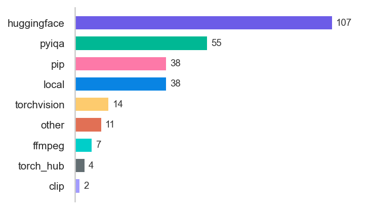
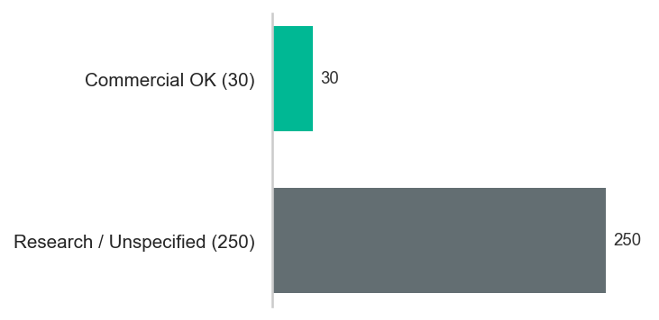
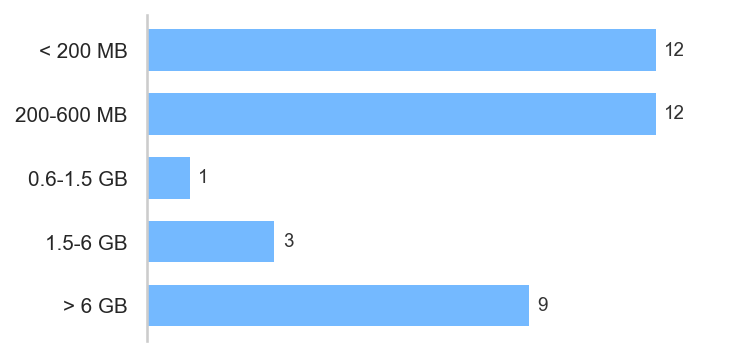
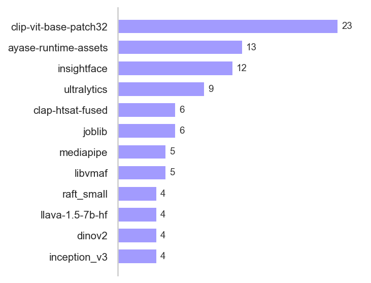

# Ayase Models Reference

> **Version 0.1.64** · Generated 2026-07-10 22:40 · **214 models** across **10 sources**
>
> `ayase modules models -o MODELS.md` to regenerate

## Summary

**214** models · **77** HuggingFace · **54** pyiqa · **10** sources

*License labels in this document cover model weights and runtime assets referenced by Ayase modules.*
*They do not describe the license of Ayase source code or vendored third-party source trees.*
*Resolution order: hardcoded source mappings, HuggingFace metadata when available, then parent-repo inheritance for weight files.*

<table width="100%"><tr>
<td width="50%" valign="top"><h4>Models by Source</h4></td>
<td width="50%" valign="top"><h4>License Distribution</h4></td>
</tr></table>

<table width="100%"><tr>
<td width="50%" valign="top"><h4>VRAM Tiers</h4></td>
<td width="50%" valign="top"><h4>Top Used Models</h4></td>
</tr></table>

**Estimated total download size (all models):** ~473 GB

*Note: Most modules auto-download only the models they need on first use. You rarely need all models at once.*

> [!WARNING]
> **Commercial use:** Stick to modules whose models are marked "Commercial OK" above. Most pyiqa metrics marked "research" are re-implementations under pyiqa's MIT license, but the original training data or architecture may carry restrictions — verify before commercial deployment.

<a id="categories"></a>

[HuggingFace (52)](#huggingface-models) · [Weight Files (25)](#weight-file-repos) · [pyiqa (54)](#pyiqa-metrics) · [torchvision (11)](#torchvision-models) · [CLIP / OpenCLIP (2)](#clip--openclip) · [torch.hub (5)](#torchhub) · [FFmpeg (7)](#ffmpeg) · [pip Packages (15)](#pip-packages) · [Quick Install Guide](#quick-install-guide)

---

## HuggingFace Models

### <a href="https://huggingface.co/AkaneTendo25/ayase-models" target="_blank">`AkaneTendo25/ayase-models`</a> [↑](#categories)
> mit

- **Used by**: `rqvqa`

### <a href="https://huggingface.co/ByteDance/EvoQuality" target="_blank">`ByteDance/EvoQuality`</a> [↑](#categories)
> image-text-to-text · apache-2.0

- **Used by**: `evoquality`
- **Parameters**: 8.3B · **Downloads**: 632
- **Disk**: ~30.9 GB
- **Source**: <a href="https://arxiv.org/abs/2509.25787" target="_blank">arXiv</a>

### <a href="https://huggingface.co/ByteDance/Q-Insight" target="_blank">`ByteDance/Q-Insight`</a> [↑](#categories)
> apache-2.0

- **Used by**: `vqinsight`
- **Source**: <a href="https://arxiv.org/abs/2503.22679" target="_blank">arXiv</a>

### <a href="https://huggingface.co/Falconsai/nsfw_image_detection" target="_blank">`Falconsai/nsfw_image_detection`</a> [↑](#categories)
> image-classification · apache-2.0

- **Used by**: `nsfw`
- **Parameters**: 86M · **Downloads**: 9.3M
- **Disk**: ~327 MB
- **Source**: <a href="https://arxiv.org/abs/2010.11929" target="_blank">arXiv</a>

### <a href="https://huggingface.co/FunAudioLLM/SenseVoiceSmall" target="_blank">`FunAudioLLM/SenseVoiceSmall`</a> [↑](#categories)
> automatic-speech-recognition · other

- **Used by**: `verse_bench`
- **Downloads**: 16K

### <a href="https://huggingface.co/GD-ML/VMBench" target="_blank">`GD-ML/VMBench`</a> [↑](#categories)
> apache-2.0

- **Used by**: `vmbench_cas`, `vmbench_pas`, `vmbench_tcs`
- **Source**: <a href="https://arxiv.org/abs/2503.10076" target="_blank">arXiv</a>

### <a href="https://huggingface.co/IDEA-Research/grounding-dino-tiny" target="_blank">`IDEA-Research/grounding-dino-tiny`</a> [↑](#categories)
> zero-shot-object-detection · apache-2.0

- **Used by**: `opens2v`
- **Parameters**: 172M · **Downloads**: 1.7M
- **Disk**: ~657 MB
- **Source**: <a href="https://arxiv.org/abs/2303.05499" target="_blank">arXiv</a>

### <a href="https://huggingface.co/IntMeGroup/AIGV-Assessor-static_quality" target="_blank">`IntMeGroup/AIGV-Assessor-static_quality`</a> [↑](#categories)
> apache-2.0

- **Used by**: `aigv_assessor`
- **Parameters**: 8.2B · **Downloads**: 3
- **Disk**: ~30.4 GB

### <a href="https://huggingface.co/IntMeGroup/FineVQ_score" target="_blank">`IntMeGroup/FineVQ_score`</a> [↑](#categories)
> apache-2.0

- **Used by**: `finevq`
- **Parameters**: 8.2B · **Downloads**: 1K
- **Disk**: ~30.5 GB

### <a href="https://huggingface.co/KlingTeam/VideoReward" target="_blank">`KlingTeam/VideoReward`</a> [↑](#categories)
> apache-2.0

- **Used by**: `video_reward`
- **Source**: <a href="https://arxiv.org/abs/2501.13918" target="_blank">arXiv</a>

### <a href="https://huggingface.co/KwaiVGI/VideoReward" target="_blank">`KwaiVGI/VideoReward`</a> [↑](#categories)
> apache-2.0

- **Used by**: `video_reward`
- **Source**: <a href="https://arxiv.org/abs/2501.13918" target="_blank">arXiv</a>

### <a href="https://huggingface.co/MCG-NJU/videomae-large-finetuned-kinetics" target="_blank">`MCG-NJU/videomae-large-finetuned-kinetics`</a> [↑](#categories)
> video-classification · cc-by-nc-4.0

- **Used by**: `action_recognition`
- **Parameters**: 304M · **Downloads**: 12K
- **VRAM**: ~1.5 GB · **Disk**: ~1.3 GB
- **Source**: <a href="https://arxiv.org/abs/2203.12602" target="_blank">arXiv</a>

### <a href="https://huggingface.co/MizzenAI/HPSv3" target="_blank">`MizzenAI/HPSv3`</a> [↑](#categories)
> image-text-to-text · apache-2.0

- **Used by**: `hpsv3`
- **Downloads**: 119
- **Source**: <a href="https://arxiv.org/abs/2508.03789" target="_blank">arXiv</a>

### <a href="https://huggingface.co/OpenMuQ/MuQ-large-msd-iter" target="_blank">`OpenMuQ/MuQ-large-msd-iter`</a> [↑](#categories)
> audio-classification · cc-by-nc-4.0

- **Used by**: `song_eval`
- **Parameters**: 333M · **Downloads**: 319K
- **Disk**: ~1.2 GB
- **Source**: <a href="https://arxiv.org/abs/2501.01108" target="_blank">arXiv</a>

### <a href="https://huggingface.co/Qwen/Qwen-Image-Bench" target="_blank">`Qwen/Qwen-Image-Bench`</a> [↑](#categories)
> image-text-to-text · apache-2.0

- **Used by**: `qwen_image_bench`
- **Parameters**: 27.4B · **Downloads**: 27K
- **Disk**: ~101.9 GB
- **Source**: <a href="https://arxiv.org/abs/2605.28091" target="_blank">arXiv</a>

### <a href="https://huggingface.co/Qwen/Qwen2-VL-7B-Instruct" target="_blank">`Qwen/Qwen2-VL-7B-Instruct`</a> [↑](#categories)
> image-text-to-text · apache-2.0

- **Used by**: `hpsv3`
- **Parameters**: 8.3B · **Downloads**: 1.8M
- **VRAM**: ~16 GB · **Disk**: ~15 GB
- **Source**: <a href="https://arxiv.org/abs/2409.12191" target="_blank">arXiv</a>

### <a href="https://huggingface.co/Qwen/Qwen2.5-Omni-7B" target="_blank">`Qwen/Qwen2.5-Omni-7B`</a> [↑](#categories)
> any-to-any · other

- **Used by**: `aqascore`
- **Parameters**: 10.7B · **Downloads**: 567K
- **Disk**: ~40.0 GB
- **Source**: <a href="https://arxiv.org/abs/2503.20215" target="_blank">arXiv</a>

### <a href="https://huggingface.co/Qwen/Qwen2.5-VL-7B-Instruct" target="_blank">`Qwen/Qwen2.5-VL-7B-Instruct`</a> [↑](#categories)
> image-text-to-text · apache-2.0

- **Used by**: `camerabench`
- **Parameters**: 8.3B · **Downloads**: 10.3M
- **Disk**: ~30.9 GB
- **Source**: <a href="https://arxiv.org/abs/2309.00071" target="_blank">arXiv</a>

### <a href="https://huggingface.co/Salesforce/blip-image-captioning-base" target="_blank">`Salesforce/blip-image-captioning-base`</a> [↑](#categories)
> image-to-text · bsd-3-clause

- **Used by**: `captioning`
- **Downloads**: 1.7M
- **VRAM**: ~1 GB · **Disk**: ~990 MB
- **Source**: <a href="https://arxiv.org/abs/2201.12086" target="_blank">arXiv</a>

### <a href="https://huggingface.co/Salesforce/blip-itm-large-coco" target="_blank">`Salesforce/blip-itm-large-coco`</a> [↑](#categories)
> bsd-3-clause

- **Used by**: `blip_score`
- **Downloads**: 7K
- **Source**: <a href="https://arxiv.org/abs/2201.12086" target="_blank">arXiv</a>

### <a href="https://huggingface.co/THUDM/VisionReward-Image" target="_blank">`THUDM/VisionReward-Image`</a> [↑](#categories)
> text-generation · other

- **Used by**: `vision_reward`

### <a href="https://huggingface.co/THUDM/VisionReward-Video" target="_blank">`THUDM/VisionReward-Video`</a> [↑](#categories)
> text-generation · other

- **Used by**: `vision_reward`
- **Parameters**: 12.5B · **Downloads**: 2K
- **Disk**: ~46.6 GB

### <a href="https://huggingface.co/TIGER-Lab/VideoScore" target="_blank">`TIGER-Lab/VideoScore`</a> [↑](#categories)
> visual-question-answering · apache-2.0

- **Used by**: `videoscore`
- **Parameters**: 8.3B · **Downloads**: 271
- **VRAM**: ~14 GB · **Disk**: ~14 GB
- **Source**: <a href="https://arxiv.org/abs/2406.15252" target="_blank">arXiv</a>

### <a href="https://huggingface.co/TIGER-Lab/VideoScore2" target="_blank">`TIGER-Lab/VideoScore2`</a> [↑](#categories)
> visual-question-answering · apache-2.0

- **Used by**: `videoscore2`
- **Parameters**: 8.3B · **Downloads**: 4K
- **VRAM**: ~16 GB · **Disk**: ~15 GB
- **Source**: <a href="https://arxiv.org/abs/2509.22799" target="_blank">arXiv</a>

### <a href="https://huggingface.co/ai-forever/kandinsky-video-motion-predictor" target="_blank">`ai-forever/kandinsky-video-motion-predictor`</a> [↑](#categories)

- **Used by**: `kandinsky_motion`
- **Downloads**: 6K

### <a href="https://huggingface.co/chancharikm/qwen2.5-vl-7b-cam-motion" target="_blank">`chancharikm/qwen2.5-vl-7b-cam-motion`</a> [↑](#categories)
> video-text-to-text · other

- **Used by**: `camerabench`
- **Parameters**: 8.3B · **Downloads**: 549
- **Disk**: ~30.9 GB
- **Source**: <a href="https://arxiv.org/abs/2404.01291" target="_blank">arXiv</a>

### <a href="https://huggingface.co/cromsc/nima-mobilenet-aesthetic" target="_blank">`cromsc/nima-mobilenet-aesthetic`</a> [↑](#categories)

- **Used by**: `nima_legacy_onnx`

### <a href="https://huggingface.co/dandelin/vilt-b32-finetuned-vqa" target="_blank">`dandelin/vilt-b32-finetuned-vqa`</a> [↑](#categories)
> visual-question-answering · apache-2.0

- **Used by**: `commonsense`, `tifa`
- **Downloads**: 94K
- **VRAM**: ~500 MB · **Disk**: ~450 MB
- **Source**: <a href="https://arxiv.org/abs/2102.03334" target="_blank">arXiv</a>

### <a href="https://huggingface.co/depth-anything/Depth-Anything-V2-Small-hf" target="_blank">`depth-anything/Depth-Anything-V2-Small-hf`</a> [↑](#categories)
> depth-estimation · apache-2.0

- **Used by**: `depth_anything`
- **Parameters**: 25M · **Downloads**: 1.7M
- **VRAM**: ~200 MB · **Disk**: ~100 MB
- **Source**: <a href="https://arxiv.org/abs/2406.09414" target="_blank">arXiv</a>

### <a href="https://huggingface.co/facebook/VGGT-1B" target="_blank">`facebook/VGGT-1B`</a> [↑](#categories)
> image-to-3d · cc-by-nc-4.0

- **Used by**: `camera_trajectory`
- **Parameters**: 1.3B · **Downloads**: 306K
- **Disk**: ~4.7 GB
- **Source**: <a href="https://arxiv.org/abs/2503.11651" target="_blank">arXiv</a>

### <a href="https://huggingface.co/facebook/dinov2-base" target="_blank">`facebook/dinov2-base`</a> [↑](#categories)
> image-feature-extraction · apache-2.0

- **Used by**: `entitybench`, `fvd`, `subject_consistency`
- **Parameters**: 87M · **Downloads**: 1.6M
- **Disk**: ~330 MB
- **Source**: <a href="https://arxiv.org/abs/2304.07193" target="_blank">arXiv</a>

### <a href="https://huggingface.co/facebook/dinov2-large" target="_blank">`facebook/dinov2-large`</a> [↑](#categories)
> image-feature-extraction · apache-2.0

- **Used by**: `prdc_dinov2`, `verse_bench`
- **Parameters**: 304M · **Downloads**: 996K
- **Disk**: ~1.1 GB
- **Source**: <a href="https://arxiv.org/abs/2304.07193" target="_blank">arXiv</a>

### <a href="https://huggingface.co/facebook/vjepa2-vitg-fpc64-256" target="_blank">`facebook/vjepa2-vitg-fpc64-256`</a> [↑](#categories)
> video-classification · apache-2.0

- **Used by**: `jedi`, `jedi_metric`
- **Parameters**: 1.0B · **Downloads**: 136K
- **Disk**: ~3.9 GB

### `fsmn-vad` [↑](#categories)

- **Used by**: `verse_bench`

### <a href="https://huggingface.co/google/siglip-so400m-patch14-384" target="_blank">`google/siglip-so400m-patch14-384`</a> [↑](#categories)
> zero-shot-image-classification · apache-2.0

- **Used by**: `verse_bench`
- **Parameters**: 878M · **Downloads**: 1.8M
- **Disk**: ~3.3 GB
- **Source**: <a href="https://arxiv.org/abs/2303.15343" target="_blank">arXiv</a>

### <a href="https://huggingface.co/laion/CLIP-ViT-H-14-laion2B-s32B-b79K" target="_blank">`laion/CLIP-ViT-H-14-laion2B-s32B-b79K`</a> [↑](#categories)
> zero-shot-image-classification · mit

- **Used by**: `pickscore`
- **Parameters**: 986M · **Downloads**: 452K
- **Disk**: ~3.7 GB
- **Source**: <a href="https://arxiv.org/abs/1910.04867" target="_blank">arXiv</a>

### <a href="https://huggingface.co/laion/clap-htsat-fused" target="_blank">`laion/clap-htsat-fused`</a> [↑](#categories)
> audio-classification · apache-2.0

- **Used by**: `audio_text_alignment`, `clap_score`, `human_clap`, `laion_clap_score`, `ms_clap_score`, `pam`
- **Parameters**: 154M · **Downloads**: 12.5M
- **VRAM**: ~600 MB · **Disk**: ~600 MB
- **Source**: <a href="https://arxiv.org/abs/2211.06687" target="_blank">arXiv</a>

### <a href="https://huggingface.co/lero233/KVQ" target="_blank">`lero233/KVQ`</a> [↑](#categories)

- **Used by**: `kvq`

### <a href="https://huggingface.co/llava-hf/LLaVA-NeXT-Video-7B-hf" target="_blank">`llava-hf/LLaVA-NeXT-Video-7B-hf`</a> [↑](#categories)
> video-text-to-text · llama2

- **Used by**: `videophy`
- **Parameters**: 7.1B · **Downloads**: 188K
- **Disk**: ~26.3 GB
- **Source**: <a href="https://arxiv.org/abs/2405.21075" target="_blank">arXiv</a>

### <a href="https://huggingface.co/llava-hf/llava-1.5-7b-hf" target="_blank">`llava-hf/llava-1.5-7b-hf`</a> [↑](#categories)
> image-text-to-text · llama2

- **Used by**: `commonsense`, `creativity`, `opens2v`, `vlm_judge`
- **Parameters**: 7.1B · **Downloads**: 3.3M
- **VRAM**: ~14 GB · **Disk**: ~14 GB

### <a href="https://huggingface.co/llava-hf/llava-v1.6-mistral-7b-hf" target="_blank">`llava-hf/llava-v1.6-mistral-7b-hf`</a> [↑](#categories)
> image-text-to-text · apache-2.0

- **Used by**: `llm_descriptive_qa`
- **Parameters**: 7.6B · **Downloads**: 628K
- **VRAM**: ~14 GB · **Disk**: ~14 GB
- **Source**: <a href="https://arxiv.org/abs/2310.03744" target="_blank">arXiv</a>

### <a href="https://huggingface.co/microsoft/msclap" target="_blank">`microsoft/msclap`</a> [↑](#categories)
> ms-pl

- **Used by**: `ms_clap_score`
- **Source**: <a href="https://arxiv.org/abs/2309.05767" target="_blank">arXiv</a>

### <a href="https://huggingface.co/microsoft/xclip-base-patch32" target="_blank">`microsoft/xclip-base-patch32`</a> [↑](#categories)
> video-classification · mit

- **Used by**: `embedding`, `video_text_matching`
- **Parameters**: 197M · **Downloads**: 100K
- **VRAM**: ~600 MB · **Disk**: ~600 MB
- **Source**: <a href="https://arxiv.org/abs/2208.02816" target="_blank">arXiv</a>

### <a href="https://huggingface.co/nvidia/quality-classifier-deberta" target="_blank">`nvidia/quality-classifier-deberta`</a> [↑](#categories)
> apache-2.0

- **Used by**: `nemo_curator`
- **Parameters**: 184M · **Downloads**: 3K
- **Disk**: ~701 MB
- **Source**: <a href="https://arxiv.org/abs/2111.09543" target="_blank">arXiv</a>

### <a href="https://huggingface.co/nvidia/segformer-b0-finetuned-ade-512-512" target="_blank">`nvidia/segformer-b0-finetuned-ade-512-512`</a> [↑](#categories)
> image-segmentation · other

- **Used by**: `semantic_segmentation_consistency`
- **Parameters**: 4M · **Downloads**: 352K
- **Disk**: ~14 MB
- **Source**: <a href="https://arxiv.org/abs/2105.15203" target="_blank">arXiv</a>

### <a href="https://huggingface.co/openai/clip-vit-base-patch32" target="_blank">`openai/clip-vit-base-patch32`</a> [↑](#categories)
> zero-shot-image-classification

- **Used by**: `action_recognition`, `background_consistency`, `clifvqa`, `clip_image_similarity`, `clip_temporal`, `concept_presence`, `creativity`, `dataset_analytics`, `deepfake_detection`, `entitybench`, `generative_distribution`, `geneval`, `harmful_content`, `opens2v`, `scene_tagging`, `sd_reference`, `semantic_alignment`, `tc_bench`, `umap_projection`, `video_text_matching`, `video_type_classifier`, `world_consistency`
- **Downloads**: 23.9M
- **VRAM**: ~600 MB · **Disk**: ~600 MB
- **Source**: <a href="https://arxiv.org/abs/2103.00020" target="_blank">arXiv</a>

### <a href="https://huggingface.co/openai/clip-vit-large-patch14" target="_blank">`openai/clip-vit-large-patch14`</a> [↑](#categories)
> zero-shot-image-classification

- **Used by**: `aesthetic_scoring`
- **Parameters**: 428M · **Downloads**: 13.1M
- **VRAM**: ~1.5 GB · **Disk**: ~1.7 GB
- **Source**: <a href="https://arxiv.org/abs/2103.00020" target="_blank">arXiv</a>

### <a href="https://huggingface.co/openai/clip-vit-large-patch14-336" target="_blank">`openai/clip-vit-large-patch14-336`</a> [↑](#categories)
> zero-shot-image-classification

- **Used by**: `cmmd`
- **Downloads**: 4.1M

### <a href="https://huggingface.co/q-future/one-align" target="_blank">`q-future/one-align`</a> [↑](#categories)
> zero-shot-image-classification · mit

- **Used by**: `q_align`, `vmbench_mss`
- **Downloads**: 195K
- **Source**: <a href="https://arxiv.org/abs/2312.17090" target="_blank">arXiv</a>

### `roberta-base` [↑](#categories)

- **Used by**: `verse_bench`

### <a href="https://huggingface.co/stabilityai/stable-diffusion-xl-base-1.0" target="_blank">`stabilityai/stable-diffusion-xl-base-1.0`</a> [↑](#categories)
> text-to-image · openrail++

- **Used by**: `sd_reference`
- **Downloads**: 1.4M
- **Source**: <a href="https://arxiv.org/abs/2307.01952" target="_blank">arXiv</a>

### <a href="https://huggingface.co/yuvalkirstain/PickScore_v1" target="_blank">`yuvalkirstain/PickScore_v1`</a> [↑](#categories)
> zero-shot-image-classification

- **Used by**: `pickscore`
- **Parameters**: 986M · **Downloads**: 2.7M
- **Disk**: ~3.7 GB
- **Source**: <a href="https://arxiv.org/abs/2305.01569" target="_blank">arXiv</a>

## Weight File Repos

### <a href="https://huggingface.co/AkaneTendo25/ayase-models" target="_blank">`AkaneTendo25/ayase-models`</a> [↑](#categories)
> Pre-trained weight files for ayase modules

- `24-01-04T16-39-21.pt` — used by `audio_visual_sync`, `av_desync`, `av_sync`
- `CLIPIQA+_ViTL14_512-e66488f2.pth` — used by `brightrate`
- `CONTRIQUE_checkpoint25.tar` — used by `brightrate`
- `DOVER.pth` — used by `dover`
- `FAST_VQA_3D_1_1.pth` — used by `fast_vqa`
- `FAST_VQA_B_1_4.pth` — used by `fast_vqa`
- `FAST_VQA_M_1_4.pth` — used by `fast_vqa`
- `SAMA-baseline_val-ltest_s_dev_v0.0.pth` — used by `sama`
- `ViT-B-32.safetensors` — used by `brightrate`
- `ViT-B-32.safetensors` — used by `i2v_similarity`
- `ViT-L-14.safetensors` — used by `brightrate`
- `alex.pth` — used by `i2v_similarity`
- `brightrate_brightvq.pt` — used by `brightrate`
- `convnext_tiny_1k_224_ema.pth` — used by `dover`
- `dino_vitbase16_pretrain.pth` — used by `dreamsim`, `dreamsim_metric`
- `dinov2_vitb14_pretrain.pth` — used by `i2v_similarity`
- `flownet.pkl` — used by `motion_smoothness`
- `frames_modelparameters.mat` — used by `brightrate`
- `imagebind_huge.pth` — used by `imagebind_score`
- `nisqa.tar` — used by `audio_nisqa`
- `onnx_dover.onnx` — used by `dover`
- `rtmpose_m.onnx` — used by `object_integrity`
- `sac+logos+ava1-l14-linearMSE.pth` — used by `aesthetic_scoring`
- `yolox_m.onnx` — used by `object_integrity`

### <a href="https://huggingface.co/cromsc/nima-mobilenet-aesthetic" target="_blank">`cromsc/nima-mobilenet-aesthetic`</a> [↑](#categories)
> Pre-trained weight files for ayase modules

- `nima_mobilenet_aesthetic.onnx` — used by `nima_legacy_onnx`

## pyiqa Metrics (54)

<a href="https://github.com/chaofengc/IQA-PyTorch" target="_blank">pyiqa</a> is an MIT-licensed collection of image/video quality metrics. Weights auto-download on first `pyiqa.create_metric()` call. `pip install pyiqa`

| Metric | Task | License | Commercial | Used By |
|--------|------|---------|------------|---------|
| `afine` | Adaptive fidelity-naturalness IQA | research | — | `afine` |
| `afine_nr` | A-FINE NR fidelity-naturalness | research | — | `afine` |
| `ahiq` | Attention-based hybrid FR-IQA | research | — | `ahiq` |
| `arniqa` | Artifact-aware NR-IQA | research | — | `arniqa` |
| `brisque` | Blind naturalness statistics NR-IQA | BSD-2-Clause (OpenCV) | Yes | `brisque`, `naturalness` |
| `bvqi` | Zero-shot blind VQA | research | — | `bvqi` |
| `ckdn` | Conditional knowledge distillation FR-IQA | research | — | `ckdn` |
| `clip_iqa` | CLIP image quality assessment | research | — | `clip_iqa` |
| `clipiqa+` | CLIP-based image quality assessment | MIT (pyiqa) | Yes | `clip_iqa` |
| `cnniqa` | CNN-based blind image quality | research | — | `cnniqa` |
| `compare2score` | Comparative-to-absolute quality scoring | research | — | `compare2score` |
| `contrique` | Contrastive image quality representation | research | — | `contrique` |
| `conviqt` | Contrastive NR-VQA | research | — | `conviqt` |
| `creativity` | Creative quality assessment | research | — | `creativity` |
| `cw_ssim` | Complex wavelet SSIM | MIT (pyiqa) | Yes | `cw_ssim` |
| `dbcnn` | Deep bilinear CNN for blind IQA | research | — | `dbcnn` |
| `deepdc` | Deep distribution conformance | research | — | `deepdc` |
| `deepwsd` | Deep Wasserstein distance IQA | research | — | `deepwsd` |
| `dmm` | Detail model metric FR-IQA | research | — | `dmm` |
| `dover` | pyiqa DOVER fallback metric | MIT (pyiqa) | Yes | `dover` |
| `face_iqa` | TOPIQ face-specific quality | research | — | `face_iqa` |
| `hyperiqa` | Adaptive hypernetwork NR-IQA | research | — | `hyperiqa` |
| `ilniqe` | Integrated local NIQE | BSD-2-Clause | Yes | `ilniqe` |
| `laion_aes` | LAION aesthetic scoring (CLIP-based) | MIT | Yes | `creativity`, `laion_aesthetic` |
| `laion_aesthetic` | LAION Aesthetics V2 predictor | research | — | `laion_aesthetic` |
| `liqe` | Learned image quality evaluator (multi-task) | research | — | `liqe` |
| `maclip` | Multi-attribute CLIP quality scoring | research | — | `maclip` |
| `mad` | Most apparent distortion FR-IQA | research | — | `mad` |
| `maniqa` | Multi-dimension attention NR-IQA | Apache-2.0 | Yes | `maniqa` |
| `mdtvsfa` | Multi-dimensional temporal-spatial VQA | research | — | `mdtvsfa` |
| `msswd` | Multi-scale sliced Wasserstein distance | research | — | `msswd` |
| `musiq` | Multi-scale image quality transformer | Apache-2.0 (Google) | Yes | `musiq` |
| `naturalness` | Natural scene statistics | research | — | `naturalness` |
| `nima` | Neural image assessment (aesthetic + technical) | Apache-2.0 (Google) | Yes | `nima` |
| `niqe` | Natural image quality evaluator (statistics-based) | BSD-2-Clause (OpenCV) | Yes | `niqe` |
| `nlpd` | Normalized Laplacian pyramid distance | research | — | `nlpd` |
| `nrqm` | No-reference quality metric | research | — | `nrqm` |
| `paq2piq` | Patches-as-questions for image quality | research | — | `paq2piq` |
| `pi` | Perceptual index (PIRM challenge) | research | — | `pi` |
| `pieapp` | Pairwise learned perceptual distance | research | — | `pieapp` |
| `piqe` | Perception-based blind NR-IQA | BSD-2-Clause | Yes | `piqe` |
| `promptiqa` | Few-shot prompt-based NR-IQA | research | — | `promptiqa` |
| `qcn` | Geometric order blind IQA | research | — | `qcn` |
| `qualiclip` | Quality-aware CLIP embeddings | research | — | `qualiclip` |
| `ssimc` | Complex wavelet SSIM-C FR | MIT (pyiqa) | Yes | `ssimc` |
| `topiq` | TOPIQ transformer quality | research | — | `topiq` |
| `topiq_fr` | Transformer-based FR image quality | MIT (pyiqa) | Yes | `topiq_fr` |
| `topiq_nr` | Transformer-based NR image quality | MIT (pyiqa) | Yes | `topiq` |
| `topiq_nr-face` | TOPIQ face-specific quality | MIT (pyiqa) | Yes | `face_iqa` |
| `tres` | Transformer relative quality estimation | research | — | `tres` |
| `unique` | Unified NR-IQA with contrastive learning | research | — | `unique` |
| `wadiqam` | Weighted average deep IQA | research | — | `wadiqam` |
| `wadiqam_fr` | Weighted average deep FR-IQA | research | — | `wadiqam_fr` |
| `wadiqam_nr` | Weighted average deep NR-IQA | research | — | `wadiqam` |

## torchvision Models

Bundled with `pip install torchvision`. Weights download on first use.

### `torchvision/idefics2` [↑](#categories)
> torchvision

- **Used by**: `videoscore`

### `torchvision/imagebind_model` [↑](#categories)
> torchvision

- **Used by**: `imagebind_score`

### `torchvision/inception_v3` [↑](#categories)
> torchvision · BSD-3-Clause

- **Used by**: `fid`, `inception_score`, `kid`, `sfid`
- **VRAM**: ~200 MB · **Disk**: ~100 MB

### `torchvision/r3d_18` [↑](#categories)
> torchvision · BSD-3-Clause

- **Used by**: `fvd`
- **VRAM**: ~200 MB · **Disk**: ~130 MB

### `torchvision/raft_large` [↑](#categories)
> torchvision · BSD-3-Clause

- **Used by**: `advanced_flow`, `raft_motion`
- **VRAM**: ~200 MB · **Disk**: ~20 MB

### `torchvision/raft_small` [↑](#categories)
> torchvision · BSD-3-Clause

- **Used by**: `advanced_flow`, `flolpips`, `motion_amplitude`, `temporal_flickering`
- **VRAM**: ~100 MB · **Disk**: ~20 MB

### `torchvision/resnet18` [↑](#categories)
> torchvision · BSD-3-Clause

- **Used by**: `tlvqm`
- **VRAM**: ~100 MB · **Disk**: ~45 MB

### `torchvision/resnet50` [↑](#categories)
> torchvision

- **Used by**: `grafiqs`, `modularbvqa`, `vsfa`, `watermark_classifier`

### `torchvision/inception_v3` [↑](#categories)
> torchvision · BSD-3-Clause

- **Used by**: `fid`, `kid`, `sfid`

### `torchvision/r3d_18` [↑](#categories)
> torchvision · BSD-3-Clause

- **Used by**: `fvd`, `kvd`

### `torchvision/vggt` [↑](#categories)
> torchvision

- **Used by**: `camera_trajectory`

## CLIP / OpenCLIP

### `CLIP ViT-B-32` [↑](#categories)

- **Used by**: `i2v_similarity`

### `open_clip/ViT-B-32` [↑](#categories)

- **Used by**: `semantic_alignment`

## torch.hub

### `facebookresearch/co-tracker` [↑](#categories)
> torch.hub · Apache-2.0

- **Used by**: `chronomagic`, `dynamics_controllability`, `physics`

### `facebookresearch/dinov2` [↑](#categories)
> torch.hub · Apache-2.0

- **Used by**: `dino_face_identity`, `opens2v`, `spectral_complexity`, `world_consistency`

### `intel-isl/MiDaS` [↑](#categories)
> torch.hub · MIT

- **Used by**: `depth_consistency`, `depth_map_quality`
- **VRAM**: ~400 MB · **Disk**: ~400 MB

### `sarulab-speech/UTMOSv2` [↑](#categories)
> torch.hub

- **Used by**: `audio_utmos_v2`

### `tarepan/SpeechMOS:v1.2.0` [↑](#categories)
> torch.hub · MIT

- **Used by**: `audio_utmos`
- **VRAM**: ~200 MB · **Disk**: ~100 MB

## FFmpeg

Require FFmpeg compiled with libvmaf. No separate download needed.

### `ffmpeg/cambi` [↑](#categories)
> built-in · BSD-2-Clause (Netflix)

- **Used by**: `cambi`

### `ffmpeg/libvmaf` [↑](#categories)
> built-in · BSD-2-Clause (Netflix)

- **Used by**: `cambi`, `vmaf`, `vmaf_4k`, `vmaf_neg`, `vmaf_phone`

### `ffmpeg/vmaf_4k_v0.6.1` [↑](#categories)
> built-in · BSD-2-Clause (Netflix)

- **Used by**: `vmaf_4k`

### `ffmpeg/vmaf_phone_model` [↑](#categories)
> built-in · BSD-2-Clause (Netflix)

- **Used by**: `vmaf_phone`

### `ffmpeg/vmaf_v0.6.1` [↑](#categories)
> built-in · BSD-2-Clause (Netflix)

- **Used by**: `vmaf_neg`, `vmaf_phone`

### `ffmpeg/vmaf_v0.6.1neg` [↑](#categories)
> built-in · BSD-2-Clause (Netflix)

- **Used by**: `vmaf_neg`

### `ffmpeg/xpsnr` [↑](#categories)
> built-in · BSD (FFmpeg)

- **Used by**: `xpsnr`

## pip Packages

### `aesthetic-predictor-v2-5` [↑](#categories)
> Aesthetic Predictor V2.5 (SigLIP)

- **Used by**: `aesthetic`
- **Install**: `pip install aesthetic-predictor-v2-5`

### `deepface` [↑](#categories)
> DeepFace (face recognition/verification)

- **Used by**: `celebrity_id`, `face_cross_similarity`, `identity_loss`
- **Install**: `pip install deepface`

### `dreamsim` [↑](#categories)
> DreamSim CLIP+DINO similarity

- **Used by**: `dreamsim`
- **Install**: `pip install dreamsim`

### `erqa` [↑](#categories)
> ERQA edge restoration quality

- **Used by**: `erqa`
- **Install**: `pip install erqa`

### `fasttext` [↑](#categories)
> FastText (text classification)

- **Used by**: `nemo_curator`
- **Install**: `pip install fasttext`

### `insightface` [↑](#categories)
> InsightFace (face recognition)

- **Used by**: `concept_presence`, `dino_face_identity`, `entitybench`, `face_cross_similarity`, `grafiqs`, `identity_loss`, `magface`
- **Install**: `pip install insightface`

### `joblib` [↑](#categories)
> Joblib (serialized model storage)

- **Used by**: `brightrate`, `chipqa`, `hdr_chipqa`, `hdrmax`, `tlvqm`, `videval`
- **Install**: `pip install joblib`

### `jxlpy` [↑](#categories)
> JPEG XL codec library

- **Used by**: `butteraugli`
- **Install**: `pip install jxlpy`

### `mediapipe` [↑](#categories)
> MediaPipe (face/pose/hand detection)

- **Used by**: `anatomy_check`, `concept_presence`, `face_fidelity`, `face_landmark_quality`, `human_fidelity`
- **Install**: `pip install mediapipe`

### `onnxruntime` [↑](#categories)
> ONNX Runtime (model inference)

- **Used by**: `dover`, `nima_legacy_onnx`
- **Install**: `pip install onnxruntime`

### `piq` [↑](#categories)
> piq (PyTorch Image Quality)

- **Used by**: `dists`, `perceptual_fr`, `vif`
- **Install**: `pip install piq`

### `ptlflow` [↑](#categories)
> ptlflow optical flow models

- **Used by**: `ptlflow_motion`
- **Install**: `pip install ptlflow`

### `stlpips-pytorch` [↑](#categories)
> ST-LPIPS spatiotemporal perceptual

- **Used by**: `st_lpips`
- **Install**: `pip install stlpips-pytorch`

### `torchmetrics[audio]` [↑](#categories)
> TorchMetrics (DNSMOS, etc.)

- **Used by**: `dnsmos`
- **Install**: `pip install torchmetrics[audio]`

### `ultralytics` [↑](#categories)
> YOLOv8 object detection

- **Used by**: `geneval`, `object_detection`, `object_integrity`, `object_permanence`, `opens2v`, `rtmpose_fidelity`, `t2v_compbench`
- **Install**: `pip install ultralytics`

## Quick Install Guide

Install Ayase with the bundled runtime dependencies:

```bash
pip install ayase
```
